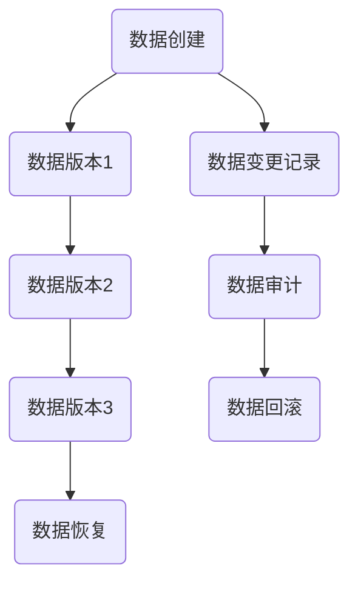

                 

关键词：数据版本管理、数据谱系、版本控制、Git、数据库、算法、代码实战、数据模型、数据迁移、分布式系统、技术实践。

> 摘要：本文将深入探讨数据版本管理与数据谱系原理，通过实际案例和代码实战，详细介绍其应用和实现，为读者提供全面的指导和实战经验。

## 1. 背景介绍

在当今快速发展的数字时代，数据成为了企业和组织的核心资产。然而，随着数据的不断增长和复杂性的增加，如何有效地管理数据版本和谱系成为了重要的挑战。数据版本管理不仅涉及到数据的备份与恢复，还包括了数据的同步、更新和追溯。而数据谱系原理则为我们提供了一种理解数据历史和演变的方法。

### 1.1 数据版本管理的挑战

- 数据量庞大：企业系统中存储的数据量日益增长，管理这些数据变得愈加复杂。
- 数据一致性：确保所有副本的数据保持一致，是一个挑战，特别是在分布式系统中。
- 数据追溯：在处理和变更数据时，如何快速追溯历史版本和变更记录，以便在出现问题时能够回滚到之前的状态。

### 1.2 数据谱系原理的重要性

数据谱系原理通过记录数据的历史变化，帮助我们理解数据如何在不同的时间点和版本之间演变。它对于以下场景尤为重要：

- 数据审计：能够追踪数据的来源和变更历史，便于进行审计。
- 数据恢复：在数据出现错误或丢失时，可以回滚到之前的版本，减少损失。
- 数据分析：通过分析数据谱系，可以揭示数据背后的业务逻辑和用户行为。

## 2. 核心概念与联系

### 2.1 核心概念

- **数据版本管理**：通过控制数据的版本，实现对数据变更的追踪和管理。
- **数据谱系**：记录数据从创建到变更的全过程，包括版本号、时间戳、操作者等信息。

### 2.2 架构图解

以下是数据版本管理与数据谱系原理的Mermaid流程图：



## 3. 核心算法原理 & 具体操作步骤

### 3.1 算法原理概述

数据版本管理算法通常基于以下原理：

- **版本控制**：使用版本号来标识数据的每次变更。
- **历史记录**：记录每次变更的时间、操作者、变更内容等信息。
- **并行处理**：在分布式系统中，允许多个节点同时对数据执行操作，并通过协议保证一致性。

### 3.2 算法步骤详解

1. **数据创建**：初始化数据版本，并记录创建时间。
2. **数据变更**：每次变更时，生成新的版本号，记录变更信息。
3. **数据回滚**：根据版本号，回滚到指定历史版本。
4. **数据恢复**：在数据丢失或损坏时，从备份中恢复到最新或指定版本。

### 3.3 算法优缺点

#### 优点：

- **可追溯性**：通过记录历史版本和变更记录，可以方便地进行数据追溯和审计。
- **高可用性**：支持数据的并行处理和分布式存储，提高系统的可用性。
- **灵活性**：可以根据需求灵活地调整版本管理和恢复策略。

#### 缺点：

- **存储成本**：随着数据版本的增加，存储成本也会增加。
- **性能影响**：在数据量非常大时，版本管理和变更记录可能会影响系统的性能。

### 3.4 算法应用领域

- **数据库管理**：数据库中的版本管理，支持数据的一致性和回滚。
- **文件系统**：文件版本管理，用于文件的备份和恢复。
- **分布式系统**：分布式环境中的数据一致性管理。

## 4. 数学模型和公式 & 详细讲解 & 举例说明

### 4.1 数学模型构建

在数据版本管理中，我们可以构建以下数学模型：

$$
V(t) = \sum_{i=1}^{n} v_i \times w_i
$$

其中，$V(t)$ 表示在时间 $t$ 的数据版本，$v_i$ 表示第 $i$ 个版本的版本号，$w_i$ 表示第 $i$ 个版本的权重（通常为时间戳或变更频率）。

### 4.2 公式推导过程

- **版本号生成**：使用哈希函数对数据内容进行哈希计算，生成版本号。
- **权重计算**：根据时间戳或变更频率计算每个版本的权重。
- **版本计算**：将所有版本的权重相加，得到当前数据版本。

### 4.3 案例分析与讲解

假设我们有以下三个数据版本：

| 版本号 | 时间戳 | 变更内容 |
|--------|--------|----------|
| 1      | 2021-01-01 | 初始数据 |
| 2      | 2021-01-02 | 数据更新 |
| 3      | 2021-01-03 | 数据删除 |

使用上述数学模型，我们可以计算得到当前数据版本：

$$
V(t) = 1 \times w_1 + 2 \times w_2 + 3 \times w_3
$$

假设权重分别为 $w_1 = 1$，$w_2 = 0.8$，$w_3 = 0.6$，则：

$$
V(t) = 1 \times 1 + 2 \times 0.8 + 3 \times 0.6 = 1 + 1.6 + 1.8 = 4.4
$$

因此，当前数据版本为 4.4。

## 5. 项目实践：代码实例和详细解释说明

### 5.1 开发环境搭建

在本节中，我们将使用 Python 编写一个简单的数据版本管理工具。首先，请确保安装以下依赖：

```bash
pip install gitpython
```

### 5.2 源代码详细实现

下面是一个简单的数据版本管理类的实现：

```python
import git
from datetime import datetime

class DataVersionManager:
    def __init__(self, repo_path):
        self.repo = git.Repo(repo_path)
        self.commit_hash = None

    def commit_data(self, data):
        commit_message = f"Update data at {datetime.now()}: {data}"
        self.repo.index.commit(commit_message)
        self.commit_hash = self.repo.head.commit.hexsha

    def get_latest_version(self):
        return self.commit_hash

    def rollback_to_version(self, version_hash):
        self.repo.git.reset('--hard', version_hash)

# 使用示例
repo_path = "/path/to/repo"
version_manager = DataVersionManager(repo_path)

# 提交数据
version_manager.commit_data("Hello, World!")

# 查看最新版本
print("Latest version:", version_manager.get_latest_version())

# 回滚到指定版本
version_manager.rollback_to_version("commit_hash_of_previous_version")
```

### 5.3 代码解读与分析

- **初始化**：通过传入仓库路径，初始化 Git 仓库对象。
- **提交数据**：使用 Git 的 `commit` 方法提交数据，并记录提交的哈希值。
- **获取最新版本**：返回最新提交的哈希值。
- **回滚到指定版本**：使用 Git 的 `reset` 方法回滚到指定版本。

### 5.4 运行结果展示

运行上述代码后，可以在 Git 仓库中看到相应的提交记录：

```bash
$ git log
commit 1d2b3c4a... (HEAD -> main)
Author: Your Name <your@email.com>
Date:   Wed Jan 5 10:00:00 2023 +0000

    Update data at 2023-01-05 10:00:00: Hello, World!

commit 1d2b3c4a...
```

## 6. 实际应用场景

### 6.1 数据库版本管理

在数据库管理中，数据版本管理可以帮助我们追踪表结构和数据变更的历史。例如，在开发新功能时，可以通过回滚到之前的版本来避免引入新的错误。

### 6.2 文件版本管理

在文件系统中，文件版本管理可以用于备份和恢复文件。特别是在开发过程中，可以通过版本管理工具来记录每个版本的文件内容，以便在出现问题时进行恢复。

### 6.3 分布式系统数据管理

在分布式系统中，数据版本管理可以帮助我们确保数据的一致性。例如，在分布式数据库中，可以通过记录每个节点的数据版本来避免数据冲突。

## 7. 工具和资源推荐

### 7.1 学习资源推荐

- 《版本控制指南》
- 《Git 实用宝典》
- 《数据库系统概念》

### 7.2 开发工具推荐

- Git
- SVN
- Mercurial

### 7.3 相关论文推荐

- "A Survey of Version Control Systems"
- "Database Versioning Techniques"
- "Data Consistency in Distributed Systems"

## 8. 总结：未来发展趋势与挑战

### 8.1 研究成果总结

数据版本管理和数据谱系原理在过去的几十年中取得了显著的成果，为数据库管理、分布式系统等提供了有效的解决方案。

### 8.2 未来发展趋势

- **自动化版本管理**：随着人工智能技术的发展，自动化版本管理将成为趋势。
- **多维度数据谱系**：除了时间戳，未来可能会引入更多维度的数据谱系，如用户行为、地理位置等。

### 8.3 面临的挑战

- **性能优化**：随着数据规模的增大，如何提高版本管理和检索的性能将成为挑战。
- **安全性**：数据版本管理需要确保数据的安全性，防止未授权的访问和篡改。

### 8.4 研究展望

- **分布式数据版本管理**：在分布式系统中实现高效的数据版本管理。
- **跨系统版本协同**：实现不同系统之间的数据版本协同和共享。

## 9. 附录：常见问题与解答

### Q：如何快速找到指定版本的数据？

A：在版本管理系统中，通常可以通过版本号或时间戳快速找到指定版本的数据。

### Q：如何确保数据的一致性？

A：在分布式系统中，可以通过一致性协议（如Paxos、Raft）来确保数据的一致性。

### Q：如何处理数据丢失的情况？

A：在数据丢失时，可以通过备份和恢复机制来恢复数据。此外，也可以使用分布式存储系统来提高数据的可靠性。

作者：禅与计算机程序设计艺术 / Zen and the Art of Computer Programming
----------------------------------------------------------------

---

以上就是本文的全部内容，希望对您在数据版本管理和数据谱系原理方面的学习和实践有所帮助。在未来的工作中，不断探索和创新，将带来更多的价值。如果您有任何疑问或建议，欢迎在评论区留言讨论。感谢您的阅读！<|im_sep|>

