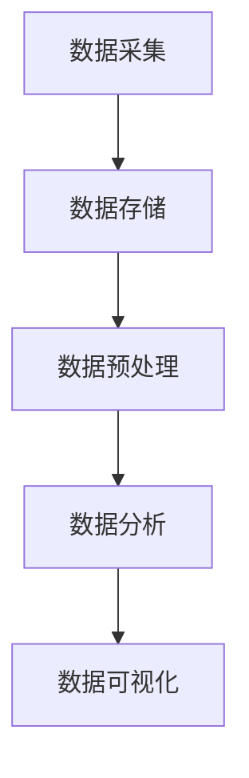

                 

关键词：数据科学家，数据分析，人才培养，专业技能，行业趋势

> 摘要：本文将探讨数据科学家的崛起及其在现代社会中的重要性，分析数据科学领域所需的核心技能，提供有效的培养方法，并探讨数据科学家的未来发展方向。通过深入研究，我们希望能够为数据科学人才的培养提供有价值的参考。

## 1. 背景介绍

随着大数据时代的到来，数据科学已成为各行各业的重要驱动力。从金融、医疗到电商、互联网，数据科学的应用范围不断扩大，数据科学家也成为了职场上的“黄金职业”。数据科学家的崛起不仅源于数据量的爆炸性增长，更是因为数据价值的不断凸显。在这个信息时代，谁能够更好地理解和利用数据，谁就能在竞争中占据优势。

然而，数据科学领域的快速发展也带来了人才短缺的问题。据统计，全球范围内数据科学家的需求与日俱增，而合格的候选人供应量却远远无法满足这一需求。因此，如何培养更多优秀的数据科学人才，已经成为教育界和企业界共同关注的问题。

## 2. 核心概念与联系

数据科学是一门跨学科的领域，涉及统计学、计算机科学、信息科学和领域专业知识。其核心概念包括数据采集、数据存储、数据预处理、数据分析和数据可视化。


### Mermaid 流程图



### 2.1 数据采集

数据采集是数据科学的基础，涉及从各种来源获取数据。这些来源包括数据库、文件、Web爬虫和传感器等。数据采集的方法包括手动数据录入、自动化脚本和API调用等。

### 2.2 数据存储

数据存储是将采集到的数据存储到合适的存储系统中。常见的数据存储系统包括关系型数据库（如MySQL、PostgreSQL）、NoSQL数据库（如MongoDB、Cassandra）和大数据存储系统（如Hadoop、HDFS）。

### 2.3 数据预处理

数据预处理是确保数据质量的过程，包括数据清洗、数据转换和数据归一化。这一步骤对于后续的数据分析至关重要。

### 2.4 数据分析

数据分析是数据科学的中心环节，包括描述性分析、推断性分析和预测性分析。数据分析的方法包括统计分析、机器学习和深度学习等。

### 2.5 数据可视化

数据可视化是将数据以图形或图表的形式展示出来，使得数据更容易理解和解释。常见的可视化工具包括Matplotlib、Seaborn和Tableau等。

## 3. 核心算法原理 & 具体操作步骤

### 3.1 算法原理概述

数据科学的算法涵盖了多种领域，包括统计学、机器学习和深度学习。以下是一些常用的算法：

- **线性回归**：用于预测数值型变量。
- **逻辑回归**：用于分类问题。
- **决策树**：用于分类和回归问题。
- **随机森林**：基于决策树的集成学习方法。
- **神经网络**：深度学习的基础。

### 3.2 算法步骤详解

#### 3.2.1 线性回归

1. **模型假设**：假设目标变量Y可以表示为输入变量X的线性组合加上误差项。
2. **模型参数估计**：使用最小二乘法估计模型参数。
3. **模型评估**：计算预测误差，评估模型性能。

#### 3.2.2 逻辑回归

1. **模型假设**：假设目标变量Y为二分类变量，可以通过逻辑函数将输入变量X映射到概率空间。
2. **模型参数估计**：使用最大似然估计法估计模型参数。
3. **模型评估**：计算分类准确率、召回率、F1分数等指标。

#### 3.2.3 决策树

1. **模型假设**：将数据划分为若干子集，每个子集对应一个类标签。
2. **划分准则**：使用信息增益或基尼系数作为划分准则。
3. **模型评估**：通过验证集或交叉验证评估模型性能。

#### 3.2.4 随机森林

1. **模型构建**：构建多个决策树，每个树从数据的不同子集中训练。
2. **集成方法**：通过投票或平均等方式集成多个决策树的结果。

#### 3.2.5 神经网络

1. **模型构建**：构建多层感知器网络，包括输入层、隐藏层和输出层。
2. **前向传播**：计算输入变量通过网络的输出。
3. **反向传播**：更新网络权重，优化模型。

### 3.3 算法优缺点

- **线性回归**：简单、易于理解，但可能不适合非线性问题。
- **逻辑回归**：适用于二分类问题，但在多分类问题上性能较差。
- **决策树**：直观、易于解释，但可能产生过拟合。
- **随机森林**：减少了过拟合，但增加了计算复杂度。
- **神经网络**：强大的非线性建模能力，但需要大量数据和计算资源。

### 3.4 算法应用领域

- **金融领域**：用于风险评估、股票预测等。
- **医疗领域**：用于疾病诊断、患者预后预测等。
- **电商领域**：用于用户行为分析、推荐系统等。
- **互联网领域**：用于广告投放、搜索引擎优化等。

## 4. 数学模型和公式 & 详细讲解 & 举例说明

### 4.1 数学模型构建

数据科学中的数学模型通常包括线性模型、非线性模型、概率模型和统计模型等。以下是一个简单的线性回归模型构建示例：

### 4.2 公式推导过程

线性回归模型的基本假设是目标变量Y与输入变量X之间存在线性关系：

$$ Y = \beta_0 + \beta_1X + \epsilon $$

其中，$\beta_0$ 和 $\beta_1$ 是模型参数，$\epsilon$ 是误差项。

为了估计这些参数，我们可以使用最小二乘法：

$$ \min \sum_{i=1}^{n} (Y_i - \beta_0 - \beta_1X_i)^2 $$

### 4.3 案例分析与讲解

假设我们有以下数据集，包含一个输入变量X和一个目标变量Y：

| X | Y |
|---|---|
| 1 | 2 |
| 2 | 4 |
| 3 | 6 |
| 4 | 8 |

我们可以使用线性回归模型来预测Y值。

首先，我们计算样本均值：

$$ \bar{X} = \frac{1+2+3+4}{4} = 2.5 $$
$$ \bar{Y} = \frac{2+4+6+8}{4} = 5 $$

然后，我们计算协方差和方差：

$$ \sigma_{XY} = \sum_{i=1}^{n} (X_i - \bar{X})(Y_i - \bar{Y}) = (1-2.5)(2-5) + (2-2.5)(4-5) + (3-2.5)(6-5) + (4-2.5)(8-5) = 7 $$
$$ \sigma_{XX} = \sum_{i=1}^{n} (X_i - \bar{X})^2 = (1-2.5)^2 + (2-2.5)^2 + (3-2.5)^2 + (4-2.5)^2 = 5 $$

接下来，我们计算回归系数：

$$ \beta_1 = \frac{\sigma_{XY}}{\sigma_{XX}} = \frac{7}{5} = 1.4 $$
$$ \beta_0 = \bar{Y} - \beta_1\bar{X} = 5 - 1.4 \times 2.5 = 0.5 $$

因此，线性回归模型为：

$$ Y = 0.5 + 1.4X $$

我们可以使用这个模型来预测新的X值对应的Y值。

## 5. 项目实践：代码实例和详细解释说明

### 5.1 开发环境搭建

在本项目中，我们将使用Python作为主要编程语言，并利用Scikit-learn库进行线性回归模型的实现。首先，确保已经安装了Python和Scikit-learn库。

```bash
pip install scikit-learn
```

### 5.2 源代码详细实现

以下是一个简单的线性回归项目代码实例：

```python
from sklearn.linear_model import LinearRegression
from sklearn.model_selection import train_test_split
from sklearn.metrics import mean_squared_error
import matplotlib.pyplot as plt
import numpy as np

# 生成数据集
X = np.array([[1], [2], [3], [4]])
Y = np.array([2, 4, 6, 8])

# 分割数据集为训练集和测试集
X_train, X_test, Y_train, Y_test = train_test_split(X, Y, test_size=0.2, random_state=0)

# 创建线性回归模型实例
model = LinearRegression()

# 训练模型
model.fit(X_train, Y_train)

# 预测测试集结果
Y_pred = model.predict(X_test)

# 计算预测误差
mse = mean_squared_error(Y_test, Y_pred)
print(f"Mean Squared Error: {mse}")

# 绘制结果
plt.scatter(X_test, Y_test, color='red', label='Actual')
plt.plot(X_test, Y_pred, color='blue', linewidth=2, label='Predicted')
plt.xlabel('X')
plt.ylabel('Y')
plt.legend()
plt.show()
```

### 5.3 代码解读与分析

- **数据集生成**：使用numpy库生成一个简单的数据集，包含输入变量X和目标变量Y。
- **数据集分割**：使用Scikit-learn库中的train_test_split函数将数据集分割为训练集和测试集。
- **模型训练**：使用LinearRegression类创建线性回归模型实例，并调用fit函数进行模型训练。
- **预测与评估**：使用predict函数对测试集进行预测，并计算预测误差。
- **结果可视化**：使用matplotlib库绘制实际值和预测值，展示模型效果。

## 6. 实际应用场景

### 6.1 金融领域

在金融领域，数据科学家可以使用线性回归模型来预测股票价格、分析投资组合风险等。例如，可以使用线性回归模型分析历史市场数据，预测未来某一时间点的股票价格。

### 6.2 医疗领域

在医疗领域，数据科学家可以利用线性回归模型进行疾病预测和患者预后分析。例如，可以根据患者的年龄、体重、病史等数据，预测患者某一疾病的发病风险。

### 6.3 电商领域

在电商领域，数据科学家可以利用线性回归模型进行用户行为分析、推荐系统等。例如，可以使用线性回归模型分析用户浏览、购买等行为数据，为用户推荐合适的商品。

## 7. 未来应用展望

随着人工智能技术的不断发展，数据科学的应用领域将更加广泛。未来，数据科学家将在智能城市、自动驾驶、智能家居等新兴领域发挥重要作用。同时，随着数据量的不断增长，数据科学家需要不断提升自身的技能，以应对不断变化的行业需求。

## 8. 总结：未来发展趋势与挑战

### 8.1 研究成果总结

本文从数据科学家的背景介绍、核心概念、算法原理、数学模型、项目实践等方面进行了全面分析，总结了数据科学家的培养方法和应用场景。

### 8.2 未来发展趋势

未来，数据科学领域将继续保持快速增长，数据科学家将在各行各业发挥更加重要的作用。随着人工智能和大数据技术的不断发展，数据科学家的技能要求也将不断提高。

### 8.3 面临的挑战

数据科学领域面临的挑战包括数据隐私、数据质量和数据安全等。同时，数据科学家的培养也面临挑战，需要不断提升教育水平和实践能力。

### 8.4 研究展望

未来，数据科学家需要不断探索新的方法和技术，提高数据利用效率，为各行各业提供更加智能和高效的数据解决方案。

## 9. 附录：常见问题与解答

### 9.1 数据科学家的核心技能是什么？

数据科学家的核心技能包括统计学、计算机科学、编程能力、数据处理能力和业务理解能力。

### 9.2 如何提高数据分析能力？

可以通过学习统计学、机器学习和深度学习等相关知识，参加数据科学课程和项目实践，提高数据分析能力。

### 9.3 数据科学家的职业发展路径是什么？

数据科学家的职业发展路径包括初级数据分析师、中级数据科学家、高级数据科学家和数据科学团队负责人等。

作者：禅与计算机程序设计艺术 / Zen and the Art of Computer Programming
----------------------------------------------------------------
以上就是本文的完整内容。希望本文能够为数据科学人才的培养提供有价值的参考，并激发更多人对数据科学的兴趣和热情。在数据科学领域，我们还有很长的路要走，但只要我们持续努力，就一定能够创造出更加美好的未来。

