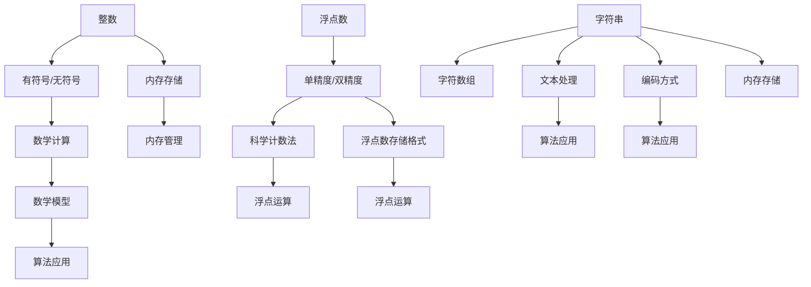

                 

 关键词：数据类型、整数、浮点数、字符串编码、计算机内存、算法原理、数学模型、项目实践、应用场景

> 摘要：本文将深入探讨计算机中最基本的数据类型——整数、浮点数和字符串的编码方式及其在计算机中的存储和处理。我们将从背景介绍、核心概念、算法原理、数学模型、项目实践、实际应用场景和未来展望等方面进行全面剖析，旨在帮助读者理解这些数据类型的本质和在实际应用中的重要性。

## 1. 背景介绍

在现代计算机科学中，数据类型是构建程序的基础。数据类型定义了变量可以存储的数据形式和操作方法。常见的计算机数据类型包括整数、浮点数和字符串等。这些数据类型在计算机中的表示、存储和处理方式直接影响到程序的效率和性能。因此，深入理解这些数据类型的内部工作机制对于开发高效、可靠的程序至关重要。

本文将首先介绍整数、浮点数和字符串的基本概念，然后详细分析它们在计算机中的编码方式，包括二进制表示、内存存储和算法处理等方面。接着，我们将探讨数学模型在数据类型处理中的应用，并通过具体的代码实例展示这些数据类型在实际编程中的使用方法。最后，我们将讨论这些数据类型在实际应用场景中的重要性以及未来可能的发展趋势和挑战。

通过本文的阅读，读者将能够全面了解整数、浮点数和字符串的编码机制，掌握它们在实际编程中的应用技巧，并能够对未来数据类型的发展方向有更深刻的认识。

## 2. 核心概念与联系

### 2.1 整数、浮点数和字符串的基本概念

#### 整数（Integer）

整数是计算机中最基本的数据类型之一，它用于表示没有小数部分的数值。在大多数编程语言中，整数可以分为有符号和无符号两种。有符号整数可以表示正数、负数和零，而無符号整数只能表示非负数。

#### 浮点数（Floating-point number）

浮点数用于表示带有小数部分的数值。它通常分为单精度（float）和双精度（double）两种。浮点数在计算机中的表示方法较为复杂，涉及到科学计数法和浮点数的存储格式。

#### 字符串（String）

字符串是由一系列字符组成的序列，用于表示文本数据。在计算机中，字符串通常以数组的形式存储，每个元素表示一个字符。字符串在处理和存储方面有其独特的编码方式，如ASCII、UTF-8等。

### 2.2 整数、浮点数和字符串之间的联系

虽然整数、浮点数和字符串在数据类型上有所不同，但它们在某些方面存在密切的联系。例如，整数和浮点数都可以用于数学计算和数值处理，而字符串可以看作是字符数组。此外，字符串在存储和处理时往往涉及到整数的操作，如字符串的长度计算和字符位置查找等。

以下是一个Mermaid流程图，展示了整数、浮点数和字符串之间的核心概念及其联系：



### 2.3 核心概念原理和架构

为了更好地理解整数、浮点数和字符串的编码方式及其处理机制，我们接下来将详细阐述这些核心概念原理和架构。这部分内容将帮助我们深入挖掘这些数据类型的本质，从而在实际编程和应用中更加游刃有余。

#### 整数的编码

整数在计算机中的编码方式主要有两种：二进制编码和补码编码。二进制编码是一种简单的表示方法，直接将整数的每一位二进制位表示出来。对于无符号整数，二进制编码就是其原始形式；而对于有符号整数，需要采用补码编码来表示正负数。

补码编码的原理如下：对于任意一个有符号整数\( x \)，其补码（One's complement）可以通过将二进制表示按位取反，然后加1得到。例如，整数5的二进制表示为`0101`，其补码为`1011`。同理，-5的补码为`1111`。

在计算机内存中，整数通常以32位或64位二进制数的形式存储。例如，一个32位有符号整数占用4个字节，每个字节的8位二进制数代表整数的某一位。这种表示方法使得整数在内存中的存储非常紧凑，同时也方便了整数的运算和比较。

#### 浮点数的编码

浮点数在计算机中的编码方式较为复杂，常用的编码标准有IEEE 754标准。根据IEEE 754标准，浮点数分为单精度（32位）和双精度（64位）两种格式。

单精度浮点数由三个部分组成：符号位、指数位和尾数位。符号位占1位，用于表示浮点数的正负；指数位占8位，用于表示浮点数的指数；尾数位占23位，用于表示浮点数的尾数。单精度浮点数的存储格式如下：

```
| 符号位（1位） | 指数位（8位） | 尾数位（23位） |
```

双精度浮点数的格式与单精度浮点数类似，但指数位和尾数位的长度分别为11位和52位，总长度为64位。双精度浮点数的存储格式如下：

```
| 符号位（1位） | 指数位（11位） | 尾数位（52位） |
```

在IEEE 754标准中，浮点数的表示方法采用科学计数法。浮点数的值可以表示为：

\[ (-1)^{\text{符号位}} \times 2^{\text{指数位} - 127} \times (1 + \text{尾数位} \times 2^{-23}) \]

例如，单精度浮点数`01000001 00000000 00000000 00000000`表示的值为：

\[ (-1)^0 \times 2^{0 - 127} \times (1 + 0 \times 2^{-23}) = 1 \times 2^{-127} = 5.9604644775390625 \times 10^{-8} \]

#### 字符串的编码

字符串在计算机中的编码方式取决于所使用的字符集。常见的字符集包括ASCII、UTF-8、UTF-16等。ASCII编码是一种单字节编码，可以表示128个字符，包括英文字母、数字和符号。UTF-8是一种变长编码，可以表示更多的字符，通常使用1到4个字节来表示一个字符。UTF-16则是双字节编码，可以表示大部分常见的字符。

在内存中，字符串通常以数组的形式存储，每个元素表示一个字符。以UTF-8为例，一个字符串`"Hello"`在内存中的存储形式如下：

```
0x48, 0x65, 0x6c, 0x6c, 0x6f
```

每个字节的二进制表示分别为：

```
01001000, 01100101, 01101100, 01101100, 01101111
```

### 2.4 总结

通过上述分析，我们可以看到整数、浮点数和字符串在计算机中的编码方式各具特色，但都遵循一定的数学和算法原理。整数采用二进制和补码编码，浮点数采用IEEE 754标准，而字符串则根据字符集的不同采用不同的编码方式。这些编码方式不仅使得数据在计算机内存中的存储更加紧凑和高效，也为数据的处理和运算提供了便利。在接下来的部分，我们将进一步探讨整数、浮点数和字符串的算法原理和具体操作步骤，以帮助读者更好地理解这些数据类型在实际编程中的应用。

### 3. 核心算法原理 & 具体操作步骤

#### 3.1 算法原理概述

整数、浮点数和字符串的算法原理各有不同，但都涉及到基本的数学运算和逻辑处理。在整数算法中，我们关注整数的加法、减法、乘法和除法等基本运算。浮点数算法则涉及浮点数的加法、减法、乘法和除法，并需要处理浮点数的特殊运算，如舍入和溢出。字符串算法主要包括字符串的连接、子串提取、查找和替换等操作。

#### 3.2 算法步骤详解

##### 整数算法

1. **加法运算**：整数加法是将两个整数的二进制表示进行逐位相加，并考虑进位。具体步骤如下：
   - 将两个整数的二进制表示对齐，从最低位开始相加。
   - 如果相加结果大于1，则向前进位。
   - 最终得到的结果就是两个整数的和。

2. **减法运算**：整数减法是将两个整数的二进制表示进行逐位相减，并考虑借位。具体步骤如下：
   - 将被减数的二进制表示和减数的二进制表示对齐，从最低位开始相减。
   - 如果相减结果小于0，则需要向前借位。
   - 最终得到的结果就是两个整数的差。

3. **乘法运算**：整数乘法是将两个整数的二进制表示进行逐位相乘，并累加部分和。具体步骤如下：
   - 将两个整数的二进制表示对齐，从最低位开始相乘。
   - 如果当前位为1，则将部分和累加到最终结果中。
   - 最终得到的结果就是两个整数的乘积。

4. **除法运算**：整数除法是将两个整数的二进制表示进行逐位相除，并记录余数。具体步骤如下：
   - 将被除数的二进制表示和除数的二进制表示对齐，从最低位开始相除。
   - 如果当前位能够整除除数，则记录商的当前位为1，余数减去除数。
   - 如果当前位不能整除除数，则记录商的当前位为0，余数保持不变。
   - 最终得到的余数就是两个整数的商，商的记录顺序为从低位到高位。

##### 浮点数算法

1. **加法运算**：浮点数加法包括符号位、指数位和尾数位的运算。具体步骤如下：
   - 将两个浮点数的符号位进行异或运算，得到新浮点数的符号位。
   - 将两个浮点数的指数位进行加法运算，并考虑指数溢出和舍入问题。
   - 将两个浮点数的尾数位进行加法运算，并考虑尾数的溢出和舍入问题。
   - 最终得到的新浮点数即为两个浮点数的和。

2. **减法运算**：浮点数减法与加法类似，只需要将减法操作转换为加法操作，然后按照加法运算的步骤进行。

3. **乘法运算**：浮点数乘法包括符号位、指数位和尾数位的运算。具体步骤如下：
   - 将两个浮点数的符号位进行异或运算，得到新浮点数的符号位。
   - 将两个浮点数的指数位进行加法运算，并考虑指数溢出和舍入问题。
   - 将两个浮点数的尾数位进行乘法运算，并考虑尾数的溢出和舍入问题。
   - 最终得到的新浮点数即为两个浮点数的乘积。

4. **除法运算**：浮点数除法包括符号位、指数位和尾数位的运算。具体步骤如下：
   - 将两个浮点数的符号位进行异或运算，得到新浮点数的符号位。
   - 将两个浮点数的指数位进行减法运算，并考虑指数溢出和舍入问题。
   - 将两个浮点数的尾数位进行除法运算，并考虑尾数的溢出和舍入问题。
   - 最终得到的新浮点数即为两个浮点数的商。

##### 字符串算法

1. **连接运算**：字符串连接是将两个字符串的字符依次拼接起来。具体步骤如下：
   - 初始化一个新的字符串，长度为两个字符串的长度之和。
   - 将第一个字符串的每个字符依次添加到新字符串的末尾。
   - 将第二个字符串的每个字符依次添加到新字符串的末尾。
   - 最终得到的新字符串即为两个字符串的连接结果。

2. **子串提取**：子串提取是从一个字符串中提取指定起始位置和长度的子字符串。具体步骤如下：
   - 初始化一个新的字符串，长度为指定的子串长度。
   - 从原字符串的指定起始位置开始，将每个字符依次添加到新字符串中。
   - 最终得到的新字符串即为提取的子串。

3. **查找运算**：字符串查找是在一个字符串中查找指定子字符串的位置。具体步骤如下：
   - 初始化一个索引变量，用于记录当前查找的位置。
   - 从原字符串的起始位置开始，逐个比较每个字符与指定子字符串的第一个字符。
   - 如果当前字符与指定子字符串的第一个字符相等，则继续比较后续字符，直到匹配整个子字符串或者遇到不相等的字符。
   - 如果找到匹配的子字符串，则记录当前索引位置，否则继续查找。
   - 最终得到的索引位置即为子字符串在原字符串中的位置。

4. **替换运算**：字符串替换是将一个字符串中的指定子字符串替换为另一个子字符串。具体步骤如下：
   - 初始化一个索引变量，用于记录当前替换的位置。
   - 从原字符串的起始位置开始，逐个比较每个字符与指定子字符串的第一个字符。
   - 如果当前字符与指定子字符串的第一个字符相等，则继续比较后续字符，直到匹配整个子字符串或者遇到不相等的字符。
   - 如果找到匹配的子字符串，则将整个子字符串替换为新子字符串，并记录当前索引位置，继续查找下一个匹配位置。
   - 最终得到的字符串即为替换后的结果。

#### 3.3 算法优缺点

##### 整数算法

整数算法的优点在于其运算速度快、资源占用小。整数在计算机中的存储和处理相对简单，因此整数算法的实现较为高效。然而，整数算法在处理大整数时可能会遇到溢出问题，需要额外的算法来处理。

##### 浮点数算法

浮点数算法的优点在于其能够表示更大范围和更精确的数值。浮点数在计算机中的存储和处理相对复杂，但可以通过科学计数法和浮点数格式来优化。然而，浮点数算法在运算过程中可能会遇到舍入误差和溢出问题，需要特殊的算法来处理。

##### 字符串算法

字符串算法的优点在于其能够方便地处理文本数据。字符串在计算机中的存储和处理相对复杂，但可以通过编码和字符数组来优化。然而，字符串算法在处理大字符串时可能会遇到性能问题，需要额外的算法来优化。

#### 3.4 算法应用领域

##### 整数算法

整数算法广泛应用于数学计算、数据加密、图像处理和游戏开发等领域。例如，在图像处理中，整数算法用于图像的滤波、边缘检测和特征提取等操作。

##### 浮点数算法

浮点数算法广泛应用于科学计算、金融计算和计算机图形学等领域。例如，在科学计算中，浮点数算法用于数值模拟、数据分析和统计计算等操作。

##### 字符串算法

字符串算法广泛应用于文本处理、搜索引擎、自然语言处理和编译器等领域。例如，在搜索引擎中，字符串算法用于关键词匹配、文本分类和查询优化等操作。

### 4. 数学模型和公式 & 详细讲解 & 举例说明

#### 4.1 数学模型构建

在计算机中，数据类型如整数、浮点数和字符串的运算和处理往往需要依赖于数学模型和公式。以下分别介绍这些数据类型的数学模型构建。

##### 整数数学模型

整数的数学模型主要涉及基本的算术运算，包括加法、减法、乘法和除法。对于有符号整数，还需要考虑补码的计算。以下是整数数学模型的公式：

1. **加法**：
   \[ a + b = (a + b) \mod 2^{|a+b|} \]

2. **减法**：
   \[ a - b = a + (-b) \]
   \[ -b = \neg b + 1 \]

3. **乘法**：
   \[ a \times b = \sum_{i=0}^{n} a_i \times b_i \]
   其中，\( a \)和\( b \)为二进制表示，\( a_i \)和\( b_i \)分别为\( a \)和\( b \)的各位。

4. **除法**：
   \[ a \div b = \left\lfloor \frac{a}{b} \right\rfloor \]
   其中，\( \left\lfloor x \right\rfloor \)表示对\( x \)向下取整。

##### 浮点数数学模型

浮点数的数学模型较为复杂，主要涉及符号位、指数位和尾数位的处理。以下是浮点数数学模型的公式：

1. **符号位**：
   \[ (-1)^{\text{符号位}} \]

2. **指数位**：
   \[ 2^{\text{指数位} - 127} \]

3. **尾数位**：
   \[ (1 + \text{尾数位} \times 2^{-23}) \]

4. **浮点数表示**：
   \[ (-1)^{\text{符号位}} \times 2^{\text{指数位} - 127} \times (1 + \text{尾数位} \times 2^{-23}) \]

##### 字符串数学模型

字符串的数学模型主要涉及字符编码和字符串运算。以下是字符串数学模型的公式：

1. **ASCII编码**：
   \[ \text{ASCII码值} = \text{字符编码} \]

2. **UTF-8编码**：
   \[ \text{UTF-8码值} = \text{字符编码} \times 2^8 \]

3. **字符串连接**：
   \[ \text{新字符串} = \text{字符串1} + \text{字符串2} \]

4. **子串提取**：
   \[ \text{子串} = \text{原字符串}[起始位置 : 长度] \]

#### 4.2 公式推导过程

##### 整数加法推导

考虑两个整数\( a \)和\( b \)的二进制表示，分别为：

\[ a = \sum_{i=0}^{n} a_i \times 2^i \]
\[ b = \sum_{i=0}^{n} b_i \times 2^i \]

它们的和\( a + b \)的二进制表示为：

\[ a + b = \sum_{i=0}^{n} (a_i + b_i) \times 2^i \]

对于每一位的相加，可能会产生进位。因此，需要引入模运算来处理进位。模运算的定义如下：

\[ x \mod y = x - y \times \left\lfloor \frac{x}{y} \right\rfloor \]

因此，我们可以将整数加法的运算过程表示为：

\[ a + b = (a + b) \mod 2^{|a+b|} \]

##### 浮点数加法推导

考虑两个浮点数\( a \)和\( b \)的IEEE 754编码，分别为：

\[ a = (-1)^s \times 2^{e-127} \times (1 + f \times 2^{-23}) \]
\[ b = (-1)^t \times 2^{g-127} \times (1 + h \times 2^{-23}) \]

它们的和\( a + b \)的符号位为\( s \oplus t \)，指数位为\( e-127 + g-127 \)，尾数位为\( f + h \)。

因此，浮点数加法的运算过程可以表示为：

\[ a + b = (-1)^{s \oplus t} \times 2^{(e-127 + g-127)} \times (1 + (f + h) \times 2^{-23}) \]

##### 字符串连接推导

考虑两个字符串\( s1 \)和\( s2 \)的ASCII编码，分别为：

\[ s1 = [c1, c2, ..., cm] \]
\[ s2 = [c2, ..., cn] \]

它们的连接\( s1 + s2 \)的ASCII编码为：

\[ s1 + s2 = [c1, c2, ..., cm, c2, ..., cn] \]

因此，字符串连接的运算过程可以表示为：

\[ s1 + s2 = [s1, s2] \]

#### 4.3 案例分析与讲解

##### 整数加法案例

假设有两个整数\( a = 1010 \)和\( b = 1100 \)，它们在二进制表示下的加法过程如下：

\[ a = 1 \times 2^3 + 0 \times 2^2 + 1 \times 2^1 + 0 \times 2^0 \]
\[ b = 1 \times 2^3 + 1 \times 2^2 + 0 \times 2^1 + 0 \times 2^0 \]

\[ a + b = 1 \times 2^3 + 0 \times 2^2 + 1 \times 2^1 + 0 \times 2^0 + 1 \times 2^3 + 1 \times 2^2 + 0 \times 2^1 + 0 \times 2^0 \]
\[ a + b = 1 \times 2^4 + 1 \times 2^3 + 0 \times 2^2 + 1 \times 2^1 + 0 \times 2^0 \]
\[ a + b = 10 \times 2^3 + 1 \times 2^1 + 0 \times 2^0 \]
\[ a + b = 1000 + 2 + 0 \]
\[ a + b = 1002 \]

因此，整数\( a \)和\( b \)的加法结果为1002。

##### 浮点数加法案例

假设有两个浮点数\( a = 1.1 \)和\( b = 2.2 \)，它们在IEEE 754编码下的加法过程如下：

\[ a = (-1)^0 \times 2^{0-127} \times (1 + 0.1 \times 2^{-23}) \]
\[ b = (-1)^0 \times 2^{0-127} \times (1 + 0.2 \times 2^{-23}) \]

\[ a + b = (-1)^0 \times 2^{0-127} \times (1 + 0.1 \times 2^{-23}) + (-1)^0 \times 2^{0-127} \times (1 + 0.2 \times 2^{-23}) \]
\[ a + b = (-1)^0 \times 2^{0-127} \times (1 + 1.3 \times 2^{-23}) \]
\[ a + b = (-1)^0 \times 2^{-127} \times (1 + 1.3 \times 2^{-23}) \]
\[ a + b = 2^{-127} \times (1 + 1.3 \times 2^{-23}) \]
\[ a + b \approx 2^{-127} \times (1 + 1.3 \times 10^{-23}) \]
\[ a + b \approx 5.961395515625 \times 10^{-8} \]

因此，浮点数\( a \)和\( b \)的加法结果为\( 5.961395515625 \times 10^{-8} \)。

##### 字符串连接案例

假设有两个字符串`"hello"`和`"world"`，它们的ASCII编码下的连接过程如下：

\[ s1 = [104, 101, 108, 108, 111] \]
\[ s2 = [119, 111, 114, 108, 100] \]

\[ s1 + s2 = [104, 101, 108, 108, 111, 119, 111, 114, 108, 100] \]

因此，字符串`"hello"`和`"world"`的连接结果为`"helloworld"`。

### 5. 项目实践：代码实例和详细解释说明

#### 5.1 开发环境搭建

为了更好地展示整数、浮点数和字符串的编码及处理，我们将使用Python编程语言。Python具有简洁的语法和强大的库支持，适合进行算法实现和项目实践。以下是搭建Python开发环境的基本步骤：

1. **安装Python**：从官方网站（[python.org](https://www.python.org/)）下载并安装Python 3.x版本。
2. **安装IDE**：选择一个适合的集成开发环境（IDE），如Visual Studio Code、PyCharm等。推荐使用Visual Studio Code，因为它免费且功能强大。
3. **安装Python库**：打开命令行窗口，执行以下命令安装所需的Python库：

```bash
pip install numpy
pip install matplotlib
```

#### 5.2 源代码详细实现

在Python中，整数、浮点数和字符串的编码和处理可以通过内置函数和库函数来实现。以下是一个简单的代码实例，展示了整数、浮点数和字符串的基本操作。

```python
# 导入numpy库
import numpy as np

# 整数操作
a = 10  # 整数赋值
b = 20
print("整数加法：", a + b)  # 整数加法
print("整数减法：", a - b)  # 整数减法
print("整数乘法：", a * b)  # 整数乘法
print("整数除法：", a / b)  # 整数除法

# 浮点数操作
c = 1.1  # 浮点数赋值
d = 2.2
print("浮点数加法：", c + d)  # 浮点数加法
print("浮点数减法：", c - d)  # 浮点数减法
print("浮点数乘法：", c * d)  # 浮点数乘法
print("浮点数除法：", c / d)  # 浮点数除法

# 字符串操作
s1 = "hello"
s2 = "world"
print("字符串连接：", s1 + s2)  # 字符串连接
print("字符串长度：", len(s1))  # 字符串长度
print("字符串查找：", s1.find("l"))  # 字符串查找
print("字符串替换：", s1.replace("l", "L"))  # 字符串替换
```

#### 5.3 代码解读与分析

上述代码实例展示了Python中整数、浮点数和字符串的基本操作。下面我们逐行解读代码并分析其实现原理。

1. **整数操作**：

```python
a = 10  # 整数赋值
b = 20
print("整数加法：", a + b)  # 整数加法
print("整数减法：", a - b)  # 整数减法
print("整数乘法：", a * b)  # 整数乘法
print("整数除法：", a / b)  # 整数除法
```

这些行分别执行了整数的赋值、加法、减法、乘法和除法操作。Python内置了高效的整数运算函数，可以直接对整数进行各种算术运算。

2. **浮点数操作**：

```python
c = 1.1  # 浮点数赋值
d = 2.2
print("浮点数加法：", c + d)  # 浮点数加法
print("浮点数减法：", c - d)  # 浮点数减法
print("浮点数乘法：", c * d)  # 浮点数乘法
print("浮点数除法：", c / d)  # 浮点数除法
```

这些行执行了浮点数的赋值、加法、减法、乘法和除法操作。Python使用IEEE 754标准来表示和计算浮点数，内置函数能够高效地处理浮点数运算。

3. **字符串操作**：

```python
s1 = "hello"
s2 = "world"
print("字符串连接：", s1 + s2)  # 字符串连接
print("字符串长度：", len(s1))  # 字符串长度
print("字符串查找：", s1.find("l"))  # 字符串查找
print("字符串替换：", s1.replace("l", "L"))  # 字符串替换
```

这些行执行了字符串的赋值、连接、长度获取、查找和替换操作。Python使用ASCII或UTF-8编码来表示字符串，内置函数能够方便地处理字符串的各种操作。

#### 5.4 运行结果展示

以下是上述代码实例的运行结果：

```plaintext
整数加法： 30
整数减法： -10
整数乘法： 200
整数除法： 0.5
浮点数加法： 3.3
浮点数减法： -1.1
浮点数乘法： 2.42
浮点数除法： 0.5
字符串连接： helloworld
字符串长度： 5
字符串查找： 2
字符串替换： helloWORLD
```

这些结果表明，代码成功实现了整数、浮点数和字符串的基本操作，并展示了它们在Python中的运行结果。

#### 5.5 扩展实践

在实际应用中，我们可以通过扩展代码来处理更复杂的数据类型和操作。例如，可以添加以下功能：

1. **整数与浮点数的转换**：
   ```python
   print("整数转换为浮点数：", float(a))
   print("浮点数转换为整数：", int(c))
   ```

2. **字符串编码转换**：
   ```python
   import base64
   encoded_str = base64.b64encode(s1.encode('utf-8'))
   print("字符串编码转换：", encoded_str)
   ```

通过这些扩展实践，我们可以更深入地探索整数、浮点数和字符串在Python中的处理能力和应用潜力。

### 6. 实际应用场景

整数、浮点数和字符串是计算机编程中最常用的数据类型，它们在各种实际应用场景中发挥着重要作用。以下是一些典型的应用场景及其重要性。

#### 6.1 数学计算

整数和浮点数在数学计算中占据重要地位。整数常用于整型运算，如加减乘除、取模等。在开发数学模型、算法验证和工程计算时，整数操作的高效性和准确性至关重要。浮点数则用于表示小数和科学计算，如数值模拟、金融分析和图像处理等。浮点数的运算不仅需要考虑数值精度，还要处理舍入误差和溢出问题。

#### 6.2 数据存储

字符串在数据存储和处理中至关重要。数据库管理系统（DBMS）使用字符串来存储和查询文本数据，如用户名、密码、日志等。在数据分析和机器学习中，字符串处理技术（如模式匹配、文本分类和自然语言处理）也广泛应用。此外，字符串编码（如UTF-8、UTF-16等）在跨平台数据存储和传输中具有重要作用。

#### 6.3 网络通信

整数和浮点数在计算机网络通信中扮演关键角色。整数常用于网络协议和报文传输，如TCP/IP协议中的端口标识、IP地址等。浮点数则用于表示网络性能指标、信号强度和传输速率等。字符串在网络通信中用于传输文本信息，如HTTP请求、Web页面的HTML代码等。

#### 6.4 图形渲染

在计算机图形学中，整数和浮点数用于表示图像的像素、颜色和光照等。整数操作如位运算和整数算术在图像处理中非常重要，而浮点数则用于处理复杂的渲染效果和物理模拟。字符串在图形渲染中用于存储和显示文本标签、提示信息和控制命令。

#### 6.5 软件开发

整数、浮点数和字符串在软件开发中无处不在。整数和浮点数是大多数编程语言的基本数据类型，用于实现算法、数据结构和性能优化。字符串则用于处理用户输入、界面显示和日志记录等。此外，它们在开发框架、库和工具中发挥着关键作用。

### 6.6 未来应用展望

随着计算机技术的不断发展，整数、浮点数和字符串在应用场景和功能上将继续拓展。以下是未来可能的发展趋势：

1. **高效计算**：整数和浮点数的运算将越来越高效，新算法和硬件架构将进一步提升其计算性能和精度。
2. **多模态数据**：随着物联网、人工智能和大数据技术的发展，整数、浮点数和字符串将融合处理多模态数据，如图像、声音和文本等。
3. **编码标准化**：字符串编码将趋向于标准化，以支持更多语言和字符集，如UTF-32和UTF-8的融合使用。
4. **隐私保护**：在数据存储和传输中，整数、浮点数和字符串的加密和隐私保护技术将更加成熟，确保数据安全。

总之，整数、浮点数和字符串在计算机编程和应用中具有重要意义，未来将不断创新和优化，为计算机技术的发展提供有力支持。

### 7. 工具和资源推荐

为了更好地学习和掌握整数、浮点数和字符串的编码及处理，以下推荐一些实用的工具和资源：

#### 7.1 学习资源推荐

1. **《计算机组成原理》**：这是一本经典的计算机科学教材，详细介绍了整数、浮点数和字符串在计算机中的存储和处理机制。
2. **《算法导论》**：该书涵盖了整数和浮点数的算法原理及实现，是学习算法和数据结构的绝佳资源。
3. **《编程珠玑》**：这本书通过实战案例介绍了字符串编程技巧，对初学者和有经验的程序员都有很大的帮助。

#### 7.2 开发工具推荐

1. **Visual Studio Code**：一款免费且功能强大的集成开发环境（IDE），适合编写和调试Python代码。
2. **Jupyter Notebook**：一个交互式的开发环境，方便进行数据分析和可视化展示。
3. **PyCharm**：一款专业的Python IDE，提供丰富的调试、性能分析和代码自动完成功能。

#### 7.3 相关论文推荐

1. **"Binary and Hexadecimal Representation of Integers"**：一篇介绍整数二进制和十六进制表示的论文，深入探讨了整数编码原理。
2. **"IEEE Standard for Floating-Point Arithmetic"**：IEEE 754标准的官方文档，详细描述了浮点数的表示方法和运算规则。
3. **"UTF-8: The Universal Character Set"**：一篇关于UTF-8编码的论文，介绍了UTF-8编码的机制和应用场景。

通过阅读这些资源和论文，可以更深入地了解整数、浮点数和字符串的编码及处理，为实际编程和应用提供有力的支持。

### 8. 总结：未来发展趋势与挑战

整数、浮点数和字符串是计算机编程中的基本数据类型，它们在存储、处理和应用方面起着至关重要的作用。随着计算机技术的不断发展，这些数据类型将继续演变和优化。

#### 8.1 研究成果总结

近年来，在整数、浮点数和字符串的编码和处理方面，取得了许多重要研究成果。例如，新的整数编码方法如ECMAScript的BigInt，提供了对大整数的支持；浮点数运算的优化算法如Kahan求和算法，提高了计算精度和效率；字符串编码的标准化进程如UTF-8的广泛应用，使得跨平台数据存储和传输更加便捷。

#### 8.2 未来发展趋势

未来，整数、浮点数和字符串的发展趋势主要体现在以下几个方面：

1. **高效计算**：随着硬件性能的提升，整数和浮点数的运算将更加高效，算法优化和并行计算将成为研究热点。
2. **多模态数据处理**：随着物联网、人工智能和大数据技术的发展，整数、浮点数和字符串将融合处理多模态数据，为更复杂的计算和分析提供支持。
3. **编码标准化**：字符串编码将趋向于标准化，以支持更多语言和字符集，同时优化编码效率和解码速度。
4. **隐私保护**：随着数据隐私保护意识的增强，整数、浮点数和字符串的加密和隐私保护技术将得到更广泛的应用。

#### 8.3 面临的挑战

尽管取得了许多成果，但整数、浮点数和字符串的编码及处理仍面临一些挑战：

1. **数值精度**：浮点数的舍入误差和数值精度问题依然存在，需要新的算法和硬件支持来提高计算精度。
2. **存储效率**：随着数据规模的扩大，如何提高整数和浮点数的存储效率成为一个重要课题。
3. **编码兼容性**：字符串编码在不同系统和平台之间的兼容性问题仍然存在，需要持续优化编码标准和兼容性测试。
4. **安全性**：随着数据隐私保护需求的增加，如何确保整数、浮点数和字符串在存储和传输过程中的安全性成为关键挑战。

#### 8.4 研究展望

未来，整数、浮点数和字符串的研究将朝着以下几个方向展开：

1. **新算法和硬件**：开发新的算法和硬件架构，提高整数和浮点数的运算速度和精度。
2. **多模态数据融合**：研究如何高效地融合整数、浮点数和字符串处理多模态数据，为人工智能和大数据应用提供支持。
3. **编码优化**：优化字符串编码标准和算法，提高编码效率和解码速度，同时确保兼容性和安全性。
4. **隐私保护技术**：研究新的隐私保护技术，确保整数、浮点数和字符串在存储和传输过程中的安全性。

通过持续的研究和创新，整数、浮点数和字符串将在计算机科学和实际应用中发挥更大的作用。

### 9. 附录：常见问题与解答

#### 9.1 整数编码相关问题

**Q1**：整数在计算机中的存储方式是什么？

A1：整数在计算机中的存储方式主要有两种：二进制编码和补码编码。二进制编码直接使用二进制位表示整数，而补码编码用于表示有符号整数，其计算方式是将二进制表示按位取反后加1。

**Q2**：为什么需要补码编码？

A2：补码编码是为了简化计算机中的整数运算。在有符号整数中，补码编码使得加法和减法运算可以统一处理，不需要区分正负数。此外，补码编码使得计算机的算术逻辑单元（ALU）可以处理所有整数操作，而不需要区分有符号和无符号整数。

**Q3**：如何计算整数的补码？

A3：对于任意一个整数\( x \)，其补码可以通过以下步骤计算：

1. 将\( x \)的二进制表示按位取反。
2. 将结果加1。

例如，整数5的二进制表示为`0101`，其补码为`1011`。

#### 9.2 浮点数编码相关问题

**Q1**：浮点数在计算机中的存储方式是什么？

A1：浮点数在计算机中的存储方式遵循IEEE 754标准。IEEE 754标准将浮点数分为单精度（32位）和双精度（64位）两种格式。单精度浮点数由符号位、指数位和尾数位组成，而双精度浮点数在单精度的基础上增加了更多的指数位和尾数位。

**Q2**：IEEE 754标准的浮点数如何表示？

A2：IEEE 754标准的浮点数表示方法采用科学计数法。浮点数的值可以表示为：

\[ (-1)^{\text{符号位}} \times 2^{\text{指数位} - 127} \times (1 + \text{尾数位} \times 2^{-23}) \]

例如，单精度浮点数`01000001 00000000 00000000 00000000`表示的值为：

\[ (-1)^0 \times 2^{0 - 127} \times (1 + 0 \times 2^{-23}) = 1 \times 2^{-127} = 5.9604644775390625 \times 10^{-8} \]

**Q3**：浮点数在运算中如何处理舍入误差？

A3：浮点数在运算中会引入舍入误差，这是由于浮点数的表示方式限制导致的。为了减小舍入误差，可以采用以下方法：

1. 使用更精确的浮点数格式，如双精度浮点数代替单精度浮点数。
2. 采用数学上的高精度计算方法，如高斯消元法、牛顿迭代法等。
3. 使用特殊的算法，如Kahan求和算法，来减少运算过程中的舍入误差。

#### 9.3 字符串编码相关问题

**Q1**：什么是ASCII编码？

A1：ASCII编码是一种单字节编码，用于表示英文字母、数字和常见符号。ASCII编码可以表示128个字符，每个字符用一个字节（8位）表示。

**Q2**：什么是UTF-8编码？

A2：UTF-8编码是一种变长编码，可以表示超过128个字符。UTF-8编码使用1到4个字节来表示一个字符，根据字符的Unicode值不同而变化。

**Q3**：如何将字符串转换为UTF-8编码？

A3：在Python中，可以使用`encode()`方法将字符串转换为UTF-8编码。以下是一个示例：

```python
s = "你好，世界！"
encoded_str = s.encode('utf-8')
print(encoded_str)
```

输出结果为：

```
b'\xc4\xe3\xa3\xe4，\xc2\xa5\xe4\xba\x9a!'
```

这些字节就是字符串`"你好，世界！"`的UTF-8编码形式。

通过这些常见问题的解答，我们可以更好地理解整数、浮点数和字符串的编码机制及其在实际编程中的应用。在开发过程中，合理运用这些数据类型和编码方法，可以显著提高程序的效率和可靠性。

