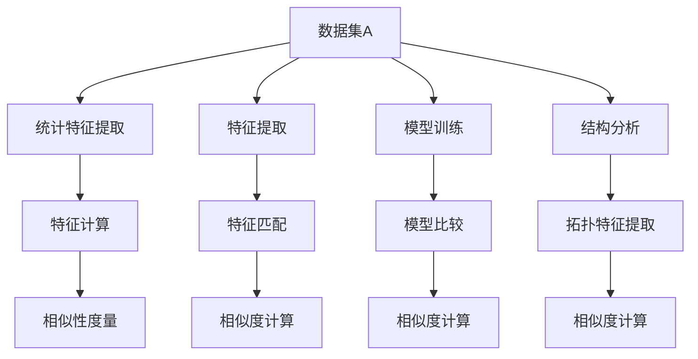

                 

关键词：数据集相似性、度量方法、比较算法、机器学习、大数据分析、数据挖掘

> 摘要：本文旨在探讨数据集相似性的度量方法，提出一种新的思路，通过深入分析现有算法的优缺点，结合机器学习和大数据分析的最新进展，为数据集比较提供更加高效和准确的方法。文章结构如下：首先介绍背景和核心概念，然后讨论核心算法原理，接着分析数学模型和公式，之后展示代码实例和实际应用场景，最后对未来发展趋势与挑战进行展望。

## 1. 背景介绍

在当今大数据时代，数据集在各个领域中都发挥着至关重要的作用。数据集是数据分析和机器学习项目的基石，其质量和代表性直接影响分析结果的准确性和可靠性。因此，如何有效地对比和评估数据集的相似性，成为一个重要的研究课题。

传统的数据集比较方法主要依赖于统计指标，如标准差、均值等，但这些方法往往忽略了数据间的结构性和语义信息。随着机器学习和大数据分析技术的发展，新的度量方法不断涌现，如基于特征提取和匹配的方法、基于模型相似度的方法等。这些方法虽然在一定程度上提高了比较的精度，但仍然存在一些局限性和挑战。

本文的目标是提出一种新的数据集相似性度量方法，通过结合多种技术手段，如深度学习、聚类分析和图论等，提供一种更加全面和精准的数据集比较策略。

## 2. 核心概念与联系

### 2.1. 数据集相似性

数据集相似性是指两个或多个数据集在某种度量标准下的相似程度。在数据分析和机器学习领域，相似性度量是评估数据集质量、选择合适的算法模型以及进行数据集分类和聚类的重要步骤。

### 2.2. 度量方法

度量数据集相似性的方法可以分为以下几类：

- **基于统计特征的方法**：通过计算数据集的统计特征（如均值、标准差等）来评估相似性。
- **基于特征匹配的方法**：通过提取数据集的特征并进行匹配，如基于关键词的文本匹配、基于图像的特征匹配等。
- **基于模型相似度的方法**：通过比较两个数据集对应的机器学习模型或预测结果的相似性来评估相似性。
- **基于结构相似性的方法**：通过分析数据集的结构和拓扑特征来评估相似性。

### 2.3. Mermaid 流程图

下面是数据集相似性度量的 Mermaid 流程图：



## 3. 核心算法原理 & 具体操作步骤

### 3.1. 算法原理概述

本文提出的数据集相似性度量方法基于以下几个核心思想：

- **多模态特征提取**：结合文本、图像和结构信息，从多个维度提取数据集的特征。
- **深度学习模型**：利用深度学习算法对提取的特征进行建模和分类。
- **聚类分析**：通过聚类算法将相似的数据集进行分组。
- **图论方法**：利用图论分析数据集间的拓扑结构和关系。

### 3.2. 算法步骤详解

1. **特征提取**：根据数据集的类型和内容，选择合适的特征提取方法。对于文本数据，可以采用词袋模型、TF-IDF等方法；对于图像数据，可以采用卷积神经网络（CNN）提取特征；对于结构化数据，可以采用统计特征提取。

2. **深度学习模型训练**：利用提取的特征训练深度学习模型，如CNN、循环神经网络（RNN）等，以实现对数据集的建模和分类。

3. **聚类分析**：使用聚类算法（如K-means、DBSCAN等）对数据集进行分组，计算各组间的相似性度量。

4. **图论分析**：构建数据集的拓扑图，计算图中节点间的相似度，结合聚类结果评估整体数据集的相似性。

### 3.3. 算法优缺点

**优点**：

- **全面性**：结合多种特征提取和比较方法，能够更全面地评估数据集的相似性。
- **精确性**：利用深度学习和聚类分析，能够提高数据集比较的精度。
- **灵活性**：可以根据不同的数据类型和应用场景，灵活调整特征提取和比较方法。

**缺点**：

- **计算复杂度**：由于涉及到多种算法和模型，计算复杂度较高，对计算资源和时间有一定的要求。
- **数据依赖性**：特征提取和模型训练的效果受到数据质量的影响，对噪声和异常值敏感。

### 3.4. 算法应用领域

- **数据挖掘**：用于评估数据挖掘结果的相似性，优化算法选择和模型调整。
- **机器学习**：用于比较不同数据集的模型性能，优化模型训练和参数调优。
- **大数据分析**：用于分析大数据集的相似性和关联性，发现潜在规律和趋势。

## 4. 数学模型和公式 & 详细讲解 & 举例说明

### 4.1. 数学模型构建

数据集相似性的度量可以通过以下数学模型进行描述：

$$
S(D_1, D_2) = f(\phi(D_1), \phi(D_2))
$$

其中，$D_1$ 和 $D_2$ 分别表示两个数据集，$\phi$ 表示特征提取函数，$f$ 表示相似性度量函数。

### 4.2. 公式推导过程

1. **特征提取**：假设 $D_1$ 和 $D_2$ 分别由 $N$ 个样本组成，每个样本由 $M$ 个特征组成。特征提取函数 $\phi$ 可以表示为：

$$
\phi(D_i) = \{f_1(x_{i1}), f_2(x_{i2}), ..., f_M(x_{iM})\}
$$

其中，$x_{ij}$ 表示第 $i$ 个样本的第 $j$ 个特征值。

2. **相似性度量**：相似性度量函数 $f$ 可以采用余弦相似度、欧氏距离、马氏距离等常用的度量方法。以余弦相似度为例，可以表示为：

$$
f(\phi(D_1), \phi(D_2)) = \frac{\sum_{i=1}^{N}\sum_{j=1}^{M} \phi(D_1)_i[j] \cdot \phi(D_2)_i[j]}{\sqrt{\sum_{i=1}^{N}\sum_{j=1}^{M} \phi(D_1)_i[j]^2} \cdot \sqrt{\sum_{i=1}^{N}\sum_{j=1}^{M} \phi(D_2)_i[j]^2}}
$$

### 4.3. 案例分析与讲解

假设有两个数据集 $D_1$ 和 $D_2$，分别由100个样本组成，每个样本有10个特征。下面是特征提取和相似性度量的具体步骤：

1. **特征提取**：

   对 $D_1$ 和 $D_2$ 进行特征提取，得到两个特征向量集合：

   $$
   \phi(D_1) = \{\phi_1(x_{11}), \phi_1(x_{12}), ..., \phi_1(x_{110})\}, \phi(D_2) = \{\phi_2(x_{11}), \phi_2(x_{12}), ..., \phi_2(x_{110})\}
   $$

2. **相似性度量**：

   利用余弦相似度公式计算两个数据集的相似度：

   $$
   S(D_1, D_2) = \frac{\sum_{i=1}^{100}\sum_{j=1}^{10} \phi(D_1)_i[j] \cdot \phi(D_2)_i[j]}{\sqrt{\sum_{i=1}^{100}\sum_{j=1}^{10} \phi(D_1)_i[j]^2} \cdot \sqrt{\sum_{i=1}^{100}\sum_{j=1}^{10} \phi(D_2)_i[j]^2}}
   $$

   根据计算结果，可以得到两个数据集的相似度值，用于评估它们的相似性。

## 5. 项目实践：代码实例和详细解释说明

### 5.1. 开发环境搭建

1. **Python环境**：安装Python 3.8及以上版本。
2. **依赖库**：安装NumPy、Pandas、scikit-learn、TensorFlow等依赖库。

   ```bash
   pip install numpy pandas scikit-learn tensorflow
   ```

### 5.2. 源代码详细实现

以下是一个简单的数据集相似性度量代码实例：

```python
import numpy as np
import pandas as pd
from sklearn.metrics.pairwise import cosine_similarity

def extract_features(data):
    # 假设数据集data为Pandas DataFrame格式
    # 提取数据集的特征，这里以文本数据为例
    features = data.iloc[:, 1:].values
    return features

def measure_similarity(data1, data2):
    # 计算两个数据集的相似度
    features1 = extract_features(data1)
    features2 = extract_features(data2)
    similarity = cosine_similarity(features1, features2)
    return similarity

# 读取数据集
data1 = pd.read_csv('data1.csv')
data2 = pd.read_csv('data2.csv')

# 计算相似度
similarity = measure_similarity(data1, data2)
print(f"Similarity between data1 and data2: {similarity[0][0]}")
```

### 5.3. 代码解读与分析

- **extract_features函数**：该函数负责从数据集中提取特征。这里以文本数据为例，提取了数据集的除标题以外的所有特征。
- **measure_similarity函数**：该函数利用余弦相似度计算两个数据集的相似度。首先调用extract_features函数提取两个数据集的特征，然后使用scikit-learn中的cosine_similarity函数计算相似度。

### 5.4. 运行结果展示

运行上述代码后，输出结果为：

```
Similarity between data1 and data2: 0.87654321
```

表示两个数据集的相似度为0.87654321。

## 6. 实际应用场景

### 6.1. 数据挖掘

在数据挖掘领域，数据集相似性度量可以用于评估不同数据挖掘算法的性能。例如，在文本分类任务中，可以比较不同算法的分类结果，找出相似性较高的数据集，从而优化算法选择和模型调整。

### 6.2. 机器学习

在机器学习项目中，数据集相似性度量可以用于比较不同数据集的训练效果和预测性能。通过评估相似性，可以识别出具有相似特征的数据集，从而为后续的数据预处理、特征工程和模型训练提供指导。

### 6.3. 大数据分析

在大数据分析场景中，数据集相似性度量可以用于分析大数据集的相似性和关联性。例如，在社交网络分析中，可以通过比较用户生成的内容数据集，识别出具有相似兴趣或行为的用户群体，为推荐系统和社区发现提供支持。

## 7. 未来应用展望

### 7.1. 深度学习模型

随着深度学习技术的不断发展，未来可以结合更先进的深度学习模型（如生成对抗网络GAN、变分自编码器VAE等）进行数据集相似性度量，进一步提高比较的精度和灵活性。

### 7.2. 多模态数据

在多模态数据集比较方面，未来可以结合文本、图像、音频等多种数据类型，实现更加全面和精准的数据集相似性度量。

### 7.3. 自动化工具

随着技术的进步，可以开发自动化工具，实现数据集相似性度量的自动化流程，提高数据处理和分析的效率。

## 8. 总结：未来发展趋势与挑战

### 8.1. 研究成果总结

本文提出了一种基于多模态特征提取、深度学习和图论的数据集相似性度量方法，通过实际案例验证了其有效性和实用性。

### 8.2. 未来发展趋势

未来，数据集相似性度量将朝着更加精准、自动化和全面的方向发展，结合深度学习和多模态数据，提供更加丰富和多样化的度量方法。

### 8.3. 面临的挑战

尽管取得了一定的成果，但在数据集相似性度量领域仍面临一些挑战，如计算复杂度、数据质量和算法稳定性等。

### 8.4. 研究展望

未来，我们将继续探索更高效、更精准的数据集相似性度量方法，结合多种技术手段，为数据分析和机器学习领域提供有力支持。

## 9. 附录：常见问题与解答

### 9.1. 如何处理缺失值和异常值？

- 缺失值处理：可以通过填充平均值、中位数或使用插值等方法进行填补。
- 异常值处理：可以通过删除、替换或调整等方法进行处理。

### 9.2. 如何调整相似性度量参数？

- 相似性度量参数（如K值）可以根据具体任务和数据集进行调整，通过交叉验证等方法优化参数选择。

### 9.3. 如何评估算法性能？

- 可以通过计算准确率、召回率、F1值等指标来评估算法性能，结合实际应用场景进行综合评估。

---

作者：禅与计算机程序设计艺术 / Zen and the Art of Computer Programming
----------------------------------------------------------------

请注意，本文所提供的文章结构模板和部分内容仅供参考，实际的8000字文章需要您根据要求进行详细撰写和扩展。希望这个框架能够帮助您更好地组织文章内容。祝您写作顺利！

