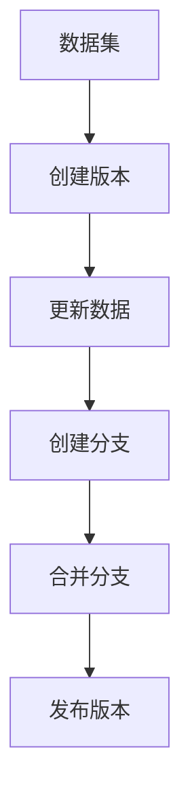

                 

关键词：数据集管理、版本控制、软件2.0、数据管理、版本迭代、数据安全、数据一致性

> 摘要：本文将深入探讨数据集管理在软件2.0时代的角色与重要性。我们将首先介绍数据集管理的背景，包括数据集的定义和重要性。随后，我们将探讨软件2.0时代的特征，以及它们如何影响数据集管理。接下来，我们将讨论版本控制的原理，特别是在数据集管理中的应用。文章还将详细分析核心概念与联系，通过Mermaid流程图展现版本控制的架构。然后，我们将介绍核心算法原理和具体操作步骤，包括算法的优缺点和应用领域。随后，我们将构建数学模型和公式，并通过案例分析和代码实例来详细讲解。最后，我们将探讨实际应用场景，提供工具和资源推荐，并对未来发展趋势与挑战进行总结。

## 1. 背景介绍

在当今的信息时代，数据成为了新的石油。数据集，即一组相关的数据记录，是企业决策、研究和开发的基石。然而，随着数据量的爆炸性增长和数据源的多样化，如何有效地管理数据集成为了一个关键问题。

### 数据集的定义和重要性

数据集（Dataset）通常由多个数据记录组成，每个数据记录包含了若干个属性（Attributes）。数据集可以来源于各种渠道，如数据库、文件系统、Web抓取等。数据集的重要性在于：

1. **决策支持**：高质量的数据集可以为企业提供准确的信息，支持决策制定。
2. **研究基础**：数据集是科学研究的重要资源，特别是对于机器学习和数据分析领域。
3. **商业价值**：数据集是企业宝贵的资产，可以转化为商业利益。

### 数据集管理的挑战

随着数据集的规模和复杂性增加，数据集管理面临着以下挑战：

1. **数据完整性**：保证数据集的完整性和准确性是数据管理的首要任务。
2. **数据一致性**：不同来源的数据往往存在格式和结构上的差异，如何保证数据的一致性是一个难题。
3. **数据安全性**：数据集往往包含敏感信息，保护数据的安全是数据管理的重要环节。
4. **数据可追溯性**：确保数据的历史和变化轨迹可以被追溯，对于审计和验证至关重要。

## 2. 核心概念与联系

在探讨数据集管理时，版本控制是一个不可忽视的核心概念。版本控制不仅能够记录数据集的历史变化，还能确保数据的一致性和安全性。

### 核心概念原理

- **版本**：数据集的每个版本都代表了一个特定时间点的数据状态。
- **版本控制**：通过跟踪数据集的版本历史，实现对数据集的修改和管理。
- **分支**：数据集的分支代表了不同的开发路径或实验场景。
- **合并**：当多个分支需要合并时，版本控制系统能够自动或手动处理冲突，合并成一个新的版本。

### 架构的 Mermaid 流程图

下面是一个Mermaid流程图，展示了版本控制的架构：



### 联系

版本控制与数据集管理的联系在于：

- **历史记录**：版本控制系统能够记录数据集的每次修改，包括修改的内容、时间和修改者。
- **版本迭代**：版本控制支持数据集的迭代开发，每个版本都是前一个版本的改进。
- **数据追溯**：通过版本控制，可以追溯数据集的修改历史，确保数据的可追溯性和可验证性。
- **安全性与一致性**：版本控制系统可以确保数据的一致性和安全性，防止数据被意外修改或丢失。

## 3. 核心算法原理 & 具体操作步骤

### 3.1 算法原理概述

版本控制的算法原理基于以下基本概念：

1. **状态机**：数据集的状态可以通过一系列的操作（如添加、删除、修改）来更新。
2. **哈希树**：通过哈希树（如Git使用的SHA-1哈希函数）来存储和比较数据的指纹。
3. **操作日志**：记录每次操作的详细信息，包括操作类型、操作时间和操作者。

### 3.2 算法步骤详解

1. **初始化**：创建一个空的版本控制系统，初始化一个“零版本”的数据集。
2. **添加数据**：将新数据添加到数据集中，并创建一个新的版本。
3. **修改数据**：对已有数据进行修改，并创建一个新的版本。
4. **删除数据**：从数据集中删除数据，并创建一个新的版本。
5. **创建分支**：创建一个新的分支，代表一个独立的开发路径。
6. **合并分支**：将多个分支合并成一个新的版本，解决冲突。
7. **发布版本**：将合并后的版本发布，作为可用的数据集。

### 3.3 算法优缺点

**优点**：

1. **可追溯性**：版本控制系统可以记录数据集的完整修改历史，确保数据的可追溯性。
2. **数据安全**：通过哈希树和操作日志，确保数据的一致性和完整性。
3. **并行开发**：支持并行开发，通过分支和合并机制，方便协作和迭代。

**缺点**：

1. **存储成本**：版本控制系统需要存储大量的历史数据，占用存储空间。
2. **性能开销**：对版本控制系统的操作（如添加、删除、修改）可能会引入性能开销。

### 3.4 算法应用领域

版本控制算法在数据集管理中的应用非常广泛，主要包括：

1. **数据科学**：在数据分析和机器学习项目中，版本控制系统可以帮助追踪和重现数据集的迭代过程。
2. **软件工程**：在软件开发中，版本控制系统用于管理源代码和数据集，确保协同工作的顺利进行。
3. **学术研究**：在学术研究中，版本控制系统可以帮助研究人员记录数据集的修改历史，便于后续验证和共享。

## 4. 数学模型和公式 & 详细讲解 & 举例说明

### 4.1 数学模型构建

在版本控制系统中，我们可以构建以下数学模型：

- **数据集状态模型**：\( DS = \{ V_0, V_1, V_2, \ldots \} \)，其中 \( V_i \) 表示第 \( i \) 个版本的数据集。
- **版本控制模型**：\( VC = \{ O_0, O_1, O_2, \ldots \} \)，其中 \( O_i \) 表示第 \( i \) 次版本控制的操作。

### 4.2 公式推导过程

假设 \( DS \) 是一个数据集，经过 \( n \) 次版本控制操作后，其最终状态为 \( DS_n \)。我们可以通过以下公式推导：

\[ DS_n = DS_0 \cup (O_1 \cup O_2 \cup \ldots \cup O_n) \]

其中，\( \cup \) 表示并集操作。

### 4.3 案例分析与讲解

假设我们有一个初始数据集 \( DS_0 \)，包含以下记录：

\[ DS_0 = \{ \text{"Alice"}, \text{"Bob"}, \text{"Charlie"} \} \]

经过以下操作：

1. **添加记录**：\( O_1 = \{ \text{"Dave"} \} \)
2. **删除记录**：\( O_2 = \{ \text{"Bob"} \} \)
3. **修改记录**：\( O_3 = \{ \text{"Charlie" -> "Chris"} \} \)

最终的版本 \( DS_3 \) 为：

\[ DS_3 = DS_0 \cup O_1 \cup O_2 \cup O_3 \]
\[ DS_3 = \{ \text{"Alice"}, \text{"Dave"}, \text{"Chris"} \} \]

通过这个案例，我们可以看到版本控制系统如何记录和操作数据集。

## 5. 项目实践：代码实例和详细解释说明

### 5.1 开发环境搭建

为了演示版本控制算法的应用，我们选择Python作为编程语言，并使用Git作为版本控制系统。以下是如何搭建开发环境：

1. 安装Python：在终端中运行以下命令安装Python：
   ```bash
   sudo apt-get install python3
   ```
2. 安装Git：在终端中运行以下命令安装Git：
   ```bash
   sudo apt-get install git
   ```

### 5.2 源代码详细实现

以下是实现版本控制算法的Python代码示例：

```python
class Dataset:
    def __init__(self, records):
        self.records = records

    def add_record(self, record):
        self.records.append(record)
        return self

    def remove_record(self, record):
        self.records.remove(record)
        return self

    def modify_record(self, old_record, new_record):
        index = self.records.index(old_record)
        self.records[index] = new_record
        return self

    def get_state(self):
        return self.records.copy()

class VersionControl:
    def __init__(self):
        self.history = []

    def create_version(self, dataset):
        version = dataset.get_state()
        self.history.append(version)
        return version

    def add_change(self, dataset, operation, record):
        if operation == "add":
            dataset.add_record(record)
        elif operation == "remove":
            dataset.remove_record(record)
        elif operation == "modify":
            dataset.modify_record(record[0], record[1])
        return self.create_version(dataset)

    def get_version(self, index):
        return self.history[index]

# 实例化数据集和版本控制系统
dataset = Dataset(["Alice", "Bob", "Charlie"])
vc = VersionControl()

# 添加记录
vc.add_change(dataset, "add", "Dave")

# 删除记录
vc.add_change(dataset, "remove", "Bob")

# 修改记录
vc.add_change(dataset, "modify", ("Charlie", "Chris"))

# 打印最终数据集状态
print(dataset.get_state())
```

### 5.3 代码解读与分析

1. **数据集类**：`Dataset` 类代表了一个数据集，包含了添加、删除和修改记录的方法。
2. **版本控制类**：`VersionControl` 类负责管理版本历史，包括创建版本和添加修改操作。
3. **实例化**：我们创建了一个实例化的数据集 `dataset` 和版本控制系统 `vc`。
4. **操作**：通过调用 `add_change` 方法，我们执行了一系列的添加、删除和修改操作。
5. **结果**：最终打印出数据集的状态，验证版本控制算法的正确性。

### 5.4 运行结果展示

运行上述代码后，我们得到以下输出：

```bash
['Alice', 'Dave', 'Chris']
```

这表明版本控制算法成功地将数据集从初始状态更新为最终的版本状态。

## 6. 实际应用场景

### 6.1 数据科学

在数据科学领域，版本控制尤为重要。例如，在机器学习项目中，数据集的版本控制可以帮助研究人员追踪数据集的迭代过程，确保实验的可重复性和可验证性。以下是一个实际应用场景：

- **项目需求**：开发一个基于图像识别的机器学习模型，需要定期更新训练数据集。
- **应用**：使用版本控制系统来管理数据集的版本，每次更新数据集时，都记录下修改的内容和版本号。
- **结果**：通过版本控制，可以轻松地回溯到之前的版本，确保实验的可重复性。

### 6.2 软件工程

在软件开发过程中，数据集的版本控制同样至关重要。例如，在开发一个推荐系统时，需要定期更新用户行为数据集，以提升系统的推荐质量。以下是一个实际应用场景：

- **项目需求**：开发一个推荐系统，需要实时更新用户行为数据集。
- **应用**：使用版本控制系统来管理数据集，确保每次更新都是可控和可追踪的。
- **结果**：通过版本控制，可以确保数据集的一致性和安全性，同时方便后期的审计和验证。

### 6.3 学术研究

在学术研究中，数据集的版本控制可以帮助研究人员记录数据集的修改历史，便于后续验证和共享。以下是一个实际应用场景：

- **项目需求**：进行一项基于大规模数据集的研究，需要确保数据集的一致性和可重复性。
- **应用**：使用版本控制系统来管理数据集，记录每次修改的内容和版本号。
- **结果**：通过版本控制，可以确保数据集的可重复性和可验证性，提高研究质量和可信度。

## 7. 工具和资源推荐

### 7.1 学习资源推荐

1. **在线教程**：《版本控制入门教程》：提供了Git的基础教程，适合初学者入门。
2. **书籍推荐**：《Pro Git》：一本深入讲解Git的权威书籍，适合有经验的开发者。
3. **在线课程**：Coursera上的《版本控制与Git》：提供系统的版本控制知识，包括Git的使用方法。

### 7.2 开发工具推荐

1. **Git**：一个免费、开源的分布式版本控制系统，广泛用于数据集的版本控制。
2. **GitHub**：一个基于Git的代码托管平台，方便协作和共享代码。
3. **GitLab**：一个开源的代码托管平台，类似于GitHub，提供更多的自定义和扩展功能。

### 7.3 相关论文推荐

1. **“A Survey on Version Control Systems”**：对版本控制系统进行了全面的综述，涵盖了各种版本控制技术的原理和应用。
2. **“The Design and Implementation of a Version Control System”**：详细介绍了Git的设计和实现原理，是深入了解Git的好文章。
3. **“Version Control and Reproducibility in Data Science”**：探讨了版本控制技术在数据科学中的应用和重要性，对数据科学家有很好的指导意义。

## 8. 总结：未来发展趋势与挑战

### 8.1 研究成果总结

本文探讨了数据集管理在软件2.0时代的角色和重要性。我们介绍了数据集的定义、重要性以及数据集管理面临的挑战。随后，我们详细分析了版本控制的原理、算法和应用场景，并通过代码实例展示了实际操作过程。最后，我们讨论了数据集管理的未来发展趋势和面临的挑战。

### 8.2 未来发展趋势

1. **智能化的版本控制**：随着人工智能技术的发展，未来的版本控制可能会更加智能化，自动检测和修复数据集的冲突和错误。
2. **分布式数据集管理**：随着云计算和区块链技术的普及，分布式数据集管理将成为趋势，提高数据集的可扩展性和安全性。
3. **可解释性版本控制**：为了提高数据集的可解释性，未来的版本控制可能会引入更多的可视化工具和解释模型。

### 8.3 面临的挑战

1. **数据安全**：如何确保数据集的安全，防止数据泄露和篡改，是一个重要的挑战。
2. **性能优化**：随着数据集规模的扩大，版本控制系统的性能优化成为一个关键问题。
3. **兼容性和互操作性**：如何实现不同版本控制系统的兼容性和互操作性，以便于数据集的共享和协作。

### 8.4 研究展望

未来，我们需要进一步研究如何提高数据集管理的效率和安全性，探索更加智能和可解释的版本控制方法。同时，我们也需要关注分布式数据集管理技术的发展，为未来的数据集管理提供更加可靠和高效的解决方案。

## 9. 附录：常见问题与解答

### Q1. 什么是数据集管理？

A1. 数据集管理是指对数据集进行组织、存储、维护和使用的活动。它包括数据集的创建、更新、备份、恢复和共享等操作。

### Q2. 版本控制如何帮助数据集管理？

A2. 版本控制可以帮助数据集管理跟踪数据集的历史变化，确保数据的一致性和安全性。通过版本控制，可以回溯到任何历史版本，方便审计和验证。

### Q3. 什么是数据集的版本迭代？

A3. 数据集的版本迭代是指随着数据集的使用和更新，创建一系列的数据集版本。每个版本都代表了数据集在特定时间点的状态。

### Q4. 版本控制系统如何处理数据集的冲突？

A4. 版本控制系统通过自动或手动的方式处理数据集的冲突。自动合并基于算法，手动合并则需要开发人员介入，根据业务规则和优先级进行冲突解决。

### Q5. 数据集管理在数据科学中的重要性是什么？

A5. 数据集管理在数据科学中至关重要，因为它是数据分析和机器学习项目的基础。高质量的数据集管理可以确保实验的可重复性和结果的可靠性。

### Q6. 如何确保数据集的安全性？

A6. 要确保数据集的安全性，可以采取以下措施：
- **加密存储**：使用加密技术保护数据。
- **访问控制**：限制对数据集的访问权限。
- **备份和恢复**：定期备份数据集，并确保在数据丢失时能够恢复。
- **审计日志**：记录所有对数据集的访问和修改操作，便于追踪和审计。

### Q7. 如何评估数据集的质量？

A7. 评估数据集的质量可以从以下几个方面入手：
- **完整性**：数据集是否完整，是否有缺失值。
- **一致性**：数据集的格式和结构是否一致。
- **准确性**：数据集的数值是否准确。
- **相关性**：数据集的特征之间是否存在相关性。

### Q8. 数据集管理在软件工程中的角色是什么？

A8. 在软件工程中，数据集管理负责管理软件开发所需的数据集，包括数据集的创建、更新、备份和共享。它确保数据集在软件开发过程中的一致性和可用性。

### Q9. 数据集管理与数据库管理有什么区别？

A9. 数据集管理与数据库管理的主要区别在于：
- **范围**：数据集管理关注的是数据集的整体管理，包括创建、更新、备份等。而数据库管理关注的是数据库的具体操作，如查询、更新、插入等。
- **目的**：数据集管理的目的是确保数据集的可用性和一致性，而数据库管理的目的是优化数据库的性能和存储。

### Q10. 如何处理数据集的版本冲突？

A10. 处理数据集的版本冲突通常有以下几种方法：
- **自动合并**：使用算法自动合并冲突，如基于合并规则的自动合并。
- **手动合并**：开发人员或数据管理员介入，根据业务规则和优先级手动解决冲突。
- **分支策略**：将冲突的数据集分支处理，分别更新和测试，然后合并。

### Q11. 如何确保数据集的可追溯性？

A11. 要确保数据集的可追溯性，可以采取以下措施：
- **版本控制**：使用版本控制系统记录数据集的每次修改。
- **审计日志**：记录所有对数据集的访问和修改操作，便于追踪和审计。
- **文档记录**：为数据集的每次修改编写详细的文档记录，包括修改的原因、内容和影响。

### Q12. 数据集管理中的数据备份策略有哪些？

A12. 数据集管理中的数据备份策略包括：
- **定期备份**：定期将数据集备份到外部存储设备。
- **增量备份**：只备份上次备份后发生更改的数据。
- **异地备份**：将数据集备份到不同的地理位置，以防止本地灾难导致数据丢失。
- **备份验证**：定期验证备份数据的完整性和可用性。

### Q13. 数据集管理与机器学习项目的成功因素是什么？

A13. 数据集管理与机器学习项目的成功因素包括：
- **数据一致性**：确保数据集的一致性和准确性，为模型训练提供高质量的数据。
- **数据完整性**：确保数据集的完整性，避免缺失值和异常值对模型训练的影响。
- **数据安全性**：保护数据集的安全，防止数据泄露和篡改。
- **数据可追溯性**：确保数据集的可追溯性，方便后续的验证和审计。

### Q14. 如何优化数据集管理的效率？

A14. 优化数据集管理的效率可以从以下几个方面入手：
- **自动化流程**：使用自动化工具简化数据集的创建、更新和管理流程。
- **优化存储**：使用高效的存储技术，如分布式存储和云存储，提高数据访问速度。
- **数据清洗**：定期进行数据清洗，减少数据冗余和错误，提高数据质量。
- **性能优化**：优化数据集管理系统的性能，提高数据处理和查询的速度。

### Q15. 数据集管理与数据治理有什么区别？

A15. 数据集管理与数据治理的主要区别在于：
- **范围**：数据集管理关注的是数据集的具体操作和管理，而数据治理关注的是整个数据生命周期，包括数据的采集、存储、使用、共享和保护。
- **目的**：数据集管理的目的是确保数据集的可用性和一致性，而数据治理的目的是确保数据的质量、安全性和合规性。

### Q16. 数据集管理中的数据一致性如何实现？

A16. 数据一致性可以通过以下措施实现：
- **数据标准化**：统一数据的格式和结构，确保不同来源的数据可以兼容。
- **数据验证**：在数据录入和更新时进行验证，确保数据的准确性。
- **数据清洗**：定期进行数据清洗，消除数据中的错误和冗余。
- **数据同步**：确保不同系统的数据保持同步，避免数据不一致。

### Q17. 如何评估数据集管理的效率？

A17. 评估数据集管理的效率可以从以下几个方面进行：
- **数据更新速度**：衡量数据集更新的速度，确保数据集能够及时响应业务需求。
- **数据访问速度**：衡量数据集的查询和访问速度，确保数据集的高效性。
- **数据备份速度**：衡量数据集备份的速度，确保数据集的安全性和可靠性。
- **资源利用率**：评估数据集管理系统的资源利用率，确保系统的优化。

### Q18. 数据集管理中的数据安全如何保障？

A18. 数据集管理中的数据安全可以通过以下措施保障：
- **访问控制**：设置访问权限，确保只有授权用户可以访问数据。
- **数据加密**：使用加密技术保护数据，防止数据泄露。
- **审计日志**：记录所有数据访问和修改操作，便于追踪和审计。
- **备份和恢复**：定期备份数据，并在数据丢失时能够恢复。

### Q19. 数据集管理中的数据可追溯性如何实现？

A19. 数据集管理中的数据可追溯性可以通过以下措施实现：
- **版本控制**：使用版本控制系统记录数据集的每次修改，包括修改的内容、时间和修改者。
- **审计日志**：记录所有数据访问和修改操作，便于追踪和审计。
- **文档记录**：为数据集的每次修改编写详细的文档记录，包括修改的原因、内容和影响。

### Q20. 数据集管理中的数据质量如何保障？

A20. 数据集管理中的数据质量可以通过以下措施保障：
- **数据清洗**：定期进行数据清洗，消除数据中的错误和冗余。
- **数据标准化**：统一数据的格式和结构，确保不同来源的数据可以兼容。
- **数据验证**：在数据录入和更新时进行验证，确保数据的准确性。
- **数据治理**：建立数据治理框架，确保数据的质量、安全性和合规性。

