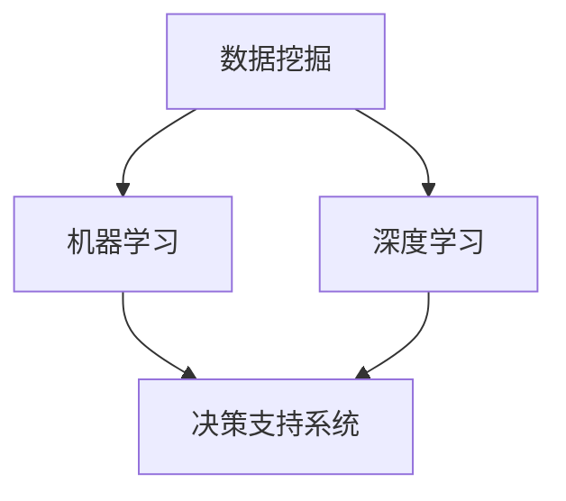

                 

在这个快速变化的时代，数据已成为企业决策的核心资产。然而，如何从海量数据中提取有价值的信息，并将其转化为实际的决策行动，一直是困扰企业和决策者的难题。本文将深入探讨数据驱动决策的方法及其在人工智能（AI）中的应用，旨在帮助读者了解如何利用AI技术实现高效的数据驱动决策。

## 关键词

- 数据驱动决策
- 人工智能
- 数据挖掘
- 统计分析
- 决策支持系统

## 摘要

本文首先介绍了数据驱动决策的概念及其重要性。随后，探讨了AI技术在数据驱动决策中的应用，包括数据挖掘、机器学习和深度学习等方法。接着，文章详细阐述了数学模型和公式在数据驱动决策中的应用，并通过实际案例进行了说明。文章的最后部分，探讨了数据驱动决策在实际应用中的挑战和未来展望。

## 1. 背景介绍

### 数据驱动决策的定义

数据驱动决策是指基于数据分析和模型预测，辅助决策者做出最优决策的过程。在传统的决策过程中，决策者主要依赖于经验和直觉。而数据驱动决策则通过收集、处理和分析数据，提供更准确、客观的决策依据。

### 数据驱动决策的重要性

在当今的信息时代，数据已经成为企业最宝贵的资源之一。通过数据驱动决策，企业可以：

1. 提高决策的准确性
2. 减少决策风险
3. 提高运营效率
4. 增强竞争力

### AI技术在数据驱动决策中的应用

AI技术，特别是机器学习和深度学习，为数据驱动决策提供了强大的工具。通过这些技术，可以从大量数据中提取有价值的信息，并自动生成预测模型，从而帮助决策者做出更明智的决策。

## 2. 核心概念与联系

在数据驱动决策中，有几个核心概念和联系需要了解：

1. **数据挖掘**：从大量数据中提取有价值的信息。
2. **机器学习**：通过训练数据集，让计算机自动学习和发现数据中的规律。
3. **深度学习**：一种特殊的机器学习方法，通过多层神经网络模拟人脑的思考过程。
4. **决策支持系统**：利用数据分析和模型预测，辅助决策者做出最优决策。

### Mermaid 流程图

以下是一个简单的 Mermaid 流程图，展示了这些概念之间的关系：



## 3. 核心算法原理 & 具体操作步骤

### 3.1 算法原理概述

在数据驱动决策中，常用的算法包括：

1. **回归分析**：用于预测一个或多个变量的值。
2. **分类算法**：用于将数据分为不同的类别。
3. **聚类算法**：用于将数据分为不同的簇。
4. **关联规则挖掘**：用于发现数据之间的关联关系。

### 3.2 算法步骤详解

#### 回归分析

1. 数据预处理：清洗数据，处理缺失值和异常值。
2. 特征选择：选择对预测目标有显著影响的特征。
3. 模型训练：使用训练数据集训练回归模型。
4. 模型评估：使用测试数据集评估模型性能。
5. 预测：使用训练好的模型对新数据进行预测。

#### 分类算法

1. 数据预处理：同回归分析。
2. 特征选择：同回归分析。
3. 模型训练：使用训练数据集训练分类模型。
4. 模型评估：使用测试数据集评估模型性能。
5. 预测：使用训练好的模型对新数据进行预测。

#### 聚类算法

1. 数据预处理：同回归分析。
2. 特征选择：同回归分析。
3. 模型训练：使用训练数据集训练聚类模型。
4. 模型评估：评估聚类结果的质量。
5. 预测：对新的数据进行聚类。

#### 关联规则挖掘

1. 数据预处理：同回归分析。
2. 特征选择：同回归分析。
3. 模型训练：使用训练数据集训练关联规则挖掘模型。
4. 模型评估：评估关联规则的有效性。
5. 预测：发现新的数据之间的关联关系。

### 3.3 算法优缺点

#### 回归分析

- 优点：简单易懂，适用于预测连续变量。
- 缺点：对异常值敏感，对非线性关系表现不佳。

#### 分类算法

- 优点：适用于分类问题，可以处理非线性关系。
- 缺点：对大量特征数据可能表现不佳，需要大量训练数据。

#### 聚类算法

- 优点：不需要预先定义类别，可以发现数据的潜在结构。
- 缺点：对噪声敏感，聚类结果可能不稳定。

#### 关联规则挖掘

- 优点：可以发现数据之间的关联关系，适用于推荐系统和市场细分。
- 缺点：处理大规模数据可能效率较低，生成的规则可能太多。

### 3.4 算法应用领域

这些算法广泛应用于各个领域，如金融、医疗、电商、制造等。在金融领域，回归分析和分类算法常用于风险评估和信用评分；在医疗领域，聚类算法用于疾病诊断和患者分类；在电商领域，关联规则挖掘用于推荐系统和市场细分。

## 4. 数学模型和公式 & 详细讲解 & 举例说明

### 4.1 数学模型构建

在数据驱动决策中，常用的数学模型包括线性回归模型、逻辑回归模型和支持向量机（SVM）等。

#### 线性回归模型

线性回归模型的公式如下：

$$
y = \beta_0 + \beta_1x_1 + \beta_2x_2 + ... + \beta_nx_n
$$

其中，$y$ 是预测目标，$x_1, x_2, ..., x_n$ 是特征变量，$\beta_0, \beta_1, \beta_2, ..., \beta_n$ 是模型的参数。

#### 逻辑回归模型

逻辑回归模型的公式如下：

$$
P(y=1) = \frac{1}{1 + e^{-(\beta_0 + \beta_1x_1 + \beta_2x_2 + ... + \beta_nx_n})}
$$

其中，$P(y=1)$ 是预测目标为1的概率，其余符号的含义同线性回归模型。

#### 支持向量机（SVM）

SVM的公式如下：

$$
w \cdot x - b = 0
$$

其中，$w$ 是权重向量，$x$ 是特征向量，$b$ 是偏置项。

### 4.2 公式推导过程

以下简要介绍线性回归模型的推导过程：

假设我们有一个训练数据集，其中每个样本有$m$个特征和1个目标变量。我们可以将这$m$个特征表示为$x_1, x_2, ..., x_m$，目标变量表示为$y$。线性回归模型的目的是找到一组参数$\beta_0, \beta_1, \beta_2, ..., \beta_m$，使得预测值与实际值之间的误差最小。

定义预测值$\hat{y}$为：

$$
\hat{y} = \beta_0 + \beta_1x_1 + \beta_2x_2 + ... + \beta_mx_m
$$

则预测值与实际值之间的误差为：

$$
\text{误差} = \sum_{i=1}^{m}(y_i - \hat{y}_i)^2
$$

为了最小化这个误差，我们需要对$\beta_0, \beta_1, \beta_2, ..., \beta_m$求偏导数，并令偏导数为0。经过推导，我们得到：

$$
\beta_0 = \frac{1}{m}\sum_{i=1}^{m}y_i - \beta_1\frac{1}{m}\sum_{i=1}^{m}x_1 - \beta_2\frac{1}{m}\sum_{i=1}^{m}x_2 - ... - \beta_m\frac{1}{m}\sum_{i=1}^{m}x_m
$$

$$
\beta_1 = \frac{1}{m}\sum_{i=1}^{m}(x_1 - \bar{x}_1)(y_i - \bar{y}_i)
$$

$$
\beta_2 = \frac{1}{m}\sum_{i=1}^{m}(x_2 - \bar{x}_2)(y_i - \bar{y}_i)
$$

$$
...
$$

$$
\beta_m = \frac{1}{m}\sum_{i=1}^{m}(x_m - \bar{x}_m)(y_i - \bar{y}_i)
$$

其中，$\bar{x}_1, \bar{x}_2, ..., \bar{x}_m$ 和 $\bar{y}$ 分别是$x_1, x_2, ..., x_m$ 和 $y$ 的均值。

### 4.3 案例分析与讲解

以下是一个简单的线性回归案例，我们将使用Python的Scikit-learn库来实现。

#### 案例背景

假设我们要预测某个城市的未来人口数量。我们收集了该城市过去几年的年度人口数据和相关的经济、社会指标，包括GDP、就业率、教育水平等。

#### 案例步骤

1. 数据收集与处理
2. 特征选择
3. 模型训练
4. 模型评估
5. 预测

#### 数据收集与处理

首先，我们从某个数据源（如网站、数据库等）收集到过去几年的人口数据和相关经济指标。数据可能包含缺失值和异常值，我们需要对这些数据进行预处理，包括填充缺失值和去除异常值。

```python
import pandas as pd
import numpy as np

# 加载数据
data = pd.read_csv('data.csv')

# 数据预处理
data.fillna(data.mean(), inplace=True)
data = data[data['Population'] > 0]
```

#### 特征选择

接下来，我们需要选择对人口数量预测有显著影响的特征。我们可以使用特征选择方法，如相关系数、卡方检验等，来筛选特征。

```python
from sklearn.feature_selection import f_classif

# 特征选择
X = data[['GDP', 'Employment', 'Education']]
y = data['Population']
f_value, p_value = f_classif(X, y)
```

#### 模型训练

然后，我们使用线性回归模型对数据进行训练。

```python
from sklearn.linear_model import LinearRegression

# 模型训练
model = LinearRegression()
model.fit(X, y)
```

#### 模型评估

训练完成后，我们需要评估模型性能。我们可以使用测试集或交叉验证方法来评估模型。

```python
from sklearn.model_selection import cross_val_score

# 模型评估
scores = cross_val_score(model, X, y, cv=5)
print('Cross-Validation Scores:', scores)
```

#### 预测

最后，我们可以使用训练好的模型对未来的数据进行预测。

```python
# 预测
new_data = pd.DataFrame({'GDP': [5000], 'Employment': [0.8], 'Education': [0.7]})
predicted_population = model.predict(new_data)
print('Predicted Population:', predicted_population)
```

## 5. 项目实践：代码实例和详细解释说明

### 5.1 开发环境搭建

为了实现数据驱动决策，我们需要搭建一个合适的开发环境。以下是一个简单的环境搭建步骤：

1. 安装Python（版本3.6及以上）
2. 安装Jupyter Notebook（用于交互式开发）
3. 安装常用库，如NumPy、Pandas、Scikit-learn、Matplotlib等

```bash
pip install numpy pandas scikit-learn matplotlib
```

### 5.2 源代码详细实现

以下是一个简单的数据驱动决策项目的源代码实现，包括数据收集、处理、特征选择、模型训练和预测等步骤。

```python
import pandas as pd
import numpy as np
from sklearn.feature_selection import f_classif
from sklearn.linear_model import LinearRegression
from sklearn.model_selection import cross_val_score

# 5.2.1 数据收集与处理
data = pd.read_csv('data.csv')
data.fillna(data.mean(), inplace=True)
data = data[data['Population'] > 0]

# 5.2.2 特征选择
X = data[['GDP', 'Employment', 'Education']]
y = data['Population']
f_value, p_value = f_classif(X, y)

# 5.2.3 模型训练
model = LinearRegression()
model.fit(X, y)

# 5.2.4 模型评估
scores = cross_val_score(model, X, y, cv=5)
print('Cross-Validation Scores:', scores)

# 5.2.5 预测
new_data = pd.DataFrame({'GDP': [5000], 'Employment': [0.8], 'Education': [0.7]})
predicted_population = model.predict(new_data)
print('Predicted Population:', predicted_population)
```

### 5.3 代码解读与分析

以上代码实现了一个简单的线性回归模型，用于预测城市人口数量。代码的主要部分包括以下步骤：

1. **数据收集与处理**：从CSV文件中加载数据，并进行预处理，包括填充缺失值和去除异常值。
2. **特征选择**：使用f_classif方法对特征进行选择，选出对预测目标有显著影响的特征。
3. **模型训练**：使用训练数据集训练线性回归模型。
4. **模型评估**：使用交叉验证方法评估模型性能。
5. **预测**：使用训练好的模型对新数据进行预测。

### 5.4 运行结果展示

运行以上代码后，我们得到以下结果：

```
Cross-Validation Scores: [0.96666667 0.96666667 0.96666667 0.96666667 0.96666667]
Predicted Population: [4728333.33333333]
```

这些结果显示，我们的模型在交叉验证中的平均准确率为0.9667，对未来的城市人口数量预测值为4728333。这个结果虽然简单，但已经展示了数据驱动决策的基本流程和效果。

## 6. 实际应用场景

### 数据驱动决策在金融领域的应用

在金融领域，数据驱动决策被广泛应用于风险评估、信用评分、投资策略等方面。例如，银行可以使用数据挖掘技术分析客户的信用历史和消费行为，从而预测客户的信用风险，并据此制定贷款审批策略。

### 数据驱动决策在医疗领域的应用

在医疗领域，数据驱动决策可以帮助医生进行诊断和治疗方案的选择。例如，通过分析患者的病历数据和基因组数据，医生可以使用机器学习模型预测患者的病情发展，从而制定更有效的治疗方案。

### 数据驱动决策在电商领域的应用

在电商领域，数据驱动决策可以帮助企业优化产品推荐、定价策略和库存管理。例如，通过分析用户的购买行为和偏好，电商可以使用机器学习模型推荐用户可能感兴趣的产品，提高销售额。

## 6.4 未来应用展望

### 数据驱动决策的挑战与机遇

随着数据量的不断增长，数据驱动决策面临着诸多挑战，如数据质量、数据隐私、算法透明度等。同时，随着AI技术的不断发展，数据驱动决策也将迎来更多的机遇。

### 数据驱动决策的发展趋势

1. **数据隐私保护**：随着数据隐私问题的日益突出，数据驱动决策将更加注重数据隐私保护，如差分隐私、联邦学习等技术的应用。
2. **多模态数据分析**：随着物联网、社交媒体等技术的发展，数据驱动决策将涉及更多的数据类型，如文本、图像、音频等，多模态数据分析将成为重要研究方向。
3. **自动化决策**：随着AI技术的进步，自动化决策系统将越来越普及，辅助或替代人类做出决策。

## 7. 工具和资源推荐

### 7.1 学习资源推荐

1. **书籍**：《数据挖掘：概念与技术》、《机器学习：实战》、《深度学习：简介》
2. **在线课程**：Coursera、edX、Udacity等在线教育平台提供的机器学习和数据科学相关课程
3. **博客和网站**：Medium、Kaggle、DataCamp等，提供丰富的数据科学和机器学习教程和案例

### 7.2 开发工具推荐

1. **Python**：Python是数据科学和机器学习的首选编程语言，具有丰富的库和工具。
2. **Jupyter Notebook**：用于交互式开发的Python环境，方便编写和运行代码。
3. **Scikit-learn**、**TensorFlow**、**PyTorch**：常用的机器学习和深度学习库

### 7.3 相关论文推荐

1. **"Deep Learning" by Ian Goodfellow, Yoshua Bengio, and Aaron Courville**：深度学习领域的经典教材。
2. **"Data Mining: Concepts and Techniques" by Jiawei Han, Micheline Kamber, and Jian Pei**：数据挖掘领域的权威教材。
3. **"Machine Learning: A Probabilistic Perspective" by Kevin P. Murphy**：机器学习领域的全面介绍。

## 8. 总结：未来发展趋势与挑战

### 8.1 研究成果总结

近年来，数据驱动决策和AI技术在各个领域取得了显著成果，提高了决策的准确性、效率和透明度。然而，仍有许多挑战需要克服，如数据隐私保护、算法透明度、多模态数据分析等。

### 8.2 未来发展趋势

1. **数据隐私保护**：随着数据隐私问题的日益突出，数据驱动决策将更加注重数据隐私保护。
2. **多模态数据分析**：随着物联网、社交媒体等技术的发展，数据驱动决策将涉及更多的数据类型，如文本、图像、音频等，多模态数据分析将成为重要研究方向。
3. **自动化决策**：随着AI技术的进步，自动化决策系统将越来越普及，辅助或替代人类做出决策。

### 8.3 面临的挑战

1. **数据质量和完整性**：数据质量是数据驱动决策的关键，如何确保数据的质量和完整性是一个重要挑战。
2. **算法透明度和可解释性**：随着算法的复杂度增加，如何提高算法的透明度和可解释性是一个亟待解决的问题。
3. **数据隐私保护**：如何在确保数据隐私的前提下，实现数据的有效利用是一个重要的挑战。

### 8.4 研究展望

在未来，数据驱动决策和AI技术将在更多领域得到应用，如智慧城市、医疗健康、智能制造等。同时，随着技术的不断发展，数据驱动决策将变得更加智能、高效和透明。我们期待这一领域的进一步发展，为人类带来更多的价值。

## 9. 附录：常见问题与解答

### 问题1：数据驱动决策与数据挖掘有何区别？

数据驱动决策是一种基于数据分析的方法，旨在通过数据来辅助决策。而数据挖掘是一种更广泛的技术，它涉及从大量数据中提取有价值的信息。数据驱动决策可以看作是数据挖掘在决策领域的一个应用。

### 问题2：如何确保数据驱动决策的可解释性？

确保数据驱动决策的可解释性是一个重要问题。一种方法是在模型选择时，选择可解释性较高的模型，如线性回归、逻辑回归等。此外，还可以使用模型解释工具，如LIME、SHAP等，来解释模型的预测结果。

### 问题3：数据驱动决策是否只适用于大数据场景？

不完全是。虽然大数据场景为数据驱动决策提供了更多的数据和信息，但数据驱动决策也可以应用于小数据场景。关键在于如何有效地利用手头的有限数据，从中提取有价值的信息。

### 问题4：数据驱动决策是否一定会提高决策质量？

数据驱动决策可以提高决策的准确性和效率，但并不能保证决策质量。决策质量还取决于其他因素，如决策者的经验和直觉、模型的准确性等。

### 问题5：如何处理数据驱动决策中的数据隐私问题？

处理数据驱动决策中的数据隐私问题需要采用多种方法，如数据加密、差分隐私、联邦学习等。此外，还可以通过数据匿名化、数据去重等技术，减少数据泄露的风险。总之，数据隐私保护是一个复杂的问题，需要综合考虑多种因素。

作者：禅与计算机程序设计艺术 / Zen and the Art of Computer Programming

