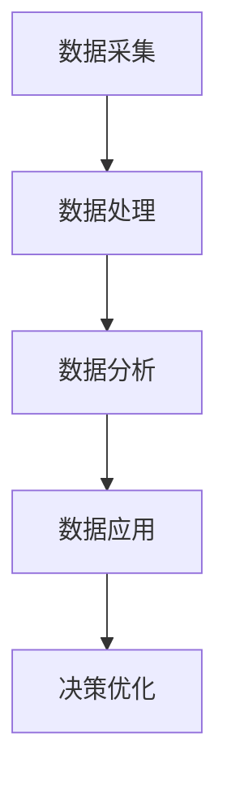

                 

关键词：数据驱动，平台经济，发展路径，数据分析，技术战略

> 摘要：本文深入探讨数据驱动平台经济的概念、核心机制及其发展路径。通过分析数据的价值挖掘、技术架构的优化、平台生态的构建等关键环节，阐述如何有效探索平台经济发展路径，为相关领域的研究和实践提供理论指导和实用建议。

## 1. 背景介绍

随着信息技术的迅猛发展，数据已成为新时代的核心生产要素。平台经济作为一种新兴的经济模式，以数据为驱动力，实现了资源的高效配置和价值的最大化。数据驱动平台经济不仅改变了传统商业模式的运作方式，还推动了产业结构的升级和经济的持续增长。然而，如何在复杂多变的市场环境中有效探索数据驱动平台经济的发展路径，成为当前学术界和产业界共同关注的焦点。

本文旨在通过对数据驱动平台经济的概念、核心机制和实际案例的深入分析，探讨其发展的有效路径。文章结构如下：

- **背景介绍**：阐述数据驱动平台经济的概念和重要性。
- **核心概念与联系**：介绍数据驱动平台经济的关键概念和架构。
- **核心算法原理 & 具体操作步骤**：分析平台经济中的核心算法原理和具体实施步骤。
- **数学模型和公式 & 详细讲解 & 举例说明**：构建数学模型，推导相关公式，并通过案例进行分析。
- **项目实践：代码实例和详细解释说明**：提供代码实例和详细解释。
- **实际应用场景**：探讨平台经济的实际应用领域和未来发展趋势。
- **工具和资源推荐**：推荐相关学习资源、开发工具和论文。
- **总结：未来发展趋势与挑战**：总结研究成果，展望未来发展趋势和面临的挑战。

## 2. 核心概念与联系

### 2.1 数据驱动平台经济的概念

数据驱动平台经济是指以数据为核心资源，通过数据采集、处理、分析和利用，实现平台内各方的利益最大化，从而推动经济持续增长的一种经济模式。在这一模式中，数据不仅是决策的依据，更是创造价值的驱动力。

### 2.2 数据驱动平台经济的架构

数据驱动平台经济的架构包括以下几个关键组成部分：

- **数据采集**：通过各种传感器、应用程序和用户行为数据，实现数据的全面采集。
- **数据处理**：通过对采集到的数据进行清洗、转换和整合，为数据分析提供高质量的数据源。
- **数据分析**：利用数据挖掘、机器学习和人工智能技术，从海量数据中提取有价值的信息。
- **数据应用**：将分析结果应用于决策、产品优化和业务创新，实现数据的商业价值。

### 2.3 Mermaid 流程图（Mermaid 流程节点中不要有括号、逗号等特殊字符）



## 3. 核心算法原理 & 具体操作步骤

### 3.1 算法原理概述

在数据驱动平台经济中，核心算法通常包括数据挖掘算法、机器学习算法和深度学习算法。这些算法能够从海量数据中提取有价值的信息，为平台运营和决策提供支持。

### 3.2 算法步骤详解

#### 3.2.1 数据挖掘算法

数据挖掘算法主要包括关联规则挖掘、分类算法、聚类算法和异常检测算法。具体步骤如下：

1. 数据预处理：清洗、转换和整合数据，为算法提供高质量的数据源。
2. 特征工程：选择和构造特征，提高算法的性能。
3. 算法选择：根据业务需求选择合适的算法，如关联规则挖掘、K-均值聚类等。
4. 模型训练与评估：使用训练数据集对算法进行训练，并使用验证数据集进行评估。

#### 3.2.2 机器学习算法

机器学习算法主要包括线性回归、决策树、支持向量机、神经网络等。具体步骤如下：

1. 数据预处理：与数据挖掘算法类似，对数据进行清洗、转换和整合。
2. 特征选择：选择与目标变量相关的特征，提高模型的预测能力。
3. 模型选择：根据数据特征和业务需求选择合适的模型。
4. 模型训练与评估：使用训练数据集对模型进行训练，并使用验证数据集进行评估。

#### 3.2.3 深度学习算法

深度学习算法主要包括卷积神经网络（CNN）、循环神经网络（RNN）和生成对抗网络（GAN）等。具体步骤如下：

1. 数据预处理：与机器学习算法类似，对数据进行清洗、转换和整合。
2. 网络架构设计：根据业务需求设计合适的神经网络架构。
3. 模型训练与评估：使用训练数据集对神经网络进行训练，并使用验证数据集进行评估。

### 3.3 算法优缺点

#### 数据挖掘算法

- **优点**：简单易懂，适用于多种业务场景。
- **缺点**：处理复杂问题时效果较差，对数据质量要求较高。

#### 机器学习算法

- **优点**：具有较强的预测能力，适用于各种复杂数据分析任务。
- **缺点**：对数据量和质量要求较高，模型调优复杂。

#### 深度学习算法

- **优点**：能处理高维数据和复杂数据结构，具有较强的泛化能力。
- **缺点**：模型训练时间长，对计算资源要求较高。

### 3.4 算法应用领域

数据驱动平台经济算法广泛应用于金融、零售、医疗、物流等领域。例如，在金融领域，算法可以用于信用评估、风险评估和投资组合优化；在零售领域，算法可以用于客户行为分析、库存管理和市场营销。

## 4. 数学模型和公式 & 详细讲解 & 举例说明

### 4.1 数学模型构建

在数据驱动平台经济中，常用的数学模型包括线性回归模型、逻辑回归模型和支持向量机模型。以下是这些模型的基本公式：

#### 线性回归模型

$$
y = \beta_0 + \beta_1x
$$

其中，$y$ 是因变量，$x$ 是自变量，$\beta_0$ 和 $\beta_1$ 是模型的参数。

#### 逻辑回归模型

$$
\log\frac{P(Y=1)}{1-P(Y=1)} = \beta_0 + \beta_1x
$$

其中，$Y$ 是二分类变量，$P(Y=1)$ 是 $Y=1$ 的概率，$\beta_0$ 和 $\beta_1$ 是模型的参数。

#### 支持向量机模型

$$
w \cdot x + b = 0
$$

其中，$w$ 是模型权重向量，$x$ 是特征向量，$b$ 是偏置项。

### 4.2 公式推导过程

以线性回归模型为例，假设我们有 $n$ 个样本点 $(x_i, y_i)$，其中 $i=1,2,...,n$。线性回归模型的损失函数为：

$$
J(\theta) = \frac{1}{2m}\sum_{i=1}^{m}(h_\theta(x_i) - y_i)^2
$$

其中，$h_\theta(x) = \theta_0 + \theta_1x$ 是模型的预测函数，$\theta_0$ 和 $\theta_1$ 是模型的参数，$m$ 是样本数量。

为了求解最优参数 $\theta_0$ 和 $\theta_1$，我们对损失函数 $J(\theta)$ 进行求导，并令导数为零：

$$
\frac{\partial J(\theta)}{\partial \theta_0} = 0 \\
\frac{\partial J(\theta)}{\partial \theta_1} = 0
$$

通过求解上述方程组，可以得到最优参数 $\theta_0$ 和 $\theta_1$。

### 4.3 案例分析与讲解

#### 案例背景

某电商平台希望通过用户购买行为分析，预测用户是否会在未来一个月内进行二次购买。现有数据包括用户ID、购买金额、购买日期、购买商品类别等。

#### 案例分析

1. 数据预处理：对数据进行清洗、转换和整合，提取有用的特征。
2. 特征选择：根据业务需求选择与二次购买相关的特征，如购买金额、购买日期等。
3. 模型选择：选择逻辑回归模型，用于预测用户是否会在未来一个月内进行二次购买。
4. 模型训练与评估：使用训练数据集对逻辑回归模型进行训练，并使用验证数据集进行评估。

#### 模型评估

1. 准确率（Accuracy）：模型预测正确的样本占总样本的比例。
2. 精确率（Precision）：模型预测为正类的样本中实际为正类的比例。
3. 召回率（Recall）：模型预测为正类的样本中实际为正类的比例。
4. F1 分数（F1 Score）：综合考虑精确率和召回率的综合指标。

## 5. 项目实践：代码实例和详细解释说明

### 5.1 开发环境搭建

在Python环境中使用Scikit-learn库实现逻辑回归模型。首先，需要安装相关依赖库：

```bash
pip install scikit-learn
```

### 5.2 源代码详细实现

```python
import numpy as np
import pandas as pd
from sklearn.model_selection import train_test_split
from sklearn.linear_model import LogisticRegression
from sklearn.metrics import accuracy_score, precision_score, recall_score, f1_score

# 数据加载与预处理
data = pd.read_csv('data.csv')
X = data[['purchase_amount', 'days_since_last_purchase']]
y = data['will_purchase_again']

# 特征选择
# 在此处进行特征选择，根据业务需求筛选相关特征

# 数据集划分
X_train, X_test, y_train, y_test = train_test_split(X, y, test_size=0.2, random_state=42)

# 模型训练
model = LogisticRegression()
model.fit(X_train, y_train)

# 模型评估
y_pred = model.predict(X_test)
accuracy = accuracy_score(y_test, y_pred)
precision = precision_score(y_test, y_pred)
recall = recall_score(y_test, y_pred)
f1 = f1_score(y_test, y_pred)

print(f"Accuracy: {accuracy:.2f}")
print(f"Precision: {precision:.2f}")
print(f"Recall: {recall:.2f}")
print(f"F1 Score: {f1:.2f}")
```

### 5.3 代码解读与分析

以上代码实现了逻辑回归模型的训练和评估。首先，加载和处理数据，然后进行特征选择和数据集划分。接下来，使用逻辑回归模型进行训练，并使用测试数据集进行评估。最后，输出评估指标，包括准确率、精确率、召回率和F1分数。

## 6. 实际应用场景

数据驱动平台经济在各个领域都有广泛的应用，以下是一些典型应用场景：

### 6.1 金融领域

金融领域利用数据驱动平台经济，实现风险控制、信用评估、投资组合优化等业务。例如，银行可以通过分析用户的交易行为、信用记录等信息，评估用户的信用风险，从而决定是否批准贷款。

### 6.2 零售领域

零售领域通过数据驱动平台经济，实现客户行为分析、库存管理和市场营销等。例如，电商平台可以通过分析用户的购买历史、浏览记录等信息，预测用户的购买意向，从而进行个性化的推荐和营销。

### 6.3 医疗领域

医疗领域利用数据驱动平台经济，实现疾病预测、诊断和治疗方案优化等。例如，通过分析患者的病史、基因数据等信息，医生可以更准确地预测疾病风险，为患者制定个性化的治疗方案。

## 7. 未来应用展望

随着技术的不断进步，数据驱动平台经济将在未来发挥更大的作用。以下是几个未来应用展望：

### 7.1 自动驾驶

自动驾驶领域利用数据驱动平台经济，实现车辆的智能决策和路径规划。例如，通过分析路况、天气等信息，自动驾驶车辆可以做出更安全的驾驶决策。

### 7.2 人工智能助手

人工智能助手利用数据驱动平台经济，实现智能对话、任务分配和个性化服务。例如，智能助手可以通过分析用户的行为和需求，提供个性化的建议和解决方案。

### 7.3 能源管理

能源管理领域利用数据驱动平台经济，实现能源的智能分配和优化。例如，通过分析用户用电行为、电网负荷等信息，能源公司可以更高效地分配电力资源，降低能源消耗。

## 8. 工具和资源推荐

### 8.1 学习资源推荐

- 《深度学习》（Goodfellow, Bengio, Courville）：全面介绍深度学习的基本概念和技术。
- 《Python数据科学手册》（McKinney, Waskom）：详细介绍Python在数据处理、分析和可视化方面的应用。

### 8.2 开发工具推荐

- Jupyter Notebook：用于数据分析和可视化的交互式开发环境。
- TensorFlow：用于深度学习模型开发和训练的开源框架。

### 8.3 相关论文推荐

- "Deep Learning for Data-Driven Platforms: A Perspective"（2019）：讨论数据驱动平台中的深度学习应用。
- "Data-Driven Platform Business Models: A Framework for Analysis"（2020）：提出数据驱动平台经济模型分析框架。

## 9. 总结：未来发展趋势与挑战

### 9.1 研究成果总结

本文从数据驱动平台经济的概念、核心机制、算法原理和实际应用等方面进行了深入探讨，总结了相关研究成果，并提出了未来发展的方向。

### 9.2 未来发展趋势

随着大数据、人工智能和云计算等技术的不断发展，数据驱动平台经济将在未来发挥更大的作用。未来发展趋势包括：

- 深度学习在数据驱动平台经济中的应用将进一步扩大。
- 数据隐私保护和数据安全将成为重要研究方向。
- 跨领域的数据驱动平台经济模式将不断涌现。

### 9.3 面临的挑战

数据驱动平台经济在发展过程中也面临着一些挑战，包括：

- 数据质量和数据隐私保护问题：如何确保数据的质量和隐私，是当前亟待解决的问题。
- 技术标准化和规范化：随着技术的发展，如何制定相关标准和规范，确保技术的可靠性和稳定性。
- 数据资源的公平分配：如何确保数据资源的公平分配，避免资源垄断和分配不均。

### 9.4 研究展望

未来，数据驱动平台经济的研究将朝着以下几个方面发展：

- 深入挖掘数据的价值，提高数据的利用效率。
- 加强数据隐私保护和安全措施，保障用户的权益。
- 探索跨领域的数据驱动平台经济模式，推动产业协同发展。

## 10. 附录：常见问题与解答

### 10.1 数据驱动平台经济的核心概念是什么？

数据驱动平台经济是指以数据为核心资源，通过数据采集、处理、分析和利用，实现平台内各方的利益最大化，从而推动经济持续增长的一种经济模式。

### 10.2 数据驱动平台经济的核心算法有哪些？

数据驱动平台经济的核心算法包括数据挖掘算法、机器学习算法和深度学习算法。

### 10.3 如何保证数据驱动平台经济中的数据质量？

保证数据质量的方法包括数据清洗、数据验证和数据集成等。通过这些方法，可以确保数据的准确性、完整性和一致性。

### 10.4 数据驱动平台经济在哪些领域有应用？

数据驱动平台经济在金融、零售、医疗、物流等多个领域有广泛应用，如风险控制、客户行为分析、疾病预测等。

### 10.5 数据驱动平台经济的未来发展有哪些趋势？

未来数据驱动平台经济将朝着深度学习应用、数据隐私保护、跨领域发展等方向继续演进。

---

作者：禅与计算机程序设计艺术 / Zen and the Art of Computer Programming


