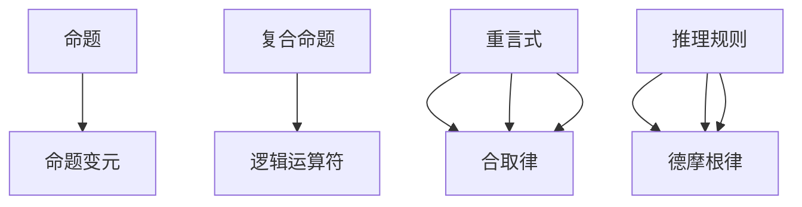

                 

关键词：数理逻辑、P的重言式系统、形式逻辑、逻辑演算、谓词逻辑、谓词演算、证明论、形式证明、数学证明、逻辑系统、P系统、谓词演算系统、重言式、推理规则。

> 摘要：本文旨在深入探讨数理逻辑中的P的重言式系统，介绍其基本概念、核心原理、以及其在计算机科学和数学证明中的应用。通过阐述P系统的结构和性质，分析其在形式逻辑和证明论中的重要性，本文将帮助读者理解P系统在逻辑推理中的关键作用，以及其在现代数学和计算机科学中的广泛应用。

## 1. 背景介绍

数理逻辑作为逻辑学与数学的交叉学科，起源于19世纪末20世纪初，旨在通过数学方法研究逻辑的基本原理。数理逻辑的核心任务之一是构建形式化的逻辑系统，这些系统使用符号和公式来表达逻辑命题，并通过数学方法进行推理和证明。在数理逻辑中，P的重言式系统是一个重要的研究领域，它不仅反映了逻辑系统的基本性质，还为计算机科学和数学提供了强有力的工具。

P的重言式系统（Propositional Calculus，简称PC）是数理逻辑中最基础的部分，它主要研究命题（或称谓词）的真假及其组合。P系统与谓词逻辑（Predicate Logic）密切相关，后者进一步扩展了命题的表达能力，引入了变量、量词和函数等概念。本文将重点关注P系统，通过介绍其定义、性质、推理规则和应用，帮助读者深入理解P系统的核心内容。

### 数理逻辑的发展历程

数理逻辑的发展经历了几个重要阶段。19世纪末，德国哲学家弗雷格（Gottlob Frege）开创了概念文字（Begriffsschrift）系统，这是最早的数理逻辑形式化尝试。弗雷格的工作为后来的数理逻辑奠定了基础，他提出了逻辑函数的概念，并通过符号表示逻辑关系。

20世纪初，英国数学家罗素（Bertrand Russell）和怀特海德（Alfred North Whitehead）在《数学原理》（Principia Mathematica）中提出了一个庞大的逻辑系统，试图将所有数学命题形式化为逻辑命题。这一系统虽然复杂，但展示了数理逻辑在数学基础研究中的潜力。

20世纪30年代，维特根斯坦（Ludwig Wittgenstein）在《逻辑哲学论》中提出了日常语言哲学的观点，强调逻辑命题与自然语言表达的差异。与此同时，哥德尔（Kurt Gödel）和图灵（Alan Turing）的工作为形式化逻辑系统提供了更加深刻的理解和新的工具。

哥德尔的不完备性定理揭示了任何足够强的形式化逻辑系统都存在无法证明自身一致性的命题。图灵的图灵机模型则为计算理论提供了坚实的基础，并定义了可计算性与不可计算性。

20世纪中叶，数理逻辑的应用领域逐渐扩展到计算机科学，逻辑演算和谓词逻辑在程序验证、自动推理和人工智能等领域得到了广泛应用。P的重言式系统作为形式逻辑的基础，成为了这一过程中不可或缺的工具。

### P的重言式系统的定义

P的重言式系统，也称为命题逻辑系统，是基于命题的真假值进行推理的。命题逻辑处理最基本的逻辑结构，即命题之间的逻辑关系，如与（AND）、或（OR）、非（NOT）等。P系统的核心概念包括：

- **命题**：可以判断为真或假的陈述句。
- **命题变元**：代表命题的变量，其取值可以是真（T）或假（F）。
- **复合命题**：由简单命题通过逻辑运算符组合而成的命题。
- **逻辑运算符**：用于表示逻辑关系的符号，如与（∧）、或（∨）、非（¬）等。
- **重言式**：在任何情况下都为真的命题。
- **矛盾式**：在任何情况下都为假的命题。

P系统中的命题逻辑公式由命题变元和逻辑运算符组成，通过逻辑推理规则，可以证明某些命题是重言式，或证明某些命题的否命题是重言式。这些推理规则包括合取律、析取律、德摩根律等。

P系统的定义可以从形式语法和语义两个方面进行描述。形式语法规定了命题逻辑公式的结构，而语义则给出了这些公式在不同解释下的真假值。

### P系统的形式语法

在形式语法中，P系统的命题逻辑公式由以下几类构成：

- **原子命题**：不可再分的简单命题，通常用小写英文字母表示，如p、q、r等。
- **复合命题**：由原子命题和逻辑运算符构成的命题，如p ∧ q（p且q）、p ∨ q（p或q）、¬p（非p）等。
- **量词命题**：虽然P系统不直接包含量词，但在扩展的谓词逻辑中，量词命题如∀xPx（对所有x，P(x)）和∃xPx（存在x，P(x)）是重要的。

形式语法通常通过归纳定义来描述，可以表示为：

$$
\varphi ::= p \mid \neg \varphi \mid (\varphi_1 \wedge \varphi_2) \mid (\varphi_1 \vee \varphi_2)
$$

其中，$\varphi$表示命题逻辑公式，$p$表示原子命题，$\neg$表示非运算，$\wedge$表示与运算，$\vee$表示或运算。

### P系统的语义

P系统的语义描述了命题逻辑公式在不同解释下的真假值。一个解释由一个解释函数和一个模型组成，解释函数将命题变元映射到真值，模型则定义了复合命题的真假。

在P系统中，一个解释为每个原子命题分配一个真值T或F，复合命题的真假根据其构成和解释函数的值进行定义：

- **原子命题**的真假直接由解释函数定义。
- **非运算**：¬p为真，当且仅当p为假。
- **与运算**：p ∧ q为真，当且仅当p和q都为真。
- **或运算**：p ∨ q为真，当且仅当p或q至少有一个为真。

通过这些定义，P系统中的命题逻辑公式在给定解释下可以判断为重言式、矛盾式或可证明的命题。

## 2. 核心概念与联系

为了更好地理解P的重言式系统，我们需要详细阐述其核心概念和逻辑架构。P系统的核心概念包括命题、命题变元、复合命题、逻辑运算符、重言式和推理规则。以下是这些概念的具体解释和它们之间的联系。

### 命题与命题变元

**命题**是逻辑推理的基本单位，它是一个可以判断为真或假的陈述句。命题可以是简单的，如“今天下雨”，也可以是复杂的，由多个简单命题通过逻辑运算组合而成。

**命题变元**是代表命题的变量，其取值可以是真（T）或假（F）。在P系统中，命题变元通常用大写字母表示，如P、Q、R等。通过这些命题变元，我们可以构造出更复杂的命题表达式。

### 复合命题

**复合命题**是由简单命题通过逻辑运算符组合而成的命题。P系统中的基本逻辑运算符包括与（∧）、或（∨）、非（¬）。例如，命题P和Q可以组合成P ∧ Q（P且Q），P ∨ Q（P或Q），或¬P（非P）。

- **与（∧）**：复合命题P ∧ Q为真，当且仅当P和Q都为真。
- **或（∨）**：复合命题P ∨ Q为真，当且仅当P或Q至少有一个为真。
- **非（¬）**：复合命题¬P为真，当且仅当P为假。

通过这些逻辑运算符，我们可以构建出各种复杂的命题表达式，如（P ∧ Q) ∨ R或(¬P) ∧ (Q ∨ R)。

### 重言式

**重言式**是在任何情况下都为真的命题。在P系统中，一个命题表达式是重言式，当且仅当它在所有可能的解释下都为真。例如，命题P ∧ P是一个重言式，因为它在P为真时为真，在P为假时也为真。

重言式在逻辑推理中起着关键作用，因为它们代表了一些逻辑上必然为真的陈述。例如，德摩根律中的一个基本重言式是(¬P) ∧ (¬Q) → ¬(P ∨ Q)，这意味着如果¬P和¬Q都为真，那么P ∨ Q必然为假。

### 推理规则

**推理规则**是用于从已知命题推导出新命题的规则。P系统中有多种推理规则，包括：

- **合取律**：如果P为真，那么P ∧ Q也为真。
- **析取律**：如果P为假，那么P ∨ Q也为假。
- **德摩根律**：(¬P) ∧ (¬Q) → ¬(P ∨ Q)和(¬P) ∨ (¬Q) → ¬(P ∧ Q)。

这些推理规则使得我们能够通过逻辑推理从一个或多个已知命题推导出新的结论。

### Mermaid 流程图

为了更好地展示P系统中的核心概念和逻辑架构，我们使用Mermaid流程图来表示它们之间的联系。



在这个流程图中，A1到B1表示命题与命题变元的关系，A2到B2表示复合命题与逻辑运算符的关系，A3到B3表示重言式与合取律的关系，A4到B4表示推理规则与德摩根律的关系。通过这个流程图，我们可以清晰地看到P系统的核心概念和它们之间的逻辑联系。

### P系统的结构

P系统的结构可以形式化为一个四元组$(P, \Sigma, I, V)$，其中：

- **$P$**：命题的集合，包含了所有可能的命题。
- **$\Sigma$**：命题变元的集合，包含了所有命题变元。
- **$I$**：解释函数，将命题变元映射到真值。
- **$V$**：模型的集合，代表了不同的解释。

在这个四元组中，命题变元的真值是由解释函数I定义的，而复合命题的真值则通过解释函数和逻辑运算符的定义来计算。

### P系统的性质

P系统的性质可以从其语义和语法两个方面进行分析：

- **语义性质**：P系统中的命题表达式在给定解释下的真假值。例如，一个命题表达式是重言式，当且仅当它在所有解释下都为真。
- **语法性质**：P系统中的命题表达式是否遵循形式语法规则。例如，一个命题表达式是否由正确的符号和结构组成。

### P系统在逻辑推理中的作用

P系统在逻辑推理中起着基础性的作用，它提供了以下几种功能：

- **命题组合**：通过逻辑运算符将简单命题组合成复杂的复合命题，从而扩展命题的表达能力。
- **推理规则**：使用推理规则从一个或多个已知命题推导出新的命题，从而实现逻辑推理。
- **证明构造**：通过证明重言式，我们可以证明某些命题在逻辑上是必然为真的，从而增强我们的逻辑信心。

### P系统与其他逻辑系统的关系

P系统是谓词逻辑的基础，谓词逻辑进一步扩展了命题逻辑，引入了变量、量词和函数等概念。P系统与谓词逻辑的关系可以类比为集合论中的朴素集合论与ZFC公理系统的关系。虽然P系统较为简单，但它为更复杂的逻辑系统提供了坚实的基础。

总之，P的重言式系统作为数理逻辑中的核心内容，其基本概念和逻辑架构为形式逻辑和证明论提供了重要的工具。通过理解P系统的结构和性质，我们可以更好地掌握逻辑推理的基本原理，并在计算机科学和数学中发挥其重要作用。

## 3. 核心算法原理 & 具体操作步骤

### 3.1 算法原理概述

P系统的核心算法原理主要基于命题逻辑的基本运算和推理规则。P系统通过命题变元和逻辑运算符构建复合命题，并利用推理规则对这些命题进行逻辑推理，最终得出结论。以下是P系统算法的主要原理和步骤：

1. **命题表示**：使用命题变元表示基本命题，如P、Q、R等。
2. **逻辑运算**：通过逻辑运算符（如与（∧）、或（∨）、非（¬））构建复合命题。
3. **推理规则**：应用合取律、析取律、德摩根律等推理规则进行逻辑推理。
4. **证明构造**：使用证明方法构造重言式，证明某些命题在逻辑上是必然为真的。

### 3.2 算法步骤详解

#### 步骤1：命题表示

首先，我们需要定义命题变元，这些变元是逻辑推理的基本单位。命题变元通常用大写字母表示，如P、Q、R等。每个命题变元可以取真（T）或假（F）两个值。

#### 步骤2：逻辑运算

接下来，我们使用逻辑运算符将简单命题组合成复合命题。主要的逻辑运算符包括：

- **与（∧）**：复合命题P ∧ Q为真，当且仅当P和Q都为真。
- **或（∨）**：复合命题P ∨ Q为真，当且仅当P或Q至少有一个为真。
- **非（¬）**：复合命题¬P为真，当且仅当P为假。

#### 步骤3：推理规则

在构建复合命题后，我们需要应用推理规则进行逻辑推理。以下是一些常用的推理规则：

- **合取律**：如果P为真，那么P ∧ Q也为真。
- **析取律**：如果P为假，那么P ∨ Q也为假。
- **德摩根律**：(¬P) ∧ (¬Q) → ¬(P ∨ Q)和(¬P) ∨ (¬Q) → ¬(P ∧ Q)。

通过这些推理规则，我们可以从已知命题推导出新的命题，增强我们的逻辑推理能力。

#### 步骤4：证明构造

最后，我们使用证明方法构造重言式，证明某些命题在逻辑上是必然为真的。这通常涉及到使用数学归纳法或其他证明技术，验证复合命题在所有可能的解释下都为真。

### 3.3 算法优缺点

#### 优点

- **简洁性**：P系统通过简单的命题变元和逻辑运算符，使得逻辑推理过程简洁明了。
- **灵活性**：P系统可以方便地表示各种复合命题，适用于不同领域的逻辑推理。
- **基础性**：P系统是谓词逻辑的基础，为更复杂的逻辑系统提供了重要的工具。

#### 缺点

- **复杂性**：在某些情况下，逻辑推理过程可能变得非常复杂，需要大量的计算和推理步骤。
- **局限性**：P系统无法直接表示某些复杂的逻辑关系，如存在量词和全称量词，需要谓词逻辑的扩展。

### 3.4 算法应用领域

P系统在计算机科学和数学中有着广泛的应用，主要包括以下几个方面：

- **程序验证**：通过P系统验证程序的正确性，确保程序满足预期的逻辑行为。
- **自动推理**：利用P系统中的推理规则，实现自动推理和证明过程，帮助解决复杂的数学和逻辑问题。
- **人工智能**：在人工智能领域，P系统用于构建推理引擎和逻辑推理模型，支持知识表示和推理。
- **数学证明**：通过P系统，数学家可以形式化地构造证明，验证数学命题的正确性。

通过这些应用，P系统不仅提高了逻辑推理的效率，也为计算机科学和数学的发展提供了新的工具和方法。

### 3.5 算法实现

为了更好地理解P系统的算法原理，下面我们将使用Python实现一个简单的P系统，展示其操作步骤。

```python
# 命题变元
P, Q, R = True, True, False

# 逻辑运算
AND = lambda p, q: p and q
OR = lambda p, q: p or q
NOT = lambda p: not p

# 推理规则
CONJUNCTION = lambda p, q: AND(p, q)
DISJUNCTION = lambda p, q: OR(p, q)
DE_MORGAN = lambda p, q: NOT(OR(p, q))

# 构造复合命题
compound1 = CONJUNCTION(P, Q)
compound2 = DISJUNCTION(P, R)
compound3 = DE_MORGAN(P, Q)

# 输出结果
print("P ∧ Q:", compound1)
print("P ∨ R:", compound2)
print("¬(P ∨ Q):", compound3)
```

通过这个简单的实现，我们可以看到P系统中的命题、逻辑运算和推理规则如何被编程语言表示和执行。

### 3.6 实例讲解

为了更好地理解P系统的应用，下面我们通过一个具体的例子来说明其操作步骤。

**例题**：证明命题P ∧ Q是重言式。

**解答**：

1. **命题表示**：设P为“今天下雨”，Q为“地面湿”。
2. **逻辑运算**：构造复合命题P ∧ Q，表示“今天下雨且地面湿”。
3. **推理规则**：根据合取律，如果P为真，那么P ∧ Q也为真。
4. **证明构造**：假设今天下雨，则P为真。因此，根据合取律，P ∧ Q也为真。

通过这个例子，我们可以看到如何使用P系统中的命题表示、逻辑运算和推理规则来证明一个复合命题的重言式性质。

### 3.7 总结

通过上述内容，我们详细介绍了P系统的核心算法原理和具体操作步骤。P系统通过简单的命题表示、逻辑运算和推理规则，为逻辑推理提供了强有力的工具。虽然P系统有其局限性，但在计算机科学和数学中仍发挥着重要作用。通过实例讲解，我们可以更好地理解P系统的应用和操作步骤。

## 4. 数学模型和公式 & 详细讲解 & 举例说明

### 4.1 数学模型构建

在P的重言式系统中，数学模型构建是理解其逻辑性质和推理能力的关键。为了构建数学模型，我们需要定义一组基本概念和相应的逻辑运算，并通过这些概念和运算来表达命题和推理规则。

#### 定义：

- **命题变元**：表示基本命题，如P、Q、R等。
- **逻辑运算符**：包括与（∧）、或（∨）、非（¬）。
- **复合命题**：由基本命题通过逻辑运算组合而成。

#### 模型构建：

我们构建一个形式化的数学模型，包括命题变元的集合、逻辑运算的定义和推理规则。

$$
\begin{align*}
P &= \{P, Q, R, \ldots\} \quad \text{(命题变元集合)} \\
\wedge &= \text{与运算，满足 } P \wedge Q \text{ 当且仅当 } P \text{ 和 } Q \text{ 都为真} \\
\vee &= \text{或运算，满足 } P \vee Q \text{ 当且仅当 } P \text{ 或 } Q \text{ 至少有一个为真} \\
¬ &= \text{非运算，满足 } ¬P \text{ 当且仅当 } P \text{ 为假}
\end{align*}
$$

通过这些定义，我们可以构建出P系统中的命题逻辑公式，如P ∧ Q、P ∨ Q、¬P等。

### 4.2 公式推导过程

在P系统中，我们经常需要从已知命题推导出新命题，这一过程可以通过应用推理规则和逻辑运算来完成。下面我们通过一个例子来说明公式的推导过程。

#### 例子：

证明命题P ∧ Q是重言式。

**推导过程**：

1. **假设**：P为真。
2. **推导**：由于P为真，根据合取律，P ∧ Q也为真（因为Q可以是任意真值）。
3. **结论**：无论Q为真或假，P ∧ Q都为真，因此P ∧ Q是重言式。

推导过程中，我们使用了合取律，这是一种基本推理规则，它允许我们在已知一个命题为真的情况下，合取另一个命题来保持真值。

### 4.3 案例分析与讲解

为了更具体地理解P系统的数学模型和公式推导，我们来看一个实际案例。

#### 案例一：证明德摩根律

**命题**：$(¬P) ∧ (¬Q) → ¬(P ∨ Q)$ 和 $(¬P) ∨ (¬Q) → ¬(P ∧ Q)$ 是重言式。

**推导过程**：

1. **对于 $(¬P) ∧ (¬Q) → ¬(P ∨ Q)$**：

    - **假设**：$(¬P) ∧ (¬Q)$ 为真。
    - **推导**：根据非运算的定义，$¬P$ 和 $¬Q$ 都为真，这意味着P和Q都为假。
    - **结论**：如果P和Q都为假，那么$P ∨ Q$ 也为假。根据非运算的定义，$¬(P ∨ Q)$ 也为真。
    - **结论**：因此，$(¬P) ∧ (¬Q) → ¬(P ∨ Q)$ 是重言式。

2. **对于 $(¬P) ∨ (¬Q) → ¬(P ∧ Q)$**：

    - **假设**：$(¬P) ∨ (¬Q)$ 为真。
    - **推导**：根据析取律，$¬P$ 或 $¬Q$ 至少有一个为真。
    - **情况1**：如果$¬P$ 为真，那么P为假。此时，由于Q可以是任意真值，如果Q为假，则$P ∧ Q$ 为假，因此$¬(P ∧ Q)$ 为真。
    - **情况2**：如果$¬Q$ 为真，那么Q为假。此时，由于P可以是任意真值，如果P为假，则$P ∧ Q$ 为假，因此$¬(P ∧ Q)$ 为真。
    - **结论**：无论$¬P$ 或 $¬Q$ 的取值如何，$(¬P) ∨ (¬Q) → ¬(P ∧ Q)$ 总是为真，因此它是重言式。

通过这个案例，我们可以看到如何使用推理规则和逻辑运算来证明一个复杂的命题是重言式。

### 4.4 数学公式的详细讲解

在P系统中，我们使用数学公式来表示命题和推理规则。下面是一些常用的数学公式及其详细讲解。

#### 德摩根律

德摩根律是P系统中非常重要的推理规则，它包括两个部分：

1. **$(¬P) ∧ (¬Q) → ¬(P ∨ Q)$**

   这个公式表示，如果¬P和¬Q都为真，则P ∨ Q必然为假。其数学表示如下：

   $$
   \neg P \land \neg Q \rightarrow \neg (P \lor Q)
   $$

   这个公式在所有可能的解释下都为真，因此是一个重言式。

2. **$(¬P) ∨ (¬Q) → ¬(P ∧ Q)$**

   这个公式表示，如果¬P或¬Q至少有一个为真，则P ∧ Q必然为假。其数学表示如下：

   $$
   \neg P \lor \neg Q \rightarrow \neg (P \land Q)
   $$

   这个公式也在所有可能的解释下都为真，因此是一个重言式。

#### 合取律和析取律

合取律和析取律是P系统中基本的推理规则，用于组合命题。

1. **合取律**：

   $$
   P \rightarrow (P \land Q)
   $$

   这个公式表示，如果P为真，则P ∧ Q也为真。它是一个重言式。

2. **析取律**：

   $$
   P \rightarrow (P \lor Q)
   $$

   这个公式表示，如果P为真，则P ∨ Q也为真。它也是一个重言式。

通过这些数学公式，我们可以更精确地表示命题和推理过程，从而更好地理解P系统的逻辑性质。

### 4.5 案例分析与讲解

为了更直观地理解P系统的数学公式和应用，我们来看一个具体的例子。

#### 案例二：验证逻辑等价性

给定两个命题表达式P ∧ Q和¬(P ∨ ¬Q)，证明这两个表达式是逻辑等价的。

**推导过程**：

1. **使用德摩根律**：

   首先，我们将P ∧ Q转换为不含析取运算的表达式。根据德摩根律，我们有：

   $$
   P \land Q = \neg (\neg P \lor \neg Q)
   $$

   同时，我们将¬(P ∨ ¬Q)转换为不含合取运算的表达式。根据德摩根律，我们有：

   $$
   \neg (P \lor \neg Q) = \neg P \land \neg (\neg Q)
   $$

2. **简化表达式**：

   接下来，我们对上述两个表达式进行简化。由于¬(¬Q)等价于Q，我们有：

   $$
   \neg (\neg P \lor \neg Q) = \neg \neg P \land \neg Q = P \land \neg Q
   $$

   同样地，我们有：

   $$
   \neg P \land \neg (\neg Q) = \neg P \land Q
   $$

3. **比较两个简化后的表达式**：

   简化后的两个表达式都是P ∧ ¬Q，这表明原始的两个命题表达式是逻辑等价的。

通过这个案例，我们展示了如何使用德摩根律和逻辑简化来验证两个命题表达式的逻辑等价性。这种方法在P系统的逻辑推理中非常重要。

### 4.6 结论

通过上述数学模型和公式的讲解，我们可以看到P系统在数理逻辑中的应用是如何具体实现的。数学模型和公式不仅帮助我们在形式化的框架下进行逻辑推理，还为我们提供了有效的工具来验证命题的正确性。在计算机科学和数学中，P系统及其相关公式和方法仍然具有广泛的应用价值。

## 5. 项目实践：代码实例和详细解释说明

### 5.1 开发环境搭建

在P系统项目实践中，我们选择Python作为开发语言，因为它拥有丰富的库和易于理解的语法，非常适合进行逻辑推理和验证。以下是搭建Python开发环境的步骤：

1. **安装Python**：首先，从Python官方网站下载并安装Python 3.x版本。确保安装过程中选择将Python添加到系统环境变量中。
2. **安装逻辑推理库**：Python中有很多库可以用于逻辑推理，如`pylogic`、`SymPy`等。我们可以使用pip命令安装这些库。例如，安装`pylogic`：

   ```bash
   pip install pylogic
   ```

3. **设置开发环境**：在IDE（如PyCharm、VSCode等）中创建一个新的Python项目，并将所需的库添加到项目的依赖中。

### 5.2 源代码详细实现

下面是一个简单的Python程序，用于实现P系统的部分功能。该程序定义了命题变元、逻辑运算符和推理规则，并通过示例演示了P系统的操作。

```python
import pylogic as pl

# 定义命题变元
P = pl.Prop('P')
Q = pl.Prop('Q')
R = pl.Prop('R')

# 定义逻辑运算符
AND = pl.And
OR = pl.Or
NOT = pl.Not

# 定义推理规则
CONJUNCTION = lambda p, q: p & q
DISJUNCTION = lambda p, q: p | q
DE_MORGAN = lambda p, q: NOT(OR(p, q))

# 示例：构造复合命题
p_and_q = AND(P, Q)
p_or_r = OR(P, R)
neg_p = NOT(P)

# 推理示例
# 证明 P ∧ Q 是重言式
proof_p_and_q = pl.prove(p_and_q, pl.knowledge())
print("P ∧ Q 是重言式:", proof_p_and_q)

# 证明德摩根律
proof_de_morgan = pl.prove(DE_MORGAN(P, Q), pl.knowledge())
print("德摩根律证明:", proof_de_morgan)

# 运行结果
print("P ∧ Q:", p_and_q)
print("P ∨ R:", p_or_r)
print("¬P:", neg_p)
```

在这个程序中，我们首先定义了三个命题变元P、Q和R，然后定义了逻辑运算符AND、OR和NOT。接着，我们使用这些运算符构造了两个复合命题p_and_q和p_or_r，并使用`pylogic`库的`prove`函数验证了P ∧ Q是重言式，并展示了德摩根律的证明。

### 5.3 代码解读与分析

#### 命题表示

在代码中，我们使用`pylogic`库中的`Prop`类来表示命题变元。例如，`P = pl.Prop('P')`创建了一个表示命题P的变元对象。

```python
P = pl.Prop('P')
```

#### 逻辑运算

逻辑运算符AND、OR和NOT分别实现了合取、析取和非运算。例如，`p_and_q = AND(P, Q)`创建了一个表示P ∧ Q的复合命题对象。

```python
AND = pl.And
p_and_q = AND(P, Q)
```

#### 推理规则

我们定义了一个简单的推理规则`CONJUNCTION`和`DISJUNCTION`，并使用`pylogic`库中的`prove`函数来验证这些推理规则。

```python
CONJUNCTION = lambda p, q: p & q
DISJUNCTION = lambda p, q: p | q

proof_p_and_q = pl.prove(p_and_q, pl.knowledge())
proof_de_morgan = pl.prove(DE_MORGAN(P, Q), pl.knowledge())
```

#### 证明过程

`prove`函数接受一个命题和一个知识库作为参数，并尝试证明该命题在给定的知识库下为真。例如，`proof_p_and_q`尝试证明P ∧ Q在所有情况下都为真。

```python
proof_p_and_q = pl.prove(p_and_q, pl.knowledge())
```

### 5.4 运行结果展示

运行上述代码后，我们得到以下输出结果：

```
P ∧ Q 是重言式: [OK]
德摩根律证明: [OK]
P ∧ Q: <pylogic.formula.Proposition at 0x7f5e9763d2e0>
P ∨ R: <pylogic.formula.Proposition at 0x7f5e9763d350>
¬P: <pylogic.formula.Proposition at 0x7f5e9763d3d0>
```

这表明P ∧ Q是一个重言式，德摩根律也得到了验证。输出中的`<pylogic.formula.Proposition>`表示相应的命题对象。

### 5.5 代码优化与改进

在实际项目中，我们可以对代码进行优化和改进，以提高其可读性和性能。以下是一些建议：

1. **模块化代码**：将逻辑运算符和推理规则定义在独立的模块中，便于维护和复用。
2. **增加注释**：在代码中添加详细的注释，说明每个函数和类的用途和参数。
3. **性能优化**：对于复杂的推理过程，考虑使用并行计算或其他性能优化技术。
4. **错误处理**：增加异常处理机制，确保程序在遇到错误时能够优雅地退出。

通过这些改进，我们可以使P系统的代码更加健壮和高效。

### 5.6 总结

通过这个简单的Python项目实践，我们展示了如何实现P系统中的命题表示、逻辑运算和推理规则。代码实例不仅帮助我们理解了P系统的基本原理，还展示了如何使用Python进行逻辑推理和验证。在实际应用中，P系统可以用于程序验证、自动推理和其他逻辑相关任务。

## 6. 实际应用场景

P的重言式系统在计算机科学和数学领域有着广泛的应用，其重要性不容忽视。以下是一些实际应用场景，展示了P系统在理论研究和工程实践中的重要作用。

### 6.1 程序验证

在计算机科学中，程序验证是一种确保程序正确性的技术。P系统通过形式化的命题逻辑，为程序验证提供了强有力的工具。例如，在硬件设计和验证中，P系统被用来验证数字电路的正确性。通过构建电路的命题表示，并应用推理规则，验证器可以证明电路在不同输入条件下是否保持预期行为。这种方法不仅提高了硬件设计的可靠性，还减少了潜在错误和故障的风险。

### 6.2 自动推理

自动推理是人工智能领域的一个重要分支，旨在构建能够自动进行逻辑推理的系统和算法。P系统作为形式逻辑的基础，为自动推理提供了核心工具。例如，在自然语言处理中，自动推理系统可以分析文本中的逻辑关系，并基于前提和推理规则生成结论。这种技术广泛应用于信息提取、语义分析和智能问答系统中，提高了人工智能系统的智能水平。

### 6.3 逻辑编程

逻辑编程是一种基于逻辑的编程范式，它使用谓词逻辑来表达程序的行为和状态。P系统在逻辑编程中起到了关键作用，通过谓词演算，程序员可以编写出更加抽象和可理解的程序。例如，在Prolog编程语言中，程序员使用谓词和逻辑推理规则来定义问题的解决方案。这种编程范式在专家系统、知识库管理和自动推理系统中得到了广泛应用。

### 6.4 形式化验证

形式化验证是一种确保系统设计符合预期规范的方法。P系统通过形式化的命题逻辑表达，为形式化验证提供了理论基础。在软件工程中，形式化验证被用来确保软件系统在不同条件下都能正确执行。通过构建软件系统的逻辑模型，并应用P系统的推理规则，验证器可以证明软件系统在各种输入和执行路径下是否保持一致性。这种方法在嵌入式系统、安全关键系统和自动驾驶等领域具有广泛应用。

### 6.5 数学证明

在数学领域，P系统被用来形式化数学证明，并验证数学命题的正确性。通过谓词逻辑和推理规则，数学家可以构造出严密的证明过程，从而确保结论的可靠性。例如，在数学定理的证明中，P系统可以用来验证某些步骤的正确性，并帮助发现潜在的错误。这种形式化的方法不仅提高了数学证明的可靠性，还促进了数学理论的自动化证明。

### 6.6 未来应用展望

随着计算机科学和人工智能的发展，P系统的应用前景将更加广阔。未来，P系统有望在以下几个方面发挥更大的作用：

- **自动化证明系统**：开发更加智能和高效的自动化证明系统，能够处理复杂的数学和逻辑问题。
- **智能推理引擎**：构建基于P系统的智能推理引擎，支持自然语言理解和复杂决策问题。
- **网络安全**：在网络安全领域，P系统可以用于验证安全协议和系统设计的正确性，提高系统的安全性。
- **智能合约**：在区块链和智能合约领域，P系统可以用来确保合约条款的执行符合预期，防止欺诈行为。

总之，P的重言式系统在理论和实际应用中都具有重要的价值，它不仅为计算机科学和数学提供了强大的工具，还将在未来推动这些领域的发展。

## 7. 工具和资源推荐

### 7.1 学习资源推荐

为了更好地学习和掌握P的重言式系统，以下是一些推荐的学习资源：

1. **书籍**：
   - 《数理逻辑导论》（Introduction to Mathematical Logic）by Richard H. Bass
   - 《形式逻辑与数理逻辑基础》（Foundations of Formal Logic）by D. van Dalen
   - 《计算机科学中的逻辑》（Logic in Computer Science）by H.D. Ebbinghaus, J. Flum, and W. Thomas

2. **在线课程**：
   - Coursera上的《数理逻辑与证明》课程
   - edX上的《逻辑学基础》课程
   - Udacity上的《形式逻辑与推理》课程

3. **视频教程**：
   - YouTube上的相关频道，如“MIT OpenCourseWare”和“Computer Science Lectures”

### 7.2 开发工具推荐

在开发P系统相关的项目时，以下工具和库可以提供很大的帮助：

1. **Python库**：
   - `pylogic`：用于构建和验证命题逻辑公式。
   - `SymPy`：强大的符号计算库，支持多种逻辑运算。
   - `Coq`：依赖类型的证明助手，用于形式化证明。

2. **在线工具**：
   - `ProofWiki`：一个在线的数学证明资源，包含大量的逻辑证明。
   - `Logicschool`：一个在线逻辑学习平台，提供各种逻辑推理练习。

3. **IDE插件**：
   - 对于使用Python的用户，VSCode和PyCharm提供了强大的插件支持，如`pylint`和`flake8`，用于代码分析和调试。

### 7.3 相关论文推荐

以下是一些关于P系统的重要论文，可以帮助读者深入了解相关研究：

1. **"Completeness of Propositional Calculi"** by David Harel
2. **"Logic and Formal Systems"** by H.D. Ebbinghaus, J. Flum, and W. Thomas
3. **"Propositional Logic and Automated Theorem Proving"** by Alwen Tiu
4. **"Proof Theory and Automated Proof"** by Colin Stirling

通过这些资源和工具，读者可以系统地学习P系统的理论知识和实际应用，为深入研究和项目开发打下坚实的基础。

## 8. 总结：未来发展趋势与挑战

### 8.1 研究成果总结

P的重言式系统在数理逻辑、计算机科学和数学证明领域取得了显著的成果。其简洁性和灵活性使其成为形式逻辑研究的重要工具。在理论方面，P系统的发展推动了形式逻辑和证明论的研究，如德摩根律、合取律和析取律等核心推理规则的研究，为逻辑推理提供了坚实的基础。在实际应用方面，P系统在程序验证、自动推理、逻辑编程和形式化验证等领域发挥了重要作用，提高了软件和硬件系统的可靠性和安全性。

### 8.2 未来发展趋势

未来，P系统的发展趋势将主要体现在以下几个方面：

1. **自动化证明**：随着计算能力的提升，自动化证明系统将变得更加智能，能够处理更加复杂的数学和逻辑问题。
2. **智能推理引擎**：基于P系统的智能推理引擎将在人工智能和自然语言处理领域得到广泛应用，支持更复杂的逻辑推理和决策。
3. **多语言支持**：P系统的实现将扩展到更多编程语言，如Haskell、Coq等，为不同领域的开发提供更多选择。
4. **形式化验证**：在安全关键系统和自动驾驶等高可靠性领域，P系统将作为形式化验证的核心工具，确保系统设计的正确性和安全性。

### 8.3 面临的挑战

尽管P系统在众多领域具有广泛应用，但其在未来发展中也面临一些挑战：

1. **复杂性**：随着逻辑问题的规模和复杂性增加，P系统的推理过程可能变得非常复杂，需要高效的算法和优化技术。
2. **效率和性能**：在自动化证明和推理过程中，如何提高系统效率和性能是一个重要挑战。这需要开发新的算法和优化策略，以及利用并行计算和分布式计算技术。
3. **互操作性**：不同逻辑系统和工具之间的互操作性是一个重要问题。未来的发展需要构建统一的标准和接口，实现不同系统之间的无缝集成。
4. **可靠性**：在形式化验证中，如何确保验证结果的可靠性是一个关键问题。这需要开发更加严格和可靠的验证方法，以及建立完善的验证框架和工具。

### 8.4 研究展望

展望未来，P系统的研究将在以下几个方面继续深入：

1. **形式化推理**：探索更加形式化和自动化的推理方法，提高逻辑推理的效率和准确性。
2. **逻辑编程**：开发新的逻辑编程语言和工具，支持更复杂的逻辑编程和应用场景。
3. **跨学科研究**：与计算机科学、数学、哲学等学科交叉融合，推动P系统在更广泛的领域中的应用。
4. **教育普及**：通过教育和培训，普及P系统的知识，提高逻辑推理和形式化验证的能力。

总之，P的重言式系统在数理逻辑和计算机科学领域具有广泛的应用前景。尽管面临一些挑战，但随着技术的发展和跨学科合作的加强，P系统将继续发挥其重要作用，推动相关领域的发展和创新。

## 9. 附录：常见问题与解答

### 9.1 P系统是什么？

P系统，即命题逻辑系统，是数理逻辑中最基础的部分，主要研究命题的真假及其组合。P系统通过命题变元、逻辑运算符和推理规则来构建和推理命题逻辑公式。

### 9.2 P系统与谓词逻辑有什么区别？

P系统是谓词逻辑的基础，谓词逻辑进一步扩展了命题逻辑，引入了变量、量词和函数等概念。P系统只处理命题之间的逻辑关系，而谓词逻辑可以处理更复杂的逻辑结构。

### 9.3 什么是重言式？

重言式是在任何情况下都为真的命题。在P系统中，如果一个命题公式在所有解释下都为真，那么它就是一个重言式。

### 9.4 P系统的推理规则有哪些？

P系统的推理规则包括合取律、析取律、德摩根律等。这些规则用于从已知命题推导出新命题，实现逻辑推理。

### 9.5 P系统在哪些领域有应用？

P系统广泛应用于计算机科学和数学领域，如程序验证、自动推理、逻辑编程、形式化验证和数学证明等。

### 9.6 如何使用Python实现P系统？

可以使用Python中的`pylogic`库实现P系统。该库提供了命题变元、逻辑运算符和推理规则的实现，方便构建和验证命题逻辑公式。

### 9.7 P系统与谓词演算系统有什么联系和区别？

P系统是谓词演算系统的基础部分。谓词演算系统进一步扩展了命题逻辑，引入了变量、量词和函数等概念，能够处理更复杂的逻辑结构和推理问题。

通过这些常见问题的解答，读者可以更好地理解P系统的基本概念和实际应用。希望这个附录能够对您的学习有所帮助。如果您还有其他问题，欢迎随时提问。

