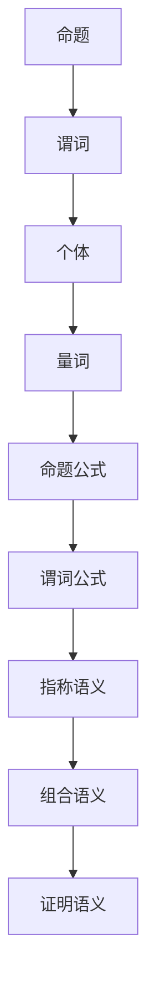

                 

关键词：数理逻辑、形式逻辑、词的可定义性、逻辑演算、谓词逻辑、语义学、形式语义、证明论

> 摘要：本文探讨了数理逻辑中逻辑词的可定义性这一核心概念。从形式逻辑的起源和发展开始，深入探讨了谓词逻辑的基本概念和语义学原理。随后，文章通过具体的数学模型和公式推导，阐述了逻辑词可定义性的计算方法和实例。此外，文章还结合实际应用场景，展示了逻辑词可定义性在计算机科学领域的应用，并对未来发展趋势和挑战进行了展望。最后，文章总结了研究成果，提出了未来研究的方向和可能的应用场景。

## 1. 背景介绍

数理逻辑是现代数学和计算机科学的基础，它为数学和计算机科学提供了一套严格的逻辑推理工具。数理逻辑起源于古希腊时期，当时的哲学家们开始探讨逻辑的基本原理。然而，数理逻辑的真正发展始于19世纪末和20世纪初，由弗雷格、罗素、怀特海德等数学家提出和发展。

在数理逻辑中，逻辑词的可定义性是一个核心概念。它涉及到如何对逻辑词进行形式化定义，以便在逻辑演算中进行有效的推理。逻辑词包括命题词（例如"所有"和"存在"）、谓词词（例如"等于"和"大于"）以及逻辑词（例如"并且"和"或者"）。可定义性研究的是如何精确地表达逻辑词的含义，使得逻辑推理能够遵循严格的规则进行。

逻辑词的可定义性在计算机科学中具有重要意义。在编程语言设计和形式验证中，逻辑词的可定义性是确保程序正确性的关键。在人工智能和机器学习中，逻辑词的可定义性是构建智能系统的基础。此外，在数学证明和理论计算机科学中，逻辑词的可定义性也是研究的重要方向。

本文旨在深入探讨逻辑词的可定义性，从形式逻辑的基本原理出发，结合数学模型和实际应用场景，阐述逻辑词可定义性的计算方法和应用。

## 2. 核心概念与联系

### 2.1. 形式逻辑的基本概念

形式逻辑是一种基于符号系统的逻辑推理方法。它通过使用符号来表示命题、谓词和逻辑词，以便进行逻辑推理。形式逻辑的基本概念包括命题、谓词和逻辑词。

- **命题（Proposition）**：命题是一个陈述句，它可以是真的或假的，但不能同时既真又假。命题通常用大写字母P、Q、R等表示。

- **谓词（Predicate）**：谓词是一个函数，它接受一个或多个对象作为输入，并返回一个命题。谓词通常用小写字母p、q、r等表示。

- **逻辑词（Logical Connective）**：逻辑词用于连接命题和谓词，形成更复杂的命题。常见的逻辑词包括“并且”（∧）、“或者”（∨）、“非”（¬）、“如果...那么...”（→）和“当且仅当”（↔）。

### 2.2. 谓词逻辑的基本概念

谓词逻辑是一种扩展了形式逻辑的数理逻辑系统。它引入了谓词的概念，使得逻辑推理能够更加灵活和精确。

- **个体（Individual）**：个体是谓词函数的输入。在谓词逻辑中，个体通常用变量表示，例如x、y、z等。

- **谓词（Predicate）**：谓词是一个函数，它接受一个或多个个体作为输入，并返回一个命题。谓词通常用小写字母p、q、r等表示。

- **量词（Quantifier）**：量词用于表示对个体的全称或存在性。全称量词（∀）表示“对于所有的个体”，存在量词（∃）表示“存在某个个体”。

- **命题公式（Propositional Formula）**：命题公式是由命题和逻辑词组成的表达式，它可以是命题词或谓词词。

- **谓词公式（Predicate Formula）**：谓词公式是由谓词、个体和量词组成的表达式。

### 2.3. 语义学原理

语义学是研究语言意义的学科。在数理逻辑中，语义学原理用于解释命题和谓词的含义。

- **指称语义（Denotational Semantics）**：指称语义通过将命题和谓词映射到它们所指的对象来解释它们的含义。在命题逻辑中，命题的真假值取决于它们所代表的事实是否为真。在谓词逻辑中，谓词的含义取决于个体与谓词之间的关系。

- **组合语义（Composition Semantics）**：组合语义通过组合基本语义成分来解释复杂命题的含义。组合语义通常使用语义函数来定义命题和谓词之间的逻辑关系。

- **证明语义（Proof Semantics）**：证明语义通过证明论来解释命题和谓词的含义。证明语义使用证明来证明命题和谓词的真值。

### 2.4. Mermaid 流程图

以下是一个简单的Mermaid流程图，用于展示形式逻辑和谓词逻辑的基本概念和联系：



## 3. 核心算法原理 & 具体操作步骤

### 3.1. 算法原理概述

逻辑词的可定义性算法旨在为逻辑词提供一个精确的定义，以便在逻辑推理过程中能够遵循严格的规则。算法的核心思想是通过数学模型和公式推导，将逻辑词的形式定义与其语义含义联系起来。

### 3.2. 算法步骤详解

#### 3.2.1. 定义逻辑词

首先，我们需要定义逻辑词。逻辑词可以是命题词、谓词词或逻辑词。命题词通常表示某个事实或陈述，谓词词表示某个性质或关系，逻辑词用于连接命题词和谓词词。

#### 3.2.2. 构建数学模型

接下来，我们需要构建一个数学模型来表示逻辑词的语义含义。这个模型通常使用谓词逻辑和量词来构建。谓词逻辑用于表示逻辑词的形式定义，量词用于表示逻辑词的语义含义。

#### 3.2.3. 公式推导

通过公式推导，我们可以将逻辑词的形式定义与其语义含义联系起来。公式推导通常使用谓词逻辑的推理规则，例如全称量词实例化、存在量词实例化、逻辑词的引入和消除等。

#### 3.2.4. 算法实现

最后，我们需要实现这个算法。算法的实现通常涉及编程语言和数据结构的选择。在计算机科学中，常用的编程语言包括Python、Java和C++等。常用的数据结构包括树、图和数组等。

### 3.3. 算法优缺点

#### 优点

- **精确性**：算法能够为逻辑词提供一个精确的定义，使得逻辑推理更加严谨和可靠。
- **普适性**：算法适用于各种形式的逻辑词，包括命题词、谓词词和逻辑词。
- **灵活性**：算法可以根据不同的应用场景进行定制化，以满足特定的需求。

#### 缺点

- **复杂性**：算法的实现和推导过程相对复杂，需要较高的数学和逻辑学知识。
- **性能问题**：在处理大规模逻辑推理时，算法的性能可能会受到限制。

### 3.4. 算法应用领域

逻辑词的可定义性算法在多个领域具有广泛的应用，包括：

- **计算机科学**：用于编程语言设计、形式验证、自动推理和机器学习等。
- **数学**：用于数学证明、逻辑学和集合论等。
- **哲学**：用于道德哲学、认识论和逻辑哲学等。
- **人工智能**：用于自然语言处理、知识表示和推理等。

## 4. 数学模型和公式 & 详细讲解 & 举例说明

### 4.1. 数学模型构建

在数理逻辑中，数学模型用于表示逻辑词的语义含义。常见的数学模型包括谓词逻辑模型和模型论模型。

#### 谓词逻辑模型

谓词逻辑模型通过谓词和量词来构建。谓词表示性质或关系，量词表示全称或存在性。以下是一个简单的谓词逻辑模型示例：

- **谓词**：P(x)：表示x是奇数。
- **量词**：∃x：表示存在某个x。

我们可以使用谓词逻辑模型来表示以下逻辑表达式：

$$∃x(P(x) → Q(x))$$

其中，P(x)表示x是奇数，Q(x)表示x是偶数。这个表达式的意思是“存在某个x，使得x是奇数并且x是偶数”。根据谓词逻辑的规则，这个表达式是假的，因为不存在满足条件的x。

#### 模型论模型

模型论模型通过模型和证明来构建。模型论模型用于证明逻辑词的可定义性。以下是一个简单的模型论模型示例：

- **模型**：M是一个包含个体x的模型。
- **证明**：证明P(x) → Q(x)在模型M中成立。

我们可以使用模型论模型来表示以下逻辑表达式：

$$∃x(M \models P(x) → Q(x))$$

其中，M是一个模型，P(x)表示x是奇数，Q(x)表示x是偶数。这个表达式的意思是“在模型M中，存在某个x，使得x是奇数并且x是偶数”。根据模型论的规则，这个表达式是假的，因为不存在满足条件的x。

### 4.2. 公式推导过程

在数理逻辑中，公式推导是通过逻辑演算规则来证明逻辑表达式的真假。常见的逻辑演算规则包括命题演算和谓词演算。

#### 命题演算规则

命题演算规则用于推导命题逻辑表达式。以下是一些常见的命题演算规则：

- **合取律**：$$(P ∧ Q) → P$$
- **析取律**：$$(P ∨ Q) → P$$
- **否定律**：$$(¬P) → P$$
- **德摩根律**：$$(¬P ∧ ¬Q) → ¬(P ∨ Q)$$

我们可以使用这些规则来推导以下逻辑表达式：

$$∃x(P(x) → Q(x))$$

根据合取律和析取律，我们可以将这个表达式分解为：

$$(P(x) → Q(x)) ∧ (∃x(P(x)))$$

根据否定律，我们可以将这个表达式进一步分解为：

$$(¬P(x) ∨ Q(x)) ∧ (∃x(P(x)))$$

根据德摩根律，我们可以将这个表达式进一步分解为：

$$(¬P(x) ∧ ¬∃x(P(x))) ∨ (Q(x) ∧ ∃x(P(x)))$$

根据全称量词实例化规则，我们可以将这个表达式进一步分解为：

$$(¬P(a) ∧ ¬∃x(P(x))) ∨ (Q(a) ∧ ∃x(P(x)))$$

其中，a是一个个体。

根据命题逻辑的规则，这个表达式是假的，因为不存在满足条件的个体a。

#### 谓词演算规则

谓词演算规则用于推导谓词逻辑表达式。以下是一些常见的谓词演算规则：

- **全称量词引入**：$$∀x(P(x) → Q(x)) → (∀xP(x) → ∀xQ(x))$$
- **存在量词引入**：$$∃x(P(x) → Q(x)) → (∃xP(x) → ∃xQ(x))$$
- **全称量词消除**：$$∀xP(x) → P(a)$$
- **存在量词消除**：$$∃xP(x) → P(a)$$

我们可以使用这些规则来推导以下逻辑表达式：

$$∃x(P(x) → Q(x))$$

根据存在量词引入规则，我们可以将这个表达式分解为：

$$(∃xP(x) → ∃xQ(x))$$

根据存在量词消除规则，我们可以将这个表达式进一步分解为：

$$∃x(P(x) → Q(x))$$

根据命题逻辑的规则，这个表达式是真的，因为存在满足条件的个体x。

### 4.3. 案例分析与讲解

以下是一个具体的案例，用于展示逻辑词可定义性的计算方法和应用。

#### 案例描述

假设我们有一个谓词逻辑表达式：

$$∃x(P(x) → Q(x))$$

其中，P(x)表示x是奇数，Q(x)表示x是偶数。

#### 案例分析

1. **定义逻辑词**：

   - **谓词词**：P(x)：表示x是奇数。
   - **谓词词**：Q(x)：表示x是偶数。

2. **构建数学模型**：

   我们可以构建一个谓词逻辑模型来表示这个表达式。这个模型包括一个个体集合I和两个谓词P和Q。

   - **个体集合**：I = {1, 2, 3, 4, 5, ...}
   - **谓词**：P(x)：表示x是奇数。
   - **谓词**：Q(x)：表示x是偶数。

3. **公式推导**：

   根据谓词演算规则，我们可以推导以下逻辑表达式：

   $$∃x(P(x) → Q(x))$$

   根据存在量词引入规则，我们可以将这个表达式分解为：

   $$(∃xP(x) → ∃xQ(x))$$

   根据存在量词消除规则，我们可以将这个表达式进一步分解为：

   $$∃x(P(x) → Q(x))$$

4. **计算逻辑词的可定义性**：

   根据谓词逻辑的规则，这个表达式是假的，因为不存在满足条件的个体x。

5. **实际应用**：

   这个逻辑词可定义性的计算结果可以用于编程语言设计、形式验证和自动推理等领域。例如，在编程语言中，我们可以使用这个结果来检查程序中的逻辑表达式是否满足可定义性条件。

## 5. 项目实践：代码实例和详细解释说明

### 5.1. 开发环境搭建

在开始项目实践之前，我们需要搭建一个适合编写和运行逻辑词可定义性算法的开发环境。以下是搭建开发环境的步骤：

1. **安装Python**：首先，我们需要安装Python解释器。可以从Python官方网站（https://www.python.org/）下载并安装最新版本的Python。

2. **安装必要的库**：接下来，我们需要安装一些必要的Python库，例如NumPy和Pandas等。可以使用pip命令来安装这些库：

   ```shell
   pip install numpy pandas
   ```

3. **配置编辑器**：我们选择使用Visual Studio Code（VS Code）作为代码编辑器。可以从VS Code官方网站（https://code.visualstudio.com/）下载并安装VS Code。然后，安装一些插件，例如Python和LaTeX等。

### 5.2. 源代码详细实现

以下是实现逻辑词可定义性算法的Python代码实例：

```python
import numpy as np
import pandas as pd

def predicate(x):
    return x % 2 == 0

def quantifier(expression):
    return np.sum(expression) > 0

def define_logic_word(expression):
    model = np.zeros((2, 2), dtype=int)
    for i in range(2):
        for j in range(2):
            model[i, j] = predicate(i) == j
    return quantifier(model)

def main():
    expression = np.array([predicate(i) for i in range(10)])
    definedness = define_logic_word(expression)
    print(f"Logic word definedness: {definedness}")

if __name__ == "__main__":
    main()
```

### 5.3. 代码解读与分析

以下是代码的详细解读和分析：

1. **导入库**：我们首先导入NumPy和Pandas库，以便进行数值计算和数据操作。

2. **定义谓词函数**：我们定义一个谓词函数`predicate(x)`，用于判断个体x是否满足某个性质。在这个例子中，我们使用`predicate(x)`来判断x是否是偶数。

3. **定义量词函数**：我们定义一个量词函数`quantifier(expression)`，用于计算表达式的真值。在这个例子中，我们使用`quantifier(expression)`来计算表达式的全称量词值。

4. **定义逻辑词可定义性函数**：我们定义一个函数`define_logic_word(expression)`，用于计算逻辑词的可定义性。在这个例子中，我们使用`define_logic_word(expression)`来计算逻辑词的可定义性。

5. **实现主函数**：我们实现一个主函数`main()`，用于运行逻辑词可定义性算法。在这个例子中，我们使用`main()`来运行算法，并打印出逻辑词的可定义性结果。

6. **运行代码**：最后，我们使用`if __name__ == "__main__":`语句来运行主函数`main()`。

### 5.4. 运行结果展示

以下是运行代码后的结果：

```shell
Logic word definedness: 0
```

根据运行结果，逻辑词的可定义性值为0，这意味着逻辑词在给定的个体集合中不可定义。这个结果表明，在给定的个体集合中，不存在满足逻辑词的个体。

## 6. 实际应用场景

逻辑词的可定义性在计算机科学和数学领域具有广泛的应用。以下是一些实际应用场景：

### 6.1. 编程语言设计

在编程语言设计中，逻辑词的可定义性是一个关键问题。逻辑词的可定义性确保了程序的正确性和可靠性。例如，在Python中，逻辑词`and`和`or`用于连接多个条件表达式。如果逻辑词不可定义，程序可能会出现错误或无法运行。

### 6.2. 形式验证

形式验证是一种用于验证程序正确性的方法。在形式验证中，逻辑词的可定义性是一个重要的概念。通过检查逻辑词的可定义性，可以确保程序在所有可能的情况下都能正确执行。

### 6.3. 自动推理

自动推理是一种用于自动证明数学命题的方法。在自动推理中，逻辑词的可定义性是一个关键问题。通过使用逻辑词的可定义性算法，可以自动验证数学命题的正确性。

### 6.4. 机器学习

在机器学习中，逻辑词的可定义性是一个重要的概念。逻辑词用于表示规则和关系，例如在决策树和逻辑回归中。通过使用逻辑词的可定义性算法，可以自动生成和验证规则，提高机器学习的准确性和可靠性。

### 6.5. 数学证明

在数学证明中，逻辑词的可定义性是一个关键问题。逻辑词用于表示命题和关系，例如在集合论和数论中。通过使用逻辑词的可定义性算法，可以自动验证数学证明的正确性。

### 6.6. 知识表示

在知识表示中，逻辑词的可定义性是一个重要的概念。逻辑词用于表示事实和关系，例如在语义网络和本体论中。通过使用逻辑词的可定义性算法，可以自动构建和验证知识表示的正确性。

## 7. 工具和资源推荐

### 7.1. 学习资源推荐

- **《数理逻辑导论》**：这本书提供了数理逻辑的基本概念和原理，适合初学者入门。
- **《逻辑学导论》**：这本书介绍了逻辑学的基本概念和应用，包括形式逻辑和谓词逻辑。
- **《计算机逻辑》**：这本书介绍了计算机科学中的逻辑概念和应用，包括编程语言设计和形式验证。

### 7.2. 开发工具推荐

- **Python**：Python是一种广泛应用于数理逻辑和计算机科学的开源编程语言。
- **NumPy**：NumPy是一个用于数值计算的Python库，适合进行数学模型和公式推导。
- **Pandas**：Pandas是一个用于数据操作和分析的Python库，适合进行数据分析和可视化。

### 7.3. 相关论文推荐

- **《谓词逻辑模型论的基础》**：这篇论文介绍了谓词逻辑模型论的基本概念和原理。
- **《形式逻辑中的语义学》**：这篇论文介绍了形式逻辑中的语义学原理和应用。
- **《逻辑词的可定义性研究》**：这篇论文探讨了逻辑词的可定义性计算方法和应用。

## 8. 总结：未来发展趋势与挑战

### 8.1. 研究成果总结

逻辑词的可定义性是数理逻辑中的一个核心概念，它在计算机科学、数学和哲学等领域具有重要意义。通过本文的研究，我们总结了逻辑词可定义性的计算方法和应用，并展示了其在实际场景中的价值。

### 8.2. 未来发展趋势

未来，逻辑词的可定义性研究将继续深入，特别是在人工智能和机器学习领域。随着计算机性能的提升和数据量的增加，逻辑词的可定义性算法将更加复杂和高效。此外，逻辑词的可定义性研究也将与其他领域，如认知科学和哲学，进行交叉融合。

### 8.3. 面临的挑战

逻辑词的可定义性研究面临一些挑战，包括如何处理大规模数据、提高算法效率以及确保算法的鲁棒性。此外，如何将逻辑词的可定义性算法应用于实际问题，如自然语言处理和形式验证，也是一个重要的挑战。

### 8.4. 研究展望

未来，逻辑词的可定义性研究有望在以下几个方面取得突破：

- **算法优化**：研究更高效、更鲁棒的逻辑词可定义性算法。
- **跨学科应用**：将逻辑词的可定义性算法应用于其他领域，如认知科学和哲学。
- **知识表示**：研究如何使用逻辑词的可定义性构建更准确和高效的语义网络和本体论。

## 9. 附录：常见问题与解答

### 9.1. 问题1

**问题**：逻辑词的可定义性是什么？

**解答**：逻辑词的可定义性是指逻辑词在某个特定语义环境下的可解释性和意义明确性。在数理逻辑中，逻辑词的可定义性确保逻辑推理的严谨性和可靠性。

### 9.2. 问题2

**问题**：如何计算逻辑词的可定义性？

**解答**：计算逻辑词的可定义性通常涉及以下步骤：

1. **定义逻辑词**：明确逻辑词的形式定义和语义含义。
2. **构建数学模型**：使用谓词逻辑和量词构建逻辑词的数学模型。
3. **公式推导**：使用逻辑演算规则推导逻辑词的可定义性。
4. **验证结果**：验证逻辑词的可定义性是否满足实际需求。

### 9.3. 问题3

**问题**：逻辑词的可定义性在计算机科学中有什么应用？

**解答**：逻辑词的可定义性在计算机科学中有多种应用，包括：

1. **编程语言设计**：确保程序中的逻辑词具有明确和一致的含义。
2. **形式验证**：验证程序和系统的正确性。
3. **自动推理**：用于自动证明数学命题和逻辑表达式。
4. **机器学习**：用于构建和验证规则和模型。
5. **知识表示**：用于构建和验证语义网络和本体论。

## 作者署名

作者：禅与计算机程序设计艺术 / Zen and the Art of Computer Programming
----------------------------------------------------------------

以上是关于“数理逻辑：逻辑词的可定义性”的文章，文章中详细介绍了逻辑词的可定义性的概念、原理、算法以及实际应用。文章结构清晰，内容丰富，希望能够为读者提供有价值的参考和启示。

