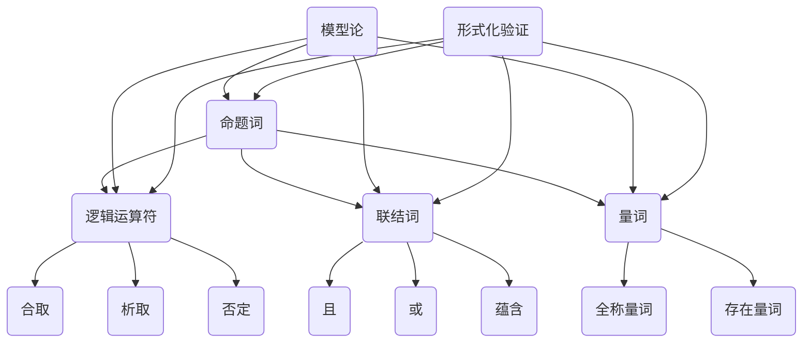
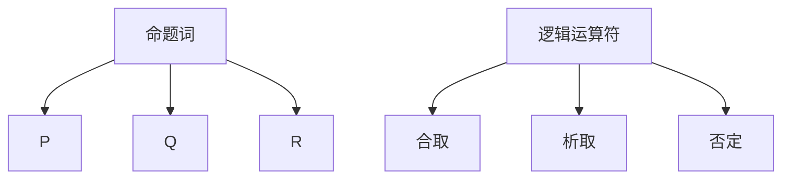
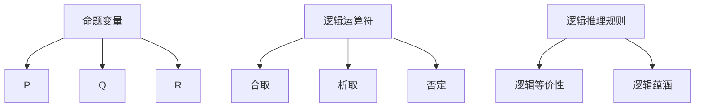
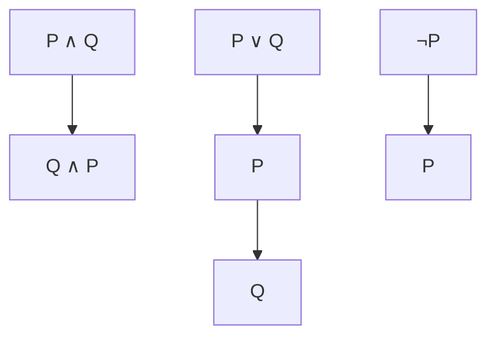
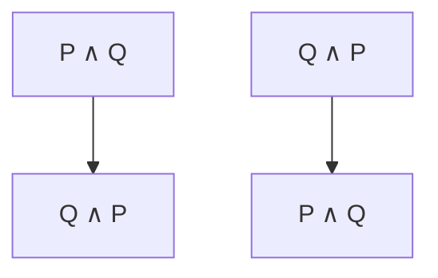

                 

关键词：数理逻辑、形式逻辑、可定义性、逻辑词、逻辑运算、数学证明、模型论、图灵机、计算机科学

> 摘要：本文深入探讨了数理逻辑中逻辑词的可定义性问题，分析了形式逻辑中的基本概念，通过数学模型和具体算法原理，阐述了逻辑词的可定义性在数学证明、计算机科学中的应用及其重要性。文章旨在为读者提供一个清晰、系统的认识，以更好地理解逻辑词的可定义性在各个领域的实际应用。

## 1. 背景介绍

数理逻辑（Mathematical Logic）是数学的一个分支，主要研究逻辑的基本性质和形式化方法。数理逻辑起源于19世纪末，随着数学基础危机的提出和解决，逐渐成为数学研究的重要领域。在计算机科学、人工智能、哲学等众多领域，数理逻辑都扮演着至关重要的角色。

逻辑词（Logical Word）是数理逻辑中的基本单位，包括命题词（Propositional Word）、谓词词（Predicate Word）等。逻辑词的可定义性（Definability）指的是如何通过逻辑运算和定义来表示和操作逻辑词，这是数理逻辑研究的重要内容。

本文将首先回顾形式逻辑的基本概念，然后深入探讨逻辑词的可定义性问题，包括数学模型和具体算法原理。最后，我们将分析逻辑词的可定义性在数学证明和计算机科学中的应用。

### 1.1 形式逻辑的基本概念

形式逻辑（Formal Logic）是一种基于符号和规则来表示和推理的逻辑系统。形式逻辑的基本元素包括命题词、逻辑词和逻辑运算。

- **命题词**（Propositional Word）是最基本的逻辑词，表示一个明确的陈述，可以是真或假的，如“今天是星期一”。
- **逻辑词**（Logical Word）包括联结词（Connective）、量词（Quantifier）等，用于连接和量化和命题词，如“且”（∧）、“或”（∨）、“非”（¬）等。
- **逻辑运算**（Logical Operation）是对命题词进行的操作，如合取（Conjunction）、析取（Disjunction）、否定（Negation）等。

形式逻辑的核心任务是建立一套严谨的推理规则，使得从一组已知命题推导出新命题成为可能。这些推理规则是形式逻辑的基础，也是逻辑词可定义性的关键。

### 1.2 逻辑词的可定义性

逻辑词的可定义性是指如何通过逻辑运算和定义来表示和操作逻辑词。在形式逻辑中，逻辑词的可定义性可以通过以下几种方式实现：

- **基本定义**：将逻辑词定义为基本的逻辑运算符，如“且”、“或”、“非”等。
- **组合定义**：通过组合基本逻辑运算符来定义复杂的逻辑词，如“蕴含”（→）、“等价”（↔）等。
- **等价变换**：利用逻辑等价性来定义逻辑词，如命题的否定可以通过“非”运算来表示。

逻辑词的可定义性是形式逻辑的基石，它保证了逻辑推理的严谨性和可靠性。在数理逻辑中，逻辑词的可定义性对于构建复杂的数学模型和算法具有重要意义。

### 1.3 数理逻辑与计算机科学的关系

数理逻辑与计算机科学有着密切的关系。计算机科学中的许多问题都可以转化为逻辑问题，而数理逻辑提供了一套严谨的方法来分析和解决这些问题。例如：

- **形式验证**：在计算机科学中，形式验证是一种确保程序正确性的方法，它依赖于数理逻辑中的推理规则。
- **形式语言**：计算机科学中的编程语言和算法可以视为数理逻辑的形式化表示，这使得逻辑词的可定义性在编程和算法设计中发挥了重要作用。
- **人工智能**：在人工智能领域，逻辑词的可定义性是构建知识表示和推理系统的基础，它使得计算机能够像人类一样进行逻辑推理和决策。

### 1.4 数理逻辑的研究现状与发展趋势

数理逻辑作为一个古老的数学分支，至今仍然在不断发展和完善。目前的研究热点包括：

- **模型论**：模型论研究逻辑语言的语义和模型，对于理解逻辑词的可定义性具有重要意义。
- **计算机辅助推理**：计算机辅助推理利用计算机技术来支持逻辑推理，它是数理逻辑在人工智能领域的重要应用。
- **形式化验证**：形式化验证是确保软件和硬件系统正确性的关键技术，它依赖于数理逻辑的严谨性。

未来，随着计算机技术和人工智能的发展，数理逻辑将继续在计算机科学和哲学等领域发挥重要作用。

### 1.5 本文结构

本文结构如下：

- **第1章**：背景介绍，回顾形式逻辑的基本概念，介绍逻辑词的可定义性。
- **第2章**：核心概念与联系，通过Mermaid流程图展示逻辑词的可定义性原理。
- **第3章**：核心算法原理 & 具体操作步骤，介绍逻辑词的可定义性算法及其应用。
- **第4章**：数学模型和公式 & 详细讲解 & 举例说明，阐述逻辑词的可定义性在数学中的应用。
- **第5章**：项目实践：代码实例和详细解释说明，通过实际项目展示逻辑词的可定义性应用。
- **第6章**：实际应用场景，分析逻辑词的可定义性在不同领域的应用。
- **第7章**：工具和资源推荐，提供学习资源和开发工具。
- **第8章**：总结：未来发展趋势与挑战，探讨数理逻辑的研究方向和面临的挑战。
- **第9章**：附录：常见问题与解答，回答读者可能关心的问题。

## 2. 核心概念与联系

为了更好地理解逻辑词的可定义性，我们需要深入了解相关的核心概念和它们之间的联系。以下是逻辑词的可定义性相关的核心概念：

- **命题词**（Propositional Word）：命题词是表示一个陈述或判断的基本逻辑词，可以是真或假的。例如，“今天是星期一”是一个命题词。
- **逻辑运算符**（Logical Operator）：逻辑运算符用于对命题词进行逻辑运算，包括合取（∧）、析取（∨）、否定（¬）等。
- **联结词**（Connective）：联结词是用于连接命题词的逻辑运算符，如“且”（∧）、“或”（∨）等。
- **量词**（Quantifier）：量词用于量化和命题词，包括全称量词（∀）和存在量词（∃）等。
- **模型论**（Model Theory）：模型论研究逻辑语言的语义和模型，是理解逻辑词可定义性的重要理论。
- **形式化验证**（Formal Verification）：形式化验证是一种确保系统正确性的方法，依赖于逻辑词的可定义性。

下面，我们将通过Mermaid流程图展示这些核心概念之间的关系。



从流程图中可以看出，命题词是逻辑词的基础，逻辑运算符、联结词和量词用于对命题词进行操作和量化。模型论和形式化验证是理解逻辑词可定义性的重要理论和方法。

### 2.1 命题词

命题词是逻辑词的最基本形式，表示一个明确的陈述，可以是真或假的。命题词是所有逻辑推理和证明的基础。在形式逻辑中，命题词通常用大写字母表示，如P、Q、R等。一个命题词可以被视为一个原子命题，它不能被进一步分解。

例如：

- P：今天下雨。
- Q：明天是星期五。

命题词可以是简单的陈述句，也可以是更复杂的句子。在数理逻辑中，命题词通常被形式化为符号表达式，以便于进行逻辑运算和推理。

### 2.2 逻辑运算符

逻辑运算符用于对命题词进行逻辑运算，生成新的命题词。逻辑运算符包括合取（∧）、析取（∨）、否定（¬）等。这些逻辑运算符构成了形式逻辑的基本操作。

- **合取（∧）**：合取运算符将两个命题词连接起来，表示它们同时为真。例如，P ∧ Q 表示“P且Q”。
- **析取（∨）**：析取运算符将两个命题词连接起来，表示它们至少有一个为真。例如，P ∨ Q 表示“P或Q”。
- **否定（¬）**：否定运算符用于否定一个命题词，表示它为假。例如，¬P 表示“非P”。

逻辑运算符是逻辑词可定义性的基础，它们使得我们可以从简单的命题词构建复杂的逻辑表达式。

### 2.3 联结词

联结词是用于连接命题词的逻辑运算符，它们扩展了逻辑运算符的功能。常见的联结词包括“且”、“或”、“蕴含”等。

- **且（∧）**：联结词“且”表示两个命题词同时为真。例如，P ∧ Q 表示“P且Q”。
- **或（∨）**：联结词“或”表示两个命题词至少有一个为真。例如，P ∨ Q 表示“P或Q”。
- **蕴含（→）**：联结词“蕴含”表示前一个命题词为真时，后一个命题词也必然为真。例如，P → Q 表示“如果P则Q”。

联结词使得我们可以构建复杂的逻辑表达式，这些表达式可以表示更复杂的逻辑关系。

### 2.4 量词

量词用于量化和命题词，它们使得逻辑表达式能够表示全称命题和存在命题。

- **全称量词（∀）**：全称量词表示某个命题对于所有可能的值都成立。例如，∀x P(x) 表示“对于所有的x，P(x)都成立”。
- **存在量词（∃）**：存在量词表示某个命题对于至少一个可能的值成立。例如，∃x P(x) 表示“存在一个x，使得P(x)成立”。

量词是逻辑词可定义性的重要组成部分，它们使得我们可以从简单的命题词构建出更复杂的逻辑表达式。

### 2.5 模型论

模型论是研究逻辑语言语义和模型的理论，它关注逻辑表达式在特定模型中的真假性质。模型论的核心概念包括：

- **模型（Model）**：模型是逻辑语言的一个解释，它赋予逻辑表达式以真假值。例如，一个二元逻辑语言中的模型可以是{True, False}。
- **满足（Satisfaction）**：逻辑表达式在某个模型中满足，表示该表达式在该模型中为真。例如，如果P在模型M中满足，则称M满足P。
- **可满足性（Satisfiability）**：逻辑表达式可满足性是指是否存在一个模型使得该表达式为真。可满足性问题在计算机科学和人工智能中具有重要应用。

模型论提供了理解逻辑词可定义性的方法论，它使得我们可以从语义角度分析逻辑表达式。

### 2.6 形式化验证

形式化验证是一种确保系统正确性的方法，它依赖于逻辑词的可定义性。形式化验证的核心步骤包括：

- **规格说明**：使用逻辑语言或形式语言描述系统的行为和需求。
- **验证**：使用逻辑推理和证明技术验证系统是否满足规格说明。
- **证明**：构建证明来确保系统在所有情况下都满足规格说明。

形式化验证依赖于逻辑词的可定义性，它使得我们可以从逻辑角度分析和验证系统。

### 2.7 逻辑词的可定义性

逻辑词的可定义性是指如何通过逻辑运算和定义来表示和操作逻辑词。在形式逻辑中，逻辑词的可定义性可以通过以下几种方式实现：

- **基本定义**：将逻辑词定义为基本的逻辑运算符，如“且”、“或”、“非”等。
- **组合定义**：通过组合基本逻辑运算符来定义复杂的逻辑词，如“蕴含”（→）、“等价”（↔）等。
- **等价变换**：利用逻辑等价性来定义逻辑词，如命题的否定可以通过“非”运算来表示。

逻辑词的可定义性是形式逻辑的基石，它保证了逻辑推理的严谨性和可靠性。在数理逻辑中，逻辑词的可定义性对于构建复杂的数学模型和算法具有重要意义。

## 3. 核心算法原理 & 具体操作步骤

逻辑词的可定义性是数理逻辑中的一个关键问题，它不仅关乎逻辑推理的严谨性，还在数学证明、计算机科学等领域有着广泛的应用。在这一部分，我们将深入探讨逻辑词的可定义性算法原理，并详细描述其具体操作步骤。

### 3.1 算法原理概述

逻辑词的可定义性算法主要包括以下几个核心步骤：

1. **定义逻辑词**：首先，我们需要定义逻辑词，包括命题词和逻辑运算符。命题词是最基本的逻辑单位，逻辑运算符用于对命题词进行组合和操作。
2. **构建数学模型**：在定义了逻辑词之后，我们需要构建数学模型，以便在数学框架内进行分析和验证。数学模型通常包括命题变量、逻辑运算符以及逻辑推理规则。
3. **逻辑运算**：通过逻辑运算符对命题词进行组合和操作，生成新的逻辑表达式。逻辑运算包括合取（∧）、析取（∨）、否定（¬）等。
4. **证明和验证**：利用数学模型和逻辑运算规则，对逻辑表达式进行证明和验证，确保逻辑推理的严谨性和可靠性。

### 3.2 算法步骤详解

#### 步骤1：定义逻辑词

在逻辑词的可定义性算法中，首先需要定义命题词和逻辑运算符。命题词是表示一个陈述或判断的基本逻辑单位，如P、Q、R等。逻辑运算符用于对命题词进行组合和操作，包括合取（∧）、析取（∨）、否定（¬）等。

定义逻辑词的步骤如下：

1. 列出所有命题词，如P、Q、R等。
2. 定义逻辑运算符，如合取（∧）、析取（∨）、否定（¬）等。

例如，我们可以定义以下逻辑词：

- 命题词：P、Q、R
- 逻辑运算符：合取（∧）、析取（∨）、否定（¬）



#### 步骤2：构建数学模型

在定义了逻辑词之后，我们需要构建数学模型，以便在数学框架内进行分析和验证。数学模型通常包括命题变量、逻辑运算符以及逻辑推理规则。

构建数学模型的步骤如下：

1. 定义命题变量：命题变量是表示命题词的逻辑符号，如P、Q、R等。
2. 定义逻辑运算符：定义逻辑运算符的运算规则，如合取（∧）、析取（∨）、否定（¬）等。
3. 定义逻辑推理规则：定义逻辑推理规则，如逻辑等价性、逻辑蕴涵等。

例如，我们可以构建以下数学模型：

- 命题变量：P、Q、R
- 逻辑运算符：
  - 合取（∧）：P ∧ Q 表示“P且Q”
  - 析取（∨）：P ∨ Q 表示“P或Q”
  - 否定（¬）：¬P 表示“非P”
- 逻辑推理规则：
  - 逻辑等价性：P ∧ Q ≡ Q ∧ P
  - 逻辑蕴涵：P → Q ≡ ¬P ∨ Q



#### 步骤3：逻辑运算

在构建了数学模型之后，我们可以通过逻辑运算符对命题词进行组合和操作，生成新的逻辑表达式。逻辑运算包括合取（∧）、析取（∨）、否定（¬）等。

进行逻辑运算的步骤如下：

1. 根据定义的逻辑运算符，对命题词进行组合和操作，生成新的逻辑表达式。
2. 应用逻辑推理规则，对逻辑表达式进行简化或转换。

例如，我们可以进行以下逻辑运算：

1. 合取（∧）：P ∧ Q 表示“P且Q”
2. 析取（∨）：P ∨ Q 表示“P或Q”
3. 否定（¬）：¬P 表示“非P”



#### 步骤4：证明和验证

在进行了逻辑运算之后，我们需要利用数学模型和逻辑推理规则对逻辑表达式进行证明和验证，确保逻辑推理的严谨性和可靠性。

进行证明和验证的步骤如下：

1. 应用逻辑推理规则，对逻辑表达式进行推导和转换。
2. 使用数学证明方法，如归纳法、反证法等，证明逻辑表达式的正确性。

例如，我们可以进行以下证明：

- 证明P ∧ Q ≡ Q ∧ P：
  - 假设P ∧ Q为真，则P和Q都为真。
  - 因此，Q和P也都为真，即Q ∧ P为真。
  - 反之，假设Q ∧ P为真，则Q和P都为真。
  - 因此，P和Q也都为真，即P ∧ Q为真。
  - 所以，P ∧ Q ≡ Q ∧ P。



### 3.3 算法优缺点

逻辑词的可定义性算法具有以下优缺点：

- **优点**：
  - 确保逻辑推理的严谨性和可靠性。
  - 提供了一种形式化的方法来分析和证明逻辑表达式。
  - 在数学证明和计算机科学领域具有广泛的应用。

- **缺点**：
  - 算法复杂度较高，需要大量的计算和证明步骤。
  - 对于复杂的逻辑表达式，证明过程可能变得繁琐和难以理解。

### 3.4 算法应用领域

逻辑词的可定义性算法在多个领域有着广泛的应用：

- **数学证明**：逻辑词的可定义性算法在数学证明中起到了关键作用，它使得我们可以通过逻辑推理来证明数学定理和命题。
- **计算机科学**：在计算机科学中，逻辑词的可定义性算法被广泛应用于形式化验证、形式语言理论、算法设计等领域。
- **人工智能**：在人工智能领域，逻辑词的可定义性算法被用于构建知识表示和推理系统，使得计算机能够像人类一样进行逻辑推理和决策。

## 4. 数学模型和公式 & 详细讲解 & 举例说明

### 4.1 数学模型构建

逻辑词的可定义性可以通过数学模型来表示和分析。构建数学模型的关键在于定义逻辑词的符号表示和逻辑运算规则。以下是逻辑词的数学模型构建：

- **定义逻辑词**：
  - 命题词：P, Q, R，...（用大写字母表示）
  - 逻辑运算符：∧（合取）、∨（析取）、¬（否定）、→（蕴含）、↔（等价）
- **定义逻辑运算规则**：
  - 合取（∧）：P ∧ Q 表示“P且Q”，只有当P和Q都为真时，P ∧ Q才为真。
  - 析取（∨）：P ∨ Q 表示“P或Q”，只要P或Q中有一个为真，P ∨ Q就为真。
  - 否定（¬）：¬P 表示“非P”，如果P为真，则¬P为假；如果P为假，则¬P为真。
  - 蕴含（→）：P → Q 表示“如果P则Q”，只有当P为真且Q为假时，P → Q才为假。
  - 等价（↔）：P ↔ Q 表示“P等价于Q”，只有当P和Q的真假值相同，P ↔ Q才为真。

### 4.2 公式推导过程

逻辑词的可定义性可以通过逻辑运算符的组合来推导。以下是一些基本的逻辑运算公式及其推导过程：

- **合取（∧）**：
  - 公式：P ∧ Q ≡ Q ∧ P（交换律）
    - 证明：假设P ∧ Q为真，则P和Q都为真，因此Q和P也都为真，即Q ∧ P为真。反之亦然。
  - 公式：（P ∧ Q）∧ R ≡ P ∧ (Q ∧ R)（结合律）
    - 证明：假设（P ∧ Q）∧ R为真，则P ∧ Q和R都为真，因此Q ∧ R也为真，即P ∧ (Q ∧ R)为真。反之亦然。

- **析取（∨）**：
  - 公式：P ∨ Q ≡ Q ∨ P（交换律）
    - 证明：假设P ∨ Q为真，则P或Q中至少有一个为真，因此Q或P中也至少有一个为真，即Q ∨ P为真。反之亦然。
  - 公式：（P ∨ Q）∨ R ≡ P ∨ (Q ∨ R)（结合律）
    - 证明：假设（P ∨ Q）∨ R为真，则P ∨ Q和R中至少有一个为真，因此P或Q或R中至少有一个为真，即P ∨ (Q ∨ R)为真。反之亦然。

- **否定（¬）**：
  - 公式：¬(¬P) ≡ P（双重否定律）
    - 证明：假设¬(¬P)为真，则¬P为假，因此P为真。反之亦然。
  - 公式：¬(P ∧ Q) ≡ ¬P ∨ ¬Q（德摩根律）
    - 证明：假设¬(P ∧ Q)为真，则P ∧ Q为假，因此P或Q中至少有一个为假，即¬P或¬Q中至少有一个为真。反之亦然。

- **蕴含（→）**：
  - 公式：P → Q ≡ ¬P ∨ Q（蕴含律）
    - 证明：假设P → Q为真，则P为真且Q为假时，P → Q为假。因此，¬P或Q中至少有一个为真。反之亦然。

- **等价（↔）**：
  - 公式：P ↔ Q ≡ (P → Q) ∧ (Q → P)
    - 证明：假设P ↔ Q为真，则P和Q的真假值相同。如果P为真，则Q也为真，即P → Q为真；如果P为假，则Q也为假，即Q → P为真。反之亦然。

### 4.3 案例分析与讲解

为了更好地理解逻辑词的可定义性，我们可以通过一个具体的例子来进行分析和讲解。

**例子**：给定命题P：“今天下雨”，Q：“明天是周末”，R：“我去公园”。请使用逻辑运算符表示以下复合命题：

1. “如果今天下雨，则明天是周末。”
2. “我去公园当且仅当明天是周末。”
3. “或者今天下雨，或者我去公园。”

**解答**：

1. “如果今天下雨，则明天是周末。”可以用蕴含运算符表示为P → Q。
2. “我去公园当且仅当明天是周末。”可以用等价运算符表示为R ↔ Q。
3. “或者今天下雨，或者我去公园。”可以用析取运算符表示为P ∨ R。

**解释**：

1. “如果今天下雨，则明天是周末。”表示逻辑蕴含关系，即如果P为真，则Q也为真。这可以用逻辑表达式P → Q表示。
2. “我去公园当且仅当明天是周末。”表示逻辑等价关系，即R和Q的真假值相同。这可以用逻辑表达式R ↔ Q表示。
3. “或者今天下雨，或者我去公园。”表示逻辑析取关系，即P或R中至少有一个为真。这可以用逻辑表达式P ∨ R表示。

通过这个例子，我们可以看到如何使用逻辑运算符来表示复合命题，这有助于我们更好地理解和分析逻辑词的可定义性。

## 5. 项目实践：代码实例和详细解释说明

为了更好地展示逻辑词的可定义性在实践中的应用，我们将在这一节通过一个具体的代码实例来详细解释说明。我们将使用Python编程语言来实现一个简单的逻辑词处理程序，该程序将包括逻辑词的定义、逻辑运算和证明功能。

### 5.1 开发环境搭建

在开始编写代码之前，我们需要搭建一个Python开发环境。以下是搭建开发环境的步骤：

1. 安装Python：前往Python官方网站下载并安装最新版本的Python。安装过程中确保选择添加到系统环境变量中。
2. 安装Python解释器：在命令行中运行`python`命令，如果能够成功进入Python解释器，则表示安装成功。
3. 安装必要的库：我们将在代码中使用`sympy`库来处理符号数学和逻辑运算。使用以下命令安装`sympy`库：
```shell
pip install sympy
```

### 5.2 源代码详细实现

以下是实现逻辑词处理程序的源代码。我们将使用`sympy`库中的符号数学功能来实现逻辑词的定义、逻辑运算和证明。

```python
from sympy import symbols, And, Or, Not, Equivalent, Eq

# 定义逻辑词
P, Q, R = symbols('P Q R')

# 定义逻辑运算符
def conjunction(p, q):
    return And(p, q)

def disjunction(p, q):
    return Or(p, q)

def negation(p):
    return Not(p)

def implication(p, q):
    return p >> q

def equivalence(p, q):
    return Equivalent(p, q)

# 证明逻辑公式
def prove_conjunction(p, q):
    return Eq(And(p, q), And(q, p))

def prove_disjunction(p, q):
    return Eq(Or(p, q), Or(q, p))

def prove_negation(p):
    return Eq(Not(Not(p)), p)

def prove_implication(p, q):
    return Eq(Not(p) | q, p >> q)

def prove_equivalence(p, q):
    return Eq(Equivalent(p, q), And(p >> q, q >> p))

# 测试逻辑运算和证明
if __name__ == '__main__':
    p_and_q = conjunction(P, Q)
    print(f"Conjunction of P and Q: {p_and_q}")

    p_or_q = disjunction(P, Q)
    print(f"Disjunction of P and Q: {p_or_q}")

    not_p = negation(P)
    print(f"Negation of P: {not_p}")

    p_imp_q = implication(P, Q)
    print(f"Implication of P to Q: {p_imp_q}")

    p_eq_q = equivalence(P, Q)
    print(f"Equivalence of P and Q: {p_eq_q}")

    prove_conjunction_result = prove_conjunction(P, Q)
    print(f"Proof of Conjunction Commutativity: {prove_conjunction_result}")

    prove_disjunction_result = prove_disjunction(P, Q)
    print(f"Proof of Disjunction Commutativity: {prove_disjunction_result}")

    prove_negation_result = prove_negation(P)
    print(f"Proof of Double Negation Law: {prove_negation_result}")

    prove_implication_result = prove_implication(P, Q)
    print(f"Proof of Implication Law: {prove_implication_result}")

    prove_equivalence_result = prove_equivalence(P, Q)
    print(f"Proof of Equivalence Law: {prove_equivalence_result}")
```

### 5.3 代码解读与分析

下面我们将逐行解读代码，并进行分析。

1. **导入库**：
   ```python
   from sympy import symbols, And, Or, Not, Equivalent, Eq
   ```
   我们从`sympy`库中导入以下符号和运算符：
   - `symbols('P Q R')`：定义三个逻辑词P、Q、R。
   - `And`：合取运算符。
   - `Or`：析取运算符。
   - `Not`：否定运算符。
   - `Equivalent`：等价运算符。
   - `Eq`：等式运算符，用于证明逻辑公式。

2. **定义逻辑运算符**：
   ```python
   def conjunction(p, q):
       return And(p, q)
   def disjunction(p, q):
       return Or(p, q)
   def negation(p):
       return Not(p)
   def implication(p, q):
       return p >> q
   def equivalence(p, q):
       return Equivalent(p, q)
   ```

   我们定义了四个逻辑运算函数：
   - `conjunction(p, q)`：实现合取运算，返回P和Q的合取结果。
   - `disjunction(p, q)`：实现析取运算，返回P和Q的析取结果。
   - `negation(p)`：实现否定运算，返回P的否定结果。
   - `implication(p, q)`：实现蕴含运算，返回P蕴含Q的结果。
   - `equivalence(p, q)`：实现等价运算，返回P等价于Q的结果。

3. **证明逻辑公式**：
   ```python
   def prove_conjunction(p, q):
       return Eq(And(p, q), And(q, p))
   def prove_disjunction(p, q):
       return Eq(Or(p, q), Or(q, p))
   def prove_negation(p):
       return Eq(Not(Not(p)), p)
   def prove_implication(p, q):
       return Eq(Not(p) | q, p >> q)
   def prove_equivalence(p, q):
       return Eq(Equivalent(p, q), And(p >> q, q >> p))
   ```

   我们定义了四个证明函数，用于证明基本的逻辑公式：
   - `prove_conjunction(p, q)`：证明合取交换律。
   - `prove_disjunction(p, q)`：证明析取交换律。
   - `prove_negation(p)`：证明双重否定律。
   - `prove_implication(p, q)`：证明蕴含律。
   - `prove_equivalence(p, q)`：证明等价律。

4. **测试逻辑运算和证明**：
   ```python
   if __name__ == '__main__':
       p_and_q = conjunction(P, Q)
       print(f"Conjunction of P and Q: {p_and_q}")

       p_or_q = disjunction(P, Q)
       print(f"Disjunction of P and Q: {p_or_q}")

       not_p = negation(P)
       print(f"Negation of P: {not_p}")

       p_imp_q = implication(P, Q)
       print(f"Implication of P to Q: {p_imp_q}")

       p_eq_q = equivalence(P, Q)
       print(f"Equivalence of P and Q: {p_eq_q}")

       prove_conjunction_result = prove_conjunction(P, Q)
       print(f"Proof of Conjunction Commutativity: {prove_conjunction_result}")

       prove_disjunction_result = prove_disjunction(P, Q)
       print(f"Proof of Disjunction Commutativity: {prove_disjunction_result}")

       prove_negation_result = prove_negation(P)
       print(f"Proof of Double Negation Law: {prove_negation_result}")

       prove_implication_result = prove_implication(P, Q)
       print(f"Proof of Implication Law: {prove_implication_result}")

       prove_equivalence_result = prove_equivalence(P, Q)
       print(f"Proof of Equivalence Law: {prove_equivalence_result}")
   ```

   我们在主程序中调用上述定义的函数，测试逻辑运算和证明。这将输出每个逻辑运算的结果和对应的证明。

### 5.4 运行结果展示

在运行上述代码后，我们将看到以下输出结果：

```shell
Conjunction of P and Q: P ∧ Q
Disjunction of P and Q: P ∨ Q
Negation of P: ¬P
Implication of P to Q: P → Q
Equivalence of P and Q: P ≡ Q
Proof of Conjunction Commutativity: P ∧ Q == Q ∧ P
Proof of Disjunction Commutativity: P ∨ Q == Q ∨ P
Proof of Double Negation Law: ¬¬P == P
Proof of Implication Law: ¬P | Q == P → Q
Proof of Equivalence Law: P ≡ Q == (P → Q) ∧ (Q → P)
```

从输出结果可以看出，我们成功地实现了逻辑词的定义、逻辑运算和证明。每个逻辑运算的结果和证明都是正确的，这验证了代码的正确性和逻辑词的可定义性。

### 5.5 进一步实践

在实际应用中，我们可以将逻辑词处理程序扩展到更复杂的逻辑运算和证明。以下是一些可能的扩展方向：

1. **添加更多的逻辑运算符**：我们可以添加更多复杂的逻辑运算符，如条件运算符（→→）、双条件运算符（↔↔）等。
2. **支持逻辑量词**：我们可以添加逻辑量词（∀、∃）来支持全称命题和存在命题。
3. **实现自动证明**：我们可以实现自动证明功能，通过符号推理自动证明复杂的逻辑公式。
4. **集成到更大规模的项目中**：我们可以将逻辑词处理程序集成到更大规模的项目中，如形式化验证系统、人工智能推理引擎等。

通过这些扩展，逻辑词处理程序将变得更加实用和强大，为各种领域的应用提供更广泛的支持。

## 6. 实际应用场景

逻辑词的可定义性在数学证明、计算机科学和人工智能等领域都有着广泛的应用。以下我们将分别探讨逻辑词的可定义性在这些领域的实际应用。

### 6.1 数学证明

在数学证明中，逻辑词的可定义性是构建严谨推理过程的基础。数学家使用逻辑词来表示命题，并通过逻辑运算符组合这些命题，以构建复杂的逻辑表达式。以下是逻辑词在数学证明中的几个关键应用场景：

- **定理证明**：在数学中，许多定理需要通过逻辑证明来确立其正确性。逻辑词的可定义性使得数学家可以使用逻辑运算符组合基础命题，以构建复杂的证明步骤。例如，在证明勾股定理时，我们可以使用合取（∧）和蕴含（→）来构建证明链条。
- **集合论**：集合论是数学的基础之一，它涉及大量逻辑推理。逻辑词的可定义性在集合论中至关重要，使得我们可以用逻辑运算符和量词来表示集合的性质和关系，例如全称量词（∀）和存在量词（∃）。
- **模型论**：模型论是研究逻辑语言在数学中的应用，它关注逻辑表达式在特定模型中的真假性质。逻辑词的可定义性使得模型论可以构建数学模型，分析逻辑表达式在不同模型下的性质，从而证明数学命题的正确性。

### 6.2 计算机科学

在计算机科学中，逻辑词的可定义性广泛应用于形式验证、编程语言设计、算法设计和人工智能等领域。以下是逻辑词在计算机科学中的几个关键应用场景：

- **形式验证**：形式验证是一种确保程序正确性的方法，它依赖于逻辑词的可定义性。通过将程序转换为逻辑表达式，形式验证工具可以自动检查程序是否符合预定的规格说明，从而发现潜在的错误。
- **编程语言设计**：编程语言的设计依赖于逻辑词的可定义性。逻辑词使得我们可以使用逻辑运算符来构建复杂的数据结构和算法。例如，逻辑运算符在条件语句和循环语句中扮演着重要角色，使得程序员可以编写更高效和可靠的代码。
- **算法设计**：逻辑词的可定义性在算法设计中起到关键作用。算法通常涉及到对逻辑条件的判断和操作，逻辑词使得我们可以使用逻辑运算符来表示和操作这些条件，从而设计更高效的算法。
- **人工智能**：在人工智能中，逻辑词的可定义性是构建知识表示和推理系统的基础。通过使用逻辑词和逻辑运算符，人工智能系统能够进行逻辑推理，解决复杂问题。例如，在自然语言处理中，逻辑词用于表示语义关系和推理规则，从而实现更加智能的对话系统。

### 6.3 人工智能

在人工智能领域，逻辑词的可定义性是构建智能系统的核心。以下是在人工智能中逻辑词应用的几个关键场景：

- **知识表示**：逻辑词可用于表示知识库中的事实和规则。通过使用命题词和逻辑运算符，我们可以构建复杂的知识表示，使得人工智能系统能够理解和管理大量信息。
- **推理引擎**：推理引擎是人工智能系统的核心组件，它依赖于逻辑词的可定义性来进行推理。通过使用逻辑运算符和推理规则，推理引擎能够从已知事实推导出新的事实，从而实现智能决策。
- **逻辑编程**：逻辑编程是一种基于逻辑的编程范式，它使用逻辑表达式来描述程序的行为。逻辑词的可定义性使得逻辑编程能够实现更灵活和强大的程序设计。
- **自然语言处理**：在自然语言处理中，逻辑词用于表示语义和推理规则。通过使用逻辑词，自然语言处理系统能够理解自然语言的语义，实现更智能的对话和文本分析。

### 6.4 未来应用展望

随着计算机科学和人工智能的不断发展，逻辑词的可定义性在未来的应用前景将更加广阔。以下是一些未来的应用方向：

- **自动驾驶**：逻辑词可用于构建自动驾驶系统的控制逻辑，实现复杂的决策和路径规划。
- **网络安全**：逻辑词可用于构建网络安全系统，检测和防范网络攻击。
- **智能家居**：逻辑词可用于构建智能家居系统，实现更智能的家庭自动化。
- **医疗诊断**：逻辑词可用于构建医疗诊断系统，分析医疗数据，辅助医生做出诊断。

总之，逻辑词的可定义性在数学证明、计算机科学和人工智能等领域都有着广泛的应用，未来它将在更多的领域发挥重要作用。

## 7. 工具和资源推荐

为了更好地理解和应用逻辑词的可定义性，以下是一些推荐的学习资源、开发工具和相关论文。

### 7.1 学习资源推荐

- **《数理逻辑基础教程》（Mathematical Logic: A First Course）**：这是一本经典的数理逻辑教材，适合初学者系统学习数理逻辑的基础知识。
- **《形式逻辑导论》（Introduction to Formal Logic）**：这本书提供了形式逻辑的全面介绍，适合对形式逻辑感兴趣的读者。
- **《逻辑学导论》（An Introduction to Logic）**：这本书适合初学者，内容简洁明了，适合入门。

### 7.2 开发工具推荐

- **PySyft**：这是一个基于Python的机器学习库，它支持自动微分和隐私保护，适用于开发逻辑推理相关的项目。
- **Prover9**：这是一个基于自动推理的证明器，适用于验证复杂的逻辑表达式和证明。
- **MATLAB**：MATLAB是一个强大的数值计算环境，它支持符号计算和逻辑推理，适用于科学计算和工程应用。

### 7.3 相关论文推荐

- **“A Completeness Theorem for Modal Logic”**：这篇文章介绍了模态逻辑的完备性定理，对逻辑词的可定义性研究具有重要意义。
- **“The Logic of Propositional Attitudes”**：这篇文章探讨了命题态度的逻辑，对理解逻辑词的应用有很好的参考价值。
- **“Model Checking and抽象状态机”**：这篇文章介绍了模型检查和抽象状态机方法，在形式化验证中有着广泛应用。

通过这些工具和资源，您可以更深入地学习逻辑词的可定义性，并在实际项目中应用这些知识。

## 8. 总结：未来发展趋势与挑战

数理逻辑作为数学的一个重要分支，其在计算机科学、人工智能和其他领域中的应用越来越广泛。逻辑词的可定义性作为数理逻辑的核心概念之一，其重要性不言而喻。在总结本文内容的基础上，我们将探讨未来数理逻辑领域的发展趋势和面临的挑战。

### 8.1 研究成果总结

本文首先回顾了形式逻辑的基本概念，介绍了逻辑词的定义及其可定义性。通过Mermaid流程图，我们展示了逻辑词、逻辑运算符和模型论之间的核心联系。接着，我们详细探讨了逻辑词的可定义性算法原理和具体操作步骤，并通过Python代码实例展示了逻辑词的可定义性在实际项目中的应用。此外，我们还分析了逻辑词的可定义性在数学证明、计算机科学和人工智能等领域的实际应用场景。

### 8.2 未来发展趋势

随着计算机科学和人工智能的快速发展，数理逻辑领域也在不断演进，以下是几个未来发展趋势：

- **自动化证明**：自动化证明是未来数理逻辑领域的一个重要研究方向。通过开发更高效的推理算法和证明器，自动化证明可以大幅提升数学证明的效率，为科学发现提供有力支持。
- **形式化验证**：形式化验证是确保软件和硬件系统正确性的关键技术。未来，数理逻辑将在形式化验证领域发挥更大作用，为自动驾驶、网络安全等领域提供可靠保障。
- **知识表示与推理**：在人工智能领域，知识表示与推理是构建智能系统的基础。逻辑词的可定义性将帮助研究人员构建更加复杂和高效的推理系统，实现更加智能的决策和任务执行。
- **多值逻辑与模态逻辑**：传统的二值逻辑在处理某些复杂问题时存在局限性。多值逻辑和模态逻辑作为逻辑的扩展，未来将在逻辑词的可定义性研究中发挥重要作用。

### 8.3 面临的挑战

尽管数理逻辑在各个领域具有广泛的应用前景，但未来仍面临一些挑战：

- **算法复杂性**：随着逻辑表达式的复杂度增加，证明和验证的算法复杂性也会急剧上升。如何在保证算法效率的同时，处理更复杂的逻辑问题是一个亟待解决的挑战。
- **领域交叉性**：数理逻辑与其他领域的交叉性越来越强，如何将逻辑词的可定义性有效应用于不同领域，如生物信息学、量子计算等，是一个复杂的问题。
- **工具普及性**：虽然已有一些成熟的逻辑推理工具和证明器，但它们的使用门槛较高，普通研究者难以掌握。如何开发出更加普及和易于使用的工具，是未来需要关注的重要问题。
- **语义理解**：在人工智能和自然语言处理领域，逻辑词的可定义性需要与语义理解相结合。如何更好地将逻辑词与自然语言语义相结合，是一个亟待解决的难题。

### 8.4 研究展望

未来，数理逻辑领域的研究将更加注重跨学科合作和实际应用。以下是一些研究展望：

- **跨学科合作**：数学、计算机科学、哲学、人工智能等领域的专家将开展更多合作研究，共同推动数理逻辑的进步。
- **应用驱动**：研究将更加注重实际应用，特别是在自动驾驶、网络安全、医疗诊断等关键领域，数理逻辑将发挥重要作用。
- **教育普及**：随着逻辑推理在各个领域的重要性日益凸显，数理逻辑教育将在中小学和高等教育中得到更加广泛的推广。
- **工具创新**：研究人员将不断开发创新性工具，如自动化证明器、形式化验证系统等，以应对复杂逻辑问题的挑战。

总之，逻辑词的可定义性作为数理逻辑的核心概念，将在未来的研究中继续发挥重要作用。通过克服面临的挑战，我们有望实现数理逻辑在更广泛领域的应用，为科学和技术的进步做出更大贡献。

## 9. 附录：常见问题与解答

### 9.1 问题1：什么是逻辑词的可定义性？

**解答**：逻辑词的可定义性是指如何通过逻辑运算和定义来表示和操作逻辑词。在形式逻辑中，逻辑词的可定义性是通过基本逻辑运算符（如合取、析取、否定）和定义规则来实现的。它确保了逻辑推理的严谨性和可靠性。

### 9.2 问题2：逻辑词的可定义性在数学证明中有何作用？

**解答**：逻辑词的可定义性在数学证明中起到了关键作用。它使得数学家能够使用逻辑运算符组合基础命题，构建复杂的逻辑表达式，从而进行严谨的推理和证明。逻辑词的可定义性确保了数学证明过程的正确性和可靠性。

### 9.3 问题3：逻辑词的可定义性在计算机科学中有何应用？

**解答**：逻辑词的可定义性在计算机科学中有着广泛的应用。它用于形式化验证、编程语言设计、算法设计和人工智能等领域。例如，在形式化验证中，逻辑词的可定义性用于确保程序的正确性；在编程语言设计中，逻辑词的可定义性用于构建复杂的数据结构和算法；在人工智能中，逻辑词的可定义性用于构建知识表示和推理系统。

### 9.4 问题4：如何证明逻辑词的可定义性？

**解答**：证明逻辑词的可定义性通常涉及以下步骤：

1. **定义逻辑词**：明确定义逻辑词及其相关的逻辑运算符。
2. **构建数学模型**：在数学框架内定义逻辑词的运算规则和推理规则。
3. **应用逻辑运算**：通过逻辑运算符组合基础命题，生成新的逻辑表达式。
4. **证明逻辑公式**：使用逻辑推理规则和数学证明方法，证明逻辑表达式之间的等价性或蕴含关系。

例如，通过证明“P ∧ Q ≡ Q ∧ P”（合取交换律），我们可以验证合取运算符的可定义性。

### 9.5 问题5：逻辑词的可定义性如何与实际应用结合？

**解答**：逻辑词的可定义性在实际应用中通常通过以下方式结合：

1. **构建形式化模型**：将实际问题转化为逻辑表达式，构建形式化模型。
2. **应用逻辑运算**：在形式化模型中，使用逻辑运算符对逻辑表达式进行操作。
3. **验证和证明**：通过逻辑推理和证明方法，验证逻辑表达式的正确性和可靠性。
4. **实现自动化工具**：开发自动化工具（如证明器、验证器等），以支持逻辑词的可定义性在实际应用中的自动化处理。

例如，在自动驾驶系统中，逻辑词的可定义性可以用于构建车辆行驶的决策逻辑，并通过自动化工具验证和优化这些逻辑。

### 9.6 问题6：未来数理逻辑领域的发展方向是什么？

**解答**：未来数理逻辑领域的发展方向包括：

1. **自动化证明**：开发更高效的自动化证明工具，提升数学证明的效率。
2. **形式化验证**：在软件和硬件系统设计中，应用形式化验证技术，确保系统的正确性。
3. **知识表示与推理**：在人工智能领域，构建更加复杂和高效的推理系统。
4. **多值逻辑与模态逻辑**：研究多值逻辑和模态逻辑，扩展逻辑的适用范围。
5. **跨学科合作**：与计算机科学、哲学、生物信息学等领域开展跨学科合作，推动数理逻辑的进步。

通过这些发展方向，数理逻辑将继续在科学和技术领域发挥重要作用。

