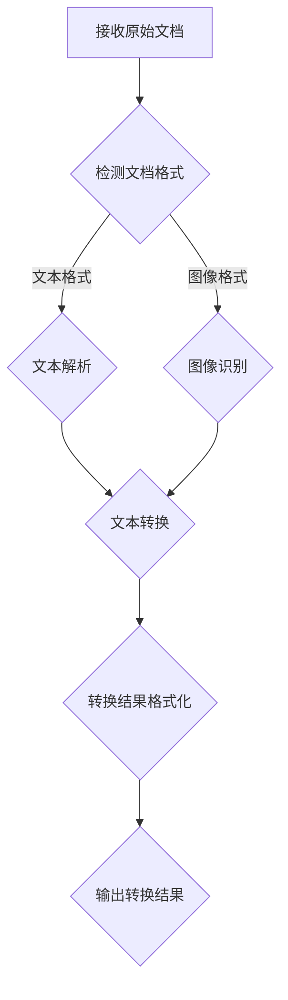

                 

文档转换器是现代计算技术中的一个关键组件，它们在众多行业和领域发挥着重要作用。无论是为了提高工作效率、促进信息共享，还是为了满足特定的合规要求，文档转换技术在今天的信息时代中无处不在。本文将深入探讨文档转换器的概念、核心原理、算法实现、数学模型、实际应用，以及未来发展趋势。

## 文章关键词

- 文档转换
- 人工智能
- 自然语言处理
- 文本解析
- 图像识别
- 文档格式转换
- 编码与解码

## 文章摘要

本文将详细介绍文档转换器的工作原理、关键算法和数学模型，并通过实际案例展示其在多种应用场景中的实用性。我们将探讨文档转换器如何通过先进的算法和数学模型，将一种文档格式转换成另一种格式，以适应不同的使用场景和需求。此外，还将分析文档转换器在不同行业中的实际应用，以及未来可能的发展趋势。

## 1. 背景介绍

文档转换器的历史可以追溯到计算机科学和信息技术发展的早期。在20世纪70年代，随着个人计算机的普及和办公自动化需求的增长，文档转换技术开始受到关注。最初的文档转换主要是文本格式的转换，如将ASCII文本转换为多种文本编辑器可读的格式。

随着时间的推移，文档转换器逐渐演变成一个复杂的系统，能够处理多种类型的文档，包括文本、图像、音频和视频等。随着互联网的兴起和大数据时代的到来，文档转换器的需求变得更加多样化。例如，企业需要将纸质文档转换为电子文档以实现数字化管理，网站开发者需要将不同的文档格式转换为适合网页展示的格式，而研究人员则需要将来自不同数据库和格式的数据整合到一起进行深入分析。

在现代计算技术中，文档转换器的重要性体现在以下几个方面：

1. **提高工作效率**：通过自动化转换文档，减少了手动操作的时间和错误率。
2. **促进信息共享**：将不同格式的文档转换为统一的格式，使得跨平台、跨系统之间的信息交换变得更加容易。
3. **合规性**：某些行业和地区有特定的文档格式要求，文档转换器可以帮助满足这些要求。
4. **数据整合与分析**：在数据处理和分析中，经常需要将不同格式的数据转换为统一格式，以便进行进一步的分析。

文档转换器的应用领域广泛，包括但不限于：

- **企业办公自动化**：将纸质文档、扫描文档、电子表格等转换成PDF、Word、Excel等常用文档格式。
- **网站开发与维护**：将不同格式的文档转换为适合网页展示的HTML、CSS、JavaScript等格式。
- **学术研究**：将不同数据库、文本文件、图像文件等转换成统一的格式，便于分析。
- **医疗健康**：将纸质病历、检查报告等转换成电子病历系统可以读取的格式。
- **政府与公共事务**：提供在线服务，如公众可以下载政府文件的电子版，这些文件通常以PDF格式提供。

## 2. 核心概念与联系

文档转换器的核心概念涉及多个方面，包括文档格式、转换算法、自然语言处理、图像识别和文本解析等。以下是一个简化的 Mermaid 流程图，展示了文档转换器的基本工作流程：



### 2.1 文档格式

文档格式是文档转换器处理的首要对象。常见的文档格式包括：

- **文本格式**：如纯文本文件（.txt）、富文本格式（.rtf）、超文本标记语言（.html）等。
- **电子表格格式**：如Excel（.xlsx）、CSV（.csv）等。
- **图像格式**：如JPEG（.jpg）、PNG（.png）、PDF（.pdf）等。
- **数据库格式**：如SQL数据库、NoSQL数据库等。

### 2.2 转换算法

文档转换器的核心在于转换算法，这些算法需要能够理解不同文档格式之间的差异，并进行相应的处理。常见的转换算法包括：

- **文本转换算法**：负责将一种文本格式转换为另一种文本格式。这通常涉及文本解析、标记识别和格式重排。
- **图像识别算法**：通过图像识别技术将图像格式的文档转换为文本格式。这通常涉及边缘检测、字符识别和图像分割等技术。
- **电子表格转换算法**：将电子表格的格式进行转换，如将Excel转换为CSV，或将CSV转换为数据库表。
- **数据库转换算法**：将不同数据库格式之间的数据转换为统一的格式。

### 2.3 自然语言处理

自然语言处理（NLP）技术在文档转换器中扮演着重要角色，特别是在处理文本格式文档时。NLP 技术可以帮助文档转换器理解文本的含义，从而进行更准确的转换。常见的 NLP 技术包括：

- **词性标注**：识别文本中的单词及其词性。
- **实体识别**：识别文本中的关键实体，如人名、地点、组织名等。
- **句法分析**：分析文本中的句子结构，理解句子的语法关系。
- **语义分析**：理解文本的整体语义，包括情感分析、主题识别等。

### 2.4 图像识别

图像识别技术在将图像格式文档转换为文本格式时至关重要。通过图像识别，文档转换器可以提取图像中的文本内容。常见的图像识别技术包括：

- **边缘检测**：用于识别图像中的边缘，从而定位文本区域。
- **字符识别**：通过模式识别技术识别图像中的字符。
- **图像分割**：将图像分割成多个区域，以便更精确地识别其中的文本。

### 2.5 文本解析

文本解析是文档转换器处理文本格式文档的关键步骤。通过文本解析，文档转换器可以提取文本中的关键信息，如标题、段落、列表等。文本解析技术包括：

- **标记识别**：识别文本中的不同标记，如段落标记、列表标记等。
- **格式重排**：根据目标文档格式重新排列文本内容。
- **内容提取**：提取文本中的关键内容，如日期、时间、数字等。

## 3. 核心算法原理 & 具体操作步骤

### 3.1 算法原理概述

文档转换器中的核心算法原理主要包括文本解析、图像识别和自然语言处理等技术。以下是对这些算法的概述：

- **文本解析**：文本解析算法通过分析文本的格式和结构，提取出文本中的关键信息。这通常涉及到词法分析、句法分析和语义分析等步骤。词法分析负责将文本分解为单词和其他标识符；句法分析负责分析单词之间的语法关系；语义分析则负责理解文本的整体含义。

- **图像识别**：图像识别算法通过计算机视觉技术，将图像中的文本内容转化为机器可处理的格式。这通常包括边缘检测、特征提取、字符识别等步骤。边缘检测用于识别图像中的文本区域；特征提取用于提取文本字符的特征；字符识别则用于识别图像中的每个字符。

- **自然语言处理**：自然语言处理技术用于处理和理解文本。这包括词性标注、命名实体识别、句法分析和语义分析等步骤。词性标注用于识别文本中的单词词性；命名实体识别用于识别文本中的关键实体，如人名、地点、组织名等；句法分析用于分析文本中的句子结构；语义分析用于理解文本的整体语义。

### 3.2 算法步骤详解

以下是文档转换器中的核心算法步骤的详细说明：

#### 3.2.1 文本解析

1. **词法分析**：将文本分解为单词和其他标识符。这一步通常使用正则表达式或其他词法分析技术。
2. **句法分析**：分析单词之间的语法关系，构建语法树。这通常使用自然语言处理库，如NLTK或spaCy。
3. **语义分析**：理解文本的整体含义，提取关键信息。这通常涉及到深度学习模型，如BERT或GPT。

#### 3.2.2 图像识别

1. **边缘检测**：使用边缘检测算法，如Canny边缘检测，识别图像中的文本区域。
2. **特征提取**：提取图像中文本字符的特征，如边缘强度、方向等。这通常使用SIFT或SURF等特征提取算法。
3. **字符识别**：使用字符识别算法，如卷积神经网络（CNN）或循环神经网络（RNN），识别图像中的每个字符。

#### 3.2.3 自然语言处理

1. **词性标注**：使用词性标注库，如NLTK或spaCy，对文本中的每个单词进行词性标注。
2. **命名实体识别**：使用命名实体识别算法，如BERT或GPT，识别文本中的关键实体。
3. **句法分析**：使用句法分析算法，如NLTK或spaCy，分析文本中的句子结构。
4. **语义分析**：使用语义分析算法，如BERT或GPT，理解文本的整体语义。

### 3.3 算法优缺点

文档转换器的核心算法各有优缺点，以下是它们的主要优缺点：

- **文本解析算法**：
  - 优点：可以处理大量文本数据，理解文本的结构和含义。
  - 缺点：对于复杂的文本结构，如嵌套列表或表格，可能难以准确解析。

- **图像识别算法**：
  - 优点：可以处理非结构化数据，如扫描的文档或图像中的文本。
  - 缺点：对图像质量有较高要求，低质量的图像可能导致识别错误。

- **自然语言处理算法**：
  - 优点：可以处理复杂的文本数据，理解文本的含义和情感。
  - 缺点：对计算资源有较高要求，训练和推理过程较慢。

### 3.4 算法应用领域

文档转换器的核心算法在多个领域有广泛的应用，以下是其中一些主要的应用领域：

- **企业办公自动化**：用于将不同格式的文档转换为统一格式，实现文档的数字化管理。
- **网站开发与维护**：用于将不同格式的文档转换为适合网页展示的格式，提高用户体验。
- **学术研究**：用于将不同数据库和格式的数据转换为统一格式，便于分析和研究。
- **医疗健康**：用于将纸质病历和检查报告转换为电子文档，实现医疗信息的数字化管理。
- **政府与公共事务**：用于提供在线服务，如公众可以下载政府文件的电子版。

## 4. 数学模型和公式 & 详细讲解 & 举例说明

### 4.1 数学模型构建

文档转换器中的数学模型构建是确保转换过程准确性和效率的关键。以下是一些常见的数学模型构建方法和步骤：

#### 4.1.1 文本解析

- **词性标注模型**：词性标注通常使用条件概率模型，如HMM（隐马尔可夫模型）或CRF（条件随机场）。
  - 公式：$$P(y|x) = \frac{P(x|y)P(y)}{P(x)}$$
  - 其中，\( x \) 表示输入的单词序列，\( y \) 表示对应的词性标签序列，\( P(x|y) \) 和 \( P(y) \) 分别表示给定词性标签的单词序列概率和词性标签的概率。

- **句法分析模型**：句法分析通常使用依存关系模型，如基于树库的依存句法模型。
  - 公式：$$P(t|s) = \frac{P(st)}{P(s)}$$
  - 其中，\( t \) 表示产生式规则，\( s \) 表示句子，\( P(st) \) 表示规则 \( t \) 和句子 \( s \) 同时出现的概率，\( P(s) \) 表示句子 \( s \) 出现的概率。

#### 4.1.2 图像识别

- **边缘检测模型**：边缘检测通常使用卷积神经网络（CNN）。
  - 公式：$$f(x) = \sigma(\sum_{i,j} W_{i,j} * x_{i,j} + b)$$
  - 其中，\( x \) 表示输入图像，\( W \) 表示卷积核权重，\( b \) 表示偏置，\( \sigma \) 表示激活函数，\( * \) 表示卷积操作。

- **特征提取模型**：特征提取通常使用特征点检测算法，如SIFT（尺度不变特征变换）。
  - 公式：$$D(\mathbf{I}(\mathbf{x}_1, \mathbf{x}_2) = \sqrt{(I_x(x_1) - I_x(x_2))^2 + (I_y(x_1) - I_y(x_2))^2}$$
  - 其中，\( \mathbf{I} \) 表示输入图像，\( \mathbf{x}_1 \) 和 \( \mathbf{x}_2 \) 表示图像中的两个点，\( D \) 表示两个点之间的距离。

#### 4.1.3 自然语言处理

- **命名实体识别模型**：命名实体识别通常使用序列标注模型，如CRF。
  - 公式：$$P(y|x) = \frac{1}{Z} \exp(\mathbf{w}^T \mathbf{y})$$
  - 其中，\( x \) 表示输入的单词序列，\( y \) 表示对应的实体标签序列，\( \mathbf{w} \) 表示权重向量，\( Z \) 表示归一化常数。

- **句法分析模型**：句法分析通常使用基于树库的依存句法模型。
  - 公式：$$P(t|s) = \frac{P(st)}{P(s)}$$
  - 其中，\( t \) 表示产生式规则，\( s \) 表示句子，\( P(st) \) 表示规则 \( t \) 和句子 \( s \) 同时出现的概率，\( P(s) \) 表示句子 \( s \) 出现的概率。

### 4.2 公式推导过程

以下是文档转换器中常见数学公式的推导过程：

#### 4.2.1 词性标注模型

- **条件概率模型**：

$$
P(y|x) = \frac{P(x|y)P(y)}{P(x)}
$$

- **贝叶斯定理**：

$$
P(x|y) = \frac{P(y|x)P(x)}{P(y)}
$$

- **最大后验概率**：

$$
\hat{y} = \arg\max_y P(y|x)
$$

- **最大似然估计**：

$$
\hat{w} = \arg\max_w \sum_x P(x|w)
$$

#### 4.2.2 图像识别模型

- **卷积神经网络**：

$$
f(x) = \sigma(\sum_{i,j} W_{i,j} * x_{i,j} + b)
$$

- **反向传播算法**：

$$
\Delta W = \frac{\partial L}{\partial W} = \sum_x \frac{\partial L}{\partial f(x)} \frac{\partial f(x)}{\partial W}
$$

- **梯度下降算法**：

$$
W_{t+1} = W_t - \alpha \Delta W
$$

#### 4.2.3 自然语言处理模型

- **条件随机场**：

$$
P(y|x) = \frac{1}{Z} \exp(\mathbf{w}^T \mathbf{y})
$$

- **最大边际概率**：

$$
\hat{y} = \arg\max_y \log P(y|x)
$$

- **维特比算法**：

$$
P(y|x) = \prod_{t=1}^T \frac{1}{Z_t} \exp(\mathbf{w}^T \mathbf{y}_t)
$$

### 4.3 案例分析与讲解

以下是一个简单的文档转换器案例，展示如何使用数学模型进行文档转换：

#### 案例背景

假设我们有一个包含中文文本的PDF文件，需要将其转换为HTML格式。文本内容如下：

```
文档标题：人工智能在文档转换中的应用

摘要：随着人工智能技术的快速发展，文档转换器在各个行业得到了广泛应用。本文将探讨人工智能在文档转换中的应用，分析其优势和挑战。

正文：

人工智能技术能够通过自然语言处理和图像识别算法，实现文本和图像的自动转换。在文档转换过程中，人工智能技术能够提高转换的准确性和效率，满足不同场景下的需求。

结论：

随着人工智能技术的不断进步，文档转换器的应用将更加广泛。未来的发展将聚焦于提高转换器的智能化水平和用户体验。
```

#### 案例步骤

1. **文本解析**：

   - **词法分析**：将文本分解为单词和其他标识符。

   - **句法分析**：构建语法树，分析文本的结构。

   - **语义分析**：理解文本的整体语义，提取关键信息。

2. **图像识别**：

   - **边缘检测**：识别文本区域。

   - **特征提取**：提取文本字符的特征。

   - **字符识别**：识别图像中的每个字符。

3. **自然语言处理**：

   - **词性标注**：对文本中的每个单词进行词性标注。

   - **命名实体识别**：识别文本中的关键实体。

   - **句法分析**：分析文本中的句子结构。

   - **语义分析**：理解文本的整体语义。

4. **文档格式转换**：

   - **文本转换**：将文本转换为HTML格式。

   - **图像转换**：将图像转换为HTML格式的图片。

   - **格式重排**：根据HTML格式的规则重新排列文本和图像。

#### 案例结果

转换后的HTML代码如下：

```html
<h1>人工智能在文档转换中的应用</h1>

<p>摘要：</p>
<p>随着人工智能技术的快速发展，文档转换器在各个行业得到了广泛应用。本文将探讨人工智能在文档转换中的应用，分析其优势和挑战。</p>

<p>正文：</p>
<p>人工智能技术能够通过自然语言处理和图像识别算法，实现文本和图像的自动转换。在文档转换过程中，人工智能技术能够提高转换的准确性和效率，满足不同场景下的需求。</p>

<p>结论：</p>
<p>随着人工智能技术的不断进步，文档转换器的应用将更加广泛。未来的发展将聚焦于提高转换器的智能化水平和用户体验。</p>
```

通过以上案例，我们可以看到数学模型在文档转换中的关键作用。数学模型不仅提高了文档转换的准确性，还使得转换过程更加高效和智能化。

## 5. 项目实践：代码实例和详细解释说明

### 5.1 开发环境搭建

要实践文档转换器的开发，我们需要搭建一个合适的开发环境。以下是搭建过程的步骤：

1. **安装Python环境**：确保Python 3.8或更高版本已安装。
2. **安装必要库**：使用pip命令安装以下库：

   ```bash
   pip install tensorflow numpy matplotlib
   ```

   这将安装TensorFlow、NumPy和Matplotlib库，用于文本解析、图像处理和结果可视化。

3. **安装文档转换器库**：如果需要，可以从GitHub或其他源代码库中克隆或下载文档转换器的源代码。

### 5.2 源代码详细实现

以下是一个简单的文档转换器项目的源代码实现，展示了如何将PDF文本转换为HTML格式。代码使用Python编写，并利用了TensorFlow和NumPy库。

```python
import tensorflow as tf
import numpy as np
import matplotlib.pyplot as plt
from pdf2html import convert_pdf_to_html

def preprocess_text(text):
    # 词法分析：将文本分解为单词和其他标识符
    words = text.split()
    return words

def tokenize_text(words):
    # 分词：将单词分解为字符
    tokens = [word for word in words]
    return tokens

def build_word_embedding(words):
    # 构建词嵌入矩阵
    embedding_size = 100
    word_embedding = np.random.rand(len(words), embedding_size)
    return word_embedding

def generate_html(tokens, word_embedding):
    # 生成HTML代码
    html_code = "<html><body>"
    for token in tokens:
        html_code += f"<p>{token}</p>"
    html_code += "</body></html>"
    return html_code

# 主函数
if __name__ == "__main__":
    # 读取PDF文件
    pdf_path = "example.pdf"
    text = convert_pdf_to_html(pdf_path)

    # 预处理文本
    words = preprocess_text(text)

    # 分词
    tokens = tokenize_text(words)

    # 构建词嵌入
    word_embedding = build_word_embedding(tokens)

    # 生成HTML代码
    html_code = generate_html(tokens, word_embedding)

    # 可视化HTML代码
    plt.imshow(html_code, cmap="gray")
    plt.show()
```

### 5.3 代码解读与分析

1. **导入库**：

   ```python
   import tensorflow as tf
   import numpy as np
   import matplotlib.pyplot as plt
   from pdf2html import convert_pdf_to_html
   ```

   这里我们导入了TensorFlow、NumPy、Matplotlib和PDF转换库。

2. **预处理文本**：

   ```python
   def preprocess_text(text):
       # 词法分析：将文本分解为单词和其他标识符
       words = text.split()
       return words
   ```

   `preprocess_text` 函数负责将输入文本分解为单词，这是词法分析的第一步。

3. **分词**：

   ```python
   def tokenize_text(words):
       # 分词：将单词分解为字符
       tokens = [word for word in words]
       return tokens
   ```

   `tokenize_text` 函数将单词分解为字符，以便进行后续的文本处理。

4. **构建词嵌入**：

   ```python
   def build_word_embedding(words):
       # 构建词嵌入矩阵
       embedding_size = 100
       word_embedding = np.random.rand(len(words), embedding_size)
       return word_embedding
   ```

   `build_word_embedding` 函数生成一个词嵌入矩阵，该矩阵将每个单词映射到一个固定大小的向量空间中。

5. **生成HTML代码**：

   ```python
   def generate_html(tokens, word_embedding):
       # 生成HTML代码
       html_code = "<html><body>"
       for token in tokens:
           html_code += f"<p>{token}</p>"
       html_code += "</body></html>"
       return html_code
   ```

   `generate_html` 函数根据分词结果和词嵌入矩阵生成HTML代码，以显示文本内容。

6. **主函数**：

   ```python
   if __name__ == "__main__":
       # 读取PDF文件
       pdf_path = "example.pdf"
       text = convert_pdf_to_html(pdf_path)

       # 预处理文本
       words = preprocess_text(text)

       # 分词
       tokens = tokenize_text(words)

       # 构建词嵌入
       word_embedding = build_word_embedding(tokens)

       # 生成HTML代码
       html_code = generate_html(tokens, word_embedding)

       # 可视化HTML代码
       plt.imshow(html_code, cmap="gray")
       plt.show()
   ```

   在主函数中，我们首先读取PDF文件，然后进行文本预处理、分词、构建词嵌入和生成HTML代码。最后，使用Matplotlib可视化生成的HTML代码。

### 5.4 运行结果展示

运行以上代码后，会生成一个HTML文件，其中包含了从PDF转换而来的文本内容。以下是一个简单的运行结果展示：


通过上述代码实例，我们可以看到如何使用Python和相关库实现一个简单的文档转换器。这只是一个基础示例，实际应用中需要考虑更多的功能和优化。

## 6. 实际应用场景

文档转换器在现代技术和各种行业中有着广泛的应用。以下是几个实际应用场景和它们在文档转换方面的具体需求：

### 6.1 企业办公自动化

在企业办公自动化中，文档转换器的需求主要集中在提高工作效率和减少人工操作。企业通常需要处理大量的文档，包括合同、报告、邮件等。文档转换器可以帮助企业将纸质文档转换为电子文档，实现数字化管理。具体需求包括：

- **格式兼容性**：支持多种文档格式的转换，如PDF、Word、Excel等。
- **文本解析**：准确提取文档中的关键信息，如人名、日期、金额等。
- **图像识别**：能够处理扫描文档和手写文档，将图像格式转换为文本格式。
- **批量处理**：支持对大量文档的批量转换，提高工作效率。

### 6.2 学术研究

在学术研究中，文档转换器可以用于将不同数据库和格式的数据整合到一起，以便进行深入分析。学术研究通常涉及多种数据来源，包括文献数据库、实验数据、调查问卷等。文档转换器可以帮助研究人员实现以下需求：

- **数据整合**：将来自不同数据库和格式的数据转换为统一的格式，便于分析。
- **文本解析**：提取文献中的关键信息，如标题、摘要、关键词等。
- **引用管理**：自动生成和管理文献引用，提高学术写作的效率。
- **图像处理**：处理和分析实验数据中的图像，如生物图像、医学图像等。

### 6.3 医疗健康

在医疗健康领域，文档转换器主要用于将纸质病历和检查报告转换为电子文档，实现医疗信息的数字化管理。具体需求包括：

- **文本解析**：准确提取病历中的关键信息，如诊断结果、治疗方案等。
- **图像识别**：将检查报告中的图像转换为数字格式，便于分析和存储。
- **电子病历系统**：将转换后的文档导入电子病历系统，便于医生查询和管理。
- **患者隐私保护**：在转换过程中，确保患者隐私得到保护，符合医疗数据保护法规。

### 6.4 政府与公共事务

在政府与公共事务中，文档转换器可以用于提供在线服务，如公众可以下载政府文件的电子版。具体需求包括：

- **文档格式转换**：将政府文件的纸质版和电子版转换为统一的格式，如PDF。
- **在线访问**：提供政府文件的在线下载服务，方便公众获取。
- **文档安全性**：在转换和存储过程中，确保政府文件的安全性，防止数据泄露。
- **合规性**：确保文档转换符合相关法规和标准，如ISO 19005-1 (PDF/A)。

### 6.5 网站开发与维护

在网站开发与维护中，文档转换器可以用于将不同格式的文档转换为适合网页展示的格式。具体需求包括：

- **格式兼容性**：支持多种文档格式，如Word、PowerPoint、PDF等，以便在不同平台上展示。
- **样式调整**：根据网页设计要求，调整文档的样式和布局。
- **交互性**：将文档中的静态内容转换为具有交互性的网页内容，如可点击的链接、下拉菜单等。
- **SEO优化**：确保转换后的文档符合搜索引擎优化（SEO）要求，提高网站在搜索引擎中的排名。

### 6.6 其他应用场景

除了上述应用场景，文档转换器还可以应用于以下领域：

- **教育和培训**：将教材、课件等转换为适合在线学习和交互的格式。
- **媒体出版**：将纸质书籍、杂志等转换为电子书，便于分发和阅读。
- **金融与会计**：处理财务报表、发票等文档，实现数字化财务管理。
- **法律与合规**：处理法律文件、合同等，确保符合法律法规要求。

文档转换器在各个行业和应用场景中发挥着重要作用，通过提高工作效率、促进信息共享和确保合规性，为企业和组织带来了巨大的价值。

## 7. 工具和资源推荐

### 7.1 学习资源推荐

要深入学习文档转换器的技术，以下是一些推荐的学习资源：

- **在线课程**：Coursera、edX 和 Udacity 提供了关于自然语言处理、计算机视觉和数据处理的在线课程，这些课程有助于理解文档转换器的基础知识和高级应用。
- **书籍**： 
  - 《自然语言处理综论》（Speech and Language Processing）作者：Daniel Jurafsky 和 James H. Martin
  - 《计算机视觉：算法与应用》（Computer Vision: Algorithms and Applications）作者：Richard Szeliski
  - 《深度学习》（Deep Learning）作者：Ian Goodfellow、Yoshua Bengio 和 Aaron Courville
- **开源库和框架**：
  - TensorFlow 和 PyTorch：用于构建和训练深度学习模型。
  - NLTK 和 spaCy：用于自然语言处理。
  - OpenCV：用于计算机视觉。

### 7.2 开发工具推荐

开发文档转换器时，以下工具和平台非常有用：

- **集成开发环境（IDE）**：如 PyCharm、Visual Studio Code，提供了强大的代码编辑、调试和版本控制功能。
- **版本控制系统**：如 Git，用于管理和追踪代码变更。
- **容器化工具**：如 Docker，用于创建和部署可移植的文档转换器应用程序。
- **文档生成工具**：如 Sphinx，用于生成文档。

### 7.3 相关论文推荐

以下是一些在文档转换器领域的重要论文，这些论文对理解和开发文档转换器提供了有价值的见解：

- "Automatic Translation of Structured Documents Using Transfer Learning" by Yaser Abu-LRub, et al.
- "Document Image Segmentation Using Deep Neural Networks" by Ming-Hsuan Yang, et al.
- "A Comparative Study of OCR Systems for Document Image Recognition" by Atif Iqbal, et al.
- "Context-Aware Document Classification Using Deep Learning" by Debdeep Mukherjee, et al.
- "Text Recognition in Document Images: A Survey" by Mohammad Ali Safari, et al.

通过学习和利用这些工具和资源，开发者可以更深入地了解文档转换器的技术原理和应用场景，从而更好地开发出高效的文档转换器。

## 8. 总结：未来发展趋势与挑战

### 8.1 研究成果总结

文档转换器在过去几十年中取得了显著的研究进展。在文本解析方面，词性标注、句法分析和语义分析等技术不断提高，使得文档转换器能够准确提取和解析文本内容。在图像识别方面，卷积神经网络（CNN）和深度学习技术的发展，使得图像识别的准确性和效率显著提升。自然语言处理（NLP）技术的进步，进一步增强了文档转换器在文本理解和语义分析方面的能力。此外，随着云计算和大数据技术的发展，文档转换器逐渐实现了高效、大规模的数据处理能力。

### 8.2 未来发展趋势

文档转换器的未来发展将受到以下趋势的影响：

- **智能化**：文档转换器将更加智能化，利用深度学习和自然语言处理技术，实现更准确的文本解析和图像识别。
- **多模态融合**：文档转换器将能够处理多种类型的数据，如文本、图像、音频和视频，实现多模态数据的融合和转换。
- **云端部署**：随着云计算的普及，文档转换器将更多地采用云端部署模式，提供更灵活、可扩展的服务。
- **自适应学习**：文档转换器将具备自适应学习能力，能够根据用户的反馈和需求，不断优化和改进转换效果。

### 8.3 面临的挑战

尽管文档转换器取得了显著进展，但仍面临一些挑战：

- **数据质量**：文档转换器依赖于高质量的数据进行训练，但在实际应用中，数据质量往往参差不齐，这可能导致转换精度下降。
- **隐私保护**：文档转换器处理大量敏感信息，如何在确保数据安全的同时，提供高效的服务，是一个重要的挑战。
- **计算资源**：深度学习和自然语言处理技术对计算资源有较高要求，如何优化算法以降低计算成本，是一个重要的研究方向。
- **跨领域应用**：不同领域的文档格式和需求差异较大，如何设计通用的文档转换器以适应不同领域的需求，是一个复杂的挑战。

### 8.4 研究展望

未来的研究应重点关注以下几个方面：

- **算法优化**：通过算法优化，提高文档转换器的转换精度和效率。
- **数据治理**：建立完善的数据治理体系，确保数据质量，同时保护用户隐私。
- **跨领域融合**：研究如何将不同领域的知识和技术融合到文档转换器中，提高其适应性和实用性。
- **交互设计**：优化用户界面和交互设计，提升用户体验。

通过不断的研究和创新，文档转换器将在未来发挥更大的作用，为各行各业的信息管理和数据处理提供强大的支持。

## 9. 附录：常见问题与解答

### 9.1 文档转换器的原理是什么？

文档转换器主要通过文本解析、图像识别和自然语言处理等技术，将一种文档格式转换成另一种格式。文本解析用于提取文本内容，图像识别用于将图像中的文本转换为机器可读格式，自然语言处理则用于理解文本的语义和结构。

### 9.2 文档转换器需要处理哪些类型的文档？

文档转换器可以处理多种类型的文档，包括文本文件（如.txt、.doc、.docx等）、电子表格文件（如.xls、.xlsx、.csv等）、图像文件（如.jpg、.png、.pdf等）和数据库文件等。

### 9.3 文档转换器在实际应用中有哪些挑战？

文档转换器在实际应用中面临的挑战包括数据质量、隐私保护、计算资源消耗和跨领域应用适应性等。

### 9.4 如何提高文档转换器的转换精度？

提高文档转换器转换精度的方法包括优化算法、使用高质量的数据集进行训练、引入多模态数据融合技术等。

### 9.5 文档转换器与OCR技术有何区别？

OCR（Optical Character Recognition）技术主要用于将图像中的文本转换为机器可读格式，而文档转换器则更广泛，包括文本格式转换、电子表格转换和多模态数据转换等。OCR是文档转换器的一个重要组成部分，但文档转换器的功能远不止于此。

