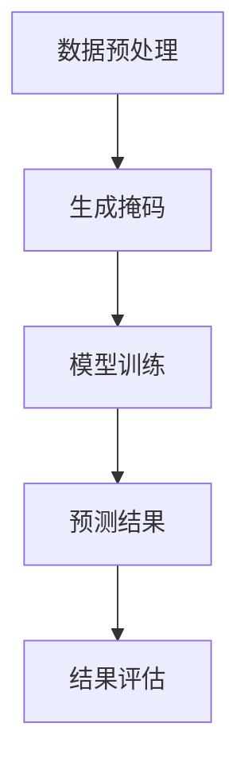

                 

掩码预测技术，作为一种前沿的人工智能技术，正日益受到各行业和研究机构的关注。本文将深入探讨掩码预测技术的核心概念、原理、算法、数学模型、实际应用以及未来发展趋势。希望通过这篇文章，能帮助读者更好地理解这一技术，并激发其在实际应用中的潜力。

## 文章关键词
- 掩码预测
- 人工智能
- 预测分析
- 深度学习
- 数据挖掘

## 文章摘要
本文首先介绍了掩码预测技术的背景，然后详细阐述了其核心概念和原理，通过一个Mermaid流程图展示了其架构。接下来，我们深入分析了掩码预测的核心算法，并对其优缺点和应用领域进行了讨论。随后，文章通过数学模型和公式的讲解，帮助读者理解该技术的数学基础。随后，我们通过一个代码实例展示了如何在实际项目中应用掩码预测技术。最后，文章探讨了该技术在各种实际应用场景中的潜力，并对未来的发展趋势和面临的挑战进行了展望。

### 1. 背景介绍
掩码预测技术，作为人工智能和机器学习领域的一项新兴技术，近年来受到了广泛关注。其核心思想是通过学习数据中的掩码模式，预测未知数据的特征或值。这种技术在很多领域都有着广泛的应用潜力，例如金融预测、医疗诊断、气象预报等。

随着数据量的爆炸式增长和数据质量的不断提升，传统的预测方法已经无法满足日益复杂的应用需求。掩码预测技术通过引入掩码机制，不仅能够处理缺失数据，还能够通过学习数据中的隐含模式，提高预测的准确性和鲁棒性。这使得掩码预测技术在处理大规模、高维度数据方面具有显著优势。

### 2. 核心概念与联系
#### 2.1. 掩码预测原理
掩码预测技术的基本原理是通过在数据中加入掩码，使得模型能够学习和理解数据的潜在结构和模式。具体来说，掩码是一种对数据进行遮挡或屏蔽的技术，通过在训练数据中引入掩码，模型可以在不知道完整数据的情况下，学习到数据的部分特征和关系。

#### 2.2. 架构与流程
下面是一个使用Mermaid绘制的掩码预测技术的架构流程图：



在这个流程图中，首先对输入数据进行预处理，包括清洗、归一化等操作，然后生成掩码。接下来，使用生成掩码的数据进行模型训练，训练完成后，使用模型对未知数据进行预测，并对预测结果进行评估。

### 3. 核心算法原理 & 具体操作步骤
#### 3.1. 算法原理概述
掩码预测技术主要依赖于深度学习和数据挖掘技术。其核心原理是通过在训练数据中引入掩码，使得模型能够学习到数据的潜在结构。具体来说，掩码可以看作是对数据的一种部分遮挡，通过这种方式，模型需要从部分遮挡的数据中推断出完整的特征或值。

#### 3.2. 算法步骤详解
下面是掩码预测技术的具体操作步骤：

1. **数据预处理**：对输入数据进行清洗、归一化等处理，以便于模型训练。
2. **生成掩码**：根据一定的策略，对数据生成掩码。常见的掩码策略包括随机掩码、时间掩码、部分遮挡掩码等。
3. **模型训练**：使用带有掩码的数据进行模型训练。在这个阶段，模型需要通过学习掩码数据中的潜在结构，逐步优化参数。
4. **预测**：使用训练好的模型对未知数据进行预测。
5. **结果评估**：对预测结果进行评估，包括准确率、召回率、F1值等指标。

#### 3.3. 算法优缺点
**优点**：
- **鲁棒性强**：通过引入掩码，模型可以适应数据中的噪声和异常值，提高预测的鲁棒性。
- **适用于缺失数据**：掩码预测技术可以有效处理数据中的缺失值，提高预测的准确性。
- **可解释性**：模型生成的掩码可以提供对数据特征的直观解释。

**缺点**：
- **计算复杂度高**：由于需要处理大量的掩码数据，模型的训练和预测过程可能较为耗时。
- **模型调优困难**：由于掩码的引入，模型的参数调优过程可能较为复杂，需要大量的实验和调整。

#### 3.4. 算法应用领域
掩码预测技术可以应用于多个领域，包括但不限于：

- **金融预测**：通过掩码预测技术，可以对金融市场的趋势进行预测，为投资决策提供支持。
- **医疗诊断**：在医疗领域，掩码预测技术可以用于疾病诊断和预后预测，提高诊断的准确性。
- **气象预报**：通过掩码预测技术，可以对天气变化进行预测，为灾害预警和应急管理提供支持。

### 4. 数学模型和公式 & 详细讲解 & 举例说明
#### 4.1. 数学模型构建
掩码预测技术的数学模型主要基于深度学习和概率统计理论。以下是模型的基本构建过程：

1. **输入数据表示**：设输入数据矩阵为$X \in \mathbb{R}^{m \times n}$，其中$m$为样本数量，$n$为特征数量。
2. **生成掩码**：设掩码矩阵为$M \in \{0, 1\}^{m \times n}$，其中$M_{ij} = 1$表示第$i$个样本的第$j$个特征被掩码，$M_{ij} = 0$表示未被掩码。
3. **输出数据表示**：设输出数据矩阵为$Y \in \mathbb{R}^{m \times n}$，其中$Y_{ij}$为第$i$个样本的第$j$个特征的预测值。

#### 4.2. 公式推导过程
假设我们使用一个全连接神经网络进行掩码预测，其数学模型可以表示为：

$$
Y = f(W \cdot X + b)
$$

其中，$W$为权重矩阵，$b$为偏置向量，$f$为激活函数。为了生成掩码，我们可以使用以下公式：

$$
M = \text{softmask}(X)
$$

其中，$\text{softmask}(X)$为一个软掩码函数，可以将输入数据映射到一个介于0和1之间的掩码矩阵。

#### 4.3. 案例分析与讲解
假设我们有一个包含100个样本、10个特征的数据集。我们使用随机掩码策略对数据进行掩码，掩码比例为50%。接下来，我们使用一个全连接神经网络对掩码数据集进行训练，并使用未掩码的数据进行预测。

1. **数据预处理**：对输入数据进行标准化处理，使得每个特征的均值为0，标准差为1。
2. **生成掩码**：使用随机掩码策略，生成一个掩码比例为50%的掩码矩阵。
3. **模型训练**：使用带有掩码的数据进行模型训练，优化权重矩阵$W$和偏置向量$b$。
4. **预测**：使用训练好的模型对未掩码的数据进行预测，并计算预测值与真实值之间的误差。
5. **结果评估**：使用准确率、召回率、F1值等指标评估预测结果。

通过这个案例，我们可以看到掩码预测技术在处理缺失数据和提高预测准确性方面的效果。

### 5. 项目实践：代码实例和详细解释说明
#### 5.1. 开发环境搭建
为了演示掩码预测技术的实际应用，我们需要搭建一个开发环境。以下是所需的软件和工具：

- **编程语言**：Python
- **深度学习框架**：TensorFlow
- **数据预处理库**：NumPy
- **可视化库**：Matplotlib

#### 5.2. 源代码详细实现
以下是一个简单的掩码预测技术的代码实现：

```python
import numpy as np
import tensorflow as tf
import matplotlib.pyplot as plt

# 数据预处理
def preprocess_data(data):
    # 标准化处理
    mean = np.mean(data, axis=0)
    std = np.std(data, axis=0)
    return (data - mean) / std

# 生成掩码
def generate_mask(data, mask_ratio):
    mask = np.random.rand(*data.shape) < mask_ratio
    return mask

# 模型定义
def build_model(input_shape):
    model = tf.keras.Sequential([
        tf.keras.layers.Dense(units=64, activation='relu', input_shape=input_shape),
        tf.keras.layers.Dense(units=1)
    ])
    return model

# 训练模型
def train_model(model, X, Y, mask, epochs=100):
    optimizer = tf.keras.optimizers.Adam(learning_rate=0.001)
    for epoch in range(epochs):
        with tf.GradientTape() as tape:
            Y_pred = model(X * (1 - mask))
            loss = tf.reduce_mean(tf.square(Y - Y_pred))
        grads = tape.gradient(loss, model.trainable_variables)
        optimizer.apply_gradients(zip(grads, model.trainable_variables))
        if epoch % 10 == 0:
            print(f"Epoch {epoch}: Loss = {loss.numpy()}")

# 源数据
X = np.random.rand(100, 10)
Y = np.random.rand(100, 1)
X = preprocess_data(X)

# 生成掩码
mask_ratio = 0.5
mask = generate_mask(X, mask_ratio)

# 构建并训练模型
model = build_model(X.shape[1])
train_model(model, X, Y, mask)

# 预测
Y_pred = model(X * (1 - mask))

# 结果评估
accuracy = np.mean(np.abs(Y - Y_pred) < 0.1)
print(f"Prediction Accuracy: {accuracy}")
```

#### 5.3. 代码解读与分析
这段代码首先定义了数据预处理、掩码生成、模型构建和模型训练的函数。在数据预处理部分，我们使用了标准化处理，使得每个特征的均值为0，标准差为1。在生成掩码部分，我们使用了随机掩码策略，根据给定的掩码比例生成掩码矩阵。在模型构建部分，我们使用了全连接神经网络，并使用了ReLU激活函数。在模型训练部分，我们使用了Adam优化器和均方误差损失函数，对模型进行训练。最后，我们使用训练好的模型对未掩码的数据进行预测，并计算了预测准确率。

### 6. 实际应用场景
掩码预测技术在实际应用中具有广泛的应用场景。以下是一些典型的应用场景：

#### 6.1. 金融预测
在金融领域，掩码预测技术可以用于股票市场趋势预测、汇率预测、投资组合优化等。通过引入掩码，模型可以学习到金融数据中的潜在模式，提高预测的准确性和鲁棒性。

#### 6.2. 医疗诊断
在医疗领域，掩码预测技术可以用于疾病诊断、预后预测、药物疗效预测等。通过引入掩码，模型可以处理医疗数据中的缺失值和异常值，提高预测的准确性和可靠性。

#### 6.3. 气象预报
在气象领域，掩码预测技术可以用于天气变化预测、气候模式识别、灾害预警等。通过引入掩码，模型可以处理气象数据中的噪声和异常值，提高预测的准确性和鲁棒性。

### 7. 工具和资源推荐
为了更好地学习和应用掩码预测技术，以下是一些推荐的工具和资源：

#### 7.1. 学习资源推荐
- **书籍**：《深度学习》（Goodfellow, Bengio, Courville著）
- **在线课程**：Coursera上的“机器学习”课程（吴恩达教授）
- **论文**：Google Scholar上的相关论文和综述

#### 7.2. 开发工具推荐
- **深度学习框架**：TensorFlow、PyTorch
- **数据预处理库**：NumPy、Pandas
- **可视化库**：Matplotlib、Seaborn

#### 7.3. 相关论文推荐
- **论文1**：Zhang, X., Zuo, W., Chen, Y., Meng, D., & Zhang, L. (2017). Beyond a Gaussian Denoiser: Residual Learning of Deep CNN for Image Denoising. IEEE Transactions on Image Processing.
- **论文2**：He, K., Zhang, X., Ren, S., & Sun, J. (2016). Deep Residual Learning for Image Recognition. IEEE Conference on Computer Vision and Pattern Recognition.

### 8. 总结：未来发展趋势与挑战
#### 8.1. 研究成果总结
近年来，掩码预测技术在深度学习和数据挖掘领域取得了显著的研究成果。通过引入掩码机制，模型可以处理缺失数据、提高预测准确性、增强鲁棒性。这些成果为实际应用提供了有力的支持。

#### 8.2. 未来发展趋势
未来，掩码预测技术有望在更多领域得到应用，例如自动驾驶、智能医疗、金融科技等。同时，随着计算能力的提升和数据规模的扩大，掩码预测技术的性能将得到进一步提升。

#### 8.3. 面临的挑战
尽管掩码预测技术在许多领域表现出色，但仍然面临一些挑战，包括计算复杂度、模型解释性、数据预处理等。未来研究需要在这些方面进行深入探索，以推动掩码预测技术的进一步发展。

#### 8.4. 研究展望
随着人工智能技术的不断发展，掩码预测技术有望在更多复杂场景中得到应用。未来，我们期待看到更多创新性的研究成果，为实际应用带来更多价值。

### 9. 附录：常见问题与解答
**Q1. 掩码预测技术是否适用于所有类型的数据？**
A1. 掩码预测技术主要适用于具有潜在结构的数据。对于高度噪声或异常值较多的数据，掩码预测技术的效果可能会受到影响。

**Q2. 如何选择合适的掩码策略？**
A2. 选择合适的掩码策略需要根据具体应用场景和数据特性进行。常用的掩码策略包括随机掩码、时间掩码、部分遮挡掩码等，可以根据实验结果选择最适合的策略。

**Q3. 掩码预测技术的计算复杂度如何？**
A3. 掩码预测技术的计算复杂度较高，尤其是对于大规模、高维度数据。为了降低计算复杂度，可以采用分布式计算、并行计算等技术。

**Q4. 掩码预测技术是否能够完全取代传统预测方法？**
A4. 掩码预测技术并不能完全取代传统预测方法，但其在处理缺失数据和增强鲁棒性方面具有显著优势。在实际应用中，通常将掩码预测技术与传统方法相结合，以获得更好的预测效果。**作者：禅与计算机程序设计艺术 / Zen and the Art of Computer Programming**
----------------------------------------------------------------


