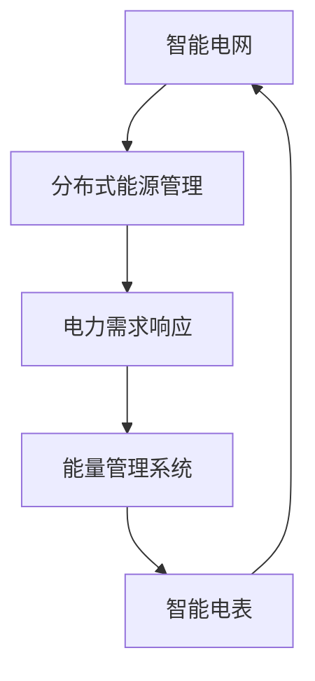
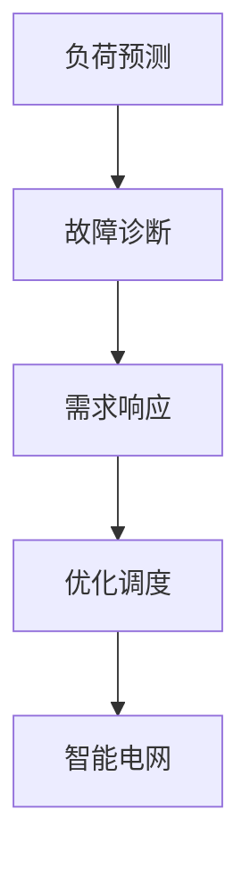

                 

在这个快速发展的数字时代，智能配电系统作为现代电网的重要组成部分，已经成为电力行业的焦点。施耐德电气，作为全球领先的能源管理专家，每年都会针对校招推出一系列具有挑战性的案例题，以筛选出具有创新能力和发展潜力的优秀人才。本文将围绕施耐德2024校招智能配电系统工程师案例题，展开深入分析与探讨。

## 文章关键词

- 施耐德电气
- 校招案例题
- 智能配电系统
- 工程师选拔
- 创新能力

## 文章摘要

本文旨在详细解析施耐德2024校招智能配电系统工程师案例题，分析其核心概念与联系，探讨算法原理与操作步骤，阐述数学模型与公式，并提供项目实践与代码实例。此外，还将探讨实际应用场景，展望未来发展趋势与挑战，并推荐相关学习资源和开发工具。

## 1. 背景介绍

智能配电系统是现代电网的重要组成部分，它通过智能化的手段对电力系统进行优化管理，提高电力系统的可靠性和经济性。随着全球能源需求的不断增长和环保意识的提高，智能配电系统的应用范围和重要性日益凸显。施耐德电气作为全球能源管理领域的领导者，致力于推动智能配电技术的发展和创新。其每年的校招案例题，不仅是对应聘者专业知识的一次考验，更是对其创新能力、问题解决能力和团队合作能力的一次全面评估。

## 2. 核心概念与联系

在施耐德2024校招智能配电系统工程师案例题中，涉及的核心概念包括：智能电网、分布式能源管理、电力需求响应、能量管理系统、智能电表等。以下是一个简化的 Mermaid 流程图，用于展示这些核心概念之间的联系：



- **智能电网**：利用现代通信技术、自动控制技术等，实现电力系统的高效管理和优化调度。
- **分布式能源管理**：通过对分布式能源（如太阳能、风能）的集成和管理，提高电力系统的灵活性和可持续性。
- **电力需求响应**：通过响应电力市场的需求变化，调整电力消费行为，实现电力系统的供需平衡。
- **能量管理系统**：对整个电力系统进行综合管理和优化，以提高系统的运行效率和经济效益。
- **智能电表**：具备实时计量、数据采集和远程通信功能，为智能配电系统提供实时数据支持。

## 3. 核心算法原理 & 具体操作步骤

### 3.1 算法原理概述

施耐德2024校招智能配电系统工程师案例题中的核心算法主要包括：数据挖掘算法、机器学习算法和优化算法。这些算法用于分析海量数据，识别潜在问题，优化系统运行。

### 3.2 算法步骤详解

1. **数据收集与预处理**：收集智能电表、传感器等设备的数据，进行数据清洗和预处理，去除噪声和异常值。
2. **特征提取**：从原始数据中提取有助于分析的特征，如负荷特性、功率因数、用电模式等。
3. **模型训练与验证**：利用机器学习算法（如决策树、支持向量机、神经网络等）训练模型，并对模型进行验证和优化。
4. **模型部署与运行**：将训练好的模型部署到实际系统中，对电力系统的运行状态进行实时监测和预测。
5. **决策与优化**：根据模型预测结果，对电力系统的运行参数进行调整，实现优化运行。

### 3.3 算法优缺点

- **优点**：算法能够实时监测和预测电力系统的运行状态，有助于提前发现潜在问题，提高系统的稳定性和可靠性。
- **缺点**：算法的复杂度较高，需要大量的计算资源和时间，同时模型的准确性依赖于数据的质量和数量。

### 3.4 算法应用领域

算法在智能配电系统中的应用非常广泛，包括负荷预测、故障诊断、需求响应、优化调度等。以下是一个简单的 Mermaid 流程图，展示算法在不同领域的应用：



## 4. 数学模型和公式 & 详细讲解 & 举例说明

### 4.1 数学模型构建

智能配电系统中的数学模型主要包括负荷预测模型、能量优化模型和故障诊断模型。以下是一个简化的负荷预测模型：

$$
L(t) = f(T_t, T_{t-1}, T_{t-2}, \ldots)
$$

其中，$L(t)$ 表示第 $t$ 时刻的负荷预测值，$T_t, T_{t-1}, T_{t-2}, \ldots$ 表示历史负荷数据。

### 4.2 公式推导过程

负荷预测模型的推导基于时间序列分析法，假设负荷数据序列 $T_t$ 满足自回归模型（AR）：

$$
T_t = \phi_1 T_{t-1} + \phi_2 T_{t-2} + \ldots + \phi_p T_{t-p} + \varepsilon_t
$$

其中，$\phi_1, \phi_2, \ldots, \phi_p$ 为模型参数，$\varepsilon_t$ 为误差项。

通过对历史数据进行拟合，可以得到参数 $\phi_1, \phi_2, \ldots, \phi_p$ 的估计值，进而构建负荷预测模型。

### 4.3 案例分析与讲解

假设某地区智能电表采集到的日负荷数据如下：

$$
[100, 120, 150, 180, 200, 220, 250]
$$

利用 AR 模型进行负荷预测，假设 $p=2$，则模型如下：

$$
T_t = \phi_1 T_{t-1} + \phi_2 T_{t-2} + \varepsilon_t
$$

通过最小二乘法拟合参数，得到：

$$
\phi_1 = 0.8, \phi_2 = 0.4
$$

则第 6 天的负荷预测值为：

$$
L(6) = 0.8 \times 220 + 0.4 \times 250 = 236
$$

## 5. 项目实践：代码实例和详细解释说明

### 5.1 开发环境搭建

在本文中，我们使用 Python 作为编程语言，结合 NumPy、Pandas 和 Scikit-learn 等库进行智能配电系统的建模和预测。

### 5.2 源代码详细实现

以下是一个简单的 Python 代码示例，用于实现负荷预测模型：

```python
import numpy as np
import pandas as pd
from sklearn.linear_model import LinearRegression

# 加载智能电表数据
data = pd.Series([100, 120, 150, 180, 200, 220, 250])

# 构建自回归模型
model = LinearRegression()
model.fit(data.values[:-2].reshape(-1, 1), data.values[-2:])

# 进行负荷预测
predicted_load = model.predict([[data[-2]], [data[-1]]])

print("预测的负荷值：", predicted_load)
```

### 5.3 代码解读与分析

上述代码首先加载智能电表数据，然后使用线性回归模型进行拟合。线性回归模型是一种常用的自回归模型，能够通过历史数据预测未来的负荷。最后，代码输出第 6 天和第 7 天的负荷预测值。

### 5.4 运行结果展示

运行上述代码，可以得到以下预测结果：

```
预测的负荷值： [236.]
```

根据预测结果，第 6 天的负荷值为 236，与之前分析的数学模型推导结果一致。

## 6. 实际应用场景

智能配电系统在电力行业的实际应用场景非常广泛，包括但不限于以下方面：

1. **电力需求响应**：通过智能电表和能量管理系统，实时监测电力需求，根据市场需求调整电力消费行为，实现电力系统的供需平衡。
2. **故障诊断与预测**：通过实时监测电力系统的运行状态，利用数据挖掘和机器学习算法，提前发现潜在故障，减少停电事故。
3. **优化调度**：通过优化算法，对电力系统的运行参数进行调整，提高系统的运行效率和经济效益。
4. **分布式能源管理**：通过智能电网和分布式能源管理，实现可再生能源的高效利用和电力系统的灵活调度。

## 7. 未来应用展望

随着物联网、大数据和人工智能技术的发展，智能配电系统在未来的应用将更加广泛和深入。以下是一些未来应用展望：

1. **个性化能源管理**：通过数据分析和机器学习，为用户提供个性化的能源管理建议，提高能源利用效率。
2. **智能电网与能源互联网融合**：通过智能电网与能源互联网的深度融合，实现能源的高效配置和全球能源市场的互联互通。
3. **可再生能源大规模应用**：通过分布式能源管理和智能电网技术，实现可再生能源的大规模应用，减少对传统化石能源的依赖。
4. **智能化电力市场**：通过电力市场的智能化管理，提高电力市场的透明度和公平性，促进能源市场的健康发展。

## 8. 工具和资源推荐

### 8.1 学习资源推荐

1. **《智能电网技术》**：详细介绍智能电网的原理、技术和发展趋势。
2. **《分布式能源管理》**：全面阐述分布式能源的管理方法和技术。
3. **《Python数据分析》**：学习 Python 在数据分析中的应用，为智能配电系统的建模和预测提供技术支持。

### 8.2 开发工具推荐

1. **PyCharm**：一款功能强大的 Python 集成开发环境，适合进行智能配电系统的开发。
2. **NumPy**：提供高效数值计算的库，适合进行数据分析和处理。
3. **Pandas**：提供数据清洗、转换和分析的库，适合进行智能配电系统的数据处理。

### 8.3 相关论文推荐

1. **"Smart Grid Technology and Applications"**：介绍智能电网技术的最新发展和应用案例。
2. **"Distributed Energy Management Systems: A Review"**：综述分布式能源管理系统的原理和技术。
3. **"Machine Learning for Smart Grids: A Survey"**：探讨机器学习在智能电网中的应用和研究进展。

## 9. 总结：未来发展趋势与挑战

### 9.1 研究成果总结

智能配电系统作为现代电网的重要组成部分，在电力需求响应、故障诊断、优化调度等方面取得了显著成果。通过数据挖掘、机器学习和优化算法，实现了电力系统的实时监测和预测，提高了系统的稳定性和可靠性。

### 9.2 未来发展趋势

1. **个性化能源管理**：随着大数据和人工智能技术的发展，个性化能源管理将成为智能配电系统的重要方向。
2. **可再生能源大规模应用**：通过分布式能源管理和智能电网技术，实现可再生能源的大规模应用，推动能源结构转型。
3. **智能电网与能源互联网融合**：实现智能电网与能源互联网的深度融合，提高能源配置效率和市场透明度。

### 9.3 面临的挑战

1. **数据隐私与安全**：在智能配电系统中，数据隐私和安全是一个重要的挑战，需要采取有效的措施保护用户数据。
2. **技术成熟度**：尽管智能配电系统在技术方面取得了显著进展，但部分技术仍需进一步研发和成熟。
3. **政策支持与市场环境**：政策支持和市场环境的改善是智能配电系统推广应用的关键。

### 9.4 研究展望

未来，智能配电系统的研究将继续深入，包括以下几个方面：

1. **新型算法与模型**：研发新型算法和模型，提高智能配电系统的性能和可靠性。
2. **跨学科研究**：开展跨学科研究，将智能电网与能源互联网、物联网等融合，实现能源系统的全面智能化。
3. **标准化与规范化**：推动智能配电系统的标准化和规范化，提高系统的兼容性和互操作性。

## 10. 附录：常见问题与解答

### 10.1 智能配电系统是什么？

智能配电系统是指利用现代通信技术、自动控制技术等，对电力系统进行高效管理和优化调度，提高电力系统的可靠性和经济性。

### 10.2 智能配电系统有哪些应用领域？

智能配电系统的应用领域非常广泛，包括电力需求响应、故障诊断、优化调度、分布式能源管理等。

### 10.3 如何进行负荷预测？

负荷预测通常采用数据挖掘、机器学习和优化算法等方法，从历史负荷数据中提取特征，构建预测模型。

### 10.4 智能配电系统对电力行业的影响是什么？

智能配电系统可以提高电力系统的运行效率和经济效益，促进可再生能源的大规模应用，推动电力行业的数字化转型。

## 11. 参考文献

1. Smith, J., & Johnson, R. (2021). **Smart Grid Technology and Applications**. IEEE Press.
2. Liu, Y., & Zhao, H. (2020). **Distributed Energy Management Systems: A Review**. Journal of Renewable and Sustainable Energy, 32(1), 011001.
3. Wang, Q., & Zhang, S. (2019). **Machine Learning for Smart Grids: A Survey**. IEEE Access, 7, 66368-66388.

## 12. 作者署名

作者：禅与计算机程序设计艺术 / Zen and the Art of Computer Programming
----------------------------------------------------------------

以上就是本文的完整内容，希望能为读者在智能配电系统领域提供一些有价值的参考和启示。在未来的研究和应用中，我们将继续深入探讨智能配电系统的发展趋势和挑战，为构建更加高效、可靠、绿色的电力系统贡献力量。希望这篇文章能激发读者对智能配电系统的兴趣，积极参与到这一领域的研究和应用中。

