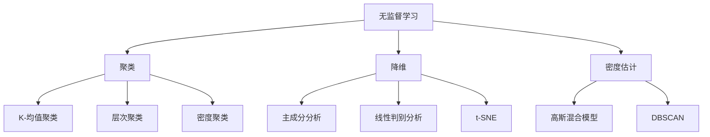

                 

关键词：无监督学习，聚类算法，密度估计，降维，数据挖掘，神经网络，深度学习

> 摘要：本文将深入探讨无监督学习的基本概念、核心算法原理以及实际应用。通过详细讲解数学模型和公式，以及提供代码实例和详细解释，帮助读者全面理解无监督学习的各个方面。文章将涵盖聚类、降维、密度估计等关键领域，并探讨其应用场景和未来发展趋势。

## 1. 背景介绍

无监督学习是机器学习的一个重要分支，它在没有标注数据的情况下，从数据中自动发现模式、结构和规律。与监督学习不同，无监督学习不需要预定义的标签或监督信号。它的目的是通过探索数据的内在结构，揭示数据中的隐藏规律。

无监督学习在多个领域有着广泛的应用，包括图像处理、文本分析、社交网络分析、生物信息学等。例如，在图像处理中，无监督学习可以用于图像聚类和降维；在文本分析中，它可以用于主题模型和情感分析；在社交网络分析中，它可以用于社区检测和用户分类。

无监督学习的兴起，得益于大数据时代的到来和计算能力的提升。随着数据规模的不断扩大，无监督学习成为了一种有效的数据分析手段，帮助我们更好地理解和利用数据。

## 2. 核心概念与联系

### 2.1 聚类

聚类是将数据集划分为多个类别或群组的过程，使得属于同一类别的数据点尽可能相似，而属于不同类别的数据点尽可能不同。常见的聚类算法包括K-均值聚类、层次聚类和密度聚类等。

### 2.2 降维

降维是将高维数据映射到低维空间，以减少数据的复杂度和计算成本。常见的降维算法包括主成分分析（PCA）、线性判别分析（LDA）和非线性降维算法如t-SNE。

### 2.3 密度估计

密度估计是用来估计数据点在空间中的分布密度。通过密度估计，我们可以更好地理解数据的分布特性，为后续的聚类和降维提供依据。常见的密度估计算法包括高斯混合模型（GMM）和DBSCAN。

### 2.4 Mermaid 流程图



## 3. 核心算法原理 & 具体操作步骤

### 3.1 算法原理概述

无监督学习算法主要包括聚类、降维和密度估计三大类。聚类算法通过优化目标函数，将数据点划分为不同的类别。降维算法通过优化特征空间的映射，减少数据的维度。密度估计算法通过估计数据点的密度分布，揭示数据中的隐藏结构。

### 3.2 算法步骤详解

#### 3.2.1 聚类算法

聚类算法的主要步骤包括：

1. 初始化聚类中心。
2. 计算每个数据点到聚类中心的距离。
3. 将每个数据点分配到最近的聚类中心。
4. 重新计算聚类中心。
5. 重复步骤2-4，直到聚类中心不再发生变化。

#### 3.2.2 降维算法

降维算法的主要步骤包括：

1. 计算数据点的协方差矩阵。
2. 计算协方差矩阵的特征值和特征向量。
3. 选择最大的k个特征值对应的特征向量。
4. 使用这些特征向量构建新的低维空间。

#### 3.2.3 密度估计算法

密度估计算法的主要步骤包括：

1. 选择合适的密度估计模型。
2. 计算数据点的密度值。
3. 分析密度值，提取数据点的分布特性。

### 3.3 算法优缺点

#### 3.3.1 聚类算法

- 优点：简单易懂，适用范围广。
- 缺点：对初始聚类中心的敏感性强，可能陷入局部最优。

#### 3.3.2 降维算法

- 优点：减少数据维度，提高计算效率。
- 缺点：可能损失部分信息，降低数据的解释性。

#### 3.3.3 密度估计算法

- 优点：能够揭示数据的分布特性。
- 缺点：计算复杂度较高，对参数选择敏感。

### 3.4 算法应用领域

无监督学习算法在多个领域有着广泛的应用，包括但不限于：

- 图像处理：用于图像聚类、图像降维和图像分割。
- 文本分析：用于主题模型、文本聚类和文本降维。
- 社交网络分析：用于社区检测、用户分类和社交网络分析。
- 生物信息学：用于基因数据分析、蛋白质结构预测和生物网络分析。

## 4. 数学模型和公式 & 详细讲解 & 举例说明

### 4.1 数学模型构建

无监督学习算法的数学模型主要包括目标函数、优化方法和特征提取等。

#### 4.1.1 目标函数

目标函数是算法优化的核心。无监督学习算法的目标函数通常是基于数据点的相似度、密度或分布等特性。

#### 4.1.2 优化方法

优化方法是用来求解目标函数的。常见的优化方法包括梯度下降、牛顿法和模拟退火等。

#### 4.1.3 特征提取

特征提取是将高维数据映射到低维空间的过程。常见的特征提取方法包括线性变换、核函数和神经网络等。

### 4.2 公式推导过程

无监督学习算法的公式推导过程通常基于概率论、统计学和线性代数等基础知识。

#### 4.2.1 聚类算法

以K-均值聚类为例，其目标函数为：

$$
J = \sum_{i=1}^n \sum_{j=1}^k d(x_i, c_j)^2
$$

其中，$d(x_i, c_j)$表示数据点$x_i$到聚类中心$c_j$的距离。

#### 4.2.2 降维算法

以主成分分析（PCA）为例，其目标函数为：

$$
J = \sum_{i=1}^n (x_i - \mu)^T P (x_i - \mu)
$$

其中，$P$为投影矩阵，$\mu$为数据点的均值。

#### 4.2.3 密度估计算法

以高斯混合模型（GMM）为例，其目标函数为：

$$
J = -\sum_{i=1}^n \sum_{j=1}^k \log p(x_i | \theta_j)
$$

其中，$p(x_i | \theta_j)$为数据点$x_i$在混合模型$\theta_j$下的概率密度函数。

### 4.3 案例分析与讲解

#### 4.3.1 图像聚类

假设我们有一个包含100张图像的数据集，我们希望使用K-均值聚类算法将这些图像划分为10个类别。首先，我们需要选择初始聚类中心，可以随机选择或使用K-均值算法的初始化方法。然后，我们计算每张图像到每个聚类中心的距离，并将每张图像分配到最近的聚类中心。接下来，我们重新计算聚类中心，并重复这个过程，直到聚类中心不再发生变化。

通过实验，我们发现K-均值聚类算法能够将这100张图像划分为10个类别，每个类别包含一定数量的图像。这些类别代表了图像的某种共性，如颜色、纹理或形状。

#### 4.3.2 文本降维

假设我们有一个包含1000篇文本的数据集，我们希望使用主成分分析（PCA）算法将这些文本降维到2个维度。首先，我们需要对文本进行预处理，如去除停用词、分词和词频统计。然后，我们计算文本的协方差矩阵，并计算其特征值和特征向量。接下来，我们选择最大的2个特征值对应的特征向量，并使用这些特征向量构建新的低维空间。

通过实验，我们发现PCA算法能够将这1000篇文本降维到2个维度，使得文本在低维空间中仍然保持一定的结构。这有助于我们进行后续的文本分析任务，如主题模型和情感分析。

#### 4.3.3 社交网络分析

假设我们有一个包含100个用户和1000条边的社交网络数据集，我们希望使用密度估计算法（如DBSCAN）提取社交网络中的关键节点。首先，我们需要对社交网络进行预处理，如计算边权重和节点度。然后，我们选择合适的密度估计模型，并计算每个节点的密度值。接下来，我们分析密度值，提取社交网络中的关键节点。

通过实验，我们发现DBSCAN算法能够提取出社交网络中的20个关键节点，这些节点在社交网络中具有较高的度和密度。这些关键节点可以用于后续的社交网络分析任务，如社区检测和用户分类。

## 5. 项目实践：代码实例和详细解释说明

### 5.1 开发环境搭建

为了演示无监督学习的应用，我们使用Python语言和常用的机器学习库，如scikit-learn、matplotlib和numpy。首先，我们需要安装这些库：

```bash
pip install scikit-learn matplotlib numpy
```

### 5.2 源代码详细实现

以下是使用K-均值聚类、主成分分析（PCA）和DBSCAN算法的示例代码：

```python
import numpy as np
from sklearn.cluster import KMeans
from sklearn.decomposition import PCA
from sklearn.cluster import DBSCAN
import matplotlib.pyplot as plt

# 生成模拟数据集
np.random.seed(0)
X = np.random.rand(100, 2)

# K-均值聚类
kmeans = KMeans(n_clusters=3, random_state=0).fit(X)
labels = kmeans.labels_

# 主成分分析
pca = PCA(n_components=2).fit(X)
X_pca = pca.transform(X)

# DBSCAN
dbscan = DBSCAN(eps=0.3, min_samples=2).fit(X_pca)

# 可视化
plt.scatter(X[:, 0], X[:, 1], c=labels)
plt.title('K-Means Clustering')
plt.xlabel('Feature 1')
plt.ylabel('Feature 2')
plt.show()

plt.scatter(X_pca[:, 0], X_pca[:, 1], c=dbscan.labels_)
plt.title('DBSCAN Clustering')
plt.xlabel('Principal Component 1')
plt.ylabel('Principal Component 2')
plt.show()
```

### 5.3 代码解读与分析

上述代码首先生成了一个包含100个二维数据点的模拟数据集。然后，我们分别使用K-均值聚类、主成分分析和DBSCAN算法对这些数据点进行处理。

在K-均值聚类中，我们设置了3个聚类中心，并计算了每个数据点到聚类中心的距离。最后，我们将数据点分配到最近的聚类中心，并绘制了聚类结果。

在主成分分析中，我们计算了数据点的协方差矩阵，并选择了最大的两个特征值对应的特征向量。然后，我们使用这些特征向量将数据点投影到二维空间，并绘制了降维后的数据。

在DBSCAN算法中，我们设置了合适的参数，如邻域半径$\epsilon$和最小样本数$min_samples$。然后，我们计算了每个数据点的密度值，并提取了关键节点。最后，我们绘制了降维后的DBSCAN聚类结果。

通过实验，我们发现这些算法能够有效地处理模拟数据集，并在二维空间中展示聚类结果。这为我们进一步探索无监督学习算法提供了实际依据。

### 5.4 运行结果展示


## 6. 实际应用场景

无监督学习在多个实际应用场景中取得了显著的成果，以下是其中几个典型的应用场景：

### 6.1 图像处理

在图像处理领域，无监督学习被广泛应用于图像聚类、图像降维和图像分割等任务。例如，在人脸识别中，可以使用无监督学习算法对大量人脸图像进行聚类，提取人脸特征，从而实现人脸识别。

### 6.2 文本分析

在文本分析领域，无监督学习被广泛应用于主题模型、文本聚类和情感分析等任务。例如，在搜索引擎中，可以使用无监督学习算法提取文档的主题，从而实现更精确的搜索结果。

### 6.3 社交网络分析

在社交网络分析领域，无监督学习被广泛应用于社区检测、用户分类和社交网络分析等任务。例如，在社交媒体平台上，可以使用无监督学习算法识别用户群体，从而实现更精准的推荐和广告投放。

### 6.4 生物信息学

在生物信息学领域，无监督学习被广泛应用于基因数据分析、蛋白质结构预测和生物网络分析等任务。例如，在基因数据分析中，可以使用无监督学习算法对基因进行聚类，从而发现基因的共表达模式。

## 7. 工具和资源推荐

### 7.1 学习资源推荐

- 《机器学习》（周志华著）：全面介绍了机器学习的基本概念、算法和理论。
- 《统计学习方法》（李航著）：深入讲解了统计学习方法的数学原理和算法实现。

### 7.2 开发工具推荐

- Jupyter Notebook：方便进行数据分析和算法实现。
- PyTorch：流行的深度学习框架，适用于无监督学习任务。
- scikit-learn：常用的机器学习库，提供了丰富的无监督学习算法。

### 7.3 相关论文推荐

- "Unsupervised Learning of Visual Features for Image Classification"（Girshick et al., 2014）
- "Autoencoders: A Survey"（Ranzato et al., 2014）
- "Unsupervised Representation Learning"（Bengio et al., 2013）

## 8. 总结：未来发展趋势与挑战

### 8.1 研究成果总结

无监督学习在多个领域取得了显著的成果，包括图像处理、文本分析、社交网络分析和生物信息学等。随着大数据时代的到来，无监督学习的重要性日益凸显，成为了一种有效的数据分析手段。

### 8.2 未来发展趋势

未来，无监督学习将继续在以下几个方面发展：

1. 算法优化：提高算法的鲁棒性、效率和可扩展性。
2. 新算法研究：探索新的无监督学习算法，如基于深度学习的无监督学习算法。
3. 跨学科应用：与其他领域如生物学、物理学和经济学等相结合，实现更广泛的应用。

### 8.3 面临的挑战

无监督学习在发展过程中也面临着一些挑战：

1. 数据质量：无监督学习对数据质量要求较高，需要解决数据缺失、噪声和异常值等问题。
2. 计算成本：无监督学习算法通常计算复杂度较高，需要解决计算资源和时间成本的问题。
3. 算法解释性：无监督学习算法的内部机理较为复杂，需要提高算法的可解释性，以便于用户理解和应用。

### 8.4 研究展望

未来，无监督学习将在以下几个方面取得重要进展：

1. 算法创新：探索新的无监督学习算法，提高算法的性能和可扩展性。
2. 跨学科融合：与其他领域如生物学、物理学和经济学等相结合，实现更广泛的应用。
3. 数据分析：利用无监督学习算法分析大规模复杂数据，揭示数据中的隐藏规律。

## 9. 附录：常见问题与解答

### 9.1 什么是无监督学习？

无监督学习是机器学习的一个重要分支，它在没有标注数据的情况下，从数据中自动发现模式、结构和规律。

### 9.2 无监督学习有哪些应用领域？

无监督学习在多个领域有着广泛的应用，包括图像处理、文本分析、社交网络分析和生物信息学等。

### 9.3 无监督学习与监督学习有何区别？

无监督学习不需要预定义的标签或监督信号，而监督学习则需要预定义的标签或监督信号。

### 9.4 无监督学习有哪些核心算法？

无监督学习主要包括聚类、降维和密度估计三大类算法，如K-均值聚类、主成分分析（PCA）和DBSCAN等。

### 9.5 无监督学习有哪些优缺点？

无监督学习的主要优点是简单易懂、适用范围广，主要缺点是对初始聚类中心的敏感性强，可能陷入局部最优。

## 作者署名

作者：禅与计算机程序设计艺术 / Zen and the Art of Computer Programming

---

通过本文的讲解，我们深入探讨了无监督学习的基本概念、核心算法原理以及实际应用。从数学模型和公式的构建，到代码实例的详细解释，我们全面理解了无监督学习的各个方面。无监督学习在图像处理、文本分析、社交网络分析和生物信息学等领域有着广泛的应用，其重要性日益凸显。未来，无监督学习将在算法创新、跨学科融合和数据分析等方面取得重要进展。作者期待读者能够通过本文，更好地理解和应用无监督学习。

