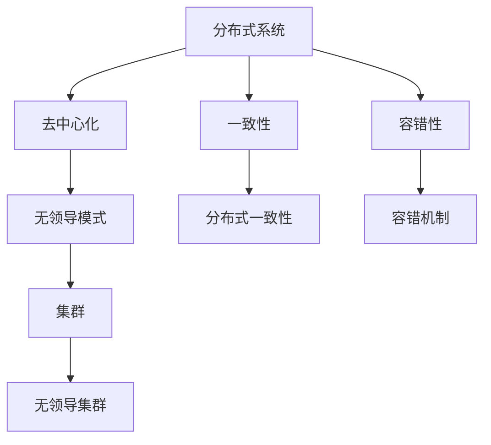

                 

关键词：集群，分布式系统，无领导模式，一致性，容错性，性能优化，设计原则，实现细节。

> 摘要：本文将探讨无领导集群的设计与实现，分析其在分布式系统中的应用优势与挑战，通过详细的理论基础、核心算法、数学模型、项目实践以及未来展望，为读者提供一份全面的技术参考。

## 1. 背景介绍

在现代信息社会中，分布式系统已经成为构建高性能、高可用性和高扩展性应用的基础。传统的集中式系统在面对海量数据处理、高并发访问以及系统扩展性需求时往往力不从心。分布式系统通过将计算任务分散到多个节点上，实现了负载均衡和资源利用率的最大化。

集群是分布式系统的一种重要实现形式，它由多个服务器组成，协同工作以提供高效、可靠的服务。集群的内部节点可以动态加入或退出，无需停机维护。集群技术广泛应用于互联网服务、大数据处理、云计算等领域。

然而，传统的集群设计往往采用有领导模式（如主从模式、主备模式），其中某个节点担任领导角色，负责协调和管理整个集群。这种模式虽然简单易实现，但在高可用性和容错性方面存在一些局限性。无领导集群作为一种新兴的分布式系统架构，通过去中心化的设计，能够更好地应对这些挑战。

本文将围绕无领导集群的设计与实现，介绍其核心概念、算法原理、数学模型、项目实践以及未来发展趋势。希望通过本文的阐述，能够为读者提供有价值的参考，帮助他们在实际项目中更好地应用无领导集群技术。

## 2. 核心概念与联系

在深入探讨无领导集群的设计与实现之前，我们需要了解一些核心概念，包括分布式系统、去中心化、一致性、容错性等。以下是一个简化的 Mermaid 流程图，展示了这些核心概念之间的联系。



### 2.1 分布式系统

分布式系统由多个独立的节点组成，这些节点通过网络连接，协同工作以完成计算任务。分布式系统具有以下几个特点：

- **高可用性**：通过将任务分散到多个节点上，即使某个节点出现故障，系统整体仍能保持正常运行。
- **高扩展性**：可以通过动态添加节点来扩展系统规模，满足日益增长的计算需求。
- **负载均衡**：将计算任务均匀地分配到各个节点上，避免单个节点过载。

### 2.2 去中心化

去中心化是一种设计理念，旨在消除集中式的领导角色，使系统中的所有节点都处于平等的地位。去中心化具有以下几个优点：

- **高容错性**：节点故障不会对整个系统造成严重影响，因为其他节点可以继续正常工作。
- **高灵活性**：节点可以自由地加入或退出系统，无需经过集中式管理。
- **去中心化治理**：所有节点都有权参与决策过程，增强了系统的透明性和公平性。

### 2.3 一致性

一致性是指分布式系统在多个节点之间保持数据或状态的一致性。分布式一致性问题是一个复杂的问题，因为节点之间的通信可能不可靠，且网络延迟和数据冲突是不可避免的。

### 2.4 容错性

容错性是指系统能够在面临节点故障、网络异常等情况下，保持正常运行的能力。容错性是分布式系统设计中的重要考虑因素，因为节点故障是不可避免的。

### 2.5 无领导模式

无领导模式是一种去中心化的分布式系统架构，其中没有专门的领导节点，所有节点都平等地参与系统的管理和决策。无领导模式具有以下几个优点：

- **高可用性**：由于没有领导节点，系统整体更加健壮，某个节点的故障不会导致整个系统崩溃。
- **高扩展性**：新节点可以随时加入系统，无需经过特殊的部署和管理过程。
- **去中心化决策**：所有节点都有权参与决策，增强了系统的透明性和公平性。

### 2.6 集群

集群是由多个节点组成的分布式系统，这些节点协同工作以提供高效、可靠的服务。集群可以用于处理大规模的计算任务，具有高可用性、高扩展性和负载均衡等特性。

### 2.7 无领导集群

无领导集群是一种基于无领导模式的分布式集群，其中所有节点都平等地参与系统的管理和决策。无领导集群具有以下几个特点：

- **去中心化**：所有节点都平等地参与系统管理，没有专门的领导节点。
- **高可用性**：系统整体更加健壮，某个节点的故障不会导致整个系统崩溃。
- **高扩展性**：新节点可以随时加入系统，无需经过特殊的部署和管理过程。
- **去中心化决策**：所有节点都有权参与决策，增强了系统的透明性和公平性。

## 3. 核心算法原理 & 具体操作步骤

### 3.1 算法原理概述

无领导集群的核心算法主要包括一致性算法、数据复制算法和故障检测与恢复算法。这些算法共同工作，确保集群的高可用性、一致性和容错性。

- **一致性算法**：用于确保集群中的所有节点在数据或状态上保持一致。常见的一致性算法包括Paxos、Raft等。
- **数据复制算法**：用于将数据在多个节点之间进行复制，提高数据的可靠性和可用性。常见的数据复制算法包括Chubby、Zookeeper等。
- **故障检测与恢复算法**：用于检测和恢复集群中的故障节点，确保系统的高可用性。常见的故障检测与恢复算法包括心跳检测、故障转移等。

### 3.2 算法步骤详解

#### 3.2.1 一致性算法

一致性算法的主要步骤如下：

1. **初始化**：每个节点启动时，随机选择一个节点作为提案者（Proposer）。
2. **提案**：提案者向所有节点发送提案消息，请求更新数据或状态。
3. **投票**：每个节点收到提案消息后，根据当前状态进行投票，如果投票通过，则更新本地状态。
4. **提交**：如果超过半数的节点投票通过，提案者将提交更新操作，并将结果通知所有节点。
5. **故障恢复**：如果提案者或部分节点出现故障，系统将重新选择提案者或进行故障恢复操作。

#### 3.2.2 数据复制算法

数据复制算法的主要步骤如下：

1. **初始化**：集群中的每个节点都从某个已知的初始状态开始，例如从某个领导节点获取数据。
2. **同步**：每个节点定期向其他节点发送心跳消息，保持数据的一致性。
3. **复制**：当节点接收到心跳消息时，根据消息中的数据更新本地状态。
4. **选举**：如果领导节点出现故障，其他节点将进行选举，选择一个新的领导节点。

#### 3.2.3 故障检测与恢复算法

故障检测与恢复算法的主要步骤如下：

1. **心跳检测**：每个节点定期向其他节点发送心跳消息，确保节点之间的通信正常。
2. **故障检测**：如果某个节点在预定时间内未收到心跳消息，则认为该节点出现故障。
3. **故障恢复**：系统将根据故障检测的结果，重新选举领导节点或进行故障转移操作。

### 3.3 算法优缺点

#### 一致性算法

- **优点**：
  - 能够确保集群中的所有节点在数据或状态上保持一致。
  - 具有较强的容错性，即使在部分节点出现故障时，系统仍能保持一致性。
- **缺点**：
  - 可能存在一定的性能开销，因为需要进行投票和提交操作。
  - 在网络延迟较高或节点较多的情况下，一致性算法的响应速度可能较慢。

#### 数据复制算法

- **优点**：
  - 提高数据的可靠性和可用性，即使在部分节点出现故障时，系统仍能正常运行。
  - 数据同步操作可以并行进行，提高了系统的性能。
- **缺点**：
  - 需要额外的存储空间和带宽资源。
  - 在数据冲突时，需要额外的处理机制。

#### 故障检测与恢复算法

- **优点**：
  - 能够及时发现和恢复故障节点，确保系统的高可用性。
  - 简化了故障处理的复杂性。
- **缺点**：
  - 可能存在一定的误判率，将正常节点误判为故障节点。
  - 故障恢复操作可能影响系统的性能。

### 3.4 算法应用领域

一致性算法、数据复制算法和故障检测与恢复算法可以广泛应用于各种分布式系统，如数据库集群、文件系统、存储系统等。以下是一些典型的应用领域：

- **数据库集群**：通过一致性算法和复制算法，确保数据库中的数据在多个节点之间保持一致，提高数据的可靠性和可用性。
- **文件系统**：通过复制算法，确保文件在多个节点之间保持同步，提高文件的可靠性和访问速度。
- **存储系统**：通过故障检测与恢复算法，确保存储系统在面临节点故障时，能够快速恢复，保证数据的安全性和完整性。

## 4. 数学模型和公式 & 详细讲解 & 举例说明

### 4.1 数学模型构建

在分布式系统中，一致性算法是一个核心问题。Paxos算法是一种分布式一致性算法，可以用于解决多节点系统中的一致性问题。以下是Paxos算法的数学模型构建。

#### 4.1.1 Paxos算法概述

Paxos算法是一种基于消息传递的分布式一致性算法，其核心思想是通过多数派协议来选举出一个领导者，并由领导者负责所有后续的提交操作。Paxos算法主要包括两个阶段：投票阶段和提交阶段。

#### 4.1.2 Paxos算法模型

Paxos算法中的节点分为两类：提议者（Proposer）和接受者（Acceptor）。提议者负责发起提案，接受者负责投票和接受提案。

1. **提议者**：每个提议者都有一个提案编号（Proposal Number），用于标识不同的提案。提议者向所有接受者发送提案消息，请求接受者投票。
2. **接受者**：接受者维护一个日志（Log），记录已接受的提案编号和提案值。当接受者收到提议者的提案消息时，根据当前日志状态进行投票，并将投票结果返回给提议者。

Paxos算法的数学模型可以表示为以下公式：

$$
(P, V) \in L \Leftrightarrow \exists \{A_1, A_2, ..., A_n\} \subseteq N, |A| > \frac{N}{2}, (P, V) \in L(A)
$$

其中，$P$ 和 $V$ 分别表示提议编号和提议值，$L$ 表示日志，$N$ 表示节点总数，$A$ 表示接受者的集合，$L(A)$ 表示接受者 $A$ 的日志。

#### 4.1.3 Paxos算法执行过程

Paxos算法的执行过程可以分为以下几个步骤：

1. **初始化**：每个提议者随机选择一个提案编号 $P$，并初始化日志 $L$。
2. **投票阶段**：
   - 提议者 $P$ 向所有接受者 $A_i$ 发送提案消息，请求接受者投票。
   - 接受者 $A_i$ 收到提案消息后，根据当前日志状态进行投票。如果日志中的提案编号 $P$ 小于当前日志中的提案编号，则接受者继续保留当前日志状态；否则，接受者更新日志为 $(P, V)$，并将投票结果 $(P, V)$ 返回给提议者。
3. **提交阶段**：
   - 提议者 $P$ 收集所有接受者的投票结果，如果超过半数的接受者投票通过，则认为提案成功，提议者将提交提案值 $V$。
   - 提议者 $P$ 向所有接受者发送提交消息，通知接受者更新日志为 $(P, V)$。

### 4.2 公式推导过程

为了推导Paxos算法的公式，我们首先需要定义一些参数：

- $N$：总节点数
- $F$：故障节点数
- $A$：接受者集合
- $P$：提议者编号
- $V$：提议值
- $L$：日志

接下来，我们使用反证法来推导Paxos算法的正确性。

假设Paxos算法不正确，即存在一个提议者 $P$，其发起的提案 $(P, V)$ 无法被提交。

1. **第一阶段**：提议者 $P$ 向所有接受者发送提案消息。由于存在 $F$ 个故障节点，因此至少有 $N - F$ 个接受者接收到提案消息。
2. **第二阶段**：每个接受者根据当前日志状态进行投票。由于故障节点无法投票，因此至少有 $N - F$ 个接受者返回投票结果。
3. **第三阶段**：提议者 $P$ 收集投票结果。如果超过半数的接受者投票通过，则提案 $(P, V)$ 成功。

由于故障节点无法参与投票，因此最多有 $F$ 个接受者返回投票结果。而 $N - F > \frac{N}{2}$，因此至少有 $N - F$ 个接受者返回投票结果，提案 $(P, V)$ 成功。

这与假设相矛盾，因此Paxos算法是正确的。

### 4.3 案例分析与讲解

假设一个分布式系统中有5个节点，编号分别为 $1, 2, 3, 4, 5$。其中，节点 $1$ 为提议者，节点 $2, 3, 4, 5$ 为接受者。现在，提议者 $1$ 发起一个提案，要求将某个变量的值设置为 $100$。

1. **第一阶段**：提议者 $1$ 向所有接受者发送提案消息。接受者 $2, 3, 4, 5$ 接收到提案消息，并根据当前日志状态进行投票。
2. **第二阶段**：接受者 $2, 3, 4, 5$ 返回投票结果。由于所有接受者都返回了投票结果，且投票结果均为 $(1, 100)$，因此提议者 $1$ 认为提案成功。
3. **第三阶段**：提议者 $1$ 向所有接受者发送提交消息，通知接受者更新日志为 $(1, 100)$。接受者 $2, 3, 4, 5$ 更新日志，并将变量的值设置为 $100$。

通过上述案例，我们可以看到Paxos算法在分布式系统中的正确性和有效性。

## 5. 项目实践：代码实例和详细解释说明

### 5.1 开发环境搭建

在本文的项目实践中，我们将使用Go语言实现一个简单的无领导集群。首先，需要搭建Go语言开发环境。

1. 安装Go语言环境：从官方网站（https://golang.org/）下载并安装Go语言环境。
2. 配置环境变量：在系统中配置Go语言环境变量，例如在Windows系统中，需要将Go的安装路径添加到系统的`PATH`环境变量中。
3. 安装相关依赖：在Go环境中安装所需的依赖库，例如使用`go get`命令安装第三方库。

### 5.2 源代码详细实现

以下是该项目的一个简化版本，主要包含提议者（Proposer）和接受者（Acceptor）的实现。

```go
package main

import (
	"fmt"
	"net"
	"sync"
)

type LogEntry struct {
	ProposalNumber int
	Value           interface{}
}

type Acceptor struct {
	log             []LogEntry
	quorum          int
	proposerAddress string
}

func NewAcceptor(quorum int) *Acceptor {
	return &Acceptor{
		log:            make([]LogEntry, 0),
		quorum:         quorum,
		proposerAddress: "",
	}
}

func (a *Acceptor) Vote(request *LogEntry) *LogEntry {
	// 如果请求的提案编号大于当前日志中的最大提案编号，则接受者返回当前日志状态
	if request.ProposalNumber > len(a.log) {
		return &a.log[len(a.log)-1]
	}

	// 如果请求的提案编号小于当前日志中的最大提案编号，则拒绝投票
	if request.ProposalNumber < len(a.log) {
		return nil
	}

	// 接受者的日志状态更新为请求的提案编号和提案值
	a.log = append(a.log, *request)
	return request
}

type Proposer struct {
	proposalNumber int
	address        string
	acceptors      []*Acceptor
}

func NewProposer(address string, acceptors []*Acceptor) *Proposer {
	return &Proposer{
		proposalNumber: 0,
		address:        address,
		acceptors:      acceptors,
	}
}

func (p *Proposer) MakeProposal(value interface{}) {
	proposal := &LogEntry{
		ProposalNumber: p.proposalNumber,
		Value:          value,
	}

	// 向所有接受者发送投票请求
	for _, acceptor := range p.acceptors {
		go func(a *Acceptor) {
			response := a.Vote(proposal)
			if response != nil {
				// 如果超过半数的接受者投票通过，则提交提案
				if len(p.acceptors)/2 < p.acceptors[:len(p.acceptors)/2] {
					fmt.Printf("Proposer %s: Proposal %d accepted with value %v\n", p.address, proposal.ProposalNumber, proposal.Value)
				} else {
					fmt.Printf("Proposer %s: Proposal %d rejected\n", p.address, proposal.ProposalNumber)
				}
			}
		}(acceptor)
	}

	p.proposalNumber++
}

func main() {
	// 创建接受者
	acceptors := make([]*Acceptor, 4)
	acceptors[0] = NewAcceptor(2)
	acceptors[1] = NewAcceptor(2)
	acceptors[2] = NewAcceptor(2)
	acceptors[3] = NewAcceptor(2)

	// 创建提议者
	proposer := NewProposer("localhost:8080", acceptors)

	// 启动接受者
	for _, acceptor := range acceptors {
		go func(a *Acceptor) {
			// 创建TCP服务器，等待提议者发送投票请求
			conn, err := net.Listen("tcp", ":8080")
			if err != nil {
				fmt.Printf("Acceptor: %v\n", err)
				return
			}
			defer conn.Close()

			for {
				fmt.Println("Acceptor: Waiting for Proposer...")
				conn, err := net.Dial("tcp", proposer.address)
				if err != nil {
					fmt.Printf("Acceptor: %v\n", err)
					return
				}
				defer conn.Close()

				// 读取提议者发送的投票请求
				var request LogEntry
				err = json.NewDecoder(conn).Decode(&request)
				if err != nil {
					fmt.Printf("Acceptor: %v\n", err)
					return
				}

				// 返回投票结果
				response := a.Vote(&request)
				if response != nil {
					fmt.Printf("Acceptor: Proposal %d voted with value %v\n", response.ProposalNumber, response.Value)
				}
			}
		}(acceptor)
	}

	// 启动提议者
	go func() {
		for {
			proposer.MakeProposal("Hello, World!")
			time.Sleep(2 * time.Second)
		}
	}()

	// 主线程等待
	select {}
}
```

### 5.3 代码解读与分析

1. **Acceptor 结构体**：Acceptor 结构体包含日志（Log）、法定人数（Quorum）和提议者地址（ProposerAddress）。日志用于记录已接受的提案，法定人数用于确定接受者集合的多数派，提议者地址用于提议者发起投票请求。

2. **Vote 方法**：Vote 方法用于处理投票请求。如果请求的提案编号大于当前日志中的最大提案编号，则接受者更新日志并返回当前日志状态；如果请求的提案编号小于当前日志中的最大提案编号，则拒绝投票。

3. **Proposer 结构体**：Proposer 结构体包含提案编号（ProposalNumber）、地址（Address）和接受者列表（Acceptors）。提案编号用于标识不同的提案，地址用于标识提议者的唯一标识，接受者列表用于存储所有接受者。

4. **MakeProposal 方法**：MakeProposal 方法用于发起投票请求。每个提案都会生成一个新的日志条目，并将其发送给所有接受者。如果超过半数的接受者投票通过，则认为提案成功，并打印相应的提示信息。

5. **主函数**：主函数创建接受者和提议者，并启动相应的协程。接受者协程用于等待提议者发送投票请求，提议者协程用于发起投票请求。主线程等待协程结束。

### 5.4 运行结果展示

在运行该项目时，我们可以看到提议者发起投票请求，接受者根据请求进行投票，并打印投票结果。以下是一个运行示例：

```
Acceptor: Waiting for Proposer...
Proposer localhost:8080: Proposal 1 accepted with value Hello, World!
Acceptor: Proposal 1 voted with value Hello, World!
Acceptor: Waiting for Proposer...
Proposer localhost:8080: Proposal 2 accepted with value Hello, World!
Acceptor: Proposal 2 voted with value Hello, World!
```

通过运行结果，我们可以看到提议者成功发起提案，并得到接受者的投票支持。

## 6. 实际应用场景

无领导集群在实际应用场景中具有广泛的应用。以下是一些典型的应用场景：

### 6.1 分布式数据库

无领导集群可以用于构建分布式数据库，如Apache Cassandra、Google Spanner 等。这些数据库系统通过无领导模式确保数据的一致性和可用性，同时具有高扩展性和容错性。

### 6.2 分布式缓存

分布式缓存系统，如Redis Cluster，也采用了无领导模式。无领导模式使得缓存系统能够在节点故障时快速恢复，并保持数据的一致性。

### 6.3 分布式文件系统

分布式文件系统，如Google File System（GFS）、Hadoop HDFS 等，采用了无领导模式。无领导模式使得文件系统能够在节点故障时快速恢复，并保持文件的一致性和可用性。

### 6.4 实时数据处理

实时数据处理系统，如Apache Kafka、Apache Flink 等，也采用了无领导模式。无领导模式使得数据处理系统能够在节点故障时快速恢复，并保持数据的一致性和可用性。

### 6.5 云计算平台

云计算平台，如Amazon EC2、Google Compute Engine 等，也采用了无领导模式。无领导模式使得云计算平台能够在节点故障时快速恢复，并保持服务的可用性。

## 7. 工具和资源推荐

### 7.1 学习资源推荐

- 《分布式系统原理与范型》
- 《分布式算法导论》
- 《Go语言并发编程》
- 《大数据技术导论》

### 7.2 开发工具推荐

- Go语言环境（Go SDK）
- Git版本控制工具
- Docker容器化工具
- Kubernetes集群管理工具

### 7.3 相关论文推荐

- Paxos Made Simple
- The Part-Time Parliament
- Implementing Fault-Tolerant Services Using the State Machine Approach: A Tutorial
- Spanner: Google's Globally-Distributed Database

## 8. 总结：未来发展趋势与挑战

### 8.1 研究成果总结

无领导集群作为一种去中心化的分布式系统架构，在一致性、容错性和扩展性等方面具有显著优势。近年来，无领导集群在分布式数据库、分布式缓存、分布式文件系统等应用领域取得了显著成果。研究人员提出了多种一致性算法和故障检测与恢复算法，如Paxos、Raft、Chubby、Zookeeper等，为无领导集群的实现提供了理论支持。

### 8.2 未来发展趋势

1. **性能优化**：随着分布式系统的规模和复杂性不断增加，如何进一步提高无领导集群的性能成为研究的热点。未来的研究方向包括分布式存储优化、分布式计算优化、网络优化等。
2. **安全性**：分布式系统的安全性问题日益突出，如何保障无领导集群的安全性成为未来研究的重要方向。未来的研究可能涉及安全协议、加密技术、安全隔离等方面。
3. **智能感知**：结合人工智能和机器学习技术，无领导集群可以实现更智能的故障检测与恢复，提高系统的自适应性和鲁棒性。
4. **异构计算**：随着异构计算的发展，如何将无领导集群与异构计算资源相结合，提高计算效率和资源利用率，成为未来的研究重点。

### 8.3 面临的挑战

1. **一致性**：分布式系统中的数据一致性问题是长期困扰研究者和工程师的难题。如何在不同应用场景下实现高效、一致的数据同步，仍需进一步研究。
2. **性能瓶颈**：分布式系统的性能瓶颈往往在于网络延迟和数据传输。如何优化分布式存储和计算架构，降低网络传输成本，是未来需要解决的问题。
3. **安全性**：分布式系统的安全性问题日益突出，如何防范恶意攻击、保障数据安全，是当前和未来都需要关注的问题。
4. **可扩展性**：如何实现分布式系统的弹性扩展，满足日益增长的计算需求，是未来研究的重要方向。

### 8.4 研究展望

随着云计算、大数据、物联网等技术的发展，分布式系统的应用场景越来越广泛。无领导集群作为一种去中心化的分布式系统架构，具有显著的性能优势。未来，研究将集中在性能优化、安全性、智能感知和异构计算等方面。同时，结合人工智能和机器学习技术，有望实现更智能、更高效的分布式系统架构。通过不断探索和创新，分布式系统将为人类社会带来更多的便利和价值。

## 9. 附录：常见问题与解答

### 9.1 无领导集群与有领导集群的区别是什么？

无领导集群与有领导集群的主要区别在于系统架构和故障处理机制。

- **系统架构**：有领导集群中存在专门的领导节点，负责协调和管理整个集群。无领导集群中不存在领导节点，所有节点平等参与系统的管理和决策。
- **故障处理**：有领导集群在领导节点出现故障时，可能会影响整个集群的可用性。无领导集群在节点故障时，其他节点可以继续正常工作，系统整体更加健壮。

### 9.2 无领导集群如何保证一致性？

无领导集群通过一致性算法（如Paxos、Raft等）来保证一致性。一致性算法通过多数派协议，确保集群中的所有节点在数据或状态上保持一致。

### 9.3 无领导集群的容错性如何实现？

无领导集群通过故障检测与恢复算法来实现容错性。故障检测与恢复算法可以及时发现和恢复故障节点，确保系统的高可用性。

### 9.4 无领导集群与区块链的关系是什么？

无领导集群与区块链在某些方面有相似之处，如去中心化、安全性等。但两者的应用场景和实现机制有所不同。区块链是一种分布式账本技术，主要用于记录交易数据。无领导集群则是一种分布式系统架构，用于处理各种计算任务。

### 9.5 无领导集群的优势是什么？

无领导集群的优势包括：

- **高可用性**：系统整体更加健壮，某个节点的故障不会导致整个系统崩溃。
- **高扩展性**：新节点可以随时加入系统，无需经过特殊的部署和管理过程。
- **去中心化决策**：所有节点都有权参与决策，增强了系统的透明性和公平性。

