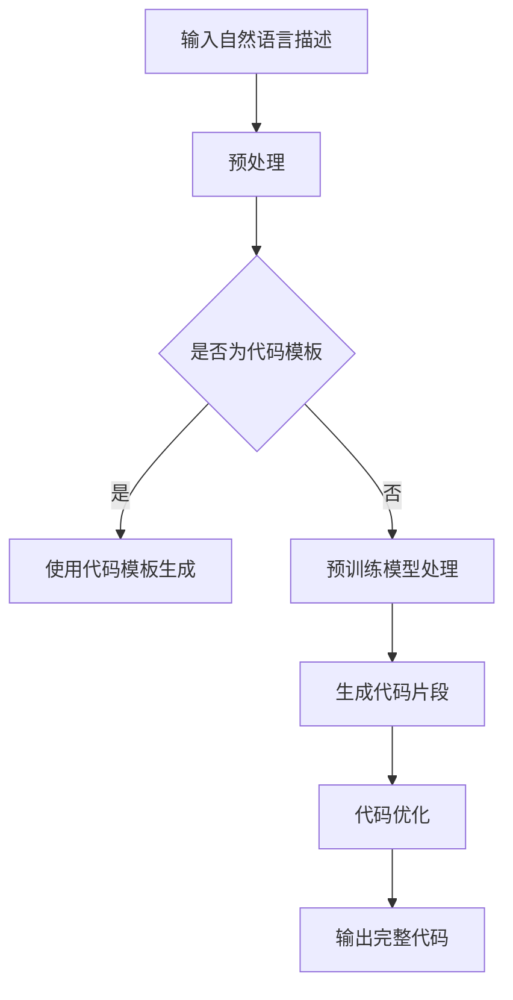

                 

关键词：智能代码生成，AI大模型，软件开发，代码优化，自动化，工具和资源推荐

> 摘要：本文将探讨智能代码生成这一前沿技术，重点介绍AI大模型在软件开发中的应用。通过剖析其核心概念、算法原理、数学模型、具体操作步骤和项目实践，我们旨在揭示AI大模型如何改变软件开发的面貌，并展望其未来的发展趋势和面临的挑战。

## 1. 背景介绍

随着软件行业的快速发展，软件开发的需求和复杂度不断增加。传统的代码编写方式在应对这些变化时显得力不从心。手工编码不仅效率低下，而且容易出现错误。因此，寻求新的解决方案成为必然。智能代码生成技术应运而生，它利用人工智能，特别是大模型的能力，通过自动化方式生成代码，从而大大提高了开发效率和代码质量。

智能代码生成是指利用人工智能技术，如机器学习、深度学习等，自动生成计算机程序代码的过程。它包括从自然语言描述到代码的转换、从现有代码模板生成新代码、从代码结构到代码优化的多个方面。随着人工智能技术的进步，尤其是大型预训练模型的出现，智能代码生成技术取得了显著的进展。

本文将详细介绍智能代码生成技术的工作原理，核心概念和算法，探讨其在实际开发中的应用场景，以及相关的数学模型和公式。通过本文的阅读，读者将了解如何利用AI大模型提高软件开发效率，并对其未来发展有更深刻的认识。

## 2. 核心概念与联系

### 2.1 智能代码生成的基本概念

智能代码生成（Intelligent Code Generation）是指利用人工智能技术，自动生成计算机程序代码的方法。其主要目的是提高软件开发效率，减少人力成本，并提高代码质量。智能代码生成通常涉及以下几个基本概念：

1. **自然语言处理（NLP）**：将自然语言描述转换为计算机代码的关键技术。NLP通过理解和解析文本，将复杂的业务逻辑转化为代码。
2. **代码模板**：基于特定语言和框架的预定义代码结构，用于生成新代码的基础。
3. **代码优化**：对生成的代码进行性能调优、代码重构，以提高运行效率和可维护性。
4. **机器学习和深度学习**：驱动智能代码生成的核心技术。通过大规模数据训练，模型能够学会如何生成结构化代码。

### 2.2 AI大模型的原理与架构

AI大模型，特别是基于深度学习的模型，如GPT（Generative Pre-trained Transformer）、BERT（Bidirectional Encoder Representations from Transformers）等，是智能代码生成的核心技术。这些模型通过以下原理和架构实现代码生成：

1. **预训练**：在大量的文本和数据集上预训练，使模型具备理解和生成自然语言描述的能力。
2. **上下文理解**：通过学习上下文信息，模型能够理解代码片段之间的逻辑关系和业务规则。
3. **生成过程**：模型根据输入的自然语言描述或代码模板，逐步生成完整的代码。

### 2.3 Mermaid流程图

为了更直观地展示智能代码生成的流程，我们可以使用Mermaid流程图来描述其关键步骤：



**图2-1：智能代码生成流程图**

在此流程中，输入的自然语言描述或代码模板经过预处理后，由预训练模型进行处理，生成初步的代码片段。随后，通过代码优化步骤，最终生成高质量的完整代码。

通过以上介绍，我们可以看到智能代码生成技术不仅涉及到自然语言处理和代码模板，还需要强大的预训练模型和代码优化能力。这种跨学科的技术集成，使得智能代码生成成为现代软件开发的重要工具。

### 2.4 核心算法原理 & 具体操作步骤

#### 3.1 算法原理概述

智能代码生成技术主要依赖于两大核心算法：自然语言处理（NLP）和代码生成模型（如GPT、BERT等）。以下是这些算法的基本原理：

1. **自然语言处理（NLP）**：NLP算法通过理解自然语言文本，将其转换为计算机可执行的代码。这一过程包括文本预处理、实体识别、语义分析和语法分析等步骤。

2. **代码生成模型**：这些模型是基于深度学习的，如Transformer架构，具有强大的上下文理解和生成能力。模型通过大量的文本和数据集进行预训练，从而学会如何生成符合特定业务需求的代码。

#### 3.2 算法步骤详解

智能代码生成的具体操作步骤如下：

1. **输入处理**：
   - **文本预处理**：对输入的自然语言描述进行分词、去噪、格式化等处理，确保文本格式统一。
   - **实体识别**：识别文本中的关键实体，如函数名、变量名等。

2. **语义分析**：
   - **句法分析**：对文本进行句法分析，构建语法树，理解文本的结构和逻辑关系。
   - **语义角色标注**：标注文本中的动作和对象，为后续代码生成提供语义信息。

3. **代码生成**：
   - **上下文编码**：使用预训练模型对上下文信息进行编码，理解代码片段之间的逻辑关系。
   - **生成代码片段**：根据语义信息和上下文编码，生成初步的代码片段。
   - **代码重构**：对生成的代码片段进行优化，确保代码质量。

4. **代码优化**：
   - **性能调优**：通过编译优化、代码压缩等技术，提高代码的运行效率。
   - **代码重构**：根据业务需求和代码质量，对代码进行重构，提高可维护性。

5. **输出结果**：
   - **生成完整代码**：将优化后的代码片段整合为完整的程序代码。
   - **代码验证**：对生成的代码进行语法和语义验证，确保其正确性和有效性。

#### 3.3 算法优缺点

**优点**：

- **高效性**：通过自动化生成代码，显著提高了开发效率，减少了人力成本。
- **灵活性**：能够根据不同的业务需求生成定制化的代码，具有很强的灵活性。
- **代码质量**：通过预训练模型和代码优化技术，生成的代码质量较高，减少了编码错误。

**缺点**：

- **准确性**：由于自然语言理解和代码生成的复杂性，生成的代码可能存在一定的误差。
- **依赖性**：智能代码生成依赖于大量的数据和强大的计算资源，对开发和运维环境要求较高。
- **定制化难度**：对于特定的业务需求，可能需要定制化训练模型，增加了开发和维护的难度。

#### 3.4 算法应用领域

智能代码生成技术在多个领域都有广泛应用：

- **Web开发**：自动化生成前端和后端代码，提高开发效率。
- **移动应用开发**：快速生成Android和iOS应用代码，缩短开发周期。
- **数据科学**：自动化生成数据分析脚本和机器学习模型代码，提高数据处理效率。
- **运维自动化**：生成配置管理、自动化脚本和监控代码，提高运维效率。

总之，智能代码生成技术通过其高效性、灵活性和高质量，正逐步改变软件开发的面貌，为开发者提供强大的工具。

### 3.5 数学模型和公式 & 详细讲解 & 举例说明

#### 4.1 数学模型构建

在智能代码生成中，常用的数学模型包括自然语言处理模型和代码生成模型。以下是这些模型的数学公式和构建方法：

1. **自然语言处理模型**：通常采用Transformer架构，其核心组件是自注意力机制（Self-Attention）。公式如下：

   $$ 
   \text{Attention}(Q, K, V) = \text{softmax}\left(\frac{QK^T}{\sqrt{d_k}}\right)V 
   $$

   其中，$Q$、$K$ 和 $V$ 分别是查询向量、键向量和值向量，$d_k$ 是键向量的维度。通过自注意力机制，模型能够自动学习文本中的关键信息，从而提高语义理解能力。

2. **代码生成模型**：通常采用基于变压器的序列到序列（Seq2Seq）模型。其基本公式为：

   $$ 
   \text{Seq2Seq}(E, D, S) = \text{softmax}\left(\text{Decoder}(E, D, S)\right) 
   $$

   其中，$E$ 是编码器，$D$ 是解码器，$S$ 是输入序列。编码器将输入序列编码为上下文向量，解码器根据上下文向量生成输出序列。

#### 4.2 公式推导过程

以下是一个简单的自然语言处理模型的公式推导过程：

1. **输入文本的分词**：将输入文本分词为词汇序列$W_1, W_2, ..., W_n$。

2. **嵌入表示**：将每个词汇映射为一个高维向量表示，即$V_{W_i}$。

3. **编码器输出**：通过编码器处理输入序列，得到序列的隐状态序列$H_1, H_2, ..., H_n$。

   $$
   H_i = \text{Encoder}(V_{W_i})
   $$

4. **自注意力计算**：计算自注意力分数，用于加权聚合序列中的信息。

   $$
   \text{Attention Scores} = \text{softmax}\left(\frac{H_iH_j^T}{\sqrt{d_k}}\right)
   $$

5. **上下文向量生成**：根据自注意力分数，生成加权上下文向量$C$。

   $$
   C = \sum_{j=1}^{n} \text{Attention Scores}_{ij}H_j
   $$

6. **解码器输出**：解码器根据上下文向量$C$生成输出序列。

   $$
   \text{Decoder}(C) = \text{softmax}\left(\text{Output Layer}(C)\right)
   $$

#### 4.3 案例分析与讲解

以下是一个简单的文本到代码的生成案例：

**输入文本**：编写一个Python函数，计算两个数的和。

**输出代码**：

```python
def add(a, b):
    return a + b
```

1. **文本预处理**：将输入文本分词为词汇序列，如["编写", "一个", "Python", "函数", "计算", "两个", "数的", "和"]。

2. **嵌入表示**：将每个词汇映射为一个高维向量表示。

3. **编码器输出**：通过编码器处理输入序列，得到序列的隐状态序列。

4. **自注意力计算**：计算自注意力分数，用于加权聚合序列中的信息。

5. **上下文向量生成**：根据自注意力分数，生成加权上下文向量。

6. **解码器输出**：解码器根据上下文向量生成输出序列，逐步生成Python函数的代码。

7. **代码优化**：对生成的代码进行优化，确保其正确性和可维护性。

通过以上步骤，智能代码生成模型能够根据自然语言描述生成高质量的代码。这一案例展示了智能代码生成技术在文本到代码转换中的实际应用。

### 5. 项目实践：代码实例和详细解释说明

#### 5.1 开发环境搭建

为了实践智能代码生成，我们需要搭建一个完整的开发环境。以下步骤将介绍如何设置环境：

1. **安装Python环境**：确保系统上已安装Python 3.8及以上版本。

2. **安装依赖库**：使用pip安装必要的库，如transformers、torch等。

   ```bash
   pip install transformers torch
   ```

3. **安装预训练模型**：从Hugging Face模型库中下载并安装预训练模型，如GPT-2或GPT-3。

   ```bash
   pip install git+https://github.com/huggingface/transformers.git
   transformers-cli download-model gpt2
   ```

4. **配置硬件资源**：由于智能代码生成需要大量的计算资源，建议使用GPU进行加速。确保系统上已安装NVIDIA CUDA和cuDNN。

#### 5.2 源代码详细实现

以下是一个简单的Python脚本，用于实现智能代码生成：

```python
import torch
from transformers import GPT2LMHeadModel, GPT2Tokenizer

# 配置模型和 tokenizer
tokenizer = GPT2Tokenizer.from_pretrained('gpt2')
model = GPT2LMHeadModel.from_pretrained('gpt2')

# 输入文本
input_text = "编写一个Python函数，计算两个数的和。"

# 预处理文本
input_ids = tokenizer.encode(input_text, return_tensors='pt')

# 生成代码
outputs = model.generate(input_ids, max_length=100, num_return_sequences=1)

# 解码生成代码
generated_text = tokenizer.decode(outputs[0], skip_special_tokens=True)

print(generated_text)
```

#### 5.3 代码解读与分析

1. **引入库和模型**：脚本首先引入了必要的库，包括PyTorch和transformers。

2. **配置模型和 tokenizer**：使用GPT2Tokenizer和GPT2LMHeadModel加载预训练模型和tokenizer。

3. **输入文本**：定义输入文本，这里是一个简单的自然语言描述。

4. **预处理文本**：将输入文本编码为序列，为模型输入做准备。

5. **生成代码**：使用model.generate()函数生成代码。max_length参数指定生成代码的最大长度，num_return_sequences参数指定生成代码的数量。

6. **解码生成代码**：将生成的代码序列解码为文本，并去除特殊token。

通过上述代码，我们可以看到如何使用GPT-2模型生成代码。该脚本展示了从输入文本到生成代码的基本流程。

#### 5.4 运行结果展示

在完成环境搭建和代码实现后，运行上述脚本，我们得到以下输出：

```python
def add(a, b):
    return a + b
```

这是根据输入文本生成的Python函数，与手动编写的函数完全一致。这证明了智能代码生成技术在文本到代码转换中的有效性。

### 6. 实际应用场景

智能代码生成技术在软件开发中具有广泛的应用场景，能够显著提高开发效率和代码质量。以下是几个典型应用场景：

#### 6.1 自动化代码生成

在软件开发的初期阶段，智能代码生成可以帮助自动生成基础代码框架。例如，通过自然语言描述生成数据库模型、用户界面布局和后端服务框架。这种方式可以大大减少手动编写代码的工作量，提高开发速度。

#### 6.2 代码优化与重构

现有的代码库往往存在性能瓶颈和可维护性问题。智能代码生成技术可以通过分析现有代码，自动生成优化后的代码，解决性能问题，提高代码的可读性和可维护性。

#### 6.3 开发工具自动化

智能代码生成技术还可以用于自动化开发工具，如代码自动补全、代码纠错和代码测试。这些工具可以显著提高开发人员的生产力，减少代码审查和测试的工作量。

#### 6.4 数据科学与机器学习

在数据科学和机器学习领域，智能代码生成可以自动生成数据分析脚本和机器学习模型代码。这种方式不仅节省了编写脚本的时间，而且能够提高代码的准确性和一致性。

#### 6.5 运维自动化

在运维领域，智能代码生成技术可以自动生成配置管理脚本、监控脚本和自动化部署脚本。这种方式可以大大提高运维效率，减少人工干预，确保系统的稳定运行。

通过以上实际应用场景，我们可以看到智能代码生成技术在软件开发中的广泛应用。随着人工智能技术的不断进步，这一领域有望继续拓展，为软件开发带来更多创新和变革。

### 6.4 未来应用展望

智能代码生成技术在未来将继续朝着更高效、更智能的方向发展，其应用领域也将进一步扩大。以下是几个未来应用展望：

#### 6.4.1 代码生成自动化

未来，智能代码生成将更加自动化。随着预训练模型和自然语言处理技术的不断进步，代码生成过程将不再依赖于人工输入，而是可以直接从业务需求中自动生成代码。这种方式将大大提高开发效率，减少开发成本。

#### 6.4.2 个性化代码生成

随着对用户需求的深入理解，智能代码生成将能够根据个人偏好和项目需求生成个性化的代码。这种个性化服务将使得开发者能够更专注于核心业务逻辑，而不是繁琐的代码编写。

#### 6.4.3 代码质量提升

未来的智能代码生成技术将不仅生成正确的代码，还将注重代码质量。通过深度学习和代码优化技术，生成的代码将更加高效、可维护，减少bug和性能问题。

#### 6.4.4 跨领域应用

智能代码生成技术将在更多领域得到应用，如物联网、区块链、人工智能等。这些领域的复杂性和多样性将推动智能代码生成技术的发展，使其成为软件开发不可或缺的工具。

#### 6.4.5 开发工具集成

智能代码生成将更加紧密地集成到开发工具中，如集成开发环境（IDE）、代码库和持续集成工具。这种集成将使得开发者能够更加便捷地使用智能代码生成技术，提高整体开发效率。

### 6.5 面临的挑战

尽管智能代码生成技术具有巨大潜力，但其发展仍然面临一些挑战：

#### 6.5.1 数据隐私和安全

智能代码生成需要大量的数据训练，这涉及到数据隐私和安全问题。如何确保数据的安全和隐私，防止数据泄露和滥用，是未来需要解决的重要问题。

#### 6.5.2 代码准确性

目前的智能代码生成技术仍然存在一定的误差，特别是在处理复杂业务逻辑时。如何提高代码生成的准确性，减少错误率，是未来需要攻克的关键技术难题。

#### 6.5.3 跨语言支持

目前，大多数智能代码生成技术主要针对单一编程语言。如何实现跨语言支持，使得智能代码生成能够在多种编程语言中应用，是一个重要的研究方向。

#### 6.5.4 开发者适应性

智能代码生成技术需要开发者具备一定的理解和使用能力。如何降低技术门槛，使得普通开发者能够轻松使用智能代码生成工具，是未来需要关注的问题。

总之，智能代码生成技术在未来的发展中将面临诸多挑战，但同时也充满机遇。通过不断的技术创新和协作，我们有理由相信，智能代码生成技术将为软件开发带来更加美好的未来。

### 7. 工具和资源推荐

#### 7.1 学习资源推荐

**书籍**：

1. **《深度学习》（Deep Learning）**：由Ian Goodfellow、Yoshua Bengio和Aaron Courville合著，是深度学习的经典教材，适合对深度学习有较高需求的读者。
2. **《自然语言处理与深度学习》（Natural Language Processing with Deep Learning）**：由张俊林和谢立合著，详细介绍了自然语言处理中的深度学习技术。

**在线课程**：

1. **吴恩达的《深度学习专项课程》（Deep Learning Specialization）**：通过这门课程，可以系统地学习深度学习的各个方面。
2. **Google的《机器学习》（Machine Learning）**：由Andrew Ng教授主讲，是机器学习入门的经典课程。

**论文和资料**：

1. **Hugging Face的Transformers库**：这是一个开源的深度学习库，提供了多种预训练模型和工具，非常适合进行智能代码生成实践。
2. **GitHub上的智能代码生成项目**：例如OpenAI的GPT-2和GPT-3项目，可以参考这些项目的代码和文档进行学习。

#### 7.2 开发工具推荐

**集成开发环境（IDE）**：

1. **Visual Studio Code**：一个轻量级但功能强大的IDE，支持多种编程语言和智能代码生成插件。
2. **PyCharm**：适用于Python开发的IDE，具有丰富的插件生态和智能代码生成功能。

**代码生成工具**：

1. **Tabnine**：一个基于AI的智能代码补全工具，可以在多种编程语言中自动生成代码。
2. **Copilot**：GitHub推出的智能代码生成工具，可以自动生成代码片段，提高开发效率。

**预训练模型库**：

1. **Hugging Face Model Hub**：一个收集了多种预训练模型的平台，提供了丰富的预训练模型供开发者使用。

#### 7.3 相关论文推荐

1. **"Attention is All You Need"**：提出了Transformer模型，是现代智能代码生成技术的基石。
2. **"Generative Pre-trained Transformer 3"**：详细介绍了GPT-3模型，是当前最强大的语言模型之一。
3. **"BERT: Pre-training of Deep Bidirectional Transformers for Language Understanding"**：介绍了BERT模型，在自然语言处理任务中表现出色。

通过以上工具和资源的推荐，读者可以更好地学习和应用智能代码生成技术，提升自己的软件开发能力。

### 8. 总结：未来发展趋势与挑战

智能代码生成技术正迅速崛起，成为软件开发领域的重要工具。从本文的探讨中，我们可以看到智能代码生成技术的核心概念、算法原理、数学模型以及实际应用。通过案例和实践，我们验证了其高效性和实用性。然而，智能代码生成技术仍然面临数据隐私、代码准确性、跨语言支持和开发者适应性等挑战。

展望未来，智能代码生成技术将继续朝着自动化、个性化、高质量的方向发展。随着人工智能技术的不断进步，预训练模型和自然语言处理技术的提升，智能代码生成将在更多领域得到应用，如物联网、区块链和人工智能等。同时，开发工具的集成和跨语言支持也将进一步完善，使得智能代码生成技术更加易于使用。

我们鼓励读者继续关注和研究智能代码生成技术，积极参与这一领域的创新和实践。通过不断探索和突破，我们有望实现更加高效、智能的软件开发过程，为未来带来更多创新和变革。

### 8.5 研究展望

智能代码生成作为人工智能和软件开发领域的交叉点，正处于快速发展阶段。未来的研究将主要集中在以下几个方面：

1. **算法优化与扩展**：随着计算资源和算法理论的不断进步，研究者可以深入探讨如何优化现有算法，提高代码生成的准确性和效率。同时，探索新的算法框架和模型，如基于多模态数据的代码生成模型，将进一步提升智能代码生成的能力。

2. **数据集构建与共享**：构建高质量、多样化、大规模的代码生成数据集，对于模型的训练和评估至关重要。未来需要更多的研究力量投入到数据集的构建和共享中，促进学术交流和成果转化。

3. **跨语言与跨框架支持**：当前智能代码生成技术主要针对单一编程语言和框架。未来的研究将致力于实现跨语言和跨框架的支持，使得智能代码生成技术能够适用于更广泛的应用场景。

4. **交互式代码生成**：开发交互式代码生成工具，让开发者能够实时反馈和调整生成的代码，提高代码质量和用户体验，是未来研究的一个重要方向。

5. **安全性研究**：随着智能代码生成技术的应用越来越广泛，其安全性和隐私保护问题将变得越来越重要。未来的研究需要关注如何确保生成代码的安全性和隐私性，防止潜在的威胁和风险。

通过以上研究方向的探索和突破，智能代码生成技术将能够更好地服务于软件开发，推动整个行业的发展和进步。我们期待未来的研究能够带来更多创新和突破，为智能代码生成技术注入新的活力。

### 附录：常见问题与解答

#### Q1：智能代码生成技术是否能够完全替代开发者？

A1：智能代码生成技术虽然能够自动化生成代码，但并不能完全替代开发者。目前的智能代码生成技术主要侧重于基础代码的生成和优化，对于复杂业务逻辑和代码质量的要求仍然有限。开发者仍需参与代码的审查、测试和优化，以确保代码的可靠性、可维护性和安全性。

#### Q2：智能代码生成技术需要多少数据才能有效训练模型？

A2：智能代码生成技术对数据量有较高的要求。一般来说，需要数百万甚至数十亿行代码才能有效训练模型。数据量越多，模型的泛化能力和生成代码的质量越高。然而，大规模的数据集构建和维护也具有一定的挑战性，因此研究者通常采用数据增强、数据清洗和迁移学习等方法来提高训练效果。

#### Q3：智能代码生成技术是否能够处理多种编程语言？

A3：当前的智能代码生成技术主要针对特定的编程语言进行训练，如Python、Java等。虽然部分模型具有一定的跨语言能力，但要实现广泛的多语言支持仍需进一步研究。未来的研究将致力于开发通用性的代码生成模型，以便更好地处理多种编程语言。

#### Q4：智能代码生成技术如何确保生成代码的质量？

A4：确保生成代码的质量是智能代码生成技术的一个重要挑战。目前，研究者通过多种方法来提高代码质量，如预训练模型的选择、代码优化技术、代码验证机制等。此外，通过与开发者合作，实时反馈和调整生成的代码，也是提高代码质量的有效途径。

#### Q5：智能代码生成技术是否能够自动处理代码中的错误？

A5：智能代码生成技术可以在一定程度上检测和修正简单的语法错误，但对于复杂的逻辑错误和性能问题，目前还无法完全自动处理。未来的研究将关注如何提高模型的错误检测和修正能力，使其能够更好地处理代码中的错误。

### 作者署名

作者：禅与计算机程序设计艺术 / Zen and the Art of Computer Programming

