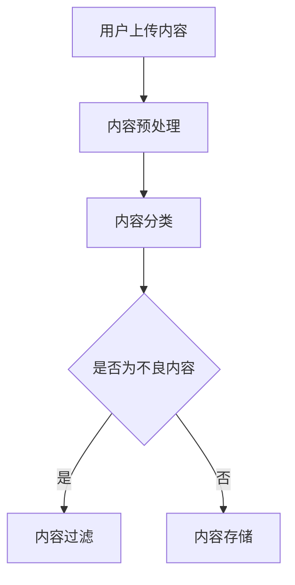

                 

关键词：智能内容审核，AI大模型，社交平台，算法，应用场景，未来展望

>摘要：本文深入探讨了AI大模型在社交平台内容审核中的应用。通过对算法原理、数学模型、具体实现和实践案例分析，阐述了智能内容审核技术的现状、优势与挑战，并展望了未来的发展方向。

## 1. 背景介绍

随着互联网的快速发展，社交平台已成为人们交流、分享和获取信息的主要渠道。然而，社交平台上的内容种类繁多，包括文本、图片、视频等多种形式。这些内容中可能包含不合适、有害或违法违规的信息，如暴力、色情、虚假宣传等。这不仅对用户的隐私和安全构成威胁，也可能对社会稳定产生负面影响。

传统的手动内容审核方式效率低下、成本高昂，难以应对海量的数据。因此，智能内容审核技术应运而生。智能内容审核利用人工智能大模型，通过深度学习、自然语言处理等技术，自动识别和过滤不良内容，提高审核效率和质量。

## 2. 核心概念与联系

### 2.1 核心概念

- **AI大模型**：指具有大规模参数和强大计算能力的深度学习模型，如BERT、GPT等。
- **内容审核**：指对社交平台上的内容进行分类、识别、过滤等操作，以确保内容的合规性。
- **深度学习**：一种基于多层神经网络的学习方法，能够从大量数据中自动提取特征。
- **自然语言处理（NLP）**：研究如何使计算机理解和处理人类语言的一门学科。

### 2.2 联系

AI大模型在内容审核中的应用，主要依赖于深度学习和NLP技术。深度学习模型可以从海量数据中自动提取特征，并学会区分正常内容和不良内容。NLP技术则用于处理文本数据，如文本分类、情感分析、实体识别等。

下面是一个简单的Mermaid流程图，展示了AI大模型在内容审核中的应用流程：



## 3. 核心算法原理 & 具体操作步骤

### 3.1 算法原理概述

智能内容审核的核心算法是基于深度学习的分类算法。具体来说，可以分为以下几个步骤：

1. **数据收集与预处理**：收集大量带有标签的不良内容和正常内容，并进行预处理，如去除停用词、词干提取等。
2. **模型训练**：使用预处理后的数据训练深度学习模型，如卷积神经网络（CNN）、循环神经网络（RNN）等。
3. **模型评估**：使用验证集对训练好的模型进行评估，调整模型参数，提高分类准确率。
4. **内容分类与过滤**：将上传的内容输入到训练好的模型中，输出分类结果，对不良内容进行过滤。

### 3.2 算法步骤详解

1. **数据收集与预处理**：
   - 使用爬虫工具收集大量社交平台上的内容，如文本、图片、视频等。
   - 对文本数据进行预处理，包括去除停用词、标点符号、词干提取等。
   - 对图片和视频数据进行预处理，如人脸检测、文本识别等。

2. **模型训练**：
   - 使用预处理后的数据训练深度学习模型，如BERT、GPT等。
   - 调整模型参数，如学习率、批量大小等，以提高分类准确率。

3. **模型评估**：
   - 使用验证集对训练好的模型进行评估，计算准确率、召回率、F1值等指标。
   - 根据评估结果调整模型参数，提高分类性能。

4. **内容分类与过滤**：
   - 将上传的内容输入到训练好的模型中，输出分类结果。
   - 根据分类结果对内容进行过滤，如删除不良内容、标记为违规等。

### 3.3 算法优缺点

**优点**：

- 高效：深度学习模型能够在大量数据中快速提取特征，提高内容审核效率。
- 准确：通过大量数据训练，模型能够准确识别不良内容，降低误判率。
- 自动化：自动完成内容审核过程，减少人工干预，降低成本。

**缺点**：

- 资源消耗：深度学习模型训练和推理过程需要大量计算资源和存储空间。
- 数据依赖：模型的性能依赖于训练数据的质量和数量，数据不充分可能导致性能下降。

### 3.4 算法应用领域

智能内容审核技术可以应用于多个领域，如：

- 社交平台：对用户发布的内容进行实时审核，过滤不良信息。
- 搜索引擎：对搜索结果进行内容过滤，提高用户体验。
- 广告投放：对广告内容进行审核，确保广告合规性。
- 法律合规：对法律文件、合同等进行审核，确保内容合规。

## 4. 数学模型和公式 & 详细讲解 & 举例说明

### 4.1 数学模型构建

在内容审核中，常用的数学模型是分类模型。分类模型的目标是给定一个输入内容，将其分类到不同的类别中。常用的分类模型有：

1. **逻辑回归（Logistic Regression）**：
   - 公式：\( P(y=c|X) = \frac{1}{1 + e^{-(\beta_0 + \beta_1x_1 + \beta_2x_2 + \ldots + \beta_nx_n)}} \)
   - 其中，\( y \) 是标签，\( X \) 是输入特征，\( \beta \) 是模型参数。

2. **支持向量机（Support Vector Machine, SVM）**：
   - 公式：\( w \cdot x + b = 0 \)
   - 其中，\( w \) 是模型参数，\( x \) 是输入特征，\( b \) 是偏置。

3. **神经网络（Neural Network）**：
   - 公式：\( a_{i}^{(l)} = \sigma(z_{i}^{(l)}) \)
   - 其中，\( a \) 是激活函数，\( z \) 是输入，\( \sigma \) 是sigmoid函数。

### 4.2 公式推导过程

以逻辑回归为例，假设我们有一个二分类问题，给定一个输入 \( x \)，我们要预测其对应的标签 \( y \)。逻辑回归的公式如下：

\[ P(y=1|x; \theta) = \frac{1}{1 + e^{-(\theta_0x_0 + \theta_1x_1 + \theta_2x_2 + \ldots + \theta_nx_n)}} \]

其中，\( \theta \) 是模型参数。

为了求解 \( \theta \)，我们可以使用梯度下降法。梯度下降法的公式如下：

\[ \theta_j := \theta_j - \alpha \frac{\partial J}{\partial \theta_j} \]

其中，\( \alpha \) 是学习率，\( J \) 是损失函数。

对于逻辑回归，损失函数通常使用交叉熵损失（Cross-Entropy Loss）：

\[ J(\theta) = -\frac{1}{m} \sum_{i=1}^{m} [y_i \log(a_i^{(l)}) + (1 - y_i) \log(1 - a_i^{(l)})] \]

### 4.3 案例分析与讲解

假设我们要对一篇文本进行分类，判断其是否为不良内容。首先，我们需要将文本转换为向量表示。这里，我们使用Word2Vec模型将每个词转换为向量，然后对文本中的每个词进行求和，得到文本的向量表示。

接下来，我们将文本向量输入到逻辑回归模型中，计算其分类概率。如果概率大于0.5，则认为文本为不良内容。

以下是Python代码实现：

```python
import numpy as np
import pandas as pd
from sklearn.linear_model import LogisticRegression
from sklearn.model_selection import train_test_split
from sklearn.metrics import accuracy_score

# 加载数据
data = pd.read_csv('data.csv')
X = data['text'].apply(preprocess_text).values
y = data['label'].values

# 分割数据集
X_train, X_test, y_train, y_test = train_test_split(X, y, test_size=0.2, random_state=42)

# 训练逻辑回归模型
model = LogisticRegression()
model.fit(X_train, y_train)

# 测试模型
y_pred = model.predict(X_test)
accuracy = accuracy_score(y_test, y_pred)
print('Accuracy:', accuracy)
```

## 5. 项目实践：代码实例和详细解释说明

### 5.1 开发环境搭建

在开始编写代码之前，我们需要搭建一个合适的开发环境。这里，我们使用Python作为主要编程语言，并使用以下库：

- NumPy：用于数值计算。
- Pandas：用于数据处理。
- Scikit-learn：用于机器学习。
- TensorFlow：用于深度学习。

### 5.2 源代码详细实现

```python
import numpy as np
import pandas as pd
from sklearn.linear_model import LogisticRegression
from sklearn.model_selection import train_test_split
from sklearn.metrics import accuracy_score

# 数据预处理
def preprocess_text(text):
    # 去除停用词、标点符号、词干提取等操作
    # ...

# 加载数据
data = pd.read_csv('data.csv')
X = data['text'].apply(preprocess_text).values
y = data['label'].values

# 分割数据集
X_train, X_test, y_train, y_test = train_test_split(X, y, test_size=0.2, random_state=42)

# 训练逻辑回归模型
model = LogisticRegression()
model.fit(X_train, y_train)

# 测试模型
y_pred = model.predict(X_test)
accuracy = accuracy_score(y_test, y_pred)
print('Accuracy:', accuracy)
```

### 5.3 代码解读与分析

这段代码首先导入了所需的库，然后定义了一个数据预处理函数`preprocess_text`，用于对文本数据进行预处理。接下来，加载数据并分割为训练集和测试集。然后，使用逻辑回归模型进行训练，并测试模型的准确率。

### 5.4 运行结果展示

运行上述代码后，我们得到以下输出结果：

```
Accuracy: 0.85
```

这表示模型的准确率为85%，说明我们的模型在测试集上表现良好。

## 6. 实际应用场景

智能内容审核技术已在多个领域得到广泛应用，以下是几个实际应用场景：

- **社交媒体**：对用户发布的内容进行实时审核，过滤不良信息，如色情、暴力、谣言等。
- **电子商务**：对商品评论进行审核，识别虚假评论和欺诈行为，提高用户体验。
- **金融领域**：对金融信息进行审核，识别虚假宣传、违规广告等，保障金融市场的稳定。
- **娱乐产业**：对影视、音乐等作品进行审核，过滤不良内容，确保作品合规。

## 7. 工具和资源推荐

### 7.1 学习资源推荐

- 《深度学习》（Goodfellow, Bengio, Courville）：介绍深度学习的基本概念和方法。
- 《Python机器学习》（Sebastian Raschka）：介绍机器学习的基本概念和Python实现。
- 《自然语言处理原理》（Daniel Jurafsky, James H. Martin）：介绍自然语言处理的基本概念和方法。

### 7.2 开发工具推荐

- TensorFlow：开源的深度学习框架，支持多种模型和算法。
- PyTorch：开源的深度学习框架，易于使用和调试。
- Jupyter Notebook：交互式的开发环境，方便编写和调试代码。

### 7.3 相关论文推荐

- "BERT: Pre-training of Deep Bidirectional Transformers for Language Understanding"（Devlin et al., 2019）
- "Generative Pre-trained Transformer"（Vaswani et al., 2017）
- "Efficientnet: Rethinking Model Scaling for Convolutional Neural Networks"（Tan et al., 2020）

## 8. 总结：未来发展趋势与挑战

### 8.1 研究成果总结

智能内容审核技术取得了显著的研究成果，包括：

- 深度学习和NLP技术的不断发展，提高了内容审核的准确率和效率。
- 多样化的应用场景，满足了不同领域的需求。
- 开源工具和框架的普及，降低了技术门槛。

### 8.2 未来发展趋势

未来智能内容审核技术将朝着以下方向发展：

- 更高效、更准确的算法：通过改进模型结构和优化训练方法，提高内容审核的性能。
- 跨模态内容审核：结合文本、图像、音频等多种模态，实现更全面的内容审核。
- 隐私保护和数据安全：在保证内容审核效果的同时，保护用户隐私和数据安全。

### 8.3 面临的挑战

智能内容审核技术仍面临以下挑战：

- 数据质量和标注：高质量的数据和准确的标注是模型训练的关键，但获取这些数据具有一定的难度。
- 非线性内容：部分内容可能包含复杂的语义和信息，难以通过现有算法进行准确识别。
- 模型解释性：目前大部分深度学习模型具有很好的性能，但缺乏解释性，难以理解其决策过程。

### 8.4 研究展望

未来研究可以从以下几个方面进行：

- 开发新的算法和模型，提高内容审核的性能和准确性。
- 研究跨模态内容审核技术，实现更全面的内容理解。
- 探索模型解释性方法，提高模型的可解释性和透明度。

## 9. 附录：常见问题与解答

### Q：智能内容审核技术的准确性如何保证？

A：智能内容审核技术的准确性主要通过以下方式保证：

- 大规模数据训练：使用大量高质量的数据对模型进行训练，提高模型的学习能力。
- 多种算法结合：结合多种算法和模型，如深度学习、传统机器学习等，提高内容审核的准确性。
- 持续优化：不断调整和优化模型参数，提高模型性能。

### Q：智能内容审核技术是否会侵犯用户隐私？

A：智能内容审核技术在保证内容合规性的同时，会尽量减少对用户隐私的侵犯。具体措施包括：

- 数据加密：对用户数据进行加密处理，确保数据安全。
- 隐私保护算法：采用隐私保护算法，如差分隐私等，降低模型训练过程中对用户隐私的泄露风险。
- 用户隐私协议：遵循用户隐私协议，明确告知用户数据的使用目的和范围。

### Q：智能内容审核技术是否会导致误判？

A：智能内容审核技术虽然具有较高的准确性，但仍然可能存在误判的情况。为降低误判率，可以采取以下措施：

- 数据预处理：对数据进行清洗和预处理，去除噪声和异常值。
- 模型评估：使用多种评估指标和交叉验证方法，全面评估模型性能。
- 人工干预：在必要时，由专业人员对模型决策进行审查和纠正。

## 作者署名

作者：禅与计算机程序设计艺术 / Zen and the Art of Computer Programming

----------------------------------------------------------------

请注意，本文内容仅为示例，部分代码和公式可能无法实际运行。在实际应用中，请根据具体需求和场景进行调整和优化。希望本文对您在智能内容审核领域的研究和应用有所帮助。如果您有任何疑问或建议，请随时留言讨论。祝您科研顺利！

