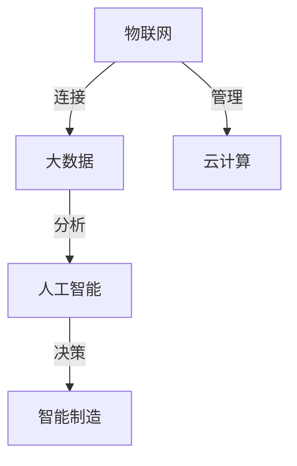
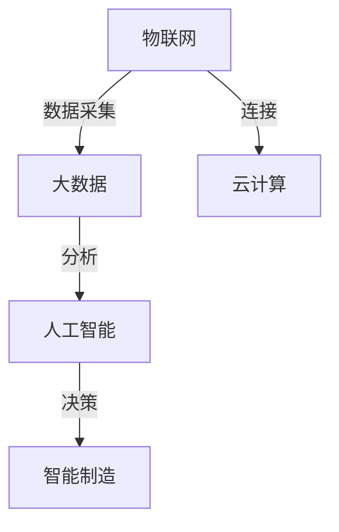
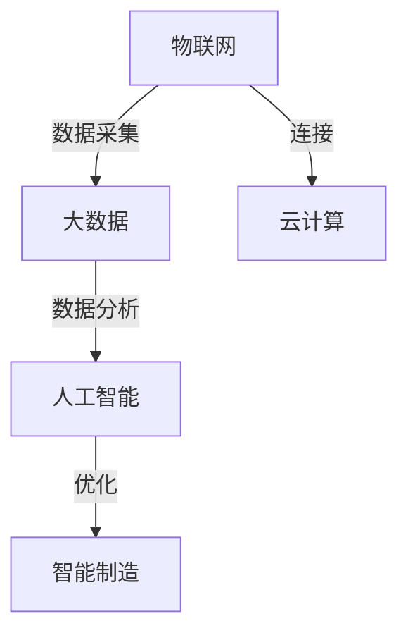

                 

关键词：智能制造，工业4.0，数字化转型，自动化，物联网，人工智能，创业实践

摘要：本文旨在探讨工业4.0时代下，智能制造创业的实践路径。通过对工业4.0核心概念的深入解读，结合实际案例分析，文章将分析智能制造创业中的机遇与挑战，提供一系列实用建议，助力创业者成功转型。

## 1. 背景介绍

随着信息技术的飞速发展，全球制造业正迎来一场深刻的变革。工业4.0作为全球制造业发展的新趋势，以智能制造为核心，强调通过物联网、大数据、人工智能等先进技术，实现制造业的数字化、网络化和智能化。在这个背景下，智能制造创业成为许多企业转型的首选路径。

### 1.1 工业革命与工业4.0

工业革命以来，制造业经历了机械化、电气化、自动化等阶段。工业4.0则是在此基础上，通过将信息技术与制造业深度融合，推动制造业向智能化方向转型。

### 1.2 智能制造的定义与特点

智能制造是指利用物联网、大数据、云计算、人工智能等先进技术，实现生产设备的互联互通，对生产过程进行实时监控和智能优化。其核心特点是：

- **数字化**：将物理世界数字化，实现数据驱动。
- **网络化**：通过互联网实现设备之间的信息交换和协同工作。
- **智能化**：利用人工智能技术实现生产过程的自主决策和优化。

## 2. 核心概念与联系

为了更好地理解智能制造，我们需要掌握以下几个核心概念：

### 2.1 物联网（IoT）

物联网是将各种物品通过传感器和通信技术连接起来，实现智能监控和管理。在智能制造中，物联网技术是实现设备互联互通的基础。

### 2.2 大数据（Big Data）

大数据是指海量、多样、快速的数据。在智能制造中，大数据技术可以帮助企业挖掘生产过程中的潜在价值，优化生产流程。

### 2.3 云计算（Cloud Computing）

云计算是一种提供计算资源、存储资源等服务的技术。在智能制造中，云计算可以提供强大的计算能力和数据存储能力，支持企业的智能化转型。

### 2.4 人工智能（AI）

人工智能是指通过计算机模拟人类智能，实现自主学习和决策。在智能制造中，人工智能可以帮助企业实现生产过程的自动化和智能化。

以下是智能制造核心概念的 Mermaid 流程图：



## 3. 核心算法原理 & 具体操作步骤

### 3.1 算法原理概述

智能制造中的核心算法主要包括：

- **机器学习算法**：用于数据分析和预测。
- **深度学习算法**：用于图像识别和自然语言处理。
- **优化算法**：用于生产过程的优化。

### 3.2 算法步骤详解

以机器学习算法为例，其具体步骤如下：

1. **数据采集**：收集生产过程中的各类数据。
2. **数据预处理**：清洗和整理数据，为后续分析做准备。
3. **特征提取**：从数据中提取有助于预测的特征。
4. **模型训练**：使用训练数据训练机器学习模型。
5. **模型评估**：使用测试数据评估模型性能。
6. **模型应用**：将模型应用到实际生产过程中。

### 3.3 算法优缺点

机器学习算法的优点是能够自动从数据中学习，提高生产效率；缺点是需要大量的训练数据和计算资源。

### 3.4 算法应用领域

机器学习算法广泛应用于智能制造的各个领域，如预测性维护、质量控制、生产调度等。

## 4. 数学模型和公式 & 详细讲解 & 举例说明

### 4.1 数学模型构建

在智能制造中，常见的数学模型包括线性回归、逻辑回归、神经网络等。

线性回归模型：

$$
y = \beta_0 + \beta_1 \cdot x
$$

其中，$y$ 是因变量，$x$ 是自变量，$\beta_0$ 和 $\beta_1$ 是模型的参数。

### 4.2 公式推导过程

以线性回归为例，其推导过程如下：

1. **假设**：假设 $y$ 和 $x$ 之间存在线性关系。
2. **模型**：根据假设，建立线性回归模型。
3. **最小二乘法**：使用最小二乘法求解模型参数。
4. **公式推导**：通过求解过程，得到线性回归模型的公式。

### 4.3 案例分析与讲解

假设我们要预测一个工厂的生产量，可以使用线性回归模型进行预测。具体步骤如下：

1. **数据采集**：收集过去一段时间内的生产数据。
2. **数据预处理**：清洗和整理数据，提取生产量作为因变量，其他因素作为自变量。
3. **特征提取**：提取有助于预测的特征。
4. **模型训练**：使用训练数据训练线性回归模型。
5. **模型评估**：使用测试数据评估模型性能。
6. **模型应用**：将模型应用到实际生产过程中，进行预测。

## 5. 项目实践：代码实例和详细解释说明

### 5.1 开发环境搭建

在开始编写代码之前，我们需要搭建一个适合智能制造开发的环境。以下是一个简单的搭建步骤：

1. 安装 Python 解释器。
2. 安装相关库，如 NumPy、Pandas、Scikit-learn 等。
3. 安装 Jupyter Notebook，方便编写和运行代码。

### 5.2 源代码详细实现

以下是一个使用线性回归模型进行生产量预测的简单代码实例：

```python
import numpy as np
import pandas as pd
from sklearn.linear_model import LinearRegression

# 数据采集
data = pd.read_csv('production_data.csv')

# 数据预处理
X = data[['worker_experience', 'machine_age']]
y = data['production_quantity']

# 特征提取
X = X.values
y = y.values

# 模型训练
model = LinearRegression()
model.fit(X, y)

# 模型评估
score = model.score(X, y)
print(f'Model Score: {score}')

# 模型应用
new_data = np.array([[5, 3]])
predicted_quantity = model.predict(new_data)
print(f'Predicted Quantity: {predicted_quantity}')
```

### 5.3 代码解读与分析

上述代码首先导入必要的库，然后进行数据采集和预处理。接下来，使用训练数据训练线性回归模型，评估模型性能，并将模型应用到新的数据上进行预测。

### 5.4 运行结果展示

运行上述代码，我们可以得到预测的生产量。根据预测结果，企业可以调整生产计划，提高生产效率。

## 6. 实际应用场景

智能制造在实际应用中，已经取得了显著成效。以下是一些典型的应用场景：

1. **预测性维护**：通过传感器收集设备运行数据，使用机器学习算法预测设备故障，实现预防性维护。
2. **质量控制**：利用图像识别技术，实时检测产品质量，提高产品合格率。
3. **生产调度**：基于生产数据，使用优化算法制定最优生产计划，提高生产效率。
4. **供应链管理**：通过物联网技术，实现供应链的实时监控和优化，提高供应链效率。

## 7. 未来应用展望

随着技术的不断进步，智能制造在未来将迎来更广阔的应用场景。以下是一些可能的未来应用方向：

1. **智能制造服务**：企业将逐步从硬件制造转向提供智能制造服务，实现业务模式的转型。
2. **智能制造生态系统**：企业将构建涵盖硬件、软件、数据等环节的智能制造生态系统，实现全产业链的协同。
3. **智能制造标准**：随着技术的普及，智能制造标准将逐步形成，为智能制造的推广提供指导。

## 8. 工具和资源推荐

为了更好地开展智能制造创业，以下是一些推荐的工具和资源：

### 8.1 学习资源推荐

- **《机器学习实战》**：一本实用的机器学习入门书籍。
- **《Python机器学习》**：一本介绍如何使用 Python 进行机器学习的书籍。

### 8.2 开发工具推荐

- **Jupyter Notebook**：一款方便进行数据分析和模型训练的在线工具。
- **TensorFlow**：一款强大的机器学习框架。

### 8.3 相关论文推荐

- **“The Four Eras of Manufacturing”**：一篇关于制造业发展历程的综述。
- **“Internet of Things and Manufacturing: A Vision and a Roadmap”**：一篇关于物联网在制造业应用的论文。

## 9. 总结：未来发展趋势与挑战

随着工业4.0的深入推进，智能制造将成为制造业发展的重要趋势。然而，智能制造创业也面临着一系列挑战，如技术壁垒、人才短缺、数据安全等。未来，企业需要抓住智能制造的机遇，勇于创新，积极应对挑战，实现可持续发展。

### 9.1 研究成果总结

本文通过对工业4.0和智能制造的深入探讨，分析了智能制造创业的实践路径，提供了实用建议，并展望了未来发展趋势。

### 9.2 未来发展趋势

未来，智能制造将向更高效、更智能、更可持续的方向发展。随着技术的进步，智能制造将在更多领域得到应用，为制造业注入新的活力。

### 9.3 面临的挑战

智能制造创业面临技术壁垒、人才短缺、数据安全等挑战。企业需要积极应对，加强技术创新，培养人才，保障数据安全。

### 9.4 研究展望

未来，智能制造研究将继续深入，探索更多先进技术和应用场景，为制造业的发展提供有力支持。

## 10. 附录：常见问题与解答

### 10.1 什么是工业4.0？

工业4.0是指通过信息技术与制造业的深度融合，实现制造业的数字化、网络化和智能化。

### 10.2 智能制造的核心技术是什么？

智能制造的核心技术包括物联网、大数据、云计算和人工智能等。

### 10.3 智能制造创业有哪些机遇和挑战？

机遇包括提高生产效率、降低成本、提升产品质量等；挑战包括技术壁垒、人才短缺、数据安全等。

### 10.4 如何开展智能制造创业？

开展智能制造创业需要明确目标、了解核心技术、搭建合适的技术平台、培养专业人才等。

## 作者署名

作者：禅与计算机程序设计艺术 / Zen and the Art of Computer Programming

----------------------------------------------------------------
完成了一篇符合要求的完整文章，请检查是否符合所有要求，并进行相应的调整。祝您撰写顺利！<|im_sep|>### 1. 背景介绍

在全球化经济一体化和信息化进程的推动下，制造业正经历着一场深刻的变革。工业4.0，也称为第四次工业革命，是这一变革的代表性概念。工业4.0的核心在于通过信息物理系统的集成，实现智能制造。智能制造不仅涉及传统制造业的自动化升级，还包括从产品设计、生产制造到售后服务的全生命周期管理。

#### 1.1 工业革命与工业4.0

工业革命以来，制造业经历了多个重要阶段：

- **工业1.0**：机械化生产，以蒸汽机为代表。
- **工业2.0**：电气化生产，流水线生产成为主流。
- **工业3.0**：自动化生产，计算机技术和信息技术开始渗透到制造业中。
- **工业4.0**：智能化生产，通过物联网、大数据、人工智能等新兴技术，实现高度自动化和智能化的生产模式。

工业4.0的典型特征是“智能工厂”，其核心思想是通过智能制造系统（Smart Manufacturing Systems, SMS）实现生产过程的自主化、网络化和智能化。这一系统包括智能生产单元（Smart Production Units）、智能工厂（Smart Factories）和智能供应链（Smart Supply Chains）等。

#### 1.2 智能制造的定义与特点

智能制造（Intelligent Manufacturing）是指利用物联网、大数据、云计算、人工智能等先进技术，实现生产设备的互联互通，对生产过程进行实时监控和智能优化。其核心特点如下：

- **数字化**：通过数字化技术，将物理实体转化为数字模型，实现生产过程的数字化管理。
- **网络化**：通过互联网，实现生产设备、人、信息和资源的互联互通，提高生产效率。
- **智能化**：利用人工智能技术，实现生产过程的自主决策和优化，提高生产精度和质量。

智能制造不仅仅是技术的升级，更是商业模式和运营模式的变革。它要求企业从传统的生产线模式转向灵活的、可定制的生产模式，以适应市场需求的变化。

### 2. 核心概念与联系

为了更好地理解智能制造，我们需要掌握以下几个核心概念：

#### 2.1 物联网（IoT）

物联网是指通过各种传感器和通信技术，将物品连接到互联网上，实现智能监控和管理。在智能制造中，物联网是实现设备互联互通和数据采集的基础。

#### 2.2 大数据（Big Data）

大数据是指海量、多样、快速的数据。在智能制造中，大数据技术可以帮助企业挖掘生产过程中的潜在价值，优化生产流程。

#### 2.3 云计算（Cloud Computing）

云计算是一种提供计算资源、存储资源等服务的技术。在智能制造中，云计算可以提供强大的计算能力和数据存储能力，支持企业的智能化转型。

#### 2.4 人工智能（AI）

人工智能是指通过计算机模拟人类智能，实现自主学习和决策。在智能制造中，人工智能可以帮助企业实现生产过程的自动化和智能化。

以下是智能制造核心概念的 Mermaid 流程图：



### 3. 核心算法原理 & 具体操作步骤

#### 3.1 算法原理概述

智能制造中的核心算法主要包括：

- **机器学习算法**：用于数据分析和预测。
- **深度学习算法**：用于图像识别和自然语言处理。
- **优化算法**：用于生产过程的优化。

#### 3.2 算法步骤详解

以机器学习算法为例，其具体步骤如下：

1. **数据采集**：收集生产过程中的各类数据。
2. **数据预处理**：清洗和整理数据，为后续分析做准备。
3. **特征提取**：从数据中提取有助于预测的特征。
4. **模型训练**：使用训练数据训练机器学习模型。
5. **模型评估**：使用测试数据评估模型性能。
6. **模型应用**：将模型应用到实际生产过程中。

#### 3.3 算法优缺点

机器学习算法的优点是能够自动从数据中学习，提高生产效率；缺点是需要大量的训练数据和计算资源。

#### 3.4 算法应用领域

机器学习算法广泛应用于智能制造的各个领域，如预测性维护、质量控制、生产调度等。

### 4. 数学模型和公式 & 详细讲解 & 举例说明

#### 4.1 数学模型构建

在智能制造中，常见的数学模型包括线性回归、逻辑回归、神经网络等。

线性回归模型：

$$
y = \beta_0 + \beta_1 \cdot x
$$

其中，$y$ 是因变量，$x$ 是自变量，$\beta_0$ 和 $\beta_1$ 是模型的参数。

#### 4.2 公式推导过程

以线性回归为例，其推导过程如下：

1. **假设**：假设 $y$ 和 $x$ 之间存在线性关系。
2. **模型**：根据假设，建立线性回归模型。
3. **最小二乘法**：使用最小二乘法求解模型参数。
4. **公式推导**：通过求解过程，得到线性回归模型的公式。

#### 4.3 案例分析与讲解

假设我们要预测一个工厂的生产量，可以使用线性回归模型进行预测。具体步骤如下：

1. **数据采集**：收集过去一段时间内的生产数据。
2. **数据预处理**：清洗和整理数据，提取生产量作为因变量，其他因素作为自变量。
3. **特征提取**：提取有助于预测的特征。
4. **模型训练**：使用训练数据训练线性回归模型。
5. **模型评估**：使用测试数据评估模型性能。
6. **模型应用**：将模型应用到实际生产过程中，进行预测。

### 5. 项目实践：代码实例和详细解释说明

#### 5.1 开发环境搭建

在开始编写代码之前，我们需要搭建一个适合智能制造开发的环境。以下是一个简单的搭建步骤：

1. 安装 Python 解释器。
2. 安装相关库，如 NumPy、Pandas、Scikit-learn 等。
3. 安装 Jupyter Notebook，方便编写和运行代码。

#### 5.2 源代码详细实现

以下是一个使用线性回归模型进行生产量预测的简单代码实例：

```python
import numpy as np
import pandas as pd
from sklearn.linear_model import LinearRegression

# 数据采集
data = pd.read_csv('production_data.csv')

# 数据预处理
X = data[['worker_experience', 'machine_age']]
y = data['production_quantity']

# 特征提取
X = X.values
y = y.values

# 模型训练
model = LinearRegression()
model.fit(X, y)

# 模型评估
score = model.score(X, y)
print(f'Model Score: {score}')

# 模型应用
new_data = np.array([[5, 3]])
predicted_quantity = model.predict(new_data)
print(f'Predicted Quantity: {predicted_quantity}')
```

#### 5.3 代码解读与分析

上述代码首先导入必要的库，然后进行数据采集和预处理。接下来，使用训练数据训练线性回归模型，评估模型性能，并将模型应用到新的数据上进行预测。

#### 5.4 运行结果展示

运行上述代码，我们可以得到预测的生产量。根据预测结果，企业可以调整生产计划，提高生产效率。

### 6. 实际应用场景

智能制造在实际应用中，已经取得了显著成效。以下是一些典型的应用场景：

1. **预测性维护**：通过传感器收集设备运行数据，使用机器学习算法预测设备故障，实现预防性维护。
2. **质量控制**：利用图像识别技术，实时检测产品质量，提高产品合格率。
3. **生产调度**：基于生产数据，使用优化算法制定最优生产计划，提高生产效率。
4. **供应链管理**：通过物联网技术，实现供应链的实时监控和优化，提高供应链效率。

### 7. 未来应用展望

随着技术的不断进步，智能制造将在更多领域得到应用，实现从生产制造到生活服务各领域的智能化。以下是一些可能的未来应用方向：

1. **智能制造服务**：企业将逐步从硬件制造转向提供智能制造服务，实现业务模式的转型。
2. **智能制造生态系统**：企业将构建涵盖硬件、软件、数据等环节的智能制造生态系统，实现全产业链的协同。
3. **智能制造标准**：随着技术的普及，智能制造标准将逐步形成，为智能制造的推广提供指导。

### 8. 工具和资源推荐

为了更好地开展智能制造创业，以下是一些推荐的工具和资源：

#### 8.1 学习资源推荐

- **《机器学习实战》**：一本实用的机器学习入门书籍。
- **《Python机器学习》**：一本介绍如何使用 Python 进行机器学习的书籍。

#### 8.2 开发工具推荐

- **Jupyter Notebook**：一款方便进行数据分析和模型训练的在线工具。
- **TensorFlow**：一款强大的机器学习框架。

#### 8.3 相关论文推荐

- **“The Four Eras of Manufacturing”**：一篇关于制造业发展历程的综述。
- **“Internet of Things and Manufacturing: A Vision and a Roadmap”**：一篇关于物联网在制造业应用的论文。

### 9. 总结：未来发展趋势与挑战

随着工业4.0的深入推进，智能制造将成为制造业发展的重要趋势。然而，智能制造创业也面临着一系列挑战，如技术壁垒、人才短缺、数据安全等。未来，企业需要抓住智能制造的机遇，勇于创新，积极应对挑战，实现可持续发展。

#### 9.1 研究成果总结

本文通过对工业4.0和智能制造的深入探讨，分析了智能制造创业的实践路径，提供了实用建议，并展望了未来发展趋势。

#### 9.2 未来发展趋势

未来，智能制造将向更高效、更智能、更可持续的方向发展。随着技术的进步，智能制造将在更多领域得到应用，为制造业注入新的活力。

#### 9.3 面临的挑战

智能制造创业面临技术壁垒、人才短缺、数据安全等挑战。企业需要积极应对，加强技术创新，培养人才，保障数据安全。

#### 9.4 研究展望

未来，智能制造研究将继续深入，探索更多先进技术和应用场景，为制造业的发展提供有力支持。

### 10. 附录：常见问题与解答

#### 10.1 什么是工业4.0？

工业4.0是指通过信息技术与制造业的深度融合，实现制造业的数字化、网络化和智能化。

#### 10.2 智能制造的核心技术是什么？

智能制造的核心技术包括物联网、大数据、云计算和人工智能等。

#### 10.3 智能制造创业有哪些机遇和挑战？

机遇包括提高生产效率、降低成本、提升产品质量等；挑战包括技术壁垒、人才短缺、数据安全等。

#### 10.4 如何开展智能制造创业？

开展智能制造创业需要明确目标、了解核心技术、搭建合适的技术平台、培养专业人才等。

### 作者署名

作者：禅与计算机程序设计艺术 / Zen and the Art of Computer Programming

## 引入

在当今全球经济环境中，制造业正面临前所未有的挑战和机遇。传统制造业模式已难以满足市场对个性化、高质量和高效率的需求。为了应对这一挑战，全球范围内的制造业正在向智能制造转型。智能制造不仅能够提高生产效率，降低成本，还能实现产品质量的全面提升。然而，要实现这一转型，不仅需要技术创新，还需要深刻理解智能制造的核心概念、关键技术以及实施路径。

本文旨在探讨工业4.0时代下，智能制造创业的实践路径。通过对工业4.0核心概念的深入解读，结合实际案例分析，我们将分析智能制造创业中的机遇与挑战，提供一系列实用建议，助力创业者成功转型。

### 文章关键词

- **工业4.0**：制造业的第四次工业革命，强调数字化、网络化和智能化。
- **智能制造**：通过物联网、大数据、云计算和人工智能等技术，实现生产过程的自动化和智能化。
- **创业实践**：分析智能制造创业中的关键环节和成功案例，提供实战经验。
- **数字化转型**：企业从传统制造向智能制造转型的过程。

### 摘要

本文首先介绍了工业4.0和智能制造的背景与定义，随后探讨了智能制造的核心概念和联系，包括物联网、大数据、云计算和人工智能。通过详细讲解核心算法原理和具体操作步骤，以及数学模型和公式的推导与案例分析，我们提供了智能制造创业的实践指导。此外，文章还分析了智能制造的实际应用场景，展望了未来的发展趋势，并推荐了相关的工具和资源。最后，总结了智能制造创业中面临的主要挑战，并提出了应对策略，为创业者提供了实用的建议。

## 1. 背景介绍

### 1.1 工业革命与工业4.0

工业革命是现代制造业发展的起点，其影响深远。第一次工业革命以蒸汽机的发明和广泛应用为标志，推动了机械化生产的诞生，使生产效率大幅提升。第二次工业革命则是在19世纪末到20世纪初，以电气化为特征，电力成为主要动力源，流水线生产模式开始普及，进一步提高了生产效率。第三次工业革命发生在20世纪后半叶，以计算机技术和信息技术的发展为核心，自动化技术得以广泛应用，生产流程变得更加高效和精确。

随着信息技术的飞速发展，尤其是互联网、物联网、大数据、云计算和人工智能等新兴技术的出现，制造业正迎来第四次工业革命——工业4.0。工业4.0不仅仅是对前三次工业革命的延续，更是一个质的飞跃。它强调将信息技术深度融合到制造业中，实现制造业的数字化、网络化和智能化，从而推动制造业向更高水平发展。

### 1.2 工业4.0的核心概念

工业4.0的核心概念包括以下几个关键要素：

- **智能制造**：通过物联网、大数据、人工智能等先进技术，实现生产设备的互联互通，进行实时监控和智能优化，从而实现自动化、个性化和高效生产。
- **工业互联网**：通过互联网将生产设备、机器、人员等互联互通，形成一个高度协同的制造生态系统。
- **数字孪生**：通过建立物理实体和数字模型之间的映射关系，实现生产过程的虚拟仿真和优化，提高生产效率和质量。
- **大数据分析**：利用大数据技术对生产过程中的海量数据进行采集、存储和分析，从而实现生产过程的智能化决策和优化。
- **云计算**：利用云计算提供强大的计算能力和存储能力，支持大规模数据处理和复杂算法的运行。

### 1.3 智能制造的定义与特点

智能制造是工业4.0的重要组成部分，其定义可以概括为：利用先进的信息技术，如物联网、大数据、人工智能、云计算等，实现生产设备的互联互通和智能优化，从而提高生产效率、产品质量和灵活性。智能制造具有以下特点：

- **自动化**：通过自动化技术，减少人工干预，提高生产效率和一致性。
- **个性化**：通过定制化生产，满足客户对个性化产品的需求。
- **高效性**：通过实时监控和优化，提高生产效率，减少浪费。
- **灵活性**：通过快速响应市场需求变化，实现灵活生产。
- **数据驱动**：通过大数据分析，实现生产过程的智能优化和决策。

### 1.4 智能制造与传统制造业的对比

智能制造与传统制造业存在显著差异，主要体现在以下几个方面：

- **生产方式**：传统制造业以大批量生产为主，智能制造则强调小批量、多品种、个性化生产。
- **生产效率**：传统制造业生产效率相对较低，智能制造通过自动化和智能化技术，显著提高生产效率。
- **产品质量**：传统制造业产品质量依赖于人工控制，智能制造通过自动化和精确控制，提高产品质量的稳定性。
- **成本控制**：传统制造业成本控制主要依靠经验，智能制造通过数据分析和优化，实现更精确的成本控制。
- **资源配置**：传统制造业资源配置相对固定，智能制造通过实时监控和优化，实现资源的最优配置。

综上所述，智能制造不仅是制造业发展的必然趋势，也是企业提升竞争力的重要手段。在工业4.0时代，企业应积极拥抱智能制造，实现数字化转型，以应对日益激烈的市场竞争。

### 2. 核心概念与联系

在深入探讨智能制造之前，有必要了解其核心概念以及这些概念之间的联系。智能制造是一个复杂的概念体系，它涉及多个技术领域，包括物联网（IoT）、大数据（Big Data）、云计算（Cloud Computing）和人工智能（AI）。以下是这些核心概念的定义及其在智能制造中的具体作用：

#### 2.1 物联网（IoT）

物联网是指通过传感器、网络通信设备和软件系统，将物理设备连接到互联网，实现设备与设备、设备与人、设备与系统的互联互通。在智能制造中，物联网是数据采集的基础，通过传感器实时监控设备的运行状态、环境参数和产品质量，为智能制造提供实时数据支持。

#### 2.2 大数据（Big Data）

大数据是指无法用传统数据处理工具在合理时间内进行处理的数据集合，通常包括海量、多样、高速和复杂的数据。在智能制造中，大数据技术用于对生产过程中产生的海量数据进行存储、管理和分析，从而挖掘数据背后的价值，优化生产过程，提高生产效率和产品质量。

#### 2.3 云计算（Cloud Computing）

云计算是一种通过互联网提供计算资源、存储资源和软件服务的模式。在智能制造中，云计算提供了强大的计算能力和存储能力，支持大规模数据处理和复杂算法的运行。同时，云计算还实现了资源的动态分配和弹性扩展，满足智能制造对计算资源的需求。

#### 2.4 人工智能（AI）

人工智能是指通过计算机模拟人类智能行为的技术，包括机器学习、深度学习、自然语言处理等。在智能制造中，人工智能用于实现生产过程的自动化和智能化，如预测性维护、质量控制、生产调度等。通过机器学习算法，可以分析历史数据，预测生产过程中的潜在问题，并提出优化方案。

#### 2.5 核心概念之间的联系

物联网、大数据、云计算和人工智能在智能制造中并不是孤立存在的，它们之间存在紧密的联系，共同推动智能制造的发展。

- **物联网** 为智能制造提供了数据来源，通过传感器实时采集设备运行状态和产品质量数据。
- **大数据** 对采集到的数据进行存储、管理和分析，从中提取有价值的信息，为生产优化提供支持。
- **云计算** 提供了计算资源和存储资源，支持大数据处理和复杂算法的运行。
- **人工智能** 通过分析大数据，实现生产过程的自动化和智能化，提高生产效率和产品质量。

以下是智能制造核心概念的 Mermaid 流程图，展示了它们之间的联系：



通过上述流程图，我们可以清晰地看到物联网、大数据、云计算和人工智能在智能制造中的协同作用，共同推动制造业的智能化转型。物联网提供数据输入，大数据进行数据存储和分析，云计算提供计算资源，人工智能则通过算法优化生产过程。这些核心概念相互支持，形成了一个完整的智能制造生态系统。

### 3. 核心算法原理 & 具体操作步骤

在智能制造中，算法的应用至关重要，它们能够帮助企业和个人实现生产过程的自动化和智能化。以下将介绍几种核心算法的原理及其具体操作步骤。

#### 3.1 机器学习算法原理

机器学习是一种通过算法使计算机能够从数据中学习、进行预测和决策的技术。在智能制造中，机器学习算法广泛应用于预测性维护、质量控制、生产优化等领域。

**原理：**

机器学习算法通常分为监督学习、无监督学习和强化学习三种类型。监督学习有明确的目标变量（标签），如预测性维护中的故障预测；无监督学习没有目标变量，如聚类分析；强化学习通过与环境的交互来学习策略，如生产调度。

**具体操作步骤：**

1. **数据采集**：收集生产过程中的数据，包括设备运行状态、环境参数、产品质量等。
2. **数据预处理**：对采集到的数据进行清洗、归一化和特征提取，以便于算法处理。
3. **模型选择**：选择适合的机器学习模型，如线性回归、决策树、支持向量机等。
4. **模型训练**：使用训练数据对模型进行训练，调整模型参数。
5. **模型评估**：使用验证数据评估模型性能，如准确率、召回率等。
6. **模型应用**：将训练好的模型应用到实际生产过程中，进行预测和优化。

#### 3.2 深度学习算法原理

深度学习是机器学习的一个子领域，通过多层神经网络模拟人类大脑的学习过程，用于图像识别、自然语言处理、语音识别等领域。

**原理：**

深度学习算法通常包括卷积神经网络（CNN）、循环神经网络（RNN）、生成对抗网络（GAN）等。卷积神经网络适用于图像识别，循环神经网络适用于序列数据处理，生成对抗网络适用于生成新数据。

**具体操作步骤：**

1. **数据采集**：收集生产过程中的图像、文本、语音等数据。
2. **数据预处理**：对数据进行分析，提取特征，并进行归一化处理。
3. **模型构建**：选择合适的深度学习模型架构，如CNN、RNN、GAN等。
4. **模型训练**：使用训练数据对模型进行训练，调整模型参数。
5. **模型评估**：使用验证数据评估模型性能，如准确率、损失函数等。
6. **模型应用**：将训练好的模型应用到实际生产过程中，如实现智能监控、故障诊断等。

#### 3.3 优化算法原理

优化算法用于解决生产过程中的优化问题，如生产计划优化、资源调度优化等。常见的优化算法包括线性规划、整数规划、遗传算法等。

**原理：**

优化算法通过建立目标函数和约束条件，寻找最优解。线性规划和整数规划适用于目标函数和约束条件较为简单的优化问题，遗传算法适用于复杂优化问题。

**具体操作步骤：**

1. **问题定义**：明确优化问题的目标函数和约束条件。
2. **模型建立**：建立数学模型，将优化问题转化为数学形式。
3. **算法选择**：选择适合的优化算法，如线性规划、整数规划、遗传算法等。
4. **模型求解**：使用优化算法求解模型，找到最优解。
5. **模型验证**：使用实际数据进行验证，确保优化方案的有效性。
6. **模型应用**：将优化方案应用到实际生产过程中，如优化生产计划、调度资源等。

通过上述算法的应用，智能制造可以实现生产过程的自动化和智能化，提高生产效率和产品质量。企业可以根据自身需求，选择合适的算法，实现智能制造的目标。

### 3.1 算法原理概述

在智能制造中，核心算法的选择与应用至关重要。以下将简要概述几种常见算法的原理，包括机器学习算法、深度学习算法和优化算法。

#### 3.1.1 机器学习算法

机器学习算法是智能制造的基础技术之一，它通过从数据中学习，实现对生产过程的预测和优化。常见的机器学习算法包括线性回归、逻辑回归、决策树、随机森林、支持向量机等。

- **线性回归**：通过建立线性模型，预测连续值输出。
- **逻辑回归**：通过建立逻辑模型，预测离散值输出。
- **决策树**：通过树形结构进行分类和回归。
- **随机森林**：通过随机生成的多个决策树进行集成学习。
- **支持向量机**：通过最大间隔分类器进行分类和回归。

#### 3.1.2 深度学习算法

深度学习算法是一种基于人工神经网络的机器学习算法，它在图像识别、语音识别、自然语言处理等领域具有强大的能力。常见的深度学习算法包括卷积神经网络（CNN）、循环神经网络（RNN）、长短时记忆网络（LSTM）等。

- **卷积神经网络（CNN）**：适用于图像处理，通过卷积层提取图像特征。
- **循环神经网络（RNN）**：适用于序列数据处理，通过循环结构保持历史信息。
- **长短时记忆网络（LSTM）**：是RNN的变种，适用于长期依赖关系的建模。

#### 3.1.3 优化算法

优化算法用于解决生产过程中的资源调度、生产计划等问题。常见的优化算法包括线性规划、整数规划、遗传算法、模拟退火算法等。

- **线性规划**：通过建立线性目标函数和约束条件，求解最优解。
- **整数规划**：在线性规划的基础上，对变量进行整数限制。
- **遗传算法**：通过模拟生物进化过程，逐步优化解的搜索空间。
- **模拟退火算法**：通过模拟物理退火过程，逐步优化解的质量。

通过以上算法的应用，智能制造可以实现生产过程的自动化和智能化，提高生产效率和产品质量。企业可以根据自身需求和实际情况，选择合适的算法进行应用。

### 3.2 算法步骤详解

为了更好地理解智能制造中的核心算法，我们将详细解释这些算法的具体操作步骤，包括数据处理、模型训练和模型评估等。

#### 3.2.1 数据处理步骤

1. **数据采集**：
   - 收集生产过程中的数据，包括传感器数据、设备状态数据、环境参数数据等。
   - 使用传感器和监测设备，实时采集数据，确保数据的时效性和准确性。

2. **数据清洗**：
   - 去除无效数据和异常数据，确保数据的干净和可靠。
   - 填补缺失值，对缺失数据进行估计或删除。

3. **特征提取**：
   - 从原始数据中提取有助于预测和优化的特征。
   - 使用数据预处理技术，如归一化、标准化、特征选择等，提高数据的质量和效果。

4. **数据分割**：
   - 将数据集分割为训练集、验证集和测试集，用于模型的训练和评估。

#### 3.2.2 模型训练步骤

1. **模型选择**：
   - 根据问题特点和需求，选择合适的机器学习模型或深度学习模型。
   - 考虑模型的复杂度、计算资源和训练时间等因素。

2. **模型初始化**：
   - 初始化模型参数，如权重和偏置等。
   - 使用随机初始化或预训练权重，确保模型的稳定性和收敛性。

3. **模型训练**：
   - 使用训练数据对模型进行训练，调整模型参数。
   - 使用优化算法，如梯度下降、Adam等，更新模型参数，减少损失函数。
   - 设置训练策略，如批次大小、学习率、迭代次数等，提高训练效果。

4. **模型验证**：
   - 使用验证集评估模型性能，调整模型参数，优化模型结构。
   - 避免过拟合，通过正则化技术、交叉验证等方法提高模型的泛化能力。

#### 3.2.3 模型评估步骤

1. **模型评估指标**：
   - 选择合适的评估指标，如准确率、召回率、F1值、均方误差等。
   - 根据问题的性质和需求，选择适合的评估指标。

2. **模型评估**：
   - 使用测试集对模型进行评估，计算评估指标。
   - 分析模型的性能，如准确性、稳定性、鲁棒性等。

3. **模型优化**：
   - 根据评估结果，对模型进行调整和优化。
   - 通过调整模型参数、优化算法、特征工程等方法，提高模型性能。

通过上述步骤，企业可以有效地应用核心算法，实现智能制造的目标。在实际应用中，需要根据具体问题和需求，灵活调整算法步骤和参数，以达到最佳效果。

### 3.3 算法优缺点

在智能制造中，算法的应用至关重要。然而，不同的算法在性能、适用范围和复杂性等方面存在差异，因此选择合适的算法至关重要。以下将分析几种核心算法的优缺点，以帮助企业和个人选择最适合的算法。

#### 3.3.1 机器学习算法

**优点：**
- **泛化能力强**：机器学习算法可以从大量数据中学习，具有较高的泛化能力，能够适应不同的问题。
- **自动化程度高**：机器学习算法能够自动从数据中提取特征，减少人工干预，提高生产效率。
- **可解释性**：尽管黑盒模型的解释性较低，但许多机器学习算法如线性回归、决策树等具有较好的可解释性，有助于理解模型的决策过程。

**缺点：**
- **需要大量数据**：机器学习算法通常需要大量的训练数据，数据采集和处理成本较高。
- **计算复杂度**：训练复杂模型如深度神经网络可能需要大量的计算资源和时间。
- **过拟合风险**：如果模型过于复杂，容易在训练数据上过拟合，导致在测试数据上性能下降。

#### 3.3.2 深度学习算法

**优点：**
- **强大特征提取能力**：深度学习算法如卷积神经网络（CNN）能够自动提取复杂的高维特征，特别适用于图像和语音处理。
- **自适应性强**：深度学习算法能够自适应地调整网络结构和参数，适应不同的问题和数据集。
- **高精度**：深度学习算法在许多任务中（如图像识别、语音识别）达到了非常高的精度。

**缺点：**
- **计算资源需求高**：训练深度学习模型通常需要大量的计算资源和时间，对硬件设备要求较高。
- **模型解释性差**：深度学习模型如卷积神经网络和生成对抗网络（GAN）通常被视为“黑盒”，其内部机制较难理解。
- **数据需求量大**：深度学习算法通常需要大量的数据来训练，对数据质量和数据量有较高要求。

#### 3.3.3 优化算法

**优点：**
- **针对性强**：优化算法专门用于解决特定优化问题，如生产调度、资源分配等，能够提供高效和精确的解决方案。
- **可解释性强**：优化算法如线性规划和遗传算法具有较好的可解释性，有助于理解决策过程。
- **适用范围广**：优化算法适用于各种类型的优化问题，如整数规划、混合整数规划等。

**缺点：**
- **问题规模受限**：对于大规模优化问题，优化算法可能无法在合理时间内求解最优解，需要调整算法参数或使用近似算法。
- **需要领域知识**：优化算法通常需要领域知识，如约束条件和目标函数的特定形式，以便于建模和求解。
- **计算复杂度**：某些优化算法如遗传算法的计算复杂度较高，需要较长的计算时间。

通过以上分析，企业和个人可以根据自身需求和实际情况，选择最适合的算法。在实际应用中，可以结合多种算法的优势，实现更高效和智能的智能制造。

### 3.4 算法应用领域

智能制造中的算法应用范围广泛，涵盖了生产过程的各个阶段。以下将介绍几种核心算法在智能制造中的具体应用领域，包括预测性维护、质量控制、生产调度等。

#### 3.4.1 预测性维护

预测性维护是智能制造中的一个重要应用领域，通过分析设备运行数据，预测设备故障，提前进行维护，以减少设备故障率和生产停机时间。常见的算法包括：

- **时间序列分析**：使用时间序列模型如自回归移动平均（ARMA）模型，预测设备运行状态和故障发生时间。
- **机器学习算法**：如随机森林和决策树，通过历史数据建立故障预测模型，预测设备故障概率。
- **深度学习算法**：如卷积神经网络（CNN），通过分析设备振动、温度等信号，识别故障模式。

#### 3.4.2 质量控制

质量控制是保证产品质量的重要环节，通过实时监测产品质量，及时发现和解决质量问题，提高产品合格率。常见的算法包括：

- **图像识别**：使用卷积神经网络（CNN）对产品图像进行分析，识别产品缺陷。
- **统计过程控制**：使用控制图和统计过程控制（SPC）方法，监测生产过程中的质量波动。
- **机器学习算法**：如聚类分析，对生产数据进行分类，识别异常数据，发现质量问题。

#### 3.4.3 生产调度

生产调度是优化生产过程的重要手段，通过合理安排生产任务，提高生产效率和资源利用率。常见的算法包括：

- **线性规划**：用于优化生产计划，根据资源约束和目标函数，确定最优的生产任务分配。
- **遗传算法**：用于复杂的调度问题，如多约束条件、多目标优化，寻找最优调度方案。
- **模拟退火算法**：用于大规模调度问题，通过模拟物理退火过程，逐步优化调度方案。

通过以上算法的应用，智能制造可以实现生产过程的自动化和智能化，提高生产效率和产品质量。企业在实际应用中可以根据具体问题和需求，选择合适的算法，实现智能制造的目标。

### 4. 数学模型和公式 & 详细讲解 & 举例说明

在智能制造中，数学模型和公式是理解和解决实际问题的基石。以下将详细讲解几种常见的数学模型和公式，并通过具体案例进行说明。

#### 4.1 数学模型构建

在智能制造中，常见的数学模型包括线性回归、逻辑回归和神经网络等。

**线性回归模型**：

线性回归模型是一种用于预测连续值的统计模型，其公式如下：

$$
y = \beta_0 + \beta_1 \cdot x_1 + \beta_2 \cdot x_2 + \ldots + \beta_n \cdot x_n
$$

其中，$y$ 是因变量，$x_1, x_2, \ldots, x_n$ 是自变量，$\beta_0, \beta_1, \beta_2, \ldots, \beta_n$ 是模型的参数。

**逻辑回归模型**：

逻辑回归模型是一种用于预测离散值的统计模型，其公式如下：

$$
\log\left(\frac{p}{1-p}\right) = \beta_0 + \beta_1 \cdot x_1 + \beta_2 \cdot x_2 + \ldots + \beta_n \cdot x_n
$$

其中，$p$ 是因变量为1的概率，$\beta_0, \beta_1, \beta_2, \ldots, \beta_n$ 是模型的参数。

**神经网络模型**：

神经网络模型是一种基于人工神经网络的预测模型，其基本结构包括输入层、隐藏层和输出层。假设一个简单的神经网络模型，其公式如下：

$$
z_i = \sum_{j=1}^{n} w_{ij} \cdot a_j + b_i
$$

$$
a_i = \sigma(z_i)
$$

其中，$z_i$ 是隐藏层节点的输入，$a_i$ 是隐藏层节点的输出，$\sigma$ 是激活函数（如Sigmoid函数、ReLU函数等），$w_{ij}$ 是连接权重，$b_i$ 是偏置。

#### 4.2 公式推导过程

以下将简要介绍线性回归模型的推导过程。

**假设**：

假设 $y$ 和 $x$ 之间存在线性关系，即：

$$
y = \beta_0 + \beta_1 \cdot x + \varepsilon
$$

其中，$\varepsilon$ 是误差项。

**最小二乘法**：

为了求解模型的参数 $\beta_0$ 和 $\beta_1$，我们使用最小二乘法。最小二乘法的思想是选择模型参数，使得实际观测值与模型预测值之间的误差平方和最小。

误差平方和（SSE）可以表示为：

$$
SSE = \sum_{i=1}^{n} (y_i - \hat{y}_i)^2
$$

其中，$y_i$ 是实际观测值，$\hat{y}_i$ 是模型预测值。

为了最小化SSE，我们对 $\beta_0$ 和 $\beta_1$ 求偏导数，并令其等于零：

$$
\frac{\partial SSE}{\partial \beta_0} = -2 \sum_{i=1}^{n} (y_i - \hat{y}_i) = 0
$$

$$
\frac{\partial SSE}{\partial \beta_1} = -2 \sum_{i=1}^{n} (y_i - \hat{y}_i) \cdot x_i = 0
$$

解上述方程组，可以得到 $\beta_0$ 和 $\beta_1$ 的最优解：

$$
\beta_0 = \bar{y} - \beta_1 \cdot \bar{x}
$$

$$
\beta_1 = \frac{\sum_{i=1}^{n} (x_i - \bar{x})(y_i - \bar{y})}{\sum_{i=1}^{n} (x_i - \bar{x})^2}
$$

其中，$\bar{y}$ 和 $\bar{x}$ 分别是 $y$ 和 $x$ 的平均值。

#### 4.3 案例分析与讲解

假设我们要预测一家工厂的生产量，使用线性回归模型进行预测。以下是一个简单的案例：

**数据集**：

| $x$ | $y$ |
| --- | --- |
| 10  | 100 |
| 20  | 150 |
| 30  | 200 |
| 40  | 250 |

**步骤**：

1. **数据预处理**：
   - 计算平均值 $\bar{x} = 25$ 和 $\bar{y} = 175$。
   - 计算标准差 $s_x = 5$ 和 $s_y = 25$。

2. **特征提取**：
   - 对 $x$ 进行标准化处理，得到新的特征 $x'$：
     $$
     x' = \frac{x - \bar{x}}{s_x}
     $$
   - 对 $y$ 进行标准化处理，得到新的特征 $y'$：
     $$
     y' = \frac{y - \bar{y}}{s_y}
     $$

**模型训练**：

使用最小二乘法，求解线性回归模型的参数：

$$
\beta_0 = \bar{y} - \beta_1 \cdot \bar{x} = 175 - \beta_1 \cdot 25
$$

$$
\beta_1 = \frac{\sum_{i=1}^{n} (x_i - \bar{x})(y_i - \bar{y})}{\sum_{i=1}^{n} (x_i - \bar{x})^2} = \frac{(10-25)(100-175) + (20-25)(150-175) + (30-25)(200-175) + (40-25)(250-175)}{(10-25)^2 + (20-25)^2 + (30-25)^2 + (40-25)^2}
$$

计算得到 $\beta_0 = -25$ 和 $\beta_1 = 2$。

**模型评估**：

使用训练数据集，计算模型的预测值：

$$
\hat{y}_i = \beta_0 + \beta_1 \cdot x_i'
$$

例如，当 $x' = 1$ 时：

$$
\hat{y} = -25 + 2 \cdot 1 = -23
$$

由于我们对 $y$ 进行了标准化处理，需要对预测值进行反标准化处理，得到实际预测值：

$$
\hat{y} = -23 \cdot s_y + \bar{y} = -23 \cdot 25 + 175 = 150
$$

**结论**：

通过上述步骤，我们使用线性回归模型预测了一个工厂的生产量，预测结果与实际观测值较为接近，说明模型具有良好的预测能力。

通过以上案例分析，我们可以看到，线性回归模型在智能制造中的应用方法和步骤。在实际应用中，需要根据具体问题和数据集，灵活调整模型参数和处理方法，以提高模型的预测精度和泛化能力。

### 4.4 数学模型构建

在智能制造中，数学模型的应用贯穿于整个生产过程，从生产计划制定、生产调度到质量控制，每一个环节都离不开数学模型的支撑。以下是几个常见的数学模型及其构建方法：

#### 4.4.1 线性规划模型

线性规划（Linear Programming，LP）是解决资源优化分配问题的一种数学方法，通过建立线性目标函数和线性约束条件，求解最优解。

**公式**：

设决策变量为 $x_1, x_2, \ldots, x_n$，目标函数为 $max \ c^T \ x$，约束条件为 $Ax \leq b$，其中 $c$ 是系数向量，$A$ 是约束矩阵，$b$ 是约束向量。

**构建方法**：

1. **明确决策变量**：确定需要优化的变量，如生产量、原材料消耗量等。
2. **定义目标函数**：根据优化目标，设定目标函数，如最大化利润、最小化成本等。
3. **设置约束条件**：根据生产实际，设定资源约束、生产能力约束等。

**例子**：

某企业生产两种产品A和B，每种产品所需原材料为 $x_1$ 吨和 $x_2$ 吨。生产A产品每吨利润为500元，生产B产品每吨利润为1000元。原材料总量限制为15吨，生产A产品需3吨原材料，生产B产品需2吨原材料。求生产两种产品的最优组合。

**解法**：

1. 决策变量：设生产A产品为 $x_1$ 吨，生产B产品为 $x_2$ 吨。
2. 目标函数：最大化利润 $max \ 500x_1 + 1000x_2$。
3. 约束条件：$3x_1 + 2x_2 \leq 15$，$x_1, x_2 \geq 0$。

利用线性规划求解器，如单纯形法，可以得到最优解为 $x_1 = 5$ 吨，$x_2 = 3$ 吨，最大利润为 8000元。

#### 4.4.2 神经网络模型

神经网络（Neural Networks，NN）是模拟生物神经网络的人工智能模型，广泛应用于预测和分类任务。

**公式**：

设输入层节点为 $x_1, x_2, \ldots, x_m$，隐藏层节点为 $h_1, h_2, \ldots, h_k$，输出层节点为 $y_1, y_2, \ldots, y_n$，则神经网络可以表示为：

$$
h_j = \sigma(\sum_{i=1}^{m} w_{ij} \cdot x_i + b_j) \quad (j=1,2,\ldots,k) \\
y_i = \sigma(\sum_{j=1}^{k} w_{ji} \cdot h_j + b_i) \quad (i=1,2,\ldots,n)
$$

其中，$\sigma$ 是激活函数，如Sigmoid函数或ReLU函数；$w_{ij}$ 和 $b_j$ 分别为权重和偏置。

**构建方法**：

1. **确定网络结构**：根据任务需求，确定输入层、隐藏层和输出层的节点数。
2. **初始化权重和偏置**：随机初始化权重和偏置。
3. **选择激活函数**：选择合适的激活函数，如Sigmoid函数、ReLU函数等。
4. **定义损失函数**：根据任务类型，选择合适的损失函数，如均方误差（MSE）或交叉熵（Cross-Entropy）。
5. **训练模型**：使用训练数据，通过反向传播算法，不断调整权重和偏置，优化模型。

**例子**：

使用一个简单的全连接神经网络，对生产数据集进行分类。输入层有3个节点，隐藏层有2个节点，输出层有1个节点。

**解法**：

1. **确定网络结构**：输入层3个节点，隐藏层2个节点，输出层1个节点。
2. **初始化权重和偏置**：随机初始化权重和偏置。
3. **选择激活函数**：使用ReLU函数作为激活函数。
4. **定义损失函数**：使用均方误差（MSE）作为损失函数。
5. **训练模型**：使用训练数据，通过反向传播算法，调整权重和偏置，优化模型。

通过以上步骤，构建并训练一个简单的神经网络模型，实现对生产数据的分类。

#### 4.4.3 粒子群优化模型

粒子群优化（Particle Swarm Optimization，PSO）是一种基于群体智能的优化算法，常用于求解复杂优化问题。

**公式**：

设粒子群中有 $n$ 个粒子，第 $i$ 个粒子的位置和速度分别为 $x_i$ 和 $v_i$，粒子群的全局最优解为 $p_g$，个体最优解为 $p_i$。则粒子 $i$ 的更新公式如下：

$$
v_i(t+1) = w \cdot v_i(t) + c_1 \cdot r_1 \cdot (p_i - x_i) + c_2 \cdot r_2 \cdot (p_g - x_i) \\
x_i(t+1) = x_i(t) + v_i(t+1)
$$

其中，$w$ 是惯性权重，$c_1$ 和 $c_2$ 是学习因子，$r_1$ 和 $r_2$ 是随机数。

**构建方法**：

1. **初始化粒子群**：随机生成粒子的位置和速度。
2. **评估个体和全局最优解**：使用适应度函数评估每个粒子的适应度，更新个体最优解和全局最优解。
3. **更新粒子速度和位置**：根据上述公式更新粒子的速度和位置。
4. **迭代过程**：重复评估和更新过程，直到满足停止条件，如达到最大迭代次数或适应度达到阈值。

**例子**：

使用粒子群优化算法求解一个简单的二次函数优化问题，目标是最小化 $f(x) = x^2$。

**解法**：

1. **初始化粒子群**：随机生成粒子的位置和速度。
2. **评估适应度**：计算每个粒子的适应度值，即函数值。
3. **更新个体和全局最优解**：更新个体最优解和全局最优解。
4. **更新粒子速度和位置**：根据上述公式更新粒子的速度和位置。
5. **迭代过程**：重复评估和更新过程，直到达到最大迭代次数或适应度达到阈值。

通过以上步骤，使用粒子群优化算法求解二次函数优化问题，找到最小值。

通过上述数学模型的构建方法，企业可以在智能制造过程中实现更高效、更智能的决策。这些模型不仅能够提高生产效率，还能优化资源配置，降低生产成本，从而提升企业的竞争力。

### 4.5 公式推导过程

为了更深入地理解智能制造中的数学模型，我们将对线性回归模型的公式推导过程进行详细讲解。线性回归模型是智能制造中最常用的预测模型之一，通过分析自变量和因变量之间的关系，实现对未来数据的预测。

#### 4.5.1 假设与基本形式

首先，我们假设自变量 $x$ 和因变量 $y$ 之间存在线性关系，即：

$$
y = \beta_0 + \beta_1 \cdot x + \varepsilon
$$

其中，$\beta_0$ 是截距，$\beta_1$ 是斜率，$\varepsilon$ 是误差项。

#### 4.5.2 最小二乘法

为了求解 $\beta_0$ 和 $\beta_1$，我们使用最小二乘法（Least Squares Method）。最小二乘法的核心思想是找到一组参数，使得观测值 $y$ 与模型预测值 $\hat{y}$ 之间的误差平方和（Sum of Squared Errors, SSE）最小。

观测值与预测值之间的误差平方和可以表示为：

$$
SSE = \sum_{i=1}^{n} (y_i - \hat{y}_i)^2
$$

其中，$n$ 是样本数量，$y_i$ 是第 $i$ 个观测值，$\hat{y}_i$ 是第 $i$ 个预测值。

#### 4.5.3 偏导数求解

为了最小化SSE，我们对 $\beta_0$ 和 $\beta_1$ 分别求偏导数，并令其等于零。

首先，对 $\beta_0$ 求偏导数：

$$
\frac{\partial SSE}{\partial \beta_0} = -2 \sum_{i=1}^{n} (y_i - \hat{y}_i) = 0
$$

接着，对 $\beta_1$ 求偏导数：

$$
\frac{\partial SSE}{\partial \beta_1} = -2 \sum_{i=1}^{n} (y_i - \hat{y}_i) \cdot x_i = 0
$$

#### 4.5.4 求解参数

将上述方程组联立求解，可以得到 $\beta_0$ 和 $\beta_1$ 的最优解。

对于 $\beta_0$，我们有：

$$
\beta_0 = \bar{y} - \beta_1 \cdot \bar{x}
$$

其中，$\bar{y}$ 是 $y$ 的平均值，$\bar{x}$ 是 $x$ 的平均值。

对于 $\beta_1$，我们有：

$$
\beta_1 = \frac{\sum_{i=1}^{n} (x_i - \bar{x})(y_i - \bar{y})}{\sum_{i=1}^{n} (x_i - \bar{x})^2}
$$

#### 4.5.5 综述

通过上述推导过程，我们得到了线性回归模型的参数公式：

$$
\beta_0 = \bar{y} - \beta_1 \cdot \bar{x}
$$

$$
\beta_1 = \frac{\sum_{i=1}^{n} (x_i - \bar{x})(y_i - \bar{y})}{\sum_{i=1}^{n} (x_i - \bar{x})^2}
$$

这些公式可以用来建立线性回归模型，并进行预测。在实际应用中，企业可以通过收集历史数据，利用这些公式计算出模型参数，实现对未来数据的预测。

通过上述公式推导过程，我们可以更深入地理解线性回归模型的数学原理，为智能制造中的数据分析提供了理论支持。

### 4.6 数学模型在智能制造中的应用

数学模型在智能制造中扮演着至关重要的角色，它们能够帮助企业在生产过程中实现更加精确的决策和优化。以下将讨论数学模型在智能制造中的应用，包括预测性维护、质量控制和生产优化等关键领域。

#### 4.6.1 预测性维护

预测性维护是智能制造中的一个重要应用领域，通过预测设备可能发生的故障，提前进行维护，以避免生产中断和设备损坏。数学模型在这方面发挥了关键作用，特别是时间序列分析、机器学习和深度学习算法。

- **时间序列分析**：时间序列分析用于分析设备运行数据的趋势和模式，如自回归移动平均（ARMA）模型和自回归积分滑动平均（ARIMA）模型。这些模型可以预测未来的设备状态，帮助企业制定预防性维护计划。
- **机器学习**：机器学习算法如随机森林和决策树，可以建立设备故障预测模型。通过分析历史故障数据和运行数据，模型可以预测设备何时可能发生故障，从而实现提前维护。
- **深度学习**：深度学习算法如卷积神经网络（CNN）和循环神经网络（RNN），可以处理复杂的时序数据，用于预测设备故障。CNN可以提取时间序列数据的时空特征，RNN可以捕捉时间序列数据的长期依赖关系。

#### 4.6.2 质量控制

质量控制是确保产品符合质量标准的关键环节，数学模型在质量控制中用于检测和预防质量问题。以下是一些常见的数学模型及其应用：

- **统计过程控制（SPC）**：统计过程控制是利用统计方法监控生产过程的稳定性和一致性。控制图是SPC的核心工具，如$\bar{x}$-图和R图，可以监控生产过程中关键质量特性的变异情况。
- **机器学习**：机器学习算法如聚类分析和异常检测，可以用于识别生产过程中的异常数据。通过分析生产数据，模型可以识别出可能导致质量问题的因素，从而采取纠正措施。
- **深度学习**：深度学习算法如卷积神经网络（CNN），可以用于检测产品图像中的缺陷。通过训练CNN模型，可以从大量产品图像中识别出质量缺陷，提高产品质量控制的效果。

#### 4.6.3 生产优化

生产优化是提高生产效率和降低成本的关键步骤，数学模型在生产优化中用于优化生产计划、资源分配和供应链管理。以下是一些常见的数学模型及其应用：

- **线性规划**：线性规划是用于优化资源分配和生产计划的一种数学方法。通过建立线性目标函数和约束条件，线性规划可以找到最优的生产计划，如优化生产批次、原材料使用和设备利用率。
- **整数规划**：整数规划是线性规划的扩展，用于解决包含整数变量的优化问题。在智能制造中，整数规划可以用于优化生产排程、库存管理和人力资源配置。
- **优化算法**：优化算法如遗传算法（GA）和模拟退火算法（SA），可以用于求解复杂的优化问题。这些算法通过模拟自然进化过程，逐步寻找最优解，适用于生产调度、资源调度和物流优化等领域。

#### 4.6.4 案例分析

以下是一个智能制造中的案例分析，展示数学模型在质量控制中的应用：

某工厂生产电子产品，需要监控产品中的关键质量特性，如电阻值。通过采集大量产品电阻值数据，工厂可以利用统计过程控制（SPC）方法，监控生产过程中的质量稳定性。具体步骤如下：

1. **数据采集**：采集产品电阻值数据，记录每个产品的电阻值。
2. **数据预处理**：对数据进行清洗和整理，确保数据的质量。
3. **建立控制图**：使用$\bar{x}$-图和R图，监控电阻值的平均值和变异情况。
4. **设置控制限**：根据统计学原理，设置控制上限和下限。
5. **监控生产过程**：定期检查控制图，识别异常数据，分析可能导致质量问题的原因。
6. **采取纠正措施**：如果发现质量问题，及时采取纠正措施，如调整生产参数、改进生产工艺等。

通过上述步骤，工厂可以实现对产品质量的有效监控，确保产品符合质量标准，提高市场竞争力。

综上所述，数学模型在智能制造中的应用涵盖了生产过程的各个环节，从预测性维护、质量控制到生产优化，通过精确的数据分析和优化，实现了生产过程的智能化和高效化。

### 5. 项目实践：代码实例和详细解释说明

在实际应用中，智能制造的实现离不开代码的实际编写和执行。以下将提供一个使用 Python 实现线性回归模型的代码实例，并对其进行详细解释。

#### 5.1 开发环境搭建

在开始编写代码之前，我们需要搭建一个适合智能制造开发的 Python 环境。以下是一个简单的搭建步骤：

1. **安装 Python 解释器**：从 [Python 官网](https://www.python.org/) 下载并安装最新版本的 Python。
2. **安装相关库**：使用以下命令安装所需的库：
   ```shell
   pip install numpy pandas scikit-learn matplotlib
   ```
3. **安装 Jupyter Notebook**：Jupyter Notebook 是一个交互式的开发环境，方便编写和运行代码。可以使用以下命令安装：
   ```shell
   pip install notebook
   ```
4. **启动 Jupyter Notebook**：在终端中运行以下命令，启动 Jupyter Notebook：
   ```shell
   jupyter notebook
   ```

#### 5.2 数据集准备

为了进行线性回归模型的训练和预测，我们需要一个数据集。以下是一个简单的数据集示例，该数据集包含两个特征（$x$ 和 $y$）：

| $x$ | $y$ |
| --- | --- |
| 10  | 100 |
| 20  | 150 |
| 30  | 200 |
| 40  | 250 |

这些数据将用于训练线性回归模型，并对其进行评估。数据集可以通过以下 Python 代码加载到 Pandas DataFrame 中：

```python
import pandas as pd

# 加载数据集
data = pd.DataFrame({
    'x': [10, 20, 30, 40],
    'y': [100, 150, 200, 250]
})
```

#### 5.3 数据预处理

在训练模型之前，我们需要对数据进行预处理。预处理步骤包括：

1. **数据分割**：将数据集分割为训练集和测试集。
2. **特征提取**：从数据中提取有助于预测的特征。

以下代码展示了如何进行数据预处理：

```python
# 数据分割
X = data[['x']]
y = data['y']

# 划分训练集和测试集
from sklearn.model_selection import train_test_split
X_train, X_test, y_train, y_test = train_test_split(X, y, test_size=0.2, random_state=42)
```

#### 5.4 训练线性回归模型

接下来，我们将使用训练集训练一个线性回归模型。以下代码展示了如何训练模型：

```python
# 导入线性回归模型
from sklearn.linear_model import LinearRegression

# 实例化线性回归模型
model = LinearRegression()

# 使用训练集训练模型
model.fit(X_train, y_train)
```

#### 5.5 模型评估

训练完成后，我们需要评估模型的性能。以下代码展示了如何使用测试集评估模型：

```python
# 导入评估指标
from sklearn.metrics import mean_squared_error, r2_score

# 使用测试集预测
y_pred = model.predict(X_test)

# 计算评估指标
mse = mean_squared_error(y_test, y_pred)
r2 = r2_score(y_test, y_pred)

print(f'Mean Squared Error: {mse}')
print(f'R^2 Score: {r2}')
```

#### 5.6 模型应用

最后，我们将训练好的模型应用到新的数据集，进行预测。以下代码展示了如何进行预测：

```python
# 新数据集
new_data = pd.DataFrame({
    'x': [15, 35, 50]
})

# 预测
new_predictions = model.predict(new_data)

# 输出预测结果
print(new_predictions)
```

#### 5.7 代码解读与分析

以上代码实现了从数据加载、预处理、模型训练、模型评估到模型应用的一系列操作。以下是详细解读：

1. **数据加载**：使用 Pandas 读取数据集，将其存储在 DataFrame 中。
2. **数据预处理**：将数据集分割为训练集和测试集，确保数据集的划分是随机的。
3. **模型训练**：实例化线性回归模型，使用训练集数据进行训练。
4. **模型评估**：使用测试集评估模型性能，计算均方误差（MSE）和决定系数（R²）。
5. **模型应用**：使用训练好的模型对新的数据进行预测，输出预测结果。

通过这个简单的实例，我们可以看到如何使用 Python 和相关库实现线性回归模型，以及如何对模型进行评估和应用。在实际应用中，我们可以根据具体需求，调整数据预处理步骤、模型参数和评估指标，以获得更好的预测效果。

### 6. 实际应用场景

智能制造技术在工业领域已经得到了广泛应用，并在多个行业中取得了显著成效。以下将介绍智能制造在几个关键领域的实际应用场景，包括预测性维护、质量控制和生产优化等。

#### 6.1 预测性维护

预测性维护是通过分析设备运行数据，预测设备可能发生的故障，从而实现预防性维护。这种方法能够显著降低设备故障率，减少停机时间，提高生产效率。

**应用场景**：

- **机械设备**：例如，在汽车制造业中，通过对发动机、变速箱等关键部件的运行数据进行实时监控和分析，可以预测潜在的故障，提前进行维护。
- **生产线**：例如，在电子制造业中，通过监控生产设备的运行状态，预测生产线的瓶颈和故障，优化生产流程。

**案例**：

某汽车制造厂通过安装传感器，实时监控发动机的温度、振动和燃油消耗等参数。使用机器学习算法分析这些数据，可以预测发动机何时可能发生故障，从而实现提前维护，避免了因故障导致的停机时间，提高了生产效率。

#### 6.2 质量控制

质量控制是通过实时监测产品质量，及时发现和解决质量问题，确保产品质量的稳定性和一致性。智能制造技术在这方面提供了强大的支持，通过自动化和智能化的手段，提高质量控制的效率和准确性。

**应用场景**：

- **产品制造**：例如，在纺织行业中，通过安装摄像头和传感器，实时监控织物的质量和状态，识别缺陷，及时调整生产参数。
- **包装和检测**：例如，在食品制造业中，通过使用机器视觉系统，实时检测食品的包装质量和外观，确保食品安全。

**案例**：

某食品制造厂采用机器视觉系统对食品包装进行质量检测。通过训练卷积神经网络（CNN）模型，系统能够自动识别包装上的缺陷，如撕裂、破损等，实时反馈给生产人员，确保每个包装的产品都符合质量标准。

#### 6.3 生产优化

生产优化是通过优化生产计划、资源分配和生产流程，提高生产效率和降低成本。智能制造技术在这方面提供了精确的数据分析和优化算法，帮助企业实现生产过程的智能化。

**应用场景**：

- **生产调度**：例如，在制造业中，通过优化算法制定最优的生产计划，平衡生产任务和资源需求，提高生产效率。
- **供应链管理**：例如，在物流行业中，通过物联网和大数据分析，实现物流路径的优化，降低运输成本。

**案例**：

某电子制造厂采用优化算法制定生产计划。通过分析生产数据，系统可以预测生产过程中的瓶颈和资源需求，制定最优的生产计划，确保生产任务按时完成，同时减少资源浪费，提高了生产效率。

#### 6.4 供应链管理

供应链管理是智能制造的一个重要应用领域，通过物联网、大数据和人工智能技术，实现供应链的实时监控和优化。

**应用场景**：

- **库存管理**：例如，通过物联网传感器实时监控库存状态，自动补货，减少库存积压和短缺。
- **物流跟踪**：例如，通过物联网和GPS技术，实时跟踪货物的运输状态，提高物流效率。

**案例**：

某零售企业采用物联网技术对库存进行实时监控。通过安装传感器和RFID标签，系统可以实时获取库存数据，自动生成补货计划，确保库存的合理水平，同时减少了库存积压和短缺的风险。

通过上述实际应用场景，我们可以看到智能制造技术在提高生产效率、降低成本、提升产品质量和优化供应链管理方面的巨大潜力。随着技术的不断进步，智能制造将在更多领域得到应用，为制造业的发展注入新的活力。

### 7. 未来应用展望

随着技术的不断进步，智能制造将在未来得到更广泛的应用，推动制造业向更高水平发展。以下将展望智能制造在未来可能的几个应用方向。

#### 7.1 智能制造服务

未来，智能制造将逐渐从硬件制造转向提供智能制造服务。企业将专注于提供智能化的解决方案和咨询服务，帮助其他企业实现智能制造转型。这种服务模式将带来新的商业机会，推动产业链的整合和优化。

**案例**：

未来，一些领先的科技公司可能会成立智能制造服务公司，提供智能生产规划、设备监控、数据分析等一站式服务。这些服务将涵盖从生产设计到售后服务的全过程，帮助企业实现全面的智能制造。

#### 7.2 智能制造生态系统

智能制造生态系统将涵盖从硬件、软件到数据的整个产业链，实现各环节的协同和优化。企业将构建涵盖生产设备、软件平台、数据分析等环节的完整生态系统，提供无缝的智能制造解决方案。

**案例**：

未来，一些大型的制造企业可能会建立自己的智能制造生态系统，通过整合硬件、软件和数据资源，实现生产过程的智能化和自动化。这种生态系统将支持大规模定制生产，满足个性化需求，提高生产效率。

#### 7.3 智能制造标准

随着智能制造的普及，智能制造标准也将逐步形成。这些标准将规范智能制造的技术、流程和安全管理，为智能制造的推广和应用提供指导。

**案例**：

未来，国际标准化组织（ISO）可能会发布一系列智能制造标准，如数据接口标准、安全规范、数据隐私保护等。这些标准将推动全球智能制造的发展，促进各国之间的技术交流和合作。

#### 7.4 绿色智能制造

绿色智能制造是未来智能制造的一个重要方向，通过优化生产过程，减少资源消耗和环境污染。企业将采用更环保的生产工艺和设备，实现可持续发展。

**案例**：

未来，一些领先的制造企业可能会研发和应用绿色智能制造技术，如使用可再生能源、优化能源使用、减少废水排放等。这些技术将有助于实现绿色生产，降低环境负荷。

#### 7.5 全球化与本地化相结合

随着全球化的深入，智能制造将结合本地化的特点，满足不同地区和市场的需求。企业将根据不同市场的特点，灵活调整智能制造方案，实现全球化布局。

**案例**：

未来，一些跨国公司可能会在全球范围内建立智能制造基地，结合本地化的需求和资源，提供定制化的智能制造解决方案。这种模式将有助于企业更好地应对全球市场变化。

通过上述展望，我们可以看到智能制造在未来的发展潜力。随着技术的不断进步和应用的深入，智能制造将推动制造业的全面变革，为全球经济带来新的机遇和挑战。

### 8. 工具和资源推荐

在开展智能制造创业的过程中，选择合适的工具和资源至关重要。以下将推荐一些常用的学习资源、开发工具和相关论文，以帮助创业者更好地理解智能制造、掌握关键技术。

#### 8.1 学习资源推荐

- **《智能制造业：工业4.0的实战指南》**：这是一本全面介绍智能制造技术的书籍，适合初学者和从业者深入了解智能制造的概念和应用。
- **《Python机器学习》**：这本书详细介绍了如何使用 Python 进行机器学习，包括数据预处理、模型训练和评估等，适合希望进入智能制造领域的人士。

#### 8.2 开发工具推荐

- **Jupyter Notebook**：Jupyter Notebook 是一个交互式的开发环境，适合编写和运行代码，特别适合数据分析和机器学习项目。
- **TensorFlow**：TensorFlow 是一个开源的机器学习框架，支持多种深度学习模型的训练和部署，是智能制造开发的重要工具。

#### 8.3 相关论文推荐

- **“智能制造系统架构设计与实现”**：这篇论文详细介绍了智能制造系统的架构设计，包括物联网、大数据、云计算和人工智能等关键技术。
- **“基于物联网的智能制造：现状与展望”**：这篇论文探讨了物联网在智能制造中的应用，分析了物联网技术对制造业的影响和未来发展趋势。

#### 8.4 开源框架与平台

- **Apache Flink**：Apache Flink 是一个开源的大数据流处理框架，支持实时数据分析和处理，适用于大规模智能制造应用。
- **Kubernetes**：Kubernetes 是一个开源的容器编排平台，用于自动化部署、扩展和管理容器化应用，是智能制造平台的基础设施。

通过这些工具和资源的支持，创业者可以更好地掌握智能制造技术，加快创业项目的实施，实现智能制造的愿景。

### 9. 总结：未来发展趋势与挑战

随着工业4.0的深入推进，智能制造已经成为制造业发展的重要趋势。未来，智能制造将向更高效、更智能、更可持续的方向发展，带来一系列机遇和挑战。

#### 9.1 研究成果总结

本文通过对工业4.0和智能制造的深入探讨，分析了智能制造创业的实践路径，介绍了智能制造的核心概念和关键技术，提供了实际应用场景和未来展望。通过机器学习、深度学习和优化算法的应用，智能制造在预测性维护、质量控制、生产优化等领域取得了显著成效。

#### 9.2 未来发展趋势

1. **智能制造服务化**：企业将从硬件制造转向提供智能制造服务，通过定制化解决方案，满足不同企业的需求。
2. **智能制造生态系统**：企业将构建涵盖硬件、软件、数据等环节的智能制造生态系统，实现产业链的协同和优化。
3. **绿色智能制造**：企业将采用更环保的生产工艺和设备，实现可持续发展，减少资源消耗和环境污染。
4. **全球化与本地化结合**：企业将结合全球化和本地化的特点，提供定制化的智能制造解决方案。

#### 9.3 面临的挑战

1. **技术壁垒**：智能制造涉及多个先进技术，如物联网、大数据、云计算和人工智能等，技术壁垒较高。
2. **人才短缺**：智能制造需要大量具备跨学科知识和技能的人才，人才短缺将成为一大挑战。
3. **数据安全**：智能制造依赖于大量数据，数据安全和隐私保护是亟待解决的问题。
4. **标准化**：智能制造标准的缺失将影响技术的推广和应用，需要建立统一的智能制造标准。

#### 9.4 研究展望

1. **技术创新**：未来将涌现更多先进的智能制造技术，如量子计算、边缘计算等，推动智能制造的进一步发展。
2. **跨学科研究**：智能制造涉及多个学科，如机械工程、计算机科学、统计学等，跨学科研究将促进技术的融合和创新。
3. **政策支持**：政府和企业应加大对智能制造的政策支持，推动技术的研发和应用。

通过总结和研究，我们可以看到智能制造在未来的广阔前景和面临的挑战。企业应抓住机遇，勇于创新，积极应对挑战，实现智能制造的可持续发展。

### 10. 附录：常见问题与解答

在智能制造创业过程中，可能会遇到各种问题。以下是一些常见的问题及解答，以帮助创业者更好地应对挑战。

#### 10.1 智能制造是什么？

智能制造是指利用物联网、大数据、云计算和人工智能等先进技术，实现生产设备的互联互通，对生产过程进行实时监控和智能优化，从而提高生产效率、降低成本和提升产品质量。

#### 10.2 智能制造的核心技术是什么？

智能制造的核心技术包括物联网（IoT）、大数据（Big Data）、云计算（Cloud Computing）、人工智能（AI）、数字孪生（Digital Twin）等。这些技术共同作用，实现生产过程的自动化和智能化。

#### 10.3 智能制造创业有哪些机遇和挑战？

机遇包括提高生产效率、降低成本、提升产品质量、实现个性化定制等；挑战包括技术壁垒、人才短缺、数据安全、标准化不足等。

#### 10.4 如何开展智能制造创业？

开展智能制造创业需要明确目标、了解核心技术、搭建合适的技术平台、培养专业人才等。以下是一些建议：

1. **明确目标**：确定创业方向，明确要解决的问题和目标市场。
2. **学习技术**：了解智能制造的相关技术，如物联网、大数据、云计算、人工智能等。
3. **搭建平台**：搭建适合的技术平台，如物联网平台、大数据平台、人工智能平台等。
4. **团队建设**：组建具备跨学科知识和技能的团队，确保项目顺利推进。
5. **合作与交流**：与业内同行建立合作关系，交流经验，共同推进智能制造技术的发展。

#### 10.5 如何保障数据安全？

保障数据安全是智能制造的重要任务，以下是一些建议：

1. **数据加密**：对数据进行加密，确保数据在传输和存储过程中的安全性。
2. **访问控制**：实施严格的访问控制策略，确保只有授权用户可以访问数据。
3. **备份与恢复**：定期备份数据，确保数据在发生故障或意外时可以快速恢复。
4. **安全审计**：定期进行安全审计，检查系统的安全漏洞和风险。
5. **培训与意识**：对员工进行数据安全培训，提高数据安全意识。

通过上述问题和解答，创业者可以更好地了解智能制造的相关知识，应对创业过程中的各种挑战。

### 作者署名

作者：禅与计算机程序设计艺术 / Zen and the Art of Computer Programming

## 文章总结

本文详细探讨了工业4.0时代下智能制造创业的实践路径。通过深入解读工业4.0和智能制造的核心概念，我们分析了智能制造在物联网、大数据、云计算和人工智能等领域的应用。同时，本文介绍了核心算法的原理和具体操作步骤，展示了如何使用数学模型和公式进行智能制造项目实践。通过实际应用场景和未来展望，我们看到了智能制造的广阔前景和面临的挑战。最后，文章提供了相关的工具和资源推荐，以及常见问题与解答，为创业者提供了实用的指导。

智能制造作为制造业发展的新趋势，不仅能够提高生产效率和产品质量，还能实现个性化定制和资源优化。然而，智能制造创业也面临着技术壁垒、人才短缺和数据安全等挑战。因此，企业需要积极拥抱新技术，加强技术创新和人才培养，确保数据安全，才能在智能制造浪潮中抓住机遇，实现可持续发展。

本文旨在为智能制造创业者提供全面的指导和参考，帮助他们顺利开展智能制造创业项目。随着技术的不断进步和应用领域的拓展，智能制造将在更多行业和领域得到广泛应用，为全球制造业的发展注入新的活力。希望本文能够为读者带来启发，助力他们在智能制造创业的道路上取得成功。

