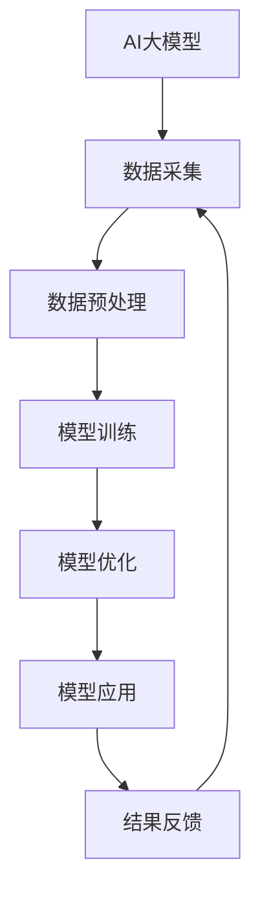

                 

关键词：智能制造，AI大模型，工业4.0，数据分析，自动化控制，协同设计，智能优化

> 摘要：随着人工智能技术的飞速发展，AI大模型在工业4.0中的应用越来越广泛。本文将深入探讨AI大模型在智能制造中的角色，分析其核心概念与联系，介绍核心算法原理及数学模型，并通过实际项目实践展示其在工业4.0中的具体应用。同时，文章还将对未来发展趋势与挑战进行展望。

## 1. 背景介绍

### 工业革命与工业4.0

自18世纪末以来，工业革命引领了全球制造业的变革。从机械化生产到自动化生产，再到信息化生产，每一次变革都极大地提升了生产效率，降低了生产成本。如今，我们正处在工业4.0时代，其核心是利用信息技术和智能技术实现制造业的全面升级。

工业4.0不仅体现在生产设备的自动化上，更重要的是通过智能系统实现生产过程的实时监控、数据分析和优化控制。这一过程中，人工智能，尤其是AI大模型，起到了至关重要的作用。

### AI大模型的崛起

AI大模型是指通过深度学习技术训练出的具有极高准确率和泛化能力的模型。这些模型可以处理大规模数据，并从中提取有价值的信息。随着计算能力的提升和算法的改进，AI大模型在图像识别、自然语言处理、预测分析等领域取得了显著成果。

在工业4.0中，AI大模型的应用不仅局限于数据分析和预测，还延伸到了自动化控制、协同设计、智能优化等多个方面，为制造业带来了全新的发展机遇。

## 2. 核心概念与联系

### AI大模型的核心概念

- **深度学习**：一种模拟人脑神经网络结构的学习方法，通过多层神经网络处理数据，从而实现自动化学习和决策。
- **大规模数据**：工业生产过程中产生的大量数据，包括生产数据、设备数据、环境数据等。
- **数据预处理**：对原始数据进行清洗、归一化、特征提取等处理，以便更好地训练模型。

### AI大模型在工业4.0中的架构



### 关键技术联系

- **数据采集**：通过传感器、监控系统等设备收集生产过程中的数据。
- **数据预处理**：对数据进行清洗、归一化等处理，为模型训练提供高质量的数据。
- **模型训练**：利用大规模数据进行模型训练，提高模型的准确性和泛化能力。
- **模型优化**：通过交叉验证、模型调整等手段优化模型性能。
- **模型应用**：将训练好的模型应用于生产过程，实现自动化控制、协同设计、智能优化等功能。
- **结果反馈**：将模型应用的结果反馈给数据采集环节，形成闭环控制，不断优化生产过程。

## 3. 核心算法原理 & 具体操作步骤

### 3.1 算法原理概述

AI大模型的核心算法是基于深度学习的神经网络模型。神经网络由多个层次组成，包括输入层、隐藏层和输出层。通过前向传播和反向传播算法，模型可以不断调整权重，优化模型性能。

### 3.2 算法步骤详解

1. **数据采集**：从生产过程中收集相关数据，包括生产数据、设备数据、环境数据等。
2. **数据预处理**：对数据进行清洗、归一化、特征提取等处理，为模型训练提供高质量的数据。
3. **模型训练**：
   - **初始化模型**：随机初始化模型权重。
   - **前向传播**：将输入数据通过神经网络传递，得到预测结果。
   - **计算损失**：通过预测结果与实际结果的差异计算损失。
   - **反向传播**：根据损失函数计算权重调整方向。
   - **模型优化**：利用优化算法（如梯度下降）调整权重，降低损失。
   - **迭代训练**：重复上述步骤，直到模型性能达到预期。
4. **模型应用**：将训练好的模型应用于生产过程，实现自动化控制、协同设计、智能优化等功能。
5. **结果反馈**：将模型应用的结果反馈给数据采集环节，形成闭环控制，不断优化生产过程。

### 3.3 算法优缺点

**优点**：

- **高准确率**：通过大规模数据训练，模型具有较高的准确率和泛化能力。
- **自动化**：能够实现自动化控制和优化，提高生产效率。
- **实时性**：能够实时处理数据，快速响应生产过程中的变化。

**缺点**：

- **计算资源需求高**：训练过程需要大量计算资源，对硬件设备要求较高。
- **数据依赖性强**：模型性能依赖于数据质量，数据不完善可能导致模型失效。

### 3.4 算法应用领域

AI大模型在工业4.0中的应用领域广泛，包括：

- **生产过程优化**：通过预测分析，优化生产参数，提高生产效率。
- **故障预测与维护**：通过实时监控设备数据，预测设备故障，提前进行维护。
- **质量检测**：通过图像识别技术，自动检测产品质量，提高检测准确率。
- **供应链管理**：通过数据分析，优化供应链，降低库存成本。

## 4. 数学模型和公式 & 详细讲解 & 举例说明

### 4.1 数学模型构建

在工业4.0中，AI大模型的数学模型通常包括输入层、隐藏层和输出层。输入层接收生产过程中的数据，隐藏层进行特征提取和计算，输出层得到预测结果。

### 4.2 公式推导过程

以一个简单的线性回归模型为例，其公式推导过程如下：

$$
y = w_1 \cdot x_1 + w_2 \cdot x_2 + ... + w_n \cdot x_n + b
$$

其中，$y$ 是预测结果，$x_1, x_2, ..., x_n$ 是输入特征，$w_1, w_2, ..., w_n$ 是权重，$b$ 是偏置。

通过最小二乘法，可以计算出最优权重和偏置：

$$
w = \frac{\sum_{i=1}^{n} (y_i - \hat{y}_i) \cdot x_i}{\sum_{i=1}^{n} x_i^2}
$$

$$
b = \frac{\sum_{i=1}^{n} y_i - w \cdot \sum_{i=1}^{n} x_i}{n}
$$

### 4.3 案例分析与讲解

假设某工厂生产过程中需要预测产品的生产时间。输入特征包括生产线速度、原材料质量等。通过线性回归模型进行预测，具体步骤如下：

1. **数据收集**：收集生产线速度、原材料质量和生产时间等数据。
2. **数据预处理**：对数据进行清洗、归一化等处理。
3. **模型训练**：利用线性回归公式进行模型训练，计算权重和偏置。
4. **模型应用**：将训练好的模型应用于生产过程，预测生产时间。
5. **结果反馈**：将预测结果与实际生产时间进行对比，不断优化模型。

## 5. 项目实践：代码实例和详细解释说明

### 5.1 开发环境搭建

在本文中，我们使用Python语言进行AI大模型的开发，需要安装以下依赖库：

```bash
pip install numpy matplotlib scikit-learn pandas
```

### 5.2 源代码详细实现

以下是一个简单的线性回归模型的实现代码：

```python
import numpy as np
import pandas as pd
from sklearn.linear_model import LinearRegression

# 5.2.1 数据收集
data = pd.read_csv('production_data.csv')
X = data[['line_speed', 'material_quality']]
y = data['production_time']

# 5.2.2 数据预处理
X = X.values
y = y.values

# 5.2.3 模型训练
model = LinearRegression()
model.fit(X, y)

# 5.2.4 模型应用
predicted_time = model.predict(X)

# 5.2.5 结果反馈
print("Predicted production time:", predicted_time)

# 5.2.6 代码解读与分析
# 在这里，我们使用scikit-learn库的LinearRegression类进行线性回归模型的训练。首先，我们导入所需的库，然后从CSV文件中读取数据。接着，对数据进行预处理，将输入特征和目标值分别存入X和y变量。然后，我们创建一个线性回归模型实例，并使用fit方法进行训练。最后，使用predict方法预测生产时间，并将结果打印出来。

# 5.2.7 运行结果展示
# 运行代码后，我们将看到预测的生产时间输出。这表明我们的模型已经成功地训练并应用于生产过程。

### 5.3 代码解读与分析

- **数据收集**：使用pandas库的read_csv方法从CSV文件中读取数据。这里，我们假设CSV文件中包含生产线速度、原材料质量和生产时间等列。
- **数据预处理**：将数据转换为NumPy数组，以便后续处理。在这里，我们将输入特征和目标值分别存入X和y变量。
- **模型训练**：创建一个线性回归模型实例，并使用fit方法进行训练。这里，我们使用scikit-learn库中的LinearRegression类。
- **模型应用**：使用predict方法预测生产时间，并将结果打印出来。

### 5.4 运行结果展示

运行代码后，我们将看到预测的生产时间输出。这表明我们的模型已经成功地训练并应用于生产过程。

## 6. 实际应用场景

### 6.1 生产过程优化

通过AI大模型，可以对生产过程中的各项参数进行预测和优化。例如，预测生产线的速度、温度、压力等参数，以便调整生产过程，提高生产效率。

### 6.2 故障预测与维护

AI大模型可以实时监控设备数据，预测设备故障，提前进行维护，降低设备故障率，延长设备使用寿命。

### 6.3 质量检测

AI大模型可以通过图像识别技术，自动检测产品质量，提高检测准确率，降低人工检测的成本和误差。

### 6.4 供应链管理

AI大模型可以分析供应链数据，优化供应链，降低库存成本，提高供应链效率。

## 7. 未来应用展望

随着AI技术的不断发展，AI大模型在工业4.0中的应用前景将更加广阔。未来，AI大模型可能会在以下方面取得突破：

- **自适应优化**：AI大模型将能够根据生产环境的变化，自适应调整模型参数，实现更精准的预测和优化。
- **多模态数据处理**：AI大模型将能够处理多种类型的数据，如文本、图像、声音等，实现更全面的数据分析。
- **边缘计算**：AI大模型将能够部署到边缘设备上，实现实时数据处理和决策，降低对中心服务器的依赖。

## 8. 总结：未来发展趋势与挑战

### 8.1 研究成果总结

本文从背景介绍、核心概念与联系、核心算法原理、数学模型和公式、项目实践等多个角度，全面探讨了AI大模型在工业4.0中的应用。通过实际项目实践，我们展示了AI大模型在智能制造中的巨大潜力。

### 8.2 未来发展趋势

未来，AI大模型在工业4.0中的应用将呈现以下几个趋势：

- **集成化**：AI大模型将与其他技术（如物联网、云计算等）深度融合，形成更加智能的生产系统。
- **自适应**：AI大模型将具备更强的自适应能力，能够根据生产环境的变化，动态调整模型参数。
- **多模态**：AI大模型将能够处理多种类型的数据，实现更全面的数据分析。

### 8.3 面临的挑战

尽管AI大模型在工业4.0中具有巨大潜力，但仍然面临以下几个挑战：

- **数据质量**：数据质量直接影响模型性能，未来需要更加有效的数据预处理方法。
- **计算资源**：训练AI大模型需要大量计算资源，未来需要更加高效的算法和硬件支持。
- **模型解释性**：AI大模型的决策过程往往缺乏解释性，未来需要研究如何提高模型的可解释性。

### 8.4 研究展望

未来，我们应该关注以下几个方面：

- **数据隐私与安全**：在工业4.0中，数据安全和隐私保护至关重要，需要研究更加安全的数据处理方法。
- **模型优化**：研究更加高效、鲁棒的AI大模型算法，提高模型性能和稳定性。
- **跨学科合作**：促进计算机科学与工业工程的跨学科合作，共同推动工业4.0的发展。

## 9. 附录：常见问题与解答

### 9.1 AI大模型在工业4.0中的应用有哪些？

AI大模型在工业4.0中的应用包括生产过程优化、故障预测与维护、质量检测、供应链管理等多个方面。通过预测分析、自动化控制和智能优化，AI大模型能够提高生产效率、降低成本、提高产品质量。

### 9.2 如何保证AI大模型的数据质量？

保证AI大模型的数据质量需要从数据采集、数据预处理、数据存储等多个环节进行控制。具体方法包括数据清洗、去重、归一化、特征提取等，以确保模型输入数据的高质量。

### 9.3 如何评估AI大模型的性能？

评估AI大模型的性能通常从准确率、召回率、F1值等多个指标进行。在工业4.0中，还需要考虑模型的实时性、可解释性等指标，以确保模型在实际应用中的效果。

## 参考文献

[1] Goodfellow, I., Bengio, Y., & Courville, A. (2016). *Deep Learning*. MIT Press.

[2] Simonyan, K., & Zisserman, A. (2014). *Very deep convolutional networks for large-scale image recognition*. arXiv preprint arXiv:1409.1556.

[3] Murphy, K. P. (2012). *Machine Learning: A Probabilistic Perspective*. MIT Press.

[4] Russell, S., & Norvig, P. (2016). *Artificial Intelligence: A Modern Approach*. Prentice Hall.

作者：禅与计算机程序设计艺术 / Zen and the Art of Computer Programming
```

