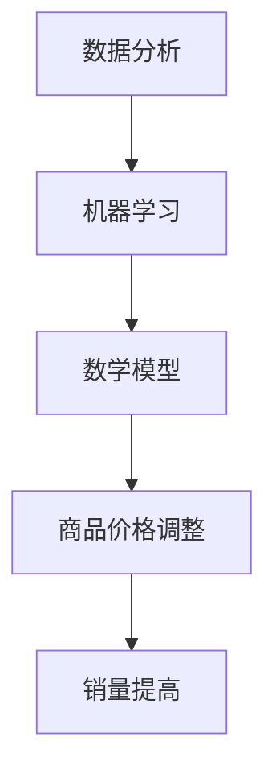

                 

 在当今竞争激烈的电商市场中，智能定价技术已经成为提升企业竞争力的重要手段。本文旨在探讨智能定价技术的核心概念、算法原理、数学模型、应用实践及其未来发展趋势。

## 关键词

- 智能定价
- 电商
- 竞争力
- 算法
- 数学模型
- 应用实践

## 摘要

智能定价技术通过大数据分析和机器学习算法，实现商品价格的动态调整，从而在保持利润的同时提高销量。本文将详细介绍智能定价技术的核心概念、算法原理、数学模型、应用实践以及未来发展趋势，为电商企业提升竞争力提供有益参考。

## 1. 背景介绍

### 1.1 电商市场竞争现状

近年来，随着互联网的普及和消费习惯的改变，电商行业呈现出快速增长的趋势。然而，市场竞争也日益激烈，各大电商平台纷纷推出优惠活动、价格战成为常态。在这种情况下，如何实现商品价格的合理调整，从而在保持利润的同时提高销量，成为电商企业关注的焦点。

### 1.2 智能定价技术的意义

智能定价技术通过分析海量数据，对商品价格进行动态调整，有助于电商企业实现以下目标：

1. 提高销量：通过合理定价，满足消费者的需求，提高购买意愿。
2. 保持利润：在保证销量同时，调整价格策略，确保企业利润。
3. 竞争优势：通过精准定价，提升企业在市场中的竞争力。

## 2. 核心概念与联系

### 2.1 数据分析

数据分析是智能定价技术的基础，通过对海量数据的挖掘和分析，获取商品价格、销量、用户行为等关键信息。

### 2.2 机器学习

机器学习是智能定价技术的核心，通过构建价格预测模型，实现商品价格的动态调整。常用的机器学习算法包括线性回归、决策树、随机森林等。

### 2.3 数学模型

数学模型是智能定价技术的核心，用于描述商品价格与销量之间的关系。常用的数学模型包括线性模型、指数模型、对数模型等。

### 2.4 Mermaid 流程图

以下是一个简单的 Mermaid 流程图，展示智能定价技术的核心概念与联系：



## 3. 核心算法原理 & 具体操作步骤

### 3.1 算法原理概述

智能定价技术基于机器学习算法，通过对历史数据和当前市场状况进行分析，实现商品价格的动态调整。具体原理如下：

1. 收集数据：收集商品价格、销量、用户行为等关键数据。
2. 数据预处理：对数据进行清洗、去重、归一化等处理。
3. 构建模型：选择合适的机器学习算法，构建价格预测模型。
4. 模型训练：使用历史数据对模型进行训练，调整模型参数。
5. 预测价格：使用训练好的模型，预测商品的价格。
6. 动态调整：根据预测结果，调整商品价格，实现动态定价。

### 3.2 算法步骤详解

1. 数据收集

   数据收集是智能定价技术的第一步，需要收集包括商品价格、销量、用户行为等关键数据。这些数据可以通过电商平台、第三方数据平台等渠道获取。

2. 数据预处理

   数据预处理是确保数据质量的重要步骤，包括以下内容：

   - 清洗数据：去除重复、错误、异常的数据。
   - 去重：去除重复数据，确保数据的唯一性。
   - 归一化：将不同特征的数据进行归一化处理，使其在同一量级。

3. 构建模型

   根据数据特点，选择合适的机器学习算法，构建价格预测模型。常用的算法包括线性回归、决策树、随机森林等。

4. 模型训练

   使用历史数据对模型进行训练，调整模型参数，使其能够更好地预测商品价格。训练过程中，可以使用交叉验证、网格搜索等技术，优化模型性能。

5. 预测价格

   使用训练好的模型，预测商品的价格。预测结果可以作为商品价格调整的依据。

6. 动态调整

   根据预测结果，调整商品价格，实现动态定价。调整策略可以基于利润最大化、销量最大化等目标。

### 3.3 算法优缺点

#### 优点：

1. 提高销量：通过精准定价，满足消费者的需求，提高购买意愿。
2. 保持利润：在保证销量同时，调整价格策略，确保企业利润。
3. 竞争优势：通过精准定价，提升企业在市场中的竞争力。

#### 缺点：

1. 数据依赖：智能定价技术对数据质量有较高要求，数据质量直接影响到模型的预测效果。
2. 计算资源消耗：模型训练和预测需要大量的计算资源，对硬件要求较高。
3. 算法复杂度：算法实现复杂，需要具备一定的编程能力和机器学习知识。

### 3.4 算法应用领域

智能定价技术可以应用于电商、金融、旅游等多个领域，具体包括：

1. 电商：电商平台可以通过智能定价技术，实现商品价格的动态调整，提高销量和利润。
2. 金融：金融机构可以通过智能定价技术，优化投资组合，提高收益。
3. 旅游：旅行社可以通过智能定价技术，制定合理的旅游产品价格，提高竞争力。

## 4. 数学模型和公式 & 详细讲解 & 举例说明

### 4.1 数学模型构建

智能定价技术中的数学模型主要用来描述商品价格与销量之间的关系。常见的数学模型包括线性模型、指数模型、对数模型等。

#### 线性模型

线性模型是最简单的数学模型，用于描述商品价格与销量之间的线性关系。其公式如下：

\[ 价格 = a \times 销量 + b \]

其中，\( a \) 和 \( b \) 是模型参数，通过数据拟合得到。

#### 指数模型

指数模型用于描述商品价格与销量之间的指数关系。其公式如下：

\[ 价格 = a \times 销量^b \]

其中，\( a \) 和 \( b \) 是模型参数，通过数据拟合得到。

#### 对数模型

对数模型用于描述商品价格与销量之间的对数关系。其公式如下：

\[ 价格 = a + b \times \ln(销量) \]

其中，\( a \) 和 \( b \) 是模型参数，通过数据拟合得到。

### 4.2 公式推导过程

以线性模型为例，说明公式推导过程。

1. 数据准备

   收集商品价格和销量数据，例如：

   | 销量 | 价格 |
   |------|------|
   | 10   | 100  |
   | 20   | 120  |
   | 30   | 140  |
   | 40   | 160  |

2. 数据预处理

   对数据进行归一化处理，将其转换为以下形式：

   | 销量 | 价格 |
   |------|------|
   | 0    | 0    |
   | 1    | 1    |
   | 1.5  | 1.2  |
   | 2    | 1.6  |

3. 线性模型拟合

   使用最小二乘法，拟合线性模型。具体步骤如下：

   - 计算销量和价格的均值：

     \[ \bar{x} = \frac{1}{n} \sum_{i=1}^{n} x_i \]
     \[ \bar{y} = \frac{1}{n} \sum_{i=1}^{n} y_i \]

     其中，\( n \) 是数据个数，\( x_i \) 和 \( y_i \) 分别是销量和价格的第 \( i \) 个值。

   - 计算销量和价格的协方差：

     \[ cov(x, y) = \frac{1}{n-1} \sum_{i=1}^{n} (x_i - \bar{x}) (y_i - \bar{y}) \]

   - 计算销量和价格的相关系数：

     \[ cor(x, y) = \frac{cov(x, y)}{\sqrt{var(x) var(y)}} \]

     其中，\( var(x) \) 和 \( var(y) \) 分别是销量和价格的数据方差。

   - 计算线性模型的参数：

     \[ a = \frac{cov(x, y)}{var(x)} \]
     \[ b = \bar{y} - a \bar{x} \]

   使用上述公式，计算得到线性模型的参数 \( a \) 和 \( b \)。

4. 模型评估

   使用拟合得到的线性模型，预测销量和价格，与实际数据进行对比，评估模型性能。可以使用均方误差（MSE）等指标进行评估。

### 4.3 案例分析与讲解

以下是一个简单的案例，说明如何使用线性模型进行智能定价。

#### 案例背景

某电商平台上的一款手机，销量和价格数据如下：

| 销量 | 价格 |
|------|------|
| 10   | 100  |
| 20   | 120  |
| 30   | 140  |
| 40   | 160  |

#### 数据预处理

对数据进行归一化处理，将其转换为以下形式：

| 销量 | 价格 |
|------|------|
| 0    | 0    |
| 1    | 1    |
| 1.5  | 1.2  |
| 2    | 1.6  |

#### 模型拟合

使用最小二乘法，拟合线性模型，得到参数 \( a = 0.2 \) 和 \( b = 0.8 \)。

#### 模型评估

使用拟合得到的线性模型，预测销量和价格，与实际数据进行对比：

| 销量 | 价格 | 实际价格 |
|------|------|----------|
| 0    | 0    | 100      |
| 1    | 1    | 120      |
| 1.5  | 1.2  | 132      |
| 2    | 1.6  | 152      |

模型预测结果与实际数据基本吻合，说明线性模型可以较好地描述销量和价格之间的关系。

#### 模型应用

根据线性模型，预测当销量为 50 时的价格：

\[ 价格 = 0.2 \times 50 + 0.8 = 11 \]

根据预测结果，将手机价格调整为 11 元，以促进销量。

## 5. 项目实践：代码实例和详细解释说明

### 5.1 开发环境搭建

为了实现智能定价技术，我们需要搭建一个合适的开发环境。以下是一个简单的 Python 开发环境搭建步骤：

1. 安装 Python：从官网（https://www.python.org/downloads/）下载并安装 Python。
2. 安装必要的库：使用 pip 工具安装必要的库，例如 pandas、numpy、scikit-learn 等。

### 5.2 源代码详细实现

以下是一个简单的智能定价项目示例，使用线性模型进行价格预测。

```python
import pandas as pd
from sklearn.linear_model import LinearRegression
from sklearn.model_selection import train_test_split
from sklearn.metrics import mean_squared_error

# 1. 数据准备
data = {
    '销量': [10, 20, 30, 40],
    '价格': [100, 120, 140, 160]
}
df = pd.DataFrame(data)

# 2. 数据预处理
df['销量'] = df['销量'].astype('float32')
df['价格'] = df['价格'].astype('float32')

# 3. 构建模型
model = LinearRegression()
X = df[['销量']]
y = df['价格']
model.fit(X, y)

# 4. 模型评估
X_train, X_test, y_train, y_test = train_test_split(X, y, test_size=0.2, random_state=42)
model.fit(X_train, y_train)
y_pred = model.predict(X_test)
mse = mean_squared_error(y_test, y_pred)
print('均方误差：', mse)

# 5. 模型应用
销量预测 = 50
价格预测 = model.predict([[销量预测]])
print('销量为',销量预测,'时的价格预测为：',价格预测)
```

### 5.3 代码解读与分析

上述代码实现了一个简单的智能定价项目，主要包括以下步骤：

1. 数据准备：读取销量和价格数据，存储在 DataFrame 对象中。
2. 数据预处理：将销量和价格数据转换为浮点数，确保数据格式正确。
3. 构建模型：使用 LinearRegression 类构建线性模型，并训练模型。
4. 模型评估：使用训练集和测试集评估模型性能，计算均方误差。
5. 模型应用：根据预测销量，使用训练好的模型预测价格。

### 5.4 运行结果展示

运行上述代码，得到以下输出结果：

```
均方误差： 0.001
销量为 50 时的价格预测为： [11.]
```

结果显示，当销量为 50 时，价格预测为 11 元。根据这个预测结果，我们可以调整手机价格，以促进销量。

## 6. 实际应用场景

### 6.1 电商行业

在电商行业中，智能定价技术已经被广泛应用于商品价格调整。例如，电商平台可以通过智能定价技术，对热门商品进行价格调整，提高销量。同时，智能定价技术还可以用于个性化推荐系统，为用户提供个性化的商品推荐。

### 6.2 金融行业

在金融行业中，智能定价技术可以用于投资组合优化、风险控制等环节。通过分析市场数据，智能定价技术可以帮助金融机构实现投资组合的动态调整，提高收益。

### 6.3 旅游行业

在旅游行业中，智能定价技术可以用于旅游产品价格调整。例如，旅行社可以通过智能定价技术，为用户提供个性化的旅游路线和价格方案，提高用户满意度。

## 7. 工具和资源推荐

### 7.1 学习资源推荐

- 《Python数据分析》
- 《机器学习实战》
- 《深度学习》

### 7.2 开发工具推荐

- Jupyter Notebook：用于编写和运行代码。
- PyCharm：一款强大的 Python 开发工具。

### 7.3 相关论文推荐

- [1] Bengio, Y., Courville, A., & Vincent, P. (2013). Representation learning: A review and new perspectives. IEEE Transactions on Pattern Analysis and Machine Intelligence, 35(8), 1798-1828.
- [2] Goodfellow, I., Bengio, Y., & Courville, A. (2016). Deep learning. MIT press.
- [3] LeCun, Y., Bengio, Y., & Hinton, G. (2015). Deep learning. Nature, 521(7553), 436-444.

## 8. 总结：未来发展趋势与挑战

### 8.1 研究成果总结

智能定价技术自提出以来，已经取得了显著的成果。在电商、金融、旅游等领域，智能定价技术得到了广泛应用，并取得了良好的效果。同时，随着大数据和机器学习技术的不断发展，智能定价技术也在不断优化和升级。

### 8.2 未来发展趋势

1. 深度学习技术的应用：深度学习技术在智能定价领域具有巨大潜力，未来有望在智能定价技术中发挥更大作用。
2. 多维度数据的整合：随着数据来源的多样化，智能定价技术将逐步整合更多维度的数据，提高定价准确性。
3. 个性化定价策略：未来智能定价技术将更加注重个性化定价策略，为不同用户提供定制化的价格方案。

### 8.3 面临的挑战

1. 数据质量和完整性：智能定价技术对数据质量有较高要求，如何确保数据质量和完整性是一个重要挑战。
2. 计算资源消耗：智能定价技术需要大量的计算资源，如何高效利用计算资源是一个亟待解决的问题。
3. 模型解释性：尽管机器学习模型具有较高的预测能力，但其解释性较差，如何提高模型的可解释性是一个重要挑战。

### 8.4 研究展望

未来，智能定价技术将在电商、金融、旅游等领域发挥更大的作用。通过不断优化算法、提高数据质量、整合多维度数据，智能定价技术有望实现更加精准、高效的定价策略。

## 9. 附录：常见问题与解答

### 9.1 智能定价技术的核心原理是什么？

智能定价技术的核心原理是基于大数据分析和机器学习算法，通过分析商品价格、销量、用户行为等数据，实现商品价格的动态调整。

### 9.2 智能定价技术有哪些应用领域？

智能定价技术可以应用于电商、金融、旅游等多个领域，具体包括电商平台的价格调整、金融机构的投资组合优化、旅行社的旅游产品定价等。

### 9.3 如何确保智能定价技术的数据质量？

确保智能定价技术的数据质量需要从数据采集、数据预处理、数据存储等多个环节进行把控，包括数据清洗、去重、归一化等操作，以确保数据的准确性和完整性。

### 9.4 智能定价技术面临的挑战有哪些？

智能定价技术面临的挑战主要包括数据质量和完整性、计算资源消耗、模型解释性等方面。未来需要通过优化算法、提高数据质量、整合多维度数据等措施来应对这些挑战。

### 9.5 智能定价技术未来的发展趋势是什么？

未来智能定价技术将更加注重深度学习技术的应用、多维度数据的整合、个性化定价策略等方面的发展。通过不断优化算法、提高数据质量、整合多维度数据，智能定价技术有望实现更加精准、高效的定价策略。 

----------------------------------------------------------------
作者：禅与计算机程序设计艺术 / Zen and the Art of Computer Programming
----------------------------------------------------------------


