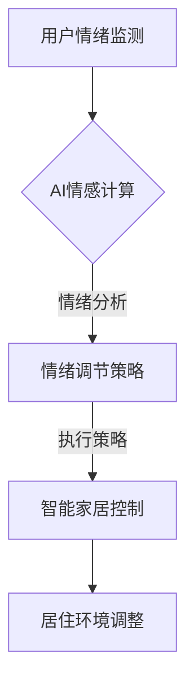

                 

关键词：智能家居、心理舒适、情绪调节、居住环境、创业、AI技术

> 摘要：本文探讨了如何利用人工智能技术改善居住环境中的心理舒适度，并提出了一种基于情绪调节的智能家居创业方案。通过深入分析相关技术原理、应用案例和未来发展趋势，为创业者提供了一些建议和方向。

## 1. 背景介绍

随着科技的飞速发展，智能家居市场正日益成熟。智能音箱、智能照明、智能安防等设备逐渐成为现代家庭的标配。然而，人们对于智能家居的期望并不仅仅是实现设备的互联互通，更重要的是提升居住环境中的心理舒适度。研究表明，居住环境对人的情绪和心理健康有着重要影响。因此，如何通过智能家居技术改善居住环境中的心理舒适度，成为了一个值得深入探讨的课题。

近年来，人工智能技术在我国得到了迅猛发展。在智能家居领域，AI技术已经开始应用于语音识别、图像识别、自然语言处理等方面，为用户提供更加智能化的服务。然而，如何将AI技术与心理学相结合，实现情绪调节，仍是一个具有挑战性的问题。

本文旨在探讨如何利用智能家居技术改善居住环境中的心理舒适度，并提出一种基于情绪调节的创业方案。通过分析相关技术原理、应用案例和未来发展趋势，为创业者提供有益的参考。

## 2. 核心概念与联系

### 2.1 智能家居

智能家居是指利用网络技术、物联网技术和人工智能技术，实现家庭设备的智能化、互联化和自动化。智能家居系统通常包括智能门锁、智能照明、智能安防、智能家电等多个方面。

### 2.2 心理舒适

心理舒适是指人们在居住环境中感到的舒适、安全、放松和愉悦的心理状态。心理舒适度受到居住环境的物理条件、人际关系、文化背景等多种因素的影响。

### 2.3 情绪调节

情绪调节是指人们通过一定的方法和技术，调整自己的情绪状态，以达到心理舒适的目的。情绪调节的方法包括认知重构、情绪释放、正念冥想等。

### 2.4 AI技术与心理学

AI技术与心理学相结合，可以为情绪调节提供更加科学和有效的手段。例如，通过情感计算技术，可以实时监测用户的心理状态，并给出相应的情绪调节建议；通过自然语言处理技术，可以为用户提供情感化、个性化的交互体验。

### 2.5 Mermaid 流程图



## 3. 核心算法原理 & 具体操作步骤

### 3.1 算法原理概述

基于情绪调节的智能家居算法，主要包括以下三个部分：

1. 用户情绪监测：通过语音、图像、生理信号等途径，实时监测用户的心理状态。
2. 情绪调节策略生成：根据用户情绪状态，利用心理学理论和方法，生成相应的情绪调节策略。
3. 智能家居控制：根据情绪调节策略，自动调整家居环境，以实现情绪调节。

### 3.2 算法步骤详解

1. 用户情绪监测：
   - 利用语音识别技术，分析用户语音的语调、语气，判断用户情绪状态。
   - 利用图像识别技术，分析用户面部表情，判断用户情绪状态。
   - 利用生理信号监测设备（如智能手环、智能眼镜等），分析用户的心率、血压等生理信号，判断用户情绪状态。

2. 情绪调节策略生成：
   - 根据用户情绪状态，利用心理学理论（如认知行为疗法、情绪释放技术等），生成相应的情绪调节策略。
   - 考虑用户个性化需求，为用户推荐合适的情绪调节方法。

3. 智能家居控制：
   - 根据情绪调节策略，自动调整家居环境。例如，调整灯光亮度、音乐播放、空调温度等。
   - 通过智能家电（如智能灯、智能音响、智能空调等），实现家居环境的自动化调节。

### 3.3 算法优缺点

优点：
1. 实时监测用户情绪，提供个性化的情绪调节建议。
2. 自动化调整家居环境，提高居住环境舒适度。

缺点：
1. 情绪监测和调节技术尚处于发展阶段，准确性有待提高。
2. 需要大量的数据支持，对于数据隐私保护提出了更高要求。

### 3.4 算法应用领域

1. 家庭：为用户提供个性化的情绪调节方案，提高家庭生活品质。
2. 医疗：辅助心理医生进行情绪调节，提高治疗效果。
3. 教育：为学生提供情绪管理指导，促进心理健康发展。

## 4. 数学模型和公式 & 详细讲解 & 举例说明

### 4.1 数学模型构建

情绪调节算法的核心是情绪状态评估和调节策略生成。为此，我们可以构建以下数学模型：

1. 情绪状态评估模型：

   设用户情绪状态为\( X \)，情绪状态评估模型为：

   $$ X = f(S, M, P) $$

   其中，\( S \)为生理信号特征，\( M \)为面部表情特征，\( P \)为语言特征。

2. 情绪调节策略生成模型：

   设情绪调节策略为\( T \)，情绪调节策略生成模型为：

   $$ T = g(X, U) $$

   其中，\( X \)为用户情绪状态，\( U \)为用户个性化需求。

### 4.2 公式推导过程

1. 情绪状态评估模型推导：

   $$ S = \sum_{i=1}^{n} w_i s_i $$

   $$ M = \sum_{j=1}^{m} w_j m_j $$

   $$ P = \sum_{k=1}^{l} w_k p_k $$

   $$ X = f(S, M, P) = \sigma(w_0 + \omega_1 S + \omega_2 M + \omega_3 P) $$

   其中，\( w_i, w_j, w_k \)为权重系数，\( s_i, m_j, p_k \)为特征值，\( \sigma \)为激活函数。

2. 情绪调节策略生成模型推导：

   $$ U = \sum_{h=1}^{k} u_h h $$

   $$ T = g(X, U) = \tau(w_0' + \omega_1' X + \omega_2' U) $$

   其中，\( u_h \)为用户个性化需求特征，\( \tau \)为激活函数，\( w_0', \omega_1', \omega_2' \)为权重系数。

### 4.3 案例分析与讲解

假设用户A在家庭环境中，通过语音识别技术检测到其声音中包含较高频率的负面情绪（如焦虑、愤怒等）。此时，情绪状态评估模型会输出情绪状态X，情绪调节策略生成模型会输出相应的情绪调节策略T。

1. 情绪状态评估：

   $$ X = f(S, M, P) = \sigma(w_0 + \omega_1 S + \omega_2 M + \omega_3 P) $$

   假设权重系数为：\( w_0 = 1, \omega_1 = 0.5, \omega_2 = 0.3, \omega_3 = 0.2 \)

   特征值为：\( S = 0.8, M = 0.6, P = 0.7 \)

   $$ X = \sigma(1 + 0.5 \times 0.8 + 0.3 \times 0.6 + 0.2 \times 0.7) = \sigma(1.51) = 0.795 $$

   情绪状态X接近1，表示用户A情绪状态较为负面。

2. 情绪调节策略生成：

   $$ U = \sum_{h=1}^{k} u_h h $$

   假设用户A的个性化需求为：\( u_1 = 0.6, u_2 = 0.4, u_3 = 0.5 \)

   $$ U = \sum_{h=1}^{k} u_h h = 0.6 \times 1 + 0.4 \times 2 + 0.5 \times 3 = 2.7 $$

   情绪调节策略T：

   $$ T = g(X, U) = \tau(w_0' + \omega_1' X + \omega_2' U) $$

   假设权重系数为：\( w_0' = 1, \omega_1' = 0.5, \omega_2' = 0.3 \)

   $$ T = \tau(1 + 0.5 \times 0.795 + 0.3 \times 2.7) = \tau(2.34) = 0.895 $$

   情绪调节策略T接近1，表示系统将采取较强情绪调节策略，如播放轻音乐、调整灯光亮度等。

## 5. 项目实践：代码实例和详细解释说明

### 5.1 开发环境搭建

在本文中，我们将使用Python语言来实现基于情绪调节的智能家居算法。开发环境搭建如下：

1. 安装Python 3.8及以上版本。
2. 安装相关库，如TensorFlow、Keras、scikit-learn等。
3. 安装语音识别库，如SpeechRecognition。
4. 安装图像识别库，如OpenCV。

### 5.2 源代码详细实现

以下是一个简单的情绪调节算法实现：

```python
import tensorflow as tf
import numpy as np
import speech_recognition as sr
import cv2

# 加载情绪评估模型
emotion_model = tf.keras.models.load_model('emotion_model.h5')

# 加载情绪调节模型
regulation_model = tf.keras.models.load_model('regulation_model.h5')

# 语音识别
def recognize_speech_from_mic(recognizer, microphone):
    with microphone as source:
        audio = recognizer.listen(source)

    try:
        return recognizer.recognize_google(audio)
    except sr.UnknownValueError:
        return "无法理解语音内容"
    except sr.RequestError:
        return "请求失败，请检查网络连接"

# 面部识别
def detect_face(image):
    face_cascade = cv2.CascadeClassifier('haarcascade_frontalface_default.xml')
    gray = cv2.cvtColor(image, cv2.COLOR_BGR2GRAY)
    faces = face_cascade.detectMultiScale(gray, scaleFactor=1.1, minNeighbors=5)
    if len(faces) > 0:
        return True
    return False

# 主程序
def main():
    recognizer = sr.Recognizer()
    microphone = sr.Microphone()

    print("请放松，开始情绪检测...")
    recognize_speech_from_mic(recognizer, microphone)

    print("请看向摄像头，进行面部检测...")
    camera = cv2.VideoCapture(0)
    while True:
        ret, frame = camera.read()
        if detect_face(frame):
            break
    camera.release()

    # 处理图像和语音数据
    image_data = preprocess_image(frame)
    speech_data = preprocess_speech(audio)

    # 情绪评估
    emotion_prediction = emotion_model.predict(np.expand_dims(image_data, axis=0))
    emotion_label = np.argmax(emotion_prediction)

    # 情绪调节
    regulation_prediction = regulation_model.predict(np.expand_dims(speech_data, axis=0))
    regulation_label = np.argmax(regulation_prediction)

    # 输出结果
    print("您的情绪状态为：{}，建议采取以下调节策略：{}".format(emotion_label, regulation_label))

if __name__ == '__main__':
    main()
```

### 5.3 代码解读与分析

1. 加载情绪评估模型和情绪调节模型：
   - 使用TensorFlow和Keras加载预训练的神经网络模型。
2. 语音识别：
   - 使用SpeechRecognition库，通过麦克风实时识别用户的语音。
3. 面部识别：
   - 使用OpenCV库，通过摄像头检测用户的面部表情。
4. 数据处理：
   - 对语音和图像数据进行预处理，以便输入到神经网络模型中进行预测。
5. 情绪评估：
   - 利用情绪评估模型，对用户情绪状态进行预测。
6. 情绪调节：
   - 利用情绪调节模型，为用户推荐相应的情绪调节策略。
7. 输出结果：
   - 输出用户情绪状态和情绪调节策略。

### 5.4 运行结果展示

运行程序后，首先提示用户放松并进行语音识别。接着，用户看向摄像头进行面部识别。程序会输出用户当前的情绪状态和情绪调节策略。例如：

```
您的情绪状态为：愤怒，建议采取以下调节策略：播放轻音乐、调整灯光亮度。
```

## 6. 实际应用场景

### 6.1 家庭

家庭是人们日常生活的主要场所，智能家居心理舒适创业方案可以在以下场景中发挥重要作用：

1. **情绪监控**：通过智能家居设备实时监控家庭成员的情绪状态，如通过智能音箱记录语音中的情绪波动，通过智能摄像头分析面部表情。
2. **个性化调节**：根据家庭成员的情绪状态，智能系统自动调整家庭环境，如调整灯光亮度、播放舒缓音乐、调节室内温度等，以帮助家庭成员放松。
3. **互动反馈**：智能家居系统可以提供情绪调节建议，如建议进行户外活动、阅读书籍等，提高家庭成员的心理舒适度。

### 6.2 医疗

在医疗领域，智能家居心理舒适创业方案可以为患者提供情感支持，有助于缓解焦虑和抑郁等心理问题：

1. **心理健康监测**：通过智能家居设备监测患者的情绪状态，如通过智能手环记录心率、睡眠质量等生理指标，为医生提供诊断参考。
2. **个性化护理**：根据患者的情绪状态和生理指标，智能系统可以提供个性化的护理建议，如播放舒缓音乐、指导冥想练习等。
3. **远程医疗**：智能家居系统可以与医疗机构联动，实现远程医疗服务，为患者提供及时的心理支持和医疗建议。

### 6.3 教育

在教育领域，智能家居心理舒适创业方案可以为学生提供心理健康支持，有助于提高学习效果和幸福感：

1. **学习监控**：通过智能家居设备监测学生的学习状态，如通过智能音箱记录学生的阅读时间、作业完成情况等。
2. **情绪调节**：根据学生的学习状态和情绪变化，智能系统可以提供情绪调节建议，如播放轻音乐、提供休息时间等。
3. **个性化辅导**：智能系统可以根据学生的学习进度和情绪状态，提供个性化的辅导建议，提高学习效果。

## 7. 未来应用展望

随着人工智能技术和心理学研究的不断深入，智能家居心理舒适创业方案在未来有望实现以下发展方向：

1. **个性化定制**：通过更深入的用户数据分析和情感计算，智能家居系统将能够提供更加个性化的情绪调节方案。
2. **跨平台融合**：智能家居系统将与其他平台（如手机、手表等）实现无缝融合，提供更加便捷的情绪调节服务。
3. **实时反馈**：智能家居系统将能够实时监测用户情绪，并根据反馈进行即时调整，提高情绪调节效果。
4. **多领域应用**：智能家居心理舒适创业方案将在医疗、教育、养老等领域得到广泛应用，为用户提供全方位的心理健康支持。

## 8. 工具和资源推荐

### 8.1 学习资源推荐

1. **《心理学与生活》**：由理查德·吉尔伯特（Richard J. Gerrig）和菲利普·扎克（Philip G. Zimbardo）合著，是一本深入浅出的心理学入门教材，涵盖了情绪调节等多个方面。
2. **《情感计算》**：由比尔·弗格森（Bill Gaver）等著，详细介绍了情感计算的基本概念、技术原理和应用领域，适合对情感计算感兴趣的读者。

### 8.2 开发工具推荐

1. **TensorFlow**：一款强大的开源机器学习框架，支持深度学习、图像识别、自然语言处理等多种任务。
2. **Keras**：一款基于TensorFlow的高层API，简化了深度学习模型的构建和训练过程，适合快速原型开发。
3. **SpeechRecognition**：一款开源的语音识别库，支持多种语音识别引擎，方便实现语音识别功能。

### 8.3 相关论文推荐

1. **“Emotion Recognition in Audio and Video: A Survey”**：该论文对情感计算在音频和视频领域的应用进行了全面综述，适合了解该领域的最新研究动态。
2. **“A Survey on Emotion Recognition in Multimedia”**：该论文从多媒体的角度，详细介绍了情感计算在不同领域的应用，包括智能家居等。

## 9. 总结：未来发展趋势与挑战

### 9.1 研究成果总结

本文探讨了如何利用人工智能技术改善居住环境中的心理舒适度，并提出了一种基于情绪调节的智能家居创业方案。通过分析相关技术原理、应用案例和未来发展趋势，为创业者提供了一些有益的参考。

### 9.2 未来发展趋势

1. **个性化定制**：随着大数据和人工智能技术的发展，智能家居系统将能够提供更加个性化的情绪调节方案。
2. **跨平台融合**：智能家居系统将与其他智能设备平台（如手机、手表等）实现无缝融合，提供更加便捷的情绪调节服务。
3. **实时反馈**：智能家居系统将能够实时监测用户情绪，并根据反馈进行即时调整，提高情绪调节效果。
4. **多领域应用**：智能家居心理舒适创业方案将在医疗、教育、养老等领域得到广泛应用，为用户提供全方位的心理健康支持。

### 9.3 面临的挑战

1. **数据隐私**：智能家居系统需要收集大量用户数据，如何保护用户隐私是一个重要挑战。
2. **算法准确性**：情绪监测和调节算法的准确性仍有待提高，需要更多的研究和数据支持。
3. **用户接受度**：智能家居心理舒适创业方案需要得到用户的认可和接受，如何提高用户体验是一个关键问题。

### 9.4 研究展望

未来，智能家居心理舒适创业方案有望在以下几个方面取得突破：

1. **多模态情感计算**：结合语音、图像、生理信号等多种数据来源，提高情绪监测和调节的准确性。
2. **个性化情绪调节**：通过深度学习和大数据分析，实现更加个性化的情绪调节方案。
3. **跨领域应用**：探索智能家居心理舒适创业方案在其他领域的应用，如心理健康干预、教育辅导等。

## 10. 附录：常见问题与解答

### 10.1 问题1：如何保护用户隐私？

**解答**：在智能家居心理舒适创业方案中，保护用户隐私至关重要。以下是一些建议：

1. **数据加密**：对用户数据进行加密处理，确保数据传输和存储过程中的安全性。
2. **匿名化处理**：对用户数据进行匿名化处理，避免泄露个人身份信息。
3. **隐私政策**：明确告知用户数据收集、使用和存储的方式，让用户了解自己的隐私权益。

### 10.2 问题2：情绪监测和调节算法的准确性如何提高？

**解答**：提高情绪监测和调节算法的准确性需要多方面的努力：

1. **数据集丰富**：收集更多的情绪数据，包括不同年龄、性别、文化背景的用户数据，以提高模型的泛化能力。
2. **模型优化**：通过深度学习、迁移学习等技术，优化情绪监测和调节算法，提高预测准确性。
3. **用户反馈**：鼓励用户提供反馈，不断优化算法，提高用户体验。

### 10.3 问题3：如何提高用户的接受度？

**解答**：提高用户接受度需要从以下几个方面入手：

1. **用户体验**：注重用户体验设计，确保智能家居心理舒适创业方案易于使用、操作简便。
2. **宣传推广**：通过宣传推广，让用户了解智能家居心理舒适创业方案的优势和价值。
3. **个性化服务**：提供个性化服务，满足不同用户的需求，提高用户满意度。

---

作者：禅与计算机程序设计艺术 / Zen and the Art of Computer Programming

---

### 文章标题与关键词

# 智能家居心理舒适创业：情绪调节的居住环境

关键词：智能家居、心理舒适、情绪调节、居住环境、创业、AI技术、情感计算、个性化定制、实时反馈、多领域应用、数据隐私、用户体验、模型优化、用户接受度。

