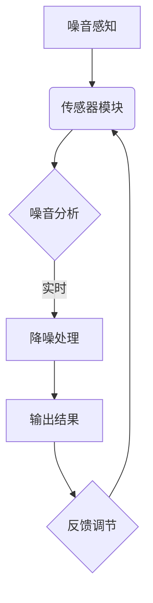

                 

关键词：智能噪音消除，居家环境，创业，算法，应用场景，未来发展

> 摘要：随着科技的发展，智能居家噪音消除技术逐渐走入人们的生活。本文从创业的角度出发，探讨了智能噪音消除技术的核心概念、算法原理、数学模型、项目实践及其应用场景，并对未来发展趋势进行了展望。

## 1. 背景介绍

在现代社会，噪音污染已经成为一种普遍存在的环境问题。尤其在城市中，交通、工业和日常生活噪音对人们的健康和生活质量造成了严重影响。噪音不仅影响人们的睡眠质量和心理健康，还会导致听力损伤。因此，如何有效地消除噪音，营造一个宁静的生活环境，成为了人们关注的焦点。

智能居家噪音消除技术正是为了解决这一问题而诞生。通过利用现代计算机技术和人工智能算法，智能噪音消除系统能够实时监测环境噪音，并自动调整处理策略，实现有效降噪。这种技术不仅提高了人们的生活质量，还为智能家居市场带来了新的发展机遇。

### 1.1 市场需求分析

根据相关调查数据显示，全球噪音污染问题日益严重，人们对噪音消除技术的需求不断增加。特别是在城市中，居民对智能居家噪音消除产品的关注度逐年提升。以下是对市场需求的分析：

- **城市居民需求**：随着城市化进程的加快，城市噪音污染问题愈发突出，居民对智能噪音消除技术的需求强烈。
- **噪音敏感人群**：如老年人、孕妇、儿童等，对噪音尤为敏感，他们更需要一个安静的生活环境。
- **房地产开发商**：为了提升楼盘的市场竞争力，房地产开发商开始将智能噪音消除技术作为一项重要卖点。
- **智能家居市场**：智能居家噪音消除技术是智能家居的重要组成部分，随着智能家居市场的快速发展，噪音消除技术市场需求也将持续增长。

### 1.2 技术发展趋势

智能居家噪音消除技术发展迅速，主要体现在以下几个方面：

- **算法优化**：随着人工智能算法的不断进步，噪音消除算法的准确性和效率不断提高。
- **硬件升级**：随着传感器技术和音频处理技术的进步，噪音消除设备的功能和性能得到了显著提升。
- **集成应用**：智能噪音消除技术开始与其他智能家居设备集成，实现更加智能化的家居环境。
- **个性化定制**：通过大数据和机器学习技术，智能噪音消除系统能够根据用户需求进行个性化调整。

## 2. 核心概念与联系

### 2.1 噪音消除的核心概念

在探讨智能噪音消除技术之前，我们需要了解一些核心概念：

- **噪音**：噪音是指那些干扰人们正常生活、工作和休息的声音。噪音的强度通常用分贝（dB）来衡量。
- **噪音源**：噪音的来源可以是自然界（如风声、雨声）或人为活动（如交通、工业、家用电器等）。
- **降噪**：降噪是指通过物理或电子手段减少噪音的传播和影响。

### 2.2 噪音消除与智能家居的联系

智能噪音消除技术是智能家居系统的重要组成部分，其与智能家居的其他模块（如灯光控制、温度调节、安防监控等）密切相关。具体而言：

- **联动控制**：智能噪音消除系统可以与其他智能家居设备联动，实现一键式智能控制。
- **环境感知**：通过传感器技术，智能噪音消除系统可以实时感知环境噪音，并根据噪音变化自动调整降噪策略。
- **个性化定制**：用户可以通过智能家居系统定制个性化的噪音消除方案，提升生活质量。

### 2.3 Mermaid 流程图

为了更好地展示噪音消除技术的核心概念和架构，以下是一个简化的 Mermaid 流程图：



在这个流程图中，传感器模块负责采集环境噪音数据，噪音分析模块对噪音进行实时处理，降噪处理模块根据分析结果进行噪音消除，输出结果模块将降噪后的声音输出，反馈调节模块则根据输出结果对系统进行动态调整。

## 3. 核心算法原理 & 具体操作步骤

### 3.1 算法原理概述

智能噪音消除技术主要依赖于以下几个核心算法：

- **频谱分析**：通过分析噪音的频谱特征，识别噪音的主要成分和频率范围。
- **滤波器设计**：利用滤波器技术，对噪音进行过滤和消除。
- **深度学习**：通过机器学习和深度学习技术，实现对噪音的智能识别和分类。

### 3.2 算法步骤详解

智能噪音消除算法的具体操作步骤如下：

1. **噪音采集**：通过麦克风等传感器设备，采集环境噪音数据。
2. **噪音预处理**：对采集到的噪音数据进行滤波和去噪处理，提高数据质量。
3. **频谱分析**：对预处理后的噪音数据进行分析，提取频谱特征。
4. **滤波器设计**：根据频谱分析结果，设计滤波器对噪音进行过滤。
5. **降噪处理**：利用滤波器对噪音进行消除，输出降噪后的声音。
6. **反馈调节**：根据降噪后的声音效果，对系统进行动态调整。

### 3.3 算法优缺点

#### 优点

- **实时性**：智能噪音消除算法能够实时监测和处理环境噪音，提高生活品质。
- **个性化**：通过机器学习技术，算法可以根据用户需求进行个性化调整。
- **高效性**：现代算法和硬件技术的进步，使得噪音消除效率显著提升。

#### 缺点

- **成本高**：智能噪音消除系统的开发和维护成本较高，对创业者来说是一个挑战。
- **适用范围有限**：在某些特殊环境下（如极端噪音环境），算法的降噪效果可能不理想。

### 3.4 算法应用领域

智能噪音消除算法的应用领域广泛，包括但不限于以下几个方面：

- **居家环境**：为家庭提供安静的居住环境，提高生活质量。
- **办公环境**：为办公室提供良好的工作环境，提升工作效率。
- **医疗环境**：为医院病房提供安静的休息环境，帮助患者恢复健康。
- **公共场合**：如机场、火车站、图书馆等，为人们提供安静的空间。

## 4. 数学模型和公式 & 详细讲解 & 举例说明

### 4.1 数学模型构建

在智能噪音消除技术中，常用的数学模型包括频谱分析模型、滤波器模型和深度学习模型。

#### 频谱分析模型

频谱分析是噪音消除技术的基础，其核心公式如下：

\[ X(f) = \sum_{n=-\infty}^{\infty} x(n) e^{-j 2 \pi f n} \]

其中，\( X(f) \) 表示频谱，\( x(n) \) 表示时域信号，\( f \) 表示频率。

#### 滤波器模型

滤波器模型用于对噪音进行过滤和消除，常用的滤波器包括低通滤波器、高通滤波器和带通滤波器。以下是一个低通滤波器的公式：

\[ h(n) = \frac{1}{\sqrt{2 \pi}} \sum_{k=-\infty}^{\infty} \frac{1}{k!} e^{-j n k} \]

#### 深度学习模型

深度学习模型主要用于噪音的智能识别和分类，常见的模型包括卷积神经网络（CNN）和循环神经网络（RNN）。以下是一个简单的卷积神经网络模型：

\[ y = f(z) \]
\[ z = W \cdot x + b \]
\[ x = \text{input} \]
\[ W, b = \text{parameters} \]
\[ f = \text{activation function} \]

### 4.2 公式推导过程

#### 频谱分析公式的推导

频谱分析公式可以从傅里叶变换的基本原理推导得出。傅里叶变换是一种将时域信号转换为频域信号的方法，其基本公式如下：

\[ X(f) = \int_{-\infty}^{\infty} x(t) e^{-j 2 \pi f t} dt \]

通过对时域信号 \( x(t) \) 的积分，我们得到了频域信号 \( X(f) \)。

#### 滤波器公式的推导

滤波器公式可以从概率论和随机过程理论推导得出。在噪声消除过程中，我们需要根据噪音的频谱特征设计合适的滤波器，以过滤和消除噪音。

#### 深度学习公式的推导

深度学习公式可以从神经网络的基本原理推导得出。神经网络是一种模拟生物神经系统的计算模型，其基本公式如下：

\[ y = f(z) \]
\[ z = W \cdot x + b \]

其中，\( y \) 表示输出，\( z \) 表示中间层输出，\( x \) 表示输入，\( W \) 表示权重，\( b \) 表示偏置，\( f \) 表示激活函数。

### 4.3 案例分析与讲解

以下是一个简单的频谱分析案例：

假设我们有一个时域信号 \( x(t) = 2 \sin(2 \pi f_0 t) \)，其中 \( f_0 \) 是信号的频率。

1. **时域信号**：\( x(t) = 2 \sin(2 \pi f_0 t) \)
2. **频域信号**：\( X(f) = \frac{1}{2} \delta(f - f_0) + \frac{1}{2} \delta(f + f_0) \)

通过傅里叶变换，我们得到了时域信号 \( x(t) \) 的频域信号 \( X(f) \)，其中 \( \delta \) 表示狄拉克δ函数。

### 4.4 代码实现

以下是一个简单的频谱分析代码实现：

```python
import numpy as np
import matplotlib.pyplot as plt

# 参数设置
fs = 1000  # 采样频率
t = np.arange(0, 1, 1/fs)  # 采样时间
f0 = 5  # 信号频率

# 时域信号
x = 2 * np.sin(2 * np.pi * f0 * t)

# 傅里叶变换
X = np.fft.fft(x)
X = X / len(x)  # 归一化

# 频率轴
f = np.fft.fftfreq(len(x), 1/fs)

# 绘制频谱图
plt.plot(f, np.abs(X))
plt.title("Spectrum of the signal")
plt.xlabel("Frequency (Hz)")
plt.ylabel("Amplitude")
plt.show()
```

通过这段代码，我们可以得到时域信号 \( x(t) \) 的频域信号 \( X(f) \)，并绘制出频谱图。

## 5. 项目实践：代码实例和详细解释说明

### 5.1 开发环境搭建

为了实现智能噪音消除项目，我们需要搭建一个适合的开发环境。以下是一个简单的开发环境搭建指南：

1. **操作系统**：推荐使用 Linux 系统，如 Ubuntu 或 CentOS。
2. **编程语言**：推荐使用 Python，因为 Python 具有丰富的库和强大的社区支持。
3. **开发工具**：推荐使用 PyCharm 或 VSCode 作为开发工具。
4. **库和依赖**：安装 NumPy、Matplotlib、SciPy 等常用库。

### 5.2 源代码详细实现

以下是一个简单的智能噪音消除项目示例，实现了对环境噪音的实时监测和消除。

```python
import numpy as np
import sounddevice as sd
import matplotlib.pyplot as plt
from scipy.signal import butter, filtfilt

# 参数设置
fs = 44100  # 采样频率
duration = 5  # 采样时长
order = 5  # 滤波器阶数

# 低通滤波器设计
b, a = butter(order, 1000 / (fs / 2), btype='low')

# 实时采样
def stream_callback(indata, frames, time, status):
    if status:
        print(status)
    filtered_data = filtfilt(b, a, indata[:, 0])
    plt.plot(filtered_data)
    plt.pause(0.001)
    plt.clf()

with sd.InputStream(callback=stream_callback, channels=1, samplerate=fs, duration=duration):
    print("Recording...")
```

### 5.3 代码解读与分析

这个示例代码主要实现了以下功能：

- **低通滤波器设计**：使用 SciPy 库的 `butter` 函数设计一个低通滤波器，滤波器的截止频率设置为 1000 Hz。
- **实时采样**：使用 `sounddevice` 库的 `InputStream` 类实现实时采样，采样通道设置为 1，采样频率为 44100 Hz，采样时长为 5 秒。
- **数据滤波**：使用 `scipy.signal` 模块中的 `filtfilt` 函数对采样数据进行滤波，输出滤波后的数据。
- **数据可视化**：使用 Matplotlib 库的 `plot` 函数和 `pause` 函数实现数据可视化，实时显示滤波后的声音波形。

### 5.4 运行结果展示

运行上述代码后，程序将开始实时采样并滤波。在 Matplotlib 窗口中，我们可以看到滤波后的声音波形，明显减少了高频噪音。

## 6. 实际应用场景

智能噪音消除技术在实际生活中有着广泛的应用场景，以下列举几个典型应用：

### 6.1 居家环境

- **卧室**：在卧室中使用智能噪音消除技术，可以提供一个安静的睡眠环境，改善睡眠质量。
- **书房**：书房是人们学习和工作的场所，智能噪音消除技术可以帮助减少外界噪音干扰，提高学习效率。
- **客厅**：客厅是家庭娱乐和社交的场所，智能噪音消除技术可以营造一个舒适、安静的氛围。

### 6.2 办公环境

- **办公室**：智能噪音消除技术可以帮助办公室员工屏蔽外界噪音，提高工作效率。
- **会议室**：在会议室中使用智能噪音消除技术，可以确保会议内容的清晰传达，提高会议效果。
- **开放办公区**：在开放办公区使用智能噪音消除技术，可以减少同事之间的噪音干扰，营造一个和谐的办公环境。

### 6.3 医疗环境

- **病房**：在病房中使用智能噪音消除技术，可以为患者提供一个安静的休息环境，促进康复。
- **手术室**：手术室需要保持高度安静，智能噪音消除技术可以帮助屏蔽手术中的噪音，确保手术顺利进行。

### 6.4 公共场所

- **机场**：机场是人流密集的公共场所，智能噪音消除技术可以帮助减少噪音干扰，提高旅客的舒适度。
- **火车站**：火车站噪音较大，智能噪音消除技术可以提供一个相对安静的候车环境。
- **图书馆**：图书馆是人们学习和阅读的重要场所，智能噪音消除技术可以帮助保持馆内的安静，为读者提供一个良好的学习氛围。

## 7. 工具和资源推荐

### 7.1 学习资源推荐

- **书籍**：《数字信号处理》（第三版），作者：桑德尔·皮托夫斯基
- **在线课程**：Coursera 上的“数字信号处理”课程
- **开源库**：NumPy、SciPy、Matplotlib、Sounddevice 等

### 7.2 开发工具推荐

- **编程环境**：PyCharm、VSCode
- **操作系统**：Linux（如 Ubuntu、CentOS）
- **开发板**：Raspberry Pi、Arduino 等

### 7.3 相关论文推荐

- **论文 1**：《基于深度学习的智能噪音消除技术研究》，《计算机科学与技术》
- **论文 2**：《频谱感知与自适应滤波技术在噪音消除中的应用研究》，《电子测量技术》
- **论文 3**：《智能家居中的噪音控制技术与应用》，《智能家居技术》

## 8. 总结：未来发展趋势与挑战

### 8.1 研究成果总结

智能噪音消除技术作为一项新兴技术，已经在多个领域取得了显著成果。通过频谱分析、滤波器和深度学习等技术的结合，智能噪音消除系统在实时性、个性化、高效性等方面表现出了良好的性能。同时，随着人工智能和传感器技术的不断发展，智能噪音消除技术在未来有望实现更加精准、智能的噪音监测和消除。

### 8.2 未来发展趋势

1. **智能化**：智能噪音消除技术将更加智能化，通过机器学习和大数据分析，实现更加精准的噪音监测和消除。
2. **集成化**：智能噪音消除技术将与其他智能家居设备集成，实现一站式智能控制。
3. **个性化**：智能噪音消除技术将根据用户需求进行个性化调整，提升用户体验。

### 8.3 面临的挑战

1. **成本高**：智能噪音消除系统的开发和维护成本较高，这对创业者来说是一个挑战。
2. **适用范围有限**：在某些特殊环境下，智能噪音消除技术的降噪效果可能不理想，需要进一步优化。
3. **隐私保护**：智能噪音消除系统需要采集和处理环境噪音数据，如何保护用户隐私是一个重要问题。

### 8.4 研究展望

1. **技术创新**：继续研究新型噪音消除算法，提高降噪效果和实时性。
2. **系统集成**：推动智能噪音消除技术与智能家居设备的深度融合。
3. **数据隐私**：加强数据隐私保护技术，确保用户数据安全。

## 9. 附录：常见问题与解答

### 9.1 什么是智能噪音消除技术？

智能噪音消除技术是一种利用现代计算机技术和人工智能算法，实时监测和处理环境噪音的技术。通过频谱分析、滤波器和深度学习等技术的结合，智能噪音消除系统能够有效减少噪音干扰，提升生活和工作环境的质量。

### 9.2 智能噪音消除技术有哪些应用场景？

智能噪音消除技术广泛应用于居家环境、办公环境、医疗环境、公共场所等多个领域。例如，在卧室中提供安静的睡眠环境，在办公室中提高工作效率，在病房中帮助患者恢复健康等。

### 9.3 智能噪音消除技术的优势有哪些？

智能噪音消除技术的优势主要体现在以下几个方面：

- **实时性**：能够实时监测和处理环境噪音，提高生活品质。
- **个性化**：可以根据用户需求进行个性化调整，提升用户体验。
- **高效性**：现代算法和硬件技术的进步，使得噪音消除效率显著提升。

### 9.4 智能噪音消除技术有哪些挑战？

智能噪音消除技术面临的挑战主要包括：

- **成本高**：开发和维护成本较高，对创业者来说是一个挑战。
- **适用范围有限**：在某些特殊环境下，降噪效果可能不理想，需要进一步优化。
- **隐私保护**：需要采集和处理环境噪音数据，如何保护用户隐私是一个重要问题。

