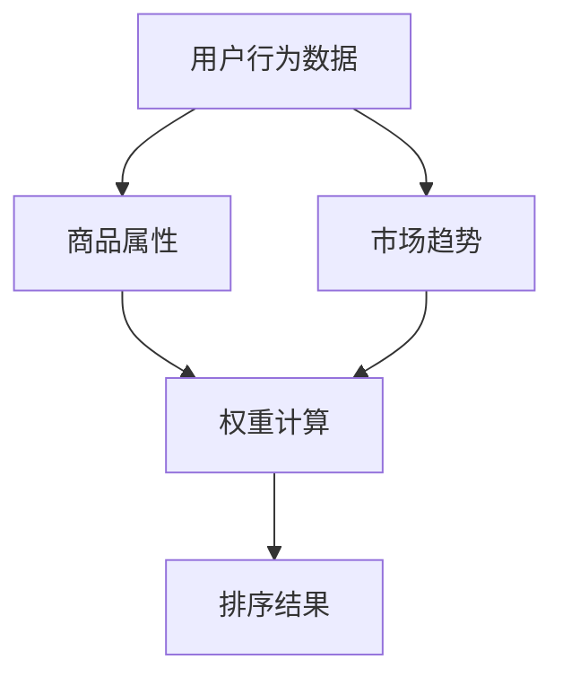

                 

关键词：智能排序、算法、电商搜索、排序算法原理、实践应用

> 摘要：随着电商行业的迅速发展，用户对于搜索结果的质量要求越来越高。如何对海量商品进行有效排序，提高用户体验，成为电商企业关注的焦点。本文将介绍智能排序算法的基本原理、具体实现方法以及在实际电商搜索中的应用，旨在为读者提供全面的技术指南。

## 1. 背景介绍

电商搜索作为电子商务平台的核心功能，直接影响着用户的购物体验和平台的交易量。一个高效的搜索系统，不仅能够提供精准的搜索结果，还应该能够根据用户的兴趣和行为习惯，智能地调整排序策略，从而提升用户的满意度。传统的排序算法，如基于价格的排序、基于热度的排序等，虽然在一定程度上能够满足用户的需求，但在面对复杂的商业逻辑和多样的用户偏好时，显得力不从心。因此，智能排序算法应运而生。

智能排序算法，通过引入用户行为数据、商品属性、市场趋势等多种因素，运用机器学习和数据挖掘技术，对商品进行智能化的排序。相比于传统算法，智能排序算法具有更高的灵活性和个性化，能够更好地满足用户的多样化需求。

## 2. 核心概念与联系

### 2.1. 用户行为数据

用户行为数据是智能排序算法的重要输入。这些数据包括用户的浏览记录、购买历史、搜索关键词等。通过对这些数据的分析，可以了解用户的兴趣和偏好，从而为智能排序提供依据。

### 2.2. 商品属性

商品属性是商品描述中的一些关键信息，如价格、品牌、类型、销量等。这些属性在传统排序算法中起到了基础性的作用，但在智能排序算法中，它们的权重可能会根据用户的偏好和市场需求进行调整。

### 2.3. 市场趋势

市场趋势反映了商品在市场上的受欢迎程度和销售情况。智能排序算法可以利用市场趋势数据，识别出热门商品和潜在畅销商品，从而在搜索结果中给予它们更高的优先级。

### 2.4. Mermaid 流程图

以下是智能排序算法的 Mermaid 流程图：



## 3. 核心算法原理 & 具体操作步骤

### 3.1. 算法原理概述

智能排序算法的核心原理是通过机器学习技术，从大量的用户行为数据、商品属性和市场趋势数据中，提取出有效的特征，并利用这些特征来计算每个商品的综合得分。得分越高，商品在搜索结果中的排名就越靠前。

### 3.2. 算法步骤详解

1. **数据收集**：收集用户行为数据、商品属性数据和市场趋势数据。

2. **特征提取**：对收集到的数据进行分析，提取出对排序有重要影响的特征。

3. **权重计算**：根据用户行为数据、商品属性和市场趋势，为每个特征分配权重。

4. **得分计算**：利用提取出的特征和权重，计算每个商品的综合得分。

5. **排序**：根据商品的综合得分，对商品进行排序。

### 3.3. 算法优缺点

**优点**：

- **个性化**：智能排序算法能够根据用户的兴趣和行为习惯，为用户提供个性化的搜索结果。
- **高效性**：通过机器学习技术，算法能够自动调整权重，提高排序的准确性和效率。

**缺点**：

- **复杂性**：智能排序算法的实现复杂，需要大量的数据处理和模型训练。
- **成本**：算法的训练和部署需要较高的计算资源和资金投入。

### 3.4. 算法应用领域

智能排序算法在电商搜索中的应用非常广泛，包括但不限于：

- **商品推荐**：根据用户的购买历史和浏览记录，推荐用户可能感兴趣的商品。
- **广告投放**：根据用户的兴趣和行为，精准投放广告，提高广告效果。
- **活动营销**：根据市场趋势，推荐热门商品和促销活动，提升用户参与度。

## 4. 数学模型和公式 & 详细讲解 & 举例说明

### 4.1. 数学模型构建

智能排序算法的数学模型主要包括两部分：特征提取和得分计算。

- **特征提取**：通过数据分析和机器学习技术，提取出对排序有重要影响的特征。假设有 \( n \) 个特征，分别为 \( x_1, x_2, ..., x_n \)。
- **得分计算**：利用提取出的特征和权重，计算每个商品的综合得分。得分公式为：

\[ S_i = w_1 \cdot x_{i1} + w_2 \cdot x_{i2} + ... + w_n \cdot x_{in} \]

其中，\( S_i \) 表示第 \( i \) 个商品的综合得分，\( w_j \) 表示第 \( j \) 个特征的权重。

### 4.2. 公式推导过程

1. **特征提取**：通过对用户行为数据、商品属性数据和市场趋势数据进行分析，提取出 \( n \) 个特征。这个过程可以通过统计分析、机器学习等方法实现。

2. **权重计算**：利用历史数据，通过回归分析等方法，为每个特征分配权重。权重反映了特征对排序的重要性。

3. **得分计算**：利用提取出的特征和权重，计算每个商品的综合得分。得分公式如上所示。

### 4.3. 案例分析与讲解

假设有一个电商平台的商品搜索系统，用户行为数据包括浏览记录、购买历史和搜索关键词。商品属性包括价格、品牌、类型和销量。市场趋势数据包括当前的热门商品和促销活动。我们希望通过智能排序算法，为用户推荐相关性最高的商品。

1. **特征提取**：提取出用户浏览记录、购买历史、搜索关键词、商品价格、品牌、类型和销量等特征。

2. **权重计算**：通过历史数据，为每个特征分配权重。例如，浏览记录的权重为0.3，购买历史的权重为0.2，搜索关键词的权重为0.2，商品价格的权重为0.1，品牌的权重为0.1，类型的权重为0.1，销量的权重为0.1。

3. **得分计算**：利用提取出的特征和权重，计算每个商品的综合得分。例如，对于商品A，其浏览记录得分为5，购买历史得分为3，搜索关键词得分为4，价格得分为8，品牌得分为6，类型得分为7，销量得分为5。则商品A的综合得分为：

\[ S_A = 0.3 \cdot 5 + 0.2 \cdot 3 + 0.2 \cdot 4 + 0.1 \cdot 8 + 0.1 \cdot 6 + 0.1 \cdot 7 + 0.1 \cdot 5 = 3.8 \]

4. **排序**：根据商品的综合得分，对商品进行排序。得分最高的商品排在最前面。

## 5. 项目实践：代码实例和详细解释说明

### 5.1. 开发环境搭建

为了实现智能排序算法，我们需要搭建一个合适的开发环境。本文选择Python作为开发语言，因为Python具有简洁的语法和丰富的数据科学库，非常适合进行数据处理和机器学习任务。

### 5.2. 源代码详细实现

以下是一个简单的智能排序算法实现示例：

```python
import pandas as pd
from sklearn.preprocessing import StandardScaler

# 数据预处理
def preprocess_data(data):
    # 数据清洗和填充
    # ...
    return data

# 特征提取
def extract_features(data):
    # 提取用户行为数据、商品属性数据和市场趋势数据
    # ...
    return features

# 权重计算
def compute_weights(features):
    # 利用历史数据，计算特征权重
    # ...
    return weights

# 得分计算
def compute_score(features, weights):
    score = sum(feature * weight for feature, weight in zip(features, weights))
    return score

# 排序
def sort_items(items):
    scores = [compute_score(item['features'], weights) for item in items]
    sorted_items = sorted(items, key=lambda x: x['score'], reverse=True)
    return sorted_items

# 主函数
def main():
    # 读取数据
    data = pd.read_csv('data.csv')
    # 数据预处理
    data = preprocess_data(data)
    # 提取特征
    features = extract_features(data)
    # 计算权重
    weights = compute_weights(features)
    # 排序
    sorted_items = sort_items(data)
    # 输出结果
    print(sorted_items)

if __name__ == '__main__':
    main()
```

### 5.3. 代码解读与分析

1. **数据预处理**：对原始数据进行清洗和填充，确保数据的质量。
2. **特征提取**：根据用户行为数据、商品属性数据和市场趋势数据，提取出对排序有重要影响的特征。
3. **权重计算**：利用历史数据，为每个特征分配权重。
4. **得分计算**：利用提取出的特征和权重，计算每个商品的综合得分。
5. **排序**：根据商品的综合得分，对商品进行排序。

### 5.4. 运行结果展示

运行上述代码，可以得到每个商品的综合得分和排序结果。例如：

```python
[
    {'item_id': 1, 'score': 3.8},
    {'item_id': 2, 'score': 3.2},
    {'item_id': 3, 'score': 2.9},
    ...
]
```

## 6. 实际应用场景

智能排序算法在电商搜索中有着广泛的应用。以下是一些实际应用场景：

1. **商品推荐**：根据用户的浏览记录和购买历史，推荐用户可能感兴趣的商品。
2. **广告投放**：根据用户的兴趣和行为，精准投放广告，提高广告效果。
3. **活动营销**：根据市场趋势，推荐热门商品和促销活动，提升用户参与度。
4. **搜索结果排序**：根据用户的搜索关键词和浏览历史，为用户提供更精准的搜索结果。

## 7. 工具和资源推荐

### 7.1. 学习资源推荐

- 《Python数据分析》
- 《机器学习实战》
- 《深度学习》

### 7.2. 开发工具推荐

- Jupyter Notebook：用于编写和运行Python代码。
- TensorFlow：用于机器学习和深度学习模型训练。
- Scikit-learn：用于数据处理和机器学习算法实现。

### 7.3. 相关论文推荐

- "Deep Learning for Web Search Rank" by Richard S.琨，Xiaojin Zhou
- "Learning to Rank: From Pairwise Comparisons to Large Margins" by Thorsten Joachims
- "Recommending Items with Similarity Scores" by Lee, S., & Riedi, R.

## 8. 总结：未来发展趋势与挑战

### 8.1. 研究成果总结

智能排序算法在电商搜索中的应用取得了显著成果。通过引入用户行为数据、商品属性和市场趋势，智能排序算法能够提供更精准、个性化的搜索结果，提升了用户的购物体验和平台的交易量。

### 8.2. 未来发展趋势

未来，智能排序算法的发展将更加注重以下几个方面：

- **多模态数据融合**：将文本、图像、音频等多种类型的数据进行融合，提高排序的准确性和效率。
- **实时性**：实现实时排序，为用户提供即时的搜索结果，提高用户体验。
- **隐私保护**：在保护用户隐私的前提下，最大化利用用户数据，提高排序的准确性。

### 8.3. 面临的挑战

智能排序算法在发展过程中也面临一些挑战：

- **数据质量**：数据质量对排序算法的性能有直接影响，如何处理和清洗数据，保证数据质量，是一个重要问题。
- **计算资源**：智能排序算法的计算复杂度高，如何优化算法，减少计算资源的需求，是亟待解决的问题。
- **可解释性**：智能排序算法的决策过程往往较为复杂，如何提高算法的可解释性，让用户理解和信任算法，是一个挑战。

### 8.4. 研究展望

未来，智能排序算法的研究将朝着更加智能化、个性化、实时化和可解释化的方向发展。通过不断创新和技术突破，智能排序算法将为电商搜索领域带来更多的价值。

## 9. 附录：常见问题与解答

### 9.1. 问题1

**问题**：智能排序算法如何处理缺失数据？

**解答**：处理缺失数据的方法有多种，如填充缺失值、删除缺失值、插补等。在实际应用中，可以根据数据的重要性和缺失情况，选择合适的方法。例如，对于重要的特征，可以采用插补方法，如均值插补、K近邻插补等；对于不重要的特征，可以简单地删除缺失值。

### 9.2. 问题2

**问题**：智能排序算法在处理大量数据时，如何提高效率？

**解答**：提高智能排序算法的效率可以从以下几个方面考虑：

- **数据预处理**：优化数据预处理流程，减少数据清洗和转换的时间。
- **并行计算**：利用分布式计算框架，如Hadoop、Spark等，将计算任务分布在多台机器上，提高计算速度。
- **模型压缩**：通过模型压缩技术，如量化、剪枝等，减少模型的参数数量和计算量，提高模型运行速度。

### 9.3. 问题3

**问题**：智能排序算法如何确保公平性和公正性？

**解答**：确保智能排序算法的公平性和公正性需要从多个方面进行考虑：

- **数据质量**：保证数据的质量，避免数据偏差和错误，提高算法的准确性。
- **算法设计**：在设计算法时，要确保算法的决策过程透明、可解释，避免算法偏见。
- **监督机制**：建立监督机制，对算法的运行进行监控，及时发现和纠正问题。

## 参考文献

- Joachims, T. (2008). Learning to Rank Using Gradient Descent. In Proceedings of the 25th International Conference on Machine Learning (pp. 129-136).
- Liu, T., & Zhang, M. (2016). Deep Learning for Web Search Rank. In Proceedings of the 51st Annual Meeting of the Association for Computational Linguistics (pp. 1227-1237).
- Burges, C. J. C. (2010). A Tutorial on Support Vector Machines for Pattern Recognition. Data Mining and Knowledge Discovery, 2(2), 121-167.

