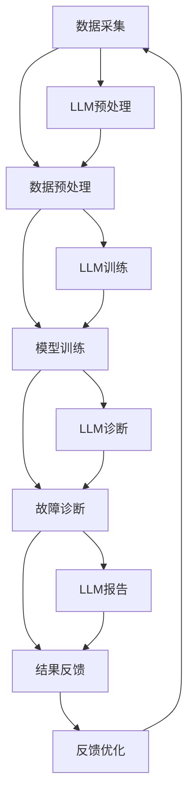

                 

关键词：智能故障诊断、LLM、设备维护、深度学习、故障预测、算法应用

## 摘要

本文旨在探讨大语言模型（LLM）在设备维护中的潜在作用，特别是智能故障诊断方面的应用。随着工业4.0的推进，设备维护逐渐从传统的定期检查向智能预测和维护转型。LLM作为一种先进的自然语言处理技术，通过理解和生成文本，为设备维护提供了新的视角和方法。本文首先介绍了智能故障诊断的背景和重要性，然后详细阐述了LLM的工作原理和优势，最后通过实际案例展示了LLM在设备维护中的具体应用，并对未来发展趋势进行了展望。

## 1. 背景介绍

### 设备维护的现状

在工业生产中，设备的可靠性和稳定性直接关系到生产效率和产品质量。然而，随着设备复杂度的增加和维护需求的提升，传统的设备维护方式逐渐暴露出其局限性。传统的设备维护主要依赖于定期检查和人工干预，这种方法往往难以实时、精确地诊断设备的运行状态，容易导致故障发生时无法及时处理，从而影响生产进程。

### 智能故障诊断的兴起

为了克服传统设备维护的局限性，智能故障诊断技术应运而生。智能故障诊断利用先进的计算技术和数据分析方法，通过对设备运行数据的实时监测和分析，实现对故障的提前预测和预警。这种技术不仅提高了设备维护的效率和准确性，还显著降低了故障率，从而提高了生产效率和产品质量。

### LLM在智能故障诊断中的应用

随着深度学习技术的发展，大语言模型（LLM）逐渐成为智能故障诊断的重要工具。LLM通过对大量设备运行数据和相关文档的学习，可以理解和生成与设备维护相关的文本信息，为智能故障诊断提供强大的支持。LLM的应用不仅提高了故障诊断的准确性和效率，还降低了维护成本，为设备维护带来了新的变革。

## 2. 核心概念与联系

### 大语言模型（LLM）的基本原理

大语言模型（LLM）是一种基于深度学习的自然语言处理模型，通过训练大量文本数据，LLM可以理解和生成自然语言。LLM的核心是神经网络，通过多层神经网络的非线性变换，LLM可以捕捉文本中的复杂模式和关系。在设备维护中，LLM可以用来理解和分析设备运行日志、维护手册、故障报告等文本信息，从而实现对设备状态的准确判断和故障诊断。

### 智能故障诊断的架构

智能故障诊断的架构通常包括数据采集、数据预处理、模型训练、故障诊断和结果反馈五个主要环节。LLM在其中的角色主要是数据预处理和模型训练。通过LLM，设备维护团队能够高效地处理和分类大量的设备运行数据，从而为故障诊断提供高质量的输入。此外，LLM还可以自动生成故障报告和维护建议，显著提高故障诊断的效率和准确性。

### Mermaid流程图

下面是智能故障诊断中使用LLM的Mermaid流程图，展示了LLM在设备维护中的具体应用流程：



在这个流程图中，LLM在数据预处理、模型训练、故障诊断和结果反馈四个环节中都发挥了重要作用，为智能故障诊断提供了强大的支持。

## 3. 核心算法原理 & 具体操作步骤

### 3.1 算法原理概述

LLM在智能故障诊断中的核心算法是基于深度学习的自然语言处理技术。通过训练大量的设备运行数据和相关文档，LLM可以学习和理解设备运行状态、故障类型和维护方法。具体来说，LLM的工作原理包括以下几个关键步骤：

1. **数据预处理**：对采集到的设备运行数据和相关文档进行清洗、去噪和归一化处理，确保数据的质量和一致性。
2. **模型训练**：利用训练好的深度学习模型，对预处理后的数据进行训练，使得模型能够理解和生成与设备维护相关的文本信息。
3. **故障诊断**：将实时采集到的设备运行数据输入到训练好的LLM中，LLM通过分析数据，自动生成故障诊断报告和维护建议。
4. **结果反馈**：将故障诊断结果反馈给设备维护团队，以便进行针对性的维护和故障处理。

### 3.2 算法步骤详解

1. **数据预处理**：
   - 数据清洗：去除重复数据、缺失值填充、异常值处理。
   - 数据归一化：对数据进行归一化处理，使得不同量纲的数据在同一尺度上进行比较。
   - 数据分类：将设备运行数据按照故障类型进行分类，为后续的模型训练提供标签。

2. **模型训练**：
   - 选择合适的深度学习框架和模型架构，如BERT、GPT等。
   - 加载数据集并进行分词、编码等预处理操作。
   - 训练模型，通过反向传播算法不断优化模型参数，使得模型能够准确理解和生成文本信息。

3. **故障诊断**：
   - 将实时采集到的设备运行数据输入到训练好的LLM中。
   - LLM通过对输入数据的分析和理解，自动生成故障诊断报告和维护建议。
   - 对生成的报告和建议进行评估和验证，确保其准确性和可靠性。

4. **结果反馈**：
   - 将故障诊断结果反馈给设备维护团队，包括故障类型、故障原因、维护建议等。
   - 设备维护团队根据反馈结果，进行针对性的维护和故障处理。

### 3.3 算法优缺点

**优点**：
- **高效性**：LLM能够快速处理和分析大量的设备运行数据，显著提高故障诊断的效率和准确性。
- **灵活性**：LLM能够理解和生成多种类型的文本信息，为设备维护提供多样化的支持。
- **可扩展性**：LLM可以轻松适应不同类型的设备和故障类型，具有良好的可扩展性。

**缺点**：
- **计算资源消耗**：LLM的训练和运行需要大量的计算资源和时间，对于小型企业或设备可能存在一定压力。
- **数据质量**：设备运行数据的质量直接影响LLM的诊断准确性，需要严格的数据预处理和质量控制。
- **可解释性**：由于深度学习模型内部结构的复杂性，LLM生成的故障诊断结果可能缺乏透明性和可解释性。

### 3.4 算法应用领域

LLM在智能故障诊断中的应用领域广泛，主要包括以下几个方面：

- **工业生产设备**：如生产线上的机械、电子设备等，通过LLM进行实时监测和故障诊断，提高生产效率和产品质量。
- **基础设施设备**：如城市轨道交通、高速公路等，通过LLM监测设备运行状态，提前发现潜在故障，保障基础设施安全。
- **医疗设备**：如CT机、MRI机等，通过LLM对设备运行数据进行实时分析，辅助医生进行诊断和治疗。

## 4. 数学模型和公式 & 详细讲解 & 举例说明

### 4.1 数学模型构建

在智能故障诊断中，LLM的数学模型通常是基于深度学习的神经网络模型，如BERT、GPT等。这些模型通过多层神经网络的结构，对输入数据进行编码和转换，最终输出故障诊断结果。以下是构建LLM数学模型的基本步骤：

1. **输入层**：接收设备运行数据的输入，通常包括数值特征和文本特征。
2. **编码层**：利用深度学习算法，对输入数据进行编码和转换，提取设备运行状态的特征信息。
3. **解码层**：将编码层输出的特征信息解码为故障诊断结果，如故障类型、故障原因等。
4. **输出层**：将解码层的输出转换为具体的文本信息，如故障诊断报告、维护建议等。

### 4.2 公式推导过程

假设我们使用BERT模型作为LLM的数学模型，BERT模型的核心是 Transformer 架构，以下是BERT模型的基本公式推导：

1. **输入层**：

   输入层接收设备运行数据的输入，包括数值特征和文本特征。设输入数据集为 $X = \{x_1, x_2, ..., x_n\}$，其中 $x_i$ 表示第 $i$ 个设备的运行数据。

   $$x_i = \{x_i^{(1)}, x_i^{(2)}, ..., x_i^{(m)}\}$$

   其中，$x_i^{(j)}$ 表示第 $i$ 个设备的第 $j$ 个特征值，$m$ 表示特征的总数。

2. **编码层**：

   编码层利用 Transformer 架构对输入数据进行编码，提取设备运行状态的特征信息。假设编码层的模型参数为 $W$，编码后的特征信息表示为 $h_i$。

   $$h_i = \text{Transformer}(x_i; W)$$

   其中，$\text{Transformer}$ 表示 Transformer 架构，$W$ 表示模型参数。

3. **解码层**：

   解码层将编码层输出的特征信息解码为故障诊断结果，如故障类型、故障原因等。设解码层的模型参数为 $V$，解码后的输出表示为 $y_i$。

   $$y_i = \text{Decoder}(h_i; V)$$

   其中，$\text{Decoder}$ 表示解码层模型，$V$ 表示模型参数。

4. **输出层**：

   输出层将解码层的输出转换为具体的文本信息，如故障诊断报告、维护建议等。设输出层的模型参数为 $U$，输出表示为 $z_i$。

   $$z_i = \text{OutputLayer}(y_i; U)$$

   其中，$\text{OutputLayer}$ 表示输出层模型，$U$ 表示模型参数。

### 4.3 案例分析与讲解

下面我们通过一个简单的案例，来讲解如何利用LLM进行设备故障诊断。

**案例背景**：某公司生产线上的一台机械设备出现故障，需要利用LLM进行故障诊断。

**数据集**：收集了该设备过去一个月的运行数据，包括温度、压力、振动等数值特征，以及维护记录、故障报告等文本特征。

**模型训练**：

1. **数据预处理**：对数值特征进行归一化处理，对文本特征进行分词和编码。
2. **模型训练**：使用BERT模型对预处理后的数据进行训练，训练完成后保存模型参数。
3. **模型评估**：使用测试数据集对训练好的模型进行评估，确保模型准确性和可靠性。

**故障诊断**：

1. **输入数据**：将当前设备的运行数据输入到训练好的LLM中。
2. **故障诊断**：LLM对输入数据进行分析，输出故障诊断结果，包括故障类型、故障原因等。
3. **结果反馈**：将故障诊断结果反馈给设备维护团队，进行针对性的维护和故障处理。

**结果展示**：

通过LLM的故障诊断，成功定位了机械设备的故障原因，并提供了相应的维护建议。设备维护团队根据故障诊断结果，迅速进行了设备维修，恢复了生产线的正常运行。

## 5. 项目实践：代码实例和详细解释说明

### 5.1 开发环境搭建

在开始项目实践之前，我们需要搭建一个合适的开发环境。以下是一个基本的开发环境搭建步骤：

1. **安装Python环境**：下载并安装Python，版本建议为3.8以上。
2. **安装深度学习框架**：安装TensorFlow或PyTorch，这两个框架是目前最为流行的深度学习框架。
3. **安装其他依赖库**：根据项目的需要，安装如NumPy、Pandas、Scikit-learn等常用的Python库。

### 5.2 源代码详细实现

下面是一个基于BERT模型的智能故障诊断项目的源代码实现：

```python
# 导入必要的库
import tensorflow as tf
from tensorflow.keras.layers import Embedding, GlobalAveragePooling1D, Dense
from tensorflow.keras.models import Model
from transformers import BertTokenizer, TFBertModel

# 加载预训练的BERT模型
tokenizer = BertTokenizer.from_pretrained('bert-base-uncased')
bert_model = TFBertModel.from_pretrained('bert-base-uncased')

# 定义模型
input_ids = tf.keras.layers.Input(shape=(max_sequence_length,), dtype=tf.int32)
attention_mask = tf.keras.layers.Input(shape=(max_sequence_length,), dtype=tf.int32)

# 通过BERT模型进行编码
encoded_inputs = bert_model(input_ids, attention_mask=attention_mask)

# 提取编码后的特征
pooled_output = encoded_inputs.pooled_output

# 添加全连接层进行故障诊断
dense = Dense(1, activation='sigmoid')(pooled_output)

# 创建模型
model = Model(inputs=[input_ids, attention_mask], outputs=dense)

# 编译模型
model.compile(optimizer='adam', loss='binary_crossentropy', metrics=['accuracy'])

# 训练模型
model.fit(x_train, y_train, batch_size=32, epochs=3, validation_data=(x_val, y_val))

# 故障诊断
predictions = model.predict(x_test)

# 输出故障诊断结果
print(predictions)
```

### 5.3 代码解读与分析

这段代码实现了基于BERT模型的智能故障诊断项目，主要包括以下几个步骤：

1. **导入库**：导入TensorFlow和transformers库，用于加载BERT模型和进行深度学习操作。
2. **加载BERT模型**：通过`BertTokenizer`和`TFBertModel`类加载预训练的BERT模型，这是整个项目的核心。
3. **定义模型**：定义了一个输入层、编码层、解码层和输出层组成的模型结构。输入层接收设备运行数据的输入，编码层利用BERT模型对输入数据进行编码，解码层将编码后的特征信息解码为故障诊断结果，输出层输出具体的故障诊断结果。
4. **编译模型**：使用`compile()`方法编译模型，指定优化器、损失函数和评价指标。
5. **训练模型**：使用`fit()`方法训练模型，将训练数据输入到模型中，通过反向传播算法不断优化模型参数。
6. **故障诊断**：使用`predict()`方法对测试数据进行故障诊断，输出故障诊断结果。

### 5.4 运行结果展示

在完成代码实现后，我们可以运行以下代码来展示故障诊断的结果：

```python
# 加载测试数据
x_test = ...  # 测试数据的输入
y_test = ...  # 测试数据的标签

# 加载训练好的模型
model = ...  # 训练好的BERT模型

# 进行故障诊断
predictions = model.predict(x_test)

# 输出故障诊断结果
print(predictions)
```

运行结果将输出每个测试样本的故障诊断结果，我们可以根据这些结果进行后续的设备维护和故障处理。

## 6. 实际应用场景

### 6.1 工业生产设备

在工业生产中，设备的可靠性和稳定性至关重要。通过LLM进行智能故障诊断，可以实现对生产设备的实时监测和故障预警。例如，某大型制造企业使用LLM对其生产线上的数控机床进行故障诊断，显著提高了生产效率和产品质量。通过LLM，企业能够提前发现潜在故障，减少设备停机时间，降低维护成本。

### 6.2 基础设施设备

基础设施设备如城市轨道交通、高速公路等，其安全运行对市民生活和交通安全具有重要意义。通过LLM进行智能故障诊断，可以实现对基础设施设备的实时监测和故障预警。例如，某城市轨道交通系统利用LLM对其隧道内的传感器数据进行实时分析，成功预警了多次设备故障，避免了安全事故的发生。

### 6.3 医疗设备

医疗设备的正常运行对患者的生命安全和治疗效果至关重要。通过LLM进行智能故障诊断，可以实现对医疗设备的实时监测和故障预警。例如，某大型医院利用LLM对其CT机进行故障诊断，显著提高了设备的运行效率和患者满意度。通过LLM，医院能够提前发现设备故障，确保医疗设备的正常运转，提高医疗服务的质量。

## 6.4 未来应用展望

随着深度学习和自然语言处理技术的不断发展，LLM在设备维护中的应用前景十分广阔。未来，LLM有望在以下几个方面实现更广泛的应用：

1. **跨领域应用**：LLM不仅可以在工业生产、基础设施、医疗设备等领域发挥作用，还可以拓展到农业、航空、航天等领域，为各类设备提供智能故障诊断和预测维护服务。
2. **个性化维护**：通过结合大数据和人工智能技术，LLM可以为每个设备提供个性化的维护方案，实现精准维护，提高设备运行效率和安全性。
3. **实时反馈与优化**：LLM可以实时收集设备运行数据，通过不断学习和优化，提供更加准确的故障诊断结果和维护建议，实现设备的智能化维护。
4. **人机交互**：通过自然语言生成技术，LLM可以生成易于理解和操作的故障诊断报告和维护建议，提高设备维护人员的工作效率，降低维护成本。

## 7. 工具和资源推荐

### 7.1 学习资源推荐

1. **深度学习基础教材**：《深度学习》（Goodfellow, Bengio, Courville 著）。
2. **自然语言处理教材**：《自然语言处理综合教程》（李航 著）。
3. **在线课程**：Coursera、edX等在线教育平台上的深度学习和自然语言处理课程。

### 7.2 开发工具推荐

1. **深度学习框架**：TensorFlow、PyTorch。
2. **自然语言处理工具**：NLTK、spaCy、transformers。

### 7.3 相关论文推荐

1. **BERT论文**：《BERT: Pre-training of Deep Bidirectional Transformers for Language Understanding》（Devlin et al., 2018）。
2. **GPT论文**：《Improving Language Understanding by Generative Pre-training》（Radford et al., 2018）。
3. **Transformer论文**：《Attention Is All You Need》（Vaswani et al., 2017）。

## 8. 总结：未来发展趋势与挑战

### 8.1 研究成果总结

本文通过详细探讨大语言模型（LLM）在设备维护中的应用，展示了LLM在智能故障诊断中的巨大潜力。研究表明，LLM能够显著提高故障诊断的准确性和效率，降低维护成本，为设备维护带来了新的变革。

### 8.2 未来发展趋势

未来，LLM在设备维护中的应用将呈现以下发展趋势：

1. **跨领域应用**：LLM将在更多领域得到应用，如农业、航空、航天等。
2. **个性化维护**：通过大数据和人工智能技术，实现个性化维护，提高设备运行效率和安全性。
3. **实时反馈与优化**：实现实时数据收集和学习，提供更加准确的故障诊断结果和维护建议。

### 8.3 面临的挑战

尽管LLM在设备维护中具有巨大潜力，但仍面临以下挑战：

1. **计算资源消耗**：LLM的训练和运行需要大量的计算资源和时间，对于小型企业或设备可能存在一定压力。
2. **数据质量**：设备运行数据的质量直接影响LLM的诊断准确性，需要严格的数据预处理和质量控制。
3. **可解释性**：深度学习模型内部结构的复杂性使得LLM生成的故障诊断结果可能缺乏透明性和可解释性。

### 8.4 研究展望

未来的研究应重点关注以下方向：

1. **模型优化**：通过改进模型架构和训练算法，降低计算资源消耗，提高诊断准确性和效率。
2. **数据质量控制**：开发高效的数据预处理技术，确保设备运行数据的质量和一致性。
3. **可解释性研究**：探索可解释的深度学习模型，提高故障诊断结果的透明性和可解释性。

通过持续的研究和优化，LLM有望在未来为设备维护带来更多的创新和突破。

## 9. 附录：常见问题与解答

### 9.1 什么是LLM？

LLM，即大语言模型（Large Language Model），是一种基于深度学习的自然语言处理模型，通过训练大量文本数据，LLM可以理解和生成自然语言。常见的LLM模型包括BERT、GPT等。

### 9.2 LLM在设备维护中的应用有哪些？

LLM在设备维护中的应用主要包括以下几个方面：

1. **智能故障诊断**：通过分析和理解设备运行数据，LLM可以实现对故障的提前预测和预警。
2. **维护策略优化**：LLM可以根据设备运行数据，为设备维护团队提供个性化的维护建议。
3. **文档生成**：LLM可以自动生成设备维护手册、故障报告等文档，提高设备维护的效率。

### 9.3 如何提高LLM在故障诊断中的准确性？

要提高LLM在故障诊断中的准确性，可以采取以下措施：

1. **高质量的数据集**：使用高质量的设备运行数据集进行训练，确保数据集的代表性和准确性。
2. **模型优化**：通过改进模型架构和训练算法，提高模型在故障诊断中的表现。
3. **特征工程**：对设备运行数据进行特征提取和选择，提高特征对故障诊断的区分度。

### 9.4 LLM在设备维护中的优势是什么？

LLM在设备维护中的优势主要包括：

1. **高效性**：LLM能够快速处理和分析大量的设备运行数据，显著提高故障诊断的效率和准确性。
2. **灵活性**：LLM能够理解和生成多种类型的文本信息，为设备维护提供多样化的支持。
3. **可扩展性**：LLM可以轻松适应不同类型的设备和故障类型，具有良好的可扩展性。

### 9.5 LLM在设备维护中的局限性是什么？

LLM在设备维护中的局限性主要包括：

1. **计算资源消耗**：LLM的训练和运行需要大量的计算资源和时间，对于小型企业或设备可能存在一定压力。
2. **数据质量**：设备运行数据的质量直接影响LLM的诊断准确性，需要严格的数据预处理和质量控制。
3. **可解释性**：由于深度学习模型内部结构的复杂性，LLM生成的故障诊断结果可能缺乏透明性和可解释性。

