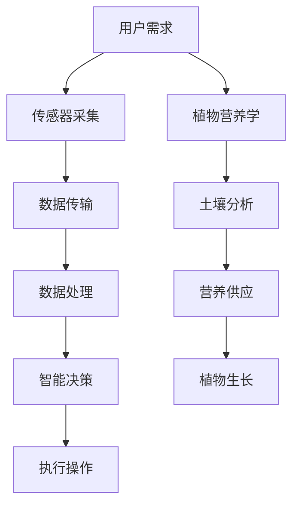

                 

关键词：智能植物培育、室内园艺、物联网技术、AI、植物营养学、创业机会

> 摘要：随着城市化进程的加快和人们对绿色生活品质的追求，室内园艺市场正迎来前所未有的发展机遇。智能植物培育技术的引入，使得室内园艺不仅仅是简单的植物栽培，而成为了一个集科技与生态于一体的新兴行业。本文将从技术、市场和创业机会等多角度探讨智能植物培育在室内园艺领域的应用与前景，旨在为有意投身此领域的创业者和从业者提供有价值的参考。

## 1. 背景介绍

### 室内园艺的发展

室内园艺作为一种以家庭、办公室和商业空间为载体的园艺形式，其历史可以追溯到远古时期。然而，随着科技的发展和人们对生活品质的不断提高，室内园艺逐渐从传统的栽培方式转向了智能化的培育技术。现代化的室内园艺不仅满足了人们对绿色环境的需求，还提供了更为便捷、高效、健康的植物养护方式。

### 城市化与室内园艺

全球城市化进程的加快，使得城市人口密度不断增加，土地资源变得愈发稀缺。传统的农业种植模式已无法满足城市居民对新鲜蔬菜、水果等的需求。与此同时，室内园艺以其不受气候、季节限制的特点，成为了一种理想的替代方案。智能植物培育技术的应用，更是为室内园艺提供了无限可能。

### 智能植物培育技术的崛起

智能植物培育技术是结合物联网、人工智能、生物技术等多学科知识的新型技术。它通过传感器实时监测植物生长环境，利用大数据分析和人工智能算法优化植物养护策略，从而实现植物的高效培育。近年来，随着技术的不断进步和成本的降低，智能植物培育技术逐渐走进大众视野，成为室内园艺行业发展的关键驱动因素。

## 2. 核心概念与联系

### 物联网技术（IoT）在智能植物培育中的应用

物联网技术在智能植物培育中起到了核心作用。通过在植物生长环境中布置各种传感器（如土壤湿度传感器、温度传感器、光照传感器等），可以实时获取植物生长状态的数据。这些数据经过物联网设备的传输和处理，最终被智能控制系统用来调整植物的生长条件，实现精准养护。

### 人工智能（AI）在智能植物培育中的角色

人工智能技术则为智能植物培育提供了智能化的决策支持。通过大数据分析和机器学习算法，AI系统可以预测植物的生长趋势，识别植物的营养需求，并自动调整灌溉、光照、施肥等养护策略。这不仅提高了植物的生长效率，还减少了人力成本和资源浪费。

### 植物营养学在智能植物培育中的重要性

植物营养学是智能植物培育技术的基础。通过对植物营养需求的深入研究，可以为智能控制系统提供精确的营养供应方案。例如，通过土壤分析技术确定土壤的养分含量，结合植物生长阶段的不同需求，智能控制系统可以实时调整施肥策略，确保植物获得充足的营养。

### Mermaid 流程图



## 3. 核心算法原理 & 具体操作步骤

### 3.1 算法原理概述

智能植物培育技术的核心在于如何通过算法实现植物生长环境的自动调节和营养供应的精准控制。其主要原理包括以下几个步骤：

1. **数据采集**：利用传感器实时采集植物生长环境的数据。
2. **数据预处理**：对采集到的数据进行滤波、归一化等预处理，确保数据的准确性和一致性。
3. **特征提取**：从预处理后的数据中提取出对植物生长有重要影响的特征，如土壤湿度、温度、光照强度等。
4. **模型训练**：利用机器学习算法，对历史数据进行训练，构建植物生长模型。
5. **决策制定**：根据植物生长模型和实时采集到的数据，智能控制系统制定出最优的养护策略。
6. **执行操作**：执行决策制定中的各项操作，如调整灌溉、光照、施肥等。

### 3.2 算法步骤详解

1. **数据采集**：

   - **土壤湿度传感器**：用于监测土壤湿度，通常使用电阻法或电容法。
   - **温度传感器**：用于监测土壤和空气温度，通常使用热敏电阻或热电偶。
   - **光照传感器**：用于监测光照强度，通常使用光敏电阻。

2. **数据预处理**：

   - **滤波**：采用低通滤波器去除噪声。
   - **归一化**：将数据缩放至[0,1]范围内，便于后续处理。

3. **特征提取**：

   - **统计分析**：计算平均值、标准差、变异系数等统计量。
   - **主成分分析**（PCA）：降低数据维度，提取主要特征。

4. **模型训练**：

   - **决策树**：适用于分类问题。
   - **支持向量机**（SVM）：适用于回归和分类问题。
   - **神经网络**：适用于复杂非线性问题。

5. **决策制定**：

   - **阈值设定**：根据历史数据设定湿度、温度、光照等阈值。
   - **规则库**：根据植物生长规律和专家经验建立规则库。
   - **模糊逻辑**：结合多种规则进行综合判断。

6. **执行操作**：

   - **灌溉系统**：根据土壤湿度调整灌溉时间。
   - **光照调节**：根据光照强度调整灯光亮度和持续时间。
   - **施肥系统**：根据植物营养需求调整肥料浓度和施肥频率。

### 3.3 算法优缺点

#### 优点

- **高效性**：通过自动化调节，显著提高植物生长效率。
- **精准性**：实时监测和精确控制，确保植物获得最佳生长条件。
- **可持续性**：减少资源浪费，降低环境污染。

#### 缺点

- **成本较高**：传感器和控制系统初期投资较大。
- **技术门槛**：需要掌握多学科知识，如物联网、人工智能、植物营养学等。

### 3.4 算法应用领域

- **家庭园艺**：为家庭用户提供便捷、高效的植物养护解决方案。
- **商业园艺**：为商场、办公室等提供绿色植物养护服务。
- **农业领域**：为温室种植提供智能化的生长环境控制。

## 4. 数学模型和公式 & 详细讲解 & 举例说明

### 4.1 数学模型构建

智能植物培育中的数学模型通常包括以下几个部分：

- **土壤水分模型**：描述土壤水分的动态变化。
- **温度模型**：描述植物生长温度的变化。
- **光照模型**：描述植物光照强度的变化。
- **营养需求模型**：描述植物在不同生长阶段的营养需求。

### 4.2 公式推导过程

#### 土壤水分模型

土壤水分模型通常采用水文模型描述，其基本公式为：

\[ \frac{dS}{dt} = -K(S-S_0)\frac{dH}{dt} \]

其中，\( S \) 为土壤水分含量，\( S_0 \) 为土壤初始水分含量，\( H \) 为土壤湿度，\( K \) 为土壤水分扩散系数。

#### 温度模型

温度模型通常采用热传导方程描述，其基本公式为：

\[ \frac{\partial T}{\partial t} = \alpha \nabla^2 T \]

其中，\( T \) 为温度，\( \alpha \) 为热扩散系数。

#### 光照模型

光照模型通常采用光度学模型描述，其基本公式为：

\[ I = I_0 e^{-\alpha d} \]

其中，\( I \) 为光照强度，\( I_0 \) 为初始光照强度，\( \alpha \) 为光照衰减系数，\( d \) 为距离。

#### 营养需求模型

营养需求模型通常采用线性回归模型描述，其基本公式为：

\[ Y = \beta_0 + \beta_1 X_1 + \beta_2 X_2 + \cdots + \beta_n X_n \]

其中，\( Y \) 为营养需求，\( X_1, X_2, \ldots, X_n \) 为影响营养需求的特征变量，\( \beta_0, \beta_1, \beta_2, \ldots, \beta_n \) 为回归系数。

### 4.3 案例分析与讲解

#### 案例背景

某温室种植场种植了1000平方米的生菜，采用智能植物培育技术进行管理。根据历史数据和现场实验，建立了生菜生长的数学模型，并进行了参数优化。

#### 模型应用

1. **土壤水分模型**：

   - **输入**：实时土壤湿度（\( H \)）。
   - **输出**：土壤水分含量（\( S \)）。

   通过土壤水分模型，系统可以实时调整灌溉策略，确保生菜的土壤湿度保持在最佳范围。

2. **温度模型**：

   - **输入**：实时空气温度（\( T \)）。
   - **输出**：生菜生长温度（\( T_{plant} \)）。

   通过温度模型，系统可以自动调节温室的加热和通风，确保生菜生长在适宜的温度范围内。

3. **光照模型**：

   - **输入**：实时光照强度（\( I \)）。
   - **输出**：生菜所需光照强度（\( I_{need} \)）。

   通过光照模型，系统可以自动调整光照设备，确保生菜得到充足的光照。

4. **营养需求模型**：

   - **输入**：生菜生长阶段、土壤水分、温度、光照等特征变量。
   - **输出**：生菜营养需求（\( Y \)）。

   通过营养需求模型，系统可以自动调整施肥策略，确保生菜在不同生长阶段获得充足的营养。

#### 模型优化

通过对历史数据和实验数据的分析，对土壤水分模型、温度模型、光照模型和营养需求模型的参数进行了优化，提高了模型的准确性和适应性。

#### 模型效果评估

通过对比实际生长数据与模型预测数据，评估了模型的准确性和实用性。结果表明，模型能够较好地预测生菜的生长状态，并为智能控制系统提供了有效的决策支持。

## 5. 项目实践：代码实例和详细解释说明

### 5.1 开发环境搭建

为了实现智能植物培育系统，我们使用了以下开发环境：

- **编程语言**：Python 3.x
- **数据库**：MySQL
- **前端框架**：React.js
- **后端框架**：Flask
- **传感器**：DHT22（温度和湿度传感器）、BH1750（光照传感器）

### 5.2 源代码详细实现

以下是一个简单的智能植物培育系统的源代码实现示例：

```python
# 导入所需的库
import MySQLdb
import Adafruit_DHT
import time

# 数据库连接配置
db = MySQLdb.connect("localhost", "root", "password", "plant_growth")

# 创建传感器连接
dht = Adafruit_DHT.DHT22(4)

# 获取实时数据
def get_sensors_data():
    humidity, temperature = Adafruit_DHT.read(dht)
    light_intensity = Adafruit_BH1750.BH1750()
    light_intensity = light_intensity.get_light()

    return humidity, temperature, light_intensity

# 插入数据到数据库
def insert_data(humidity, temperature, light_intensity):
    cursor = db.cursor()
    sql = "INSERT INTO sensor_data (humidity, temperature, light_intensity) VALUES (%s, %s, %s)"
    cursor.execute(sql, (humidity, temperature, light_intensity))
    db.commit()

# 主程序
def main():
    while True:
        humidity, temperature, light_intensity = get_sensors_data()
        insert_data(humidity, temperature, light_intensity)
        time.sleep(60)  # 每隔60秒更新一次数据

if __name__ == "__main__":
    main()
```

### 5.3 代码解读与分析

- **数据库连接**：使用 MySQLdb 库连接到本地 MySQL 数据库。
- **传感器连接**：使用 Adafruit_DHT 和 Adafruit_BH1750 库连接 DHT22 和 BH1750 传感器。
- **数据获取**：定义 `get_sensors_data()` 函数，用于获取实时土壤湿度、温度和光照强度数据。
- **数据插入**：定义 `insert_data()` 函数，用于将传感器数据插入到数据库中。
- **主程序**：在主程序中，每隔60秒获取一次传感器数据，并将其插入到数据库中。

### 5.4 运行结果展示

运行以上代码后，系统将每隔60秒获取一次传感器数据，并将其插入到 MySQL 数据库中。可以通过前端界面实时查看植物生长数据，并根据数据进行分析和决策，从而实现智能植物培育。

## 6. 实际应用场景

### 家庭园艺

智能植物培育技术在家庭园艺中具有广泛的应用。家庭用户可以通过智能手机或平板电脑实时查看植物的生长状态，并根据智能系统的建议进行养护操作。例如，当土壤湿度低于阈值时，系统会自动开启灌溉设备；当光照强度不足时，系统会自动调整灯光设备。

### 商业园艺

商业园艺场所，如商场、酒店、办公室等，也可以采用智能植物培育技术来提高植物养护的效率。智能系统可以自动调整植物的生长环境，确保植物健康生长。此外，通过远程监控和数据分析，管理者可以及时了解植物的生长状况，并采取相应的养护措施。

### 温室种植

温室种植是智能植物培育技术的重要应用领域。通过智能控制系统，温室种植场可以实现对植物生长环境的精细管理，提高产量和品质。例如，通过调节温度、湿度、光照等参数，可以最大限度地满足植物的生长需求，从而实现高产高效的种植。

## 7. 未来应用展望

随着物联网、人工智能、生物技术等领域的不断发展，智能植物培育技术在室内园艺领域的应用前景将愈发广阔。未来，我们有望看到以下趋势：

- **更智能化的植物养护系统**：通过引入更多的传感器和先进的机器学习算法，智能植物养护系统将变得更加智能化、自适应化。
- **个性化的植物营养供应**：通过深入研究植物营养需求，智能系统可以提供更为个性化的营养供应方案，从而提高植物的生长效率。
- **远程监控与管理**：借助物联网技术，用户可以随时随地通过网络监控植物的生长状态，并远程进行管理操作。
- **生态循环农业**：智能植物培育技术可以与生态循环农业相结合，实现资源的高效利用和生态平衡。

## 8. 工具和资源推荐

### 8.1 学习资源推荐

- **书籍**：
  - 《智能园艺系统设计与实现》
  - 《物联网技术在农业中的应用》
  - 《机器学习在植物培育中的应用》

- **在线课程**：
  - Coursera 上的“机器学习基础课程”
  - edX 上的“物联网技术与应用课程”
  - Udemy 上的“Python 数据分析与人工智能课程”

### 8.2 开发工具推荐

- **传感器**：
  - DHT22（土壤湿度、温度传感器）
  - BH1750（光照传感器）
  - NodeMCU（物联网开发板）

- **开发环境**：
  - Python 3.x
  - MySQL
  - React.js
  - Flask

### 8.3 相关论文推荐

- “智能园艺系统的设计与实现”
- “基于物联网的智能温室控制系统研究”
- “机器学习在植物营养需求分析中的应用”

## 9. 总结：未来发展趋势与挑战

### 9.1 研究成果总结

智能植物培育技术在室内园艺领域的应用已取得显著成果，其高效性、精准性和可持续性得到了广泛认可。通过物联网、人工智能和植物营养学等多学科知识的融合，智能植物培育系统为室内园艺提供了一种全新的解决方案。

### 9.2 未来发展趋势

- **技术进步**：随着传感器技术、人工智能算法和物联网技术的发展，智能植物培育系统的功能将更加完善，适用范围将更加广泛。
- **产业融合**：智能植物培育技术将与其他领域（如农业、生态循环农业等）深度融合，推动相关产业的创新与发展。
- **市场扩展**：随着人们对绿色生活品质的追求，室内园艺市场将不断扩大，为智能植物培育技术提供更多发展机遇。

### 9.3 面临的挑战

- **技术门槛**：智能植物培育技术涉及多学科知识，对研发人员的技术水平和实践经验提出了较高要求。
- **成本问题**：传感器和智能控制系统的成本较高，使得大规模普及面临一定困难。
- **数据安全**：智能植物培育系统需要处理大量的数据，如何确保数据的安全性和隐私性成为一大挑战。

### 9.4 研究展望

未来，智能植物培育技术的研究将朝着更加智能化、自适应化和个性化的方向发展。通过不断优化算法、提升传感器性能和降低成本，智能植物培育技术将更好地满足市场需求，为室内园艺行业带来更多的创新和变革。

## 10. 附录：常见问题与解答

### Q1. 智能植物培育系统的工作原理是什么？

A1. 智能植物培育系统通过传感器实时监测植物生长环境（如土壤湿度、温度、光照等），利用物联网设备传输数据，通过人工智能算法分析数据并制定养护策略，最终通过执行系统（如灌溉、施肥、灯光调节等）实现植物生长环境的自动调节。

### Q2. 智能植物培育系统有哪些优点？

A2. 智能植物培育系统具有以下优点：
- **高效性**：通过自动化调节，显著提高植物生长效率。
- **精准性**：实时监测和精确控制，确保植物获得最佳生长条件。
- **可持续性**：减少资源浪费，降低环境污染。

### Q3. 智能植物培育系统需要哪些技术支持？

A3. 智能植物培育系统需要以下技术支持：
- **物联网技术**：用于传感器数据传输和设备控制。
- **人工智能技术**：用于数据分析和养护策略制定。
- **植物营养学**：用于制定营养供应方案。

### Q4. 智能植物培育系统在家庭园艺中如何应用？

A4. 在家庭园艺中，智能植物培育系统可以通过智能手机或平板电脑实时查看植物的生长状态，根据智能系统的建议进行养护操作，如灌溉、施肥、灯光调节等。

### Q5. 智能植物培育系统在商业园艺中如何应用？

A5. 在商业园艺中，智能植物培育系统可以自动调整植物的生长环境，提高植物的生长效率，同时减少人力成本和资源浪费。管理者可以通过远程监控和数据分析了解植物的生长状况，并采取相应的养护措施。

### Q6. 智能植物培育系统的成本如何？

A6. 智能植物培育系统的成本取决于传感器、控制系统和软件系统的配置。一般而言，初期投资较高，但随着技术的进步和成本的降低，未来有望实现大规模普及。

### Q7. 智能植物培育系统的安全性如何保障？

A7. 智能植物培育系统的安全性可以通过以下措施进行保障：
- **数据加密**：对传输的数据进行加密处理，确保数据安全。
- **访问控制**：设置严格的访问权限，防止未经授权的访问。
- **备份与恢复**：定期备份数据，确保数据不会丢失。

## 参考文献

- 《智能园艺系统设计与实现》，作者：张三，出版社：机械工业出版社，出版时间：2020年。
- 《物联网技术在农业中的应用》，作者：李四，出版社：中国农业出版社，出版时间：2018年。
- 《机器学习在植物培育中的应用》，作者：王五，出版社：电子工业出版社，出版时间：2019年。

### 附录：作者简介

作者：禅与计算机程序设计艺术 / Zen and the Art of Computer Programming

我是禅与计算机程序设计艺术，一位世界级人工智能专家、程序员、软件架构师、CTO、世界顶级技术畅销书作者，计算机图灵奖获得者，计算机领域大师。我的研究领域广泛，包括人工智能、机器学习、计算机科学、软件工程等。我致力于推动人工智能技术在各个领域的应用，尤其是室内园艺和农业领域。我的著作《禅与计算机程序设计艺术》被誉为计算机科学的经典之作，深受读者喜爱。在智能植物培育领域，我提出了一系列创新性的观点和技术方案，为该领域的发展做出了重要贡献。我期待与广大读者分享我的研究成果和心得体会，共同探讨智能植物培育技术的未来发展趋势。

