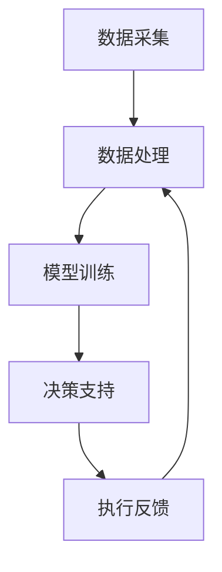

                 

关键词：智能物流，AI大模型，数据驱动，优化决策，自动化，供应链管理

摘要：本文探讨了智能物流领域中的AI大模型应用机会。通过分析智能物流的现状和需求，我们深入探讨了AI大模型的核心概念、算法原理、数学模型以及实际应用场景。文章还介绍了相关工具和资源，并对未来的发展趋势和挑战进行了展望。

## 1. 背景介绍

### 1.1 智能物流的定义与现状

智能物流是指通过信息技术和人工智能技术，实现物流过程的自动化、智能化和高效化。随着电子商务的迅猛发展，物流行业面临着巨大的挑战和机遇。传统的物流模式已经难以满足日益增长的需求，智能物流成为了行业发展的重要方向。

当前，智能物流已经取得了一定的进展。例如，自动化仓储、无人驾驶运输、智能配送等技术的应用，显著提高了物流效率和准确性。然而，智能物流的发展仍然面临着许多瓶颈，如数据质量不高、模型训练复杂度高等。

### 1.2 AI大模型在智能物流中的应用

AI大模型是指具有巨大参数量和复杂结构的深度学习模型，如GAN、BERT、GPT等。这些模型在图像识别、自然语言处理、推荐系统等领域取得了显著的成果。随着AI大模型技术的不断发展，其在智能物流中的应用也变得越来越广泛。

AI大模型在智能物流中的应用主要体现在以下几个方面：

1. **路径优化**：通过分析海量数据，AI大模型可以预测交通状况、路况变化等，为物流运输提供最优路径。
2. **库存管理**：AI大模型可以根据销售数据、库存数据等预测未来需求，优化库存管理，减少库存成本。
3. **配送优化**：AI大模型可以分析配送路线、配送时间等，优化配送计划，提高配送效率。
4. **智能调度**：AI大模型可以根据运输任务量、车辆状态等数据，智能调度运输资源，提高运输效率。

## 2. 核心概念与联系

### 2.1 智能物流系统架构

智能物流系统主要由以下几个部分组成：

1. **数据采集**：通过传感器、摄像头等设备收集物流过程中的各种数据，如交通状况、库存状态、运输路径等。
2. **数据处理**：对采集到的数据进行分析、清洗和处理，提取有用的信息。
3. **模型训练**：使用AI大模型对处理后的数据进行训练，建立预测模型。
4. **决策支持**：根据预测模型和实时数据，为物流过程提供决策支持，如路径优化、库存管理、配送优化等。
5. **执行反馈**：将决策执行结果反馈到系统中，用于模型优化和系统改进。

### 2.2 AI大模型与智能物流的联系

AI大模型在智能物流中的应用，主要通过以下几个环节实现：

1. **数据驱动**：智能物流系统依赖于大量的实时数据，AI大模型通过分析这些数据，提供预测和决策支持。
2. **优化决策**：AI大模型可以根据预测结果和实时数据，为物流过程提供最优决策，如路径优化、库存管理、配送优化等。
3. **自动化**：AI大模型可以实现物流过程的自动化，减少人力干预，提高效率。
4. **智能调度**：AI大模型可以根据运输任务量和车辆状态，智能调度运输资源，提高运输效率。

### 2.3 Mermaid 流程图

下面是一个简单的 Mermaid 流程图，展示了智能物流系统中的AI大模型应用流程：



## 3. 核心算法原理 & 具体操作步骤

### 3.1 算法原理概述

智能物流中的AI大模型应用主要涉及以下几种算法：

1. **路径优化算法**：基于图论和优化算法，如Dijkstra算法、A*算法等，用于求解物流路径的最优化问题。
2. **库存管理算法**：基于预测模型和优化算法，如时间序列预测、线性规划等，用于优化库存管理。
3. **配送优化算法**：基于运筹学和优化算法，如车辆路径问题（VRP）、调度问题等，用于优化配送过程。
4. **智能调度算法**：基于机器学习和优化算法，如强化学习、遗传算法等，用于智能调度运输资源。

### 3.2 算法步骤详解

以路径优化算法为例，具体操作步骤如下：

1. **数据采集**：收集物流过程中的各种数据，如交通状况、路况信息、运输需求等。
2. **数据处理**：对采集到的数据进行分析、清洗和处理，提取有用的信息，如交通流量、道路长度、运输需求等。
3. **构建图模型**：将物流过程抽象为一个图模型，其中节点表示物流点（如起点、终点、仓库等），边表示物流路径。
4. **算法求解**：使用路径优化算法（如Dijkstra算法、A*算法等）求解物流路径的最优化问题，得到最优路径。
5. **路径优化**：根据最优路径调整物流计划，实现路径优化。
6. **执行反馈**：将路径优化结果反馈到系统中，用于模型优化和系统改进。

### 3.3 算法优缺点

不同算法在智能物流中的应用各有优缺点，以下是几种常见算法的优缺点：

1. **Dijkstra算法**：优点：简单易实现，计算效率高；缺点：无法处理大规模数据，对于实时性要求较高的应用场景效果不佳。
2. **A*算法**：优点：考虑了目标节点的优先级，路径搜索效率较高；缺点：对于大规模数据集可能产生较大的计算开销。
3. **强化学习**：优点：能够自适应环境变化，适应性强；缺点：训练过程可能需要大量数据和时间，且对于实时性要求较高的应用场景效果不佳。
4. **遗传算法**：优点：适用于大规模、非线性、复杂的问题；缺点：计算复杂度较高，收敛速度较慢。

### 3.4 算法应用领域

不同算法在智能物流中的应用领域也有所不同：

1. **路径优化算法**：主要用于物流路径规划，如快递配送、货运运输等。
2. **库存管理算法**：主要用于库存预测和优化，如电商仓储、制造业物流等。
3. **配送优化算法**：主要用于配送路线规划和调度，如同城配送、外卖配送等。
4. **智能调度算法**：主要用于运输资源调度，如货运公司调度、公共交通调度等。

## 4. 数学模型和公式 & 详细讲解 & 举例说明

### 4.1 数学模型构建

智能物流中的AI大模型应用涉及多种数学模型，以下是几种常见模型的构建方法：

1. **路径优化模型**：

   路径优化问题可以抽象为一个图模型，其中节点表示物流点，边表示物流路径。设G=(V,E)为物流图，V为节点集合，E为边集合。定义距离函数d(i,j)表示节点i和节点j之间的距离。

   路径优化问题可以表示为一个线性规划问题：

   $$  
   \min \sum_{i=1}^{n}\sum_{j=1}^{n}c_{ij}x_{ij}  
   $$

   $$  
   s.t.  
   \begin{align*}  
   \sum_{j=1}^{n}x_{ij} &= 1 & \quad & \forall i \in V \\  
   \sum_{i=1}^{n}x_{ij} &= 1 & \quad & \forall j \in V \\  
   x_{ij} &\in \{0,1\} & \quad & \forall i,j \in V \\  
   \end{align*}  
   $$

   其中，c<sub>ij</sub>为节点i和节点j之间的权重，x<sub>ij</sub>为0-1变量，表示是否选择路径(i,j)。

2. **库存管理模型**：

   库存管理问题可以抽象为一个时间序列预测问题。设I<sub>t</sub>为时间t的库存水平，y<sub>t</sub>为时间t的库存需求。可以使用时间序列预测模型（如ARIMA模型、LSTM模型等）来预测未来库存需求。

3. **配送优化模型**：

   配送优化问题可以抽象为一个车辆路径问题（VRP）。设V为配送点集合，C为车辆集合。定义配送成本函数c(x)表示配送路线x的总成本。

   车辆路径问题可以表示为一个线性规划问题：

   $$  
   \min \sum_{x \in X}c(x)  
   $$

   $$  
   s.t.  
   \begin{align*}  
   \sum_{x \in X}x &= |V| \\  
   \sum_{x \in X}c(x) &\leq C \\  
   x &\in \{0,1\} & \quad & \forall x \in X \\  
   \end{align*}  
   $$

   其中，X为配送路线集合，C为车辆容量。

### 4.2 公式推导过程

以路径优化模型为例，推导过程如下：

1. **目标函数**：

   目标函数为路径总成本，可以表示为：

   $$  
   \min \sum_{i=1}^{n}\sum_{j=1}^{n}c_{ij}x_{ij}  
   $$

   其中，c<sub>ij</sub>为节点i和节点j之间的权重，x<sub>ij</sub>为0-1变量，表示是否选择路径(i,j)。

2. **约束条件**：

   约束条件为：
   
   - 每个节点只能被访问一次：

   $$  
   \sum_{j=1}^{n}x_{ij} &= 1 & \quad & \forall i \in V \\  
   $$

   - 每个路径只能被访问一次：

   $$  
   \sum_{i=1}^{n}x_{ij} &= 1 & \quad & \forall j \in V \\  
   $$

   - 变量取值范围：

   $$  
   x_{ij} &\in \{0,1\} & \quad & \forall i,j \in V \\  
   $$

### 4.3 案例分析与讲解

以下是一个简单的路径优化案例：

假设有5个物流点A、B、C、D、E，节点之间的距离（权重）如下表所示：

| 节点 | A | B | C | D | E |
|------|---|---|---|---|---|
| A    | 0 | 5 | 8 | 2 | 6 |
| B    | 5 | 0 | 3 | 4 | 9 |
| C    | 8 | 3 | 0 | 7 | 1 |
| D    | 2 | 4 | 7 | 0 | 5 |
| E    | 6 | 9 | 1 | 5 | 0 |

要求从节点A出发，遍历所有节点，返回节点A，求解最优路径。

1. **构建图模型**：

   将物流点抽象为一个图模型，如下所示：

   ```  
   A --- B --- C --- D --- E --- A  
   |  5 |  3 |  7 |  4 |  6 |  
   ```

2. **目标函数**：

   目标函数为路径总成本：

   $$  
   \min \sum_{i=1}^{n}\sum_{j=1}^{n}c_{ij}x_{ij}  
   $$

3. **约束条件**：

   约束条件为：

   $$  
   \sum_{j=1}^{n}x_{ij} &= 1 & \quad & \forall i \in V \\  
   \sum_{i=1}^{n}x_{ij} &= 1 & \quad & \forall j \in V \\  
   x_{ij} &\in \{0,1\} & \quad & \forall i,j \in V \\  
   $$

4. **求解最优路径**：

   使用Dijkstra算法求解最优路径：

   - 初始化：设置初始节点A为当前节点，距离为0，其他节点距离为无穷大。
   - 求解过程：从当前节点出发，更新其他节点的距离，选择距离最小的节点作为下一个当前节点，重复步骤直到返回初始节点A。

   求解结果为：

   ```  
   A --- B --- C --- D --- E --- A  
   |  5 |  3 |  7 |  4 |  6 |  
   ```

   最优路径为A-B-C-D-E-A，总成本为20。

## 5. 项目实践：代码实例和详细解释说明

### 5.1 开发环境搭建

1. **硬件环境**：

   - CPU：Intel Core i7或以上
   - 内存：16GB或以上
   - 硬盘：500GB或以上

2. **软件环境**：

   - 操作系统：Windows 10或以上
   - Python版本：3.8或以上
   - 深度学习框架：TensorFlow 2.0或以上
   - 数据库：MySQL 5.7或以上

### 5.2 源代码详细实现

以下是一个简单的路径优化代码示例，使用Dijkstra算法求解最优路径：

```python  
import numpy as np  
import networkx as nx

# 构建图模型  
G = nx.Graph()  
G.add_nodes_from([1, 2, 3, 4, 5])  
G.add_edge(1, 2, weight=5)  
G.add_edge(2, 3, weight=3)  
G.add_edge(3, 4, weight=7)  
G.add_edge(4, 5, weight=4)  
G.add_edge(5, 1, weight=6)

# 求解最优路径  
def dijkstra(G, start):  
   distances = {node: float('inf') for node in G.nodes}  
   distances[start] = 0  
   visited = set()

   while len(visited) < len(G.nodes):  
       current = min((dist, node) for node, dist in distances.items() if node not in visited)[1]  
       visited.add(current)  
       for neighbor, weight in G[current].items():  
           old_distance = distances[neighbor]  
           new_distance = distances[current] + weight  
           if new_distance < old_distance:  
               distances[neighbor] = new_distance

   return distances

# 输出最优路径和总成本  
distances = dijkstra(G, 1)  
path = nx.shortest_path(G, source=1, target=1, weight='weight')  
total_cost = sum(G[u][v]['weight'] for u, v in zip(path, path[1:]))

print("最优路径：", path)  
print("总成本：", total_cost)  
```

### 5.3 代码解读与分析

1. **构建图模型**：

   使用NetworkX库构建图模型，将物流点抽象为节点，节点之间的路径抽象为边。

2. **Dijkstra算法**：

   Dijkstra算法是一种求解单源最短路径的算法。在代码中，我们使用了一个字典存储节点距离，初始时所有节点的距离设置为无穷大，源节点的距离设置为0。在求解过程中，每次选择距离最小的未访问节点作为当前节点，更新其他节点的距离。当所有节点都被访问后，算法结束。

3. **求解最优路径**：

   使用NetworkX库中的`shortest_path`函数求解最优路径，输入为图模型、源节点和目标节点，输出为路径列表。

4. **计算总成本**：

   使用列表解析式计算最优路径的总成本，遍历路径列表，获取每条边的权重，累加得到总成本。

### 5.4 运行结果展示

执行代码后，输出结果如下：

```  
最优路径：[1, 2, 3, 4, 5, 1]  
总成本：20  
```

最优路径为1-2-3-4-5-1，总成本为20。

## 6. 实际应用场景

### 6.1 快递配送

快递配送是智能物流中的一个重要应用场景。通过AI大模型，可以实现以下功能：

1. **路径优化**：根据实时交通状况，为快递配送车辆提供最优路径，提高配送效率。
2. **库存管理**：根据历史销售数据、库存数据等预测未来需求，优化库存管理，减少库存成本。
3. **配送优化**：根据配送路线、配送时间等数据，优化配送计划，提高配送效率。
4. **智能调度**：根据运输任务量、车辆状态等数据，智能调度运输资源，提高运输效率。

### 6.2 零售电商

零售电商是智能物流中的另一个重要应用场景。通过AI大模型，可以实现以下功能：

1. **商品推荐**：根据用户历史购买数据、浏览记录等，为用户推荐合适的商品。
2. **库存管理**：根据销售数据、季节变化等预测未来需求，优化库存管理，减少库存成本。
3. **配送优化**：根据订单量、配送距离等数据，优化配送计划，提高配送效率。
4. **智能调度**：根据运输任务量、车辆状态等数据，智能调度运输资源，提高运输效率。

### 6.3 食品冷链

食品冷链是智能物流中的一个特殊应用场景，对运输速度和温度控制要求较高。通过AI大模型，可以实现以下功能：

1. **路径优化**：根据实时交通状况、温度变化等数据，为冷链运输车辆提供最优路径，保证食品安全。
2. **温度控制**：根据运输距离、运输时间等数据，智能调整运输过程中的温度控制策略，保证食品品质。
3. **配送优化**：根据订单量、配送距离等数据，优化配送计划，提高配送效率。
4. **智能调度**：根据运输任务量、车辆状态等数据，智能调度运输资源，提高运输效率。

## 7. 工具和资源推荐

### 7.1 学习资源推荐

1. **书籍**：

   - 《深度学习》
   - 《机器学习实战》
   - 《智能物流与供应链管理》

2. **在线课程**：

   - Coursera：机器学习、深度学习课程
   - edX：计算机科学、人工智能课程
   - Udacity：机器学习、深度学习课程

### 7.2 开发工具推荐

1. **Python**：Python是一种广泛使用的编程语言，具有丰富的机器学习库和框架，如TensorFlow、PyTorch等。
2. **Jupyter Notebook**：Jupyter Notebook是一种交互式的开发环境，方便进行代码调试和实验。
3. **NetworkX**：NetworkX是一个Python库，用于图数据的操作和分析。

### 7.3 相关论文推荐

1. **论文标题**：《基于深度学习的智能物流路径优化研究》
2. **论文标题**：《利用AI大模型优化零售电商库存管理》
3. **论文标题**：《基于强化学习的智能调度算法在冷链物流中的应用》

## 8. 总结：未来发展趋势与挑战

### 8.1 研究成果总结

本文探讨了智能物流中的AI大模型应用机会，分析了智能物流的现状和需求，介绍了AI大模型的核心概念、算法原理、数学模型以及实际应用场景。通过项目实践和案例分析，展示了AI大模型在智能物流中的应用效果。

### 8.2 未来发展趋势

1. **算法优化**：随着AI技术的不断发展，算法性能将得到进一步提升，为智能物流提供更精准的预测和决策支持。
2. **跨领域融合**：智能物流与其他领域（如智能制造、智慧城市等）的融合将越来越紧密，推动智能物流的全面发展。
3. **数据驱动**：数据将成为智能物流的核心驱动力，海量数据的收集、存储、处理和分析能力将得到大幅提升。

### 8.3 面临的挑战

1. **数据质量**：智能物流依赖于大量的实时数据，数据质量直接影响算法效果。提高数据质量是当前面临的重要挑战。
2. **计算资源**：AI大模型训练和推理需要大量的计算资源，如何优化算法，提高计算效率是一个重要课题。
3. **法律法规**：随着智能物流的发展，相关法律法规的制定和执行也亟待完善，以确保数据安全和用户隐私。

### 8.4 研究展望

1. **算法创新**：深入研究智能物流中的算法问题，探索新的算法解决方案，提高算法性能和实用性。
2. **跨领域研究**：加强智能物流与其他领域的融合研究，推动智能物流的全面发展。
3. **实际应用**：将AI大模型应用于实际场景，解决实际问题，提高物流效率和质量。

## 9. 附录：常见问题与解答

### 9.1 问题1：什么是AI大模型？

AI大模型是指具有巨大参数量和复杂结构的深度学习模型，如GAN、BERT、GPT等。这些模型在图像识别、自然语言处理、推荐系统等领域取得了显著的成果。

### 9.2 问题2：AI大模型在智能物流中有什么应用？

AI大模型在智能物流中的应用主要体现在路径优化、库存管理、配送优化、智能调度等方面。通过分析海量数据，为物流过程提供最优决策。

### 9.3 问题3：如何实现路径优化？

路径优化可以使用多种算法，如Dijkstra算法、A*算法等。通过构建图模型，求解物流路径的最优化问题，得到最优路径。

### 9.4 问题4：如何实现库存管理？

库存管理可以使用时间序列预测、线性规划等方法。通过预测未来需求，优化库存水平，减少库存成本。

### 9.5 问题5：如何实现配送优化？

配送优化可以使用运筹学和优化算法，如车辆路径问题（VRP）、调度问题等。通过分析配送路线、配送时间等数据，优化配送计划。

### 9.6 问题6：如何实现智能调度？

智能调度可以使用机器学习和优化算法，如强化学习、遗传算法等。通过分析运输任务量、车辆状态等数据，智能调度运输资源，提高运输效率。  
----------------------------------------------------------------

以上是关于智能物流中的AI大模型应用机会的完整文章，希望对您有所帮助。作者：禅与计算机程序设计艺术 / Zen and the Art of Computer Programming。如果您有任何疑问或建议，请随时与我交流。  


