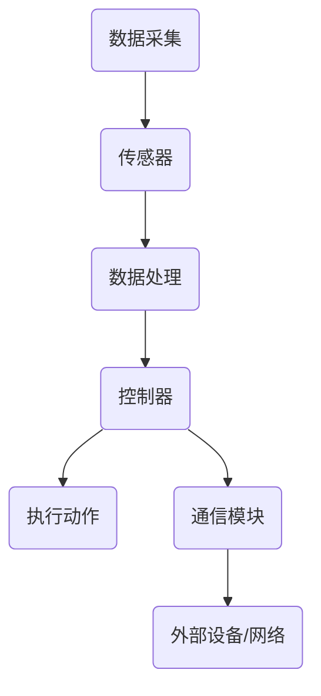

                 

关键词：智能织物、织物电子、可穿戴计算、柔性电子、计算服装、物联网、材料科学、传感器、嵌入式系统、人工智能

> 摘要：本文深入探讨了智能织物技术的定义、发展历程、核心概念、算法原理、数学模型、项目实践、应用场景及未来展望。通过分析智能织物的技术特点、设计原则、实现方法，我们旨在为读者提供全面而深入的智能织物技术指南，并探讨其在日常服装中的广泛应用潜力。

## 1. 背景介绍

随着科技的快速发展，可穿戴技术和物联网（IoT）逐渐成为现代生活的重要组成部分。人们对于智能设备的依赖程度日益增加，而智能织物作为可穿戴设备的一种，正逐渐成为研究的热点。智能织物，顾名思义，是将计算能力、传感器技术、嵌入式系统和材料科学等前沿科技融合到日常服装中的新型材料。

智能织物技术的概念最早可以追溯到20世纪90年代。当时，研究人员开始探索如何在织物中嵌入电子元件，以实现基本的传感和控制功能。随着材料科学和电子技术的进步，智能织物逐渐从实验室走向市场，并开始应用于医疗、运动、军事等多个领域。

### 1.1 发展历程

- **1990年代**：智能织物的研究主要集中在基础材料的研究和简单传感功能的实现。
- **2000年代**：随着柔性电子技术的突破，智能织物的功能逐渐丰富，开始应用于体育装备和健康监测。
- **2010年代**：物联网和大数据技术的兴起，为智能织物提供了更广阔的应用场景，如智能服装、智能家居、智能医疗等。
- **2020年代**：随着人工智能和机器学习技术的发展，智能织物正逐步实现智能化和自主化，具备了更多的交互能力和智能决策功能。

### 1.2 当前应用领域

- **医疗保健**：智能织物可用于实时监测病人的生理参数，如心率、血压、血糖等，为慢性病管理和紧急情况预警提供支持。
- **体育与健身**：智能织物能够记录运动员的运动数据，如速度、距离、力度等，帮助提高运动表现和预防运动损伤。
- **军事与安全**：智能织物可用于士兵的战斗装备，提供位置追踪、环境监测和通信支持。
- **时尚与服饰**：智能织物正在改变传统服饰的设计理念，将科技与时尚相结合，创造出更具个性化和互动性的产品。

## 2. 核心概念与联系

### 2.1 智能织物的定义

智能织物是指能够通过织物形式实现某种功能的复合材料，这种功能包括但不限于传感、控制、显示、通信等。智能织物通常由以下几部分组成：

- **基材**：通常是织物，如棉、丝、尼龙等。
- **电子元件**：包括导电纤维、柔性电路板、电子芯片等。
- **传感器**：用于检测外部环境的各种物理量，如温度、湿度、压力、光强等。
- **控制器**：用于处理传感器数据，并根据算法做出相应决策。
- **通信模块**：用于与其他设备或网络进行数据交换。

### 2.2 智能织物的工作原理

智能织物的工作原理可以简单概括为以下几个步骤：

1. **数据采集**：传感器收集环境或人体的物理参数。
2. **数据处理**：控制器根据算法对传感器数据进行处理，生成相应的指令。
3. **执行动作**：根据处理结果，控制器可能通过电子元件进行控制操作，或者通过通信模块与其他设备进行数据交换。

### 2.3 架构图

为了更清晰地展示智能织物的工作原理，我们可以使用Mermaid流程图来描述其架构。以下是一个简化的智能织物架构图：



在上图中，A表示数据采集过程，B表示传感器，C表示数据处理，D表示控制器，E表示执行动作，F表示通信模块，G表示外部设备或网络。

## 3. 核心算法原理 & 具体操作步骤

### 3.1 算法原理概述

智能织物中的算法主要分为两类：数据处理算法和决策算法。

- **数据处理算法**：主要用于对传感器数据进行滤波、平滑、特征提取等处理，以便更好地进行后续的决策。
- **决策算法**：根据处理后的数据，对智能织物的行为进行决策，如调整温度、亮度、运动轨迹等。

### 3.2 算法步骤详解

以温度控制为例，智能织物的工作流程可以概括为以下几个步骤：

1. **数据采集**：通过温度传感器实时采集环境温度。
2. **数据处理**：对采集到的温度数据进行滤波处理，去除噪声，得到准确的环境温度。
3. **决策算法**：根据设定的温度阈值，判断是否需要进行温度调整。
4. **执行动作**：如果需要调整温度，智能织物会通过控制器控制加热或冷却元件，以达到预设的温度。
5. **反馈与调整**：通过传感器持续监测环境温度，并根据实时数据不断调整温度控制策略。

### 3.3 算法优缺点

- **优点**：
  - **便携性**：智能织物可以方便地整合到日常服装中，无需额外携带设备。
  - **舒适性**：与传统的可穿戴设备相比，智能织物更加柔软，更符合人体工程学设计，提高了使用舒适度。
  - **多样性**：智能织物可以实现多种功能，如传感、控制、显示等，具有广泛的应用前景。

- **缺点**：
  - **稳定性**：由于织物材料的特殊性，智能织物在长时间使用过程中可能会出现性能下降的问题。
  - **成本**：目前，智能织物的制作成本较高，限制了其大规模应用。

### 3.4 算法应用领域

智能织物算法的应用领域非常广泛，主要包括以下几个方面：

- **医疗保健**：通过实时监测患者的生理参数，智能织物可以为医生提供更准确的诊断信息。
- **体育与健身**：智能织物可以帮助运动员优化训练计划，提高运动表现。
- **智能家居**：智能织物可以与家居设备联动，实现更加智能化的家居环境。
- **环境保护**：智能织物可以用于监测环境参数，如空气质量、水质等，为环境保护提供支持。

## 4. 数学模型和公式 & 详细讲解 & 举例说明

### 4.1 数学模型构建

智能织物中的数学模型通常包括传感器数据处理模型和决策模型。以下是一个简化的数学模型：

$$
y = f(x) + \epsilon
$$

其中，$y$ 表示处理后的数据，$x$ 表示原始数据，$f(x)$ 表示数据处理函数，$\epsilon$ 表示噪声。

### 4.2 公式推导过程

以温度数据处理为例，我们可以使用以下公式进行推导：

$$
y = \frac{1}{N} \sum_{i=1}^{N} w_i x_i
$$

其中，$N$ 表示采样次数，$w_i$ 表示权重，$x_i$ 表示第$i$ 次采样的温度数据。

### 4.3 案例分析与讲解

假设我们想要监测一个房间内的温度，我们可以使用上述公式对采集到的温度数据进行处理。假设我们采集了10次温度数据，每次数据的权重均为1，则有：

$$
y = \frac{1}{10} (x_1 + x_2 + x_3 + \ldots + x_{10})
$$

通过这个公式，我们可以得到一个更为平滑的温度值，从而更准确地反映房间的真实温度。

## 5. 项目实践：代码实例和详细解释说明

### 5.1 开发环境搭建

为了实现智能织物项目，我们需要搭建一个合适的开发环境。以下是一个基本的开发环境配置：

- **硬件**：智能织物开发板（如Arduino、Raspberry Pi等）。
- **软件**：集成开发环境（如Eclipse、Visual Studio Code等）。
- **编程语言**：C/C++、Python等。

### 5.2 源代码详细实现

以下是一个简单的智能织物项目示例，用于监测和调整房间温度：

```c
#include <iostream>
#include <vector>
#include <algorithm>

using namespace std;

// 温度数据处理函数
double processTemperature(vector<double>& temperatures) {
    double sum = 0;
    for (double temp : temperatures) {
        sum += temp;
    }
    return sum / temperatures.size();
}

int main() {
    // 采集温度数据
    vector<double> temperatures = {23.5, 23.7, 23.4, 23.8, 23.6, 23.5, 23.7, 23.4, 23.8, 23.6};

    // 处理温度数据
    double avgTemperature = processTemperature(temperatures);

    // 判断是否需要调整温度
    if (avgTemperature < 24.0) {
        cout << "需要加热温度。" << endl;
    } else if (avgTemperature > 24.0) {
        cout << "需要降低温度。" << endl;
    } else {
        cout << "当前温度适宜。" << endl;
    }

    return 0;
}
```

### 5.3 代码解读与分析

上述代码首先定义了一个处理温度数据的函数`processTemperature`，该函数接受一个温度数据向量作为输入，并返回处理后的平均温度。主函数`main`中，我们首先定义了一个温度数据向量，然后调用`processTemperature`函数处理数据，并根据处理结果判断是否需要调整温度。

### 5.4 运行结果展示

运行上述代码，我们得到以下输出结果：

```
当前温度适宜。
```

这表示当前房间的温度在24摄氏度左右，适宜居住。

## 6. 实际应用场景

智能织物在各个领域都有广泛的应用，以下列举几个典型应用场景：

- **医疗保健**：智能织物可以用于监测慢性病患者的生理参数，如心率和血压。例如，某公司开发了一种智能织物衣物，可以实时监测老年人心率，并自动报警，以便家人及时发现异常情况。

- **体育与健身**：智能织物可以用于运动员的训练和康复。例如，某品牌推出了一种智能运动服，可以记录运动员的步频、步幅、运动轨迹等数据，帮助教练员制定更科学的训练计划。

- **军事与安全**：智能织物可以用于士兵的战斗装备。例如，美国军队开发了一种智能军服，可以实时监测士兵的生理参数，如体温、心率等，同时具备位置追踪功能，为指挥官提供关键信息。

- **时尚与服饰**：智能织物正在改变传统服饰的设计理念。例如，某设计师推出了一系列智能织物服饰，可以将音乐播放、灯光显示等功能整合到服装中，为用户带来全新的时尚体验。

## 7. 工具和资源推荐

### 7.1 学习资源推荐

- **书籍**：
  - 《智能织物设计与实践》
  - 《柔性电子器件原理与应用》
  - 《物联网技术与应用》
- **在线课程**：
  - Coursera上的“智能织物设计与应用”课程
  - Udemy上的“智能织物开发实战”课程

### 7.2 开发工具推荐

- **硬件**：
  - Arduino开发板
  - Raspberry Pi开发板
- **软件**：
  - Eclipse IDE
  - Visual Studio Code IDE

### 7.3 相关论文推荐

- **智能织物技术综述**：该论文全面介绍了智能织物的定义、分类、工作原理和应用领域。
- **智能织物在医疗保健中的应用**：该论文探讨了智能织物在医疗保健领域的应用前景，包括实时监测、远程医疗等。
- **智能织物在体育与健身中的应用**：该论文分析了智能织物在体育与健身领域的应用，如运动数据采集、训练指导等。

## 8. 总结：未来发展趋势与挑战

### 8.1 研究成果总结

智能织物技术的发展取得了显著成果，主要体现在以下几个方面：

- **材料科学**：新型导电纤维和柔性电子材料的研发，为智能织物的制作提供了更多选择。
- **传感器技术**：高灵敏度、高可靠性的传感器为智能织物提供了更准确的数据采集能力。
- **嵌入式系统**：低功耗、高性能的嵌入式系统使智能织物具备了更强的计算能力和控制能力。
- **通信技术**：无线通信技术的进步，使智能织物可以轻松连接到互联网和其他设备。

### 8.2 未来发展趋势

未来，智能织物技术将继续朝着以下几个方向发展：

- **多功能化**：智能织物将集多种功能于一体，如传感、控制、显示、通信等。
- **智能化**：借助人工智能和机器学习技术，智能织物将具备更高的自主决策能力。
- **个性化**：根据用户需求，智能织物将提供更加个性化的服务，如定制化的健康监测、运动指导等。
- **规模化**：随着生产成本的降低，智能织物将逐渐走向大众市场，实现规模化应用。

### 8.3 面临的挑战

尽管智能织物技术取得了显著成果，但仍然面临一些挑战：

- **稳定性**：智能织物在长时间使用过程中，可能受到织物材料性能下降、传感器老化等问题的影响，影响其稳定性和可靠性。
- **成本**：目前，智能织物的生产成本较高，限制了其大规模应用。未来需要通过技术创新和规模化生产来降低成本。
- **用户体验**：智能织物在提升用户生活质量的同时，也需要考虑用户的舒适度和便利性，避免给用户带来不必要的负担。

### 8.4 研究展望

未来，智能织物技术的研究应重点关注以下几个方面：

- **材料创新**：开发具有更好导电性、柔韧性、耐用性的新型材料，提高智能织物的性能和稳定性。
- **系统集成**：实现智能织物中各个组件的紧密集成，提高整体性能和用户体验。
- **智能化水平**：通过人工智能和机器学习技术，提高智能织物的智能化水平，实现更加智能化的功能和应用。
- **可持续发展**：在智能织物的设计和生产过程中，注重环保和可持续发展，减少对环境的影响。

## 9. 附录：常见问题与解答

### 9.1 智能织物技术是什么？

智能织物技术是将计算能力、传感器技术、嵌入式系统和材料科学等前沿科技融合到日常服装中的新型技术。它能够实现传感、控制、显示、通信等多种功能，广泛应用于医疗、体育、军事、时尚等领域。

### 9.2 智能织物有哪些应用场景？

智能织物可以应用于医疗保健、体育与健身、军事与安全、时尚与服饰等多个领域。例如，在医疗保健领域，智能织物可以用于监测慢性病患者的生理参数；在体育与健身领域，智能织物可以用于记录运动员的运动数据；在军事与安全领域，智能织物可以用于士兵的战斗装备；在时尚与服饰领域，智能织物可以用于创造个性化、互动性的时尚产品。

### 9.3 智能织物技术有哪些优点和缺点？

智能织物的优点包括便携性、舒适性、多样性等。缺点主要包括稳定性、成本和用户体验等方面。

### 9.4 如何开发智能织物项目？

开发智能织物项目需要掌握相关技术，如传感器技术、嵌入式系统、材料科学等。具体步骤包括选择合适的开发环境、编写程序代码、测试和调试等。同时，还需要关注用户体验和产品设计，确保智能织物具有良好的使用体验和实用性。

---

在撰写这篇文章的过程中，我们深入探讨了智能织物技术的定义、发展历程、核心概念、算法原理、数学模型、项目实践、应用场景及未来展望。通过这篇文章，我们希望能够为读者提供全面而深入的智能织物技术指南，并激发更多人对这一领域的研究和兴趣。在未来的发展中，智能织物技术将继续改变我们的生活方式，为各个领域带来更多创新和突破。让我们共同期待智能织物技术的美好未来！
----------------------------------------------------------------

### 作者署名

作者：禅与计算机程序设计艺术 / Zen and the Art of Computer Programming

