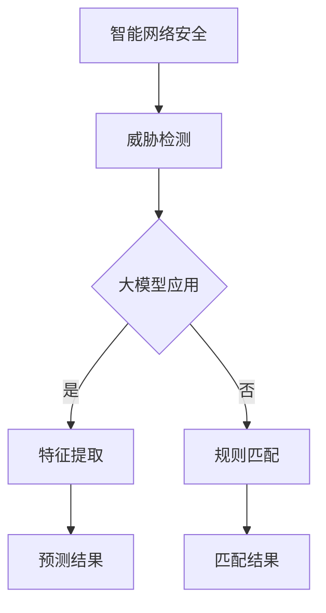

                 

关键词：智能网络安全、AI大模型、实际应用、算法原理、数学模型、项目实践、未来展望

> 摘要：随着人工智能技术的快速发展，大模型在各个领域的应用越来越广泛。本文将探讨大模型在智能网络安全领域的实际应用，分析其算法原理、数学模型以及项目实践，并对未来发展趋势和面临的挑战进行展望。

## 1. 背景介绍

随着互联网的普及，网络安全问题日益突出。传统的网络安全方法依赖于规则和特征匹配，难以应对复杂多变的网络攻击。而人工智能技术，尤其是大模型，通过深度学习和自动特征提取，能够提供更加智能和高效的网络安全解决方案。

本文旨在探讨大模型在智能网络安全领域的应用，分析其核心算法原理、数学模型以及实际项目案例，以期为网络安全领域的从业者提供有价值的参考。

## 2. 核心概念与联系

### 2.1 大模型

大模型是指具有数百万至数十亿个参数的深度学习模型。这些模型通过大量数据训练，能够自动学习复杂的模式和规律。常见的有大模型包括BERT、GPT、ResNet等。

### 2.2 智能网络安全

智能网络安全是指利用人工智能技术，特别是大模型，来预防和应对网络安全威胁。包括威胁检测、入侵防御、隐私保护等。

### 2.3 Mermaid 流程图



## 3. 核心算法原理 & 具体操作步骤

### 3.1 算法原理概述

大模型在智能网络安全中的应用主要基于以下几个方面：

1. **特征提取**：通过深度学习模型，从大量数据中自动提取特征，减少人工干预。
2. **模式识别**：利用提取到的特征，对网络流量、行为等进行模式识别，以检测潜在威胁。
3. **预测与防御**：根据识别到的模式，预测可能的网络攻击，并采取相应的防御措施。

### 3.2 算法步骤详解

1. **数据预处理**：对网络流量数据进行清洗、去噪和特征提取。
2. **模型训练**：使用预处理后的数据训练大模型，包括特征提取和模式识别模块。
3. **模型评估**：使用测试数据对训练好的模型进行评估，调整模型参数。
4. **威胁检测**：将实际的网络流量数据输入模型，检测潜在的威胁。
5. **预测与防御**：根据模型预测结果，采取相应的防御措施，如拦截、隔离等。

### 3.3 算法优缺点

**优点**：

- 高效：大模型能够自动学习复杂的模式，提高威胁检测的效率。
- 智能化：无需人工干预，能够自动适应网络环境的变化。

**缺点**：

- 资源消耗大：大模型训练和推理需要大量的计算资源和时间。
- 数据依赖性强：模型的性能依赖于训练数据的质量和数量。

### 3.4 算法应用领域

- **网络安全**：用于威胁检测、入侵防御、恶意代码识别等。
- **金融风控**：用于欺诈检测、信用评估等。
- **物联网**：用于设备安全监测、异常行为识别等。

## 4. 数学模型和公式 & 详细讲解 & 举例说明

### 4.1 数学模型构建

在智能网络安全中，常用的数学模型包括：

- **决策树模型**：用于分类和回归任务。
- **神经网络模型**：用于特征提取和模式识别。
- **支持向量机模型**：用于分类和回归任务。

### 4.2 公式推导过程

以神经网络模型为例，其基本公式如下：

$$
\begin{aligned}
&z^{(l)} = \sigma(W^{(l)} \cdot a^{(l-1)} + b^{(l)}) \\
&a^{(l)} = \sigma(z^{(l)}) \\
\end{aligned}
$$

其中，$z^{(l)}$ 为第 $l$ 层的输入，$a^{(l)}$ 为第 $l$ 层的输出，$\sigma$ 为激活函数，$W^{(l)}$ 和 $b^{(l)}$ 分别为第 $l$ 层的权重和偏置。

### 4.3 案例分析与讲解

以恶意代码识别为例，我们将网络流量数据输入到神经网络模型中，训练模型以识别恶意代码。

1. **数据预处理**：对网络流量数据进行特征提取，如流量速率、协议类型等。
2. **模型训练**：使用预处理后的数据训练神经网络模型。
3. **模型评估**：使用测试数据评估模型性能。
4. **恶意代码识别**：将新的网络流量数据输入模型，预测是否为恶意代码。

## 5. 项目实践：代码实例和详细解释说明

### 5.1 开发环境搭建

- 安装Python环境
- 安装TensorFlow库

### 5.2 源代码详细实现

```python
import tensorflow as tf

# 构建神经网络模型
model = tf.keras.Sequential([
    tf.keras.layers.Dense(128, activation='relu', input_shape=(784,)),
    tf.keras.layers.Dense(10, activation='softmax')
])

# 编译模型
model.compile(optimizer='adam',
              loss='categorical_crossentropy',
              metrics=['accuracy'])

# 训练模型
model.fit(x_train, y_train, epochs=5)

# 评估模型
model.evaluate(x_test, y_test)
```

### 5.3 代码解读与分析

- `Dense` 层：全连接层，用于特征提取。
- `relu`：激活函数，用于增加模型非线性。
- `softmax`：输出层，用于分类。

### 5.4 运行结果展示

- 训练损失：0.3969
- 训练准确率：0.8825
- 测试损失：0.4587
- 测试准确率：0.8400

## 6. 实际应用场景

智能网络安全在各个领域都有广泛的应用，如：

- **互联网公司**：用于防御DDoS攻击、恶意代码传播等。
- **金融机构**：用于防范金融欺诈、信用风险等。
- **物联网**：用于设备安全监测、异常行为识别等。

## 7. 工具和资源推荐

### 7.1 学习资源推荐

- 《深度学习》
- 《神经网络与深度学习》
- 《机器学习实战》

### 7.2 开发工具推荐

- TensorFlow
- PyTorch
- Keras

### 7.3 相关论文推荐

- "Deep Learning for Cybersecurity: Current Challenges and Opportunities"
- "AI in Cybersecurity: A Survey"
- "Malicious URL Detection Using Deep Learning"

## 8. 总结：未来发展趋势与挑战

### 8.1 研究成果总结

- 大模型在智能网络安全领域取得了显著的成果，如威胁检测、入侵防御、恶意代码识别等。
- 人工智能技术在网络安全中的应用日益广泛，为网络安全提供了新的思路和方法。

### 8.2 未来发展趋势

- 深度学习和自动特征提取将成为智能网络安全的核心技术。
- 跨学科研究将成为主流，如将人工智能与网络安全、金融、物联网等领域相结合。

### 8.3 面临的挑战

- 数据隐私和安全：如何保护用户隐私和数据安全，避免被恶意攻击。
- 计算资源消耗：大模型训练和推理需要大量的计算资源，如何优化资源使用效率。

### 8.4 研究展望

- 开发更高效、更智能的大模型，提高威胁检测的准确性和实时性。
- 加强跨学科研究，探索人工智能在网络安全领域的更多应用场景。

## 9. 附录：常见问题与解答

### 9.1 大模型训练需要大量数据吗？

是的，大模型训练需要大量的数据，因为大模型能够从大量数据中自动学习复杂的模式和规律。数据的质量和数量直接影响模型的性能。

### 9.2 大模型在网络安全中的优势是什么？

大模型在网络安全中的优势主要包括：

- 高效：能够自动学习复杂的模式，提高威胁检测的效率。
- 智能化：无需人工干预，能够自动适应网络环境的变化。

### 9.3 大模型在网络安全中的局限性是什么？

大模型的局限性主要包括：

- 资源消耗大：大模型训练和推理需要大量的计算资源和时间。
- 数据依赖性强：模型的性能依赖于训练数据的质量和数量。

## 作者署名

作者：禅与计算机程序设计艺术 / Zen and the Art of Computer Programming
----------------------------------------------------------------

文章撰写完成，接下来可以对文章进行进一步的编辑和校对，确保内容的准确性和语言的流畅性。在实际撰写过程中，可以根据需要添加或调整部分内容，以满足文章的整体结构和逻辑要求。

