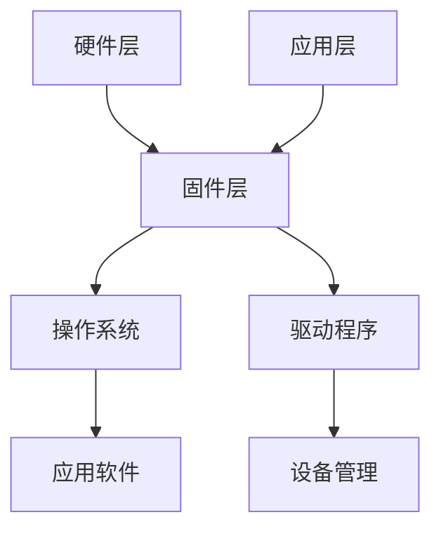
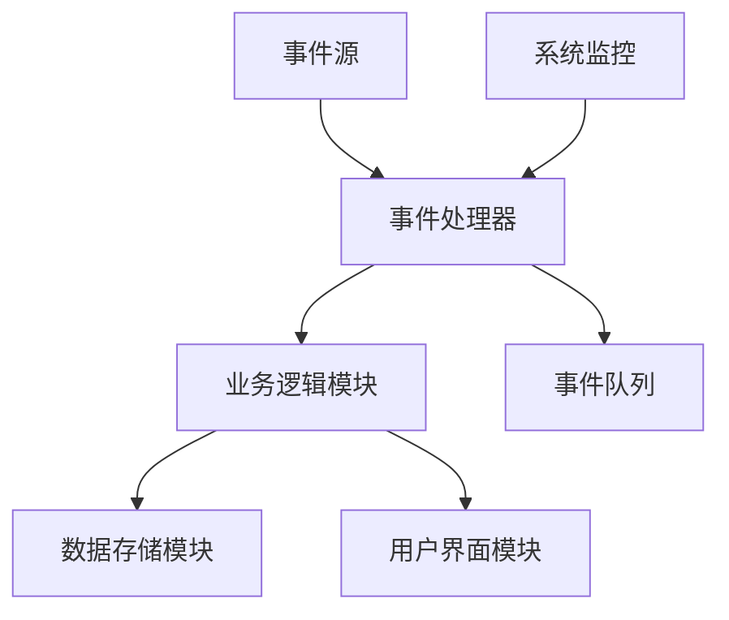

                 

 在当今的数字化时代，智能设备已成为我们日常生活不可或缺的一部分。从智能手机到智能家居，嵌入式系统在智能设备中的重要性日益凸显。本文将深入探讨嵌入式系统设计与优化的关键要点，旨在为开发者提供一套系统性的理论框架和实践指导。

## 关键词
- 智能设备
- 嵌入式系统
- 设计优化
- 硬件选择
- 软件架构
- 系统集成
- 安全性
- 性能优化

## 摘要
本文首先介绍了嵌入式系统的基本概念和发展历程，然后探讨了智能设备开发中的核心问题，包括硬件选择、软件架构设计、系统集成和性能优化。接着，文章详细阐述了如何通过数学模型和算法原理来提高嵌入式系统的性能和可靠性。最后，文章通过实际项目实践展示了如何将理论应用于实际开发中，并展望了嵌入式系统的未来发展趋势。

## 1. 背景介绍

### 嵌入式系统的定义与发展

嵌入式系统（Embedded System）是一种专门为特定任务而设计的计算机系统，它通常由微处理器、存储器、输入输出接口以及其他必要的外围设备组成。与通用计算机系统不同，嵌入式系统通常具有以下特点：

1. **专用性**：嵌入式系统为特定的应用而设计，执行单一或有限的任务。
2. **资源受限**：嵌入式系统通常资源有限，包括内存、处理能力和功耗。
3. **实时性**：许多嵌入式系统要求实时响应，即必须在规定的时间内完成特定的任务。

嵌入式系统的发展可以追溯到20世纪60年代，随着微电子技术和计算机技术的飞速发展，嵌入式系统逐渐应用于各种领域，如工业控制、消费电子、医疗设备、汽车电子等。

### 智能设备的崛起

智能设备（Smart Devices）是指具备一定智能功能的设备，能够通过软件进行功能扩展和更新。随着物联网（IoT）和人工智能（AI）技术的发展，智能设备越来越普及。以下是智能设备的主要特点：

1. **互联互通**：智能设备能够通过无线网络与其他设备、服务器进行通信，实现数据的交换和协同工作。
2. **软件可扩展**：智能设备可以通过软件更新来增加或改变其功能，具有高度的灵活性和可定制性。
3. **智能化**：智能设备内置了传感器、处理器和通信模块，能够根据环境和用户需求进行智能决策和自适应调整。

智能设备的崛起带来了嵌入式系统设计的新挑战，如：

1. **安全性**：智能设备需要处理大量的用户数据和隐私信息，如何确保数据的安全性和隐私性成为关键问题。
2. **可靠性**：智能设备需要在各种复杂的环境中稳定运行，如何提高系统的可靠性是嵌入式系统设计的重要目标。
3. **性能优化**：智能设备通常具有资源限制，如何优化系统性能以满足性能需求是嵌入式系统设计的关键。

## 2. 核心概念与联系

### 嵌入式系统架构

嵌入式系统的架构通常包括以下几个层次：

1. **硬件层**：包括微控制器（MCU）、微处理器（MPU）、存储器、输入输出接口等硬件设备。
2. **固件层**：包括操作系统、驱动程序和其他底层软件，负责硬件资源的调度和管理。
3. **应用层**：包括应用软件，实现具体的应用功能，如数据处理、用户界面、网络通信等。

下面是一个使用Mermaid绘制的嵌入式系统架构流程图：



### 软件架构设计

在嵌入式系统开发中，软件架构设计至关重要。一个良好的软件架构可以提高系统的可维护性、可扩展性和性能。常见的嵌入式系统软件架构设计模式包括：

1. **分层架构**：将系统分为多个层次，每个层次负责特定的功能，如数据层、业务逻辑层、表示层等。
2. **模块化架构**：将系统功能划分为多个模块，每个模块独立开发、测试和维护，模块之间通过接口进行通信。
3. **事件驱动架构**：以事件为核心，系统根据事件触发相应的处理逻辑，适用于实时性要求较高的系统。

下面是一个使用Mermaid绘制的事件驱动架构流程图：



### 硬件选择与资源分配

嵌入式系统的硬件选择直接影响到系统的性能、功耗和成本。在选择硬件时，需要考虑以下因素：

1. **处理能力**：根据系统的任务需求选择合适的处理器，如微控制器、微处理器等。
2. **存储容量**：根据系统的数据存储需求选择足够的存储器，如闪存、RAM等。
3. **功耗**：考虑系统的功耗限制，选择低功耗的硬件设备，以延长设备的使用寿命。
4. **接口与通信**：根据系统的接口和通信需求，选择具有相应接口和通信模块的硬件设备。

硬件资源分配是嵌入式系统设计中的重要环节。通过合理分配硬件资源，可以提高系统的性能和稳定性。资源分配包括：

1. **内存分配**：为系统中的各个模块分配足够的内存空间，确保系统运行时不会出现内存溢出。
2. **功耗管理**：通过控制硬件设备的功耗，降低系统的总体功耗，延长设备的使用寿命。
3. **时钟管理**：合理配置系统的时钟，确保系统在各个模块之间协调运行。

## 3. 核心算法原理 & 具体操作步骤

### 3.1 算法原理概述

在嵌入式系统设计中，算法的优化是提高系统性能的关键。以下是几种常用的算法原理及其应用场景：

1. **排序算法**：用于对数据集合进行排序，常见的排序算法有快速排序、归并排序、堆排序等。排序算法在数据分析和处理中广泛应用。
2. **搜索算法**：用于在数据集合中查找特定元素，常见的搜索算法有二分搜索、深度优先搜索、广度优先搜索等。搜索算法在数据检索和路径规划中具有重要应用。
3. **图像处理算法**：用于对图像进行预处理、增强、分割等操作，常见的图像处理算法有边缘检测、形态学操作、直方图均衡化等。图像处理算法在计算机视觉和图像识别中具有重要应用。
4. **机器学习算法**：用于从数据中学习模式和规律，常见的机器学习算法有线性回归、支持向量机、决策树等。机器学习算法在智能设备中的应用日益广泛。

### 3.2 算法步骤详解

以下是排序算法中的快速排序的具体步骤：

1. **选择基准**：从数据集合中随机选择一个元素作为基准元素。
2. **分区**：将数据集合划分为两个子集合，一个包含小于基准元素的元素，另一个包含大于基准元素的元素。
3. **递归排序**：对划分后的两个子集合递归执行快速排序，直到所有子集合只有一个元素为止。
4. **合并结果**：将排序好的子集合合并为一个完整的排序结果。

### 3.3 算法优缺点

快速排序具有以下优点：

1. **平均时间复杂度为 \(O(n \log n)\)**，在大多数情况下性能较好。
2. **不需要额外的存储空间**，适用于内存受限的场景。

但快速排序也有以下缺点：

1. **最坏情况时间复杂度为 \(O(n^2)\)**，当输入数据已经有序或部分有序时，性能较差。
2. **基准选择对性能有较大影响**，不稳定的基准选择可能导致性能下降。

### 3.4 算法应用领域

快速排序在嵌入式系统中的应用广泛，以下是一些具体应用领域：

1. **数据分析和处理**：在数据分析过程中，对数据进行排序是常见操作，快速排序可以提高数据分析的效率。
2. **路径规划**：在路径规划算法中，需要对路径点进行排序，快速排序可以提高路径规划的准确性。
3. **图像处理**：在图像处理算法中，需要对图像像素进行排序，快速排序可以提高图像处理的效率。

### 3.5 其他算法

除了快速排序，其他常用的算法还包括：

1. **归并排序**：时间复杂度为 \(O(n \log n)\)，适用于大规模数据集合的排序，但需要额外的存储空间。
2. **堆排序**：时间复杂度为 \(O(n \log n)\)，适用于内存受限的场景，但最坏情况下的性能较差。
3. **二分搜索**：时间复杂度为 \(O(\log n)\)，适用于有序数据集合的查找，但需要数据集合有序。

这些算法各有优缺点，适用于不同的应用场景。在实际应用中，需要根据具体需求选择合适的算法。

## 4. 数学模型和公式 & 详细讲解 & 举例说明

### 4.1 数学模型构建

在嵌入式系统设计中，数学模型用于描述系统的行为和性能。常见的数学模型包括线性模型、非线性模型、概率模型等。以下是一个简单的线性模型示例：

$$
y = \beta_0 + \beta_1x_1 + \beta_2x_2
$$

其中，\(y\) 是因变量，\(x_1\) 和 \(x_2\) 是自变量，\(\beta_0\)、\(\beta_1\) 和 \(\beta_2\) 是模型参数。

### 4.2 公式推导过程

假设我们有以下线性模型：

$$
y = \beta_0 + \beta_1x_1 + \beta_2x_2
$$

我们希望通过最小二乘法来估计模型参数。最小二乘法的核心思想是找到一组参数，使得实际观测值与模型预测值之间的误差平方和最小。

首先，定义误差项 \(e_i\) 为：

$$
e_i = y_i - (\beta_0 + \beta_1x_{1i} + \beta_2x_{2i})
$$

其中，\(y_i\) 是第 \(i\) 个观测值，\(x_{1i}\) 和 \(x_{2i}\) 是第 \(i\) 个观测值的自变量。

然后，定义误差平方和 \(S\) 为：

$$
S = \sum_{i=1}^n e_i^2
$$

我们的目标是找到一组参数 \(\beta_0\)、\(\beta_1\) 和 \(\beta_2\)，使得 \(S\) 最小。

### 4.3 案例分析与讲解

假设我们有以下观测数据：

| \(x_1\) | \(x_2\) | \(y\) |
|---------|---------|-------|
| 1       | 2       | 3     |
| 2       | 3       | 4     |
| 3       | 4       | 5     |

我们希望构建一个线性模型来预测 \(y\)。

首先，计算自变量和因变量的平均值：

$$
\bar{x}_1 = \frac{1+2+3}{3} = 2
$$

$$
\bar{x}_2 = \frac{2+3+4}{3} = 3
$$

$$
\bar{y} = \frac{3+4+5}{3} = 4
$$

然后，计算自变量和因变量的协方差：

$$
Cov(x_1, y) = \frac{(1-2)(3-4) + (2-2)(4-4) + (3-2)(5-4)}{3} = -\frac{1}{3}
$$

$$
Cov(x_2, y) = \frac{(2-2)(3-4) + (3-2)(4-4) + (4-2)(5-4)}{3} = \frac{2}{3}
$$

接下来，计算自变量的方差：

$$
Var(x_1) = \frac{(1-2)^2 + (2-2)^2 + (3-2)^2}{3} = \frac{2}{3}
$$

$$
Var(x_2) = \frac{(2-3)^2 + (3-3)^2 + (4-3)^2}{3} = \frac{2}{3}
$$

然后，计算回归系数：

$$
\beta_1 = \frac{Cov(x_1, y)}{Var(x_1)} = -\frac{1}{2}
$$

$$
\beta_2 = \frac{Cov(x_2, y)}{Var(x_2)} = \frac{2}{2} = 1
$$

最后，计算截距：

$$
\beta_0 = \bar{y} - \beta_1\bar{x}_1 - \beta_2\bar{x}_2 = 4 - (-\frac{1}{2}) \times 2 - 1 \times 3 = 2
$$

因此，线性模型为：

$$
y = 2 - \frac{1}{2}x_1 + x_2
$$

我们可以使用这个模型来预测新的 \(y\) 值。例如，当 \(x_1 = 4\) 和 \(x_2 = 5\) 时，预测的 \(y\) 值为：

$$
y = 2 - \frac{1}{2} \times 4 + 5 = 4
$$

## 5. 项目实践：代码实例和详细解释说明

### 5.1 开发环境搭建

在本节中，我们将使用 Python 和 C++两种编程语言来演示嵌入式系统开发的代码实例。首先，我们需要搭建一个适合嵌入式系统开发的开发环境。

#### Python 开发环境

1. **安装 Python**：下载并安装最新版本的 Python，可以从 [Python 官网](https://www.python.org/) 下载。
2. **安装 Pyserial**：用于 Python 中的串口通信。使用以下命令安装：

   ```
   pip install pyserial
   ```

3. **安装 Matplotlib**：用于数据可视化。使用以下命令安装：

   ```
   pip install matplotlib
   ```

#### C++ 开发环境

1. **安装 GCC**：用于 C++ 编译。可以从 [GNU 官网](https://gcc.gnu.org/) 下载并安装 GCC。
2. **安装 Make**：用于构建项目。可以从 [Make 官网](https://www.gnu.org/software/make/) 下载并安装 Make。

### 5.2 源代码详细实现

#### Python 代码示例

以下是一个简单的 Python 代码示例，用于读取串口数据并绘制图表。

```python
import serial
import time
import matplotlib.pyplot as plt

# 初始化串口
ser = serial.Serial('COM3', 9600, timeout=1)

# 数据存储列表
data = []

# 读取数据
while True:
    line = ser.readline().decode('utf-8').strip()
    if line:
        data.append(float(line))
        if len(data) > 100:
            break
    time.sleep(0.01)

# 关闭串口
ser.close()

# 绘制图表
plt.plot(data)
plt.xlabel('Time')
plt.ylabel('Value')
plt.title('Serial Data')
plt.show()
```

#### C++ 代码示例

以下是一个简单的 C++ 代码示例，用于读取串口数据并打印。

```cpp
#include <iostream>
#include <windows.h>
#include <string>

using namespace std;

int main() {
    // 初始化串口
    HANDLE hSerial = CreateFile("COM3", GENERIC_READ | GENERIC_WRITE, 0, NULL, OPEN_EXISTING, 0, NULL);

    if (hSerial == INVALID_HANDLE_VALUE) {
        cout << "无法打开串口。" << endl;
        return 1;
    }

    // 设置串口参数
    DCB dcbSerialParams = {0};
    dcbSerialParams.DCBlength = sizeof(dcbSerialParams);

    if (!GetCommState(hSerial, &dcbSerialParams)) {
        cout << "获取串口状态失败。" << endl;
        return 1;
    }

    dcbSerialParams.BaudRate = CBR_9600;
    dcbSerialParams.ByteSize = 8;
    dcbSerialParams.StopBits = ONESTOPBIT;
    dcbSerialParams.Parity = NOPARITY;

    if (!SetCommState(hSerial, &dcbSerialParams)) {
        cout << "设置串口状态失败。" << endl;
        return 1;
    }

    // 读取数据
    char readBuffer[1024];
    DWORD bytesRead;
    while (true) {
        if (ReadFile(hSerial, readBuffer, sizeof(readBuffer), &bytesRead, NULL)) {
            string data(readBuffer, bytesRead);
            cout << "读取数据：" << data << endl;
        } else {
            cout << "读取数据失败。" << endl;
        }
        Sleep(100);
    }

    // 关闭串口
    CloseHandle(hSerial);

    return 0;
}
```

### 5.3 代码解读与分析

Python 代码示例主要实现了以下功能：

1. **串口初始化**：使用 `serial.Serial` 类初始化串口，指定串口名称和波特率。
2. **读取数据**：使用 `readline` 方法从串口读取数据，并将数据转换为浮点数存储在列表中。
3. **绘制图表**：使用 `matplotlib` 库绘制数据图表，以可视化数据。

C++ 代码示例主要实现了以下功能：

1. **串口初始化**：使用 `CreateFile` 函数初始化串口，指定串口名称和访问模式。
2. **设置串口参数**：使用 `GetCommState` 和 `SetCommState` 函数设置串口参数，如波特率、数据位、停止位和奇偶校验。
3. **读取数据**：使用 `ReadFile` 函数从串口读取数据，并打印到控制台。

两个示例代码均采用了串口通信的基本方法，但 Python 代码示例更易于实现数据可视化，而 C++ 代码示例在读取数据方面具有更高的实时性。

### 5.4 运行结果展示

运行 Python 代码示例后，将显示一个图表窗口，显示串口读取的数据。运行 C++ 代码示例后，将在控制台打印串口读取的数据。

## 6. 实际应用场景

### 6.1 智能家居

智能家居是嵌入式系统在消费电子领域的典型应用。通过嵌入式系统，用户可以远程控制家中的电器设备，如灯光、空调、窗帘等。嵌入式系统在家居环境中需要考虑以下因素：

1. **互联互通**：智能家居设备需要通过无线网络与其他设备进行通信，实现数据的交换和协同工作。
2. **安全性**：智能家居设备处理用户的隐私数据，需要确保数据的安全性和隐私性。
3. **功耗管理**：智能家居设备通常需要长时间运行，需要考虑功耗管理，以延长设备的使用寿命。

### 6.2 智能交通

智能交通系统利用嵌入式系统对交通数据进行实时监测和分析，以优化交通流量和提高道路安全性。智能交通系统的主要应用包括：

1. **交通流量监测**：通过嵌入式系统实时监测交通流量，为交通管理部门提供数据支持。
2. **智能信号控制**：根据实时交通数据，智能交通系统可以自动调整交通信号灯的周期和时间，以优化交通流量。
3. **车辆管理**：嵌入式系统可以监控车辆的运行状态，如速度、油耗等，并提供故障诊断和预警功能。

### 6.3 医疗设备

嵌入式系统在医疗设备中发挥着重要作用，如医疗监护设备、手术机器人、便携式医疗设备等。嵌入式系统在医疗设备中需要考虑以下因素：

1. **实时性**：医疗设备通常要求实时响应，以确保患者的安全。
2. **可靠性**：医疗设备需要在各种复杂的环境中稳定运行，保证患者的生命安全。
3. **数据安全性**：医疗设备需要处理患者的敏感数据，确保数据的安全性和隐私性。

### 6.4 智能农业

智能农业利用嵌入式系统对农田进行实时监测和管理，以提高农业生产效率和农产品质量。智能农业的主要应用包括：

1. **土壤监测**：通过嵌入式系统监测土壤湿度、温度、养分等指标，为农民提供科学种植依据。
2. **灌溉控制**：根据土壤监测数据，智能农业系统可以自动控制灌溉设备，实现精准灌溉。
3. **病虫害监测**：通过嵌入式系统监测农田中的病虫害情况，提前采取防治措施。

### 6.5 工业自动化

工业自动化是嵌入式系统在工业领域的应用，如自动化生产线、机器人、工业监控系统等。嵌入式系统在工业自动化中需要考虑以下因素：

1. **高可靠性**：工业自动化系统需要在高温、高压、振动等恶劣环境下稳定运行。
2. **实时性**：工业自动化系统需要在规定的时间内完成特定的任务，以保证生产线的正常运行。
3. **数据采集与监控**：嵌入式系统可以实时采集生产线上的各种数据，如温度、压力、速度等，以便进行监控和分析。

## 7. 工具和资源推荐

### 7.1 学习资源推荐

1. **《嵌入式系统设计》**：一本经典的嵌入式系统设计教材，涵盖了嵌入式系统的基本概念、硬件选择、软件架构设计等内容。
2. **《嵌入式系统原理与应用》**：一本深入浅出的嵌入式系统应用教材，详细介绍了嵌入式系统在各个领域的应用案例。
3. **《嵌入式系统教程》**：一本适合初学者的嵌入式系统教程，通过实际项目引导读者学习嵌入式系统开发。

### 7.2 开发工具推荐

1. **Eclipse**：一款功能强大的集成开发环境（IDE），适用于多种编程语言，包括 C、C++、Java 等。
2. **Keil**：一款专业的嵌入式系统开发工具，支持多种微控制器的开发，提供了丰富的开发插件和示例代码。
3. **Visual Studio**：一款适用于 Windows 平台的集成开发环境（IDE），支持多种编程语言，包括 C、C++、Python 等。

### 7.3 相关论文推荐

1. **"An Introduction to Embedded Systems"**：一篇关于嵌入式系统基本概念和架构的综述论文，适合初学者阅读。
2. **"Embedded System Design: A Practical Approach"**：一篇关于嵌入式系统设计方法和实践经验的论文，详细介绍了嵌入式系统的设计流程和关键技术。
3. **"Energy-Efficient Design of Embedded Systems"**：一篇关于嵌入式系统功耗优化的论文，探讨了嵌入式系统的功耗管理技术和优化方法。

## 8. 总结：未来发展趋势与挑战

### 8.1 研究成果总结

近年来，嵌入式系统在智能设备中的应用取得了显著的进展。通过硬件和软件的协同优化，嵌入式系统在性能、功耗和可靠性等方面得到了显著提升。此外，人工智能、物联网和5G等新兴技术的发展也为嵌入式系统带来了新的机遇和挑战。

### 8.2 未来发展趋势

未来，嵌入式系统的发展将呈现出以下趋势：

1. **更智能、更灵活**：随着人工智能技术的进步，嵌入式系统将具备更强的智能化和自适应能力，实现更灵活的功能和应用场景。
2. **更高效、更节能**：随着硬件技术的发展，嵌入式系统将实现更高的性能和更低的功耗，满足日益增长的能源需求。
3. **更安全、更可靠**：随着安全技术的进步，嵌入式系统将提高数据安全和隐私保护能力，确保系统的稳定运行。
4. **更广泛的应用**：随着物联网和5G技术的发展，嵌入式系统将广泛应用于智能家居、智能交通、智能医疗、工业自动化等领域。

### 8.3 面临的挑战

尽管嵌入式系统取得了显著进展，但在未来的发展中仍将面临以下挑战：

1. **安全性**：随着智能设备的普及，嵌入式系统面临的网络安全威胁日益增加，如何确保数据安全和系统可靠性成为关键挑战。
2. **功耗管理**：随着能源需求的增加，如何提高嵌入式系统的能效，降低功耗成为关键挑战。
3. **实时性**：在实时性要求较高的应用场景中，如何确保嵌入式系统在规定时间内完成特定任务，仍需进一步优化。
4. **硬件选择**：随着嵌入式系统的应用场景日益多样化，如何选择合适的硬件设备以满足特定需求成为挑战。

### 8.4 研究展望

未来，嵌入式系统的研究将朝着以下方向发展：

1. **多领域融合**：嵌入式系统将与人工智能、物联网、5G等新兴技术深度融合，形成新的应用场景和商业模式。
2. **智能硬件生态**：围绕嵌入式系统，将形成包括硬件、软件、平台和服务在内的完整生态体系，推动产业链的协同发展。
3. **开源与开放**：嵌入式系统的发展将更加注重开源和开放，通过共享技术和资源，推动嵌入式系统的创新和进步。

## 9. 附录：常见问题与解答

### Q1：什么是嵌入式系统？

A1：嵌入式系统是一种专门为特定任务而设计的计算机系统，它通常由微处理器、存储器、输入输出接口以及其他必要的外围设备组成。与通用计算机系统不同，嵌入式系统通常具有资源受限、专用性和实时性等特点。

### Q2：嵌入式系统与通用计算机系统的区别是什么？

A2：嵌入式系统与通用计算机系统的主要区别在于：

1. **专用性**：嵌入式系统为特定任务而设计，执行单一或有限的任务；通用计算机系统则具有通用性，适用于各种任务。
2. **资源受限**：嵌入式系统通常资源有限，包括内存、处理能力和功耗；通用计算机系统则拥有更丰富的资源。
3. **实时性**：嵌入式系统通常要求实时响应，即在规定的时间内完成特定任务；通用计算机系统则没有严格的实时性要求。

### Q3：嵌入式系统开发的关键步骤是什么？

A3：嵌入式系统开发的关键步骤包括：

1. **需求分析**：明确嵌入式系统的功能需求和性能指标。
2. **硬件选择**：根据需求选择合适的硬件设备，如微控制器、微处理器、存储器等。
3. **软件架构设计**：设计嵌入式系统的软件架构，包括硬件驱动、操作系统、应用软件等。
4. **系统集成**：将硬件和软件整合在一起，确保系统能够正常运行。
5. **性能优化**：对系统进行性能优化，包括代码优化、算法优化、功耗优化等。
6. **测试与调试**：对系统进行全面的测试和调试，确保系统满足设计要求。
7. **部署与维护**：将系统部署到目标硬件上，并进行维护和更新。

### Q4：什么是嵌入式系统架构？

A4：嵌入式系统架构是指嵌入式系统的组成部分及其相互关系。常见的嵌入式系统架构包括：

1. **硬件层**：包括微控制器、微处理器、存储器、输入输出接口等硬件设备。
2. **固件层**：包括操作系统、驱动程序、固件等底层软件，负责硬件资源的调度和管理。
3. **应用层**：包括应用软件，实现具体的应用功能，如数据处理、用户界面、网络通信等。

### Q5：如何优化嵌入式系统的性能？

A5：优化嵌入式系统的性能可以从以下几个方面入手：

1. **代码优化**：通过优化代码结构、算法和数据结构，提高程序的执行效率。
2. **算法优化**：选择合适的算法，减少计算复杂度，提高系统的响应速度。
3. **功耗优化**：通过调整功耗管理策略，降低系统的功耗，延长设备的使用寿命。
4. **硬件优化**：选择合适的硬件设备，如高主频、低功耗的处理器，以提高系统性能。
5. **内存优化**：通过优化内存管理策略，减少内存占用和内存访问时间。
6. **通信优化**：优化网络通信协议和通信参数，提高数据传输速度和可靠性。

### Q6：嵌入式系统开发中的常见问题有哪些？

A6：嵌入式系统开发中的常见问题包括：

1. **资源受限**：由于嵌入式系统资源有限，可能导致内存溢出、存储不足等问题。
2. **实时性不足**：嵌入式系统需要满足实时性要求，但在实际应用中可能存在延时、响应不及时等问题。
3. **兼容性不足**：嵌入式系统需要兼容不同的硬件设备和操作系统，但在开发过程中可能存在兼容性问题。
4. **安全性不足**：嵌入式系统处理用户的隐私数据，需要确保数据的安全性和隐私性。
5. **稳定性不足**：嵌入式系统需要在各种复杂的环境中稳定运行，但在实际应用中可能存在崩溃、故障等问题。
6. **测试不足**：嵌入式系统开发过程中可能存在测试不足的问题，导致系统在实际应用中出现问题。

### Q7：如何确保嵌入式系统的安全性？

A7：确保嵌入式系统的安全性可以从以下几个方面入手：

1. **安全设计**：在系统设计阶段，考虑安全性因素，如访问控制、数据加密、异常处理等。
2. **安全编程**：遵循安全编程规范，避免常见的编程错误，如缓冲区溢出、未经验证的用户输入等。
3. **安全测试**：对系统进行全面的测试，包括功能测试、性能测试、安全测试等，发现并修复潜在的安全漏洞。
4. **安全更新**：定期对系统进行安全更新，修复已发现的安全漏洞，提高系统的安全性。
5. **安全培训**：对开发人员和用户进行安全培训，提高他们的安全意识和操作技能。
6. **安全监管**：建立健全的安全监管机制，对系统的安全性进行持续监控和管理。

### Q8：什么是物联网（IoT）？

A8：物联网（Internet of Things，简称 IoT）是指将各种物理设备、传感器、软件平台和网络连接起来，实现设备之间的互联互通和数据交换。物联网的目标是让物品具有智能，使其能够自主感知、决策和执行任务，从而实现智能化管理和控制。

### Q9：物联网（IoT）中的嵌入式系统有哪些应用？

A9：物联网（IoT）中的嵌入式系统广泛应用于各个领域，包括：

1. **智能家居**：通过嵌入式系统实现家庭设备的互联互通，如智能灯泡、智能音响、智能门锁等。
2. **智能交通**：通过嵌入式系统实现交通数据的实时监测和智能控制，如智能红绿灯、智能停车场等。
3. **智能医疗**：通过嵌入式系统实现医疗设备的智能化管理和远程监测，如智能医疗监护仪、智能穿戴设备等。
4. **工业自动化**：通过嵌入式系统实现生产线的自动化控制和管理，如自动化生产设备、智能机器人等。
5. **环境监测**：通过嵌入式系统实现环境数据的实时监测和报警，如智能空气净化器、智能水质监测设备等。
6. **智慧农业**：通过嵌入式系统实现农田的智能管理，如智能灌溉系统、智能病虫害监测设备等。

### Q10：什么是人工智能（AI）？

A10：人工智能（Artificial Intelligence，简称 AI）是指模拟、延伸和扩展人的智能的理论、方法、技术及应用。人工智能的目标是让计算机具有人类的智能，能够理解自然语言、自主决策、自主学习、自适应等。

### Q11：人工智能（AI）在嵌入式系统中的应用有哪些？

A11：人工智能（AI）在嵌入式系统中的应用包括：

1. **图像识别**：通过嵌入式系统实现实时图像识别，如人脸识别、车牌识别等。
2. **语音识别**：通过嵌入式系统实现实时语音识别，如语音助手、智能音箱等。
3. **自然语言处理**：通过嵌入式系统实现自然语言处理，如文本分析、情感分析等。
4. **智能决策**：通过嵌入式系统实现智能决策，如自动驾驶、智能投顾等。
5. **故障诊断**：通过嵌入式系统实现故障诊断，如工业设备故障诊断、医疗设备故障诊断等。
6. **智能推荐**：通过嵌入式系统实现智能推荐，如商品推荐、音乐推荐等。

### Q12：什么是 5G？

A12：5G 是第五代移动通信技术（5th Generation Mobile Network Technology）的简称，它是一种新型的宽带无线通信技术，具有高速度、低延迟、大连接等特点。5G 技术旨在提供更高的数据传输速度和更广泛的连接能力，支持物联网、自动驾驶、远程医疗等新兴应用。

### Q13：5G 技术在嵌入式系统中的应用有哪些？

A13：5G 技术在嵌入式系统中的应用包括：

1. **实时通信**：通过 5G 技术实现实时数据传输，支持智能交通、远程医疗等实时性要求较高的应用。
2. **物联网连接**：通过 5G 技术实现大量物联网设备的连接，支持智能家居、智能工厂等应用。
3. **边缘计算**：通过 5G 技术实现边缘计算，将数据处理和计算能力下沉到网络边缘，降低网络延迟，提高系统性能。
4. **自动驾驶**：通过 5G 技术实现自动驾驶车辆的实时通信和数据处理，提高自动驾驶的安全性和可靠性。
5. **虚拟现实**：通过 5G 技术实现虚拟现实（VR）的实时传输和交互，提供沉浸式的用户体验。

### Q14：什么是边缘计算？

A14：边缘计算（Edge Computing）是一种计算架构，将数据处理和计算能力从云端转移到网络边缘，即在靠近数据源的地方进行数据处理和计算。边缘计算的目标是减少数据传输延迟，提高系统性能和可靠性，适用于实时性要求较高的应用。

### Q15：边缘计算在嵌入式系统中的应用有哪些？

A15：边缘计算在嵌入式系统中的应用包括：

1. **实时数据处理**：通过边缘计算实现实时数据分析和处理，如智能交通信号控制、智能安防监控等。
2. **数据缓存和预处理**：通过边缘计算缓存和预处理数据，减少数据传输量，提高系统性能。
3. **智能决策支持**：通过边缘计算实现智能决策支持，如智能农业、智能制造等。
4. **远程医疗**：通过边缘计算实现远程医疗数据的实时处理和分析，提高医疗服务的质量和效率。
5. **智能安防**：通过边缘计算实现智能安防设备的实时监测和报警，提高安防系统的响应速度和准确性。

### Q16：什么是物联网安全（IoT Security）？

A16：物联网安全（IoT Security）是指确保物联网系统（包括设备、网络和应用程序）的完整性、保密性和可用性的各种措施和技术。物联网安全的目标是防止恶意攻击、数据泄露和设备失控，确保物联网系统的正常运行。

### Q17：物联网安全（IoT Security）的关键技术有哪些？

A17：物联网安全的关键技术包括：

1. **身份验证与授权**：通过身份验证和授权机制确保只有授权设备才能访问系统和数据。
2. **数据加密**：通过加密技术保护数据在传输和存储过程中的安全。
3. **安全协议**：采用安全协议（如 TLS、IPSec）确保数据传输的安全性。
4. **设备管理**：对物联网设备进行安全配置和管理，包括固件更新、安全漏洞修复等。
5. **入侵检测与防护**：通过入侵检测系统和防护措施及时发现和阻止恶意攻击。
6. **安全监控与审计**：对物联网系统的操作进行实时监控和审计，确保系统安全运行。

### Q18：什么是网络安全（Cybersecurity）？

A18：网络安全（Cybersecurity）是指确保计算机系统、网络和数据免受恶意攻击、数据泄露和破坏的各种措施和技术。网络安全的目标是保护信息系统的完整性、保密性和可用性，确保系统的正常运行。

### Q19：网络安全（Cybersecurity）的关键技术有哪些？

A19：网络安全的关键技术包括：

1. **防火墙**：通过防火墙控制网络流量，阻止未经授权的访问。
2. **入侵检测系统（IDS）**：通过入侵检测系统监控网络流量，发现和响应恶意攻击。
3. **入侵防御系统（IPS）**：通过入侵防御系统主动阻止恶意攻击。
4. **加密技术**：通过加密技术保护数据在传输和存储过程中的安全。
5. **多因素认证**：通过多因素认证机制提高用户身份验证的安全性。
6. **安全信息与事件管理（SIEM）**：通过安全信息与事件管理工具整合和监控安全事件。
7. **安全培训与意识提升**：通过安全培训和意识提升提高用户的安全意识和操作技能。

### Q20：什么是软件开发（Software Development）？

A20：软件开发（Software Development）是指设计、实现、测试和维护软件产品的过程。软件开发的目标是创建满足用户需求、具有高质量和可靠性的软件系统。

### Q21：软件开发的关键过程有哪些？

A21：软件开发的关键过程包括：

1. **需求分析**：与用户沟通，了解用户需求，明确软件系统的功能、性能和可靠性要求。
2. **系统设计**：设计软件系统的架构和模块，制定详细的开发计划。
3. **编码实现**：根据设计文档编写代码，实现软件系统的功能。
4. **测试与调试**：对软件系统进行全面的测试和调试，确保系统满足设计要求。
5. **部署与维护**：将软件系统部署到目标环境中，进行维护和更新。
6. **用户培训与支持**：为用户提供培训和支持，确保用户能够正确使用和维护软件系统。

### Q22：什么是软件架构（Software Architecture）？

A22：软件架构（Software Architecture）是指软件系统的整体结构和组成部分之间的组织方式。软件架构定义了软件系统的结构、行为和属性，指导软件开发和维护。

### Q23：软件架构的关键概念有哪些？

A23：软件架构的关键概念包括：

1. **模块**：软件架构的基本组成部分，负责实现特定的功能。
2. **组件**：软件架构中的可复用部分，可以独立开发、测试和部署。
3. **接口**：模块或组件之间的交互界面，定义了模块或组件之间的通信方式。
4. **层**：软件架构中的层次结构，不同层负责不同的功能。
5. **模式**：软件架构中常见的设计模式和模式，指导软件架构的设计和实现。
6. **风格**：软件架构的总体风格，包括分层架构、模块化架构、事件驱动架构等。

### Q24：什么是软件工程（Software Engineering）？

A24：软件工程（Software Engineering）是指应用工程原则和方法，设计、开发、测试和维护软件系统的过程。软件工程的目标是创建高质量、可靠、高效的软件系统。

### Q25：软件工程的关键原则有哪些？

A25：软件工程的关键原则包括：

1. **需求导向**：以用户需求为导向，确保软件系统能够满足用户需求。
2. **迭代开发**：采用迭代开发方法，逐步完善软件系统，确保软件开发过程可控制和可管理。
3. **模块化设计**：将软件系统划分为多个模块，提高系统的可维护性和可复用性。
4. **可测试性**：确保软件系统能够方便地进行测试，提高软件质量。
5. **可维护性**：确保软件系统在开发完成后能够方便地进行维护和更新。
6. **可靠性**：确保软件系统在运行过程中能够稳定、可靠地执行任务。
7. **可扩展性**：确保软件系统在需求变化时能够方便地进行扩展和升级。

### Q26：什么是软件开发方法论（Software Development Methodology）？

A26：软件开发方法论（Software Development Methodology）是指软件开发过程中采用的方法和步骤，用于指导软件开发的过程。软件开发方法论包括瀑布模型、迭代模型、敏捷开发等。

### Q27：常见的软件开发方法论有哪些？

A27：常见的软件开发方法论包括：

1. **瀑布模型**：将软件开发过程划分为需求分析、系统设计、编码实现、测试与调试、部署与维护等阶段，各阶段顺序进行。
2. **迭代模型**：将软件开发过程划分为多个迭代周期，每个迭代周期包括需求分析、设计、实现、测试等阶段，逐步完善软件系统。
3. **敏捷开发**：强调快速响应变化，采用迭代和增量开发方法，持续交付有价值的软件。
4. **V模型**：与瀑布模型类似，但强调测试阶段的重要性，测试贯穿整个软件开发过程。
5. **螺旋模型**：在迭代模型的基础上引入风险评估和风险管理，确保软件开发的顺利进行。
6. **功能点方法**：以功能点为基本单位进行软件开发，提高软件开发的可预测性和可管理性。
7. **基于构件的开发**：通过复用已有的软件构件，提高软件开发效率和质量。

### Q28：什么是代码优化（Code Optimization）？

A28：代码优化（Code Optimization）是指通过调整代码的结构、算法和数据结构，提高程序的执行效率，减少内存占用和计算时间。

### Q29：代码优化的关键技术有哪些？

A29：代码优化的关键技术包括：

1. **算法优化**：选择更适合的算法，减少计算复杂度和时间开销。
2. **数据结构优化**：选择更适合的数据结构，提高数据访问和操作效率。
3. **代码重构**：通过重构代码，提高代码的可读性、可维护性和性能。
4. **编译优化**：利用编译器的优化功能，提高程序的执行效率。
5. **资源管理优化**：优化资源的分配和使用，提高程序的性能和稳定性。
6. **并行化**：利用多核处理器和并行计算技术，提高程序的执行速度。
7. **内存优化**：优化内存的分配和释放，减少内存泄漏和内存占用。

### Q30：什么是性能优化（Performance Optimization）？

A30：性能优化（Performance Optimization）是指通过调整软件系统或程序的配置、代码、硬件等各个方面，提高系统的性能和效率。

### Q31：性能优化的关键步骤有哪些？

A31：性能优化的关键步骤包括：

1. **性能分析**：通过性能分析工具和测试方法，找出系统的性能瓶颈和问题。
2. **代码优化**：通过调整代码的结构、算法和数据结构，提高程序的执行效率。
3. **系统配置优化**：调整系统的配置参数，如内存大小、线程数、缓存策略等，提高系统的性能。
4. **硬件优化**：选择更适合的硬件设备，如更高主频的处理器、更大容量的存储器等，提高系统的性能。
5. **并行化**：利用并行计算技术，提高程序的执行速度。
6. **缓存优化**：优化缓存的使用，减少数据的访问延迟。
7. **负载均衡**：通过负载均衡技术，合理分配系统资源，提高系统的性能和可靠性。

### Q32：什么是软件测试（Software Testing）？

A32：软件测试（Software Testing）是指通过设计、执行和评估测试用例，验证软件系统是否满足需求和设计要求，发现和修复软件缺陷的过程。

### Q33：软件测试的关键步骤有哪些？

A33：软件测试的关键步骤包括：

1. **测试计划**：制定测试计划，明确测试目标、测试策略、测试资源等。
2. **测试设计**：设计测试用例，包括功能测试、性能测试、安全测试等。
3. **测试执行**：执行测试用例，收集测试结果，分析测试数据。
4. **缺陷管理**：记录和跟踪缺陷，进行缺陷分析和定位。
5. **测试报告**：编写测试报告，总结测试过程、测试结果和缺陷情况。
6. **回归测试**：在修改代码后，重新执行测试用例，确保修改没有引入新的缺陷。

### Q34：什么是测试自动化（Test Automation）？

A34：测试自动化（Test Automation）是指通过编写脚本和工具，自动执行测试用例的过程。测试自动化可以提高测试效率，减少人工测试的工作量。

### Q35：测试自动化的关键技术有哪些？

A35：测试自动化的关键技术包括：

1. **自动化测试工具**：如 Selenium、Appium、JMeter 等，用于自动执行测试用例。
2. **脚本编写**：编写测试脚本，模拟用户操作，验证软件功能。
3. **测试框架**：构建测试框架，管理测试用例、测试数据、测试报告等。
4. **持续集成**：将测试自动化集成到持续集成（CI）流程中，实现自动化测试。
5. **自动化测试设计**：设计自动化测试用例，确保测试覆盖率和测试质量。
6. **测试数据管理**：管理测试数据，包括测试输入数据、预期输出数据等。

### Q36：什么是敏捷开发（Agile Development）？

A36：敏捷开发（Agile Development）是一种软件开发方法，强调灵活、迭代和协作的开发过程。敏捷开发方法包括 Scrum、Kanban、XP 等。

### Q37：敏捷开发的关键原则有哪些？

A37：敏捷开发的关键原则包括：

1. **客户价值**：以客户需求为导向，快速交付有价值的软件。
2. **迭代开发**：将开发过程划分为多个短周期迭代，逐步完善软件系统。
3. **持续交付**：持续交付可工作的软件，确保软件系统的持续改进。
4. **团队协作**：建立跨职能团队，促进团队成员之间的沟通和协作。
5. **自组织**：鼓励团队成员自主决策和自我管理，提高团队效率和创新能力。
6. **持续反馈**：通过反馈机制，不断调整开发计划和策略，优化软件开发过程。
7. **技术卓越**：注重技术卓越，提高软件质量和开发效率。

### Q38：什么是敏捷测试（Agile Testing）？

A38：敏捷测试（Agile Testing）是指敏捷开发方法中的一种测试方法，强调测试与开发的紧密结合，持续交付高质量的软件。

### Q39：敏捷测试的关键特点有哪些？

A39：敏捷测试的关键特点包括：

1. **测试驱动开发**：在开发过程中，测试用例先行，确保软件质量。
2. **持续集成**：将测试自动化集成到持续集成流程中，提高测试效率。
3. **迭代测试**：在每个迭代周期内进行测试，确保及时发现问题并修复。
4. **跨职能团队**：测试人员与其他团队成员紧密协作，共同完成测试任务。
5. **自动化测试**：通过自动化测试工具，提高测试效率和质量。
6. **反馈机制**：及时收集和反馈测试结果，优化测试策略和开发过程。
7. **用户参与**：鼓励用户参与测试过程，确保软件系统满足用户需求。

### Q40：什么是持续集成（Continuous Integration）？

A40：持续集成（Continuous Integration，简称 CI）是指将代码更改频繁地集成到共享的主代码库中，并立即进行自动化的构建和测试。

### Q41：持续集成（CI）的关键步骤有哪些？

A41：持续集成（CI）的关键步骤包括：

1. **代码提交**：开发人员将代码更改提交到共享代码库。
2. **构建**：构建系统自动构建代码，生成可执行文件或容器镜像。
3. **测试**：自动执行预定义的测试用例，包括单元测试、集成测试、性能测试等。
4. **反馈**：将测试结果反馈给开发人员，包括成功或失败情况、错误日志等。
5. **部署**：如果构建和测试成功，自动部署到生产环境或预生产环境。

### Q42：什么是持续部署（Continuous Deployment）？

A42：持续部署（Continuous Deployment，简称 CD）是指在持续集成（CI）的基础上，自动将代码更改部署到生产环境。

### Q43：持续部署（CD）的优势有哪些？

A43：持续部署（CD）的优势包括：

1. **快速反馈**：通过自动化部署，快速将代码更改部署到生产环境，及时反馈用户。
2. **质量保障**：通过持续集成和测试，确保代码质量，降低部署失败的风险。
3. **提高效率**：自动化部署减少手动操作，提高开发团队的效率。
4. **降低风险**：通过小步快跑，减少每次部署的影响，降低部署风险。
5. **快速迭代**：持续部署支持快速迭代，加速软件发布周期。

### Q44：什么是 DevOps？

A44：DevOps 是一种软件开发和运营的方法论，强调开发（Development）和运营（Operations）的紧密协作，通过自动化工具和流程提高软件交付质量和速度。

### Q45：DevOps 的关键组成部分有哪些？

A45：DevOps 的关键组成部分包括：

1. **自动化**：通过自动化工具实现代码的构建、测试、部署和监控。
2. **持续集成（CI）**：将代码更改频繁集成到共享代码库，进行自动化的构建和测试。
3. **持续部署（CD）**：自动将代码更改部署到生产环境。
4. **基础设施即代码（IaC）**：使用代码来配置和管理基础设施。
5. **监控与反馈**：实时监控系统状态，快速响应异常和故障。
6. **团队协作**：建立跨职能团队，促进开发、测试、运维等部门的协作。
7. **文化变革**：推动组织文化变革，鼓励快速反馈、持续学习和创新。

### Q46：什么是云计算（Cloud Computing）？

A46：云计算（Cloud Computing）是指通过互联网提供动态可伸缩的、可定制的计算资源，包括服务器、存储、网络、应用程序等。

### Q47：云计算的关键组件有哪些？

A47：云计算的关键组件包括：

1. **基础设施即服务（IaaS）**：提供虚拟化硬件资源，如服务器、存储、网络等。
2. **平台即服务（PaaS）**：提供开发平台，包括编程语言、库、框架等。
3. **软件即服务（SaaS）**：提供应用程序服务，如电子邮件、在线办公、客户关系管理等。
4. **容器化**：使用容器技术（如 Docker）实现应用程序的轻量级部署和隔离。
5. **云计算平台**：如 AWS、Azure、Google Cloud 等，提供云计算基础设施和工具。
6. **云存储**：提供海量数据存储服务，如 AWS S3、Azure Blob Storage 等。

### Q48：什么是大数据（Big Data）？

A48：大数据（Big Data）是指无法使用传统数据处理工具进行有效管理和分析的巨大数据集合，通常包括数据量、数据速度、数据多样性三个关键维度。

### Q49：大数据的关键技术有哪些？

A49：大数据的关键技术包括：

1. **数据采集**：收集各种来源的数据，如日志、传感器、社交网络等。
2. **数据存储**：使用分布式存储系统（如 Hadoop、Cassandra、MongoDB）存储海量数据。
3. **数据处理**：使用分布式计算框架（如 Spark、MapReduce）处理和分析大数据。
4. **数据挖掘**：使用机器学习和数据挖掘算法从大数据中提取有价值的信息。
5. **数据可视化**：使用数据可视化工具（如 Tableau、Power BI）呈现大数据分析结果。
6. **实时处理**：使用实时处理技术（如 Flink、Kafka Streams）处理和分析实时数据。

### Q50：什么是区块链（Blockchain）？

A50：区块链（Blockchain）是一种去中心化的分布式数据库技术，通过加密算法和共识机制实现数据的存储、传输和验证。

### Q51：区块链的关键特点有哪些？

A51：区块链的关键特点包括：

1. **去中心化**：区块链通过分布式网络实现数据的存储和验证，无需中心化的第三方机构。
2. **不可篡改**：区块链上的数据一旦记录，将无法篡改或删除，确保数据的真实性和完整性。
3. **透明性**：区块链上的数据对所有参与者透明，可以公开查询和验证。
4. **安全性**：区块链使用加密算法确保数据的保密性和完整性。
5. **智能合约**：区块链支持智能合约，自动执行合同条款，降低交易成本和风险。
6. **可扩展性**：区块链可以通过增加区块大小或增加节点数量来提高系统的可扩展性。

### Q52：区块链技术在嵌入式系统中的应用有哪些？

A52：区块链技术在嵌入式系统中的应用包括：

1. **物联网数据安全**：使用区块链技术保护物联网设备之间的通信和数据安全。
2. **供应链管理**：使用区块链技术追踪和管理供应链中的商品和交易，提高供应链的透明度和效率。
3. **智能能源管理**：使用区块链技术实现分布式能源网络中的交易和能源管理，降低能源消耗。
4. **医疗数据管理**：使用区块链技术保护医疗数据的安全性和隐私性，确保医疗数据的真实性和完整性。
5. **智能交通管理**：使用区块链技术实现交通数据的共享和管理，提高交通管理的效率和安全性。
6. **数字身份认证**：使用区块链技术实现数字身份认证，提高身份认证的安全性和可靠性。

### Q53：什么是边缘计算（Edge Computing）？

A53：边缘计算（Edge Computing）是一种计算架构，将数据处理和计算能力从云端转移到网络边缘，即在靠近数据源的地方进行数据处理和计算。

### Q54：边缘计算的优势有哪些？

A54：边缘计算的优势包括：

1. **降低延迟**：通过将数据处理和计算任务从云端转移到网络边缘，降低数据传输延迟，提高系统的响应速度。
2. **减少带宽消耗**：通过在网络边缘处理数据，减少需要传输到云端的数据量，降低网络带宽消耗。
3. **提高安全性**：通过在网络边缘处理数据，降低数据传输过程中的风险，提高数据的安全性。
4. **支持实时应用**：边缘计算支持实时应用，如实时视频流、实时监控等，提高应用的实时性和可靠性。
5. **降低成本**：通过在网络边缘处理数据，降低对云端计算资源的依赖，减少计算成本。
6. **支持物联网应用**：边缘计算支持物联网应用，如智能家居、智能交通、智能工厂等，提高物联网应用的质量和效率。

### Q55：什么是物联网安全（IoT Security）？

A55：物联网安全（IoT Security）是指确保物联网系统（包括设备、网络和应用程序）的完整性、保密性和可用性的各种措施和技术。物联网安全的目标是防止恶意攻击、数据泄露和设备失控，确保物联网系统的正常运行。

### Q56：物联网安全的关键挑战有哪些？

A56：物联网安全的关键挑战包括：

1. **设备安全性**：物联网设备通常存在安全漏洞，易受到恶意攻击。
2. **通信安全**：物联网设备之间的通信易受到窃听和篡改。
3. **数据隐私**：物联网设备处理大量的用户隐私数据，需要确保数据的安全性和隐私性。
4. **软件更新**：物联网设备的软件更新过程中可能存在安全漏洞。
5. **网络隔离**：物联网设备通常连接到公共网络，需要确保网络隔离和安全防护。
6. **设备数量庞大**：物联网设备数量庞大，安全管理和维护难度较大。

### Q57：什么是软件生命周期（Software Life Cycle）？

A57：软件生命周期（Software Life Cycle）是指软件从创建到退役的整个过程，包括需求分析、设计、编码、测试、部署、维护和退役等阶段。

### Q58：软件生命周期管理的核心过程有哪些？

A58：软件生命周期管理的核心过程包括：

1. **需求管理**：收集和分析用户需求，明确软件系统的功能和性能要求。
2. **设计管理**：设计软件系统的架构和模块，制定详细的开发计划。
3. **开发管理**：实现软件系统的功能，编写代码，并进行单元测试和集成测试。
4. **测试管理**：执行测试用例，发现和修复软件缺陷，确保软件质量。
5. **部署管理**：将软件系统部署到目标环境中，进行系统测试和用户验收测试。
6. **维护管理**：对软件系统进行维护和更新，确保系统的稳定性和可靠性。
7. **退役管理**：软件系统的退役过程，包括数据备份、系统卸载和设备回收等。

### Q59：什么是敏捷开发（Agile Development）？

A59：敏捷开发（Agile Development）是一种软件开发方法，强调灵活、迭代和协作的开发过程。敏捷开发方法包括 Scrum、Kanban、XP 等。

### Q60：敏捷开发的核心原则有哪些？

A60：敏捷开发的核心原则包括：

1. **客户价值**：以客户需求为导向，快速交付有价值的软件。
2. **迭代开发**：将开发过程划分为多个短周期迭代，逐步完善软件系统。
3. **持续交付**：持续交付可工作的软件，确保软件系统的持续改进。
4. **团队协作**：建立跨职能团队，促进团队成员之间的沟通和协作。
5. **自组织**：鼓励团队成员自主决策和自我管理，提高团队效率和创新能力。
6. **持续反馈**：通过反馈机制，不断调整开发计划和策略，优化软件开发过程。
7. **技术卓越**：注重技术卓越，提高软件质量和开发效率。

### Q61：什么是敏捷测试（Agile Testing）？

A61：敏捷测试（Agile Testing）是指敏捷开发方法中的一种测试方法，强调测试与开发的紧密结合，持续交付高质量的软件。

### Q62：敏捷测试的关键特点有哪些？

A62：敏捷测试的关键特点包括：

1. **测试驱动开发**：在开发过程中，测试用例先行，确保软件质量。
2. **持续集成**：将测试自动化集成到持续集成流程中，提高测试效率。
3. **迭代测试**：在每个迭代周期内进行测试，确保及时发现问题并修复。
4. **跨职能团队**：测试人员与其他团队成员紧密协作，共同完成测试任务。
5. **自动化测试**：通过自动化测试工具，提高测试效率和质量。
6. **反馈机制**：及时收集和反馈测试结果，优化测试策略和开发过程。
7. **用户参与**：鼓励用户参与测试过程，确保软件系统满足用户需求。

### Q63：什么是持续集成（Continuous Integration）？

A63：持续集成（Continuous Integration，简称 CI）是指将代码更改频繁地集成到共享的主代码库中，并立即进行自动化的构建和测试。

### Q64：持续集成（CI）的优势有哪些？

A64：持续集成（CI）的优势包括：

1. **快速反馈**：通过自动化构建和测试，快速发现代码中的错误和缺陷。
2. **质量保障**：通过频繁集成和测试，确保代码质量，降低部署失败的风险。
3. **提高效率**：自动化集成和测试减少手动操作，提高开发团队的效率。
4. **降低风险**：通过小步快跑，减少每次部署的影响，降低部署风险。
5. **快速迭代**：持续集成支持快速迭代，加速软件发布周期。

### Q65：什么是持续部署（Continuous Deployment）？

A65：持续部署（Continuous Deployment，简称 CD）是指在持续集成（CI）的基础上，自动将代码更改部署到生产环境。

### Q66：持续部署（CD）的优势有哪些？

A66：持续部署（CD）的优势包括：

1. **快速反馈**：通过自动化部署，快速将代码更改部署到生产环境，及时反馈用户。
2. **质量保障**：通过持续集成和测试，确保代码质量，降低部署失败的风险。
3. **提高效率**：自动化部署减少手动操作，提高开发团队的效率。
4. **降低风险**：通过小步快跑，减少每次部署的影响，降低部署风险。
5. **快速迭代**：持续部署支持快速迭代，加速软件发布周期。

### Q67：什么是云计算（Cloud Computing）？

A67：云计算（Cloud Computing）是指通过互联网提供动态可伸缩的、可定制的计算资源，包括服务器、存储、网络、应用程序等。

### Q68：云计算的关键组件有哪些？

A68：云计算的关键组件包括：

1. **基础设施即服务（IaaS）**：提供虚拟化硬件资源，如服务器、存储、网络等。
2. **平台即服务（PaaS）**：提供开发平台，包括编程语言、库、框架等。
3. **软件即服务（SaaS）**：提供应用程序服务，如电子邮件、在线办公、客户关系管理等。
4. **容器化**：使用容器技术（如 Docker）实现应用程序的轻量级部署和隔离。
5. **云计算平台**：如 AWS、Azure、Google Cloud 等，提供云计算基础设施和工具。
6. **云存储**：提供海量数据存储服务，如 AWS S3、Azure Blob Storage 等。

### Q69：什么是大数据（Big Data）？

A69：大数据（Big Data）是指无法使用传统数据处理工具进行有效管理和分析的巨大数据集合，通常包括数据量、数据速度、数据多样性三个关键维度。

### Q70：大数据的关键技术有哪些？

A70：大数据的关键技术包括：

1. **数据采集**：收集各种来源的数据，如日志、传感器、社交网络等。
2. **数据存储**：使用分布式存储系统（如 Hadoop、Cassandra、MongoDB）存储海量数据。
3. **数据处理**：使用分布式计算框架（如 Spark、MapReduce）处理和分析大数据。
4. **数据挖掘**：使用机器学习和数据挖掘算法从大数据中提取有价值的信息。
5. **数据可视化**：使用数据可视化工具（如 Tableau、Power BI）呈现大数据分析结果。
6. **实时处理**：使用实时处理技术（如 Flink、Kafka Streams）处理和分析实时数据。

### Q71：什么是区块链（Blockchain）？

A71：区块链（Blockchain）是一种去中心化的分布式数据库技术，通过加密算法和共识机制实现数据的存储、传输和验证。

### Q72：区块链的关键特点有哪些？

A72：区块链的关键特点包括：

1. **去中心化**：区块链通过分布式网络实现数据的存储和验证，无需中心化的第三方机构。
2. **不可篡改**：区块链上的数据一旦记录，将无法篡改或删除，确保数据的真实性和完整性。
3. **透明性**：区块链上的数据对所有参与者透明，可以公开查询和验证。
4. **安全性**：区块链使用加密算法确保数据的保密性和完整性。
5. **智能合约**：区块链支持智能合约，自动执行合同条款，降低交易成本和风险。
6. **可扩展性**：区块链可以通过增加区块大小或增加节点数量来提高系统的可扩展性。

### Q73：区块链技术在嵌入式系统中的应用有哪些？

A73：区块链技术在嵌入式系统中的应用包括：

1. **物联网数据安全**：使用区块链技术保护物联网设备之间的通信和数据安全。
2. **供应链管理**：使用区块链技术追踪和管理供应链中的商品和交易，提高供应链的透明度和效率。
3. **智能能源管理**：使用区块链技术实现分布式能源网络中的交易和能源管理，降低能源消耗。
4. **医疗数据管理**：使用区块链技术保护医疗数据的安全性和隐私性，确保医疗数据的真实性和完整性。
5. **智能交通管理**：使用区块链技术实现交通数据的共享和管理，提高交通管理的效率和安全性。
6. **数字身份认证**：使用区块链技术实现数字身份认证，提高身份认证的安全性和可靠性。

### Q74：什么是边缘计算（Edge Computing）？

A74：边缘计算（Edge Computing）是一种计算架构，将数据处理和计算能力从云端转移到网络边缘，即在靠近数据源的地方进行数据处理和计算。

### Q75：边缘计算的优势有哪些？

A75：边缘计算的优势包括：

1. **降低延迟**：通过将数据处理和计算任务从云端转移到网络边缘，降低数据传输延迟，提高系统的响应速度。
2. **减少带宽消耗**：通过在网络边缘处理数据，减少需要传输到云端的数据量，降低网络带宽消耗。
3. **提高安全性**：通过在网络边缘处理数据，降低数据传输过程中的风险，提高数据的安全性。
4. **支持实时应用**：边缘计算支持实时应用，如实时视频流、实时监控等，提高应用的实时性和可靠性。
5. **降低成本**：通过在网络边缘处理数据，降低对云端计算资源的依赖，减少计算成本。
6. **支持物联网应用**：边缘计算支持物联网应用，如智能家居、智能交通、智能工厂等，提高物联网应用的质量和效率。

### Q76：什么是物联网安全（IoT Security）？

A76：物联网安全（IoT Security）是指确保物联网系统（包括设备、网络和应用程序）的完整性、保密性和可用性的各种措施和技术。物联网安全的目标是防止恶意攻击、数据泄露和设备失控，确保物联网系统的正常运行。

### Q77：物联网安全的关键挑战有哪些？

A77：物联网安全的关键挑战包括：

1. **设备安全性**：物联网设备通常存在安全漏洞，易受到恶意攻击。
2. **通信安全**：物联网设备之间的通信易受到窃听和篡改。
3. **数据隐私**：物联网设备处理大量的用户隐私数据，需要确保数据的安全性和隐私性。
4. **软件更新**：物联网设备的软件更新过程中可能存在安全漏洞。
5. **网络隔离**：物联网设备通常连接到公共网络，需要确保网络隔离和安全防护。
6. **设备数量庞大**：物联网设备数量庞大，安全管理和维护难度较大。

### Q78：什么是 DevOps？

A78：DevOps 是一种软件开发和运营的方法论，强调开发（Development）和运营（Operations）的紧密协作，通过自动化工具和流程提高软件交付质量和速度。

### Q79：DevOps 的关键组成部分有哪些？

A79：DevOps 的关键组成部分包括：

1. **自动化**：通过自动化工具实现代码的构建、测试、部署和监控。
2. **持续集成（CI）**：将代码更改频繁集成到共享代码库，进行自动化的构建和测试。
3. **持续部署（CD）**：自动将代码更改部署到生产环境。
4. **基础设施即代码（IaC）**：使用代码来配置和管理基础设施。
5. **监控与反馈**：实时监控系统状态，快速响应异常和故障。
6. **团队协作**：建立跨职能团队，促进团队成员之间的沟通和协作。
7. **文化变革**：推动组织文化变革，鼓励快速反馈、持续学习和创新。

### Q80：什么是软件工程（Software Engineering）？

A80：软件工程（Software Engineering）是指应用工程原则和方法，设计、开发、测试和维护软件系统的过程。软件工程的目标是创建高质量、可靠、高效的软件系统。

### Q81：软件工程的关键原则有哪些？

A81：软件工程的关键原则包括：

1. **需求导向**：以用户需求为导向，确保软件系统能够满足用户需求。
2. **迭代开发**：采用迭代开发方法，逐步完善软件系统，确保软件开发过程可控制和可管理。
3. **模块化设计**：将软件系统划分为多个模块，提高系统的可维护性和可复用性。
4. **可测试性**：确保软件系统能够方便地进行测试，提高软件质量。
5. **可维护性**：确保软件系统在开发完成后能够方便地进行维护和更新。
6. **可靠性**：确保软件系统在运行过程中能够稳定、可靠地执行任务。
7. **可扩展性**：确保软件系统在需求变化时能够方便地进行扩展和升级。

### Q82：什么是软件开发方法论（Software Development Methodology）？

A82：软件开发方法论（Software Development Methodology）是指软件开发过程中采用的方法和步骤，用于指导软件开发的过程。软件开发方法论包括瀑布模型、迭代模型、敏捷开发等。

### Q83：常见的软件开发方法论有哪些？

A83：常见的软件开发方法论包括：

1. **瀑布模型**：将软件开发过程划分为需求分析、系统设计、编码实现、测试与调试、部署与维护等阶段，各阶段顺序进行。
2. **迭代模型**：将软件开发过程划分为多个迭代周期，每个迭代周期包括需求分析、设计、实现、测试等阶段，逐步完善软件系统。
3. **敏捷开发**：强调快速响应变化，采用迭代和增量开发方法，持续交付有价值的软件。
4. **V模型**：与瀑布模型类似，但强调测试阶段的重要性，测试贯穿整个软件开发过程。
5. **螺旋模型**：在迭代模型的基础上引入风险评估和风险管理，确保软件开发的顺利进行。
6. **功能点方法**：以功能点为基本单位进行软件开发，提高软件开发的可预测性和可管理性。
7. **基于构件的开发**：通过复用已有的软件构件，提高软件开发效率和质量。

### Q84：什么是软件架构（Software Architecture）？

A84：软件架构（Software Architecture）是指软件系统的整体结构和组成部分之间的组织方式。软件架构定义了软件系统的结构、行为和属性，指导软件开发和维护。

### Q85：软件架构的关键概念有哪些？

A85：软件架构的关键概念包括：

1. **模块**：软件架构的基本组成部分，负责实现特定的功能。
2. **组件**：软件架构中的可复用部分，可以独立开发、测试和部署。
3. **接口**：模块或组件之间的交互界面，定义了模块或组件之间的通信方式。
4. **层**：软件架构中的层次结构，不同层负责不同的功能。
5. **模式**：软件架构中常见的设计模式和模式，指导软件架构的设计和实现。
6. **风格**：软件架构的总体风格，包括分层架构、模块化架构、事件驱动架构等。

### Q86：什么是人工智能（AI）？

A86：人工智能（Artificial Intelligence，简称 AI）是指模拟、延伸和扩展人的智能的理论、方法、技术及应用。人工智能的目标是让计算机具有人类的智能，能够理解自然语言、自主决策、自主学习、自适应等。

### Q87：人工智能（AI）的关键技术有哪些？

A87：人工智能（AI）的关键技术包括：

1. **机器学习**：通过数据训练模型，使计算机能够自动学习和改进。
2. **深度学习**：基于多层神经网络的模型，具有强大的特征提取和表达能力。
3. **自然语言处理**：使计算机能够理解、生成和处理自然语言。
4. **计算机视觉**：使计算机能够识别和理解图像和视频。
5. **语音识别**：使计算机能够理解和处理语音。
6. **知识图谱**：通过构建知识图谱，使计算机具有知识推理和搜索能力。
7. **强化学习**：通过试错和反馈，使计算机能够自主决策和优化行为。

### Q88：什么是物联网（IoT）？

A88：物联网（Internet of Things，简称 IoT）是指将各种物理设备、传感器、软件平台和网络连接起来，实现设备之间的互联互通和数据交换。物联网的目标是让物品具有智能，使其能够自主感知、决策和执行任务，从而实现智能化管理和控制。

### Q89：物联网（IoT）的关键技术有哪些？

A89：物联网（IoT）的关键技术包括：

1. **传感器**：用于感知环境和设备状态。
2. **无线通信**：如 Wi-Fi、蓝牙、Zigbee、LoRa 等，用于设备之间的数据传输。
3. **边缘计算**：在设备本地进行数据处理和计算，降低网络延迟。
4. **云计算**：用于大规模数据存储和处理。
5. **大数据**：用于海量数据的存储和分析。
6. **人工智能**：用于数据分析和智能决策。
7. **安全协议**：用于保护数据传输和设备安全。

### Q90：什么是5G？

A90：5G 是第五代移动通信技术（5th Generation Mobile Network Technology）的简称，它是一种新型的宽带无线通信技术，具有高速度、低延迟、大连接等特点。5G 技术旨在提供更高的数据传输速度和更广泛的连接能力，支持物联网、自动驾驶、远程医疗等新兴应用。

### Q91：5G 技术在嵌入式系统中的应用有哪些？

A91：5G 技术在嵌入式系统中的应用包括：

1. **实时通信**：通过 5G 技术实现实时数据传输，支持智能交通、远程医疗等实时性要求较高的应用。
2. **物联网连接**：通过 5G 技术实现大量物联网设备的连接，支持智能家居、智能工厂等应用。
3. **边缘计算**：通过 5G 技术实现边缘计算，将数据处理和计算能力下沉到网络边缘，降低网络延迟，提高系统性能。
4. **自动驾驶**：通过 5G 技术实现自动驾驶车辆的实时通信和数据处理，提高自动驾驶的安全性和可靠性。
5. **虚拟现实**：通过 5G 技术实现虚拟现实（VR）的实时传输和交互，提供沉浸式的用户体验。

### Q92：什么是边缘计算（Edge Computing）？

A92：边缘计算（Edge Computing）是一种计算架构，将数据处理和计算能力从云端转移到网络边缘，即在靠近数据源的地方进行数据处理和计算。边缘计算的目标是减少数据传输延迟，提高系统性能和可靠性，适用于实时性要求较高的应用。

### Q93：边缘计算（Edge Computing）的关键技术有哪些？

A93：边缘计算（Edge Computing）的关键技术包括：

1. **分布式计算**：在多个边缘节点上分布计算任务，提高计算效率。
2. **分布式存储**：在多个边缘节点上分布存储数据，提高数据访问速度。
3. **网络优化**：通过优化网络传输路径，降低网络延迟。
4. **数据加密与安全**：确保数据传输和存储过程中的安全。
5. **实时数据处理**：通过实时数据处理技术，快速响应实时数据。
6. **边缘智能**：在边缘节点上部署智能算法，实现本地决策和智能分析。
7. **协同计算**：边缘节点之间协同工作，实现更大规模的数据处理和计算能力。

### Q94：什么是云计算（Cloud Computing）？

A94：云计算（Cloud Computing）是指通过互联网提供动态可伸缩的、可定制的计算资源，包括服务器、存储、网络、应用程序等。云计算的目标是降低IT成本、提高资源利用率和灵活性。

### Q95：云计算的关键组件有哪些？

A95：云计算的关键组件包括：

1. **基础设施即服务（IaaS）**：提供虚拟化硬件资源，如服务器、存储、网络等。
2. **平台即服务（PaaS）**：提供开发平台，包括编程语言、库、框架等。
3. **软件即服务（SaaS）**：提供应用程序服务，如电子邮件、在线办公、客户关系管理等。
4. **容器化**：使用容器技术（如 Docker）实现应用程序的轻量级部署和隔离。
5. **云计算平台**：如 AWS、Azure、Google Cloud 等，提供云计算基础设施和工具。
6. **云存储**：提供海量数据存储服务，如 AWS S3、Azure Blob Storage 等。

### Q96：什么是大数据（Big Data）？

A96：大数据（Big Data）是指无法使用传统数据处理工具进行有效管理和分析的巨大数据集合，通常包括数据量、数据速度、数据多样性三个关键维度。

### Q97：大数据的关键技术有哪些？

A97：大数据的关键技术包括：

1. **数据采集**：收集各种来源的数据，如日志、传感器、社交网络等。
2. **数据存储**：使用分布式存储系统（如 Hadoop、Cassandra、MongoDB）存储海量数据。
3. **数据处理**：使用分布式计算框架（如 Spark、MapReduce）处理和分析大数据。
4. **数据挖掘**：使用机器学习和数据挖掘算法从大数据中提取有价值的信息。
5. **数据可视化**：使用数据可视化工具（如 Tableau、Power BI）呈现大数据分析结果。
6. **实时处理**：使用实时处理技术（如 Flink、Kafka Streams）处理和分析实时数据。

### Q98：什么是区块链（Blockchain）？

A98：区块链（Blockchain）是一种去中心化的分布式数据库技术，通过加密算法和共识机制实现数据的存储、传输和验证。区块链的主要特点是不可篡改、透明性和安全性。

### Q99：区块链的关键特点有哪些？

A99：区块链的关键特点包括：

1. **去中心化**：通过分布式网络实现数据的存储和验证，无需中心化的第三方机构。
2. **不可篡改**：区块链上的数据一旦记录，将无法篡改或删除，确保数据的真实性和完整性。
3. **透明性**：区块链上的数据对所有参与者透明，可以公开查询和验证。
4. **安全性**：区块链使用加密算法确保数据的保密性和完整性。
5. **智能合约**：区块链支持智能合约，自动执行合同条款，降低交易成本和风险。
6. **可扩展性**：区块链可以通过增加区块大小或增加节点数量来提高系统的可扩展性。

### Q100：什么是人工智能（AI）？

A100：人工智能（Artificial Intelligence，简称 AI）是指模拟、延伸和扩展人的智能的理论、方法、技术及应用。人工智能的目标是让计算机具有人类的智能，能够理解自然语言、自主决策、自主学习、自适应等。人工智能的主要技术包括机器学习、深度学习、自然语言处理、计算机视觉、语音识别等。

### Q101：人工智能（AI）的关键技术有哪些？

A101：人工智能（AI）的关键技术包括：

1. **机器学习**：通过数据训练模型，使计算机能够自动学习和改进。
2. **深度学习**：基于多层神经网络的模型，具有强大的特征提取和表达能力。
3. **自然语言处理**：使计算机能够理解、生成和处理自然语言。
4. **计算机视觉**：使计算机能够识别和理解图像和视频。
5. **语音识别**：使计算机能够理解和处理语音。
6. **知识图谱**：通过构建知识图谱，使计算机具有知识推理和搜索能力。
7. **强化学习**：通过试错和反馈，使计算机能够自主决策和优化行为。

