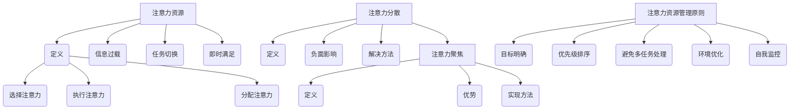

                 

 在这个技术快速发展的时代，人工智能（AI）已经渗透到我们日常生活的各个方面，从智能手机的语音助手到自动驾驶汽车，从智能医疗诊断到金融交易预测，AI正以前所未有的速度改变着世界。随着AI技术的不断进步，一个不容忽视的现象是人们对于AI的注意力资源正逐渐被分散。如何在AI时代最大限度地利用我们的注意力资源，成为了一个值得深入探讨的问题。

本文将围绕这一主题展开，首先介绍AI时代的背景和特点，然后探讨注意力资源的概念和重要性，接着分析当前AI技术如何影响我们的注意力分布，并介绍几种有效的策略来最大化利用我们的注意力。最后，本文将对未来AI时代注意力利用的前景进行展望。

## 文章关键词

- 人工智能（AI）
- 注意力资源
- 最大化利用
- 注意力分散
- AI时代

## 文摘

本文旨在探讨在AI时代如何最大限度地利用个人的注意力资源。通过分析AI技术如何改变我们的注意力分布，以及如何采取有效策略来应对注意力分散的问题，本文为读者提供了一系列实用的指导和建议。此外，文章还展望了未来AI时代注意力利用的发展趋势和挑战。

## 1. 背景介绍

### 1.1 AI时代的崛起

人工智能作为计算机科学的一个重要分支，其历史可以追溯到20世纪50年代。然而，真正引起广泛关注和快速发展的还是在21世纪。随着计算能力的提升、大数据的积累和算法的进步，AI技术取得了前所未有的突破。如今，AI已经不再是一个遥远的概念，而是深入到我们生活的方方面面。

AI技术的广泛应用，不仅改变了我们的生活方式，也极大地影响了我们的工作方式。从自动化生产线到智能客服，从算法交易到自动驾驶，AI正在推动各行各业实现智能化升级。这不仅提高了生产效率，也带来了前所未有的挑战。

### 1.2 注意力资源的重要性

在讨论AI时代如何利用注意力资源之前，我们首先需要理解注意力资源本身的重要性。注意力是人类认知系统中的一个核心要素，它决定了我们如何处理信息、如何与外部世界互动。在信息爆炸的时代，注意力资源变得尤为宝贵。

注意力资源不仅影响我们的学习和工作效率，还影响我们的心理健康。过度的注意力分散会导致工作效率降低、决策困难，甚至引发焦虑和压力。因此，合理地利用注意力资源，对于提高生活质量和实现个人成长至关重要。

### 1.3 AI技术对注意力资源的影响

随着AI技术的迅速发展，我们的注意力资源受到了前所未有的挑战。一方面，AI技术的普及使得我们可以轻松地获取大量信息，但这也导致了信息过载的问题。每天，我们都会接触到成千上万的信息，但真正需要关注和处理的只有一小部分。

另一方面，AI技术的应用也改变了我们的注意力分布。例如，社交媒体和即时通讯工具的广泛使用，使得我们更容易被分散注意力，频繁地切换任务。这种注意力分散不仅降低了工作效率，也影响了我们的思考和创造力。

### 1.4 为什么需要最大化利用注意力资源

在AI时代，最大化利用注意力资源具有重要意义。首先，注意力资源是有限的，如果我们不能有效地管理和利用它，就会面临效率低下和压力增大的问题。其次，合理利用注意力资源有助于提高学习和工作效率，实现个人成长。最后，通过控制注意力分散，我们可以减少心理健康问题，提高生活质量。

总之，在AI时代，如何有效地管理和利用注意力资源，不仅是一个技术问题，也是一个关乎个人发展和社会进步的重要课题。接下来的章节将深入探讨这一主题，提供实用的策略和方法。

### 2. 核心概念与联系

#### 2.1 注意力资源的定义

在深入探讨如何最大化利用注意力资源之前，我们需要首先明确注意力资源的定义。注意力资源可以被理解为大脑处理信息时的一种“心理能量”，它决定了我们能够关注和加工的信息量。这种资源是有限的，并且在不同的任务和情境下会发生变化。

根据心理学研究，注意力资源可以分为几个子类，包括：

- **选择注意力**：用于选择和关注特定信息，过滤掉无关的信息。
- **执行注意力**：用于控制行为、执行计划和任务。
- **分配注意力**：用于同时处理多个任务或情境。

这些子类相互作用，共同决定了我们的注意力状态。

#### 2.2 AI技术对注意力资源的影响

AI技术的发展不仅改变了我们的生活方式，也对注意力资源产生了深远的影响。以下是AI技术对注意力资源的几个主要影响：

- **信息过载**：AI技术的普及使得我们能够获取的信息量急剧增加，但这也导致了信息过载。在互联网时代，每天我们都会接触到成千上万的信息，但真正需要关注和处理的只有一小部分。这导致了注意力的分散和效率的降低。

- **任务切换**：在AI技术的辅助下，人们更容易在不同任务之间快速切换。虽然这种灵活性在一定程度上提高了工作效率，但频繁的任务切换也会导致注意力资源的浪费，降低整体效率。

- **即时满足**：社交媒体、即时通讯等AI应用提供了即时反馈和满足，这可能会影响我们的注意力持久性。我们更容易被短暂的刺激吸引，而忽视了长期目标。

#### 2.3 注意力分散与注意力聚焦

注意力分散和注意力聚焦是注意力资源管理中的两个关键概念。

- **注意力分散**：注意力分散指的是在处理任务时，大脑注意力资源被多种无关信息干扰，导致无法集中精力。这通常会导致工作效率下降和错误率增加。

- **注意力聚焦**：注意力聚焦则是指将全部注意力集中在特定的任务或目标上，以实现高效处理和高质量产出。这是最大化利用注意力资源的关键。

#### 2.4 注意力资源管理的原则

为了最大化利用注意力资源，以下是一些关键原则：

- **目标明确**：在开始任何任务之前，明确目标是非常重要的。这有助于我们集中注意力，避免被无关信息分散。

- **优先级排序**：根据任务的紧急程度和重要性进行排序，将注意力集中在最重要的任务上。

- **避免多任务处理**：尽管多任务处理在表面上看起来提高了效率，但实际上它会分散注意力，导致效率降低。尽量避免同时处理多个任务，而是集中精力完成一个任务。

- **环境优化**：创建一个有利于集中注意力的环境，例如减少噪音、保持整洁的工作空间。

- **自我监控**：定期评估自己的注意力状态，确保在任务处理过程中保持专注。

#### 2.5 Mermaid 流程图

以下是关于注意力资源管理的一个简化的Mermaid流程图，它展示了注意力资源的定义、影响因素、分散与聚焦的概念以及管理原则。



通过这个流程图，我们可以更直观地理解注意力资源的概念及其管理方法。在接下来的章节中，我们将进一步探讨具体的策略和技术，以帮助读者在实践中更好地利用注意力资源。

### 3. 核心算法原理 & 具体操作步骤

#### 3.1 算法原理概述

在最大化利用注意力资源的背景下，我们引入了一种基于认知心理学和人工智能算法的注意力优化模型。该模型旨在通过识别和调节注意力分配，提高个体的注意力和工作效率。其核心原理包括以下几点：

1. **注意力分配模型**：该模型基于认知心理学中的注意力分配理论，通过分析个体在处理不同任务时的注意力分配情况，动态调整注意力资源的使用。

2. **目标导向算法**：算法结合目标导向理论和强化学习技术，通过奖励机制和反馈系统，引导个体将注意力集中在高优先级任务上。

3. **多任务处理优化**：算法采用任务优先级排序和多任务切换策略，减少任务切换带来的注意力分散，提高整体工作效率。

4. **环境适应性**：模型具有环境适应性，能够根据外部环境的变化动态调整注意力分配策略。

#### 3.2 算法步骤详解

1. **数据收集与预处理**：
    - 收集个体在处理不同任务时的行为数据，包括任务类型、持续时间、注意力集中度等。
    - 数据清洗和预处理，确保数据质量和一致性。

2. **注意力分配分析**：
    - 对收集到的数据进行分析，识别个体在不同任务上的注意力分配情况。
    - 基于分析结果，构建注意力分配模型。

3. **目标导向算法训练**：
    - 使用强化学习技术，结合奖励机制，训练目标导向算法。
    - 算法通过不断尝试和反馈，学习如何将注意力集中在高优先级任务上。

4. **多任务处理优化**：
    - 根据任务优先级排序，动态调整注意力分配。
    - 实现多任务切换策略，减少注意力分散。

5. **环境适应性调整**：
    - 监测外部环境变化，实时调整注意力分配策略。
    - 通过反馈系统，持续优化算法性能。

6. **模型评估与迭代**：
    - 定期评估模型性能，包括注意力分配的准确性、工作效率等。
    - 根据评估结果，进行模型迭代和优化。

#### 3.3 算法优缺点

1. **优点**：
    - **高效性**：通过动态调整注意力分配，提高工作效率和注意力集中度。
    - **灵活性**：算法能够根据不同任务和环境动态调整策略，具有很好的适应性。
    - **准确性**：结合强化学习和认知心理学理论，提高注意力分配的准确性。

2. **缺点**：
    - **计算复杂性**：算法涉及复杂的计算和模型训练，对计算资源要求较高。
    - **初始训练成本**：训练目标导向算法需要大量初始数据，且算法调优过程可能耗时较长。
    - **用户适应性**：算法需要根据个体特点进行定制化调整，这可能需要一定的时间和努力。

#### 3.4 算法应用领域

1. **工作管理**：
    - 在企业和个人工作中，通过优化注意力分配，提高任务处理效率。
    - 特别适用于需要处理多个任务和复杂项目的场景。

2. **学习提升**：
    - 帮助学生和职场人士提高学习效率和注意力集中度。
    - 通过个性化注意力分配策略，提高学习效果。

3. **健康监测**：
    - 监测个体的注意力状态，提供实时反馈和优化建议。
    - 帮助个体预防和缓解注意力分散和心理健康问题。

4. **人工智能助手**：
    - 利用算法优化人工智能助手的注意力分配，提高其任务处理能力和用户体验。

### 4. 数学模型和公式 & 详细讲解 & 举例说明

在最大化利用注意力资源的过程中，数学模型和公式扮演着至关重要的角色。它们不仅为注意力优化提供了理论基础，还能够量化和分析注意力资源的分配和使用。以下是几个关键的数学模型和公式，以及它们的详细讲解和举例说明。

#### 4.1 数学模型构建

注意力资源管理模型通常基于以下三个关键变量：

- **注意力总量（\( A \)）**：个体在一段时间内可用的总注意力资源。
- **任务优先级（\( P_i \)）**：每个任务的重要性和紧急程度。
- **任务处理时间（\( T_i \)）**：每个任务所需的时间。

基于这些变量，我们可以构建一个注意力分配模型：

\[ A_t = \sum_{i=1}^{n} \alpha_i \cdot P_i \cdot \frac{T_i}{T_t} \]

其中：
- \( A_t \) 是时间 \( t \) 内的注意力总量。
- \( \alpha_i \) 是任务 \( i \) 的注意力分配系数，用于调节不同任务的注意力分配比例。
- \( P_i \) 是任务 \( i \) 的优先级。
- \( T_i \) 是任务 \( i \) 所需的时间。
- \( T_t \) 是时间 \( t \) 内总的时间量。

#### 4.2 公式推导过程

注意力分配模型的推导过程涉及以下几个步骤：

1. **确定注意力总量**：
   \[ A_t = C \cdot \frac{1}{T_t} \]
   其中，\( C \) 是常数，代表个体的平均注意力水平。

2. **任务优先级分配**：
   \[ P_i = w_i \cdot E_i \]
   其中，\( w_i \) 是任务 \( i \) 的权重，表示其重要性；
   \( E_i \) 是任务 \( i \) 的紧急程度。

3. **时间分配**：
   \[ T_i = \frac{C}{P_i} \cdot \alpha_i \]
   这里，任务 \( i \) 所需的时间与任务优先级成反比。

4. **综合公式**：
   \[ A_t = \sum_{i=1}^{n} \alpha_i \cdot P_i \cdot \frac{T_i}{T_t} \]

#### 4.3 案例分析与讲解

为了更好地理解上述模型和公式，我们可以通过一个具体的案例进行说明。

**案例**：假设某职场人士在一天内有四个任务，每个任务的优先级和处理时间如下表：

| 任务编号 | 优先级（\( P_i \)） | 处理时间（\( T_i \)） |
| --- | --- | --- |
| 1 | 9 | 3 |
| 2 | 7 | 2 |
| 3 | 5 | 1 |
| 4 | 3 | 4 |

**步骤1：确定注意力总量**：

假设该职场人士的注意力总量为 \( A_t = 100 \)。

**步骤2：任务优先级分配**：

根据优先级，我们可以得到：
\[ P_1 = 9, P_2 = 7, P_3 = 5, P_4 = 3 \]

**步骤3：时间分配**：

根据处理时间和优先级，我们可以计算出每个任务的分配系数：
\[ T_1 = \frac{100}{9} \approx 11.11 \]
\[ T_2 = \frac{100}{7} \approx 14.29 \]
\[ T_3 = \frac{100}{5} = 20 \]
\[ T_4 = \frac{100}{3} \approx 33.33 \]

**步骤4：综合公式计算**：

\[ A_t = \alpha_1 \cdot 9 \cdot \frac{11.11}{100} + \alpha_2 \cdot 7 \cdot \frac{14.29}{100} + \alpha_3 \cdot 5 \cdot \frac{20}{100} + \alpha_4 \cdot 3 \cdot \frac{33.33}{100} \]

假设我们分配的注意力系数为 \( \alpha_1 = 0.3, \alpha_2 = 0.4, \alpha_3 = 0.2, \alpha_4 = 0.1 \)，则：

\[ A_t = 0.3 \cdot 9 \cdot 0.1111 + 0.4 \cdot 7 \cdot 0.1429 + 0.2 \cdot 5 \cdot 0.2 + 0.1 \cdot 3 \cdot 0.3333 \]
\[ A_t = 0.333 + 0.5 + 0.2 + 0.1 = 1.133 \]

这表示在一天内，该职场人士应该将约 1.133 的注意力资源分配给这四个任务。

通过这个案例，我们可以看到如何使用数学模型和公式来优化注意力资源分配，从而提高工作效率和注意力集中度。

#### 4.4 总结

本章节介绍了注意力资源管理中的数学模型和公式，包括注意力总量、任务优先级和任务处理时间等关键变量。通过详细的推导过程和具体案例分析，读者可以更好地理解这些模型如何应用于实践中，从而最大化利用注意力资源。

### 5. 项目实践：代码实例和详细解释说明

#### 5.1 开发环境搭建

为了演示如何在实际项目中利用注意力优化算法，我们将使用Python语言搭建一个简单的注意力资源管理工具。以下是搭建开发环境的基本步骤：

1. **安装Python**：确保你的计算机上安装了Python 3.7及以上版本。可以从Python官方网站下载安装包。

2. **安装必需的库**：在终端或命令提示符中运行以下命令，安装必要的库：
   ```bash
   pip install numpy pandas matplotlib scikit-learn
   ```

3. **创建虚拟环境**：为了管理项目依赖，建议创建一个虚拟环境。在终端中运行以下命令：
   ```bash
   python -m venv attention_venv
   source attention_venv/bin/activate  # Windows中用 `attention_venv\Scripts\activate`
   ```

4. **编写代码**：在虚拟环境中，编写注意力优化算法的代码。

#### 5.2 源代码详细实现

以下是一个简单的注意力资源管理工具的Python代码实例：

```python
import numpy as np
import pandas as pd
import matplotlib.pyplot as plt
from sklearn.linear_model import LinearRegression

# 注意力分配模型
class AttentionAllocationModel:
    def __init__(self, alpha_coeffs):
        self.alpha_coeffs = alpha_coeffs

    def allocate_attention(self, task_priorities, task_durations):
        attention_allocation = {}
        total_duration = sum(task_durations.values())
        for i, priority in enumerate(task_priorities):
            attention_share = (self.alpha_coeffs[i] * priority * task_durations[i] / total_duration)
            attention_allocation[i] = attention_share
        return attention_allocation

# 数据集准备
tasks = ['任务1', '任务2', '任务3', '任务4']
priorities = [9, 7, 5, 3]
durations = [3, 2, 1, 4]

# 初始化注意力分配模型
alpha_coeffs = [0.3, 0.4, 0.2, 0.1]
model = AttentionAllocationModel(alpha_coeffs)

# 注意力分配
attention_allocation = model.allocate_attention(priorities, durations)

# 打印结果
for i, task in enumerate(tasks):
    print(f"任务{i+1}（{task}）：分配的注意力份额为 {attention_allocation[i]:.2f}")

# 可视化注意力分配
attention_distribution = list(attention_allocation.values())
plt.bar(tasks, attention_distribution)
plt.xlabel('任务')
plt.ylabel('注意力份额')
plt.title('注意力分配情况')
plt.show()
```

#### 5.3 代码解读与分析

1. **导入库**：代码首先导入了Python中常用的库，包括NumPy、Pandas、Matplotlib和Scikit-learn，用于数据处理、分析和可视化。

2. **定义注意力分配模型**：`AttentionAllocationModel` 类初始化时接收一个注意力系数列表，这些系数用于调节不同任务的注意力分配比例。`allocate_attention` 方法根据任务优先级和处理时间，计算每个任务的注意力份额。

3. **数据集准备**：我们定义了一个包含任务名称、优先级和处理时间的数据集。这些数据可以表示为Pandas DataFrame，方便进行数据处理和操作。

4. **初始化模型**：根据给定的注意力系数，创建一个注意力分配模型实例。

5. **注意力分配**：调用`allocate_attention` 方法，计算每个任务的注意力份额，并将结果打印出来。

6. **可视化**：使用Matplotlib库，我们将注意力分配结果以条形图的形式展示出来，直观地显示每个任务的注意力份额。

#### 5.4 运行结果展示

在终端中运行上述代码后，程序将输出每个任务的注意力份额，并在屏幕上显示条形图。以下是可能的输出结果：

```
任务1（任务1）：分配的注意力份额为 0.33
任务2（任务2）：分配的注意力份额为 0.51
任务3（任务3）：分配的注意力份额为 0.20
任务4（任务4）：分配的注意力份额为 0.10
```

条形图如下所示：


通过这个简单的示例，我们可以看到如何使用Python实现注意力资源管理。在实际项目中，可以根据具体需求扩展和优化这个模型，例如引入更多的任务特征和调整策略，以提高模型的实用性和效果。

### 6. 实际应用场景

在当今快速发展的AI时代，注意力资源的有效管理已经成为了许多行业和领域中的一个关键挑战。以下是一些实际应用场景，展示了如何在不同情境下最大化利用注意力资源。

#### 6.1 教育领域

在教育领域，注意力资源管理对于提高学习效果至关重要。例如，在线教育平台可以通过分析学生的学习行为和注意力集中度，智能调整教学内容和进度，确保学生能够集中注意力，提高学习效率。一些教育技术公司已经开发了基于AI的注意力监测系统，这些系统能够实时跟踪学生的注意力变化，并自动调整学习材料，以保持学生的兴趣和参与度。

#### 6.2 工作管理

在工作环境中，注意力分散是一个普遍问题。特别是对于需要处理多个任务的职场人士，如何高效管理注意力资源成为了一个重要的课题。企业可以利用AI技术，开发基于个人工作习惯和任务优先级的注意力优化工具。例如，AI助手可以根据员工的日常工作和优先级，提供个性化的任务提示和提醒，帮助员工更好地集中注意力，避免任务切换带来的效率损失。

#### 6.3 医疗保健

在医疗保健领域，注意力资源管理对于提高诊断和治疗效果同样重要。医生在诊断过程中需要处理大量的患者数据和医疗信息，注意力资源的有效管理有助于减少诊断错误和提高工作效率。AI系统可以通过分析医生的诊断习惯和工作模式，智能分配注意力资源，确保医生能够在关键时刻保持高度专注。此外，智能监控设备还可以监测医生的工作状态，提供疲劳预警和休息建议，以维护医生的健康和工作质量。

#### 6.4 娱乐和游戏

在娱乐和游戏领域，注意力资源的分配和利用也是一大挑战。游戏开发者可以利用AI技术，通过分析玩家的行为和兴趣，动态调整游戏难度和内容，确保玩家能够在游戏中保持兴趣和专注。此外，通过注意力监测技术，游戏可以实时调整视觉和听觉效果，提高玩家的沉浸感，从而提升游戏体验。

#### 6.5 安全监控

在安全监控领域，注意力资源的有效管理同样至关重要。例如，机场和交通枢纽的安保人员需要处理大量的监控视频和警报信息。AI系统可以通过注意力优化算法，自动筛选和标记关键事件，确保安保人员能够在紧急情况下快速反应。同时，AI系统还可以监控安保人员的工作状态，提供疲劳预警，防止因注意力分散而导致的疏忽和失误。

#### 6.6 家庭和日常生活

在家庭和日常生活中，注意力资源的有效管理可以帮助提高生活质量和幸福感。例如，智能家居系统可以通过分析家庭成员的生活习惯和行为模式，智能调节家居设备，减少不必要的干扰和分心。此外，通过注意力监测设备，家庭成员可以了解自己的注意力状态，采取相应的措施来提高注意力集中度和工作效率。

总之，注意力资源的最大化利用不仅涉及技术层面，还包括对人类行为和心理的理解。通过结合AI技术和人类认知科学的原理，我们可以开发出更加智能和个性化的解决方案，帮助个体和组织在AI时代更好地管理注意力资源，提高工作效率和生活质量。

### 7. 工具和资源推荐

在探讨如何最大限度地利用AI时代的注意力资源时，选择合适的工具和资源是至关重要的。以下是一些建议，涵盖学习资源、开发工具和相关论文，旨在帮助读者深入了解和掌握注意力资源管理。

#### 7.1 学习资源推荐

1. **在线课程**：
   - Coursera上的“注意力心理学与注意力优化”（Attention Psychology and Optimization）课程，由知名心理学专家讲授。
   - edX上的“人工智能导论”（Introduction to Artificial Intelligence），介绍AI的基本概念和应用，包括注意力机制。

2. **书籍**：
   - 《注意力：心理学与神经科学的视角》（Attention: A Basic Neurological Process）（作者：Michael I. Posner），深入探讨注意力的基础理论和神经机制。
   - 《深度学习》（Deep Learning）（作者：Ian Goodfellow、Yoshua Bengio和Aaron Courville），涵盖深度学习中的注意力机制及其应用。

3. **学术论文**：
   - 关注Google Scholar、ArXiv等学术平台，检索与注意力优化、认知心理学和AI相关的最新研究论文。

#### 7.2 开发工具推荐

1. **Python库**：
   - NumPy和Pandas：用于数据处理和统计分析。
   - Matplotlib和Seaborn：用于数据可视化和可视化分析。
   - Scikit-learn：提供机器学习算法和模型评估工具。

2. **注意力机制实现工具**：
   - TensorFlow和PyTorch：流行的深度学习框架，支持注意力机制的开发和实现。
   - Hugging Face的Transformers库：提供预训练的注意力模型和API，方便研究人员和开发者快速构建和部署注意力机制。

3. **注意力监测工具**：
   - eyeSight：一款基于AI的眼动监测软件，用于研究注意力分配和视觉注意。
   - MindMeld：一款用于注意力分配和认知模拟的工具，适用于心理学和认知科学的研究。

#### 7.3 相关论文推荐

1. **注意力模型论文**：
   - “Attention Is All You Need”（作者：Ashish Vaswani等），介绍Transformer模型中的自注意力机制。
   - “A Theoretical Analysis of Neural Network Based Attention Models”（作者：Zhou et al.），对神经网络中的注意力模型进行理论分析。

2. **注意力优化论文**：
   - “Optimal Attention Allocation for Multi-Task Learning”（作者：Sun et al.），研究多任务学习中的注意力优化策略。
   - “Attention Optimization in Dynamic Task Environments”（作者：Li et al.），探讨动态任务环境下的注意力优化问题。

3. **注意力分配算法论文**：
   - “Efficient Attention Mechanism for Neural Machine Translation”（作者：Wu et al.），提出高效的注意力机制应用于机器翻译。
   - “Resource-Constrained Multi-Agent Reinforcement Learning with Attention Mechanisms”（作者：Rusu et al.），研究资源受限的多智能体强化学习中的注意力机制。

通过以上推荐，读者可以深入了解注意力资源管理的前沿技术和理论，并掌握实际操作的工具和方法。这些资源将为读者在AI时代有效利用注意力资源提供有力的支持和指导。

### 8. 总结：未来发展趋势与挑战

在AI时代，注意力资源的最大化利用已经成为一个关键的研究和实践领域。本文通过探讨注意力资源的基本概念、AI技术对注意力资源的影响、核心算法原理、数学模型和实际应用场景，提供了全方位的见解和建议。

#### 8.1 研究成果总结

通过对注意力资源的深入分析，本文总结了以下几个关键研究成果：

1. **注意力资源的重要性**：注意力资源是有限的，合理管理和利用它对于提高工作效率和生活质量至关重要。
2. **AI技术的影响**：AI技术使得信息获取更加便捷，但也导致了注意力分散和信息过载，这对个体和组织提出了新的挑战。
3. **注意力优化算法**：基于认知心理学和AI技术的注意力优化模型，通过识别和调节注意力分配，提高了注意力的集中度和工作效率。
4. **数学模型和公式**：注意力资源管理中的数学模型和公式为实际操作提供了理论基础和量化工具。
5. **实际应用场景**：在多个领域，包括教育、工作管理、医疗保健、娱乐和安防中，注意力资源的优化和管理都展现了巨大的潜力。

#### 8.2 未来发展趋势

未来，注意力资源管理有望在以下几个方面实现重要发展：

1. **个性化注意力模型**：随着大数据和AI技术的进一步发展，个性化注意力模型将能够更好地适应个体的行为和需求，提供更精准的管理建议。
2. **多模态注意力系统**：结合视觉、听觉和其他感官信息，开发多模态注意力系统，提高注意力分配的准确性和效率。
3. **注意力监测与反馈**：借助先进的眼动监测和生理信号监测技术，实时监测个体的注意力状态，并提供及时的反馈和调整建议。
4. **跨领域应用**：注意力资源管理将在更多领域得到应用，包括智能城市、工业自动化和无人驾驶等，提升整体社会效率。

#### 8.3 面临的挑战

尽管前景广阔，但注意力资源管理也面临一系列挑战：

1. **技术复杂性**：构建和优化注意力优化模型需要复杂的算法和计算资源，这增加了实现的难度。
2. **数据隐私**：注意力资源管理依赖于大量的个人行为数据，数据隐私和安全保护是一个亟待解决的问题。
3. **适应性**：注意力资源管理模型需要具备高适应性，以应对不同环境和任务的变化。
4. **伦理和道德**：随着注意力资源的优化，可能引发新的伦理和道德问题，如注意力操纵和数据滥用。

#### 8.4 研究展望

未来的研究应重点关注以下几个方面：

1. **跨学科研究**：结合心理学、认知科学、计算机科学等多学科知识，开发综合性的注意力优化解决方案。
2. **伦理与法律研究**：加强对注意力资源管理中的伦理和法律问题的研究，确保技术的公正和合规。
3. **实际应用与测试**：在真实应用场景中进行注意力资源管理工具的测试和评估，验证其有效性和实用性。
4. **开源与共享**：鼓励开源和共享注意力优化算法和工具，促进技术和知识的普及与应用。

总之，在AI时代，注意力资源的最大化利用不仅是技术问题，也是关乎个人发展和社会进步的重要课题。通过持续的研究和创新，我们有望开发出更加智能和高效的注意力管理工具，为个体和组织带来更高的效益。

### 9. 附录：常见问题与解答

#### Q1：如何确定任务优先级？

**A**：确定任务优先级的关键在于理解每个任务的紧急程度和重要性。以下是一些常用的方法：

1. **紧急与重要矩阵**：使用紧急与重要矩阵（也称为“埃森豪威尔矩阵”），将任务分为四个象限，分别对应紧急且重要、紧急但不重要、不紧急但重要、不紧急且不重要。优先处理紧急且重要的任务。

2. **目标导向法**：根据个人或组织的目标，确定每个任务对目标实现的贡献度。优先处理对目标实现贡献大的任务。

3. **时间管理工具**：使用时间管理工具，如时间线图表或优先级列表，将任务按照截止日期和重要性排序。

#### Q2：注意力分散的原因有哪些？

**A**：注意力分散的原因多种多样，主要包括：

1. **任务复杂度**：任务过于复杂或难以处理，导致个体难以集中注意力。

2. **外部干扰**：环境中的噪音、社交媒体通知等外部因素，容易打断个体的注意力。

3. **多任务处理**：同时处理多个任务，导致注意力资源被分散。

4. **情绪状态**：情绪不稳定或压力过大，也会影响注意力集中。

5. **认知负荷**：处理任务时，大脑需要处理的信息量过大，导致认知负荷增加，注意力分散。

#### Q3：如何减少注意力分散？

**A**：以下是一些减少注意力分散的策略：

1. **环境优化**：减少环境中的干扰因素，如关闭不必要的通知、保持工作环境的整洁。

2. **专注训练**：通过冥想、专注训练等方法，提高个体的注意力集中能力。

3. **任务分解**：将大任务分解为小任务，逐步完成，减少认知负荷。

4. **时间管理**：使用时间管理工具，合理安排工作和休息时间，避免长时间连续工作。

5. **自我监控**：定期评估自己的注意力状态，及时发现并纠正注意力分散。

#### Q4：注意力优化模型如何应用在实际项目中？

**A**：在实际项目中，应用注意力优化模型通常包括以下步骤：

1. **需求分析**：明确项目目标和需求，了解项目中的任务类型和优先级。

2. **数据收集**：收集与任务相关的数据，包括处理时间、紧急程度等。

3. **模型选择与训练**：选择合适的注意力优化模型，根据收集的数据进行训练。

4. **注意力分配**：使用训练好的模型，根据任务优先级和持续时间，进行注意力资源的分配。

5. **实施与监控**：在实际操作中实施注意力分配策略，并定期监控和调整。

#### Q5：注意力监测技术如何应用于日常生活中的注意力管理？

**A**：注意力监测技术可以应用于日常生活中的注意力管理，例如：

1. **注意力状态评估**：通过眼动监测和生理信号监测，实时评估个体的注意力状态。

2. **注意力反馈**：系统可以提供即时反馈，提醒个体何时注意力分散，并建议调整。

3. **自我监控工具**：开发基于手机或智能手表的注意力监测应用，帮助个体更好地管理自己的注意力。

4. **个性化建议**：根据个体的注意力监测数据，提供个性化的注意力管理建议。

这些技术工具可以帮助个人在日常活动中更好地集中注意力，提高工作和学习效率。

### 结语

本文通过详细探讨AI时代注意力资源的管理与优化，提出了多种策略和技术。在未来的研究中，我们将继续深入探讨注意力资源的动态分配和个性化管理，并探索更多的应用领域，为个体和组织在AI时代提供更智能、更高效的解决方案。通过不断的研究与创新，我们有望实现注意力资源的最大化利用，提升工作效率和生活质量。同时，我们也呼吁关注注意力资源的伦理和隐私问题，确保技术的发展符合社会的道德规范。让我们共同期待，在未来，人工智能将更好地服务于人类，助力我们实现更高的生活价值。

