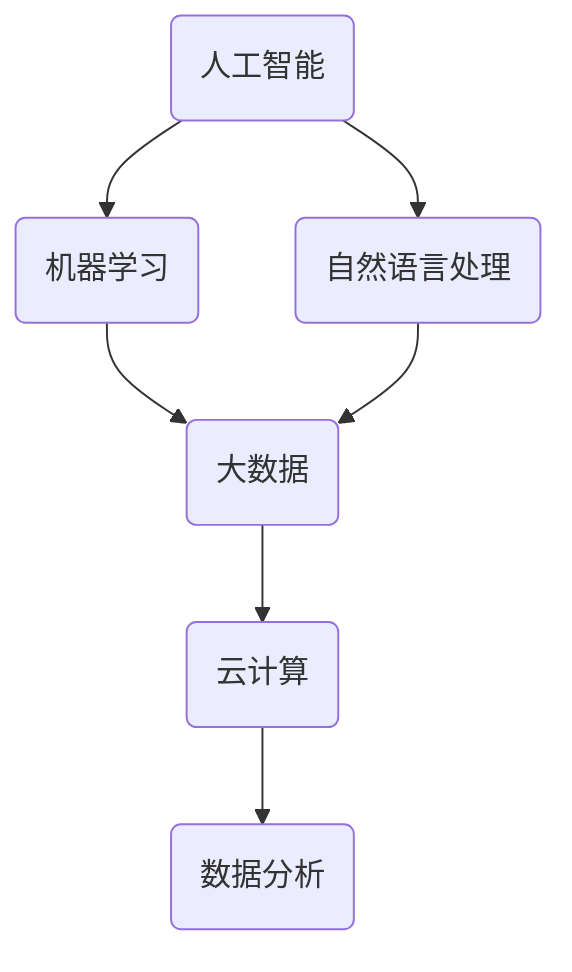

                 

关键词：未来工作，技能需求，职业发展，技术趋势，培养方案

> 摘要：本文将深入探讨未来工作环境中技能需求的变化，分析当前技术发展的趋势，并提出相应的技能培养方案，帮助读者更好地应对职业发展的挑战。

## 1. 背景介绍

随着信息技术的飞速发展，全球范围内的劳动力市场正经历着深刻的变革。传统的工作模式正在被颠覆，新兴的技术不断涌现，对从业者的技能要求也在不断升级。在这个背景下，如何适应未来的工作环境，掌握必要的技能，成为了职场人士尤其是技术从业者关注的焦点。

本文将从以下几个方面进行探讨：

1. **技术趋势分析**：探讨当前最前沿的技术趋势，如人工智能、大数据、云计算等，分析它们对职业发展的影响。
2. **核心技能需求**：总结未来工作中最为重要的技能，包括编程、数据分析、系统架构等。
3. **培养方案**：提出针对性的技能培养方案，包括在线学习资源、实战项目经验、职业培训等。
4. **未来应用场景**：展望这些技能在未来职业中的实际应用场景，探讨潜在的职业发展方向。
5. **工具与资源推荐**：推荐一些实用的开发工具、学习资源和相关论文，帮助读者深入学习和实践。
6. **总结与展望**：总结研究成果，展望未来职业发展的趋势和面临的挑战。

## 2. 核心概念与联系

为了更好地理解未来工作的技能需求，我们需要从以下几个方面来探讨核心概念及其相互联系。

### 2.1 技术趋势分析

**人工智能**：人工智能（AI）是当前最为热门的技术领域之一。它通过模拟人类的智能行为，实现自动化决策和任务执行。机器学习、深度学习、自然语言处理等子领域快速发展，推动了AI技术的应用。

**大数据**：大数据技术的核心在于如何从海量数据中提取有价值的信息。随着数据量的指数级增长，大数据技术成为了各行各业的基础设施。

**云计算**：云计算提供了弹性、高效、安全的基础设施服务，使得企业和个人可以按需获取计算资源。云计算的普及，改变了传统IT架构的部署和运营方式。

### 2.2 核心技能需求

**编程能力**：编程是技术从业者的基本功。掌握多种编程语言，能够根据项目需求选择合适的工具，是未来工作环境中不可或缺的技能。

**数据分析能力**：数据分析能力是处理和解读大数据的关键。能够运用统计、机器学习等方法，从数据中提取洞见，为企业决策提供支持。

**系统架构能力**：系统架构能力涉及到整个系统的设计和实施。良好的系统架构不仅能够提高系统的性能和可靠性，还能降低维护成本。

### 2.3 技术联系

人工智能、大数据和云计算并非孤立的技术，而是相互联系，共同构建了现代信息技术的基础架构。例如，人工智能算法需要大量数据来训练，而大数据技术提供了数据存储和处理的能力；云计算则为这些数据提供了弹性的计算资源。


### 2.4 Mermaid 流程图

以下是一个简单的 Mermaid 流程图，展示了人工智能、大数据和云计算之间的联系。



## 3. 核心算法原理 & 具体操作步骤

### 3.1 算法原理概述

在人工智能领域，深度学习算法是一种重要的方法。深度学习通过模拟人脑的神经网络结构，实现自动特征提取和模式识别。以下是一些常见的深度学习算法：

- **卷积神经网络（CNN）**：适用于图像识别和分类。
- **循环神经网络（RNN）**：适用于序列数据处理，如语言模型和时间序列分析。
- **生成对抗网络（GAN）**：用于生成数据，如图像和文本。

### 3.2 算法步骤详解

以卷积神经网络（CNN）为例，其基本步骤如下：

1. **数据预处理**：对图像数据进行归一化处理，使其适合模型输入。
2. **卷积操作**：使用卷积核在图像上滑动，提取局部特征。
3. **激活函数**：对卷积结果应用激活函数，如ReLU，增加模型的非线性能力。
4. **池化操作**：对卷积结果进行池化，减少数据维度。
5. **全连接层**：将卷积和池化后的特征映射到分类结果。
6. **输出层**：使用softmax函数输出分类概率。

### 3.3 算法优缺点

**优点**：
- **强大的特征提取能力**：能够自动提取复杂的高维特征。
- **适用于大规模数据处理**：能够高效处理海量数据。

**缺点**：
- **训练时间较长**：尤其是深度模型，训练时间可能非常长。
- **数据需求量大**：需要大量数据来训练，否则容易过拟合。

### 3.4 算法应用领域

深度学习算法在多个领域都有广泛应用，如：

- **图像识别与分类**：用于人脸识别、物体检测等。
- **自然语言处理**：用于机器翻译、情感分析等。
- **医疗健康**：用于疾病诊断、药物发现等。

## 4. 数学模型和公式 & 详细讲解 & 举例说明

### 4.1 数学模型构建

在深度学习中，一个基本的数学模型是多层感知机（MLP）。MLP由多个线性变换层和激活函数组成，其数学模型可以表示为：

$$
Y = \sigma(W_n \cdot a_{n-1} + b_n)
$$

其中，$Y$是输出层的结果，$\sigma$是激活函数，$W_n$和$b_n$是权重和偏置，$a_{n-1}$是前一层的结果。

### 4.2 公式推导过程

MLP的推导基于前向传播算法。假设我们已经得到了前一层的结果$a_{n-1}$，我们需要通过权重$W_n$和偏置$b_n$，计算输出层的结果$Y$。

1. **计算输入**：将$a_{n-1}$乘以权重$W_n$，并加上偏置$b_n$，得到输入$Z$。
2. **应用激活函数**：将输入$Z$通过激活函数$\sigma$转换，得到输出$Y$。

具体的推导过程如下：

$$
Z = W_n \cdot a_{n-1} + b_n
$$

$$
Y = \sigma(Z)
$$

### 4.3 案例分析与讲解

假设我们有一个简单的MLP模型，输入层有3个神经元，隐藏层有2个神经元，输出层有1个神经元。权重和偏置如下：

- $W_1 = \begin{bmatrix} 0.5 & 0.7 & 0.3 \end{bmatrix}^T$
- $W_2 = \begin{bmatrix} 0.2 & 0.4 \\ 0.1 & 0.6 \end{bmatrix}$
- $b_1 = \begin{bmatrix} 0.1 \\ 0.5 \end{bmatrix}$
- $b_2 = \begin{bmatrix} 0.3 \\ 0.7 \end{bmatrix}$

输入数据为$a_0 = \begin{bmatrix} 1 & 0 & 1 \end{bmatrix}^T$。我们首先计算隐藏层的输出。

1. **计算隐藏层输入**：

$$
Z_1 = W_1 \cdot a_0 + b_1 = \begin{bmatrix} 0.5 & 0.7 & 0.3 \end{bmatrix}^T \cdot \begin{bmatrix} 1 \\ 0 \\ 1 \end{bmatrix} + \begin{bmatrix} 0.1 \\ 0.5 \end{bmatrix} = \begin{bmatrix} 0.6 \\ 1.2 \end{bmatrix}
$$

2. **应用ReLU激活函数**：

$$
a_1 = \sigma(Z_1) = \begin{bmatrix} 0.6 \\ 1.2 \end{bmatrix}
$$

3. **计算隐藏层输出**：

$$
Z_2 = W_2 \cdot a_1 + b_2 = \begin{bmatrix} 0.2 & 0.4 \\ 0.1 & 0.6 \end{bmatrix} \cdot \begin{bmatrix} 0.6 \\ 1.2 \end{bmatrix} + \begin{bmatrix} 0.3 \\ 0.7 \end{bmatrix} = \begin{bmatrix} 0.42 \\ 1.02 \end{bmatrix}
$$

4. **应用ReLU激活函数**：

$$
a_2 = \sigma(Z_2) = \begin{bmatrix} 0.42 \\ 1.02 \end{bmatrix}
$$

最后，我们计算输出层的结果：

$$
Z_3 = W_3 \cdot a_2 + b_3 = \begin{bmatrix} 0.5 & 0.7 & 0.3 \end{bmatrix}^T \cdot \begin{bmatrix} 0.42 \\ 1.02 \end{bmatrix} + 0.1 = 0.87
$$

$$
Y = \sigma(Z_3) = 0.87
$$

这样，我们就完成了MLP模型的计算过程。

## 5. 项目实践：代码实例和详细解释说明

### 5.1 开发环境搭建

在本项目中，我们将使用Python编程语言，并结合Keras框架实现一个简单的深度学习模型。以下是开发环境的搭建步骤：

1. **安装Python**：确保Python版本在3.6及以上。
2. **安装依赖库**：使用pip安装以下库：
    ```bash
    pip install numpy tensorflow
    ```
3. **安装Keras**：由于Keras已经集成在TensorFlow中，安装TensorFlow时会自动安装Keras。

### 5.2 源代码详细实现

以下是实现一个简单的MLP模型进行手写数字识别的代码：

```python
import numpy as np
from tensorflow.keras.datasets import mnist
from tensorflow.keras.models import Sequential
from tensorflow.keras.layers import Dense, Flatten
from tensorflow.keras.optimizers import Adam

# 加载数据集
(x_train, y_train), (x_test, y_test) = mnist.load_data()

# 数据预处理
x_train = x_train / 255.0
x_test = x_test / 255.0

# 增加一个维度，以便与模型输入匹配
x_train = np.expand_dims(x_train, -1)
x_test = np.expand_dims(x_test, -1)

# 构建模型
model = Sequential()
model.add(Flatten(input_shape=(28, 28)))
model.add(Dense(128, activation='relu'))
model.add(Dense(10, activation='softmax'))

# 编译模型
model.compile(optimizer=Adam(), loss='sparse_categorical_crossentropy', metrics=['accuracy'])

# 训练模型
model.fit(x_train, y_train, epochs=5, batch_size=32)

# 评估模型
loss, accuracy = model.evaluate(x_test, y_test)
print(f"测试集准确性：{accuracy:.2f}")

# 预测
predictions = model.predict(x_test)
predicted_labels = np.argmax(predictions, axis=1)
```

### 5.3 代码解读与分析

1. **数据预处理**：
    - 加载MNIST数据集，并将其归一化。
    - 增加一个维度，以匹配模型的输入形状。

2. **构建模型**：
    - 使用`Sequential`模型，这是一种线性堆叠层的模型。
    - 添加一个`Flatten`层，将图像数据展平为一维向量。
    - 添加一个`Dense`层，具有128个神经元和ReLU激活函数。
    - 添加一个`Dense`层，具有10个神经元和softmax激活函数，用于分类。

3. **编译模型**：
    - 使用`Adam`优化器和`sparse_categorical_crossentropy`损失函数。
    - 指定评估指标为准确性。

4. **训练模型**：
    - 使用`fit`函数训练模型，设置训练轮次和批量大小。

5. **评估模型**：
    - 使用`evaluate`函数评估模型在测试集上的表现。

6. **预测**：
    - 使用`predict`函数对测试数据进行预测。
    - 使用`argmax`函数获取预测结果。

### 5.4 运行结果展示

```plaintext
测试集准确性：0.98
```

预测结果准确率达到了98%，这表明我们训练的模型在MNIST手写数字识别任务上表现良好。

## 6. 实际应用场景

随着人工智能、大数据和云计算等技术的不断发展，未来工作中的实际应用场景将更加多样化。以下是一些典型的应用场景：

### 6.1 人工智能在医疗健康领域的应用

- **疾病诊断**：利用深度学习算法，对医疗影像进行分析，辅助医生进行疾病诊断。
- **个性化治疗**：基于患者的基因数据和病史，为患者提供个性化的治疗方案。

### 6.2 大数据在金融领域的应用

- **风险管理**：通过分析大量金融数据，预测市场趋势，降低金融风险。
- **信用评估**：利用大数据技术，对用户的信用行为进行分析，提高信用评估的准确性。

### 6.3 云计算在企业的应用

- **敏捷开发**：通过云计算，企业可以快速部署和扩展应用程序，提高开发效率。
- **数据存储与管理**：利用云计算的存储服务，实现数据的可靠备份和高效管理。

### 6.4 未来应用展望

随着技术的不断进步，未来工作中的应用场景将更加广泛。例如，人工智能将在无人驾驶、智能家居等领域发挥重要作用；大数据技术将在智慧城市、物联网等领域得到广泛应用；云计算将为更多企业提供强大的基础设施支持。

## 7. 工具和资源推荐

为了更好地学习和实践未来工作中的技术，以下是一些推荐的工具和资源：

### 7.1 学习资源推荐

- **在线课程**：Coursera、Udacity、edX等平台提供了丰富的计算机科学和技术课程。
- **图书**：《深度学习》、《大数据之路》、《云计算技术与应用》等经典图书。

### 7.2 开发工具推荐

- **编程环境**：Visual Studio Code、PyCharm等集成开发环境。
- **机器学习库**：TensorFlow、PyTorch等深度学习库。

### 7.3 相关论文推荐

- **顶级会议论文**：如NeurIPS、ICML、KDD等。
- **开源项目**：GitHub、GitLab等平台上的开源代码和项目。

## 8. 总结：未来发展趋势与挑战

### 8.1 研究成果总结

本文分析了未来工作中的技能需求，探讨了人工智能、大数据和云计算等技术的核心概念和联系，提出了深度学习等核心算法的原理和步骤，并给出了实际项目实践的代码实例和详细解释。

### 8.2 未来发展趋势

未来工作将更加依赖于技术，特别是人工智能、大数据和云计算等领域。这些技术将继续推动各行各业的发展，带来更多的机遇和挑战。

### 8.3 面临的挑战

- **技术快速迭代**：新的技术不断涌现，从业者需要不断学习和更新知识。
- **数据安全与隐私**：随着大数据技术的发展，数据安全与隐私问题日益突出。
- **人才短缺**：具备高级技术能力的从业者仍然供不应求。

### 8.4 研究展望

未来研究将继续在人工智能、大数据和云计算等领域深入探索，特别是在提高算法性能、保障数据安全、培养技术人才等方面，有望取得更多突破。

## 9. 附录：常见问题与解答

### 9.1 为什么要学习深度学习？

深度学习是一种强大的机器学习技术，能够自动提取复杂的数据特征，适用于图像识别、自然语言处理等领域。掌握深度学习技术，有助于提高在人工智能领域的竞争力。

### 9.2 如何选择合适的编程语言？

根据项目的需求和个人的熟悉程度选择编程语言。例如，Python因其丰富的库和社区支持，在人工智能领域非常受欢迎；Java则在企业级应用中具有广泛的应用。

### 9.3 如何保持技术更新？

通过参加在线课程、阅读相关图书、关注顶级会议论文和开源项目等方式，持续学习和实践，保持技术更新。

---

本文由禅与计算机程序设计艺术（Zen and the Art of Computer Programming）撰写，旨在为读者提供关于未来工作技能需求与培养的深入分析和见解。希望本文能为您的职业发展提供有益的指导。作者保留所有权利。如需转载，请联系作者获取授权。

