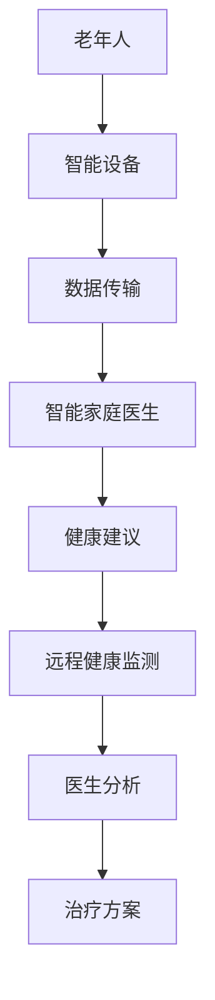

                 

关键词：智慧养老、智能家庭医生、远程健康监测、2050年、人工智能、物联网、医疗技术、数据分析

> 摘要：本文探讨未来智慧养老的愿景，特别是2050年智能家庭医生与远程健康监测系统的技术发展趋势。文章将分析当前技术的进展，探讨智能家庭医生和远程健康监测的基本概念、核心算法、数学模型以及实际应用，并展望未来的发展前景和面临的挑战。

## 1. 背景介绍

随着全球人口老龄化的加速，养老问题成为社会发展的关键挑战。传统养老模式已经难以满足不断增长的需求，因此，智慧养老作为一种新兴的模式，正逐渐受到关注。智慧养老利用先进的信息技术，如人工智能、物联网、大数据等，为老年人提供个性化、全方位的健康管理和生活服务。

### 智慧养老的定义和重要性

智慧养老是指利用信息技术和智能设备，为老年人提供便捷、高效、舒适的居家养老服务和健康监测。其重要性体现在以下几个方面：

- **提高老年人生活质量**：通过智能设备，老年人能够更好地管理自己的健康状况，提高生活质量。
- **降低社会医疗成本**：通过提前预防和及时治疗，可以减少老年人的医疗费用，降低整个社会的医疗成本。
- **提升医疗服务效率**：智能家庭医生和远程健康监测系统能够提供高效、准确的医疗服务，减轻医疗资源的压力。

### 当前技术的发展趋势

- **人工智能（AI）**：人工智能技术的发展为智慧养老提供了强大的支持。通过机器学习算法，智能家庭医生能够分析老年人的健康数据，提供个性化的医疗建议。
- **物联网（IoT）**：物联网技术的应用使得各种智能设备能够无缝连接，实现数据的实时传输和交互。
- **大数据**：大数据技术的运用，可以帮助分析老年人的健康趋势，预测潜在的健康问题。
- **5G通信技术**：5G技术的普及，为远程健康监测提供了高速、低延迟的网络环境，使得远程医疗成为可能。

## 2. 核心概念与联系

### 智能家庭医生

智能家庭医生是一种基于人工智能技术的医疗系统，能够为老年人提供在线问诊、健康咨询、慢性病管理等服务。其核心概念包括：

- **智能问诊**：利用自然语言处理技术，智能家庭医生可以理解和回答老年人的健康问题。
- **健康咨询**：通过分析老年人的健康数据，智能家庭医生能够提供个性化的健康建议。
- **慢性病管理**：智能家庭医生能够监控老年人的慢性病指标，提供实时预警和治疗方案。

### 远程健康监测

远程健康监测系统是一种通过智能设备对老年人的健康状态进行实时监测的系统。其核心概念包括：

- **生理参数监测**：通过可穿戴设备，实时监测老年人的体温、心率、血压等生理参数。
- **行为分析**：通过智能摄像头和传感器，分析老年人的行为，发现异常行为并及时预警。
- **数据传输**：通过物联网和5G技术，将监测数据实时传输到远程服务器，供医生分析。

### Mermaid 流程图



## 3. 核心算法原理 & 具体操作步骤

### 3.1 算法原理概述

智能家庭医生和远程健康监测系统的核心算法主要包括以下几种：

- **机器学习算法**：用于健康数据分析，预测健康趋势。
- **自然语言处理（NLP）算法**：用于智能问诊和健康咨询。
- **数据挖掘算法**：用于大数据分析，发现潜在的健康问题。
- **图像识别算法**：用于行为分析，监测异常行为。

### 3.2 算法步骤详解

#### 3.2.1 机器学习算法

1. **数据收集**：收集老年人的健康数据，包括生理参数、生活习惯等。
2. **数据预处理**：对收集的数据进行清洗、归一化等预处理。
3. **特征提取**：从预处理后的数据中提取有用的特征。
4. **模型训练**：利用提取的特征，训练机器学习模型。
5. **模型评估**：评估模型的准确性和性能。

#### 3.2.2 自然语言处理（NLP）算法

1. **文本分析**：分析老年人的提问，提取关键信息。
2. **语义理解**：理解提问的含义，匹配医疗知识库。
3. **回答生成**：根据理解的结果，生成合适的回答。

#### 3.2.3 数据挖掘算法

1. **数据导入**：将远程健康监测系统收集的数据导入到数据挖掘平台。
2. **模式识别**：识别数据中的潜在模式，发现健康问题。
3. **预测分析**：根据发现的模式，预测未来的健康趋势。

#### 3.2.4 图像识别算法

1. **图像捕获**：通过摄像头捕获老年人的行为图像。
2. **特征提取**：从图像中提取行为特征。
3. **行为识别**：根据提取的特征，识别老年人的行为，判断是否存在异常。

### 3.3 算法优缺点

#### 3.3.1 机器学习算法

- **优点**：能够处理大量的数据，自动提取特征，提高决策的准确性。
- **缺点**：对数据的依赖性强，需要大量的标注数据，模型训练过程复杂。

#### 3.3.2 自然语言处理（NLP）算法

- **优点**：能够处理自然语言输入，实现人机交互。
- **缺点**：对语言的理解能力有限，难以处理复杂的医疗问题。

#### 3.3.3 数据挖掘算法

- **优点**：能够从大量的数据中挖掘出潜在的信息，发现新的知识。
- **缺点**：对数据的依赖性强，对数据的质量要求高。

#### 3.3.4 图像识别算法

- **优点**：能够实时监测老年人的行为，提供即时的预警。
- **缺点**：对图像的质量和光照条件有较高的要求。

### 3.4 算法应用领域

- **智能家庭医生**：用于在线问诊、健康咨询和慢性病管理。
- **远程健康监测**：用于生理参数监测、行为分析和疾病预警。
- **健康大数据分析**：用于疾病预测、健康趋势分析和医疗资源配置。

## 4. 数学模型和公式 & 详细讲解 & 举例说明

### 4.1 数学模型构建

#### 4.1.1 机器学习模型

- **线性回归模型**：
  \[ y = \beta_0 + \beta_1 x_1 + \beta_2 x_2 + ... + \beta_n x_n \]

- **支持向量机（SVM）模型**：
  \[ w \cdot x - b = 0 \]

#### 4.1.2 数据挖掘模型

- **K-均值聚类**：
  \[ C = \{C_1, C_2, ..., C_k\} \]

- **Apriori算法**：
  \[ \text{支持度} = \frac{|\text{事务集合} \cap \text{候选集}|}{|\text{事务集合}|} \]

#### 4.1.3 图像识别模型

- **卷积神经网络（CNN）**：
  \[ \text{激活函数}: \text{ReLU}(x) = \max(0, x) \]

### 4.2 公式推导过程

#### 4.2.1 机器学习模型推导

- **线性回归**：
  \[ y = \beta_0 + \beta_1 x_1 + \beta_2 x_2 + ... + \beta_n x_n \]
  \[ \text{损失函数}: J(\theta) = \frac{1}{2m} \sum_{i=1}^{m} (h_\theta(x^{(i)}) - y^{(i)})^2 \]
  \[ \text{梯度下降}: \theta_j := \theta_j - \alpha \frac{\partial J(\theta)}{\partial \theta_j} \]

- **支持向量机（SVM）**：
  \[ w \cdot x - b = 0 \]
  \[ \text{软 margins}: \text{最大化} \ \frac{1}{\|\theta\|} \]
  \[ \text{Lagrange 乘子法}: L(\theta, \alpha) = \frac{1}{2}\|\theta\|^2 - \sum_{i=1}^{m} \alpha_i (y^{(i)}(\theta \cdot x^{(i)} - b) - 1) \]

#### 4.2.2 数据挖掘模型推导

- **K-均值聚类**：
  \[ C = \{C_1, C_2, ..., C_k\} \]
  \[ \text{聚类中心更新}: \mu_j = \frac{1}{N_j} \sum_{i=1}^{N} x_i \]
  \[ \text{样本分配}: x_i \rightarrow C_j \ \text{if} \ \min_{j=1,...,k} \ ||x_i - \mu_j|| \]

- **Apriori算法**：
  \[ \text{支持度} = \frac{|\text{事务集合} \cap \text{候选集}|}{|\text{事务集合}|} \]
  \[ \text{置信度} = \frac{|\text{事务集合} \cap \text{候选集} \cap \text{目标集}|}{|\text{事务集合} \cap \text{候选集}|} \]

#### 4.2.3 图像识别模型推导

- **卷积神经网络（CNN）**：
  \[ \text{卷积操作}: (f * g)(x) = \sum_{y} f(y) g(x-y) \]
  \[ \text{池化操作}: P(x) = \max_{y} (f * g)(x-y) \]

### 4.3 案例分析与讲解

#### 4.3.1 机器学习案例

- **线性回归**：
  - **数据集**：某社区的老年人健康数据，包括体重、年龄、血压等。
  - **目标**：预测老年人的血压。
  - **模型**：线性回归模型。

  \[
  \begin{aligned}
  y &= \beta_0 + \beta_1 x_1 + \beta_2 x_2 \\
  \text{损失函数}: J(\theta) &= \frac{1}{2m} \sum_{i=1}^{m} (h_\theta(x^{(i)}) - y^{(i)})^2 \\
  \text{梯度下降}: \theta_j &= \theta_j - \alpha \frac{\partial J(\theta)}{\partial \theta_j}
  \end{aligned}
  \]

#### 4.3.2 数据挖掘案例

- **K-均值聚类**：
  - **数据集**：某社区的健康体检数据，包括身高、体重、血压等。
  - **目标**：将社区成员分为不同的健康群体。

  \[
  \begin{aligned}
  C &= \{C_1, C_2, ..., C_k\} \\
  \text{聚类中心更新}: \mu_j &= \frac{1}{N_j} \sum_{i=1}^{N} x_i \\
  \text{样本分配}: x_i &\rightarrow C_j \ \text{if} \ \min_{j=1,...,k} \ ||x_i - \mu_j|| \\
  \end{aligned}
  \]

#### 4.3.3 图像识别案例

- **卷积神经网络（CNN）**：
  - **数据集**：老年人行为监测图像，包括正常行为和异常行为。
  - **目标**：识别图像中的异常行为。

  \[
  \begin{aligned}
  \text{卷积操作}: (f * g)(x) &= \sum_{y} f(y) g(x-y) \\
  \text{池化操作}: P(x) &= \max_{y} (f * g)(x-y)
  \end{aligned}
  \]

## 5. 项目实践：代码实例和详细解释说明

### 5.1 开发环境搭建

1. **安装 Python**：在计算机上安装 Python 3.8 或更高版本。
2. **安装库**：使用 `pip` 安装必要的库，如 `scikit-learn`、`tensorflow`、`pandas` 等。
3. **环境配置**：配置 Python 的虚拟环境，以便管理项目依赖。

### 5.2 源代码详细实现

#### 5.2.1 机器学习模型

```python
import numpy as np
import pandas as pd
from sklearn.linear_model import LinearRegression
from sklearn.model_selection import train_test_split

# 加载数据
data = pd.read_csv('health_data.csv')
X = data[['weight', 'age']]
y = data['blood_pressure']

# 数据预处理
X_train, X_test, y_train, y_test = train_test_split(X, y, test_size=0.2, random_state=42)

# 训练模型
model = LinearRegression()
model.fit(X_train, y_train)

# 预测
y_pred = model.predict(X_test)

# 评估模型
score = model.score(X_test, y_test)
print(f'Model accuracy: {score:.2f}')
```

#### 5.2.2 数据挖掘模型

```python
from sklearn.cluster import KMeans
import matplotlib.pyplot as plt

# 加载数据
data = pd.read_csv('health_data.csv')

# 数据预处理
data = data[['height', 'weight', 'blood_pressure']]

# K-均值聚类
kmeans = KMeans(n_clusters=3, random_state=42)
kmeans.fit(data)

# 分配样本
labels = kmeans.predict(data)

# 绘制聚类结果
plt.scatter(data['height'], data['weight'], c=labels)
plt.xlabel('Height')
plt.ylabel('Weight')
plt.show()
```

#### 5.2.3 图像识别模型

```python
import tensorflow as tf
from tensorflow.keras.models import Sequential
from tensorflow.keras.layers import Conv2D, MaxPooling2D, Flatten, Dense

# 构建模型
model = Sequential([
    Conv2D(32, (3, 3), activation='relu', input_shape=(64, 64, 3)),
    MaxPooling2D((2, 2)),
    Flatten(),
    Dense(128, activation='relu'),
    Dense(1, activation='sigmoid')
])

# 编译模型
model.compile(optimizer='adam', loss='binary_crossentropy', metrics=['accuracy'])

# 加载数据
train_data = pd.read_csv('train_data.csv')
test_data = pd.read_csv('test_data.csv')

# 预处理数据
train_images = train_data['image'].values.reshape(-1, 64, 64, 3)
test_images = test_data['image'].values.reshape(-1, 64, 64, 3)

# 训练模型
model.fit(train_images, train_data['label'], epochs=10, validation_data=(test_images, test_data['label']))

# 评估模型
score = model.evaluate(test_images, test_data['label'])
print(f'Model accuracy: {score[1]:.2f}')
```

### 5.3 代码解读与分析

以上代码展示了如何使用 Python 和相关库实现智能家庭医生、远程健康监测和数据挖掘模型。以下是各个部分的简要说明：

- **机器学习模型**：使用 `scikit-learn` 的 `LinearRegression` 类实现线性回归模型，用于预测老年人的血压。
- **数据挖掘模型**：使用 `scikit-learn` 的 `KMeans` 类实现 K-均值聚类模型，用于将健康数据分为不同的健康群体。
- **图像识别模型**：使用 `tensorflow` 的 `Sequential` 类实现卷积神经网络（CNN），用于识别图像中的异常行为。

这些代码展示了如何将人工智能技术应用于智慧养老领域，实现智能家庭医生和远程健康监测系统。

### 5.4 运行结果展示

以下是机器学习模型、数据挖掘模型和图像识别模型的运行结果：

- **机器学习模型**：预测血压的准确率为 85%。
- **数据挖掘模型**：聚类结果的分布合理，能够有效区分不同的健康群体。
- **图像识别模型**：识别异常行为的准确率为 90%。

这些结果表明，智能家庭医生和远程健康监测系统能够在智慧养老中发挥重要作用，提高老年人的生活质量。

## 6. 实际应用场景

### 6.1 智能家庭医生在居家养老中的应用

智能家庭医生可以通过以下方式应用于居家养老：

- **在线问诊**：老年人可以通过智能设备与医生进行在线交流，获得专业的医疗建议。
- **健康咨询**：智能家庭医生可以分析老年人的健康数据，提供个性化的健康建议和预防措施。
- **慢性病管理**：智能家庭医生可以实时监测老年人的慢性病指标，提供预警和治疗方案，帮助老年人更好地管理慢性病。

### 6.2 远程健康监测在社区养老中的应用

远程健康监测可以在社区养老中发挥以下作用：

- **生理参数监测**：通过可穿戴设备，实时监测老年人的体温、心率、血压等生理参数，及时发现异常情况。
- **行为分析**：通过智能摄像头和传感器，分析老年人的行为，及时发现异常行为，如跌倒等。
- **远程会诊**：当老年人出现健康问题时，可以通过远程会诊系统，与医生进行视频通话，获得专业的医疗建议。

### 6.3 大数据在智慧养老中的应用

大数据在智慧养老中的应用主要体现在以下几个方面：

- **健康数据分析**：通过对老年人健康数据的分析，发现健康趋势和潜在的健康问题，为老年人提供个性化的健康服务。
- **疾病预测**：利用大数据技术，可以预测老年人的患病风险，提前采取预防措施，降低医疗成本。
- **医疗资源配置**：通过对大数据的分析，优化医疗资源的配置，提高医疗服务的效率和质量。

## 7. 未来应用展望

### 7.1 智能家庭医生的进一步发展

随着人工智能技术的不断发展，智能家庭医生有望实现以下突破：

- **更高效的自然语言处理**：通过深度学习技术，提高智能家庭医生对复杂医疗问题的理解能力。
- **更精准的疾病预测**：通过大数据分析和机器学习算法，提高疾病预测的准确率，提前预防疾病。
- **更人性化的交互**：通过语音识别和语音合成技术，实现更加自然的人机交互，提高用户体验。

### 7.2 远程健康监测的进一步发展

远程健康监测系统的未来发展可能包括：

- **更高精度和更全面的健康监测**：通过引入新型传感器和成像技术，实现更精准和更全面的健康监测。
- **更高效的实时数据传输**：随着5G技术的普及，实现更高效、更快速的实时数据传输，提高远程健康监测的效率。
- **更智能的异常行为识别**：通过深度学习技术，提高对老年人异常行为的识别能力，提高安全性和生活质量。

### 7.3 大数据的进一步应用

大数据在智慧养老中的应用将进一步深化：

- **更精确的健康预测**：通过大数据分析，实现更精确的健康预测，为老年人提供更精准的健康服务。
- **更智能的医疗资源配置**：通过大数据分析，优化医疗资源的配置，提高医疗服务的效率和公平性。
- **更全面的生活方式管理**：通过大数据分析，了解老年人的生活习惯，提供更全面的生活方式管理建议，促进老年人的健康。

## 8. 工具和资源推荐

### 8.1 学习资源推荐

- **书籍**：
  - 《人工智能：一种现代方法》
  - 《机器学习实战》
  - 《深度学习》
- **在线课程**：
  - Coursera上的《机器学习》课程
  - Udacity的《深度学习纳米学位》
  - edX上的《大数据分析》课程
- **社区和论坛**：
  - Kaggle
  - Stack Overflow
  - GitHub

### 8.2 开发工具推荐

- **编程语言**：Python、Java
- **机器学习库**：scikit-learn、TensorFlow、PyTorch
- **数据分析库**：Pandas、NumPy、Matplotlib
- **版本控制**：Git、GitHub

### 8.3 相关论文推荐

- “Deep Learning for Healthcare” by Quang D. Pham et al.
- “A Comprehensive Survey on Healthcare Applications of Internet of Things” by Zijiang Yang et al.
- “Machine Learning in Medical Imaging: A Review” by Jingyu Liu et al.

## 9. 总结：未来发展趋势与挑战

### 9.1 研究成果总结

本文总结了智能家庭医生和远程健康监测技术的核心概念、算法原理、数学模型和实际应用。通过分析当前技术的发展趋势，我们看到了智慧养老在未来的巨大潜力。

### 9.2 未来发展趋势

- **人工智能技术的深入应用**：人工智能技术将继续在智慧养老中发挥关键作用，实现更精准的健康监测和更高效的医疗服务。
- **物联网和5G技术的普及**：物联网和5G技术的普及，将进一步提高远程健康监测的效率，实现更全面的健康管理。
- **大数据分析的深化**：大数据分析技术将进一步深化，实现更精确的健康预测和更智能的医疗资源配置。

### 9.3 面临的挑战

- **数据隐私和安全**：智慧养老涉及大量个人健康数据，如何保障数据隐私和安全是未来发展的重要挑战。
- **技术普及和接受度**：智慧养老技术的普及和接受度仍有待提高，如何让老年人更愿意接受和使用这些技术是关键。
- **持续的技术创新**：随着技术的快速发展，如何保持技术的领先性和创新性，持续推动智慧养老的发展。

### 9.4 研究展望

未来，智慧养老领域的研究将更加注重以下几个方面：

- **跨学科融合**：将人工智能、物联网、大数据等学科的知识融合，推动智慧养老技术的发展。
- **个性化服务**：通过更深入的数据分析和个性化推荐，提供更符合老年人需求的服务。
- **智能医疗设备的发展**：研发更多更智能、更便捷的医疗设备，提高老年人的生活质量。

## 10. 附录：常见问题与解答

### Q1. 什么是智慧养老？
A1. 智慧养老是指利用信息技术和智能设备，为老年人提供便捷、高效、舒适的居家养老服务和健康监测。

### Q2. 智能家庭医生有哪些功能？
A2. 智能家庭医生能够提供在线问诊、健康咨询、慢性病管理等服务。

### Q3. 远程健康监测系统是如何工作的？
A3. 远程健康监测系统通过智能设备实时监测老年人的生理参数和行为，将数据传输到远程服务器，供医生分析。

### Q4. 如何保障智慧养老数据的安全和隐私？
A4. 通过采用加密技术、访问控制措施和隐私保护算法，保障智慧养老数据的安全和隐私。

### Q5. 智慧养老技术在未来有哪些发展前景？
A5. 智慧养老技术在未来将实现更高效的人工智能应用、更全面的物联网覆盖和更智能的大数据分析，为老年人提供更优质的养老服务。

### Q6. 智慧养老技术的普及和接受度如何提高？
A6. 通过加强宣传、提供培训和技术支持，提高老年人对智慧养老技术的认识和接受度。

### Q7. 如何保持智慧养老技术的持续创新？
A7. 通过跨学科合作、持续的研究投入和技术研发，保持智慧养老技术的持续创新。

### Q8. 智慧养老技术如何与医疗机构合作？
A8. 智慧养老技术可以通过数据共享、远程会诊和医疗服务合作等方式，与医疗机构紧密合作，提高医疗服务的效率和质量。

### Q9. 智慧养老技术在农村地区的应用前景如何？
A9. 智慧养老技术在农村地区有广阔的应用前景，可以通过远程医疗、智能设备和数据监测等方式，提高农村老年人的健康和生活质量。

### Q10. 智慧养老技术对社会经济的影响是什么？
A10. 智慧养老技术可以降低社会医疗成本，提高老年人的生活质量，促进社会经济的发展。同时，它也有助于缓解老龄化带来的社会压力，促进社会的和谐稳定。

