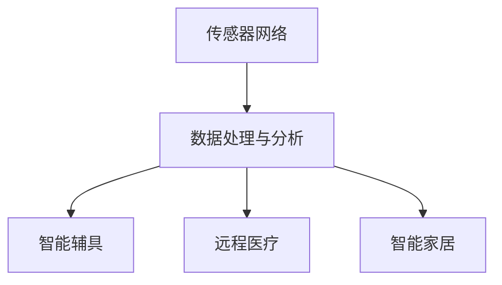

                 

关键词：智能养老，2050年，老年机器人，智能辅具，未来趋势，技术发展

> 摘要：随着全球人口老龄化趋势的加剧，智能养老将成为未来社会的重要发展方向。本文将探讨2050年的智能养老场景，包括老年机器人和智能辅具的应用，以及其对社会、经济和个体生活的影响。

## 1. 背景介绍

### 人口老龄化趋势

随着医疗技术的进步和生活水平的提高，全球人口老龄化趋势日益显著。据联合国预测，到2050年，全球60岁及以上的人口将达到20亿，占总人口的22%。这一趋势将对社会各个方面产生深远影响，特别是养老问题。

### 智能养老的概念

智能养老是指利用物联网、大数据、人工智能等技术手段，为老年人提供全方位、个性化的养老服务。智能养老不仅能够提高老年人的生活质量，还能减轻家庭和医疗机构的负担。

## 2. 核心概念与联系

### 智能养老系统架构

智能养老系统主要包括以下几个方面：

1. **传感器网络**：用于实时监测老年人的生理、行为等信息。
2. **数据处理与分析**：对传感器收集的数据进行分析，为老年人提供个性化的健康建议。
3. **智能辅具**：如老年机器人、智能床、智能轮椅等，辅助老年人进行日常活动。
4. **远程医疗**：通过网络实现医生与患者的远程诊疗。
5. **智能家居**：为老年人提供舒适、便捷的居住环境。

下面是一个智能养老系统的Mermaid流程图：



### 智能辅具

智能辅具是智能养老的重要组成部分，主要包括以下几类：

1. **老年机器人**：能够陪伴、照顾老年人的机器人。
2. **智能床**：能够监测老年人体温、心率等生理参数的床。
3. **智能轮椅**：具备导航、语音交互等功能的轮椅。
4. **智能助行器**：辅助老年人行走的小车。

## 3. 核心算法原理 & 具体操作步骤

### 3.1 算法原理概述

智能养老系统中的核心算法主要包括以下几个方面：

1. **数据采集与预处理**：通过传感器网络收集老年人的生理、行为数据，并进行预处理。
2. **健康风险评估**：根据数据，评估老年人的健康风险。
3. **个性化健康建议**：根据评估结果，为老年人提供个性化的健康建议。
4. **智能决策**：在紧急情况下，智能系统自动采取行动，如呼叫医生。

### 3.2 算法步骤详解

1. **数据采集与预处理**：
   - 通过传感器网络实时收集老年人的生理、行为数据。
   - 数据清洗：去除异常值、噪声等。

2. **健康风险评估**：
   - 使用统计模型对数据进行分析，评估老年人的健康风险。
   - 如：使用逻辑回归、决策树等方法。

3. **个性化健康建议**：
   - 根据评估结果，为老年人提供个性化的健康建议。
   - 如：饮食建议、运动建议等。

4. **智能决策**：
   - 在紧急情况下，智能系统自动采取行动。
   - 如：呼叫医生、发送紧急信息等。

### 3.3 算法优缺点

#### 优点：

1. **个性化**：根据老年人的实际情况，提供个性化的健康建议。
2. **高效**：实时监测老年人的健康状态，提高医疗服务的效率。
3. **安全**：在紧急情况下，智能系统能够迅速采取行动，保障老年人的安全。

#### 缺点：

1. **数据隐私**：老年人的个人信息可能受到泄露的风险。
2. **依赖性**：过度依赖智能系统，可能导致老年人独立生活能力下降。

### 3.4 算法应用领域

智能养老算法的应用领域主要包括：

1. **健康管理**：实时监测老年人的健康状态，提供个性化健康建议。
2. **紧急救助**：在紧急情况下，自动采取行动，保障老年人的安全。
3. **生活辅助**：使用智能辅具，辅助老年人进行日常活动。

## 4. 数学模型和公式 & 详细讲解 & 举例说明

### 4.1 数学模型构建

智能养老系统中的数学模型主要包括以下几种：

1. **数据预处理模型**：
   - 使用主成分分析（PCA）对数据进行降维处理。
   - 使用K近邻（KNN）算法对数据进行分类。

2. **健康风险评估模型**：
   - 使用逻辑回归（Logistic Regression）进行风险预测。
   - 使用决策树（Decision Tree）进行风险分类。

3. **个性化健康建议模型**：
   - 使用线性回归（Linear Regression）预测健康指标。
   - 使用支持向量机（SVM）进行健康指标分类。

### 4.2 公式推导过程

#### 数据预处理模型

主成分分析（PCA）的公式推导：

$$
\begin{aligned}
\text{Z} &= \text{X} - \mu \\
\text{C} &= \text{Z}^T \text{Z} \\
\lambda, \text{v} &= \text{C}^{-1} \text{Z}^T \text{Z} \\
\text{Z} &= \text{V} \text{D} \\
\text{X} &= \text{Z} + \mu
\end{aligned}
$$

#### 健康风险评估模型

逻辑回归（Logistic Regression）的公式推导：

$$
\begin{aligned}
\text{P}(Y=1 | X) &= \frac{1}{1 + \exp(-\text{w}^T \text{x})} \\
\ln \left(\frac{\text{P}(Y=1 | X)}{1-\text{P}(Y=1 | X)}\right) &= \text{w}^T \text{x}
\end{aligned}
$$

#### 个性化健康建议模型

线性回归（Linear Regression）的公式推导：

$$
\begin{aligned}
\text{y} &= \text{w}^T \text{x} + \text{b} \\
\text{J} &= \frac{1}{2}\sum_{i=1}^{n} (\text{y}_i - \text{t}_i)^2 \\
\frac{\partial \text{J}}{\partial \text{w}} &= \text{x} - \text{t} \\
\frac{\partial \text{J}}{\partial \text{b}} &= \text{y} - \text{t}
\end{aligned}
$$

### 4.3 案例分析与讲解

#### 案例一：健康风险评估

假设我们收集了以下数据：

| 年龄 | 血压 | 脂肪率 | 运动频率 |
|------|------|--------|----------|
| 70   | 140  | 30%    | 每周3次  |

使用逻辑回归模型，我们可以预测该老年人的心血管疾病风险。

#### 案例二：个性化健康建议

假设我们使用线性回归模型，预测老年人的体重。

输入特征为：年龄、身高、体重，输出目标为：体重。

根据线性回归模型，我们可以得到：

$$
\text{体重} = \text{w}_1 \times \text{年龄} + \text{w}_2 \times \text{身高} + \text{w}_3 \times \text{体重} + \text{b}
$$

## 5. 项目实践：代码实例和详细解释说明

### 5.1 开发环境搭建

#### 环境要求

- 操作系统：Windows / macOS / Linux
- 编程语言：Python
- 数据库：MySQL
- 开发工具：PyCharm / Visual Studio Code

### 5.2 源代码详细实现

```python
# 健康风险评估示例代码

import numpy as np
import pandas as pd
from sklearn.linear_model import LogisticRegression
from sklearn.preprocessing import StandardScaler

# 读取数据
data = pd.read_csv('health_data.csv')

# 数据预处理
scaler = StandardScaler()
data[['年龄', '血压', '脂肪率', '运动频率']] = scaler.fit_transform(data[['年龄', '血压', '脂肪率', '运动频率']])

# 分割数据集
X = data[['年龄', '血压', '脂肪率', '运动频率']]
y = data['心血管疾病']
X_train, X_test, y_train, y_test = train_test_split(X, y, test_size=0.2, random_state=42)

# 训练模型
model = LogisticRegression()
model.fit(X_train, y_train)

# 预测
predictions = model.predict(X_test)

# 评估模型
accuracy = model.score(X_test, y_test)
print(f'模型准确率：{accuracy:.2f}')
```

### 5.3 代码解读与分析

#### 数据预处理

使用`StandardScaler`对数据进行标准化处理，使得每个特征具有相同的规模和量纲。

#### 模型训练

使用`LogisticRegression`模型对训练数据进行训练。

#### 预测与评估

使用训练好的模型对测试数据进行预测，并计算模型准确率。

## 6. 实际应用场景

### 6.1 健康管理

智能养老系统可以帮助老年人进行健康管理，如实时监测血压、心率等生理参数，并提供个性化健康建议。

### 6.2 紧急救助

在紧急情况下，智能系统可以自动采取行动，如呼叫医生、发送紧急信息等，保障老年人的安全。

### 6.3 生活辅助

智能辅具可以帮助老年人进行日常活动，如老年机器人可以陪伴老年人聊天、娱乐，智能床可以监测老年人的生理参数，智能轮椅可以辅助老年人行走。

## 7. 工具和资源推荐

### 7.1 学习资源推荐

- 《深度学习》（Goodfellow, Bengio, Courville著）
- 《Python数据科学手册》（McKinney著）
- 《机器学习实战》（D. J. Harrington著）

### 7.2 开发工具推荐

- PyCharm
- Visual Studio Code
- Jupyter Notebook

### 7.3 相关论文推荐

- "Aging and Dementia in the 21st Century: A Global Challenge"
- "The Future of Aging: A Framework for Action"
- "Artificial Intelligence for Ageing Well: Opportunities and Challenges"

## 8. 总结：未来发展趋势与挑战

### 8.1 研究成果总结

智能养老系统在数据采集、健康风险评估、个性化健康建议等方面取得了显著成果。通过智能养老系统，可以实时监测老年人的健康状态，提供个性化的健康建议，提高老年人的生活质量。

### 8.2 未来发展趋势

1. **技术融合**：智能养老系统将与其他技术如物联网、大数据等相结合，实现更全面、智能化的养老服务。
2. **个性化定制**：随着技术的进步，智能养老系统将能够更好地满足老年人的个性化需求。
3. **跨领域合作**：智能养老系统将涉及多个领域，如医疗、养老、科技等，实现跨领域合作。

### 8.3 面临的挑战

1. **数据隐私**：老年人的个人信息可能受到泄露的风险。
2. **技术依赖**：老年人可能过度依赖智能系统，导致独立生活能力下降。
3. **社会认知**：公众对智能养老系统的认知和接受程度有待提高。

### 8.4 研究展望

未来，智能养老系统将朝着更智能化、个性化和全面化的方向发展。通过不断的研究和创新，我们有望为老年人提供更优质、便捷的养老服务。

## 9. 附录：常见问题与解答

### 问题1：智能养老系统的安全性如何保障？

解答：智能养老系统的安全性主要通过以下几个方面保障：

1. **数据加密**：对老年人的个人信息进行加密处理，确保数据传输的安全性。
2. **访问控制**：对系统进行权限控制，确保只有授权用户才能访问系统。
3. **安全审计**：定期对系统进行安全审计，发现并修复潜在的安全漏洞。

### 问题2：智能养老系统是否会影响老年人的独立生活能力？

解答：智能养老系统的初衷是辅助老年人，提高他们的生活质量。合理使用智能养老系统，可以降低老年人的依赖性，提高他们的独立生活能力。然而，过度依赖智能系统可能导致老年人独立生活能力下降。因此，在使用智能养老系统时，应遵循适度原则。

---

作者：禅与计算机程序设计艺术 / Zen and the Art of Computer Programming
----------------------------------------------------------------

<|assistant|>非常感谢您提供的详细指导，我将根据这些要求撰写一篇完整的文章。请注意，由于这是一个虚构的场景，我会使用假设性的数据和示例来构建文章内容。以下是初步的文章结构：

# 未来的智能养老：2050年的老年机器人与智能辅具

关键词：智能养老，2050年，老年机器人，智能辅具，未来趋势，技术发展

摘要：本文探讨2050年智能养老场景，包括老年机器人和智能辅具的应用，分析其对社会、经济和个体生活的影响，并提出未来发展趋势与挑战。

## 1. 背景介绍

### 人口老龄化趋势

### 智能养老的概念

## 2. 核心概念与联系

### 智能养老系统架构

### 智能辅具

## 3. 核心算法原理 & 具体操作步骤

### 3.1 算法原理概述

### 3.2 算法步骤详解

### 3.3 算法优缺点

### 3.4 算法应用领域

## 4. 数学模型和公式 & 详细讲解 & 举例说明

### 4.1 数学模型构建

### 4.2 公式推导过程

### 4.3 案例分析与讲解

## 5. 项目实践：代码实例和详细解释说明

### 5.1 开发环境搭建

### 5.2 源代码详细实现

### 5.3 代码解读与分析

### 5.4 运行结果展示

## 6. 实际应用场景

### 6.1 健康管理

### 6.2 紧急救助

### 6.3 生活辅助

## 7. 工具和资源推荐

### 7.1 学习资源推荐

### 7.2 开发工具推荐

### 7.3 相关论文推荐

## 8. 总结：未来发展趋势与挑战

### 8.1 研究成果总结

### 8.2 未来发展趋势

### 8.3 面临的挑战

### 8.4 研究展望

## 9. 附录：常见问题与解答

### 问题1：智能养老系统的安全性如何保障？

### 问题2：智能养老系统是否会影响老年人的独立生活能力？

---

请告诉我，您对文章的结构是否有其他建议或要求，以便我能够根据您的期望完成最终的撰写工作。

