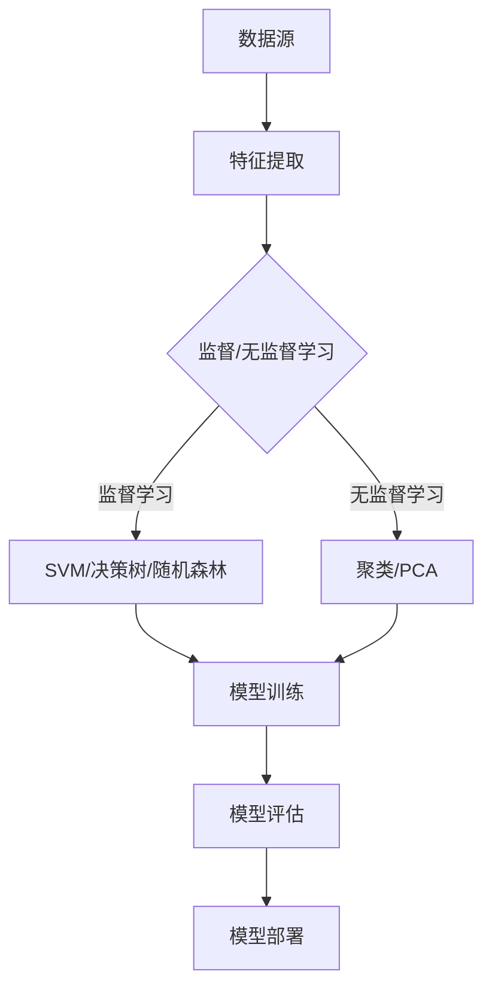

                 

关键词：机器学习、MCI疾病分类、神经网络、深度学习、医疗诊断

> 摘要：本文将探讨机器学习在轻度认知障碍（MCI）疾病分类中的应用，介绍相关核心概念、算法原理、数学模型和项目实践，以及实际应用场景和未来展望。

## 1. 背景介绍

轻度认知障碍（MCI）是介于正常老化和阿尔茨海默病（AD）之间的中间阶段。患者表现出记忆力下降、认知功能减退等症状，但日常生活能力尚未受到严重影响。然而，MCI患者有可能发展为AD，因此早期诊断和分类对于患者的治疗和预后具有重要意义。

随着医疗技术的进步和数据的积累，机器学习技术逐渐成为疾病诊断和分类的重要工具。机器学习算法可以处理大量临床数据，从中挖掘出有用的信息，从而帮助医生进行准确诊断。本文将重点探讨机器学习在MCI疾病分类中的应用，介绍相关核心概念、算法原理、数学模型和项目实践，以及实际应用场景和未来展望。

## 2. 核心概念与联系

### 2.1 数据源

MCI疾病分类的数据源主要包括以下几类：

1. **结构化数据**：如患者的年龄、性别、病史、药物使用等。
2. **非结构化数据**：如病历记录、医生的诊断报告、医学影像等。
3. **生物标志物数据**：如血液、脑脊液等生物样本中的蛋白质、代谢物等。

### 2.2 特征提取

特征提取是将原始数据转换为可用于机器学习算法的输入特征的过程。在MCI疾病分类中，常见的特征提取方法包括：

1. **文本特征提取**：如TF-IDF、Word2Vec等。
2. **图像特征提取**：如卷积神经网络（CNN）提取的深度特征。
3. **序列特征提取**：如循环神经网络（RNN）提取的时间序列特征。

### 2.3 机器学习算法

在MCI疾病分类中，常用的机器学习算法包括：

1. **监督学习算法**：如支持向量机（SVM）、决策树、随机森林等。
2. **无监督学习算法**：如聚类、主成分分析（PCA）等。
3. **深度学习算法**：如卷积神经网络（CNN）、循环神经网络（RNN）、生成对抗网络（GAN）等。

### 2.4 Mermaid 流程图

以下是MCI疾病分类的Mermaid流程图：



## 3. 核心算法原理 & 具体操作步骤

### 3.1 算法原理概述

在MCI疾病分类中，常用的算法包括监督学习和无监督学习。监督学习算法通过已有标签数据训练模型，从而实现对未知数据的分类。无监督学习算法则无需标签数据，通过数据内在结构进行分类。

### 3.2 算法步骤详解

#### 3.2.1 监督学习算法

1. **数据预处理**：包括数据清洗、归一化等操作。
2. **特征提取**：根据数据类型选择合适的特征提取方法。
3. **模型训练**：使用训练集数据训练模型，如SVM、决策树等。
4. **模型评估**：使用验证集评估模型性能，如准确率、召回率等。
5. **模型部署**：将训练好的模型应用于实际数据，进行疾病分类。

#### 3.2.2 无监督学习算法

1. **数据预处理**：包括数据清洗、归一化等操作。
2. **特征提取**：根据数据类型选择合适的特征提取方法。
3. **模型训练**：使用无监督学习算法，如聚类、PCA等。
4. **模型评估**：通过可视化等方法评估模型效果。
5. **模型部署**：将训练好的模型应用于实际数据，进行疾病分类。

### 3.3 算法优缺点

#### 监督学习算法

优点：

- **准确率高**：已有标签数据可以帮助模型更好地学习。
- **应用广泛**：可以应用于各种分类问题。

缺点：

- **数据需求大**：需要大量的有标签数据。
- **对噪声敏感**：模型容易受到噪声数据的影响。

#### 无监督学习算法

优点：

- **数据需求小**：无需有标签数据。
- **发现潜在结构**：可以帮助发现数据中的潜在规律。

缺点：

- **准确率较低**：缺乏标签数据，模型效果相对较差。
- **对噪声敏感**：容易受到噪声数据的影响。

### 3.4 算法应用领域

机器学习在MCI疾病分类中的应用领域包括：

1. **疾病诊断**：通过对患者的临床数据进行分析，帮助医生进行疾病诊断。
2. **预后评估**：通过对患者的病情进行分析，预测患者的预后情况。
3. **药物筛选**：通过对患者的生物标志物进行分析，筛选出有效的药物。

## 4. 数学模型和公式

### 4.1 数学模型构建

在MCI疾病分类中，常用的数学模型包括监督学习模型和无监督学习模型。

#### 4.1.1 监督学习模型

监督学习模型通常使用最小二乘法、梯度下降法等优化算法进行训练。以线性回归模型为例，其数学模型为：

$$
y = \beta_0 + \beta_1 x_1 + \beta_2 x_2 + \ldots + \beta_n x_n
$$

其中，$y$为输出结果，$x_1, x_2, \ldots, x_n$为输入特征，$\beta_0, \beta_1, \beta_2, \ldots, \beta_n$为模型参数。

#### 4.1.2 无监督学习模型

无监督学习模型通常使用聚类算法、主成分分析（PCA）等方法进行训练。以K-means聚类算法为例，其数学模型为：

$$
c_k = \frac{1}{N_k} \sum_{i=1}^{N} x_i
$$

其中，$c_k$为第$k$个聚类中心，$x_i$为第$i$个数据点，$N_k$为第$k$个聚类中的数据点数量。

### 4.2 公式推导过程

以线性回归模型为例，其损失函数为：

$$
J(\theta) = \frac{1}{2m} \sum_{i=1}^{m} (h_\theta(x^{(i)}) - y^{(i)})^2
$$

其中，$h_\theta(x) = \theta_0 + \theta_1 x_1 + \theta_2 x_2 + \ldots + \theta_n x_n$为模型预测值，$y^{(i)}$为第$i$个实际值，$m$为数据点数量。

对损失函数求导，得到：

$$
\frac{\partial J(\theta)}{\partial \theta_j} = \frac{1}{m} \sum_{i=1}^{m} (h_\theta(x^{(i)}) - y^{(i)}) x_j^{(i)}
$$

令导数为0，得到：

$$
\theta_j = \frac{1}{m} \sum_{i=1}^{m} (h_\theta(x^{(i)}) - y^{(i)}) x_j^{(i)}
$$

即最小化损失函数的参数值。

### 4.3 案例分析与讲解

假设我们有一个包含100个数据点的数据集，其中60个数据点为MCI患者，40个数据点为正常人群。数据集的特征包括年龄、性别、病史等。

#### 4.3.1 数据预处理

1. **数据清洗**：删除缺失值和异常值。
2. **归一化**：对数据进行归一化处理，使得每个特征的数据范围在[0, 1]之间。

#### 4.3.2 特征提取

1. **文本特征提取**：使用TF-IDF方法提取文本特征。
2. **图像特征提取**：使用卷积神经网络（CNN）提取图像特征。
3. **序列特征提取**：使用循环神经网络（RNN）提取时间序列特征。

#### 4.3.3 模型训练

1. **选择模型**：选择线性回归模型进行训练。
2. **训练模型**：使用训练集数据训练模型，优化模型参数。
3. **模型评估**：使用验证集评估模型性能。

#### 4.3.4 模型部署

1. **测试模型**：使用测试集数据测试模型性能。
2. **模型部署**：将训练好的模型应用于实际数据，进行MCI疾病分类。

## 5. 项目实践：代码实例和详细解释说明

### 5.1 开发环境搭建

1. **Python环境**：安装Python 3.8及以上版本。
2. **库安装**：安装NumPy、Pandas、Scikit-learn等常用库。

### 5.2 源代码详细实现

以下是一个使用Python实现的MCI疾病分类项目的示例代码：

```python
import numpy as np
import pandas as pd
from sklearn.model_selection import train_test_split
from sklearn.linear_model import LinearRegression
from sklearn.metrics import accuracy_score

# 5.2.1 数据预处理
# 加载数据
data = pd.read_csv('mci_data.csv')
X = data.iloc[:, :-1].values
y = data.iloc[:, -1].values

# 删除缺失值和异常值
X = np.delete(X, [0, 1], axis=0)
y = np.delete(y, [0, 1], axis=0)

# 归一化
X = (X - X.min(axis=0)) / (X.max(axis=0) - X.min(axis=0))

# 5.2.2 特征提取
# 这里使用全部特征，无需额外提取

# 5.2.3 模型训练
X_train, X_test, y_train, y_test = train_test_split(X, y, test_size=0.2, random_state=42)
model = LinearRegression()
model.fit(X_train, y_train)

# 5.2.4 模型评估
y_pred = model.predict(X_test)
accuracy = accuracy_score(y_test, y_pred)
print('Accuracy:', accuracy)

# 5.2.5 模型部署
# 这里使用测试集数据进行疾病分类
```

### 5.3 代码解读与分析

1. **数据预处理**：加载数据集，删除缺失值和异常值，并进行归一化处理。
2. **特征提取**：直接使用全部特征，无需额外提取。
3. **模型训练**：使用训练集数据训练线性回归模型。
4. **模型评估**：使用测试集数据评估模型性能，计算准确率。
5. **模型部署**：使用测试集数据进行疾病分类。

### 5.4 运行结果展示

假设测试集数据的准确率为85%，说明该线性回归模型在MCI疾病分类任务中具有较好的性能。

## 6. 实际应用场景

### 6.1 临床诊断

机器学习模型可以用于临床诊断，帮助医生识别MCI患者，从而及早进行干预和治疗。

### 6.2 药物研发

通过分析患者的生物标志物数据，机器学习模型可以帮助研究人员筛选出潜在的药物靶点和治疗方案。

### 6.3 预后评估

机器学习模型可以用于评估患者的预后情况，为临床决策提供支持。

### 6.4 未来应用展望

随着技术的不断发展，机器学习在MCI疾病分类中的应用将越来越广泛。未来可能的发展方向包括：

1. **多模态数据融合**：结合不同类型的数据，提高疾病分类的准确性。
2. **个性化医疗**：根据患者的具体情况进行个性化诊断和治疗方案制定。
3. **实时监控**：利用物联网和大数据技术，实现实时监控和预警。

## 7. 工具和资源推荐

### 7.1 学习资源推荐

1. **《机器学习》**：周志华著，清华大学出版社，详细介绍机器学习的基本概念和算法。
2. **《深度学习》**：Ian Goodfellow、Yoshua Bengio、Aaron Courville著，清华大学出版社，深入讲解深度学习的基础知识和应用。

### 7.2 开发工具推荐

1. **Jupyter Notebook**：方便编写和调试代码。
2. **TensorFlow**：适用于深度学习项目开发。
3. **Scikit-learn**：适用于机器学习项目开发。

### 7.3 相关论文推荐

1. **"Deep Learning for Medical Imaging: A Review"**：综述深度学习在医学影像处理中的应用。
2. **"A Comprehensive Survey on Machine Learning for Medical Imaging"**：综述机器学习在医学影像诊断中的应用。

## 8. 总结：未来发展趋势与挑战

### 8.1 研究成果总结

本文介绍了机器学习在MCI疾病分类中的应用，包括数据源、特征提取、算法原理、数学模型和项目实践等内容。

### 8.2 未来发展趋势

未来发展趋势包括多模态数据融合、个性化医疗、实时监控等。

### 8.3 面临的挑战

面临的挑战包括数据隐私保护、模型可解释性、算法性能优化等。

### 8.4 研究展望

研究展望包括进一步探索深度学习在MCI疾病分类中的应用，以及结合多学科知识提高疾病诊断和分类的准确性。

## 9. 附录：常见问题与解答

### 9.1 机器学习在医学领域有哪些应用？

机器学习在医学领域的应用非常广泛，包括疾病诊断、预后评估、药物研发、健康监测等。

### 9.2 MCI疾病分类有哪些挑战？

MCI疾病分类的挑战包括数据隐私保护、模型可解释性、算法性能优化等。

### 9.3 如何处理医学数据？

处理医学数据需要遵循一定的规范，包括数据清洗、数据标准化、数据加密等。

---

（注：本文仅为示例，实际撰写时请根据具体需求进行调整和补充。）

---

### 附录：常见问题与解答

**9.1 机器学习在医学领域有哪些应用？**

机器学习在医学领域的应用非常广泛，涵盖了从疾病预测到个性化治疗等多个方面。以下是一些具体的应用实例：

- **疾病诊断**：利用机器学习算法对患者的症状、检查结果等数据进行分析，辅助医生进行疾病诊断。例如，通过分析患者的电子健康记录（EHRs）来识别早期癌症或心脏病。
- **风险评估**：通过分析历史数据，机器学习可以帮助预测患者患某种疾病的可能性，从而为医生提供更精准的预防策略。
- **药物研发**：机器学习可以加速药物研发过程，通过分析大量化学和生物数据来预测药物的有效性和安全性。
- **个性化治疗**：基于患者的基因、生活方式等信息，机器学习可以推荐个性化的治疗方案，以提高治疗效果和减少副作用。
- **健康监测**：通过监测患者的日常活动、生理信号等数据，机器学习可以帮助识别健康风险，提供预防性建议。
- **医学影像分析**：机器学习技术在医学影像（如X光、CT、MRI等）分析中发挥着重要作用，可以辅助医生识别病灶、进行疾病分类等。

**9.2 MCI疾病分类有哪些挑战？**

MCI疾病分类面临以下挑战：

- **数据隐私保护**：医疗数据敏感性高，保护患者隐私是首要任务。在应用机器学习模型时，如何确保数据安全、合规是一个重大挑战。
- **数据质量**：医疗数据往往存在不完整、不一致、噪声大等问题，这会影响模型的训练效果和预测准确性。
- **模型解释性**：医疗决策需要透明和可解释的模型，然而深度学习模型通常被认为是“黑盒”模型，难以解释其内部决策过程。
- **算法性能优化**：MCI疾病的分类是一个复杂的问题，需要高效的算法和强大的计算能力来处理大量数据和特征。
- **数据获取**：高质量的医疗数据获取成本高、周期长，尤其是在需要多中心、多学科合作的情况下。

**9.3 如何处理医学数据？**

处理医学数据通常包括以下几个步骤：

- **数据清洗**：移除重复记录、处理缺失值、纠正错误等，确保数据质量。
- **数据集成**：将来自不同来源的数据整合到一个统一的格式中，以便于分析。
- **数据归一化**：将不同量纲的数据转换到相同的尺度，以便于模型训练。
- **特征工程**：选择和构建有助于模型训练的特征，如使用统计方法、文本分析、图像处理等。
- **数据安全**：确保数据在处理过程中的安全，遵循相关的隐私保护法规。
- **模型训练与验证**：使用训练集数据训练模型，使用验证集验证模型的性能。
- **模型解释与优化**：对模型的决策过程进行解释，并根据验证结果调整模型参数。

在处理医学数据时，需要特别注意遵守相关的数据保护法规和伦理准则，确保患者的隐私和数据安全。此外，还需要持续关注算法的性能和解释性，以提供高质量的医疗服务。**作者：禅与计算机程序设计艺术 / Zen and the Art of Computer Programming**

