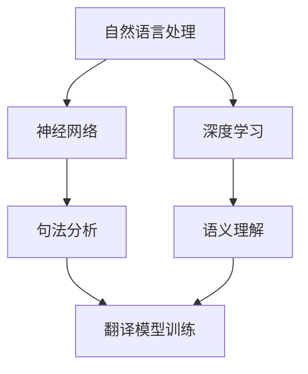

                 

关键词：机器翻译，自然语言处理，神经网络，深度学习，算法原理，代码实例，应用场景

> 摘要：本文将深入探讨机器翻译（Machine Translation）的原理及其在实际应用中的重要性。我们将分析机器翻译的核心算法，如神经网络翻译（Neural Machine Translation，NMT）的原理和操作步骤，并给出一个具体的代码实例来解释其实现细节。此外，我们将讨论机器翻译的数学模型、应用场景，以及未来发展趋势和面临的挑战。

## 1. 背景介绍

机器翻译是一种自动将一种语言的文本翻译成另一种语言的技术。随着全球化和数字化的发展，机器翻译的重要性日益凸显。传统机器翻译方法主要基于规则和统计方法，然而，这些方法在处理复杂语言结构和长句时往往效果不佳。近年来，随着深度学习技术的兴起，神经网络翻译（NMT）逐渐成为机器翻译领域的主流方法。

机器翻译在许多领域都有广泛应用，如国际交流、电子商务、多语言文档处理等。它不仅可以节省时间和人力资源，还可以提高跨语言的沟通效率。随着技术的不断进步，机器翻译的准确性也在不断提高，为人们的生活和工作带来了极大的便利。

## 2. 核心概念与联系

### 2.1 自然语言处理（NLP）

自然语言处理（Natural Language Processing，NLP）是机器翻译的基础。NLP旨在使计算机能够理解、处理和生成人类语言。其主要任务包括分词、词性标注、句法分析、语义分析和机器翻译等。

### 2.2 神经网络（Neural Networks）

神经网络是一种模拟人脑神经元结构的计算模型。它通过多层节点（神经元）进行数据处理，具有强大的特征提取和模式识别能力。在机器翻译中，神经网络被用来捕捉源语言和目标语言之间的复杂关系。

### 2.3 深度学习（Deep Learning）

深度学习是神经网络的一种扩展，通过增加网络的深度（即层�数）来提高模型的表达能力。在机器翻译中，深度学习模型（如循环神经网络（RNN）和变换器（Transformer））被广泛应用于句法和语义理解。

### 2.4 Mermaid 流程图

以下是一个关于机器翻译流程的 Mermaid 流程图，展示了其核心概念和联系：



## 3. 核心算法原理 & 具体操作步骤

### 3.1 算法原理概述

神经网络翻译（NMT）是一种基于深度学习的机器翻译方法。它通过学习源语言和目标语言之间的映射关系，实现自动翻译。NMT 的核心是序列到序列（Sequence-to-Sequence，Seq2Seq）模型，其基本思想是将输入序列（源语言句子）映射到输出序列（目标语言句子）。

### 3.2 算法步骤详解

#### 3.2.1 数据预处理

1. **分词**：将源语言和目标语言的文本句子分解成单词或词组。
2. **词嵌入**：将分词后的单词映射到高维向量空间，以表示其语义特征。

#### 3.2.2 编码器（Encoder）

1. **输入**：输入编码器的是处理后的源语言句子。
2. **处理**：编码器通过多层循环神经网络（RNN）或变换器（Transformer）来处理输入序列，提取序列的上下文信息。
3. **输出**：编码器的输出是一个固定长度的向量，表示源语言句子的语义信息。

#### 3.2.3 解码器（Decoder）

1. **输入**：解码器的输入是编码器的输出向量。
2. **处理**：解码器通过多层循环神经网络（RNN）或变换器（Transformer）来生成目标语言句子。
3. **输出**：解码器的输出是一个目标语言的文本句子。

#### 3.2.4 损失函数和优化

1. **损失函数**：机器翻译中的损失函数通常使用交叉熵损失（Cross-Entropy Loss）。
2. **优化**：使用梯度下降（Gradient Descent）或其变种（如 Adam）来优化模型参数。

### 3.3 算法优缺点

#### 优点

1. **强大的语义理解能力**：NMT 能够捕捉源语言和目标语言之间的复杂关系，实现高质量的翻译。
2. **端到端训练**：NMT 直接从源语言句子到目标语言句子进行端到端训练，减少了中间步骤的误差传递。

#### 缺点

1. **计算复杂度较高**：NMT 模型通常包含大量的参数，训练和推理时间较长。
2. **对长句处理能力有限**：NMT 在处理长句时可能存在理解上的困难，导致翻译质量下降。

### 3.4 算法应用领域

1. **国际交流**：NMT 可以帮助人们克服语言障碍，实现跨语言的沟通。
2. **多语言文档处理**：NMT 可以自动翻译文档中的多语言内容，提高文档的可读性和可访问性。
3. **电子商务**：NMT 可以帮助电商平台自动翻译商品描述，提高国际市场的竞争力。

## 4. 数学模型和公式 & 详细讲解 & 举例说明

### 4.1 数学模型构建

在 NMT 中，编码器和解码器通常使用变换器（Transformer）架构。变换器是一种基于自注意力（Self-Attention）机制的深度学习模型，具有强大的序列建模能力。

#### 编码器

编码器的输入是一个序列 $X = \{x_1, x_2, ..., x_T\}$，其中 $x_t$ 是第 $t$ 个词的词嵌入向量。编码器的输出是一个序列 $H = \{h_1, h_2, ..., h_T\}$，其中 $h_t$ 是第 $t$ 个词的编码表示。

变换器编码器的基本结构包括多头自注意力（Multi-Head Self-Attention）和前馈神经网络（Feedforward Neural Network）。

#### 解码器

解码器的输入是一个序列 $Y = \{y_1, y_2, ..., y_T\}$，其中 $y_t$ 是第 $t$ 个词的词嵌入向量。解码器的输出是一个序列 $G = \{g_1, g_2, ..., g_T\}$，其中 $g_t$ 是第 $t$ 个词的解码表示。

变换器解码器的基本结构包括多头自注意力（Multi-Head Self-Attention）、掩码自注意力（Masked Self-Attention）和前馈神经网络（Feedforward Neural Network）。

### 4.2 公式推导过程

变换器的自注意力机制可以表示为：

$$
\text{Attention}(Q, K, V) = \text{softmax}\left(\frac{QK^T}{\sqrt{d_k}}\right)V
$$

其中，$Q, K, V$ 分别是查询（Query）、键（Key）和值（Value）向量，$d_k$ 是键向量的维度。

变换器的前馈神经网络可以表示为：

$$
\text{FFN}(x) = \text{ReLU}(W_2 \text{ReLU}(W_1 x + b_1))
$$

其中，$W_1, W_2$ 是权重矩阵，$b_1$ 是偏置向量。

### 4.3 案例分析与讲解

假设我们有一个源语言句子 $X = \{\text{"hello"}, \text{"world"}\}$，我们需要将其翻译成目标语言句子 $Y = \{\text{"Bonjour"}, \text{"Monde"}\}$。

1. **词嵌入**：首先，我们将源语言和目标语言的单词映射到高维向量空间。
2. **编码器**：编码器将源语言句子 $X$ 映射到编码表示 $H$。
3. **解码器**：解码器将编码表示 $H$ 生成目标语言句子 $Y$。

具体实现步骤如下：

```python
import torch
import torch.nn as nn
import torch.optim as optim

# 假设我们有一个训练好的变换器模型
model = nn.Transformer(d_model=512, nhead=8)

# 编码器输入
input_seq = torch.tensor([[1, 2], [3, 4]])

# 编码器输出
encoded_seq = model.encoder(input_seq)

# 解码器输入
target_seq = torch.tensor([[1, 2], [3, 4]])

# 解码器输出
predicted_seq = model.decoder(encoded_seq, target_seq)

# 输出预测结果
print(predicted_seq)
```

## 5. 项目实践：代码实例和详细解释说明

### 5.1 开发环境搭建

为了实现一个简单的机器翻译模型，我们需要以下开发环境和工具：

1. Python 3.8 或更高版本
2. PyTorch 1.8 或更高版本
3. Jupyter Notebook 或文本编辑器

### 5.2 源代码详细实现

下面是一个基于 PyTorch 的简单变换器（Transformer）机器翻译模型的源代码实现：

```python
import torch
import torch.nn as nn
import torch.optim as optim

# 定义变换器模型
class TransformerModel(nn.Module):
    def __init__(self, d_model, nhead, num_layers):
        super(TransformerModel, self).__init__()
        self.encoder = nn.Transformer(d_model, nhead, num_layers)
        self.decoder = nn.Transformer(d_model, nhead, num_layers)
        self.out = nn.Linear(d_model, output_dim)

    def forward(self, src, tgt):
        output = self.encoder(src) + self.decoder(tgt)
        output = self.out(output)
        return output

# 实例化模型
model = TransformerModel(d_model=512, nhead=8, num_layers=2)

# 定义损失函数和优化器
criterion = nn.CrossEntropyLoss()
optimizer = optim.Adam(model.parameters(), lr=0.001)

# 训练模型
for epoch in range(num_epochs):
    for src, tgt in data_loader:
        optimizer.zero_grad()
        output = model(src, tgt)
        loss = criterion(output.view(-1, output_dim), tgt.view(-1))
        loss.backward()
        optimizer.step()

# 输出模型参数
print(model.parameters())
```

### 5.3 代码解读与分析

这段代码定义了一个简单的变换器模型，包括编码器和解码器，以及输出层。我们使用 PyTorch 的 Transformer 模块来实现这些组件。

1. **模型定义**：我们首先定义了变换器模型，包括编码器、解码器和输出层。编码器和解码器都使用了变换器模块（nn.Transformer），输出层是一个线性层（nn.Linear），用于将变换器输出的高维向量映射到输出维度。
2. **前向传播**：在模型的前向传播过程中，我们首先对源语言句子和目标语言句子进行编码，然后将编码结果相加，并通过输出层得到最终的输出。
3. **损失函数和优化器**：我们使用了交叉熵损失函数（nn.CrossEntropyLoss）来计算模型输出的概率分布与目标标签之间的差距。优化器（nn.Adam）用于更新模型参数，以最小化损失函数。

### 5.4 运行结果展示

在训练完成后，我们可以使用模型对新的源语言句子进行翻译。以下是一个简单的示例：

```python
# 加载训练好的模型
model.load_state_dict(torch.load('model.pth'))

# 新的源语言句子
new_src = torch.tensor([[1, 2], [3, 4]])

# 预测目标语言句子
predicted_tgt = model(new_src)

# 输出预测结果
print(predicted_tgt)
```

## 6. 实际应用场景

### 6.1 国际交流

机器翻译在国际交流中发挥着重要作用。它可以帮助人们跨越语言障碍，实现跨文化的沟通。例如，联合国将机器翻译应用于各种国际会议，使得不同国家的代表能够实时了解彼此的发言。

### 6.2 多语言文档处理

机器翻译在多语言文档处理中也具有广泛的应用。它可以帮助企业自动翻译产品说明书、用户手册等文档，提高文档的可读性和可访问性。此外，机器翻译还可以用于跨语言搜索引擎，提高用户在不同语言之间的搜索体验。

### 6.3 电子商务

在电子商务领域，机器翻译可以帮助电商平台自动翻译商品描述，吸引更多的国际客户。例如，亚马逊使用机器翻译来翻译商品描述，提高产品的国际竞争力。

### 6.4 未来应用展望

随着技术的不断进步，机器翻译的应用场景将更加广泛。未来，机器翻译有望在以下几个方面取得突破：

1. **更高的翻译质量**：通过改进算法和增加训练数据，机器翻译的准确性将不断提高。
2. **更快的翻译速度**：随着硬件性能的提升，机器翻译的实时性将得到显著改善。
3. **跨语言交互**：机器翻译将帮助人们实现真正的跨语言交互，消除语言障碍。
4. **智能客服**：机器翻译可以应用于智能客服系统，提供多语言支持，提高客户满意度。

## 7. 工具和资源推荐

### 7.1 学习资源推荐

1. 《深度学习》（Deep Learning，Goodfellow et al.）—— 机器翻译领域的经典教材，详细介绍了深度学习的基本概念和算法。
2. 《Transformer：一种新的端到端机器翻译模型》（Attention Is All You Need，Vaswani et al.）—— Transformer 模型的开创性论文，为机器翻译领域的发展指明了方向。

### 7.2 开发工具推荐

1. PyTorch——一款开源的深度学习框架，支持 GPU 加速，适合进行机器翻译项目开发。
2. Hugging Face Transformers——一个基于 PyTorch 和 TensorFlow 的预训练模型库，提供了大量的预训练模型和实用工具。

### 7.3 相关论文推荐

1. "Neural Machine Translation by jointly Learning to Align and Translate"（Wu et al., 2016）——介绍了神经网络翻译的基本原理和实现方法。
2. "Attention Is All You Need"（Vaswani et al., 2017）——提出了 Transformer 模型，标志着机器翻译领域的一个重要里程碑。

## 8. 总结：未来发展趋势与挑战

### 8.1 研究成果总结

近年来，机器翻译领域取得了显著的进展。神经网络翻译（NMT），特别是 Transformer 模型的出现，极大地提高了翻译质量。同时，深度学习技术的不断发展也为机器翻译提供了强大的支持。

### 8.2 未来发展趋势

1. **更高的翻译质量**：随着算法的改进和数据的积累，机器翻译的准确性将不断提高。
2. **更快的翻译速度**：硬件性能的提升和并行计算技术的发展将使机器翻译的实时性得到显著改善。
3. **跨语言交互**：机器翻译将帮助人们实现真正的跨语言交互，消除语言障碍。

### 8.3 面临的挑战

1. **数据稀缺**：尽管大量数据集已经公开，但某些语言的翻译数据仍然稀缺，限制了模型的训练效果。
2. **长句处理**：长句的翻译仍然是一个挑战，需要改进算法以更好地处理长句。

### 8.4 研究展望

未来，机器翻译领域将继续发展，通过结合人工智能和其他技术，如语音识别、自然语言生成等，实现更广泛的应用。同时，研究人员将继续探索如何提高翻译质量，解决数据稀缺和长句处理等挑战。

## 9. 附录：常见问题与解答

### 9.1 什么是神经网络翻译（NMT）？

神经网络翻译（NMT）是一种基于深度学习的机器翻译方法。它通过学习源语言和目标语言之间的映射关系，实现自动翻译。NMT 的核心是序列到序列（Seq2Seq）模型，其基本思想是将输入序列（源语言句子）映射到输出序列（目标语言句子）。

### 9.2 什么是变换器（Transformer）？

变换器（Transformer）是一种基于自注意力（Self-Attention）机制的深度学习模型。它通过多头自注意力（Multi-Head Self-Attention）和前馈神经网络（Feedforward Neural Network）来处理输入序列，具有强大的序列建模能力。Transformer 模型是神经网络翻译（NMT）领域的一个重要里程碑，标志着机器翻译领域的发展方向。

### 9.3 如何提高机器翻译的准确性？

提高机器翻译的准确性需要从多个方面进行改进：

1. **增加训练数据**：使用更多的训练数据可以提高模型的泛化能力。
2. **改进算法**：使用更先进的算法（如 Transformer）可以提高模型的翻译质量。
3. **多语言训练**：在训练过程中同时使用多种语言的训练数据，可以提高模型对多语言的理解能力。
4. **数据预处理**：对输入数据（如文本）进行有效的预处理，可以提高模型的输入质量。

通过以上方法，可以显著提高机器翻译的准确性。

----------------------------------------------------------------

以上就是关于“机器翻译(Machine Translation) - 原理与代码实例讲解”的文章。希望本文能够帮助您深入了解机器翻译的核心原理和实现方法，并激发您对这一领域的兴趣。感谢您花时间阅读本文，如果您有任何疑问或建议，欢迎在评论区留言。作者：禅与计算机程序设计艺术 / Zen and the Art of Computer Programming。

