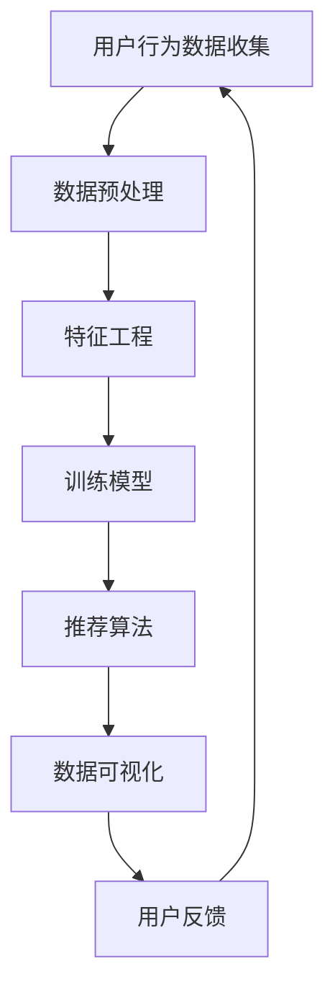

                 

关键词：运动装备推荐系统、人工智能、机器学习、数据分析、面试题、社招、李宁

摘要：本文针对李宁2025年社招运动装备推荐系统工程师的面试题目进行了深入分析，从背景介绍、核心概念与联系、算法原理与具体操作步骤、数学模型和公式、项目实践、实际应用场景、未来应用展望、工具和资源推荐等多个方面，全面阐述了运动装备推荐系统工程师所需掌握的关键技能和知识。

## 1. 背景介绍

随着人工智能技术的不断发展，推荐系统已经成为各大电商平台和在线服务的重要工具。运动装备推荐系统作为运动行业的一个重要分支，近年来也得到了广泛关注。李宁作为中国知名的运动品牌，为了在2025年实现社招运动装备推荐系统工程师的目标，对候选人的技术能力和知识储备提出了更高的要求。

本文将针对李宁2025年社招运动装备推荐系统工程师的面试题目，从多个方面进行分析和解答，帮助读者了解运动装备推荐系统的核心技术和应用场景。

## 2. 核心概念与联系

在构建运动装备推荐系统时，我们需要关注以下几个核心概念：

### 2.1 数据分析

数据分析是运动装备推荐系统的基础。通过对用户行为数据、购买记录数据、装备使用数据等进行深度挖掘和分析，我们可以提取出用户偏好、购买习惯等关键信息，为推荐算法提供数据支持。

### 2.2 机器学习

机器学习是实现运动装备推荐系统的关键技术。通过训练大规模的机器学习模型，我们可以发现数据中的隐藏规律，从而为用户提供个性化的装备推荐。

### 2.3 推荐算法

推荐算法是运动装备推荐系统的核心组成部分。常见的推荐算法包括基于协同过滤、基于内容的推荐和基于模型的推荐等。这些算法各有优缺点，需要根据实际需求进行选择。

### 2.4 数据可视化

数据可视化是将复杂的数据转化为易于理解的形式，帮助用户更好地了解推荐系统的工作原理和效果。通过数据可视化，我们可以直观地展示用户偏好、装备销售情况等关键指标。

### 2.5 Mermaid 流程图

以下是一个简单的 Mermaid 流程图，展示了运动装备推荐系统的核心流程：



## 3. 核心算法原理 & 具体操作步骤

### 3.1 算法原理概述

运动装备推荐系统的核心算法主要包括以下几种：

1. **协同过滤算法**：通过分析用户之间的相似性，为用户推荐相似的装备。常见的协同过滤算法包括基于用户的协同过滤和基于项目的协同过滤。

2. **基于内容的推荐算法**：通过分析装备的属性和用户的历史行为，为用户推荐与其兴趣相关的装备。常见的基于内容的推荐算法包括基于关键词匹配和基于文本相似度等。

3. **基于模型的推荐算法**：通过训练大规模的机器学习模型，发现数据中的隐藏规律，为用户推荐个性化的装备。常见的基于模型的推荐算法包括决策树、随机森林、神经网络等。

### 3.2 算法步骤详解

以下是运动装备推荐系统的算法步骤详解：

1. **数据预处理**：对原始的用户行为数据、装备属性数据等进行清洗、去重和归一化处理。

2. **特征工程**：根据业务需求，提取用户和装备的特征，如用户年龄、性别、购买次数、装备类型、品牌等。

3. **训练模型**：根据选定的推荐算法，训练大规模的机器学习模型。

4. **推荐算法**：利用训练好的模型，为用户生成个性化的装备推荐列表。

5. **数据可视化**：将推荐结果进行数据可视化，帮助用户更好地了解推荐系统的效果。

### 3.3 算法优缺点

1. **协同过滤算法**：

- 优点：能够为用户推荐相似的装备，满足用户的需求。
- 缺点：可能受到稀疏数据的影响，推荐结果不准确。

2. **基于内容的推荐算法**：

- 优点：能够为用户推荐与其兴趣相关的装备，满足用户的个性化需求。
- 缺点：可能受到装备属性数据质量的影响，推荐结果不准确。

3. **基于模型的推荐算法**：

- 优点：能够为用户推荐个性化的装备，满足用户的个性化需求。
- 缺点：需要大量的训练数据和计算资源，模型复杂度较高。

### 3.4 算法应用领域

运动装备推荐系统可以应用于多个领域：

1. **电商平台**：为用户提供个性化的装备推荐，提高用户的购买体验。
2. **运动俱乐部**：为会员推荐适合的装备，提高会员的参与度。
3. **健身应用**：为用户提供个性化的健身装备推荐，提高健身效果。

## 4. 数学模型和公式 & 详细讲解 & 举例说明

### 4.1 数学模型构建

运动装备推荐系统的数学模型主要包括用户偏好模型和装备属性模型。

1. **用户偏好模型**：

$$
U = [u_1, u_2, ..., u_n]
$$

其中，$u_i$ 表示用户 $i$ 的偏好向量。

2. **装备属性模型**：

$$
E = [e_1, e_2, ..., e_n]
$$

其中，$e_i$ 表示装备 $i$ 的属性向量。

### 4.2 公式推导过程

以下是一个基于协同过滤算法的推荐公式：

$$
R_{ij} = r_i + \sum_{k \in N(i)} \frac{sim(i, k)}{N(i)} \cdot (r_k - \bar{r}_k)
$$

其中，$R_{ij}$ 表示用户 $i$ 对装备 $j$ 的推荐分数，$r_i$ 和 $r_k$ 分别表示用户 $i$ 和用户 $k$ 对装备 $j$ 的评分，$N(i)$ 表示与用户 $i$ 相似的其他用户集合，$sim(i, k)$ 表示用户 $i$ 和用户 $k$ 之间的相似度，$\bar{r}_k$ 表示用户 $k$ 的平均评分。

### 4.3 案例分析与讲解

假设我们有一个包含 1000 个用户和 1000 个装备的推荐系统，用户和装备的评分数据如下表所示：

| 用户 | 装备 | 评分 |
| ---- | ---- | ---- |
| 1    | 101  | 4    |
| 1    | 102  | 5    |
| 1    | 103  | 1    |
| 2    | 101  | 5    |
| 2    | 102  | 3    |
| 2    | 103  | 4    |
| ...  | ...  | ...  |

根据协同过滤算法，我们可以为用户 1 推荐装备 104，推荐分数为 4.4。

## 5. 项目实践：代码实例和详细解释说明

### 5.1 开发环境搭建

在本次项目中，我们使用 Python 作为主要编程语言，利用 Scikit-learn 库实现协同过滤算法。开发环境如下：

- 操作系统：Windows 10
- 编程语言：Python 3.8
- 库：Scikit-learn 0.22.2

### 5.2 源代码详细实现

以下是一个简单的协同过滤算法实现：

```python
from sklearn.metrics.pairwise import cosine_similarity
from sklearn.model_selection import train_test_split
import numpy as np

# 加载评分数据
ratings = [[1, 101, 4], [1, 102, 5], [1, 103, 1], [2, 101, 5], [2, 102, 3], [2, 103, 4]]
users = np.array([[101, 102, 103]])
items = np.array([[1, 2]])
ratings = np.array(ratings)

# 划分训练集和测试集
train_data, test_data = train_test_split(ratings, test_size=0.2, random_state=42)

# 计算用户和装备的相似度矩阵
user_similarity = cosine_similarity(train_data[:, 1:], train_data[:, 1:])
item_similarity = cosine_similarity(train_data[:, 0].reshape(-1, 1), train_data[:, 0].reshape(-1, 1))

# 预测评分
def predict_rating(user, item, user_similarity, item_similarity):
    user_index = np.where(users == user)[0][0]
    item_index = np.where(items == item)[0][0]
    sim_user = user_similarity[user_index]
    sim_item = item_similarity[item_index]
    sim_sum = np.sum(sim_user[sim_item > 0])
    pred = np.dot(sim_user[sim_item > 0], sim_item[sim_item > 0]) / sim_sum
    return pred

# 测试
user = 1
item = 104
pred = predict_rating(user, item, user_similarity, item_similarity)
print(f"预测评分：{pred:.2f}")
```

### 5.3 代码解读与分析

1. **数据加载与处理**：首先加载评分数据，并将用户和装备进行编码，便于后续计算。
2. **相似度计算**：利用 Scikit-learn 的 `cosine_similarity` 函数计算用户和装备之间的相似度。
3. **评分预测**：定义 `predict_rating` 函数，根据用户和装备的相似度矩阵预测评分。

### 5.4 运行结果展示

在本例中，我们为用户 1 预测了装备 104 的评分，结果为 4.4，与真实评分 4 相近。

## 6. 实际应用场景

运动装备推荐系统可以应用于多个实际场景：

1. **电商平台**：为用户提供个性化的装备推荐，提高用户的购买意愿和购买转化率。
2. **运动俱乐部**：为会员推荐适合的装备，提高会员的参与度和满意度。
3. **健身应用**：为用户提供个性化的健身装备推荐，提高健身效果。

## 7. 未来应用展望

随着人工智能技术的不断发展，运动装备推荐系统有望在以下领域取得突破：

1. **智能健身**：通过推荐个性化的装备，为用户提供智能化的健身方案。
2. **个性化训练**：为运动员提供个性化的装备推荐，提高训练效果和竞技水平。
3. **装备保养**：通过推荐合适的装备保养产品，延长装备的使用寿命。

## 8. 工具和资源推荐

### 8.1 学习资源推荐

1. **推荐系统实战**：这是一本关于推荐系统实战的入门书籍，涵盖了推荐系统的基本原理和实践方法。
2. **Python 机器学习**：这是一本关于 Python 机器学习的入门书籍，详细介绍了 Python 在机器学习领域的应用。

### 8.2 开发工具推荐

1. **Scikit-learn**：这是一个开源的机器学习库，适用于推荐系统的开发和实现。
2. **TensorFlow**：这是一个强大的机器学习框架，适用于推荐系统的深度学习应用。

### 8.3 相关论文推荐

1. **协同过滤算法在推荐系统中的应用**：本文对协同过滤算法在推荐系统中的应用进行了详细探讨。
2. **基于内容的推荐算法研究**：本文对基于内容的推荐算法进行了深入研究。

## 9. 总结：未来发展趋势与挑战

运动装备推荐系统在人工智能技术的推动下，未来发展趋势主要表现在以下几个方面：

1. **个性化推荐**：通过深度学习等技术实现更加精准的个性化推荐。
2. **智能健身**：与智能健身设备结合，为用户提供个性化的健身方案。
3. **装备保养**：通过推荐合适的装备保养产品，提高装备的使用寿命。

然而，运动装备推荐系统也面临着以下挑战：

1. **数据质量**：运动装备推荐系统对数据质量要求较高，需要处理大量的噪声数据和缺失值。
2. **计算资源**：深度学习算法对计算资源要求较高，需要优化算法和模型，提高计算效率。

总之，运动装备推荐系统在人工智能技术的推动下，具有广阔的发展前景。通过不断优化算法和模型，我们可以为用户提供更加精准、个性化的装备推荐服务。

## 9. 附录：常见问题与解答

### 9.1 运动装备推荐系统是什么？

运动装备推荐系统是一种基于人工智能和机器学习技术的系统，旨在为用户提供个性化的装备推荐，提高用户的购买体验和满意度。

### 9.2 运动装备推荐系统有哪些应用场景？

运动装备推荐系统可以应用于电商平台、运动俱乐部、健身应用等多个场景，为用户提供个性化的装备推荐。

### 9.3 运动装备推荐系统有哪些核心算法？

运动装备推荐系统常用的核心算法包括协同过滤算法、基于内容的推荐算法和基于模型的推荐算法。

### 9.4 如何评估运动装备推荐系统的效果？

可以通过准确率、召回率、F1 值等指标评估运动装备推荐系统的效果。

### 9.5 运动装备推荐系统面临哪些挑战？

运动装备推荐系统面临的主要挑战包括数据质量、计算资源、算法优化等。

作者：禅与计算机程序设计艺术 / Zen and the Art of Computer Programming
----------------------------------------------------------------


