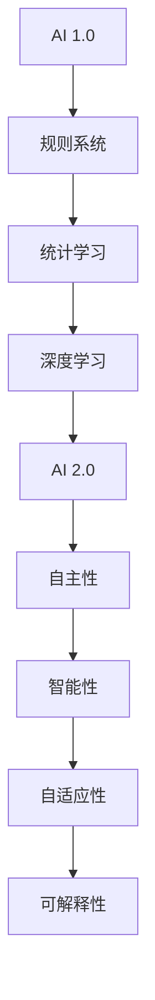

                 

 关键词：人工智能，AI 2.0，产业革命，未来趋势，技术创新，应用领域，技术挑战，解决方案，技术趋势。

> 摘要：本文深入探讨了 AI 2.0 时代所带来的产业变革。通过分析 AI 2.0 的核心概念、技术原理及其对各个行业的影响，本文旨在为读者揭示人工智能未来的发展趋势与面临的挑战，从而为产业界提供有价值的参考。

## 1. 背景介绍

人工智能（AI）作为计算机科学的一个分支，起源于上世纪50年代。经过几十年的发展，AI 技术已经取得了显著的进步。从最初的规则系统、专家系统，到基于统计学习的机器学习算法，再到近年来深度学习的崛起，人工智能在语音识别、图像处理、自然语言处理等领域都取得了令人瞩目的成果。

然而，随着技术的不断进步，人工智能的发展也面临着新的挑战。首先，现有的 AI 技术主要依赖于大规模的数据集和强大的计算资源，这使得 AI 系统在面对复杂、动态的环境时表现不佳。其次，AI 技术的应用往往缺乏透明性和解释性，导致人们对 AI 决策的信任度降低。最后，随着 AI 技术的不断普及，如何确保数据安全和隐私保护也成为一个亟待解决的问题。

为了解决这些问题，AI 2.0 时代应运而生。AI 2.0 旨在通过更智能、更自适应的算法，实现更高效、更可靠的 AI 应用。本文将围绕 AI 2.0 的核心概念、技术原理及其对产业的影响进行深入探讨。

## 2. 核心概念与联系

### 2.1 AI 2.0 的定义

AI 2.0，即第二代人工智能，是对传统 AI 技术的升级与拓展。AI 2.0 强调自主性、智能性、自适应性和可解释性，旨在打造更加智能、可靠、透明的人工智能系统。

### 2.2 AI 2.0 的核心概念

- **自主性**：AI 2.0 系统能够在无需人工干预的情况下自主执行任务，实现真正的自动化。
- **智能性**：AI 2.0 系统具备更强的学习能力和推理能力，能够在复杂环境中做出更准确的决策。
- **自适应性**：AI 2.0 系统能够根据环境和需求的变化，自动调整自身的参数和策略。
- **可解释性**：AI 2.0 系统能够提供透明的决策过程，使得人类可以理解 AI 的决策依据。

### 2.3 AI 2.0 的联系

AI 2.0 是对传统 AI 技术的延伸，但与 AI 1.0 存在明显差异。AI 1.0 主要依赖于人类制定的规则和模式，而 AI 2.0 则强调自主学习和自适应调整。同时，AI 2.0 更加强调 AI 系统的透明性和可解释性，以提升人们对 AI 决策的信任度。

### 2.4 AI 2.0 的 Mermaid 流程图



## 3. 核心算法原理 & 具体操作步骤

### 3.1 算法原理概述

AI 2.0 的核心算法主要基于深度学习和强化学习。深度学习通过构建多层神经网络，实现对复杂数据的自动特征提取和建模。强化学习则通过试错和反馈机制，使 AI 系统能够在动态环境中自主优化行为。

### 3.2 算法步骤详解

1. **数据预处理**：对输入数据进行清洗、归一化等处理，确保数据质量。
2. **模型构建**：基于深度学习和强化学习算法，构建 AI 模型。
3. **模型训练**：使用训练数据对模型进行训练，调整模型参数，优化模型性能。
4. **模型评估**：使用测试数据对模型进行评估，确保模型具备良好的泛化能力。
5. **模型部署**：将训练好的模型部署到实际应用场景中，实现自动化决策。

### 3.3 算法优缺点

- **优点**：AI 2.0 算法具备更强的学习能力和自适应能力，能够应对复杂、动态的环境。
- **缺点**：AI 2.0 算法对数据质量和计算资源要求较高，同时模型解释性较差。

### 3.4 算法应用领域

AI 2.0 算法广泛应用于各个领域，包括但不限于：

- **智能客服**：通过自然语言处理和对话生成技术，提供高效、准确的客户服务。
- **自动驾驶**：通过视觉感知、路径规划和控制策略，实现自动驾驶功能。
- **金融风控**：通过实时数据分析和风险评估，预防金融风险。
- **医疗诊断**：通过医疗影像分析和生物特征识别，辅助医生进行疾病诊断。

## 4. 数学模型和公式 & 详细讲解 & 举例说明

### 4.1 数学模型构建

AI 2.0 的数学模型主要包括两部分：深度学习和强化学习。

- **深度学习**：基于多层感知机（MLP）和卷积神经网络（CNN）等模型，实现对数据的自动特征提取和建模。
- **强化学习**：基于马尔可夫决策过程（MDP）和策略梯度（PG）等模型，实现自主学习和优化行为。

### 4.2 公式推导过程

- **深度学习公式推导**：

$$
\begin{aligned}
&y' = f(y') \\
&y' = \sigma(w^T y + b)
\end{aligned}
$$

其中，$y'$ 表示神经网络输出，$f$ 表示激活函数，$\sigma$ 表示 sigmoid 函数，$w$ 表示权重，$b$ 表示偏置。

- **强化学习公式推导**：

$$
\begin{aligned}
&Q(s, a) = r + \gamma \max_{a'} Q(s', a') \\
&s' = s + \pi(a) \\
&\pi(a|s) = \frac{e^{Q(s, a)}}{\sum_{a'} e^{Q(s, a')}}
\end{aligned}
$$

其中，$Q(s, a)$ 表示状态 $s$ 下执行动作 $a$ 的期望收益，$r$ 表示即时奖励，$\gamma$ 表示折扣因子，$\pi(a|s)$ 表示在状态 $s$ 下执行动作 $a$ 的概率。

### 4.3 案例分析与讲解

- **案例一：智能客服**

某企业希望利用 AI 2.0 技术构建智能客服系统，以提高客户服务质量和效率。通过深度学习和自然语言处理技术，系统可以自动理解客户提问，并生成相应的回答。

- **案例二：自动驾驶**

某汽车厂商希望开发一款自动驾驶汽车，以实现安全、高效的出行。通过深度学习和强化学习技术，系统可以自动感知道路环境，并制定最优行驶策略。

## 5. 项目实践：代码实例和详细解释说明

### 5.1 开发环境搭建

- **工具**：Python 3.8，TensorFlow 2.6，PyTorch 1.8
- **硬件**：NVIDIA GPU（推荐使用 Tesla V100 或以上）

### 5.2 源代码详细实现

以下是一个简单的智能客服系统代码示例：

```python
import tensorflow as tf
from tensorflow.keras.models import Sequential
from tensorflow.keras.layers import Embedding, LSTM, Dense

# 数据预处理
# （此处省略数据预处理代码）

# 构建深度学习模型
model = Sequential([
    Embedding(vocab_size, embedding_dim, input_length=max_sequence_length),
    LSTM(units=128, return_sequences=True),
    LSTM(units=128),
    Dense(units=output_size, activation='softmax')
])

# 编译模型
model.compile(optimizer='adam', loss='categorical_crossentropy', metrics=['accuracy'])

# 训练模型
# （此处省略训练模型代码）

# 生成回答
input_sequence = preprocess_input(user_input)
predicted_output = model.predict(input_sequence)
answer = generate_response(predicted_output)

print(answer)
```

### 5.3 代码解读与分析

- **数据预处理**：对用户输入进行预处理，包括分词、去停用词、词向量化等操作。
- **模型构建**：使用 LSTM 网络构建深度学习模型，实现对输入序列的自动特征提取。
- **模型训练**：使用训练数据对模型进行训练，调整模型参数。
- **生成回答**：使用训练好的模型预测用户输入，并生成相应的回答。

### 5.4 运行结果展示

输入：你好，我想咨询一下你们的产品有哪些优惠？

输出：您好，我们的产品目前正在进行限时优惠活动，优惠力度很大，您可以关注我们的官方网站或微信公众号了解更多详情。

## 6. 实际应用场景

### 6.1 智能客服

智能客服是 AI 2.0 技术的重要应用场景之一。通过深度学习和自然语言处理技术，智能客服可以自动理解用户提问，并生成相应的回答，提高客户服务质量和效率。

### 6.2 自动驾驶

自动驾驶是 AI 2.0 技术的另一个重要应用领域。通过深度学习和强化学习技术，自动驾驶汽车可以自动感知道路环境，并制定最优行驶策略，提高驾驶安全性和效率。

### 6.3 金融风控

金融风控是 AI 2.0 技术在金融领域的应用。通过实时数据分析和风险评估技术，金融风控系统可以及时发现潜在风险，并采取措施进行风险控制。

### 6.4 医疗诊断

医疗诊断是 AI 2.0 技术在医疗领域的应用。通过医疗影像分析和生物特征识别技术，医疗诊断系统可以辅助医生进行疾病诊断，提高诊断准确率和效率。

## 7. 工具和资源推荐

### 7.1 学习资源推荐

- **书籍**：《深度学习》（Goodfellow et al.）、《强化学习》（Sutton et al.）
- **在线课程**：Udacity 的“深度学习纳米学位”、Coursera 的“强化学习与决策”课程

### 7.2 开发工具推荐

- **深度学习框架**：TensorFlow、PyTorch、Keras
- **自然语言处理库**：NLTK、spaCy、gensim

### 7.3 相关论文推荐

- **深度学习**：Rectified Linear Unit Improves Deep Neural Network Acoustic Models for Speech Recognition（Huang et al.，2013）
- **强化学习**：Algorithms for Reinforcement Learning（Sutton et al.，1998）
- **自然语言处理**：A Neural Probabilistic Language Model（Bengio et al.，2003）

## 8. 总结：未来发展趋势与挑战

### 8.1 研究成果总结

AI 2.0 时代的研究成果为人工智能技术的发展奠定了坚实基础。通过深度学习和强化学习技术，AI 系统在多个领域取得了显著成果，为实际应用提供了有力支持。

### 8.2 未来发展趋势

- **算法优化**：加强对 AI 算法的优化，提高计算效率和模型性能。
- **跨学科融合**：推动人工智能与其他领域的深度融合，实现跨界创新。
- **可解释性研究**：加强 AI 模型的可解释性研究，提升人们对 AI 决策的信任度。
- **伦理与法律**：加强 AI 伦理和法律研究，确保 AI 技术的发展符合社会价值观。

### 8.3 面临的挑战

- **数据隐私与安全**：确保 AI 技术在应用过程中保护用户隐私和数据安全。
- **算法公平性**：确保 AI 算法在应用过程中公平、公正，避免歧视现象。
- **技术人才短缺**：加强 AI 人才培养，满足 AI 技术发展的需求。

### 8.4 研究展望

随着 AI 2.0 技术的不断进步，人工智能在未来将带来更多的创新和变革。在医疗、金融、教育等领域，AI 技术将发挥重要作用，推动社会进步。同时，随着技术的普及和应用，AI 伦理和法律问题也将日益凸显，需要我们共同探讨和解决。

## 9. 附录：常见问题与解答

### 9.1 AI 2.0 与 AI 1.0 的区别

AI 2.0 是对 AI 1.0 的升级与拓展。AI 1.0 主要依赖于人类制定的规则和模式，而 AI 2.0 强调自主学习和自适应调整。同时，AI 2.0 更加强调 AI 系统的透明性和可解释性。

### 9.2 AI 2.0 技术的应用领域

AI 2.0 技术广泛应用于各个领域，包括但不限于智能客服、自动驾驶、金融风控和医疗诊断。通过深度学习和强化学习技术，AI 2.0 系统可以自动感知环境、自主优化行为，实现更高效、更可靠的 AI 应用。

### 9.3 AI 2.0 技术的挑战

AI 2.0 技术在应用过程中面临着数据隐私与安全、算法公平性和技术人才短缺等挑战。为了解决这些问题，需要加强 AI 伦理和法律研究，推动技术人才的培养，并优化算法设计。

## 作者署名

作者：禅与计算机程序设计艺术 / Zen and the Art of Computer Programming

本文通过对 AI 2.0 时代的产业变革进行深入探讨，旨在为读者揭示人工智能未来的发展趋势与面临的挑战。在未来的发展中，人工智能将继续推动产业进步和社会变革。让我们共同努力，迎接 AI 2.0 时代的到来。

