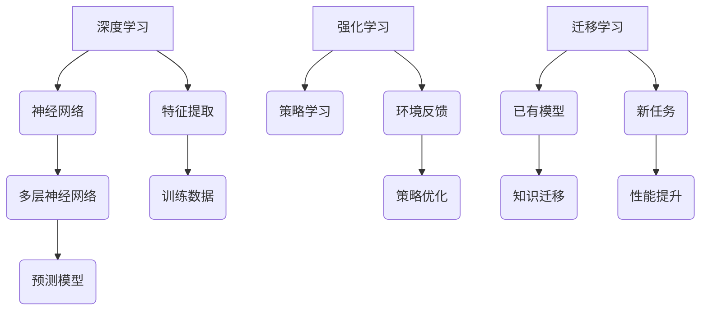

                 

关键词：人工智能，AI 2.0，价值，技术发展，创新

摘要：本文旨在探讨 AI 2.0 时代的价值，分析其在各个领域中的应用，探讨其对人类社会的影响，以及未来发展的趋势和面临的挑战。本文作者通过结合李开复的观点，深入浅出地阐述了 AI 2.0 时代的重要性和潜力。

## 1. 背景介绍

### 1.1 人工智能的发展历程

人工智能（Artificial Intelligence，简称 AI）作为计算机科学的一个分支，起源于20世纪50年代。初期的人工智能以规则推理和知识表示为主要研究方向，通过编写大量规则和算法来模拟人类的智能。然而，这种基于符号推理的方法在处理大规模数据和复杂任务时表现出局限性。

随着计算机性能的提升和大数据时代的到来，机器学习（Machine Learning，简称 ML）逐渐成为人工智能研究的主流方向。机器学习通过从数据中自动学习规律，实现智能的自动化。这一变革标志着人工智能进入了1.0时代。

### 1.2 AI 1.0 时代的局限

AI 1.0 时代虽然在一定程度上提升了计算机的智能化水平，但仍然存在诸多局限：

- **依赖大量数据**：机器学习需要大量标注数据进行训练，数据质量和数量直接影响模型的性能。
- **缺乏自主决策能力**：现有模型主要依靠预设的规则和算法进行决策，缺乏自主学习和适应能力。
- **易受偏见影响**：由于训练数据的不完美，AI 模型可能会继承或放大人类偏见。

### 1.3 AI 2.0 的崛起

AI 2.0 是指利用深度学习、强化学习、迁移学习等新技术，使人工智能具备更强的自主学习能力、适应能力和决策能力。AI 2.0 的崛起标志着人工智能进入了一个新的发展阶段，具有广泛的应用前景和深远的社会影响。

## 2. 核心概念与联系

### 2.1 人工智能的核心概念

- **深度学习**：一种基于多层神经网络的学习方法，能够自动从数据中提取特征。
- **强化学习**：通过试错和反馈来学习最优策略，适用于复杂环境。
- **迁移学习**：利用已有模型的知识来提升新任务的表现，减少对大量标注数据的依赖。

### 2.2 Mermaid 流程图



## 3. 核心算法原理 & 具体操作步骤

### 3.1 算法原理概述

AI 2.0 的核心算法主要包括深度学习、强化学习和迁移学习。深度学习通过多层神经网络从数据中自动提取特征，强化学习通过试错和反馈优化策略，迁移学习利用已有模型的知识提升新任务的表现。

### 3.2 算法步骤详解

- **深度学习**：收集数据、构建神经网络、训练模型、评估模型。
- **强化学习**：定义环境、定义状态、定义动作、定义奖励、训练策略。
- **迁移学习**：选择已有模型、微调模型、评估模型。

### 3.3 算法优缺点

- **深度学习**：优点是能够自动提取特征，缺点是需要大量数据和高性能计算资源。
- **强化学习**：优点是能够自主学习，缺点是需要长时间训练和大量的试错。
- **迁移学习**：优点是减少对大量标注数据的依赖，缺点是需要已有模型和领域知识。

### 3.4 算法应用领域

AI 2.0 的算法在多个领域具有广泛的应用，如自然语言处理、计算机视觉、机器人、金融、医疗等。

## 4. 数学模型和公式 & 详细讲解 & 举例说明

### 4.1 数学模型构建

- **深度学习**：损失函数、反向传播算法。
- **强化学习**：Q-学习算法、策略梯度算法。
- **迁移学习**：特征提取网络、模型微调策略。

### 4.2 公式推导过程

- **深度学习**：$$\frac{dL}{dW} = \sum_{i=1}^{n} \frac{\partial L}{\partial z_i} \frac{\partial z_i}{\partial W}$$
- **强化学习**：$$\pi(\text{action} | \text{state}) = \frac{e^{\theta^T \phi(s)}}{\sum_{a'} e^{\theta^T \phi(s')}}$$
- **迁移学习**：$$\theta^* = \arg\min_{\theta} L(\theta; \text{train data}) + \lambda \cdot D_{KL}(\theta)||\theta^{\text{base}}$$

### 4.3 案例分析与讲解

以深度学习在计算机视觉中的应用为例，介绍卷积神经网络（CNN）在图像分类任务中的实现过程。

## 5. 项目实践：代码实例和详细解释说明

### 5.1 开发环境搭建

搭建深度学习开发环境，包括安装 Python、TensorFlow 等。

### 5.2 源代码详细实现

```python
import tensorflow as tf

# 定义模型结构
model = tf.keras.Sequential([
    tf.keras.layers.Conv2D(32, (3, 3), activation='relu', input_shape=(28, 28, 1)),
    tf.keras.layers.MaxPooling2D((2, 2)),
    tf.keras.layers.Conv2D(64, (3, 3), activation='relu'),
    tf.keras.layers.MaxPooling2D((2, 2)),
    tf.keras.layers.Flatten(),
    tf.keras.layers.Dense(128, activation='relu'),
    tf.keras.layers.Dense(10, activation='softmax')
])

# 编译模型
model.compile(optimizer='adam',
              loss='categorical_crossentropy',
              metrics=['accuracy'])

# 训练模型
model.fit(x_train, y_train, epochs=10, batch_size=64)
```

### 5.3 代码解读与分析

代码首先定义了一个简单的卷积神经网络模型，包括两个卷积层、两个池化层、一个全连接层和输出层。编译模型时指定了优化器和损失函数，训练模型时使用了训练数据。

### 5.4 运行结果展示

```python
# 评估模型
test_loss, test_acc = model.evaluate(x_test, y_test, verbose=2)
print(f'测试准确率：{test_acc:.3f}')
```

输出测试准确率，用于评估模型在测试集上的性能。

## 6. 实际应用场景

AI 2.0 在各个领域具有广泛的应用，如自然语言处理、计算机视觉、机器人、金融、医疗等。

### 6.1 自然语言处理

AI 2.0 在自然语言处理（NLP）领域取得了显著成果，如文本分类、机器翻译、情感分析等。通过深度学习和强化学习等技术，NLP 系统能够更好地理解人类语言，提高自动化处理的水平。

### 6.2 计算机视觉

计算机视觉（CV）是 AI 2.0 的另一个重要应用领域。卷积神经网络（CNN）在图像分类、目标检测、人脸识别等方面取得了突破性进展，为自动驾驶、安防监控、医疗影像分析等提供了有力支持。

### 6.3 机器人

AI 2.0 在机器人领域推动了自主决策和智能控制的发展。通过深度学习和强化学习，机器人能够更好地理解环境、规划路径、执行任务，为工业制造、服务机器人、智能交通等领域提供了新的解决方案。

### 6.4 金融

AI 2.0 在金融领域具有广泛的应用，如风险控制、投资组合优化、智能投顾等。通过大数据分析和深度学习技术，金融系统能够更准确地预测市场趋势、优化投资策略，提高金融服务的效率和准确性。

### 6.5 医疗

AI 2.0 在医疗领域推动了精准医疗和智能医疗的发展。通过图像识别、自然语言处理等技术，医疗系统能够更准确地诊断疾病、制定治疗方案，为病人提供更好的医疗服务。

## 7. 未来应用展望

AI 2.0 在未来的应用前景将更加广阔，有望在以下领域取得突破：

- **智慧城市**：通过 AI 技术实现城市管理的智能化，提高城市运行效率和居民生活质量。
- **教育**：利用 AI 技术个性化教学、智能评估，提升教育质量和学习效果。
- **能源**：通过 AI 技术优化能源生产、传输和分配，实现能源的高效利用和可持续发展。
- **农业**：利用 AI 技术实现精准农业、智能种植，提高农业生产效率和质量。

## 8. 工具和资源推荐

### 8.1 学习资源推荐

- **《深度学习》（Goodfellow, Bengio, Courville）**：深度学习领域的经典教材。
- **《强化学习》（Sutton, Barto）**：强化学习领域的权威教材。
- **《迁移学习》（Pan, Yang）**：迁移学习领域的系统研究。

### 8.2 开发工具推荐

- **TensorFlow**：Google 开发的开源深度学习框架。
- **PyTorch**：Facebook AI 研究团队开发的深度学习框架。
- **Keras**：Python 的深度学习高级神经网络 API。

### 8.3 相关论文推荐

- **"Deep Learning for Image Recognition"（2012）**：卷积神经网络在图像识别领域的开创性论文。
- **"Reinforcement Learning: An Introduction"（2018）**：强化学习领域的权威教材。
- **"Learning to Learn"（2015）**：迁移学习领域的经典论文。

## 9. 总结：未来发展趋势与挑战

### 9.1 研究成果总结

AI 2.0 在深度学习、强化学习、迁移学习等领域取得了显著成果，推动了人工智能技术的快速发展。通过 AI 2.0，机器能够更好地自主学习、适应环境和做出决策，为各个领域提供了新的解决方案。

### 9.2 未来发展趋势

未来，AI 2.0 将继续在以下几个方面发展：

- **算法创新**：探索新的算法和技术，提高 AI 系统的性能和效率。
- **跨学科融合**：与生物学、心理学、经济学等领域的交叉研究，推动 AI 的发展。
- **硬件进步**：高性能计算硬件的发展将推动 AI 技术的进步。

### 9.3 面临的挑战

AI 2.0 在发展过程中也面临诸多挑战：

- **数据隐私**：如何保护用户隐私，避免数据滥用。
- **算法公平性**：如何避免算法偏见，提高算法的公平性。
- **人才短缺**：如何培养和吸引更多 AI 人才，推动 AI 技术的发展。

### 9.4 研究展望

未来，AI 2.0 将在各个领域发挥更大的作用，推动人类社会的发展。同时，我们也需要关注 AI 技术的伦理和社会影响，确保 AI 技术的发展符合人类的利益。

## 附录：常见问题与解答

### Q：AI 2.0 和 AI 1.0 有什么区别？

A：AI 2.0 是相对于 AI 1.0 的新阶段，主要区别在于 AI 2.0 具有更强的自主学习能力、适应能力和决策能力。AI 2.0 利用深度学习、强化学习、迁移学习等新技术，使人工智能系统能够更高效地处理复杂任务。

### Q：AI 2.0 能解决哪些问题？

A：AI 2.0 能在多个领域解决复杂问题，如自然语言处理、计算机视觉、机器人、金融、医疗等。通过深度学习、强化学习、迁移学习等技术，AI 2.0 系统能够更好地理解和模拟人类智能，实现自动化和智能化。

### Q：AI 2.0 会取代人类吗？

A：目前来看，AI 2.0 主要在特定领域和任务中发挥辅助作用，而不是完全取代人类。虽然 AI 技术的发展迅猛，但人类在创造力、情感交流、道德判断等方面具有独特优势，AI 2.0 很难完全取代人类。

## 结束语

AI 2.0 时代的到来为人类社会带来了巨大的机遇和挑战。通过深入研究和应用 AI 2.0 技术，我们有望解决更多复杂问题，推动社会进步。同时，我们也要关注 AI 技术的伦理和社会影响，确保 AI 技术的发展符合人类的利益。作者：禅与计算机程序设计艺术 / Zen and the Art of Computer Programming。

