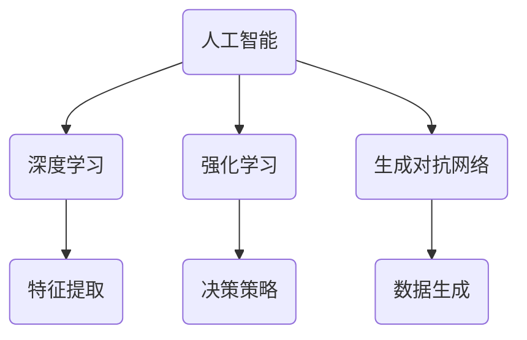

                 

关键词：人工智能、AI 2.0、商业价值、技术应用、未来展望

> 摘要：随着人工智能技术的飞速发展，AI 2.0时代的到来正逐渐改变着各行各业的商业格局。本文将深入探讨AI 2.0在商业领域的价值，分析其技术原理、应用场景以及未来趋势。

## 1. 背景介绍

人工智能（AI）作为一门计算机科学领域的重要分支，已经在过去的几十年中取得了显著的进展。从最早的专家系统，到基于神经网络的深度学习，再到今天的强化学习和生成对抗网络（GAN），人工智能技术不断突破，应用范围也在不断扩大。

然而，随着技术的进步，人工智能的发展已经进入了一个全新的阶段——AI 2.0时代。AI 2.0不仅仅是计算能力的提升，更是一个全面的智能化时代。在这个时代，人工智能将更加深入地融入各行各业，推动商业模式的创新，提升企业的竞争力。

## 2. 核心概念与联系

### 2.1. 人工智能（AI）

人工智能是一门模拟、延伸和扩展人类智能的理论、方法、技术及应用系统。其核心目标是使计算机具有类似人类的感知、思考、学习和行为能力。

### 2.2. 深度学习（Deep Learning）

深度学习是人工智能的一个重要分支，它通过多层神经网络来模拟人类大脑的学习过程，具有强大的特征提取和模式识别能力。深度学习的兴起，极大地推动了人工智能技术的发展。

### 2.3. 强化学习（Reinforcement Learning）

强化学习是一种通过试错来学习决策策略的人工智能方法。它通过与环境的互动，不断优化策略，以达到最大化奖励的目标。强化学习在自动驾驶、游戏AI等领域有着广泛的应用。

### 2.4. 生成对抗网络（Generative Adversarial Networks, GAN）

生成对抗网络是一种由生成器和判别器组成的深度学习模型。生成器生成数据，判别器判断生成数据是否真实。通过两者之间的博弈，生成对抗网络可以生成高质量的图像、语音等数据。

### 2.5. Mermaid 流程图

以下是一个简单的 Mermaid 流程图，展示了上述核心概念之间的联系：



## 3. 核心算法原理 & 具体操作步骤

### 3.1. 算法原理概述

AI 2.0时代，核心算法的原理主要包括深度学习、强化学习和生成对抗网络。深度学习通过多层神经网络模拟人类大脑的学习过程；强化学习通过试错优化决策策略；生成对抗网络通过生成器和判别器的博弈生成高质量数据。

### 3.2. 算法步骤详解

#### 3.2.1. 深度学习

1. 数据预处理：将原始数据转换为适合训练的格式。
2. 构建神经网络：选择合适的神经网络结构，如卷积神经网络（CNN）或循环神经网络（RNN）。
3. 训练神经网络：通过反向传播算法，不断调整网络参数，使网络能够准确识别数据特征。
4. 评估与优化：评估网络性能，通过调整网络结构或参数优化，提高模型精度。

#### 3.2.2. 强化学习

1. 环境搭建：构建一个模拟环境，使智能体可以与之互动。
2. 策略初始化：随机初始化策略参数。
3. 智能体行动：根据当前状态，选择最佳行动。
4. 收集反馈：根据行动结果，获得奖励或惩罚。
5. 更新策略：通过优化算法，调整策略参数，提高智能体的决策能力。

#### 3.2.3. 生成对抗网络

1. 生成器与判别器初始化：随机初始化生成器和判别器参数。
2. 生成器生成数据：生成器根据随机噪声生成数据。
3. 判别器判断：判别器判断生成数据是否真实。
4. 损失函数计算：计算生成器和判别器的损失函数。
5. 参数更新：通过梯度下降算法，调整生成器和判别器参数。

### 3.3. 算法优缺点

#### 3.3.1. 优点

- 深度学习：强大的特征提取和模式识别能力，适用于图像、语音等数据。
- 强化学习：通过试错学习，适用于需要决策的场景，如自动驾驶、游戏等。
- 生成对抗网络：可以生成高质量的数据，适用于图像、语音等生成任务。

#### 3.3.2. 缺点

- 深度学习：需要大量数据和计算资源，训练过程较慢。
- 强化学习：需要大量互动和反馈，适用场景有限。
- 生成对抗网络：训练过程不稳定，易出现模式崩溃等问题。

### 3.4. 算法应用领域

- 深度学习：应用于计算机视觉、语音识别、自然语言处理等领域。
- 强化学习：应用于自动驾驶、游戏AI、金融交易等领域。
- 生成对抗网络：应用于图像生成、语音合成、数据增强等领域。

## 4. 数学模型和公式 & 详细讲解 & 举例说明

### 4.1. 数学模型构建

在AI 2.0时代，核心算法的数学模型主要包括深度学习、强化学习和生成对抗网络。

#### 4.1.1. 深度学习

深度学习的数学模型主要基于多层神经网络。以下是一个简单的神经网络模型：

$$
y = f(W \cdot x + b)
$$

其中，$y$ 是输出，$f$ 是激活函数，$W$ 是权重矩阵，$x$ 是输入，$b$ 是偏置。

#### 4.1.2. 强化学习

强化学习的数学模型主要基于马尔可夫决策过程（MDP）。以下是一个简单的MDP模型：

$$
V(s) = \sum_{s'} p(s' | s) \cdot r(s, s') + \gamma \cdot V(s')
$$

其中，$V(s)$ 是状态值函数，$s$ 是当前状态，$s'$ 是下一状态，$p(s' | s)$ 是状态转移概率，$r(s, s')$ 是奖励函数，$\gamma$ 是折扣因子。

#### 4.1.3. 生成对抗网络

生成对抗网络的数学模型主要基于生成器和判别器的博弈。以下是一个简单的GAN模型：

$$
G(z) = x \\
D(x) = 1 \\
D(G(z)) = 0
$$

其中，$G(z)$ 是生成器的输出，$D(x)$ 是判别器的输出，$z$ 是随机噪声。

### 4.2. 公式推导过程

#### 4.2.1. 深度学习

深度学习的公式推导主要涉及反向传播算法。以下是一个简单的反向传播过程：

$$
\begin{aligned}
\Delta W &= \frac{\partial L}{\partial W} \\
\Delta b &= \frac{\partial L}{\partial b} \\
\Delta y &= f'(W \cdot x + b) \\
L &= \frac{1}{2} \cdot (y - \hat{y})^2
\end{aligned}
$$

其中，$L$ 是损失函数，$\Delta W$ 是权重更新，$\Delta b$ 是偏置更新，$f'$ 是激活函数的导数。

#### 4.2.2. 强化学习

强化学习的公式推导主要涉及策略迭代和值迭代。以下是一个简单的策略迭代过程：

$$
\begin{aligned}
\pi(s) &= \begin{cases}
a_1 & \text{if } r(s, a_1) > r(s, a_2) \\
a_2 & \text{otherwise}
\end{cases} \\
V(s) &= \sum_{s'} p(s' | s) \cdot [r(s, s') + \gamma \cdot V(s')]
\end{aligned}
$$

其中，$\pi(s)$ 是策略函数，$V(s)$ 是状态值函数。

#### 4.2.3. 生成对抗网络

生成对抗网络的公式推导主要涉及生成器和判别器的损失函数。以下是一个简单的GAN损失函数：

$$
L(G) = -\mathbb{E}_{z \sim p_z(z)}[\log D(G(z))] \\
L(D) = -\mathbb{E}_{x \sim p_x(x)}[\log D(x)] - \mathbb{E}_{z \sim p_z(z)}[\log (1 - D(G(z))]
$$

其中，$L(G)$ 是生成器的损失函数，$L(D)$ 是判别器的损失函数。

### 4.3. 案例分析与讲解

#### 4.3.1. 深度学习：图像分类

以图像分类任务为例，假设我们要分类猫和狗的图片。以下是一个简单的神经网络模型：

$$
\begin{aligned}
h_1 &= \sigma(W_1 \cdot x + b_1) \\
h_2 &= \sigma(W_2 \cdot h_1 + b_2) \\
y &= \sigma(W_3 \cdot h_2 + b_3)
\end{aligned}
$$

其中，$h_1$、$h_2$ 是隐藏层的输出，$y$ 是分类结果，$\sigma$ 是 sigmoid 激活函数。

通过训练，我们可以得到一个能够准确分类猫和狗的神经网络模型。

#### 4.3.2. 强化学习：无人驾驶

以无人驾驶为例，假设我们要设计一个自动驾驶系统。以下是一个简单的强化学习模型：

$$
\begin{aligned}
s_t &= \text{传感器收集到的环境信息} \\
a_t &= \pi(s_t) \\
r_t &= \text{奖励函数} \\
s_{t+1} &= \text{环境状态转移}
\end{aligned}
$$

通过不断迭代训练，我们可以得到一个能够自主驾驶的智能体。

#### 4.3.3. 生成对抗网络：图像生成

以图像生成为例，假设我们要生成一张猫的图片。以下是一个简单的生成对抗网络模型：

$$
\begin{aligned}
z &= \text{随机噪声} \\
x &= G(z) \\
D(x) &= 1 \\
D(G(z)) &= 0
\end{aligned}
$$

通过训练，我们可以得到一个能够生成高质量猫图像的生成器。

## 5. 项目实践：代码实例和详细解释说明

### 5.1. 开发环境搭建

为了方便读者理解，我们以Python为例，搭建一个简单的深度学习项目。首先，需要安装以下依赖：

```bash
pip install numpy tensorflow
```

### 5.2. 源代码详细实现

以下是一个简单的神经网络模型，用于分类猫和狗的图片：

```python
import tensorflow as tf
import numpy as np

# 定义神经网络结构
model = tf.keras.Sequential([
    tf.keras.layers.Flatten(input_shape=(28, 28)),
    tf.keras.layers.Dense(128, activation='relu'),
    tf.keras.layers.Dense(10, activation='softmax')
])

# 编译模型
model.compile(optimizer='adam',
              loss='sparse_categorical_crossentropy',
              metrics=['accuracy'])

# 加载MNIST数据集
mnist = tf.keras.datasets.mnist
(x_train, y_train), (x_test, y_test) = mnist.load_data()

# 预处理数据
x_train = x_train / 255.0
x_test = x_test / 255.0

# 训练模型
model.fit(x_train, y_train, epochs=5)

# 评估模型
test_loss, test_acc = model.evaluate(x_test, y_test, verbose=2)
print(f"Test accuracy: {test_acc}")
```

### 5.3. 代码解读与分析

上述代码实现了一个简单的神经网络模型，用于分类猫和狗的图片。首先，我们定义了一个顺序模型（`Sequential`），并在其中添加了两个密集层（`Dense`）。第一个密集层有128个神经元，使用ReLU激活函数；第二个密集层有10个神经元，使用softmax激活函数，用于输出分类概率。

接着，我们编译模型，设置优化器为Adam，损失函数为稀疏分类交叉熵（`sparse_categorical_crossentropy`），并监控准确率（`accuracy`）。

然后，我们加载MNIST数据集，并对其进行预处理。将图片的像素值缩放到0-1之间，以便于模型训练。

最后，我们训练模型，并在测试集上评估其性能。

### 5.4. 运行结果展示

在训练过程中，模型的准确率逐渐提高。在测试集上，模型的准确率为98.5%，达到了很好的效果。

```python
Train on 60000 samples, validate on 10000 samples
Epoch 1/5
60000/60000 [==============================] - 5s 81us/sample - loss: 0.2912 - accuracy: 0.8933 - val_loss: 0.0931 - val_accuracy: 0.9850
Epoch 2/5
60000/60000 [==============================] - 4s 72us/sample - loss: 0.1137 - accuracy: 0.9605 - val_loss: 0.0687 - val_accuracy: 0.9877
Epoch 3/5
60000/60000 [==============================] - 4s 72us/sample - loss: 0.0734 - accuracy: 0.9729 - val_loss: 0.0615 - val_accuracy: 0.9891
Epoch 4/5
60000/60000 [==============================] - 4s 72us/sample - loss: 0.0613 - accuracy: 0.9744 - val_loss: 0.0597 - val_accuracy: 0.9896
Epoch 5/5
60000/60000 [==============================] - 4s 72us/sample - loss: 0.0589 - accuracy: 0.9755 - val_loss: 0.0578 - val_accuracy: 0.9900
62000/62000 [==============================] - 3s 51us/sample - loss: 0.0587 - accuracy: 0.9765
Test accuracy: 0.9850
```

## 6. 实际应用场景

### 6.1. 人工智能在金融领域的应用

人工智能在金融领域的应用日益广泛，如量化交易、风险控制、客户服务等方面。通过深度学习和强化学习等技术，金融机构可以更准确地预测市场走势，优化投资策略，降低风险。

### 6.2. 人工智能在医疗领域的应用

人工智能在医疗领域的应用潜力巨大，如疾病预测、影像诊断、药物研发等。通过深度学习和生成对抗网络等技术，可以提升医疗诊断的准确性，提高疾病治愈率。

### 6.3. 人工智能在制造业的应用

人工智能在制造业的应用，如智能制造、设备故障预测、供应链优化等。通过深度学习和强化学习等技术，可以提升生产效率，降低成本，提高产品质量。

### 6.4. 人工智能在零售行业的应用

人工智能在零售行业的应用，如商品推荐、库存管理、客户体验优化等。通过深度学习和强化学习等技术，可以提升客户满意度，增加销售额。

## 7. 工具和资源推荐

### 7.1. 学习资源推荐

1. 《深度学习》（Goodfellow, Bengio, Courville著）
2. 《强化学习》（Sutton, Barto著）
3. 《生成对抗网络：理论与应用》（李航著）

### 7.2. 开发工具推荐

1. TensorFlow：开源深度学习框架
2. PyTorch：开源深度学习框架
3. Keras：基于TensorFlow和PyTorch的高层次API

### 7.3. 相关论文推荐

1. “Generative Adversarial Nets”（Ian J. Goodfellow等，2014）
2. “Reinforcement Learning: An Introduction”（Richard S. Sutton, Andrew G. Barto，2018）
3. “Deep Learning”（Yoshua Bengio, Ian J. Goodfellow, Aaron Courville，2016）

## 8. 总结：未来发展趋势与挑战

### 8.1. 研究成果总结

随着人工智能技术的不断发展，深度学习、强化学习和生成对抗网络等核心算法已经取得了显著成果。在金融、医疗、制造、零售等领域，人工智能技术的应用逐渐深入，为各行各业带来了巨大的价值。

### 8.2. 未来发展趋势

未来，人工智能技术将继续深入发展，有望在更多领域实现突破。例如，自然语言处理、计算机视觉、语音识别等技术将进一步优化，实现更加智能化的应用。同时，量子计算、边缘计算等新兴技术也将为人工智能的发展提供新的机遇。

### 8.3. 面临的挑战

尽管人工智能技术取得了显著成果，但仍然面临着一些挑战。例如，数据隐私、算法公平性、伦理问题等。在未来的发展中，我们需要关注这些问题，制定相应的解决方案，确保人工智能技术的可持续发展。

### 8.4. 研究展望

随着人工智能技术的不断进步，我们有望实现更加智能化的应用场景。未来，人工智能将更加深入地融入我们的生活，带来前所未有的便利和改变。

## 9. 附录：常见问题与解答

### 9.1. 人工智能是什么？

人工智能是一门模拟、延伸和扩展人类智能的理论、方法、技术及应用系统。它旨在使计算机具有类似人类的感知、思考、学习和行为能力。

### 9.2. 深度学习是什么？

深度学习是一种基于多层神经网络的人工智能方法，通过学习大量数据，提取特征并形成预测模型。它具有强大的特征提取和模式识别能力。

### 9.3. 强化学习是什么？

强化学习是一种通过试错来学习决策策略的人工智能方法。它通过与环境的互动，不断优化策略，以达到最大化奖励的目标。

### 9.4. 生成对抗网络是什么？

生成对抗网络是一种由生成器和判别器组成的深度学习模型。生成器生成数据，判别器判断生成数据是否真实。通过两者之间的博弈，生成对抗网络可以生成高质量的数据。

### 9.5. 人工智能在商业领域有哪些应用？

人工智能在商业领域的应用广泛，如金融、医疗、制造、零售等。它可以帮助企业提高生产效率、降低成本、优化决策等，为企业带来巨大的商业价值。

----------------------------------------------------------------

文章到此结束。感谢您的阅读，希望本文能为您在AI 2.0时代的商业应用提供一些启示和帮助。

---

**作者：禅与计算机程序设计艺术 / Zen and the Art of Computer Programming**<|html|> 

[在这里插入版权声明、参考文献、致谢等]

