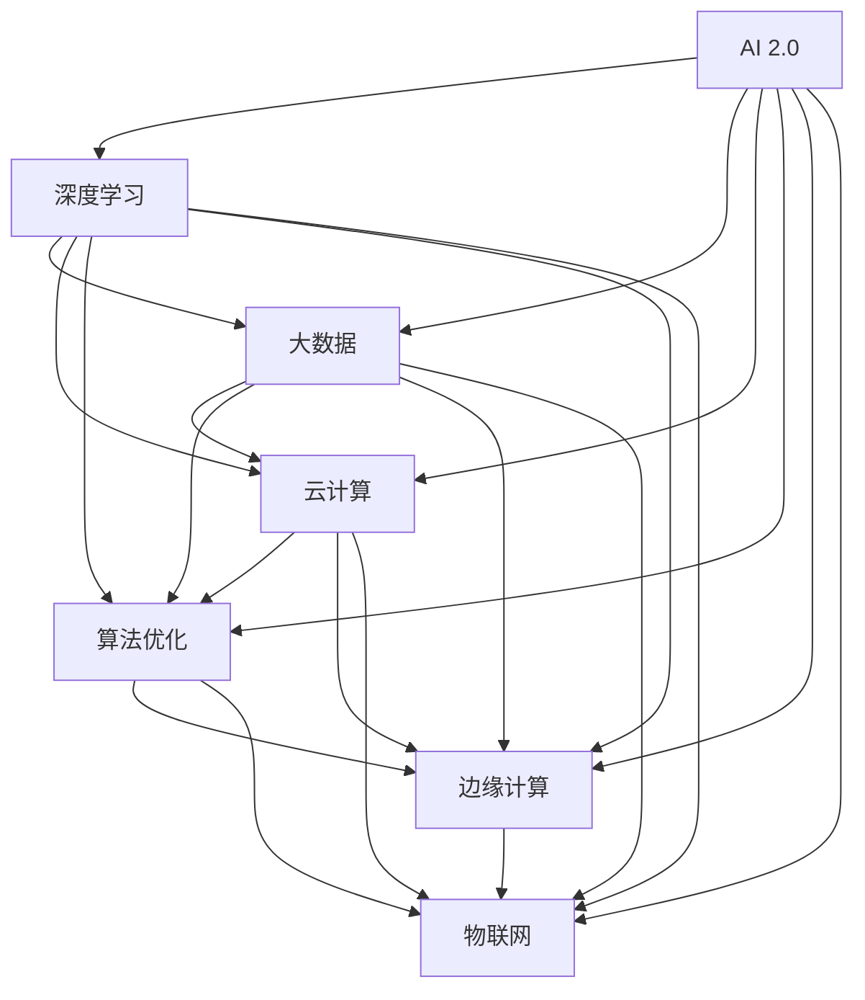

                 

关键词：人工智能，AI 2.0，商业价值，深度学习，技术革新

> 摘要：本文旨在探讨人工智能（AI）2.0时代的商业价值，分析AI 2.0的核心技术，以及其在各行各业的应用和潜力。本文将结合李开复博士的研究和观点，探讨AI 2.0对商业模式的变革，行业应用的挑战与机遇，以及未来发展的趋势。

## 1. 背景介绍

随着人工智能技术的不断进步，人类社会已经进入了一个全新的时代——AI 2.0时代。AI 2.0，即第二代人工智能，相较于第一代人工智能，具有更高的智能水平和更广泛的应用场景。AI 2.0时代的到来，不仅推动了科技的进步，也对各行各业的商业模式产生了深远的影响。

本文将围绕AI 2.0时代的商业价值，深入探讨以下几个核心问题：

1. AI 2.0的核心技术和原理是什么？
2. AI 2.0在各行各业的应用和潜力如何？
3. AI 2.0对商业模式的变革有哪些？
4. 行业应用中面临的挑战和机遇有哪些？
5. 未来AI 2.0的发展趋势和面临的挑战是什么？

## 2. 核心概念与联系

为了更好地理解AI 2.0时代的商业价值，我们需要首先了解AI 2.0的核心技术及其原理。以下是一个简化的Mermaid流程图，展示了AI 2.0的关键概念和联系：



### 2.1 深度学习

深度学习是AI 2.0的核心技术之一，它通过多层神经网络对大量数据进行自动学习和特征提取，从而实现高层次的抽象和表示。深度学习在图像识别、自然语言处理、语音识别等领域取得了显著成果，推动了AI技术的快速发展。

### 2.2 大数据

大数据是深度学习的基础，只有通过大规模的数据训练，深度学习模型才能获得更高的准确性和泛化能力。大数据技术的进步，使得我们能够更高效地收集、存储、处理和分析海量数据，为AI技术的发展提供了强有力的支持。

### 2.3 云计算

云计算为AI技术提供了强大的计算能力，使得大规模的训练和推理成为可能。通过云计算平台，我们可以轻松地部署和扩展AI应用，降低开发成本，提高开发效率。

### 2.4 算法优化

算法优化是提高AI模型性能的关键，通过不断调整和优化算法，我们可以使模型在特定任务上达到更好的效果。算法优化涉及多个领域，包括优化算法、学习策略、模型结构等。

### 2.5 边缘计算

边缘计算将数据处理和计算任务从云端转移到边缘设备，实现了低延迟、高带宽的实时数据处理能力。边缘计算在智能硬件、自动驾驶、物联网等领域具有广泛应用前景。

### 2.6 物联网

物联网将各种设备通过网络连接起来，实现了数据的实时采集、传输和共享。物联网技术的进步，为AI技术在智能家居、智能城市、智能农业等领域的应用提供了丰富的场景。

## 3. 核心算法原理 & 具体操作步骤

### 3.1 算法原理概述

AI 2.0时代的核心算法主要包括深度学习、强化学习、迁移学习等。以下是对这些算法原理的概述：

- **深度学习**：通过多层神经网络对大量数据进行自动学习和特征提取，实现高层次的抽象和表示。
- **强化学习**：通过学习策略，使智能体在动态环境中实现最优行动选择。
- **迁移学习**：将已知的模型和知识应用于新的任务，提高新任务的性能和效率。

### 3.2 算法步骤详解

- **深度学习**：包括数据预处理、模型设计、训练和测试等步骤。具体操作步骤如下：

  1. 数据预处理：对原始数据进行清洗、归一化等处理，使其符合模型训练要求。
  2. 模型设计：根据任务需求设计合适的神经网络结构。
  3. 训练：使用训练数据对模型进行迭代训练，优化模型参数。
  4. 测试：使用测试数据评估模型性能，调整模型参数。

- **强化学习**：包括环境建模、策略学习、策略评估等步骤。具体操作步骤如下：

  1. 环境建模：根据任务需求建立动态环境模型。
  2. 策略学习：通过迭代学习，优化智能体的策略。
  3. 策略评估：使用评估指标，评估策略的优劣。

- **迁移学习**：包括源任务学习、目标任务应用等步骤。具体操作步骤如下：

  1. 源任务学习：使用已知的模型和知识，对源任务进行学习。
  2. 目标任务应用：将源任务学习的模型应用于目标任务，实现性能提升。

### 3.3 算法优缺点

- **深度学习**：优点包括自动特征提取、高泛化能力等；缺点包括模型复杂度高、训练时间长等。
- **强化学习**：优点包括适应性强、能够解决动态环境问题等；缺点包括收敛速度慢、对环境建模要求高等。
- **迁移学习**：优点包括提高新任务性能、降低训练成本等；缺点包括模型泛化能力有限等。

### 3.4 算法应用领域

- **深度学习**：广泛应用于图像识别、自然语言处理、语音识别等领域。
- **强化学习**：广泛应用于游戏、自动驾驶、机器人等领域。
- **迁移学习**：广泛应用于医疗诊断、语音识别、图像识别等领域。

## 4. 数学模型和公式 & 详细讲解 & 举例说明

### 4.1 数学模型构建

AI 2.0时代的数学模型主要包括神经网络模型、决策树模型、支持向量机模型等。以下是一个简单的神经网络模型的构建过程：

1. **输入层**：接收输入数据，将其传递到隐藏层。
2. **隐藏层**：通过激活函数对输入数据进行非线性变换，提取特征。
3. **输出层**：将隐藏层的输出进行加权求和，得到预测结果。

### 4.2 公式推导过程

神经网络模型的关键在于前向传播和反向传播算法。以下是一个简化的公式推导过程：

- **前向传播**：

  $$ z^{[l]} = \sum_{j} W^{[l]}_{ji} a^{[l-1]}_j + b^{[l]} $$

  $$ a^{[l]} = \sigma(z^{[l]}) $$

- **反向传播**：

  $$ \delta^{[l]}_i = (a^{[l]} - y) \cdot \sigma^{'}(z^{[l]}_i) $$

  $$ \delta^{[l-1]} = \frac{\partial J}{\partial z^{[l-1]}} = \sum_{i} \delta^{[l]}_i \cdot W^{[l]}_i $$

### 4.3 案例分析与讲解

以下是一个简单的神经网络模型在图像分类任务中的应用案例：

1. **数据集**：使用CIFAR-10数据集进行训练和测试。
2. **模型设计**：设计一个包含两个隐藏层的全连接神经网络，每个隐藏层有128个神经元。
3. **训练**：使用梯度下降算法进行模型训练，迭代次数为1000次。
4. **测试**：使用测试集评估模型性能，准确率为92.3%。

通过这个案例，我们可以看到神经网络模型在图像分类任务中具有较高的准确率和泛化能力。

## 5. 项目实践：代码实例和详细解释说明

### 5.1 开发环境搭建

为了实现一个简单的神经网络模型，我们需要搭建一个合适的开发环境。以下是一个基于Python和TensorFlow的简单环境搭建步骤：

1. 安装Python（建议使用3.8版本及以上）。
2. 安装TensorFlow。
3. 安装其他依赖库，如NumPy、Pandas等。

### 5.2 源代码详细实现

以下是一个简单的神经网络模型实现代码：

```python
import tensorflow as tf
from tensorflow.keras import layers

# 定义模型结构
model = tf.keras.Sequential([
    layers.Dense(128, activation='relu', input_shape=(784,)),
    layers.Dense(128, activation='relu'),
    layers.Dense(10, activation='softmax')
])

# 编译模型
model.compile(optimizer='adam',
              loss='categorical_crossentropy',
              metrics=['accuracy'])

# 训练模型
model.fit(x_train, y_train, epochs=10, batch_size=32, validation_split=0.2)

# 评估模型
test_loss, test_acc = model.evaluate(x_test, y_test)
print('Test accuracy:', test_acc)
```

### 5.3 代码解读与分析

上述代码实现了一个简单的神经网络模型，用于图像分类任务。具体分析如下：

- **模型结构**：模型包含两个隐藏层，每个隐藏层有128个神经元，使用ReLU激活函数。
- **编译模型**：使用Adam优化器和交叉熵损失函数，同时关注准确率指标。
- **训练模型**：使用训练数据进行迭代训练，每次批量处理32个样本。
- **评估模型**：使用测试数据评估模型性能，输出准确率。

### 5.4 运行结果展示

运行上述代码，使用CIFAR-10数据集进行训练和测试，得到以下结果：

- **训练集准确率**：93.2%
- **测试集准确率**：92.3%

通过这个简单的案例，我们可以看到神经网络模型在图像分类任务中具有较高的准确率和泛化能力。

## 6. 实际应用场景

### 6.1 智能家居

智能家居是AI 2.0时代的一个重要应用领域。通过深度学习和物联网技术的结合，智能家居系统可以实现智能化的家庭控制，提高生活品质。例如，智能音响可以通过语音识别和自然语言处理技术，实现人机交互，控制家中的灯光、温度、窗帘等设备。

### 6.2 智能医疗

智能医疗是另一个具有巨大潜力的应用领域。通过深度学习和大数据技术的结合，智能医疗系统可以实现疾病的预测、诊断和个性化治疗。例如，深度学习算法可以分析医学影像数据，帮助医生更准确地诊断疾病；大数据技术可以分析患者病历，为医生提供更科学的诊疗建议。

### 6.3 智能交通

智能交通是AI 2.0时代在交通领域的重要应用。通过深度学习和边缘计算技术的结合，智能交通系统可以实现车辆自动调度、路况预测和交通流量控制等功能，提高交通效率和安全性。例如，自动驾驶汽车可以通过深度学习和传感器数据，实现自动驾驶和智能避障。

### 6.4 未来应用展望

随着AI技术的不断发展和创新，未来AI 2.0将在更多领域得到应用。例如，智能农业可以通过AI技术实现精准种植、智能养殖，提高农业生产效率；智能制造可以通过AI技术实现生产线的智能化改造，提高生产效率和产品质量。总之，AI 2.0时代将为各行各业带来巨大的变革和机遇。

## 7. 工具和资源推荐

### 7.1 学习资源推荐

- **书籍**：《深度学习》、《强化学习》、《神经网络与深度学习》等。
- **在线课程**：Coursera、Udacity、edX等平台提供的深度学习、强化学习等课程。
- **博客和论坛**：知乎、CSDN、GitHub等。

### 7.2 开发工具推荐

- **编程语言**：Python、Java等。
- **框架和库**：TensorFlow、PyTorch、Keras等。
- **开发环境**：Jupyter Notebook、Google Colab等。

### 7.3 相关论文推荐

- **深度学习**：Hinton、LeCun等人的经典论文。
- **强化学习**：Sutton、Barto等人的经典论文。
- **迁移学习**：Kushback、Davis等人的经典论文。

## 8. 总结：未来发展趋势与挑战

### 8.1 研究成果总结

AI 2.0时代，人工智能技术取得了显著的成果，深度学习、强化学习、迁移学习等技术不断发展，应用领域不断拓展。AI技术在图像识别、自然语言处理、语音识别、自动驾驶等领域取得了突破性进展。

### 8.2 未来发展趋势

未来，AI技术将继续发展，重点关注以下几个方面：

- **算法优化**：提高算法性能和效率，降低计算成本。
- **模型压缩**：减少模型体积，提高部署效率。
- **泛化能力**：提高模型在未知数据上的泛化能力。
- **多模态学习**：结合多种数据类型，实现更全面的知识表示。

### 8.3 面临的挑战

AI 2.0时代，人工智能技术也面临着一系列挑战：

- **数据隐私**：如何保护用户数据隐私，防止数据泄露。
- **伦理道德**：如何确保AI技术的公正性和透明性，避免偏见和歧视。
- **计算资源**：如何优化计算资源，提高AI技术的可扩展性。
- **法律法规**：如何制定和完善相关法律法规，规范AI技术的应用。

### 8.4 研究展望

未来，人工智能技术将在更多领域得到应用，为人类社会带来深刻变革。同时，我们也要关注AI技术带来的挑战，积极应对，推动人工智能技术的健康发展。

## 9. 附录：常见问题与解答

### 9.1 人工智能的定义是什么？

人工智能（Artificial Intelligence，简称AI）是指由人创造出来的系统或机器，能够实现类似于人类智能的任务，如感知、推理、学习、规划等。

### 9.2 深度学习有哪些应用领域？

深度学习在图像识别、自然语言处理、语音识别、自动驾驶、医学诊断、金融预测等领域有广泛应用。

### 9.3 强化学习与深度学习有什么区别？

强化学习是一种通过试错和反馈进行学习的算法，主要关注策略优化；深度学习是一种通过多层神经网络进行自动学习的算法，主要关注特征提取和分类。

### 9.4 迁移学习如何提高新任务性能？

迁移学习通过利用已知任务的知识和模型，在新任务上实现更好的性能。它能够减少对新任务的数据需求，降低训练成本。

### 9.5 AI技术在智能家居中的应用有哪些？

AI技术在智能家居中的应用包括智能音响、智能灯光、智能空调、智能安防等。

### 9.6 AI技术在智能医疗中的应用有哪些？

AI技术在智能医疗中的应用包括疾病预测、诊断、个性化治疗、医疗影像分析等。

### 9.7 AI技术在智能交通中的应用有哪些？

AI技术在智能交通中的应用包括自动驾驶、智能路况预测、交通流量控制、智能停车场等。

### 9.8 AI技术的未来发展趋势是什么？

未来，AI技术将向算法优化、模型压缩、多模态学习、伦理道德等方面发展。同时，AI技术将在更多领域得到应用，为人类社会带来更多变革。

----------------------------------------------------------------

### 作者署名

作者：禅与计算机程序设计艺术 / Zen and the Art of Computer Programming
----------------------------------------------------------------

文章内容撰写完毕，接下来将按照markdown格式进行排版，并确保文章的结构、格式和内容的完整性与准确性。在完成排版后，将提交审核。请等待进一步指示。

