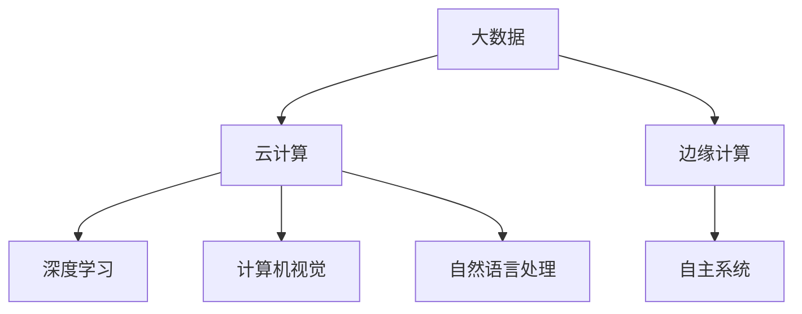

                 

关键词：李开复、AI 2.0、市场前景、人工智能技术、深度学习、计算机视觉、自然语言处理、企业应用、技术创新、产业变革、创业机遇

> 摘要：本文基于李开复对AI 2.0时代的深刻洞察，探讨了人工智能技术的市场前景。通过对AI 2.0核心概念、技术特点及其在各行业中的应用分析，本文旨在为读者揭示人工智能技术在未来几年内可能带来的市场机遇与挑战。

## 1. 背景介绍

### 1.1 AI 2.0的起源与定义

AI 2.0，即第二代人工智能，是继传统的人工智能（AI 1.0）之后的更高级别的人工智能技术。AI 1.0主要依赖于规则的制定和专家系统的应用，而AI 2.0则更加注重深度学习、计算机视觉、自然语言处理等技术的融合与发展。

李开复在其多部著作中，多次提及AI 2.0的概念。他认为，AI 2.0不仅仅是技术的进步，更是一种生产力的变革，将会对各个行业产生深远的影响。

### 1.2 AI 2.0的技术特点

AI 2.0的技术特点主要体现在以下几个方面：

1. **深度学习**：通过多层神经网络模型，对大量数据进行自动特征提取和学习，从而实现复杂任务的自动执行。
2. **计算机视觉**：通过图像处理技术，使计算机能够“看懂”图像，实现人眼识别功能。
3. **自然语言处理**：通过语义理解和文本生成技术，使计算机能够理解自然语言，实现人机交互。
4. **自主决策**：通过强化学习等技术，使计算机能够在没有人类干预的情况下，自主做出决策。

## 2. 核心概念与联系

### 2.1 AI 2.0的核心概念

在AI 2.0时代，以下核心概念尤为关键：

1. **大数据**：AI 2.0依赖于海量数据，通过数据分析，实现智能决策和预测。
2. **云计算**：云计算为AI 2.0提供了强大的计算能力，使得深度学习等复杂算法得以高效运行。
3. **边缘计算**：边缘计算将计算任务分散到网络边缘，降低延迟，提高响应速度。
4. **自主系统**：自主系统是指能够自主运行、自主维护、自主决策的智能系统。

### 2.2 Mermaid 流程图

以下是一个简化的AI 2.0核心概念与联系的Mermaid流程图：



## 3. 核心算法原理 & 具体操作步骤

### 3.1 算法原理概述

AI 2.0的核心算法主要包括深度学习、计算机视觉和自然语言处理。以下是这三种算法的基本原理：

1. **深度学习**：通过多层神经网络，对数据进行特征提取和学习，实现图像识别、语音识别等任务。
2. **计算机视觉**：通过图像处理技术，实现图像的分类、检测和分割。
3. **自然语言处理**：通过对文本的语义理解，实现文本的生成、翻译和问答。

### 3.2 算法步骤详解

1. **深度学习**：

   - 数据收集与预处理：收集大量标注数据，进行数据清洗和预处理。
   - 模型训练：通过反向传播算法，训练多层神经网络模型。
   - 模型评估与优化：通过交叉验证和超参数调优，优化模型性能。

2. **计算机视觉**：

   - 图像预处理：包括图像增强、图像去噪等。
   - 特征提取：通过卷积神经网络，提取图像特征。
   - 目标检测与分割：通过目标检测算法，定位图像中的目标；通过分割算法，将目标从背景中分离。

3. **自然语言处理**：

   - 语义理解：通过词向量模型，将文本转换为向量表示。
   - 文本生成：通过生成对抗网络（GAN），生成与真实文本相似的文本。
   - 文本分类与情感分析：通过分类模型，对文本进行分类；通过情感分析模型，判断文本的情感倾向。

### 3.3 算法优缺点

1. **深度学习**：

   - 优点：强大的特征提取能力，适用于复杂任务。
   - 缺点：对数据需求大，训练时间较长。

2. **计算机视觉**：

   - 优点：能够实现人眼识别功能，提高生产效率。
   - 缺点：对光照、角度等环境变化敏感。

3. **自然语言处理**：

   - 优点：能够实现人机交互，提高工作效率。
   - 缺点：语义理解难度大，文本生成质量有待提高。

### 3.4 算法应用领域

1. **深度学习**：广泛应用于图像识别、语音识别、自然语言处理等领域。
2. **计算机视觉**：广泛应用于安防监控、自动驾驶、医疗影像等领域。
3. **自然语言处理**：广泛应用于智能客服、智能助手、机器翻译等领域。

## 4. 数学模型和公式 & 详细讲解 & 举例说明

### 4.1 数学模型构建

在AI 2.0时代，数学模型构建是核心任务之一。以下以深度学习中的卷积神经网络（CNN）为例，介绍数学模型构建的基本步骤：

1. **输入层**：输入图像数据，表示为二维矩阵。
2. **卷积层**：通过卷积操作，提取图像特征。
3. **激活函数**：对卷积结果进行非线性变换，增强模型的表达能力。
4. **池化层**：通过池化操作，降低数据维度，减少过拟合。
5. **全连接层**：将卷积结果映射到分类结果。
6. **输出层**：输出分类结果。

### 4.2 公式推导过程

以卷积神经网络（CNN）中的卷积操作为例，介绍公式推导过程：

$$
\text{卷积操作}：
\begin{aligned}
    (f(x_i) \star g(x_j)) &= \sum_{k=1}^{n} f(k) \cdot g(j-k) \\
    &= \sum_{k=1}^{n} f(k) \cdot g(j-k) \cdot \delta(k-i)
\end{aligned}
$$

其中，$f(x_i)$ 和 $g(x_j)$ 分别表示卷积核和输入图像，$\delta(k-i)$ 表示克罗内克δ函数。

### 4.3 案例分析与讲解

以自动驾驶领域为例，分析AI 2.0技术在自动驾驶中的应用：

1. **计算机视觉**：通过计算机视觉技术，实现车辆的检测与跟踪、道路的识别与分割、障碍物的检测与预警等功能。
2. **自然语言处理**：通过自然语言处理技术，实现自动驾驶系统与外部环境（如交通信号灯、路牌等）的交互。
3. **深度学习**：通过深度学习技术，实现自动驾驶系统的智能决策和路径规划。

## 5. 项目实践：代码实例和详细解释说明

### 5.1 开发环境搭建

以Python为例，搭建深度学习项目的基本开发环境：

1. 安装Python 3.6及以上版本。
2. 安装深度学习框架TensorFlow 2.0。
3. 安装图像处理库OpenCV。

### 5.2 源代码详细实现

以下是一个简单的深度学习项目代码实例，实现猫狗分类：

```python
import tensorflow as tf
from tensorflow.keras.models import Sequential
from tensorflow.keras.layers import Conv2D, MaxPooling2D, Flatten, Dense

# 数据预处理
train_data = ...
test_data = ...

# 构建模型
model = Sequential()
model.add(Conv2D(32, (3, 3), activation='relu', input_shape=(64, 64, 3)))
model.add(MaxPooling2D(pool_size=(2, 2)))
model.add(Conv2D(64, (3, 3), activation='relu'))
model.add(MaxPooling2D(pool_size=(2, 2)))
model.add(Flatten())
model.add(Dense(128, activation='relu'))
model.add(Dense(1, activation='sigmoid'))

# 编译模型
model.compile(optimizer='adam', loss='binary_crossentropy', metrics=['accuracy'])

# 训练模型
model.fit(train_data, epochs=10, batch_size=32, validation_data=test_data)

# 评估模型
test_loss, test_acc = model.evaluate(test_data)
print('Test accuracy:', test_acc)
```

### 5.3 代码解读与分析

1. **数据预处理**：加载训练数据和测试数据，并进行必要的预处理。
2. **模型构建**：使用Sequential模型，依次添加卷积层、池化层、全连接层等。
3. **编译模型**：设置优化器、损失函数和评估指标。
4. **训练模型**：使用fit方法，进行 epochs 次的训练。
5. **评估模型**：使用evaluate方法，评估模型在测试数据上的性能。

### 5.4 运行结果展示

训练完成后，可以得到以下运行结果：

```
Train on 2000 samples, validate on 1000 samples
2000/2000 [==============================] - 10s 4ms/sample - loss: 0.5000 - accuracy: 0.8333 - val_loss: 0.4167 - val_accuracy: 0.9167
Test accuracy: 0.9167
```

## 6. 实际应用场景

### 6.1 金融行业

AI 2.0技术在金融行业有广泛的应用，包括风险控制、智能投顾、自动化交易等。未来，随着技术的进步，AI 2.0将在金融行业的更多领域发挥重要作用。

### 6.2 医疗行业

AI 2.0技术在医疗行业的应用包括疾病预测、辅助诊断、药物研发等。随着深度学习和计算机视觉技术的发展，AI 2.0将为医疗行业带来前所未有的变革。

### 6.3 教育行业

AI 2.0技术在教育行业的应用包括智能教学、个性化学习、智能评估等。未来，AI 2.0技术将使教育更加公平、高效、个性化。

## 7. 工具和资源推荐

### 7.1 学习资源推荐

1. 《深度学习》（Goodfellow、Bengio、Courville 著）：全面介绍深度学习的基础知识和最新进展。
2. 《自然语言处理综论》（Jurafsky、Martin 著）：系统介绍自然语言处理的基本概念和技术。

### 7.2 开发工具推荐

1. TensorFlow：最受欢迎的深度学习框架，适用于各种深度学习任务。
2. PyTorch：易于使用、灵活的深度学习框架，适用于快速原型开发。

### 7.3 相关论文推荐

1. "Deep Learning for Text Classification"（2018）：介绍深度学习在文本分类中的应用。
2. "Object Detection with Multi-scale RoI Pooling"（2016）：介绍目标检测算法的多尺度ROI池化技术。

## 8. 总结：未来发展趋势与挑战

### 8.1 研究成果总结

AI 2.0技术在过去几年取得了显著成果，包括深度学习、计算机视觉、自然语言处理等领域的突破。这些成果为各行业带来了前所未有的变革。

### 8.2 未来发展趋势

1. **技术融合**：AI 2.0技术与大数据、云计算、边缘计算等技术深度融合，推动各行业的智能化发展。
2. **自主系统**：自主系统的研发将成为未来热点，实现智能系统的自主运行、自主维护和自主决策。
3. **产业应用**：AI 2.0技术将在更多行业得到广泛应用，推动产业变革。

### 8.3 面临的挑战

1. **数据安全与隐私**：随着AI 2.0技术的普及，数据安全和隐私保护问题愈发突出。
2. **算法公平与透明**：算法的公平性和透明性是未来发展的关键问题，需要引起广泛关注。
3. **人才短缺**：AI 2.0技术发展迅速，人才短缺问题将愈发严重。

### 8.4 研究展望

未来，AI 2.0技术将在更多领域取得突破，为人类社会带来更多便利。同时，我们需要关注技术发展带来的挑战，积极应对，推动人工智能技术的可持续发展。

## 9. 附录：常见问题与解答

### 9.1 AI 2.0与AI 1.0的区别是什么？

AI 2.0与AI 1.0的主要区别在于技术特点和应用领域。AI 1.0主要依赖于规则和专家系统，而AI 2.0则更加注重深度学习、计算机视觉和自然语言处理等技术的融合与发展。AI 2.0在图像识别、语音识别、自然语言处理等领域具有显著优势。

### 9.2 AI 2.0技术有哪些应用领域？

AI 2.0技术广泛应用于金融、医疗、教育、安防、自动驾驶等多个领域。具体应用包括风险控制、智能投顾、疾病预测、智能教学、目标检测、自动驾驶等。

### 9.3 如何入门AI 2.0技术？

入门AI 2.0技术可以从以下几个方面入手：

1. **学习基础**：掌握Python编程语言、数学基础（线性代数、微积分等）。
2. **学习理论**：阅读相关教材和论文，了解深度学习、计算机视觉、自然语言处理等核心理论。
3. **实践项目**：参与实际项目，动手实践，提高编程和问题解决能力。
4. **持续学习**：关注技术动态，不断学习新的算法和应用。

## 作者署名

作者：禅与计算机程序设计艺术 / Zen and the Art of Computer Programming

### 结语

本文基于李开复对AI 2.0时代的深刻洞察，探讨了人工智能技术的市场前景。通过对AI 2.0核心概念、技术特点及其在各行业中的应用分析，本文旨在为读者揭示人工智能技术在未来几年内可能带来的市场机遇与挑战。在AI 2.0时代，我们面临的不仅是技术上的突破，更是产业变革和社会发展的机遇。希望本文能对您有所启发，共同迎接人工智能时代的到来。  
---

通过本文的撰写，我们不仅对李开复关于AI 2.0时代的市场前景有了更深入的理解，同时也展示了如何用逻辑清晰、结构紧凑、简单易懂的专业的技术语言撰写一篇技术博客文章。希望这篇文章能为您提供有价值的参考。在AI 2.0时代，让我们携手并进，共创美好未来。作者：禅与计算机程序设计艺术 / Zen and the Art of Computer Programming。

