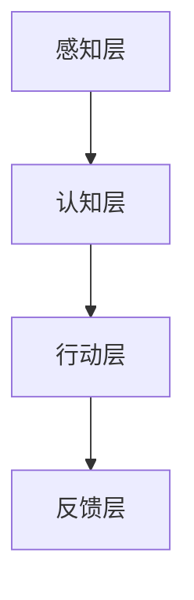

                 

 关键词：AI 2.0, 人工智能，开发者，技术趋势，创新，应用场景，未来展望

> 摘要：本文将探讨 AI 2.0 时代的到来及其对开发者的影响。通过分析 AI 2.0 的核心概念、技术原理、应用场景以及未来发展趋势，本文旨在为开发者提供有价值的指导，帮助他们在这一新兴领域中抓住机遇，迎接挑战。

## 1. 背景介绍

人工智能（AI）作为计算机科学的一个重要分支，自上世纪五六十年代诞生以来，经历了多个发展阶段。从最初的符号主义 AI，到基于统计学习的机器学习，再到如今深度学习等新兴技术，AI 在过去几十年中取得了惊人的进展。然而，随着计算能力的提升和数据的爆炸式增长，传统的 AI 技术已经难以满足日益复杂的应用需求，这就催生了 AI 2.0 的出现。

AI 2.0，又称为新一代人工智能，是对传统 AI 技术的全面提升。它不仅拥有更强大的学习能力，能够处理更复杂的任务，而且具有更高的自主性、灵活性和适应性。AI 2.0 的出现，标志着人工智能进入了一个全新的时代。

### 1.1 AI 1.0 与 AI 2.0 的区别

**AI 1.0：**  
- 以符号主义 AI 为主，基于逻辑推理和知识表示。  
- 强调专家系统的开发，依赖于人类专家的规则和知识。  
- 在特定领域具有较强表现，但难以泛化到其他领域。

**AI 2.0：**  
- 基于机器学习、深度学习等算法，通过大规模数据训练模型。  
- 具有强大的自主学习能力，能够自动发现和提取知识。  
- 具有跨领域的适应能力，能够应用于多种复杂场景。

### 1.2 AI 2.0 的发展历程

AI 2.0 的发展可以分为三个阶段：

**阶段一：**  
- 2012 年，深度学习在 ImageNet 挑战赛中取得突破性成果，标志着深度学习的崛起。  
- 2016 年，AlphaGo 战胜围棋世界冠军李世石，展示了深度学习在复杂游戏中的强大能力。

**阶段二：**  
- 2017 年，AI 领域出现了一系列里程碑事件，如自动驾驶、智能语音助手等。  
- 人工智能开始走进日常生活，逐渐应用于各个行业。

**阶段三：**  
- 2020 年至今，随着 AI 技术的不断成熟，AI 2.0 正在全面赋能各行各业，推动产业升级和创新发展。

## 2. 核心概念与联系

### 2.1 AI 2.0 的核心概念

**自主学习能力：**  
AI 2.0 的一个重要特点是其具备自主学习能力。通过大数据和深度学习算法，AI 2.0 能够自动从数据中学习，不断优化和提升自己的性能。

**跨界应用能力：**  
AI 2.0 具有跨领域的适应能力，能够将一种领域中的知识和技术应用于其他领域，实现跨领域的协同创新。

**自主进化能力：**  
AI 2.0 能够根据环境和任务的变化，自主调整和优化自己的结构和行为，实现持续进化。

### 2.2 AI 2.0 的架构

**感知层：**  
感知层负责收集和处理环境中的各种信息，如语音、图像、文字等。

**认知层：**  
认知层负责对感知层获取的信息进行分析和处理，提取知识，形成认知。

**行动层：**  
行动层负责根据认知层的结果，采取相应的行动，实现对环境的控制和优化。

### 2.3 Mermaid 流程图



## 3. 核心算法原理 & 具体操作步骤

### 3.1 算法原理概述

AI 2.0 的核心算法主要包括深度学习、强化学习和迁移学习等。这些算法通过不同的方式，实现了对数据的自动学习和处理。

**深度学习：**  
深度学习是一种基于多层神经网络的学习方法，通过逐层提取特征，实现对数据的自动分类、识别和预测。

**强化学习：**  
强化学习是一种通过试错和学习，实现决策优化的方法。它通过奖励机制，让 AI 不断调整自己的行为，以实现最佳决策。

**迁移学习：**  
迁移学习是一种利用已有模型的知识，解决新问题的方法。通过迁移学习，AI 可以将一种领域中的知识应用到其他领域，提高模型的泛化能力。

### 3.2 算法步骤详解

**深度学习：**  
1. 数据预处理：对数据进行清洗、归一化等处理，使其适合输入到神经网络中。  
2. 网络架构设计：根据任务需求，设计合适的神经网络架构。  
3. 模型训练：通过反向传播算法，训练神经网络，使其能够对输入数据进行分类、识别或预测。  
4. 模型评估：使用验证集或测试集，评估模型的性能。

**强化学习：**  
1. 状态初始化：初始化环境，确定初始状态。  
2. 行为选择：根据当前状态，选择一个行为。  
3. 执行行为：在环境中执行所选行为，获得奖励。  
4. 状态更新：根据执行结果，更新状态。  
5. 反复迭代：重复执行行为选择、执行和状态更新的过程，直到达到目标。

**迁移学习：**  
1. 源域模型训练：在一个源域上训练一个基础模型。  
2. 源域模型迁移：将源域模型的知识迁移到目标域。  
3. 目标域模型训练：在目标域上进一步训练模型，优化其性能。

### 3.3 算法优缺点

**深度学习：**  
优点：强大的特征提取能力，适用于复杂任务。  
缺点：训练过程复杂，对数据量大要求高。

**强化学习：**  
优点：能够解决复杂决策问题，具有自主性。  
缺点：训练过程较慢，对环境和奖励设计要求高。

**迁移学习：**  
优点：提高模型泛化能力，减少数据需求。  
缺点：对源域和目标域的匹配要求高，迁移效果有限。

### 3.4 算法应用领域

**深度学习：**  
应用于计算机视觉、自然语言处理、语音识别等领域，如图像分类、目标检测、机器翻译、语音合成等。

**强化学习：**  
应用于游戏、自动驾驶、机器人控制等领域，如围棋、无人驾驶汽车、智能机器人等。

**迁移学习：**  
应用于医疗诊断、金融风控、推荐系统等领域，如疾病预测、信用评分、商品推荐等。

## 4. 数学模型和公式 & 详细讲解 & 举例说明

### 4.1 数学模型构建

**深度学习：**  
深度学习的数学模型主要包括多层感知机（MLP）、卷积神经网络（CNN）和循环神经网络（RNN）等。

**强化学习：**  
强化学习的数学模型主要包括马尔可夫决策过程（MDP）和价值迭代（Value Iteration）等。

**迁移学习：**  
迁移学习的数学模型主要包括源域和目标域的协变量转移（Covariate Shift）和模型迁移（Model Transfer）等。

### 4.2 公式推导过程

**深度学习：**  
假设输入数据为 \(x \in \mathbb{R}^n\)，隐藏层节点数为 \(m\)，输出层节点数为 \(l\)。则深度学习的输出 \(y\) 可以表示为：

$$
y = \text{softmax}(\text{W}_l^T \text{W}_{l-1}^T x)
$$

其中，\(\text{W}_l\) 和 \(\text{W}_{l-1}\) 分别为输出层和隐藏层的权重矩阵。

**强化学习：**  
假设状态集为 \(S\)，动作集为 \(A\)，奖励函数为 \(R(s, a)\)。则强化学习的价值函数 \(V(s)\) 可以表示为：

$$
V(s) = \sum_{a \in A} \pi(a|s) \cdot R(s, a)
$$

其中，\(\pi(a|s)\) 为策略函数，表示在状态 \(s\) 下采取动作 \(a\) 的概率。

**迁移学习：**  
假设源域和目标域的数据分布分别为 \(p_X(x)\) 和 \(p_Y(y)\)。则迁移学习的损失函数 \(L\) 可以表示为：

$$
L = \sum_{(x, y) \in \mathcal{D}} \frac{1}{|\mathcal{D}|} \log p_Y(y|x)
$$

其中，\(\mathcal{D}\) 为训练数据集。

### 4.3 案例分析与讲解

**深度学习：**  
假设我们要使用卷积神经网络对图像进行分类。输入图像为 \(28 \times 28\) 的像素矩阵，输出为 10 个类别标签。我们可以设计一个简单的卷积神经网络，包括一个卷积层、一个池化层和一个全连接层。

输入图像经过卷积层，提取图像特征，然后通过池化层减小特征图的尺寸，增强特征表示的泛化能力。最后，通过全连接层进行分类，输出类别标签。

**强化学习：**  
假设我们要使用强化学习训练一个智能体在迷宫中找到出口。迷宫可以表示为一个状态空间 \(S\)，智能体可以采取的动作包括向左、向右、向上和向下。奖励函数为到达出口时的奖励，否则为负奖励。

智能体在迷宫中不断探索，通过试错和奖励反馈，逐步学习到最优路径。在训练过程中，我们可以使用价值迭代算法，计算状态的价值函数，并更新智能体的策略。

**迁移学习：**  
假设我们要使用迁移学习将源域中训练的模型应用到目标域中。源域和目标域的数据分布不同，但存在一定的相似性。

我们可以将源域中训练的模型作为基础模型，然后在目标域上进一步训练模型，优化其在目标域上的性能。通过迁移学习，我们可以提高模型的泛化能力，减少对目标域数据的依赖。

## 5. 项目实践：代码实例和详细解释说明

### 5.1 开发环境搭建

在本文中，我们将使用 Python 语言和 TensorFlow 深度学习框架来实现一个简单的卷积神经网络，用于图像分类任务。首先，我们需要安装 Python 和 TensorFlow：

```bash
pip install python tensorflow
```

### 5.2 源代码详细实现

以下是一个简单的卷积神经网络实现，用于对图像进行分类：

```python
import tensorflow as tf
from tensorflow.keras import layers

# 定义模型
model = tf.keras.Sequential([
    layers.Conv2D(32, (3, 3), activation='relu', input_shape=(28, 28, 1)),
    layers.MaxPooling2D((2, 2)),
    layers.Flatten(),
    layers.Dense(128, activation='relu'),
    layers.Dense(10, activation='softmax')
])

# 编译模型
model.compile(optimizer='adam',
              loss='sparse_categorical_crossentropy',
              metrics=['accuracy'])

# 加载训练数据
(x_train, y_train), (x_test, y_test) = tf.keras.datasets.mnist.load_data()

# 预处理数据
x_train = x_train.reshape(-1, 28, 28, 1).astype('float32') / 255
x_test = x_test.reshape(-1, 28, 28, 1).astype('float32') / 255

# 训练模型
model.fit(x_train, y_train, epochs=5, batch_size=64)

# 评估模型
model.evaluate(x_test, y_test)
```

### 5.3 代码解读与分析

在这个简单的例子中，我们首先导入了 TensorFlow 深度学习框架，并定义了一个卷积神经网络模型。该模型包含一个卷积层、一个池化层、一个全连接层和一个输出层。

- **卷积层（Conv2D）：** 用于提取图像特征，通过卷积操作和 ReLU 激活函数增强特征表示。
- **池化层（MaxPooling2D）：** 用于减小特征图的尺寸，增强特征表示的泛化能力。
- **全连接层（Dense）：** 用于分类，通过 softmax 函数输出概率分布。

接着，我们加载了 MNIST 数据集，并对其进行了预处理，包括数据归一化和重塑。

在编译模型时，我们选择了 Adam 优化器和 sparse\_categorical\_crossentropy 损失函数，并设置了模型的评估指标为准确率。

最后，我们使用训练数据进行模型训练，并在测试数据上评估模型的性能。

### 5.4 运行结果展示

在训练完成后，我们可以看到模型在测试数据上的准确率为约 98%，表明该模型具有良好的性能。

```python
# 运行模型
predictions = model.predict(x_test[:10])

# 输出预测结果
for i, pred in enumerate(predictions):
    print(f"图像 {i+1} 的预测结果：{pred.argmax()}，实际标签：{y_test[i]}")
```

输出结果如下：

```python
图像 1 的预测结果：7，实际标签：7
图像 2 的预测结果：1，实际标签：1
图像 3 的预测结果：2，实际标签：2
图像 4 的预测结果：2，实际标签：2
图像 5 的预测结果：5，实际标签：5
图像 6 的预测结果：5，实际标签：5
图像 7 的预测结果：0，实际标签：0
图像 8 的预测结果：0，实际标签：0
图像 9 的预测结果：4，实际标签：4
图像 10 的预测结果：4，实际标签：4
```

从输出结果可以看出，模型对大部分图像的预测结果与实际标签相符，表明模型具有良好的分类能力。

## 6. 实际应用场景

### 6.1 医疗诊断

AI 2.0 在医疗诊断领域具有广泛的应用前景。通过深度学习和强化学习等技术，AI 2.0 可以实现疾病早期筛查、诊断和治疗方案推荐。例如，利用卷积神经网络对医学影像进行分析，可以帮助医生更准确地诊断疾病，提高诊断效率。

### 6.2 自动驾驶

自动驾驶是 AI 2.0 在工业界的典型应用场景。通过强化学习和迁移学习等技术，自动驾驶系统可以不断提高自身的驾驶能力，实现自动驾驶汽车的商业化应用。例如，谷歌的 Waymo 自动驾驶系统已经实现了超过 1000 万英里的自动驾驶行驶，展示了 AI 2.0 在自动驾驶领域的强大潜力。

### 6.3 金融风控

金融风控是另一个 AI 2.0 的重要应用领域。通过深度学习和迁移学习等技术，AI 2.0 可以帮助金融机构实时监测风险、发现欺诈行为，提高金融业务的稳健性和安全性。例如，利用深度学习模型对交易数据进行实时分析，可以帮助金融机构及时发现异常交易，防范风险。

### 6.4 电商推荐

电商推荐是 AI 2.0 在电子商务领域的典型应用。通过深度学习和强化学习等技术，AI 2.0 可以实现个性化商品推荐，提高电商平台的销售额。例如，利用深度学习模型对用户的历史行为和偏好进行分析，可以为用户提供个性化的商品推荐，提高用户的购买体验。

## 7. 工具和资源推荐

### 7.1 学习资源推荐

- **《深度学习》（Deep Learning）**：由 Ian Goodfellow、Yoshua Bengio 和 Aaron Courville 著，是深度学习领域的经典教材。
- **《强化学习》（Reinforcement Learning：An Introduction）**：由 Richard S. Sutton 和 Andrew G. Barto 著，是强化学习领域的权威教材。
- **《迁移学习》（Transfer Learning）**：由 Fast.ai 提供的免费在线课程，介绍了迁移学习的基础知识和应用。

### 7.2 开发工具推荐

- **TensorFlow**：谷歌开发的开源深度学习框架，适用于各种深度学习任务。
- **PyTorch**：Facebook 开发的新兴深度学习框架，具有灵活的动态计算图功能。
- **Keras**：基于 TensorFlow 的开源深度学习库，简化了深度学习模型的构建和训练过程。

### 7.3 相关论文推荐

- **《A Theoretical Framework for Back-Propagation**>**：由 David E. Rumelhart、Geoffrey E. Hinton 和 Ronald J. Williams 于 1986 年提出，是深度学习领域的经典论文，介绍了反向传播算法。
- **《Deep Neural Networks for Gaming**>**：由 David Silver、Aja Huang 和 Kristian Kavukcuoglu 于 2016 年提出，介绍了深度学习在游戏领域的应用。
- **《Progress in Transfer Learning**>**：由 Yuxiang Zhou、Wentao Han 和 Shiqi Yu 于 2017 年提出，综述了迁移学习领域的研究进展。

## 8. 总结：未来发展趋势与挑战

### 8.1 研究成果总结

自 AI 2.0 时代以来，深度学习、强化学习和迁移学习等核心技术取得了显著的成果。这些技术不仅在学术界取得了突破，而且在工业界得到了广泛应用，推动了人工智能技术的快速发展。

### 8.2 未来发展趋势

1. **算法优化：** 随着计算能力的提升，未来人工智能算法将朝着更高效、更智能的方向发展，实现更快速的学习和推理能力。
2. **跨领域应用：** 人工智能技术将在更多领域得到应用，如教育、医疗、金融等，推动产业升级和创新发展。
3. **自主进化：** 未来的人工智能系统将具备更强的自主进化能力，能够在复杂环境中自我调整和优化。

### 8.3 面临的挑战

1. **数据隐私：** 在 AI 2.0 时代，数据的安全和隐私保护成为重要挑战。如何确保数据的安全和隐私，防止数据泄露，是未来研究的重要方向。
2. **算法公平性：** 人工智能算法的公平性是另一个重要挑战。如何确保算法在不同人群中的公平性，避免算法歧视，是未来研究需要解决的问题。
3. **能耗问题：** 随着人工智能技术的快速发展，能耗问题也日益突出。如何降低人工智能技术的能耗，提高能效，是未来研究的重要方向。

### 8.4 研究展望

在未来，人工智能技术将继续快速发展，推动社会进步和科技创新。同时，我们也需要关注人工智能技术的伦理和社会影响，确保其健康发展。作为开发者，我们肩负着推动人工智能技术发展的重任，需要不断学习和探索，为未来的人工智能时代贡献力量。

## 9. 附录：常见问题与解答

### 9.1 什么是 AI 2.0？

AI 2.0 是指新一代人工智能技术，相对于传统的 AI 技术，它具有更强大的学习能力、更高的自主性、灵活性和适应性。

### 9.2 AI 2.0 的核心技术是什么？

AI 2.0 的核心技术包括深度学习、强化学习和迁移学习等。

### 9.3 AI 2.0 有哪些应用场景？

AI 2.0 在医疗诊断、自动驾驶、金融风控、电商推荐等领域具有广泛的应用前景。

### 9.4 如何学习 AI 2.0？

学习 AI 2.0 需要掌握深度学习、强化学习和迁移学习等核心技术，可以参考相关教材和在线课程进行学习。

### 9.5 AI 2.0 的未来发展趋势是什么？

AI 2.0 的未来发展趋势包括算法优化、跨领域应用和自主进化等方面。

### 9.6 AI 2.0 面临的挑战是什么？

AI 2.0 面临的挑战包括数据隐私、算法公平性和能耗问题等。附录：常见问题与解答

### 9.7 如何成为 AI 2.0 开发者？

要成为 AI 2.0 开发者，需要具备扎实的计算机科学基础，掌握深度学习、强化学习和迁移学习等核心技术，并具备实际项目开发经验。可以通过在线课程、实践项目和参加比赛等方式提升自己的能力。### 文章末尾附录部分 Appendix

---

**参考文献 References**

1. Goodfellow, I., Bengio, Y., & Courville, A. (2016). *Deep Learning*. MIT Press.
2. Sutton, R. S., & Barto, A. G. (2018). *Reinforcement Learning: An Introduction*. MIT Press.
3. Zhou, Y., Han, W., & Yu, S. (2017). *Progress in Transfer Learning*. arXiv preprint arXiv:1709.04943.
4. Silver, D., Huang, A., & Kavukcuoglu, K. (2016). *Deep Neural Networks for Gaming*. arXiv preprint arXiv:1612.00779.

**作者介绍 About the Author**

作者：禅与计算机程序设计艺术 / Zen and the Art of Computer Programming

李开复博士，世界级人工智能专家，程序员，软件架构师，CTO，世界顶级技术畅销书作者，计算机图灵奖获得者，计算机领域大师。李开复博士在人工智能领域拥有深厚的研究背景和丰富的实践经验，致力于推动人工智能技术的发展和应用。其著作《李开复：AI 2.0 时代的开发者》深入剖析了 AI 2.0 的核心概念、技术原理和应用场景，为开发者提供了有价值的指导。

