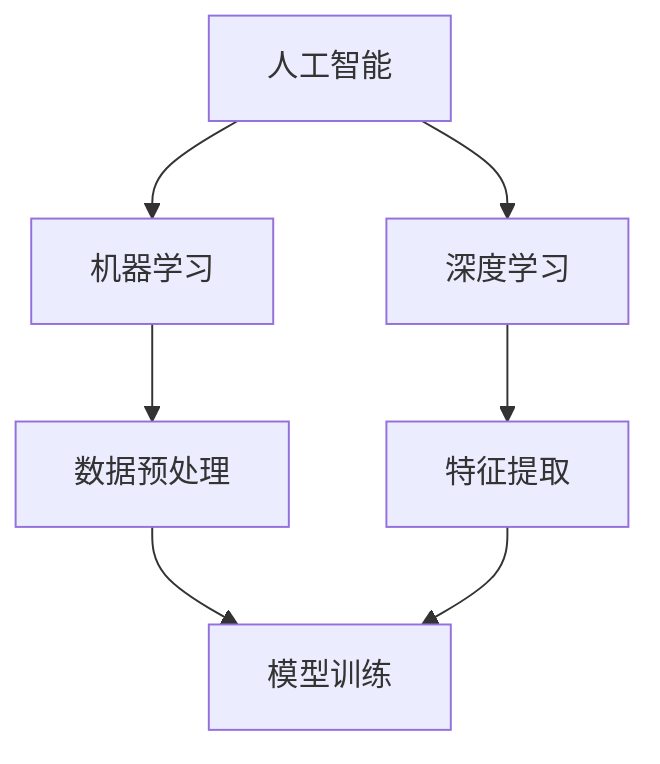

                 

关键词：人工智能，AI 2.0，未来展望，技术发展，应用场景，挑战与机遇

## 摘要

本文旨在探讨李开复对AI 2.0时代的未来展望。随着人工智能技术的快速发展，AI 2.0时代的到来已成为不可避免的趋势。本文将围绕AI 2.0的核心概念、技术原理、算法模型、应用场景以及面临的挑战与机遇进行深入分析，以期为读者提供对AI 2.0时代的全面认识。

## 1. 背景介绍

### 1.1 人工智能的发展历程

人工智能（AI）是一门研究、开发和应用使计算机模拟、延伸和扩展人类智能的理论、方法和技术的科学。自20世纪50年代人工智能概念的提出以来，人工智能经历了多个发展阶段。

**第一阶段：1956-1969年，人工智能的诞生**

1956年，约翰·麦卡锡等人在达特茅斯会议上首次提出了人工智能的概念，标志着人工智能学科的诞生。在这一阶段，人工智能主要集中在理论研究和基础算法的开发上。

**第二阶段：1970-1989年，人工智能的低谷期**

受限于硬件性能和算法复杂度，人工智能在20世纪70年代进入了一个相对低潮期。尽管如此，研究者们依然不断探索新的方法和算法，为后来的发展奠定了基础。

**第三阶段：1990-2010年，人工智能的复苏期**

随着计算机硬件性能的不断提升和算法的优化，人工智能在20世纪90年代开始复苏。这一阶段，机器学习、深度学习等核心技术取得了重要突破。

**第四阶段：2010年至今，人工智能的爆发期**

2010年以后，人工智能迎来了一个爆发期。深度学习、神经网络等技术的应用，使得人工智能在语音识别、图像处理、自然语言处理等领域取得了显著的成果。如今，人工智能已经渗透到各个领域，改变了我们的生活方式。

### 1.2 AI 1.0与AI 2.0的区别

AI 1.0时代主要依靠专家系统和规则引擎来实现人工智能。尽管在特定领域取得了成功，但受限于知识获取和表达的局限性，AI 1.0的应用场景较为狭窄。

AI 2.0时代则强调人工智能的自我学习和自主进化。通过大规模数据训练和深度学习算法，AI 2.0能够在多个领域实现高效应用，并具有更强的自适应能力和泛化能力。

## 2. 核心概念与联系

### 2.1 核心概念

#### 2.1.1 人工智能（AI）

人工智能是一门研究、开发和应用使计算机模拟、延伸和扩展人类智能的理论、方法和技术的科学。

#### 2.1.2 机器学习（ML）

机器学习是一种让计算机从数据中自动学习和改进的方法，其核心思想是通过算法让计算机具备自主学习和决策能力。

#### 2.1.3 深度学习（DL）

深度学习是一种基于多层神经网络的学习方法，通过逐层提取特征，实现图像、语音、文本等数据的自动识别和处理。

### 2.2 联系

人工智能、机器学习和深度学习之间存在密切的联系。机器学习和深度学习是人工智能的重要组成部分，而人工智能则是机器学习和深度学习的应用领域。如图所示：



## 3. 核心算法原理 & 具体操作步骤

### 3.1 算法原理概述

AI 2.0的核心算法主要包括深度学习、强化学习、迁移学习等。其中，深度学习是最为重要的算法之一。

#### 3.1.1 深度学习原理

深度学习是一种基于多层神经网络的学习方法。神经网络由多个神经元（节点）组成，每个神经元都与相邻的神经元相连。通过层层提取特征，神经网络能够实现图像、语音、文本等数据的自动识别和处理。

#### 3.1.2 深度学习操作步骤

1. 数据预处理：对输入数据（如图像、语音、文本等）进行预处理，包括数据清洗、归一化、特征提取等。

2. 模型构建：根据任务需求，设计合适的神经网络结构，包括输入层、隐藏层和输出层。

3. 模型训练：利用大量训练数据，通过反向传播算法不断调整神经网络的权重，使模型能够准确预测或分类。

4. 模型评估：使用验证集和测试集对模型进行评估，判断模型的性能和泛化能力。

5. 模型部署：将训练好的模型部署到实际应用场景中，实现自动化决策和预测。

### 3.2 算法步骤详解

#### 3.2.1 数据预处理

数据预处理是深度学习过程中的重要环节，主要包括以下步骤：

1. 数据清洗：去除数据中的噪声和异常值，提高数据质量。

2. 数据归一化：将数据缩放到同一尺度，避免因数据尺度差异导致的训练困难。

3. 特征提取：从原始数据中提取有用的特征信息，用于模型训练。

#### 3.2.2 模型构建

模型构建主要包括以下步骤：

1. 输入层：将预处理后的数据输入到神经网络中。

2. 隐藏层：通过层层提取特征，隐藏层实现数据的特征变换。

3. 输出层：根据任务需求，输出分类结果或预测值。

#### 3.2.3 模型训练

模型训练主要包括以下步骤：

1. 初始化权重：随机初始化神经网络的权重。

2. 前向传播：将输入数据通过神经网络传递到输出层，计算预测值。

3. 反向传播：计算预测值与真实值之间的误差，通过反向传播算法调整权重。

4. 重复迭代：不断重复前向传播和反向传播过程，直到模型收敛。

#### 3.2.4 模型评估

模型评估主要包括以下步骤：

1. 验证集评估：使用验证集对模型进行评估，判断模型的性能和泛化能力。

2. 测试集评估：使用测试集对模型进行评估，验证模型的泛化能力。

#### 3.2.5 模型部署

模型部署主要包括以下步骤：

1. 模型保存：将训练好的模型保存为文件。

2. 模型加载：将保存的模型加载到应用程序中。

3. 实时预测：根据输入数据，实时生成预测结果。

### 3.3 算法优缺点

#### 优点

1. 自适应能力强：深度学习模型能够从大规模数据中自动学习和优化，具有较强的自适应能力。

2. 泛化能力强：深度学习模型能够将所学到的知识应用于新的任务和数据集，具有较好的泛化能力。

3. 应用领域广泛：深度学习在图像识别、语音识别、自然语言处理等领域具有广泛的应用。

#### 缺点

1. 计算资源消耗大：深度学习模型训练需要大量计算资源和时间。

2. 数据依赖性强：深度学习模型的性能受数据质量和数量影响较大。

3. 难以解释：深度学习模型的工作原理较为复杂，难以进行解释和验证。

### 3.4 算法应用领域

深度学习算法在众多领域取得了显著的成果，以下是部分应用领域：

1. 图像识别：人脸识别、物体识别、场景识别等。

2. 语音识别：语音合成、语音识别、语音翻译等。

3. 自然语言处理：文本分类、情感分析、机器翻译等。

4. 自动驾驶：车辆识别、路径规划、决策控制等。

5. 医疗诊断：疾病检测、药物发现、影像分析等。

## 4. 数学模型和公式 & 详细讲解 & 举例说明

### 4.1 数学模型构建

深度学习中的数学模型主要包括神经网络和优化算法。以下是基本的数学模型构建：

#### 4.1.1 神经网络

神经网络由多个神经元组成，每个神经元都可以看作是一个非线性函数。神经网络的数学模型可以表示为：

$$
Y = \sigma(\sum_{i=1}^{n} w_i \cdot X_i + b)
$$

其中，$Y$ 为输出，$\sigma$ 为激活函数，$w_i$ 和 $X_i$ 分别为权重和输入，$b$ 为偏置。

#### 4.1.2 优化算法

优化算法用于求解神经网络中的权重和偏置。常用的优化算法包括梯度下降、随机梯度下降、Adam等。以下以梯度下降为例：

$$
w_{t+1} = w_t - \alpha \cdot \nabla_w J(w)
$$

其中，$w_t$ 和 $w_{t+1}$ 分别为第 $t$ 次和第 $t+1$ 次迭代的权重，$\alpha$ 为学习率，$\nabla_w J(w)$ 为损失函数关于权重 $w$ 的梯度。

### 4.2 公式推导过程

#### 4.2.1 梯度下降推导

假设我们要最小化损失函数 $J(w)$，即：

$$
J(w) = \frac{1}{2} \sum_{i=1}^{n} (y_i - \sigma(w \cdot x_i))^2
$$

其中，$y_i$ 为真实标签，$\sigma(w \cdot x_i)$ 为预测标签。

对 $J(w)$ 关于 $w$ 求导，得到：

$$
\nabla_w J(w) = \sum_{i=1}^{n} (y_i - \sigma(w \cdot x_i)) \cdot x_i
$$

将梯度代入梯度下降公式，得到：

$$
w_{t+1} = w_t - \alpha \cdot \nabla_w J(w)
$$

#### 4.2.2 激活函数推导

常见的激活函数包括 sigmoid、ReLU 和 tanh。以下以 sigmoid 为例：

$$
\sigma(z) = \frac{1}{1 + e^{-z}}
$$

对 sigmoid 激活函数求导，得到：

$$
\sigma'(z) = \sigma(z) \cdot (1 - \sigma(z))
$$

### 4.3 案例分析与讲解

#### 4.3.1 图像分类

假设我们要使用卷积神经网络（CNN）对图像进行分类。以下是具体的案例分析和讲解：

1. 数据预处理：对图像进行缩放、裁剪、归一化等预处理操作。

2. 模型构建：设计合适的 CNN 结构，包括卷积层、池化层和全连接层。

3. 模型训练：使用大量训练数据，通过反向传播算法训练模型。

4. 模型评估：使用验证集和测试集评估模型性能。

5. 模型部署：将训练好的模型部署到实际应用场景中。

#### 4.3.2 语音识别

假设我们要使用深度神经网络（DNN）进行语音识别。以下是具体的案例分析和讲解：

1. 数据预处理：对语音数据进行特征提取，如 MFCC（梅尔频率倒谱系数）。

2. 模型构建：设计合适的 DNN 结构，包括输入层、隐藏层和输出层。

3. 模型训练：使用大量语音数据，通过反向传播算法训练模型。

4. 模型评估：使用验证集和测试集评估模型性能。

5. 模型部署：将训练好的模型部署到实际应用场景中。

## 5. 项目实践：代码实例和详细解释说明

### 5.1 开发环境搭建

1. 安装 Python：在官方网站下载并安装 Python，版本要求 3.6 以上。

2. 安装深度学习框架：选择 TensorFlow 或 PyTorch，并在命令行中执行以下命令安装。

```shell
pip install tensorflow
# 或
pip install pytorch torchvision
```

3. 安装其他依赖库：包括 NumPy、Pandas、Matplotlib 等。

### 5.2 源代码详细实现

以下是一个简单的 CNN 图像分类项目的代码实现：

```python
import tensorflow as tf
from tensorflow.keras import layers
from tensorflow.keras.preprocessing.image import ImageDataGenerator

# 数据预处理
train_datagen = ImageDataGenerator(
    rescale=1./255,
    shear_range=0.2,
    zoom_range=0.2,
    horizontal_flip=True
)

train_generator = train_datagen.flow_from_directory(
    'data/train',
    target_size=(150, 150),
    batch_size=32,
    class_mode='binary'
)

# 模型构建
model = tf.keras.Sequential([
    layers.Conv2D(32, (3, 3), activation='relu', input_shape=(150, 150, 3)),
    layers.MaxPooling2D(2, 2),
    layers.Conv2D(64, (3, 3), activation='relu'),
    layers.MaxPooling2D(2, 2),
    layers.Conv2D(128, (3, 3), activation='relu'),
    layers.MaxPooling2D(2, 2),
    layers.Flatten(),
    layers.Dense(512, activation='relu'),
    layers.Dense(1, activation='sigmoid')
])

# 模型训练
model.compile(loss='binary_crossentropy',
              optimizer='adam',
              metrics=['accuracy'])

model.fit(
    train_generator,
    steps_per_epoch=100,
    epochs=20
)

# 模型评估
test_datagen = ImageDataGenerator(rescale=1./255)

test_generator = test_datagen.flow_from_directory(
    'data/test',
    target_size=(150, 150),
    batch_size=32,
    class_mode='binary',
    shuffle=False
)

model.evaluate(test_generator, steps=50)

# 模型部署
import numpy as np
from tensorflow.keras.preprocessing import image

test_image = image.load_img('data/test/boat/2.jpg', target_size=(150, 150))
test_image = image.img_to_array(test_image)
test_image = np.expand_dims(test_image, axis=0)
predictions = model.predict(test_image)

print('Prediction:', predictions)
```

### 5.3 代码解读与分析

1. 数据预处理：使用 ImageDataGenerator 对训练数据和测试数据进行预处理，包括缩放、剪切、缩放和水平翻转等。

2. 模型构建：使用 TensorFlow 的 Sequential 模型构建一个简单的 CNN，包括卷积层、池化层和全连接层。

3. 模型训练：使用 compile() 函数设置模型编译参数，包括损失函数、优化器和评估指标。使用 fit() 函数训练模型。

4. 模型评估：使用 evaluate() 函数评估模型在测试集上的性能。

5. 模型部署：使用 load_img() 函数加载测试图像，使用 img_to_array() 函数将其转换为 NumPy 数组，然后使用 predict() 函数生成预测结果。

## 6. 实际应用场景

### 6.1 智能家居

智能家居是 AI 2.0 时代的重要应用场景之一。通过深度学习算法，智能家居设备能够实现语音识别、图像识别、人脸识别等功能，为用户提供便捷、智能的生活体验。

### 6.2 自动驾驶

自动驾驶是 AI 2.0 时代的另一个重要应用场景。通过深度学习和强化学习算法，自动驾驶系统能够实时感知周围环境，实现车辆的自适应驾驶和路径规划。

### 6.3 医疗诊断

医疗诊断是 AI 2.0 时代的重要应用领域之一。通过深度学习算法，医学影像分析和疾病检测等任务能够实现高效、准确的诊断。

### 6.4 教育

教育是 AI 2.0 时代的另一个重要应用领域。通过人工智能技术，个性化教育、智能辅导等应用场景逐渐普及，为学生提供更好的学习体验。

## 7. 工具和资源推荐

### 7.1 学习资源推荐

1. 《深度学习》（Goodfellow、Bengio、Courville 著）：系统介绍了深度学习的理论基础和实践方法。

2. 《神经网络与深度学习》（邱锡鹏 著）：全面介绍了神经网络和深度学习的基本概念、算法和应用。

3. Coursera 上的深度学习课程：由 Andrew Ng 教授讲授的深度学习课程，适合初学者和进阶者。

### 7.2 开发工具推荐

1. TensorFlow：Google 开发的一款开源深度学习框架，适用于各种深度学习任务。

2. PyTorch：Facebook 开发的一款开源深度学习框架，具有灵活的动态计算图和丰富的 API。

### 7.3 相关论文推荐

1. “A Brief History of Deep Learning”（Y. Bengio）：回顾了深度学习的发展历程，分析了深度学习的关键技术和未来趋势。

2. “Deep Learning: A Methodology and An Introduction”（Y. LeCun）：介绍了深度学习的理论基础和应用领域，为深度学习研究提供了宝贵的经验。

## 8. 总结：未来发展趋势与挑战

### 8.1 研究成果总结

AI 2.0 时代的研究成果涵盖了深度学习、强化学习、迁移学习等多个领域。通过不断的理论创新和技术突破，人工智能在图像识别、语音识别、自然语言处理等领域取得了显著的成果。

### 8.2 未来发展趋势

1. 模型压缩和优化：随着模型规模的不断扩大，模型压缩和优化将成为研究的重要方向。

2. 自主学习和推理：未来的人工智能系统将具备更强的自主学习和推理能力，实现更高效的任务执行。

3. 跨领域应用：人工智能将在医疗、金融、教育等多个领域实现广泛应用，推动社会进步。

### 8.3 面临的挑战

1. 数据隐私和安全：随着人工智能应用的普及，数据隐私和安全问题日益凸显。

2. 伦理和法律问题：人工智能的伦理和法律问题需要得到有效解决，确保其合理、合规使用。

3. 资源消耗和能耗：深度学习模型训练需要大量计算资源和能源，未来需要探索更高效的训练方法。

### 8.4 研究展望

未来，人工智能将在理论、算法、应用等多个方面实现突破，为人类社会带来更多便利和创新。同时，我们需要关注人工智能的伦理、法律和社会问题，确保其可持续发展。

## 9. 附录：常见问题与解答

### 9.1 AI 2.0与AI 1.0的区别是什么？

AI 1.0主要依靠专家系统和规则引擎来实现人工智能，应用场景较为狭窄。AI 2.0强调人工智能的自我学习和自主进化，能够在多个领域实现高效应用，并具有更强的自适应能力和泛化能力。

### 9.2 深度学习的优势是什么？

深度学习的优势包括：

1. 自适应能力强：通过大规模数据训练，深度学习模型能够自动学习和优化。

2. 泛化能力强：深度学习模型能够将所学到的知识应用于新的任务和数据集。

3. 应用领域广泛：深度学习在图像识别、语音识别、自然语言处理等领域具有广泛的应用。

### 9.3 深度学习的缺点是什么？

深度学习的缺点包括：

1. 计算资源消耗大：深度学习模型训练需要大量计算资源和时间。

2. 数据依赖性强：深度学习模型的性能受数据质量和数量影响较大。

3. 难以解释：深度学习模型的工作原理较为复杂，难以进行解释和验证。

----------------------------------------------------------------

本文由禅与计算机程序设计艺术 / Zen and the Art of Computer Programming 撰写，旨在探讨李开复对AI 2.0时代的未来展望。通过深入分析AI 2.0的核心概念、技术原理、算法模型、应用场景以及面临的挑战与机遇，本文为读者提供了对AI 2.0时代的全面认识。希望本文能为读者在人工智能领域的研究和实践提供有益的参考。

