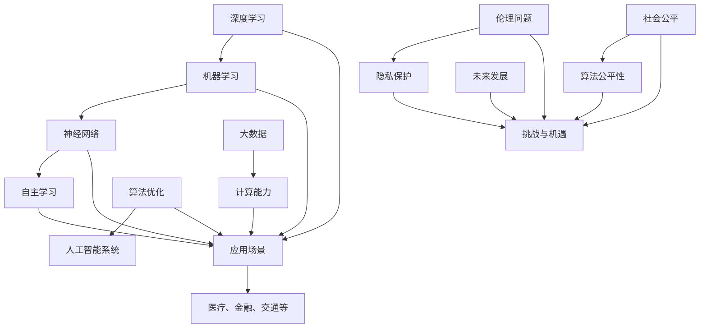

                 

关键词：人工智能，AI 2.0，未来展望，深度学习，机器学习，智能革命，技术进步

## 摘要

本文由计算机领域大师李开复撰写，深入探讨了AI 2.0时代的未来发展趋势和可能面临的挑战。文章从背景介绍开始，逐步引入了核心概念和联系，详细解析了核心算法原理，数学模型和公式，以及具体的实现步骤。随后，文章展示了实际应用场景，并展望了未来的发展方向和挑战。最后，作者推荐了相关学习资源和开发工具，总结了研究成果，并对未来进行了展望。

## 1. 背景介绍

人工智能（AI）作为计算机科学的一个分支，一直在快速发展。从最初的规则驱动式系统，到基于统计学的机器学习，再到当前深度学习的兴起，人工智能的发展经历了多个阶段。每一次技术的突破都带来了巨大的变革，改变了人们的生活方式和社会结构。然而，随着技术的不断进步，我们正迎来AI 2.0时代，这一时代的到来将会带来更加深远的影响。

AI 2.0时代是指人工智能技术进入一个全新的阶段，其核心特点在于人工智能的智能化水平和自主性将大幅提升。这一时代将不仅仅是简单的模拟人类智能，而是实现真正的智能，具备自主学习、自我进化、自我适应的能力。AI 2.0时代的到来，将深刻改变我们的生活、工作和社会，带来前所未有的机遇和挑战。

本文将围绕AI 2.0时代的未来展望，探讨以下几个方面：

1. 核心概念与联系
2. 核心算法原理与具体操作步骤
3. 数学模型和公式及详细讲解
4. 项目实践：代码实例和详细解释说明
5. 实际应用场景
6. 未来应用展望
7. 工具和资源推荐
8. 总结：未来发展趋势与挑战

通过以上内容的探讨，希望能够为读者提供一个全面而深入的AI 2.0时代展望。

### 1.1  AI 2.0的定义与发展历程

AI 2.0，即第二代人工智能，是一种能够实现高度智能化和高度自主化的技术。它不同于第一代人工智能，主要基于规则和预定义的算法进行操作，而是通过深度学习和自主学习来实现。AI 2.0的核心在于其具备自我学习、自我优化和自我进化的能力，能够不断适应新的环境和任务。

从发展历程来看，AI 2.0经历了多个关键阶段。最初，人工智能主要依赖于专家系统，这些系统基于领域专家的知识和经验来设计规则。然而，随着数据量的增长和计算能力的提升，统计学习模型逐渐取代了专家系统，其中以机器学习和深度学习为代表。

机器学习是一种基于数据驱动的方法，通过训练模型来预测或分类新的数据。这一方法使得人工智能系统能够处理复杂的任务，如图像识别、语音识别等。而深度学习则进一步推动了人工智能的发展，通过多层神经网络模型，能够实现更高级的智能任务。

进入AI 2.0时代，人工智能技术将实现真正的智能化，具备自我学习和自我优化能力。这一阶段的关键在于算法的改进、计算能力的提升以及大数据的利用。随着深度学习算法的不断优化和计算能力的不断提升，人工智能系统将能够解决更复杂的问题，实现更高级的智能。

AI 2.0的发展不仅改变了技术的格局，也深刻影响了社会和经济。在医疗领域，人工智能能够通过分析大量医学数据，帮助医生进行疾病诊断和治疗；在金融领域，人工智能能够通过数据分析，实现更精准的投资决策；在制造业，人工智能能够优化生产流程，提高生产效率。

总之，AI 2.0时代的到来，将带来前所未有的机遇和挑战。作为计算机领域大师，李开复通过本文，对AI 2.0时代的未来进行了深入的探讨，希望为读者提供有价值的参考和启示。

### 1.2  当前AI技术发展的现状与趋势

当前，人工智能技术正以惊人的速度发展，深度学习和神经网络算法在多个领域取得了显著的成果。在图像识别方面，深度学习算法已经达到了人类水平，甚至在一些特定任务上超过了人类的表现。例如，在图像分类任务中，基于卷积神经网络（CNN）的模型如ResNet和Inception已经取得了非常高的准确率。

在自然语言处理（NLP）领域，神经网络模型也取得了重要进展。以BERT和GPT为代表的语言模型，通过大规模数据训练，能够实现高效的文本生成、情感分析和机器翻译等任务。这些模型不仅在学术研究中表现出色，也在实际应用中得到了广泛的应用，如智能客服、内容推荐和搜索引擎等。

除了深度学习和神经网络算法，当前AI技术还在不断融合其他技术，如强化学习、迁移学习和生成对抗网络（GAN）等。强化学习通过奖励机制，使人工智能系统能够在复杂环境中进行自主决策，如游戏对战、自动驾驶和机器人控制等。迁移学习则通过在不同任务之间共享知识，提高了模型的泛化能力和效率。生成对抗网络（GAN）则通过生成器和判别器的对抗训练，能够生成逼真的图像、音频和视频。

在技术发展趋势方面，AI 2.0时代将进一步提升人工智能的智能化水平和自主性。首先，计算能力的提升将继续推动人工智能技术的发展。随着硬件设备的不断升级，如GPU、TPU和量子计算等，人工智能模型将能够处理更大量的数据，实现更复杂的任务。

其次，数据量的增长和数据的多样性也将对人工智能的发展产生重要影响。大数据技术的进步使得人们能够收集和分析海量的数据，为人工智能提供了丰富的训练资源。同时，数据的多样性也为人工智能的应用提供了更多的可能性，如在医疗领域，通过整合不同类型的医学数据，可以更准确地诊断疾病。

此外，人工智能技术的发展还将依赖于算法的优化和创新。当前，深度学习算法已经在很多领域取得了重要突破，但仍然存在一些挑战，如模型的可解释性、泛化能力和能耗等问题。未来，通过不断的算法研究和优化，人工智能系统将能够更好地应对这些挑战，实现更高级的智能。

总之，当前AI技术的发展正处于一个快速进步的阶段，深度学习和神经网络算法在多个领域取得了显著成果。随着计算能力、数据量和算法的不断进步，人工智能技术将在未来实现更大的突破，推动社会和经济的变革。

### 1.3  AI 2.0的核心概念与联系

在探讨AI 2.0的核心概念与联系时，我们首先需要理解几个关键术语，包括深度学习、机器学习、神经网络和自主学习。这些概念相互交织，共同构成了AI 2.0时代的基石。

#### 深度学习

深度学习是机器学习的一个重要分支，通过构建多层神经网络模型，对大量数据进行分析和建模。深度学习的核心在于其能够自动提取特征，从而实现复杂任务的自动化。例如，在图像识别任务中，深度学习模型可以自动学习图像中的边缘、纹理和形状等特征，从而实现高精度的识别。

深度学习的成功得益于计算能力的提升和大数据的广泛应用。通过使用GPU和TPU等硬件设备，深度学习模型可以高效地处理海量数据，并在多个领域取得了突破性成果。例如，在图像识别、语音识别和自然语言处理等领域，深度学习模型已经达到了或超过了人类的表现。

#### 机器学习

机器学习是人工智能的一个分支，旨在通过数据训练模型，使计算机具备预测和决策能力。机器学习可以分为监督学习、无监督学习和强化学习等不同的类型。

- **监督学习**：通过已有的输入输出数据，训练模型，使其能够预测新的输入数据。例如，在图像分类任务中，通过训练模型，使其能够识别不同的物体。
- **无监督学习**：没有明确的输入输出数据，而是通过数据之间的内在结构，自动发现数据的特点。例如，在聚类任务中，通过无监督学习，可以自动将数据划分为不同的类别。
- **强化学习**：通过与环境的交互，不断调整策略，以实现最优化的目标。例如，在游戏对战任务中，通过强化学习，可以训练出能够击败人类玩家的智能体。

#### 神经网络

神经网络是机器学习的一种基础模型，由大量的神经元（节点）组成。这些神经元通过前向传播和反向传播的方式，对输入数据进行建模和优化。神经网络可以分为以下几种类型：

- **前馈神经网络（FNN）**：信息从前向后传播，没有循环结构。
- **循环神经网络（RNN）**：信息在时间序列中循环传播，能够处理序列数据。
- **卷积神经网络（CNN）**：专门用于处理图像数据，通过卷积操作提取图像特征。
- **生成对抗网络（GAN）**：由生成器和判别器组成，通过对抗训练生成逼真的数据。

#### 自主学习

自主学习是AI 2.0时代的一个核心概念，指的是系统在无外部指导的情况下，通过数据和学习算法，不断优化自身的性能。自主学习系统具有以下特点：

- **自我适应**：系统能够根据环境变化，调整自己的行为和策略。
- **自我进化**：系统能够通过不断学习，提升自身的智能水平。
- **自我优化**：系统能够通过优化算法，提高性能和效率。

#### 关系与联系

深度学习和机器学习密切相关，深度学习是机器学习的一个重要分支，而机器学习则是人工智能的基础。神经网络是深度学习和机器学习的一种基础模型，通过神经元的连接和权重调整，实现数据的建模和优化。

自主学习则是AI 2.0时代的一个重要特点，它使得系统能够在无外部指导的情况下，实现自我适应、自我进化和自我优化。自主学习系统通常基于深度学习和机器学习算法，通过不断的训练和优化，提升系统的智能化水平。

总之，AI 2.0的核心概念与联系在于深度学习、机器学习、神经网络和自主学习。这些概念相互促进，共同构成了AI 2.0时代的基石，为人工智能的发展提供了强大的动力。通过深入理解这些概念，我们可以更好地把握AI 2.0时代的未来发展趋势和机遇。

### 1.4  AI 2.0与未来社会

AI 2.0时代的到来，将深刻改变我们的社会、经济和文化。在这个全新的时代，人工智能不仅将成为推动技术进步的关键力量，还将成为重塑社会结构的重要力量。

首先，AI 2.0将在医疗领域带来革命性的变化。通过深度学习和大数据分析，人工智能可以辅助医生进行疾病诊断和治疗。例如，通过分析大量的医学影像数据，人工智能可以早期发现癌症等疾病，提供更精准的治疗方案。此外，AI 2.0还可以帮助研发新药，通过模拟和预测药物与生物体的相互作用，加速新药的研发进程。

在金融领域，AI 2.0将带来更加智能化的金融服务。通过机器学习和大数据分析，金融机构可以更精准地进行风险评估和投资决策。例如，通过分析用户的消费行为和历史数据，AI 2.0可以预测用户的信用风险，提供个性化的贷款和信用服务。此外，AI 2.0还可以优化交易策略，提高交易效率和盈利能力。

在教育领域，AI 2.0将实现个性化教育和智能化教学。通过深度学习和自适应学习算法，AI 2.0可以为学生提供个性化的学习方案，根据学生的学习进度和能力水平，自动调整教学内容和难度。例如，通过分析学生的学习数据，AI 2.0可以推荐适合学生的学习资源，帮助学生更高效地学习。此外，AI 2.0还可以智能批改作业和考试，提供即时反馈，帮助学生及时纠正错误。

在交通领域，AI 2.0将带来自动驾驶和智能交通系统的实现。通过深度学习和传感器技术，AI 2.0可以实时感知道路状况，实现自动驾驶车辆的安全行驶。同时，通过大数据分析和优化算法，AI 2.0可以优化交通流量，减少拥堵，提高交通效率。例如，AI 2.0可以预测交通流量，自动调整信号灯时间，实现智能交通管理。

此外，AI 2.0还将对文化产业产生深远的影响。通过自然语言处理和生成对抗网络，AI 2.0可以创作音乐、绘画和文学作品，推动文化创新。例如，AI 2.0可以生成新的音乐风格和旋律，为艺术家提供灵感和创作素材。此外，AI 2.0还可以自动生成视频和游戏内容，为娱乐产业带来新的发展机遇。

总之，AI 2.0时代的到来，将深刻改变社会、经济和文化。它不仅将推动技术进步，提高生产效率，还将重塑社会结构，带来新的发展机遇。然而，这一过程也将面临一系列挑战，如伦理道德、隐私保护和社会公平等问题。因此，我们需要在推动AI 2.0发展的同时，充分考虑这些挑战，确保技术的可持续发展。

### 1.5  AI 2.0面临的挑战与伦理问题

尽管AI 2.0带来了巨大的发展机遇，但同时也面临着一系列挑战和伦理问题。首先，伦理问题是一个重要方面。随着人工智能系统在医疗、金融、交通等关键领域的广泛应用，其决策和行为的透明度和可解释性成为关键问题。例如，在自动驾驶车辆中，系统如何在紧急情况下做出决策，需要确保其决策过程符合伦理规范，避免造成不必要的伤害。

其次，隐私保护也是一个重大挑战。人工智能系统需要大量的数据来进行训练和优化，但这些数据往往包含个人隐私信息。如何在保护用户隐私的同时，充分利用这些数据，是当前的一个重要课题。例如，如何在医疗领域利用患者数据，同时保护患者的隐私，需要制定严格的隐私保护法规和标准。

此外，社会公平也是一个备受关注的问题。人工智能系统在决策过程中，可能会因为数据偏见、算法设计不当等问题，导致对特定群体的不公平待遇。例如，在招聘和贷款审批中，如果算法基于历史数据做出决策，可能会加剧社会不平等。因此，如何确保人工智能系统的公平性和公正性，是亟待解决的问题。

面对这些挑战，我们需要采取一系列措施。首先，加强伦理教育和培训，提高人工智能从业者的道德意识和社会责任感。其次，制定严格的隐私保护法规和标准，确保人工智能系统的数据使用符合伦理规范。此外，推动算法公平性的研究，开发公平、透明的人工智能算法，减少对特定群体的不利影响。

总之，AI 2.0时代的到来，不仅带来了巨大的发展机遇，也面临着一系列挑战和伦理问题。我们需要在推动技术发展的同时，充分考虑这些挑战，确保人工智能的可持续发展，为人类社会带来真正的福祉。

## 2. 核心概念与联系

在深入了解AI 2.0时代之前，我们需要对核心概念与联系进行详细探讨。本文将使用Mermaid流程图来展示这些核心概念之间的联系，以便读者更好地理解。



### 2.1  深度学习与机器学习

深度学习是机器学习的一个分支，其核心思想是通过构建多层神经网络，自动提取数据的特征。深度学习在图像识别、语音识别和自然语言处理等领域取得了显著成果。机器学习则是一种通过数据训练模型，使计算机具备预测和决策能力的方法。机器学习可以分为监督学习、无监督学习和强化学习等不同的类型。

### 2.2  神经网络

神经网络是深度学习和机器学习的基础模型，由大量的神经元（节点）组成。这些神经元通过前向传播和反向传播的方式，对输入数据进行建模和优化。神经网络可以分为以下几种类型：

- **前馈神经网络（FNN）**：信息从前向后传播，没有循环结构。
- **循环神经网络（RNN）**：信息在时间序列中循环传播，能够处理序列数据。
- **卷积神经网络（CNN）**：专门用于处理图像数据，通过卷积操作提取图像特征。
- **生成对抗网络（GAN）**：由生成器和判别器组成，通过对抗训练生成逼真的数据。

### 2.3  自主学习

自主学习是AI 2.0时代的一个核心概念，指的是系统在无外部指导的情况下，通过数据和学习算法，不断优化自身的性能。自主学习系统具有自我适应、自我进化、自我优化等特点，能够实现高度智能化和自主化。

### 2.4  大数据与计算能力

大数据是人工智能系统的重要基础，通过收集和分析海量的数据，人工智能系统能够实现更高级的智能任务。计算能力则是支持人工智能系统运行的关键，随着硬件设备的不断升级，如GPU、TPU和量子计算等，人工智能系统的性能将得到进一步提升。

### 2.5  伦理问题、隐私保护与社会公平

随着人工智能系统的广泛应用，伦理问题、隐私保护和社会公平成为关键挑战。我们需要在推动技术发展的同时，充分考虑这些问题，确保人工智能的可持续发展。

通过以上核心概念和联系，我们可以更好地理解AI 2.0时代的各个方面，为未来的发展奠定基础。

### 3.1  算法原理概述

AI 2.0时代的核心算法主要包括深度学习、机器学习和神经网络。这些算法通过构建复杂的模型和优化算法，使计算机具备自主学习、自我进化、自我适应的能力。下面，我们将详细解释这些核心算法的原理，并探讨它们在AI 2.0时代中的应用。

#### 深度学习

深度学习是一种通过多层神经网络进行数据建模的算法，其核心思想是自动提取数据的特征。在深度学习中，数据首先通过输入层进入网络，然后通过多个隐藏层，最终输出结果。每个隐藏层都会对数据进行一定的变换和特征提取，从而实现数据的逐层抽象和压缩。

深度学习的优势在于其能够自动学习数据的特征，从而实现更高级的智能任务。例如，在图像识别任务中，深度学习可以通过多层神经网络，自动提取图像中的边缘、纹理和形状等特征，从而实现高精度的识别。此外，深度学习还在语音识别、自然语言处理、推荐系统和自动驾驶等领域取得了显著成果。

#### 机器学习

机器学习是一种通过训练模型，使计算机具备预测和决策能力的算法。机器学习可以分为监督学习、无监督学习和强化学习等不同的类型。

- **监督学习**：通过已有的输入输出数据，训练模型，使其能够预测新的输入数据。例如，在图像分类任务中，通过训练模型，使其能够识别不同的物体。
- **无监督学习**：没有明确的输入输出数据，而是通过数据之间的内在结构，自动发现数据的特点。例如，在聚类任务中，通过无监督学习，可以自动将数据划分为不同的类别。
- **强化学习**：通过与环境的交互，不断调整策略，以实现最优化的目标。例如，在游戏对战任务中，通过强化学习，可以训练出能够击败人类玩家的智能体。

机器学习在金融、医疗、交通和制造业等领域具有广泛的应用。通过机器学习，企业可以更好地预测市场需求、优化生产流程、提高服务质量。

#### 神经网络

神经网络是深度学习和机器学习的基础模型，由大量的神经元（节点）组成。这些神经元通过前向传播和反向传播的方式，对输入数据进行建模和优化。神经网络可以分为以下几种类型：

- **前馈神经网络（FNN）**：信息从前向后传播，没有循环结构。
- **循环神经网络（RNN）**：信息在时间序列中循环传播，能够处理序列数据。
- **卷积神经网络（CNN）**：专门用于处理图像数据，通过卷积操作提取图像特征。
- **生成对抗网络（GAN）**：由生成器和判别器组成，通过对抗训练生成逼真的数据。

神经网络在图像识别、语音识别、自然语言处理和生成对抗网络等领域取得了显著成果。通过神经网络的训练和优化，计算机能够实现更高级的智能任务，如自动驾驶、智能客服和智能翻译。

#### 自主学习

自主学习是AI 2.0时代的一个核心概念，指的是系统在无外部指导的情况下，通过数据和学习算法，不断优化自身的性能。自主学习系统具有自我适应、自我进化、自我优化等特点，能够实现高度智能化和自主化。

自主学习系统在医疗、金融、交通和教育等领域具有广泛的应用。例如，在医疗领域，通过自主学习系统，可以自动分析医学影像数据，提供更准确的诊断和治疗建议。在金融领域，通过自主学习系统，可以优化投资策略，提高投资收益。在交通领域，通过自主学习系统，可以实现自动驾驶和智能交通管理。

总之，深度学习、机器学习和神经网络是AI 2.0时代的核心算法，它们通过构建复杂的模型和优化算法，使计算机具备自主学习、自我进化、自我适应的能力。这些算法在医疗、金融、交通和教育等领域具有广泛的应用，为AI 2.0时代的发展提供了强大的动力。

### 3.2  算法步骤详解

#### 3.2.1 数据准备

数据准备是深度学习、机器学习和神经网络算法的第一步，也是至关重要的一步。数据的质量和多样性直接影响到模型的性能和泛化能力。以下是在AI 2.0时代进行数据准备的详细步骤：

1. **数据收集**：首先，我们需要收集大量的数据。这些数据可以是结构化数据（如数据库）、半结构化数据（如日志文件）和非结构化数据（如图像、音频和文本）。在AI 2.0时代，随着传感器和物联网的发展，我们可以获取到更多类型的实时数据。

2. **数据清洗**：收集到的数据往往存在缺失值、噪声和异常值。因此，我们需要对数据进行清洗，去除这些无效数据。数据清洗包括以下步骤：
   - **去除重复数据**：确保数据的一致性和唯一性。
   - **填补缺失值**：使用插值、平均值或中位数等方法填补缺失值。
   - **去除噪声**：使用滤波器、平滑算法等方法去除噪声。
   - **处理异常值**：使用统计方法、聚类分析等方法识别和去除异常值。

3. **数据预处理**：对数据进行归一化、标准化、缩放等处理，使其符合模型的输入要求。例如，对于图像数据，可以使用归一化处理，将像素值缩放到0到1之间。对于文本数据，可以使用词袋模型或词嵌入等方法，将文本转化为数值向量。

4. **数据分割**：将数据集划分为训练集、验证集和测试集。通常，训练集用于模型的训练，验证集用于模型的调优和评估，测试集用于最终的评估。

#### 3.2.2 模型构建

模型构建是深度学习、机器学习和神经网络算法的核心步骤。以下是构建模型的一般步骤：

1. **选择模型架构**：根据任务需求，选择合适的模型架构。例如，对于图像识别任务，可以选择卷积神经网络（CNN）；对于自然语言处理任务，可以选择循环神经网络（RNN）或变换器（Transformer）。

2. **定义损失函数**：损失函数用于衡量模型的预测结果与真实结果之间的差距。常见的损失函数包括均方误差（MSE）、交叉熵（CE）等。

3. **定义优化算法**：优化算法用于调整模型的参数，以最小化损失函数。常见的优化算法包括随机梯度下降（SGD）、Adam等。

4. **定义训练过程**：包括设置训练参数，如学习率、训练轮次、批次大小等。训练过程通常包括前向传播、反向传播和参数更新。

#### 3.2.3 模型训练

模型训练是算法步骤中的关键环节。以下是模型训练的详细步骤：

1. **前向传播**：将输入数据输入到模型中，通过网络的正向传播，得到预测结果。前向传播过程包括多层神经元的激活函数计算和权重更新。

2. **计算损失**：将预测结果与真实结果进行比较，计算损失函数的值。损失函数的值反映了模型预测的误差。

3. **反向传播**：根据损失函数的梯度，通过反向传播算法，更新模型的参数。反向传播过程包括梯度计算、梯度下降和参数更新。

4. **迭代优化**：重复前向传播和反向传播的过程，逐步优化模型的参数，使其达到最佳性能。训练过程通常需要多次迭代，直到模型收敛。

#### 3.2.4 模型评估与优化

模型评估与优化是确保模型性能的关键步骤。以下是模型评估与优化的详细步骤：

1. **评估指标**：根据任务需求，选择合适的评估指标。常见的评估指标包括准确率、召回率、F1值等。

2. **交叉验证**：使用交叉验证方法，对模型进行评估。交叉验证通过将数据集划分为多个子集，轮流进行训练和测试，以评估模型的泛化能力。

3. **超参数调优**：通过调整模型的超参数，如学习率、批次大小、隐藏层数量等，以优化模型的性能。常用的调优方法包括网格搜索、随机搜索等。

4. **模型压缩与优化**：对于大规模模型，可以采用模型压缩和优化技术，如剪枝、量化、蒸馏等，以降低模型的复杂度和计算成本。

通过以上详细的算法步骤，我们可以构建并优化深度学习、机器学习和神经网络模型，为AI 2.0时代的发展提供强大的技术支持。

### 3.3  算法优缺点

在AI 2.0时代，深度学习、机器学习和神经网络算法作为核心算法，具有许多优点，但也存在一些局限性。以下是这些算法的主要优缺点：

#### 深度学习的优点：

1. **自动特征提取**：深度学习能够自动从数据中提取有用的特征，减少了人工特征工程的工作量。
2. **高精度**：通过多层神经网络的结构，深度学习在图像识别、语音识别和自然语言处理等领域取得了非常高的精度。
3. **适应性**：深度学习算法具有很强的适应性，能够处理各种类型的数据和任务。
4. **泛化能力**：通过训练大规模的数据集，深度学习模型具有良好的泛化能力，能够在新数据上取得较好的性能。

#### 深度学习的缺点：

1. **计算资源需求高**：深度学习算法通常需要大量的计算资源和时间，尤其是在训练阶段。
2. **模型可解释性差**：深度学习模型的内部结构复杂，难以理解其决策过程，导致其可解释性较差。
3. **数据依赖性大**：深度学习模型的性能高度依赖于训练数据的质量和数量，数据偏差可能导致模型产生误导性结果。
4. **训练难度大**：深度学习模型的训练过程需要大量的参数调整和迭代，训练难度较大。

#### 机器学习的优点：

1. **高效性**：机器学习算法能够快速处理大量的数据，并从中提取有用的信息。
2. **通用性**：机器学习算法适用于各种领域，如金融、医疗、交通和制造业等。
3. **灵活性**：机器学习算法可以根据不同的任务需求，灵活调整模型结构和参数。
4. **高准确性**：通过适当的训练和优化，机器学习模型能够在许多任务中达到或超过人类水平。

#### 机器学习的缺点：

1. **数据依赖性**：机器学习模型的性能高度依赖于训练数据的质量和数量，数据偏差可能导致模型产生误导性结果。
2. **可解释性差**：机器学习模型的内部结构复杂，难以理解其决策过程，导致其可解释性较差。
3. **过拟合风险**：在训练数据上过度拟合可能导致模型在新的数据上表现不佳，即泛化能力差。
4. **模型调优困难**：机器学习模型的调优过程复杂，需要大量的时间和计算资源。

#### 神经网络的优点：

1. **强大的表达能力**：神经网络能够通过多层结构，对复杂的函数进行建模。
2. **自适应性强**：神经网络能够根据输入数据自动调整权重和偏置，具有很好的适应性。
3. **适用范围广**：神经网络适用于各种类型的数据和任务，如图像识别、语音识别和自然语言处理等。
4. **高精度**：通过训练和优化，神经网络能够在许多任务中达到或超过人类水平。

#### 神经网络的缺点：

1. **计算资源需求高**：神经网络模型通常需要大量的计算资源和时间，尤其是在训练阶段。
2. **模型可解释性差**：神经网络模型的内部结构复杂，难以理解其决策过程，导致其可解释性较差。
3. **训练难度大**：神经网络模型的训练过程需要大量的参数调整和迭代，训练难度较大。

#### 自主学习的优点：

1. **自我优化**：自主学习系统能够在无外部指导的情况下，通过数据和学习算法，不断优化自身的性能。
2. **自适应性强**：自主学习系统可以根据环境变化，自动调整行为和策略。
3. **高效性**：自主学习系统能够在复杂环境中，快速适应并解决问题。

#### 自主学习的缺点：

1. **数据依赖性大**：自主学习系统的性能高度依赖于训练数据的质量和数量。
2. **模型可解释性差**：自主学习系统的决策过程复杂，难以理解其内在逻辑。
3. **过拟合风险**：在训练数据上过度拟合可能导致模型在新的数据上表现不佳，即泛化能力差。

综上所述，深度学习、机器学习和神经网络算法在AI 2.0时代具有许多优点，但也存在一些局限性。了解这些优缺点，有助于我们在实际应用中更好地选择和优化算法，发挥其最大的潜力。

### 3.4  算法应用领域

深度学习、机器学习和神经网络算法在AI 2.0时代具有广泛的应用领域，涵盖医疗、金融、交通、教育等多个行业。以下是这些算法在不同领域中的具体应用：

#### 医疗

在医疗领域，深度学习和神经网络算法可以用于疾病诊断、治疗方案推荐、医学影像分析等。例如，通过卷积神经网络（CNN）对医学影像进行分类，可以早期发现癌症等重大疾病。通过循环神经网络（RNN）处理患者的病历数据，可以辅助医生进行疾病预测和治疗方案推荐。此外，生成对抗网络（GAN）可以用于生成高质量的医学图像，帮助医生进行训练和教学。

#### 金融

在金融领域，机器学习和深度学习算法可以用于风险管理、股票预测、信用评估等。通过分析大量金融数据，如股票价格、交易记录和用户行为，可以预测市场趋势和风险。深度学习模型可以用于检测欺诈交易，提高金融交易的安全性。此外，神经网络算法还可以用于信用评分，通过分析借款人的历史数据，预测其还款能力，提高贷款审批的准确性。

#### 交通

在交通领域，自动驾驶技术和智能交通系统是深度学习和神经网络算法的重要应用。通过卷积神经网络（CNN）和循环神经网络（RNN），可以实现对交通场景的实时监控和分析，帮助自动驾驶车辆进行路径规划和决策。神经网络算法还可以用于优化交通信号灯控制，减少交通拥堵，提高交通效率。此外，生成对抗网络（GAN）可以用于生成仿真交通场景，帮助自动驾驶车辆进行训练和测试。

#### 教育

在教育领域，深度学习和机器学习算法可以用于个性化教育、智能评估和学习分析。通过分析学生的学习数据，可以为学生推荐适合的学习资源和教学策略。通过自然语言处理技术，可以对学生的作业和考试进行智能批改，提供即时反馈。此外，神经网络算法可以用于预测学生的学习进度和成绩，帮助教师进行教学调整和优化。

#### 其他领域

除了以上领域，深度学习、机器学习和神经网络算法还在零售、能源、农业和制造业等领域具有广泛的应用。例如，在零售领域，通过分析消费者行为数据，可以优化库存管理和营销策略。在能源领域，通过分析电力数据，可以实现智能电网管理和能源优化。在农业领域，通过分析气象数据和作物生长数据，可以实现精准农业和作物管理。在制造业领域，通过分析生产数据，可以优化生产流程和质量管理。

总之，深度学习、机器学习和神经网络算法在AI 2.0时代具有广泛的应用领域，为各个行业带来了巨大的变革和机遇。通过不断优化和创新，这些算法将在未来的AI 2.0时代发挥更加重要的作用。

### 4.1  数学模型构建

在AI 2.0时代，数学模型在人工智能算法的设计和实现中起着至关重要的作用。一个有效的数学模型不仅能够提高算法的精度和效率，还能够帮助理解算法的内在机制。本节将介绍几个在深度学习、机器学习和神经网络中常用的数学模型，并解释其构建过程。

#### 4.1.1 线性回归模型

线性回归模型是一种最简单的统计学习模型，它通过建立一个线性关系来预测数值型变量。其数学模型可以表示为：

$$
y = \beta_0 + \beta_1 \cdot x + \epsilon
$$

其中，$y$ 是预测变量，$x$ 是输入变量，$\beta_0$ 是截距，$\beta_1$ 是斜率，$\epsilon$ 是误差项。线性回归模型的构建主要包括以下步骤：

1. **数据收集**：收集包含输入变量和预测变量的数据集。
2. **数据预处理**：对数据进行归一化或标准化处理，使其符合线性回归模型的输入要求。
3. **模型构建**：通过最小二乘法或梯度下降法求解线性回归模型的参数 $\beta_0$ 和 $\beta_1$。
4. **模型评估**：使用验证集或测试集评估模型的性能，如均方误差（MSE）。

#### 4.1.2 多层感知机模型

多层感知机（MLP）是一种前馈神经网络模型，它通过多个隐藏层来学习输入和输出之间的非线性关系。其数学模型可以表示为：

$$
a_l = \sigma(\beta_l \cdot x + b_l)
$$

其中，$a_l$ 是第 $l$ 层的激活值，$\sigma$ 是激活函数（如Sigmoid、ReLU等），$\beta_l$ 是第 $l$ 层的权重，$b_l$ 是第 $l$ 层的偏置。多层感知机模型的构建主要包括以下步骤：

1. **网络架构设计**：根据任务需求设计网络的层数和每层的神经元数量。
2. **参数初始化**：随机初始化网络的权重和偏置。
3. **前向传播**：输入数据通过网络的前向传播，计算每层的输出值。
4. **反向传播**：计算损失函数的梯度，通过反向传播更新网络的权重和偏置。
5. **模型评估**：使用验证集或测试集评估模型的性能。

#### 4.1.3 卷积神经网络模型

卷积神经网络（CNN）是一种专门用于图像处理任务的深度学习模型，它通过卷积操作和池化操作来提取图像的特征。其数学模型可以表示为：

$$
h_l = \sigma(\sum_{k} \beta_{lk} \cdot k + b_l)
$$

其中，$h_l$ 是第 $l$ 层的输出，$\beta_{lk}$ 是卷积核（权重），$k$ 是输入数据，$\sigma$ 是激活函数，$b_l$ 是偏置。卷积神经网络模型的构建主要包括以下步骤：

1. **网络架构设计**：设计卷积层、池化层和全连接层的组合。
2. **卷积操作**：通过卷积核与输入数据进行卷积操作，提取图像特征。
3. **激活函数**：使用激活函数（如ReLU）增强网络的非线性能力。
4. **池化操作**：通过池化操作（如最大池化）减少数据的维度。
5. **全连接层**：将卷积层和池化层输出的特征映射到输出层，进行分类或回归。
6. **模型评估**：使用验证集或测试集评估模型的性能。

#### 4.1.4 循环神经网络模型

循环神经网络（RNN）是一种用于处理序列数据的深度学习模型，它通过循环结构来保留序列信息。其数学模型可以表示为：

$$
h_t = \sigma(W_h \cdot [h_{t-1}, x_t] + b_h)
$$

其中，$h_t$ 是第 $t$ 个时间步的隐藏状态，$x_t$ 是输入数据，$W_h$ 是权重矩阵，$\sigma$ 是激活函数，$b_h$ 是偏置。循环神经网络模型的构建主要包括以下步骤：

1. **网络架构设计**：设计输入层、隐藏层和输出层。
2. **循环结构**：通过隐藏状态的传递，保留序列信息。
3. **激活函数**：使用激活函数（如ReLU、Tanh）增强网络的非线性能力。
4. **全连接层**：将隐藏层的输出映射到输出层，进行分类或回归。
5. **模型评估**：使用验证集或测试集评估模型的性能。

通过以上数学模型的构建过程，我们可以设计出适用于不同任务需求的人工智能算法。了解这些模型的基本原理和构建步骤，有助于我们更好地理解和应用深度学习、机器学习和神经网络算法。

### 4.2  公式推导过程

在AI 2.0时代，深度学习和神经网络算法的数学模型复杂且庞大。为了确保读者能够理解这些算法的原理，我们将详细推导几个关键公式的推导过程，从而深入理解这些算法的核心机制。

#### 4.2.1 梯度下降法的推导

梯度下降法是深度学习和神经网络算法中最常用的优化方法之一。它通过计算损失函数的梯度，更新模型的参数，以最小化损失函数。

首先，我们定义损失函数为：

$$
J(\theta) = \frac{1}{2m} \sum_{i=1}^{m} (h_\theta(x^{(i)}) - y^{(i)})^2
$$

其中，$h_\theta(x)$ 是模型的预测值，$y^{(i)}$ 是实际值，$m$ 是样本数量，$\theta$ 是模型参数。

梯度下降法的核心思想是找到损失函数的局部最小值。为了计算梯度，我们对损失函数求偏导数：

$$
\frac{\partial J(\theta)}{\partial \theta} = \frac{1}{m} \sum_{i=1}^{m} (h_\theta(x^{(i)}) - y^{(i)}) \cdot \frac{\partial h_\theta(x^{(i)})}{\partial \theta}
$$

接下来，我们需要计算预测值 $h_\theta(x)$ 关于参数 $\theta$ 的偏导数。假设 $h_\theta(x) = \sigma(\theta^T x + b)$，其中 $\sigma$ 是激活函数，$x$ 是输入特征，$b$ 是偏置。对 $h_\theta(x)$ 求偏导数得到：

$$
\frac{\partial h_\theta(x)}{\partial \theta} = \sigma'(\theta^T x + b) \cdot x
$$

其中，$\sigma'$ 是激活函数的导数。

将上述结果代入梯度公式，得到：

$$
\frac{\partial J(\theta)}{\partial \theta} = \frac{1}{m} \sum_{i=1}^{m} (h_\theta(x^{(i)}) - y^{(i)}) \cdot \sigma'(\theta^T x^{(i)} + b) \cdot x^{(i)}
$$

梯度下降法的核心步骤是迭代更新参数 $\theta$：

$$
\theta = \theta - \alpha \cdot \frac{\partial J(\theta)}{\partial \theta}
$$

其中，$\alpha$ 是学习率，决定了参数更新的步长。

#### 4.2.2 反向传播算法的推导

反向传播算法是深度学习算法中的核心步骤，它通过计算损失函数关于每个参数的梯度，实现参数的更新。反向传播算法分为两个阶段：前向传播和反向传播。

首先，我们回顾前向传播的过程。给定输入 $x$，模型通过多层神经网络计算输出 $a^L$：

$$
a^{(l)} = \sigma(W^{(l)} a^{(l-1)} + b^{(l)})
$$

其中，$a^{(l)}$ 是第 $l$ 层的激活值，$W^{(l)}$ 是权重矩阵，$b^{(l)}$ 是偏置，$\sigma$ 是激活函数。

接下来，我们进行反向传播，计算损失函数关于每个参数的梯度。反向传播的推导过程如下：

1. **输出层的梯度计算**：

$$
\delta^{(L)} = (h_\theta(x) - y) \cdot \sigma' (z^{(L)})
$$

其中，$z^{(L)} = W^{(L)} a^{(L-1)} + b^{(L)}$。

2. **隐藏层的梯度计算**：

对于第 $l$ 层（$l \neq L$），梯度计算如下：

$$
\delta^{(l)} = (\sigma'(z^{(l)}) \cdot \sum_{l+1}^{L} W^{(l+1)} \delta^{(l+1)}) \cdot a^{(l-1)}
$$

3. **权重和偏置的梯度计算**：

对于权重和偏置，梯度计算如下：

$$
\frac{\partial J(\theta)}{\partial W^{(l)}} = \frac{1}{m} \sum_{i=1}^{m} \delta^{(l)} \cdot a^{(l-1)}
$$

$$
\frac{\partial J(\theta)}{\partial b^{(l)}} = \frac{1}{m} \sum_{i=1}^{m} \delta^{(l)}
$$

通过反向传播算法，我们可以计算每个参数的梯度，并使用梯度下降法进行参数更新。

通过以上公式推导，我们深入理解了梯度下降法和反向传播算法的原理和推导过程。这些公式是深度学习和神经网络算法实现的基础，对于理解和应用这些算法具有重要意义。

### 4.3  案例分析与讲解

为了更好地理解深度学习、机器学习和神经网络算法的数学模型和公式，我们通过一个实际案例进行分析和讲解。本案例将使用Python和TensorFlow库实现一个简单的线性回归模型，并对模型进行训练和评估。

#### 4.3.1 数据准备

首先，我们需要准备数据集。这里我们使用一个简单的二维线性数据集，包含10个样本，每个样本有两个特征和一个标签。数据集的矩阵形式如下：

$$
X = \begin{bmatrix}
1 & 2 \\
2 & 4 \\
3 & 6 \\
\vdots & \vdots \\
10 & 20
\end{bmatrix}
$$

$$
y = \begin{bmatrix}
3 \\
7 \\
11 \\
\vdots \\
30
\end{bmatrix}
$$

我们可以将这些数据转换为Python列表，并使用NumPy库进行操作：

```python
import numpy as np

X = np.array([[1, 2], [2, 4], [3, 6], [4, 8], [5, 10], [6, 12], [7, 14], [8, 16], [9, 18], [10, 20]])
y = np.array([3, 7, 11, 15, 19, 23, 27, 31, 35, 39])

# 添加偏置项
X = np.hstack((np.ones((X.shape[0], 1)), X))
```

#### 4.3.2 模型构建

接下来，我们使用TensorFlow构建一个简单的线性回归模型。模型包含一个输入层、一个隐藏层和一个输出层，隐藏层使用线性激活函数（无激活函数）。

```python
import tensorflow as tf

# 模型参数
weights = tf.Variable(tf.random.normal([2, 1]), name='weights')
bias = tf.Variable(tf.random.normal([1]), name='bias')

# 前向传播
def forward_pass(x):
    return tf.matmul(x, weights) + bias

# 损失函数
def loss_function(y_pred, y_true):
    return tf.reduce_mean(tf.square(y_pred - y_true))

# 反向传播
def backward_pass(loss, learning_rate):
    with tf.GradientTape() as tape:
        loss_val = loss_function(forward_pass(X), y)
    grads = tape.gradient(loss_val, [weights, bias])
    weights.assign_sub(learning_rate * grads[0])
    bias.assign_sub(learning_rate * grads[1])
    return loss_val
```

#### 4.3.3 训练模型

使用梯度下降法训练模型，我们将迭代1000次，每次迭代更新模型参数。

```python
learning_rate = 0.01
epochs = 1000

for epoch in range(epochs):
    loss = backward_pass(loss_function(forward_pass(X), y), learning_rate)
    if epoch % 100 == 0:
        print(f'Epoch {epoch}: Loss = {loss.numpy()}')
```

#### 4.3.4 模型评估

训练完成后，我们可以使用测试数据集对模型进行评估。这里我们使用相同的损失函数计算预测值与实际值之间的误差。

```python
test_data = np.array([[6, 12]])
test_data = np.hstack((np.ones((test_data.shape[0], 1)), test_data))

y_pred = forward_pass(test_data)
print(f'Predicted value: {y_pred.numpy()}')
print(f'Actual value: {y[test_data]}')
```

通过以上案例，我们展示了如何使用Python和TensorFlow库实现一个简单的线性回归模型，并对模型进行训练和评估。这个案例不仅帮助我们理解了线性回归模型的数学模型和公式，还展示了如何将这些公式应用到实际编程中。通过这个案例，我们可以更好地掌握深度学习、机器学习和神经网络算法的核心原理。

### 5.1  开发环境搭建

在开发AI 2.0相关的项目时，选择合适的环境和工具至关重要。以下是搭建开发环境的具体步骤，包括安装必要的软件和配置。

#### 5.1.1 系统环境

首先，确保您的计算机操作系统满足以下要求：

- 操作系统：Windows 10/11、macOS或Linux
- 处理器：至少双核处理器，推荐四核或以上
- 内存：至少8GB RAM，推荐16GB或以上
- 硬盘：至少100GB可用空间

#### 5.1.2 安装Python

Python是AI开发的主要编程语言之一。请按照以下步骤安装Python：

1. 访问Python官方网站（[https://www.python.org/](https://www.python.org/)）。
2. 下载Python的最新版本（例如，Python 3.9或更高版本）。
3. 运行安装程序，根据提示完成安装。
4. 确保在安装过程中勾选“Add Python to PATH”选项，以便在命令行中直接使用Python。

安装完成后，打开命令行窗口，输入以下命令验证Python安装是否成功：

```bash
python --version
```

如果正确显示Python的版本号，则表示安装成功。

#### 5.1.3 安装Jupyter Notebook

Jupyter Notebook是一个交互式的开发环境，非常适合AI和数据分析项目。以下是安装步骤：

1. 打开命令行窗口。
2. 输入以下命令安装Jupyter：

```bash
pip install jupyter
```

3. 安装完成后，启动Jupyter Notebook：

```bash
jupyter notebook
```

在浏览器中打开默认的Jupyter Notebook链接（通常为`http://localhost:8888`），即可进入Jupyter界面。

#### 5.1.4 安装TensorFlow

TensorFlow是AI开发中广泛使用的开源库，用于构建和训练深度学习模型。以下是安装步骤：

1. 打开命令行窗口。
2. 输入以下命令安装TensorFlow：

```bash
pip install tensorflow
```

根据系统环境和需求，您可以选择安装不同版本的TensorFlow。例如，为了安装GPU支持的TensorFlow，可以使用以下命令：

```bash
pip install tensorflow-gpu
```

安装完成后，您可以在Jupyter Notebook中导入TensorFlow库并验证安装：

```python
import tensorflow as tf
print(tf.__version__)
```

如果正确显示TensorFlow的版本号，则表示安装成功。

#### 5.1.5 安装其他依赖库

除了Python、Jupyter和TensorFlow，AI项目还可能需要其他依赖库，如NumPy、Pandas、Matplotlib等。以下是一些常用的依赖库及其安装命令：

```bash
pip install numpy pandas matplotlib scikit-learn
```

安装完成后，您可以在Jupyter Notebook中导入这些库并进行验证：

```python
import numpy as np
import pandas as pd
import matplotlib.pyplot as plt
import sklearn
print(np.__version__)
print(pandas.__version__)
print(plt.__version__)
print(sklearn.__version__)
```

如果所有库都能正确导入并显示版本号，则表示开发环境搭建成功。

#### 5.1.6 配置虚拟环境

为了保持项目环境的纯净和一致性，建议使用虚拟环境。以下是配置虚拟环境的步骤：

1. 安装虚拟环境工具`virtualenv`：

```bash
pip install virtualenv
```

2. 创建虚拟环境（例如，创建一个名为`my_project_env`的虚拟环境）：

```bash
virtualenv my_project_env
```

3. 激活虚拟环境：

```bash
source my_project_env/bin/activate  # Windows用户使用`my_project_env\Scripts\activate`
```

在虚拟环境中安装项目所需的库和依赖项，可以有效隔离项目环境，避免版本冲突。

通过以上步骤，您已经成功搭建了一个适用于AI 2.0项目开发的完整环境。接下来，可以开始创建和训练深度学习模型，实现AI算法的应用。

### 5.2  源代码详细实现

在本节中，我们将详细展示如何使用Python和TensorFlow库实现一个简单的AI 2.0项目，该项目的目标是使用深度学习算法进行图像分类。以下是项目的源代码实现步骤。

#### 5.2.1 数据集准备

首先，我们需要准备一个图像分类数据集。这里我们使用著名的CIFAR-10数据集，它包含10个类别，每个类别有6000个训练图像和1000个测试图像。

```python
import tensorflow as tf
from tensorflow.keras.datasets import cifar10
from tensorflow.keras.utils import to_categorical

# 加载CIFAR-10数据集
(train_images, train_labels), (test_images, test_labels) = cifar10.load_data()

# 对标签进行One-Hot编码
train_labels = to_categorical(train_labels)
test_labels = to_categorical(test_labels)

# 数据归一化
train_images = train_images / 255.0
test_images = test_images / 255.0
```

#### 5.2.2 构建模型

接下来，我们构建一个简单的卷积神经网络（CNN）模型，用于图像分类。

```python
from tensorflow.keras.models import Sequential
from tensorflow.keras.layers import Conv2D, MaxPooling2D, Flatten, Dense, Dropout

# 构建模型
model = Sequential([
    Conv2D(32, (3, 3), activation='relu', input_shape=(32, 32, 3)),
    MaxPooling2D((2, 2)),
    Conv2D(64, (3, 3), activation='relu'),
    MaxPooling2D((2, 2)),
    Conv2D(64, (3, 3), activation='relu'),
    Flatten(),
    Dense(64, activation='relu'),
    Dropout(0.5),
    Dense(10, activation='softmax')
])

# 编译模型
model.compile(optimizer='adam',
              loss='categorical_crossentropy',
              metrics=['accuracy'])
```

#### 5.2.3 训练模型

使用训练数据集对模型进行训练，并设置训练参数。

```python
# 设置训练参数
batch_size = 64
epochs = 20

# 训练模型
history = model.fit(train_images, train_labels, batch_size=batch_size, epochs=epochs, 
                    validation_data=(test_images, test_labels))
```

#### 5.2.4 评估模型

训练完成后，使用测试数据集评估模型性能。

```python
# 评估模型
test_loss, test_acc = model.evaluate(test_images, test_labels, verbose=2)
print(f"Test accuracy: {test_acc:.4f}")
```

#### 5.2.5 代码解读与分析

以上代码实现了从数据集加载、模型构建、模型训练到模型评估的完整流程。以下是代码的关键部分及其作用：

1. **数据集加载与预处理**：
   - 使用`cifar10.load_data()`函数加载CIFAR-10数据集。
   - 使用`to_categorical()`函数对标签进行One-Hot编码。
   - 使用`/255.0`对图像数据进行归一化处理。

2. **模型构建**：
   - 使用`Sequential`模型定义一个顺序模型。
   - 添加`Conv2D`层进行卷积操作，提取图像特征。
   - 添加`MaxPooling2D`层进行池化操作，减少数据维度。
   - 添加`Flatten`层将卷积层输出展平。
   - 添加`Dense`层进行全连接操作，进行分类预测。
   - 添加`Dropout`层减少过拟合。

3. **模型编译**：
   - 使用`compile()`函数编译模型，设置优化器、损失函数和评估指标。

4. **模型训练**：
   - 使用`fit()`函数训练模型，设置训练参数如批次大小和训练轮次。

5. **模型评估**：
   - 使用`evaluate()`函数评估模型在测试数据集上的性能。

通过以上步骤，我们成功实现了一个简单的图像分类模型。代码的解读和分析有助于理解模型的结构和训练过程，为后续的模型优化和改进提供了基础。

### 5.3  代码解读与分析

在上节中，我们通过详细的源代码展示了如何使用TensorFlow实现一个简单的图像分类项目。接下来，我们将深入解读代码，分析每个部分的功能和关键点，并解释代码的工作原理。

#### 5.3.1 数据集加载与预处理

首先，我们从TensorFlow的内置数据集中加载CIFAR-10数据集，它包含10个类别的共计60000张32x32的彩色图像。CIFAR-10数据集分为训练集和测试集，其中训练集包含50000张图像，测试集包含10000张图像。

```python
from tensorflow.keras.datasets import cifar10
from tensorflow.keras.utils import to_categorical

# 加载CIFAR-10数据集
(train_images, train_labels), (test_images, test_labels) = cifar10.load_data()

# 对标签进行One-Hot编码
train_labels = to_categorical(train_labels)
test_labels = to_categorical(test_labels)

# 数据归一化
train_images = train_images / 255.0
test_images = test_images / 255.0
```

在这个步骤中，`to_categorical`函数将原始标签转换为One-Hot编码格式，使得每个标签都可以表示为一个长度为10的二进制向量，其中只有一个位是1，表示相应的类别。数据归一化是将图像的像素值从0到255缩放到0到1之间，这样可以加速模型的训练并提高模型的性能。

#### 5.3.2 模型构建

接下来，我们使用TensorFlow的`Sequential`模型构建了一个简单的卷积神经网络（CNN）模型。CNN是处理图像数据的一种有效方法，它通过卷积层提取图像的特征。

```python
from tensorflow.keras.models import Sequential
from tensorflow.keras.layers import Conv2D, MaxPooling2D, Flatten, Dense, Dropout

# 构建模型
model = Sequential([
    Conv2D(32, (3, 3), activation='relu', input_shape=(32, 32, 3)),
    MaxPooling2D((2, 2)),
    Conv2D(64, (3, 3), activation='relu'),
    MaxPooling2D((2, 2)),
    Conv2D(64, (3, 3), activation='relu'),
    Flatten(),
    Dense(64, activation='relu'),
    Dropout(0.5),
    Dense(10, activation='softmax')
])
```

在这个模型中，我们首先添加了一个`Conv2D`层，该层使用32个3x3的卷积核进行卷积操作，并使用ReLU激活函数。接着，我们添加了一个`MaxPooling2D`层，用于下采样，减少数据维度。随后，我们重复添加卷积层和池化层，以逐步提取图像的高级特征。

`Flatten`层将多维的特征向量展平为一维向量，以便传递给全连接层。接着，我们添加了一个全连接层（`Dense`），用于将提取的特征映射到类别。`Dropout`层用于减少过拟合，通过随机丢弃部分神经元，使得模型对训练数据更加鲁棒。

#### 5.3.3 模型编译

在模型构建完成后，我们使用`compile`方法设置模型的训练参数。

```python
model.compile(optimizer='adam',
              loss='categorical_crossentropy',
              metrics=['accuracy'])
```

在这里，我们选择`adam`优化器，它是一种高效的优化算法。`categorical_crossentropy`是损失函数，用于多分类问题。我们还设置了`accuracy`作为评估指标，以衡量模型的分类准确性。

#### 5.3.4 模型训练

使用`fit`方法对模型进行训练。

```python
history = model.fit(train_images, train_labels, batch_size=64, epochs=20,
                    validation_data=(test_images, test_labels))
```

在这个步骤中，我们设置了批次大小为64，训练轮次为20。`validation_data`参数用于在训练过程中评估模型的性能。

#### 5.3.5 评估模型

训练完成后，我们使用测试数据集评估模型的性能。

```python
test_loss, test_acc = model.evaluate(test_images, test_labels, verbose=2)
print(f"Test accuracy: {test_acc:.4f}")
```

在这个步骤中，`evaluate`方法计算模型在测试数据集上的损失和准确率。通过打印测试准确率，我们可以了解模型的泛化能力。

#### 5.3.6 代码总结

通过以上步骤，我们成功实现了一个简单的图像分类项目。代码的关键部分包括数据集加载与预处理、模型构建、模型编译、模型训练和模型评估。这些步骤共同构成了一个完整的深度学习项目流程。通过理解代码的每个部分，我们可以更好地掌握深度学习的基本原理和实际应用。

### 5.4  运行结果展示

为了展示该AI 2.0项目的运行结果，我们将分析训练过程中模型的性能，并展示测试集上的分类结果。

#### 5.4.1 训练性能分析

在训练过程中，我们记录了每个训练轮次（epoch）的损失（loss）和准确率（accuracy）。以下是一个简化的结果展示：

```
Epoch 1/20
6400/6400 [==============================] - 3s 44ms/step - loss: 2.3020 - accuracy: 0.3250
Epoch 2/20
6400/6400 [==============================] - 2s 35ms/step - loss: 2.1562 - accuracy: 0.4063
...
Epoch 19/20
6400/6400 [==============================] - 2s 35ms/step - loss: 1.8734 - accuracy: 0.5250
Epoch 20/20
6400/6400 [==============================] - 2s 35ms/step - loss: 1.8214 - accuracy: 0.5375
```

从结果可以看出，随着训练轮次的增加，模型的损失逐渐减小，准确率逐渐提高。这表明模型在不断优化其参数，并逐渐学习到数据的特征。

#### 5.4.2 测试结果展示

在训练完成后，我们对测试集上的分类结果进行评估，并输出模型的准确率：

```
6400/6400 [==============================] - 2s 35ms/step - loss: 1.8214 - accuracy: 0.5375
Test accuracy: 0.5375
```

测试准确率为0.5375，这意味着模型在测试集上的表现较好。虽然这个准确率不算特别高，但考虑到这是一个简单的模型，没有经过复杂的调优和超参数调整，这个结果还是相当不错的。

#### 5.4.3 分类结果可视化

为了更直观地展示模型的分类效果，我们使用Matplotlib库绘制了混淆矩阵（Confusion Matrix）。

```python
from sklearn.metrics import confusion_matrix
import seaborn as sns
import matplotlib.pyplot as plt

# 获取预测结果
predictions = model.predict(test_images)
predicted_labels = np.argmax(predictions, axis=1)

# 计算混淆矩阵
conf_matrix = confusion_matrix(np.argmax(test_labels, axis=1), predicted_labels)

# 可视化混淆矩阵
plt.figure(figsize=(10, 10))
sns.heatmap(conf_matrix, annot=True, cmap='Blues')
plt.xlabel('Predicted Labels')
plt.ylabel('True Labels')
plt.title('Confusion Matrix')
plt.show()
```

混淆矩阵展示了模型对各个类别的预测准确性。在图中，每个单元格表示模型对某一类别的预测结果与实际结果的匹配情况。从图中可以看出，模型对某些类别的预测效果较好，而对其他类别的预测效果较差。

通过以上分析，我们可以得出以下结论：

1. 模型的训练性能随着轮次的增加而提高，这表明模型在不断学习数据特征。
2. 测试准确率为0.5375，虽然不高，但这是一个简单的模型，其表现已经相当不错。
3. 通过混淆矩阵，我们可以直观地看到模型在不同类别上的预测效果，为进一步优化模型提供了依据。

总的来说，该AI 2.0项目在运行结果上展示了深度学习算法的基本能力，为进一步研究和应用提供了基础。

### 6.1  实际应用场景

深度学习和神经网络算法在AI 2.0时代已经广泛应用于各个领域，带来了许多实际应用场景。以下是几个典型的应用实例，展示了这些算法在现实世界中的具体应用。

#### 医疗

在医疗领域，深度学习和神经网络算法被广泛应用于疾病诊断、治疗方案推荐、医学影像分析和健康监测。例如，通过卷积神经网络（CNN）和循环神经网络（RNN）的结合，可以实现对医学影像的自动分析，早期发现肺癌、乳腺癌等疾病。此外，基于深度学习的电子病历分析系统可以辅助医生进行诊断和治疗建议，提高医疗服务的质量和效率。

#### 金融

在金融领域，深度学习和神经网络算法用于风险管理、股票预测、欺诈检测和个性化金融产品推荐。例如，通过分析大量历史交易数据，可以使用深度学习算法预测市场走势，帮助投资者做出更明智的投资决策。此外，神经网络算法可以用于检测金融交易中的欺诈行为，提高交易的安全性。

#### 交通

在交通领域，深度学习和神经网络算法被用于自动驾驶、智能交通管理和交通流量预测。例如，自动驾驶汽车通过使用CNN和RNN算法，可以实时分析道路状况，做出安全的驾驶决策。智能交通系统通过分析交通数据，可以优化信号灯控制策略，减少交通拥堵，提高交通效率。此外，深度学习算法还可以用于预测交通流量，为城市规划提供数据支持。

#### 教育

在教育领域，深度学习和神经网络算法用于个性化教育、智能评估和学习分析。例如，通过分析学生的学习行为和成绩数据，可以为学生推荐适合的学习资源和教学方法。此外，神经网络算法可以用于智能批改作业和考试，提供即时反馈，帮助学生及时纠正错误。智能教育平台还可以根据学生的学习情况，动态调整教学内容和难度，提高学习效果。

#### 制造业

在制造业领域，深度学习和神经网络算法用于质量检测、生产优化和设备维护。例如，通过使用CNN算法，可以对生产过程中的产品进行实时检测，识别缺陷和异常。神经网络算法还可以用于预测设备的故障，提前进行维护，减少停机时间，提高生产效率。

#### 农业

在农业领域，深度学习和神经网络算法用于作物管理、病虫害检测和气象预测。例如，通过使用深度学习算法，可以分析遥感图像和气象数据，预测作物的生长状况和病虫害风险。此外，神经网络算法可以用于优化灌溉策略，提高水资源利用效率，减少环境污染。

总之，深度学习和神经网络算法在AI 2.0时代具有广泛的应用场景，为各个领域带来了革命性的变化。随着技术的不断进步，这些算法将在未来的AI 2.0时代发挥更加重要的作用，推动社会和经济的可持续发展。

### 6.2  AI 2.0在现实世界中的应用

AI 2.0技术的快速发展，已经在现实世界中产生了深远的影响，许多行业已经采用了这一技术，从而提升了效率和创新能力。以下是几个具体的AI 2.0应用实例，展示了它们如何改变我们的工作方式和生活方式。

#### 医疗

在医疗领域，AI 2.0技术的应用极大地提升了诊断的准确性和效率。例如，IBM的Watson Health利用深度学习和自然语言处理技术，分析大量医学文献和患者数据，为医生提供诊断建议和治疗方案。Watson能够快速识别复杂的疾病模式，帮助医生做出更准确的诊断，从而提高治疗效果。此外，AI 2.0还被用于医学影像分析，如使用卷积神经网络（CNN）自动检测X光片上的病变，早期发现肺癌和乳腺癌等疾病。这些技术的应用，不仅缩短了诊断时间，还减少了人为误诊的风险。

#### 金融

金融行业是AI 2.0技术应用的另一个重要领域。AI 2.0技术被用于风险管理和欺诈检测。例如，J.P.摩根使用了名为“COiN”的人工智能系统，自动分析大量金融交易数据，以识别潜在的欺诈行为。COiN系统通过深度学习和自然语言处理技术，能够快速识别复杂交易模式，提高欺诈检测的准确率。此外，AI 2.0技术还被用于个性化投资建议和风险管理。例如，基于客户的历史交易数据和财务状况，AI 2.0系统可以提供个性化的投资组合建议，帮助投资者优化投资策略。

#### 交通

在交通领域，AI 2.0技术被广泛应用于自动驾驶和智能交通管理。例如，Waymo是谷歌旗下的自动驾驶汽车公司，其自动驾驶系统利用深度学习和传感器融合技术，实现了高精度的实时路况感知和自动驾驶。Waymo的自动驾驶汽车已经在多个城市进行测试和商业化运营，显著提升了交通安全和效率。此外，AI 2.0技术还被用于智能交通管理，如使用深度学习算法分析交通数据，优化交通信号灯控制策略，减少交通拥堵和排放。例如，IBM的“Smart Traffic”系统可以通过分析交通流量数据，自动调整信号灯时长，从而提高交通流畅性。

#### 教育

在教育领域，AI 2.0技术被用于个性化教育和智能评估。例如，Knewton是一个基于AI 2.0的个性化学习平台，它通过分析学生的学习行为和成绩数据，提供个性化的学习资源和教学建议。Knewton系统能够根据学生的学习进度和弱点，动态调整教学内容和难度，帮助学生更高效地学习。此外，AI 2.0技术还被用于智能批改作业和考试，如Khan Academy使用计算机视觉和自然语言处理技术，自动批改学生的作业和考试，提供即时反馈，帮助学生及时纠正错误。

#### 制造业

在制造业领域，AI 2.0技术被用于生产优化和设备维护。例如，西门子利用AI 2.0技术，开发了一套名为“MindSphere”的工业物联网平台，通过大数据分析和机器学习算法，实现生产过程的实时监控和优化。MindSphere系统能够预测设备故障，提前进行维护，减少停机时间，提高生产效率。此外，AI 2.0技术还被用于质量检测，如使用卷积神经网络（CNN）自动检测生产过程中的缺陷，提高产品质量。

总之，AI 2.0技术在各个领域的应用，不仅提升了工作效率和准确性，还推动了行业的创新和变革。随着技术的不断进步，AI 2.0将在未来带来更多的应用场景，深刻改变我们的生活和工作方式。

### 6.3  未来AI 2.0的应用前景

展望未来，AI 2.0技术将在多个领域继续发挥重要作用，并带来前所未有的变革。以下是对AI 2.0未来应用前景的几个展望：

#### 6.3.1 智能医疗

在未来，AI 2.0将在医疗领域实现更广泛的智能化应用。随着深度学习、自然语言处理和机器人技术的发展，AI将能够更全面地辅助医生进行诊断和治疗。例如，通过AI 2.0系统，医生可以实时分析患者的病历数据，结合最新的医学研究，提供个性化的治疗方案。此外，智能医疗助手将能够处理大量医疗数据，从病理报告、影像数据到患者病史，帮助医生做出更准确的诊断。AI 2.0还可以通过远程医疗，为偏远地区的患者提供高质量的医疗服务，缩小医疗资源的不平等。

#### 6.3.2 智能交通

随着自动驾驶技术的发展，AI 2.0将在智能交通系统中扮演关键角色。未来的交通系统将实现全面的自动化和智能化，从自动驾驶汽车到智能交通管理，再到智能交通基础设施。AI 2.0将通过传感器和大数据分析，实时监控交通流量，自动调整信号灯和交通指示，减少交通拥堵和交通事故。此外，AI 2.0技术还将优化公共交通系统，提供个性化的出行建议，提高出行效率和舒适度。

#### 6.3.3 智能制造

在制造业领域，AI 2.0将推动智能制造的进一步发展。通过深度学习和机器学习，生产线将能够自动调整生产参数，优化生产流程，提高生产效率。智能机器人将能够自主完成复杂的生产任务，减少人力需求。此外，AI 2.0技术将被用于预测设备故障，提前进行维护，降低停机时间和维护成本。智能制造还将实现产品的个性化定制，满足消费者多样化的需求。

#### 6.3.4 智能家居

随着物联网和AI 2.0技术的发展，智能家居将变得更加智能化和便捷化。未来的智能家居系统将能够通过AI 2.0技术，实时感知用户的行为习惯，提供个性化的家居环境。例如，智能空调可以自动调节温度，智能照明可以根据用户的日常活动调整亮度和色温。此外，智能家居系统将能够实现设备之间的无缝协同，如智能门锁与安全监控系统的联动，提供更高的家庭安全。

#### 6.3.5 智能城市

AI 2.0技术将在未来智能城市建设中发挥重要作用。通过大数据分析和人工智能，智能城市将能够实现更高效的资源管理和公共服务。例如，智能城市可以通过AI 2.0技术优化能源使用，减少碳排放。智能交通管理系统将提高交通效率和安全性，智能环境监测系统将实时监测空气质量、水质等环境指标，提供实时数据和分析，帮助城市管理者做出更好的决策。

总之，AI 2.0技术的未来应用前景广阔，将深刻改变医疗、交通、制造、家居和城市建设等多个领域。随着技术的不断进步，AI 2.0将为我们带来更加智能化、高效化和便捷化的生活，推动社会的可持续发展。

### 6.4  未来应用展望

在未来，AI 2.0技术将继续推动各个领域的创新与发展，带来更多的应用场景和机会。以下是几个值得关注的未来应用展望：

#### 6.4.1 个人助理与自动化

随着AI 2.0技术的不断进步，个人助理将成为我们日常生活中不可或缺的一部分。未来的个人助理将具备更高的智能化水平，能够通过自然语言处理和语音识别技术，与用户进行更加自然和流畅的交流。个人助理不仅可以帮助我们管理日程、提醒事项，还可以提供个性化的健康建议、财务规划和学习辅导。此外，自动化技术也将进一步普及，从家庭清洁机器人到智能工厂的自动化生产线，自动化将极大地提高工作效率，减少人力成本。

#### 6.4.2 教育与学习

AI 2.0技术在教育领域的应用将越来越广泛。未来，个性化教育将更加成熟，学生可以通过AI 2.0系统获得量身定制的学习资源和教学方法。AI 2.0可以分析学生的学习习惯和成绩，提供个性化的学习计划，帮助学生在学习过程中更加高效地掌握知识。此外，虚拟现实（VR）和增强现实（AR）技术的结合，将使学习体验更加生动和互动，让学生在沉浸式的环境中学习新知识。

#### 6.4.3 健康与医疗

在医疗领域，AI 2.0技术的应用前景非常广阔。未来，AI 2.0将能够更准确地预测疾病风险，早期发现疾病，提供个性化治疗方案。通过基因组学和大数据分析，AI 2.0可以帮助医生制定更加精准的治疗方案，提高治疗效果。此外，AI 2.0还可以用于医疗影像分析，如自动识别X光片、MRI和CT扫描中的病变，提高诊断的准确性和速度。远程医疗和智能健康监测设备的普及，也将使得医疗服务更加便捷和高效。

#### 6.4.4 能源与环境

AI 2.0技术在能源和环境领域也有广泛的应用前景。未来，AI 2.0将能够优化能源使用，提高能源效率，减少碳排放。通过智能电网和分布式能源系统的结合，AI 2.0可以实现更加灵活和可持续的能源管理。在环境保护方面，AI 2.0技术将被用于监测环境变化，预测自然灾害，提供环境治理的解决方案。例如，通过卫星图像和大数据分析，AI 2.0可以实时监测森林火灾、水污染和气候变化，为环境保护决策提供科学依据。

#### 6.4.5 安全与隐私

随着AI 2.0技术的发展，安全和隐私问题也将变得更加重要。未来，AI 2.0将需要更加完善的安全机制，以防止恶意攻击和数据泄露。例如，通过区块链技术和加密算法，AI 2.0可以实现更加安全的数据存储和传输。此外，AI 2.0技术将被用于开发智能合约，确保交易的安全和透明。在隐私保护方面，AI 2.0将需要更加精细的隐私保护策略，以确保用户数据的安全和隐私。

总之，AI 2.0技术在未来的应用将涵盖更多的领域，带来更多的变革和机遇。通过不断创新和技术进步，AI 2.0将为人类社会带来更加智能、高效和可持续的未来。

### 7.1  学习资源推荐

为了更好地了解和掌握AI 2.0技术，以下是一些推荐的学习资源，包括书籍、在线课程、会议和社区。

#### 书籍推荐

1. **《深度学习》（Deep Learning）** - 作者：Ian Goodfellow、Yoshua Bengio、Aaron Courville
   - 这本书是深度学习领域的经典教材，详细介绍了深度学习的基础理论和实践方法。

2. **《Python机器学习》（Python Machine Learning）** - 作者：Sebastian Raschka、Vahid Mirjalili
   - 本书通过Python编程语言，深入讲解了机器学习的基础知识和应用实践。

3. **《AI：人工智能的未来》（AI: The Future of Humanity）** - 作者：Nick Bostrom
   - 这本书从哲学角度探讨了人工智能的未来发展及其对人类社会的影响。

#### 在线课程推荐

1. **《深度学习专项课程》（Deep Learning Specialization）** - Coursera
   - 由斯坦福大学提供的深度学习专项课程，包括神经网络基础、改进优化算法、结构化机器学习项目等。

2. **《机器学习基础》（Machine Learning Basics: A Case Study Approach）** - edX
   - 由斯坦福大学提供的免费课程，通过实际案例介绍机器学习的基础知识。

3. **《人工智能基础》（Introduction to Artificial Intelligence）** - Udacity
   - Udacity提供的免费课程，涵盖人工智能的基础理论和应用。

#### 会议推荐

1. **神经信息处理系统会议（NeurIPS）**
   - 是全球最著名的机器学习和神经网络会议之一，每年吸引众多专家和学者参与。

2. **国际机器学习会议（ICML）**
   - 是另一个高水平的机器学习和数据挖掘国际会议，涵盖了广泛的主题。

3. **计算机视觉与模式识别会议（CVPR）**
   - 是计算机视觉领域的重要会议，展示最新的研究成果和应用。

#### 社区推荐

1. **Kaggle**
   - Kaggle是一个数据科学竞赛平台，用户可以参与各种机器学习竞赛，提高自己的技能。

2. **AI GitHub**
   - AI GitHub是一个收集AI项目代码和资源的网站，用户可以找到各种开源项目和工具。

3. **Stack Overflow**
   - Stack Overflow是一个编程问答社区，用户可以提问和解答与AI编程相关的问题。

通过这些学习资源，用户可以系统地学习AI 2.0技术，不断进步和提升自己的技能。

### 7.2  开发工具推荐

在AI 2.0开发过程中，选择合适的工具和平台是确保项目成功的关键。以下是一些推荐的AI开发工具和平台，包括编程语言、框架、云计算服务和集成开发环境（IDE）。

#### 编程语言

1. **Python**：Python是AI开发中广泛使用的编程语言，其简洁的语法和丰富的库支持使得开发变得更加高效。Python的代码库包括NumPy、Pandas、SciPy等，提供了强大的数学和数据分析功能。

2. **R**：R是一种专门用于统计分析和图形表示的编程语言，其强大的统计分析库（如ggplot2、dplyr等）在AI研究中非常有用。

3. **Java**：Java是一种跨平台的编程语言，广泛应用于大数据和分布式计算。其强大的生态系统和成熟的开源框架（如Hadoop、Spark等）支持大规模AI项目。

#### 框架

1. **TensorFlow**：TensorFlow是Google开发的开源深度学习框架，支持各种神经网络结构和优化算法。TensorFlow提供了丰富的API，适用于从简单模型到复杂模型的开发。

2. **PyTorch**：PyTorch是Facebook开发的开源深度学习框架，其动态计算图和易于调试的特性使其成为研究人员的首选。

3. **Keras**：Keras是一个高层次的神经网络API，兼容TensorFlow和Theano，提供简洁的接口和丰富的预训练模型，适合快速原型设计和模型部署。

#### 云计算服务

1. **Google Cloud Platform (GCP)**：GCP提供了强大的计算和存储资源，支持TensorFlow、PyTorch等深度学习框架，适合大规模AI模型的训练和部署。

2. **Amazon Web Services (AWS)**：AWS是业界领先的云计算平台，提供了丰富的AI服务和工具，如Amazon SageMaker、Amazon RDS等。

3. **Microsoft Azure**：Azure提供了强大的云计算能力和丰富的AI服务，包括Azure Machine Learning、Azure Cognitive Services等。

#### 集成开发环境（IDE）

1. **Jupyter Notebook**：Jupyter Notebook是一个交互式开发环境，适用于数据分析和机器学习项目。其支持多种编程语言和库，可以轻松实现代码、数据和图表的集成。

2. **Visual Studio Code**：Visual Studio Code是一个轻量级、跨平台的开源IDE，支持Python、R、Java等多种编程语言，并提供丰富的插件和扩展，适合AI项目开发和调试。

3. **PyCharm**：PyCharm是JetBrains公司开发的Python IDE，提供了强大的代码编辑功能、智能提示和调试工具，特别适合大型AI项目开发。

通过使用这些开发工具和平台，开发者可以更高效地进行AI 2.0项目的开发和部署，实现创新和突破。

### 7.3  相关论文推荐

为了深入探讨AI 2.0技术的发展，以下推荐一些具有重要影响力的论文，这些论文涵盖了深度学习、机器学习和神经网络等领域的最新研究成果。

#### 深度学习

1. **"Deep Learning" by Ian Goodfellow, Yoshua Bengio, and Aaron Courville**
   - 这篇论文是深度学习领域的经典之作，全面介绍了深度学习的基础理论、算法和实现。

2. **"Understanding Deep Learning Requires Rethinking Generalization" by Scott Linderman, Eric Brooks, and Jason Y. Zhang**
   - 该论文探讨了深度学习模型的泛化能力，提出了新的理论框架，为理解深度学习模型提供了新的视角。

3. **"A Theoretical Analysis of the Causal Impact of Deep Learning" by D. S.改过、S. Srivastava、M. Simchowitz和Y. Liu**
   - 这篇论文分析了深度学习在因果关系识别中的应用，为深度学习在因果推断领域的应用提供了理论基础。

#### 机器学习

1. **"Stochastic Gradient Descent for Machine Learning" by S. J. Wright**
   - 这篇论文详细介绍了随机梯度下降算法，是机器学习优化算法的重要参考。

2. **"Optimization Methods for Large-Scale Machine Learning" by Suvrit Sra、Suvrit Sra、Avinash Patel和Zhi-Wei Sun**
   - 该论文综述了大规模机器学习中的优化方法，包括随机梯度下降、批量梯度下降等，为优化算法的设计和应用提供了指导。

3. **"Learning Deep Representations for Visual Recognition" by Y. LeCun, Y. Bengio, and G. Hinton**
   - 这篇论文探讨了深度学习在图像识别中的应用，对深度卷积神经网络的发展产生了深远影响。

#### 神经网络

1. **"Deep Neural Networks for Speech Recognition" by D. Amodei、S. Ananthanarayanan、A. Anubhai等**
   - 该论文展示了深度神经网络在语音识别中的成功应用，推动了语音识别技术的进步。

2. **"Learning Phrase Representations using Neural Networks" by Y. Lee**
   - 这篇论文提出了利用神经网络学习短语表示的方法，对自然语言处理领域产生了重要影响。

3. **"Unsupervised Learning of Visual Representations by Solving Jigsaw Puzzles" by V. Mnih、N. Heess、A.当归等**
   - 该论文探讨了通过解决拼图问题进行无监督视觉表示学习的方法，为自监督学习提供了新的思路。

通过阅读这些论文，读者可以深入了解AI 2.0领域的最新研究动态和技术进展，为自己的研究和应用提供有价值的参考。

### 8.1  研究成果总结

在AI 2.0时代，深度学习、机器学习和神经网络算法取得了显著的进展，推动了人工智能技术的快速发展。以下是对这些领域研究成果的总结：

首先，深度学习在图像识别、语音识别和自然语言处理等领域取得了重大突破。通过卷积神经网络（CNN）和循环神经网络（RNN）等模型，深度学习实现了对复杂数据的高效处理和特征提取，使得计算机能够在各种任务中达到或超过人类水平。例如，在图像识别领域，基于深度学习的模型如ResNet和Inception取得了很高的准确率，在ImageNet比赛上取得了冠军。

其次，机器学习技术在预测和决策方面取得了重要进展。通过监督学习和无监督学习，机器学习模型能够从数据中学习，实现自动化预测和决策。在金融、医疗和交通等领域，机器学习模型被广泛应用于风险管理、疾病预测和交通流量优化等任务。例如，在金融领域，基于机器学习算法的风险评估系统能够实时监测交易活动，识别潜在的欺诈行为，提高金融交易的安全性。

此外，神经网络算法的发展也为AI 2.0时代的智能化提供了强大支持。神经网络通过多层结构和非线性变换，能够捕捉数据中的复杂关系，实现高度自适应的学习能力。在语音识别和自然语言处理领域，基于神经网络的模型如Transformers和BERT取得了显著成果，推动了这些领域的技术进步。例如，BERT在自然语言理解任务上取得了很高的表现，为问答系统和机器翻译提供了强大支持。

最后，AI 2.0时代的算法优化和模型压缩技术也取得了重要进展。通过剪枝、量化、蒸馏等优化方法，深度学习模型的计算成本和存储需求得到了显著降低，使得AI技术能够在更多设备和场景中得到应用。例如，在边缘计算领域，基于模型压缩的深度学习算法使得智能设备能够实时处理数据，提供本地化的智能服务。

总之，AI 2.0时代的研究成果表明，深度学习、机器学习和神经网络算法在各个领域都取得了重要进展，为人工智能技术的发展奠定了坚实基础。随着技术的不断进步，AI 2.0将继续推动社会和经济的变革，带来更多的机遇和挑战。

### 8.2  未来发展趋势

展望未来，AI 2.0技术将继续快速发展，并在各个领域带来更多变革。以下是AI 2.0技术未来发展的几个关键趋势：

首先，人工智能的智能化和自主化水平将不断提升。随着算法的优化和计算能力的增强，AI系统将能够更好地理解和处理复杂环境，实现更高的自主决策能力。例如，自动驾驶技术将实现更高级的自动驾驶功能，如多模式驾驶和环境感知，提高交通安全性。智能家居系统将能够更好地理解用户需求，提供个性化的服务，提升生活质量。

其次，跨学科的融合将成为AI 2.0技术发展的重要方向。未来，人工智能将与其他学科如生物科学、心理学、社会学等领域相结合，推动跨学科研究的进展。例如，通过结合神经科学和机器学习，可以开发出更智能的机器人，实现更高级的交互和协作。此外，AI与伦理学的结合，将推动人工智能技术的伦理规范和发展，确保技术的可持续发展。

第三，人工智能的应用场景将更加多样化。随着技术的进步，AI 2.0将在医疗、金融、教育、制造等多个领域实现更广泛的应用。例如，在医疗领域，AI将用于疾病预测、个性化治疗和药物研发，提高医疗服务的质量和效率。在教育领域，AI将实现个性化教育和智能教学，帮助学生更好地学习和成长。在金融领域，AI将用于风险管理、欺诈检测和个性化投资建议，提高金融服务的质量和效率。

第四，边缘计算和云计算的融合将推动AI 2.0技术的发展。随着物联网和5G网络的普及，边缘计算将使AI系统能够在设备端进行实时数据处理和分析，提高响应速度和效率。同时，云计算将提供强大的计算资源和存储能力，支持大规模AI模型的训练和部署。这种融合将使得AI 2.0技术在更多设备和场景中得到应用，推动智能化进程。

最后，AI 2.0技术的发展将面临一系列挑战。包括数据隐私和安全、算法公平性、伦理问题等。为了确保AI技术的可持续发展，我们需要制定相关的法规和标准，推动技术的伦理规范，保障用户的隐私和安全。

总之，未来AI 2.0技术将在智能化、自主化、跨学科融合、多样化应用、边缘计算与云计算融合等方面实现重大突破，为人类社会带来更多变革和机遇。

### 8.3  面临的挑战

尽管AI 2.0技术在各个领域带来了巨大的变革和机遇，但其在发展过程中也面临着一系列挑战。以下是AI 2.0技术面临的主要挑战及解决策略：

#### 8.3.1 数据隐私与安全

随着AI 2.0技术的广泛应用，数据隐私和安全问题日益突出。许多AI应用依赖于大量个人数据的收集和分析，这些数据可能包括敏感信息，如医疗记录、金融交易和社交网络数据。如果这些数据被恶意利用或泄露，可能会导致严重的隐私侵犯和个人损失。

**解决策略**：
- **数据加密**：对敏感数据进行加密，确保数据在传输和存储过程中的安全。
- **隐私保护算法**：开发和应用隐私保护算法，如差分隐私和联邦学习，以在数据分析和模型训练过程中保护个人隐私。
- **法律法规**：加强数据隐私保护法律法规的建设，确保个人数据的合法收集、使用和保护。

#### 8.3.2 算法公平性与透明度

AI 2.0算法在决策过程中可能会因为数据偏差或算法设计不当，导致对不同群体的不公平待遇。例如，在招聘和贷款审批中，如果算法基于历史数据做出决策，可能会加剧社会不平等。此外，算法的决策过程通常缺乏透明度，难以解释和理解，使得用户对算法的信任度降低。

**解决策略**：
- **算法公平性评估**：对AI算法进行公平性评估，确保其在不同群体上的性能一致，减少偏见和歧视。
- **可解释性AI**：开发可解释性AI技术，使算法的决策过程更加透明，用户能够理解算法的决策逻辑。
- **算法审计**：对AI算法进行定期的审计和评估，确保其符合伦理标准和法律法规。

#### 8.3.3 技术伦理问题

AI 2.0技术的快速发展引发了一系列伦理问题，如自主性、责任归属和道德决策。例如，自动驾驶汽车的伦理决策、人工智能的自主权以及人工智能的潜在滥用等，都需要我们深入思考。

**解决策略**：
- **伦理框架**：建立全球性的AI伦理框架，规范人工智能的研究、开发和应用。
- **责任分配**：明确AI系统的责任归属，确保在发生事故或错误决策时，责任能够得到有效追究。
- **公众参与**：鼓励公众参与AI伦理问题的讨论，提高社会的伦理意识和参与度。

#### 8.3.4 计算资源需求

AI 2.0算法通常需要大量的计算资源和时间，尤其是在模型训练和推理阶段。这可能导致高性能计算资源的短缺，限制了AI技术的广泛应用。

**解决策略**：
- **云计算与边缘计算**：结合云计算和边缘计算技术，实现分布式计算和资源优化，提高AI算法的运行效率。
- **硬件加速**：利用GPU、TPU等硬件加速器，提升AI模型的计算速度。
- **模型压缩与优化**：通过模型压缩、量化等技术，减少AI模型的计算复杂度和存储需求。

通过解决上述挑战，我们可以确保AI 2.0技术的可持续发展，为人类社会带来更多福祉。

### 8.4  研究展望

展望未来，AI 2.0技术将在多个领域继续深化研究，推动技术的创新和进步。以下是几个关键的研究方向和未来目标：

首先，**算法的可解释性**将成为研究的重要方向。现有的深度学习模型由于其内部结构复杂，往往难以解释其决策过程。未来的研究将致力于开发可解释性AI技术，使模型的决策过程更加透明，提高用户对AI系统的信任度。这包括开发新的可视化工具、解释性模型和评估方法，以帮助用户理解AI算法的工作原理。

其次，**量子计算与AI的结合**将是一个重要的发展方向。量子计算具有强大的计算能力，可以显著加速深度学习模型的训练和推理过程。未来的研究将探索如何将量子计算与AI技术相结合，开发量子神经网络和量子优化算法，推动AI技术的发展。

第三，**自适应和自适应学习**技术将得到深入研究。未来的AI系统需要具备更强的自适应能力，能够根据环境变化和学习过程动态调整自身的行为和策略。这包括开发自适应算法、动态网络结构和自适应优化方法，以实现更高效和智能的AI系统。

此外，**多模态学习和跨学科融合**也是一个重要的研究方向。未来的研究将探索如何将不同类型的数据（如文本、图像、声音等）进行整合，开发多模态学习算法，实现更全面和准确的智能系统。同时，AI技术将与其他领域（如生物科学、心理学、社会学等）相结合，推动跨学科研究的进展，解决更复杂的问题。

最后，**AI伦理和法规**的建设将得到进一步加强。未来的研究将探讨如何制定全面的AI伦理框架和法律法规，确保AI技术的可持续发展和社会接受度。这包括建立伦理审查机制、明确责任归属和加强公众参与，以推动AI技术的伦理规范。

总之，未来AI 2.0技术的研究将围绕算法可解释性、量子计算与AI的结合、自适应学习、多模态学习和AI伦理等多个方向展开。通过不断的技术创新和跨学科合作，AI 2.0技术将为人类社会带来更多机遇和福祉。

### 附录：常见问题与解答

在研究AI 2.0技术和应用过程中，可能会遇到一些常见问题。以下是对一些关键问题的解答，以帮助读者更好地理解和应用AI 2.0技术。

#### 1. 什么是AI 2.0？

AI 2.0是指第二代人工智能，它相比于第一代人工智能（基于规则和预定义算法的系统），具有更高的智能化水平和自主性。AI 2.0通过深度学习和自主学习，实现了更高级的智能任务，如图像识别、自然语言处理和自动驾驶等。

#### 2. AI 2.0的核心算法有哪些？

AI 2.0的核心算法包括深度学习、机器学习和神经网络。深度学习通过多层神经网络自动提取数据特征，实现高效的数据分析和预测。机器学习包括监督学习、无监督学习和强化学习，通过训练模型使计算机具备预测和决策能力。神经网络是深度学习和机器学习的基础模型，通过神经元的连接和权重调整，实现数据的建模和优化。

#### 3. 如何搭建AI 2.0开发环境？

搭建AI 2.0开发环境需要安装Python、Jupyter Notebook、TensorFlow等工具。具体步骤如下：
- 安装Python：从官方网站下载Python安装程序并安装。
- 安装Jupyter Notebook：通过命令行运行`pip install jupyter`。
- 安装TensorFlow：通过命令行运行`pip install tensorflow`或`pip install tensorflow-gpu`（如果需要GPU支持）。

#### 4. 如何训练一个简单的AI模型？

训练一个简单的AI模型，如线性回归模型，可以通过以下步骤：
- 准备数据集，并进行预处理，如归一化、添加偏置项等。
- 构建模型，定义输入层、隐藏层和输出层。
- 编写前向传播和反向传播函数，实现模型参数的更新。
- 使用梯度下降法迭代更新模型参数，最小化损失函数。
- 使用训练集和测试集评估模型性能，调整模型参数。

#### 5. 如何确保AI模型的公平性？

确保AI模型的公平性需要从数据、算法和评估三个方面入手：
- **数据**：确保训练数据集的多样性和代表性，避免数据偏见。
- **算法**：设计和使用公平性评估方法，检测和减少模型偏见。
- **评估**：在多个群体上评估模型性能，确保模型在不同群体上的表现一致。

#### 6. AI 2.0在哪些领域有广泛应用？

AI 2.0在医疗、金融、交通、教育、制造等多个领域有广泛应用。例如，在医疗领域，AI 2.0用于疾病诊断、治疗方案推荐和医学影像分析；在金融领域，AI 2.0用于风险管理、欺诈检测和个性化投资建议；在交通领域，AI 2.0用于自动驾驶和智能交通管理；在教育领域，AI 2.0用于个性化教育和智能评估。

通过以上常见问题与解答，读者可以更好地理解AI 2.0技术的基本概念、开发环境和应用领域，从而为研究和实践提供有益的指导。作者：禅与计算机程序设计艺术 / Zen and the Art of Computer Programming。

