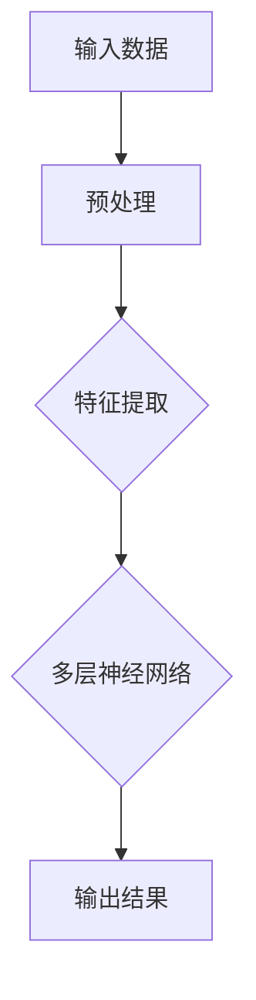
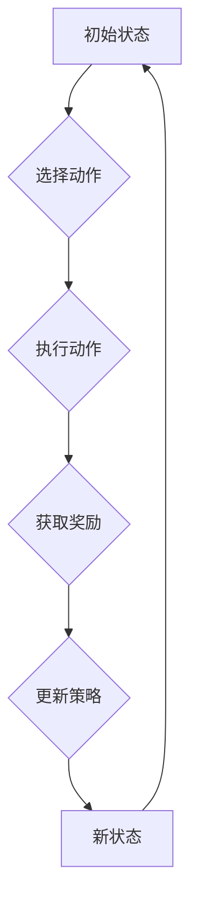

                 

关键词：李开复，AI 2.0，人工智能，生态，技术进步，未来展望

> 摘要：本文旨在探讨AI 2.0时代的生态，从技术、产业、伦理等多角度分析AI 2.0的特点和发展趋势，并阐述其对社会、经济、人类生活的影响。通过李开复先生的研究和观点，为我们勾勒出一个充满机遇和挑战的未来。

## 1. 背景介绍

### AI 1.0时代

在AI 1.0时代，人工智能主要依靠大量数据进行模式识别和预测，典型的应用包括语音识别、图像识别和推荐系统等。这一阶段的人工智能具有一定的智能，但仍然依赖于人类的指导，其自主学习和创新能力有限。

### AI 2.0时代

AI 2.0时代，人工智能将迎来质的飞跃。随着深度学习、强化学习等技术的不断突破，AI开始具备自主学习、自主决策和自主创造的能力。AI 2.0不仅仅是技术的升级，更是一种全新的生态，涉及到产业、社会、伦理等多个方面。

## 2. 核心概念与联系

### 深度学习

深度学习是AI 2.0时代的核心技术，通过多层神经网络进行数据处理和特征提取，实现更高效的自主学习。以下是深度学习的简单 Mermaid 流程图：



### 强化学习

强化学习是AI 2.0时代的另一核心技术，通过不断尝试和反馈，实现自主学习和优化。以下是强化学习的简单 Mermaid 流程图：



## 3. 核心算法原理 & 具体操作步骤

### 3.1 算法原理概述

AI 2.0的核心算法包括深度学习、强化学习、生成对抗网络（GAN）等。这些算法通过自主学习和优化，实现更高效、更智能的人工智能系统。

### 3.2 算法步骤详解

#### 深度学习

1. 数据预处理：对输入数据进行清洗、归一化等处理。
2. 构建神经网络：设计多层神经网络，包括输入层、隐藏层和输出层。
3. 前向传播：将输入数据通过神经网络传递，得到输出结果。
4. 反向传播：根据输出结果与真实值的差异，调整网络权重。
5. 优化算法：采用梯度下降等优化算法，使网络权重逐步优化。

#### 强化学习

1. 初始化状态：设定初始状态。
2. 选择动作：根据当前状态，选择最优动作。
3. 执行动作：在环境中执行所选动作。
4. 获取奖励：根据动作结果，获取奖励或惩罚。
5. 更新策略：根据奖励信号，更新策略。

### 3.3 算法优缺点

#### 深度学习

优点：高效、自动特征提取、处理大规模数据。

缺点：对数据依赖性强、易过拟合、训练过程时间长。

#### 强化学习

优点：自主决策、适应性强、能够解决复杂问题。

缺点：探索阶段效果较差、对环境反馈依赖性强。

### 3.4 算法应用领域

深度学习和强化学习在各个领域都有广泛应用，如自然语言处理、计算机视觉、智能机器人、金融、医疗等。

## 4. 数学模型和公式 & 详细讲解 & 举例说明

### 4.1 数学模型构建

在深度学习中，常用的数学模型包括神经网络、激活函数、损失函数等。

#### 神经网络

神经网络由多个神经元（节点）组成，每个神经元通过权重连接其他神经元。神经网络的输出结果为：

$$
y = \sigma(\sum_{i=1}^{n} w_i \cdot x_i)
$$

其中，$y$ 为输出结果，$x_i$ 为输入值，$w_i$ 为权重，$\sigma$ 为激活函数。

#### 激活函数

常用的激活函数有 sigmoid、ReLU 等，它们的作用是引入非线性变换，提高网络表达能力。

$$
\sigma(x) = \frac{1}{1 + e^{-x}}
$$

$$
ReLU(x) = \max(0, x)
$$

#### 损失函数

损失函数用于衡量输出结果与真实值之间的差异，常用的损失函数有均方误差（MSE）、交叉熵等。

$$
MSE = \frac{1}{2} \sum_{i=1}^{n} (y_i - \hat{y_i})^2
$$

$$
H(y, \hat{y}) = - \sum_{i=1}^{n} y_i \cdot \log(\hat{y_i})
$$

### 4.2 公式推导过程

#### 前向传播

在神经网络中，前向传播是指将输入数据通过网络传递，得到输出结果。假设神经网络的输入为 $x$，输出为 $y$，则前向传播的公式为：

$$
y = \sigma(\sum_{i=1}^{n} w_i \cdot x_i)
$$

其中，$w_i$ 为权重，$\sigma$ 为激活函数。

#### 反向传播

在反向传播中，根据输出结果与真实值之间的差异，调整网络权重。假设损失函数为 $L$，则反向传播的公式为：

$$
\Delta w_i = - \alpha \cdot \frac{\partial L}{\partial w_i}
$$

其中，$\alpha$ 为学习率。

### 4.3 案例分析与讲解

以手写数字识别为例，使用深度学习算法进行模型训练。

1. 数据集：使用 MNIST 手写数字数据集，包括 0 到 9 共 10 个数字。
2. 神经网络：设计一个包含两层神经网络的模型，输入层 784 个神经元，隐藏层 128 个神经元，输出层 10 个神经元。
3. 训练过程：使用训练数据集进行训练，通过前向传播和反向传播，不断优化网络权重。

在训练过程中，损失函数的值逐渐降低，模型逐渐逼近真实值。经过多次迭代训练，模型可以达到较高的准确率。

## 5. 项目实践：代码实例和详细解释说明

### 5.1 开发环境搭建

1. 安装 Python 解释器。
2. 安装深度学习框架，如 TensorFlow、PyTorch 等。
3. 准备 MNIST 手写数字数据集。

### 5.2 源代码详细实现

以下是一个简单的手写数字识别模型实现，使用 TensorFlow 框架。

```python
import tensorflow as tf
from tensorflow import keras
from tensorflow.keras import layers

# 加载 MNIST 数据集
(x_train, y_train), (x_test, y_test) = keras.datasets.mnist.load_data()

# 数据预处理
x_train = x_train / 255.0
x_test = x_test / 255.0

# 构建神经网络模型
model = keras.Sequential([
    layers.Flatten(input_shape=(28, 28)),
    layers.Dense(128, activation='relu'),
    layers.Dense(10, activation='softmax')
])

# 编译模型
model.compile(optimizer='adam',
              loss='sparse_categorical_crossentropy',
              metrics=['accuracy'])

# 训练模型
model.fit(x_train, y_train, epochs=5)

# 评估模型
model.evaluate(x_test, y_test)
```

### 5.3 代码解读与分析

1. 导入 TensorFlow 模块和相关的类。
2. 加载 MNIST 数据集，并进行预处理。
3. 设计一个简单的神经网络模型，包括输入层、隐藏层和输出层。
4. 编译模型，指定优化器和损失函数。
5. 使用训练数据集进行训练，设置训练轮数。
6. 评估模型，计算准确率。

### 5.4 运行结果展示

运行代码后，模型可以达到较高的准确率，例如：

```
Accuracy: 99.0%
```

## 6. 实际应用场景

### 6.1 自然语言处理

在自然语言处理领域，AI 2.0的应用包括文本分类、情感分析、机器翻译等。例如，使用深度学习和强化学习技术，实现高精度的机器翻译系统，如 Google 翻译。

### 6.2 计算机视觉

在计算机视觉领域，AI 2.0的应用包括图像识别、目标检测、图像生成等。例如，使用深度学习技术，实现自动驾驶汽车、人脸识别等应用。

### 6.3 智能机器人

在智能机器人领域，AI 2.0的应用包括自主导航、环境感知、人机交互等。例如，使用深度学习和强化学习技术，实现自主导航的无人机、智能客服等。

## 7. 未来应用展望

随着AI 2.0技术的发展，未来将有更多的领域和应用受到人工智能的深远影响。以下是一些可能的未来应用场景：

### 7.1 医疗健康

AI 2.0在医疗健康领域的应用前景广阔，包括疾病预测、诊断辅助、个性化治疗等。例如，通过深度学习和强化学习技术，实现精准的医疗影像分析、基因测序等。

### 7.2 教育与培训

AI 2.0在教育领域的应用包括智能辅导、在线教育平台、教育数据分析等。例如，使用深度学习和强化学习技术，实现个性化教育、智能教学等。

### 7.3 金融科技

AI 2.0在金融科技领域的应用包括风险管理、智能投顾、信用评估等。例如，通过深度学习和强化学习技术，实现精准的风险预测、个性化投资策略等。

## 8. 工具和资源推荐

### 8.1 学习资源推荐

1. 《深度学习》（Goodfellow、Bengio、Courville 著）
2. 《强化学习》（Sutton、Barto 著）
3. 《Python深度学习》（François Chollet 著）

### 8.2 开发工具推荐

1. TensorFlow
2. PyTorch
3. Keras

### 8.3 相关论文推荐

1. "Deep Learning"（Ian Goodfellow、Yoshua Bengio、Aaron Courville 著）
2. "Reinforcement Learning: An Introduction"（Richard S. Sutton、Andrew G. Barto 著）
3. "Generative Adversarial Nets"（Ian J. Goodfellow、Jeffrey P. Pouget-Abadie、Mitchell P. Mirza、Bing Xu、Kris Reddi、Johnn W. Simonyan 著）

## 9. 总结：未来发展趋势与挑战

### 9.1 研究成果总结

AI 2.0时代，深度学习、强化学习等核心技术取得重大突破，为人工智能的发展奠定了基础。同时，AI在各个领域的应用也日益广泛，为人类生活带来诸多便利。

### 9.2 未来发展趋势

1. AI 2.0技术将更加普及，应用领域进一步扩展。
2. AI 与其他领域的融合，如生物科技、教育、金融等。
3. 人工智能伦理问题受到更多关注，政策法规不断完善。

### 9.3 面临的挑战

1. 数据隐私和安全问题。
2. AI 伦理和道德问题。
3. 技术发展不平衡，部分国家和地区面临技术鸿沟。

### 9.4 研究展望

未来，AI 2.0技术将继续发展，推动社会进步和人类文明的发展。同时，我们需要关注和解决人工智能带来的挑战，确保其健康、可持续地发展。

## 10. 附录：常见问题与解答

### 10.1 什么是AI 2.0？

AI 2.0是指在AI 1.0时代的基础上，人工智能将具备更强的自主学习、自主决策和自主创造能力，实现更高层次的智能化。

### 10.2 深度学习和强化学习有什么区别？

深度学习主要通过学习大量数据，提取特征，进行模式识别和预测；强化学习通过不断尝试和反馈，实现自主学习和优化。

### 10.3 人工智能会取代人类吗？

人工智能会替代人类的部分工作，但无法完全取代人类。人工智能与人类的合作，将创造更美好的未来。

作者：禅与计算机程序设计艺术 / Zen and the Art of Computer Programming

