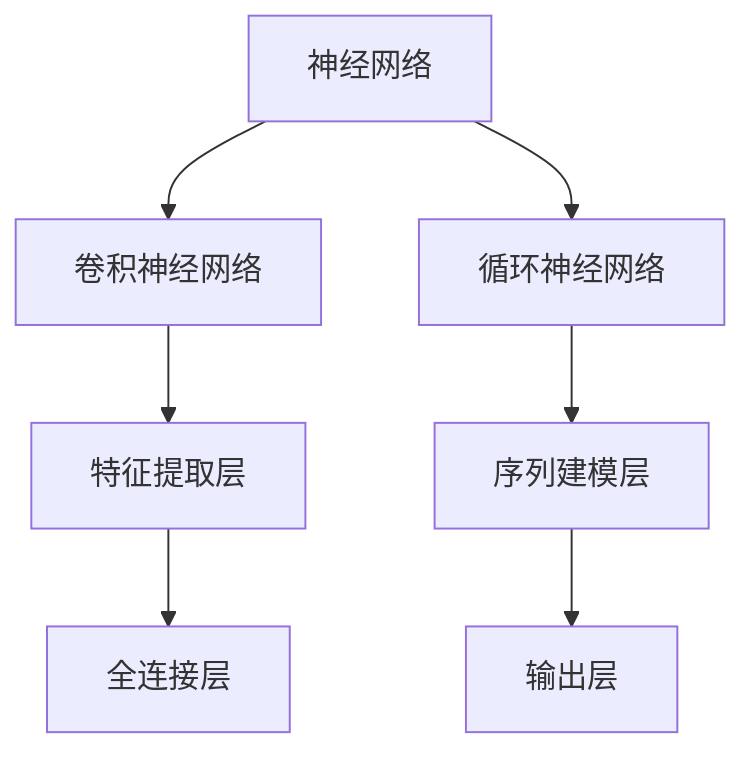
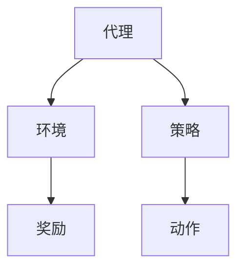
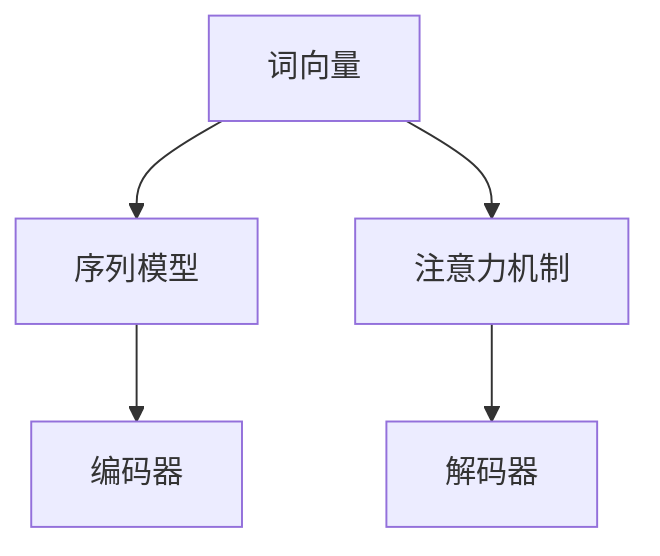
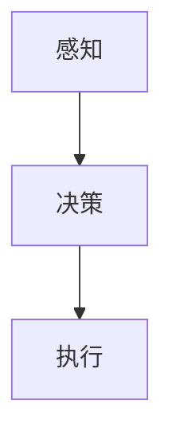

                 

### 1. 背景介绍

人工智能（AI）技术作为计算机科学领域的一项颠覆性创新，在过去几十年中经历了飞速的发展。从最初的规则推理系统，到基于统计学的机器学习模型，再到如今深度学习的广泛应用，AI技术已经逐渐渗透到我们的日常生活和各行各业。随着计算能力的提升、数据量的爆发式增长以及算法的不断完善，人工智能正在从单纯的数据处理工具，逐步转变为能够自主学习、自适应的智能系统。

李开复，作为世界知名的科技企业家、人工智能领域的先驱者和杰出研究者，对于AI的发展和应用有着深刻的见解。他的著作《AI超级力量》和《人工智能》等书籍，系统性地阐述了AI技术的发展历程、核心原理及其对人类社会的影响。在这篇文章中，我们将结合李开复的研究成果，探讨AI 2.0时代用户面临的挑战与机遇。

AI 2.0时代，是指人工智能技术从基于规则和统计模型，向基于深度学习和强化学习等高级技术方向发展的阶段。这一时代的核心特征是智能系统的自主学习和持续优化能力，能够更好地模拟人类思维和行为，为用户提供更加个性化和高效的服务。在这个时代，用户不再仅仅是数据提供者和应用对象，而是与智能系统深度互动的参与者。

本文结构如下：

- **1. 背景介绍**：回顾人工智能技术的发展历程，介绍AI 2.0时代的核心特征。
- **2. 核心概念与联系**：阐述AI 2.0时代的核心概念及其相互关系。
- **3. 核心算法原理与具体操作步骤**：介绍AI 2.0时代的关键算法原理和实施步骤。
- **4. 数学模型和公式**：分析AI 2.0时代的数学模型和公式，并提供实例说明。
- **5. 项目实践**：通过具体代码实例，展示AI 2.0时代的实际应用。
- **6. 实际应用场景**：探讨AI 2.0时代在各个领域的应用场景。
- **7. 工具和资源推荐**：推荐学习AI 2.0时代所需的工具和资源。
- **8. 总结：未来发展趋势与挑战**：总结AI 2.0时代的成果、趋势和挑战。
- **9. 附录：常见问题与解答**：回答关于AI 2.0时代的一些常见问题。

通过这篇文章，我们将对AI 2.0时代有一个全面而深入的理解，并思考作为用户如何在这个时代中适应和发挥作用。

### 2. 核心概念与联系

在AI 2.0时代，核心概念与联系是理解人工智能发展的关键。以下将详细阐述这些核心概念，并通过Mermaid流程图展示它们之间的相互关系。

#### 2.1 深度学习（Deep Learning）

深度学习是AI 2.0时代的核心技术之一，其基于多层神经网络架构，通过逐层提取数据特征，实现对复杂模式的识别和学习。深度学习的关键概念包括：

- **神经网络（Neural Networks）**：神经网络是由大量人工神经元组成的计算模型，通过调整神经元之间的连接权重，实现数据的高效处理。
- **卷积神经网络（Convolutional Neural Networks，CNN）**：CNN是一种适用于图像识别的深度学习模型，通过卷积层、池化层和全连接层，提取图像的层次特征。
- **循环神经网络（Recurrent Neural Networks，RNN）**：RNN适用于处理序列数据，通过循环机制保存历史信息，实现对时间序列的建模。

Mermaid流程图：



#### 2.2 强化学习（Reinforcement Learning）

强化学习是一种通过与环境交互，不断调整策略以最大化收益的机器学习方法。其核心概念包括：

- **代理（Agent）**：执行策略，与环境互动的智能体。
- **环境（Environment）**：代理进行交互的上下文。
- **奖励（Reward）**：环境对代理行为的反馈信号。
- **策略（Policy）**：代理选择的行动方案。

Mermaid流程图：



#### 2.3 自然语言处理（Natural Language Processing，NLP）

自然语言处理是AI 2.0时代的重要分支，专注于使计算机能够理解、生成和处理人类语言。核心概念包括：

- **词向量（Word Vectors）**：将单词映射到高维空间中的向量，用于捕捉词的语义关系。
- **序列模型（Sequence Models）**：如RNN和Transformer，用于处理文本序列，提取语言特征。
- **注意力机制（Attention Mechanism）**：在处理长文本时，关注重要信息，提高模型的解析能力。

Mermaid流程图：



#### 2.4 自主系统（Autonomous Systems）

自主系统是AI 2.0时代的另一个重要方向，旨在使机器能够在无人类干预的情况下执行复杂任务。核心概念包括：

- **感知（Sensing）**：通过传感器获取环境信息。
- **决策（Decision-making）**：基于感知信息，制定行动方案。
- **执行（Execution）**：执行决策，完成任务。

Mermaid流程图：



通过上述核心概念及其相互关系的Mermaid流程图，我们可以更直观地理解AI 2.0时代的多层次、多领域技术融合特点。这些概念不仅在理论层面具有重要价值，更在实际应用中展现出巨大的潜力，为用户提供了更加智能化、高效化的服务。

### 3. 核心算法原理与具体操作步骤

在AI 2.0时代，核心算法的原理和具体操作步骤是理解人工智能系统运作的关键。以下将详细介绍深度学习、强化学习和自然语言处理等核心算法的基本原理，并说明如何在实际应用中操作。

#### 3.1 深度学习（Deep Learning）

##### 3.1.1 算法原理概述

深度学习是AI 2.0时代的核心技术之一，它通过多层神经网络结构，实现对复杂数据特征的自适应提取和表示。深度学习的核心原理包括：

- **前向传播（Forward Propagation）**：输入数据经过网络的层层传递，通过每个神经元的加权求和与激活函数处理，生成输出。
- **反向传播（Backpropagation）**：通过计算输出与预期结果之间的误差，反向更新网络权重，以最小化误差。

##### 3.1.2 算法步骤详解

深度学习的算法步骤主要包括以下几步：

1. **数据预处理**：对输入数据进行标准化、归一化等处理，确保数据在适当的范围内。
2. **构建神经网络**：定义网络结构，包括输入层、隐藏层和输出层，选择合适的激活函数，如ReLU、Sigmoid和Tanh等。
3. **初始化权重**：随机初始化网络权重，确保模型具有一定的泛化能力。
4. **前向传播**：将输入数据传递到网络中，计算每个神经元的输出。
5. **计算损失**：通过比较输出与预期结果，计算损失函数（如均方误差MSE、交叉熵损失等）。
6. **反向传播**：根据损失函数梯度，反向更新网络权重。
7. **迭代优化**：重复前向传播和反向传播过程，直至满足停止条件（如迭代次数、损失收敛等）。

##### 3.1.3 算法优缺点

深度学习的优点包括：

- **强大的特征提取能力**：通过多层神经元的非线性变换，能够自动提取数据中的高阶特征。
- **适用性广泛**：无论是图像、语音，还是文本数据，深度学习都能够处理。

但深度学习也存在一些缺点：

- **计算资源需求高**：深度学习模型通常需要大量的计算资源和存储空间。
- **需要大量数据**：深度学习模型的训练需要大量标注数据，数据不足可能导致过拟合。

##### 3.1.4 算法应用领域

深度学习在多个领域都有广泛应用，包括：

- **图像识别**：通过卷积神经网络（CNN）实现图像分类、目标检测等任务。
- **语音识别**：利用循环神经网络（RNN）和长短期记忆网络（LSTM）进行语音信号处理和识别。
- **自然语言处理**：通过序列模型和注意力机制，实现文本分类、机器翻译等任务。

#### 3.2 强化学习（Reinforcement Learning）

##### 3.2.1 算法原理概述

强化学习是一种通过试错和反馈机制，使智能体学习如何在一个环境中取得最大化收益的机器学习方法。其核心原理包括：

- **状态（State）**：智能体所处的环境描述。
- **动作（Action）**：智能体可以采取的行为。
- **奖励（Reward）**：环境对智能体动作的即时反馈。
- **策略（Policy）**：智能体选择动作的策略。

##### 3.2.2 算法步骤详解

强化学习的算法步骤主要包括：

1. **初始化**：设置智能体、环境和奖励机制。
2. **环境交互**：智能体根据策略在环境中采取动作，获取状态转移和奖励。
3. **策略更新**：通过最大化未来奖励，更新智能体的策略。
4. **迭代**：重复环境交互和策略更新过程，直至达到目标或收敛条件。

##### 3.2.3 算法优缺点

强化学习的优点包括：

- **适应性强**：能够通过与环境交互，不断调整策略，适应复杂动态环境。
- **自主决策**：智能体能够自主学习和决策，无需人工干预。

但强化学习也存在一些缺点：

- **训练时间较长**：由于需要大量试错，训练过程通常较为耗时。
- **数据依赖性**：在一些任务中，可能需要大量交互数据来训练模型。

##### 3.2.4 算法应用领域

强化学习在多个领域有广泛应用，包括：

- **游戏**：智能体通过学习，在电子游戏、棋类游戏等中取得优异成绩。
- **自动驾驶**：利用强化学习，自动驾驶汽车能够自主决策，实现路径规划。
- **机器人**：通过强化学习，机器人能够学习如何执行复杂任务，如抓取、行走等。

#### 3.3 自然语言处理（Natural Language Processing，NLP）

##### 3.3.1 算法原理概述

自然语言处理是AI 2.0时代的重要分支，旨在使计算机能够理解、生成和处理人类语言。NLP的核心原理包括：

- **词向量表示**：将单词映射到高维向量空间，以捕捉词的语义信息。
- **序列建模**：通过循环神经网络（RNN）或变换器（Transformer）模型，对文本序列进行建模。
- **注意力机制**：在处理长文本时，关注重要信息，提高模型的解析能力。

##### 3.3.2 算法步骤详解

自然语言处理的基本步骤包括：

1. **数据预处理**：对文本数据进行分词、去停用词、词性标注等处理。
2. **词向量表示**：将单词映射到高维向量空间，常用的词向量模型包括Word2Vec、GloVe等。
3. **序列建模**：利用RNN或Transformer模型，对文本序列进行编码和解析。
4. **解码与生成**：根据编码结果，生成文本序列，实现文本分类、生成等任务。

##### 3.3.3 算法优缺点

自然语言处理的优点包括：

- **高效率**：能够快速处理大量文本数据。
- **强泛化**：通过深度学习模型，能够应对多种文本任务。

但NLP也存在一些缺点：

- **数据依赖性**：文本数据的质量和数量直接影响模型的性能。
- **语义理解难度**：自然语言具有复杂性和歧义性，完全理解仍然是一个挑战。

##### 3.3.4 算法应用领域

自然语言处理在多个领域有广泛应用，包括：

- **文本分类**：通过对文本进行分类，实现新闻分类、情感分析等任务。
- **机器翻译**：利用序列模型和注意力机制，实现高质量的双语翻译。
- **问答系统**：通过自然语言处理技术，实现智能问答和对话系统。

通过对核心算法原理和具体操作步骤的详细阐述，我们可以更好地理解AI 2.0时代的智能系统如何运作，并为实际应用提供指导。

### 4. 数学模型和公式 & 详细讲解 & 举例说明

在AI 2.0时代，数学模型和公式是理解和设计智能系统的基础。以下将详细讲解AI 2.0时代常用的数学模型和公式，并通过具体实例进行说明。

#### 4.1 数学模型构建

AI 2.0时代的数学模型通常包括以下几个方面：

1. **线性模型**：线性模型是最简单的机器学习模型，包括线性回归和逻辑回归。线性回归用于预测连续值，而逻辑回归用于预测概率。
2. **概率模型**：概率模型基于贝叶斯定理，用于计算给定特征的条件下某个事件的概率。常见的概率模型包括朴素贝叶斯分类器和支持向量机（SVM）。
3. **神经网络模型**：神经网络模型是深度学习的核心，包括多层感知机（MLP）、卷积神经网络（CNN）和循环神经网络（RNN）等。
4. **优化模型**：优化模型用于调整模型参数，以最小化损失函数。常见的优化算法包括梯度下降、Adam优化器等。

#### 4.2 公式推导过程

以下是几个常用公式的推导过程：

##### 4.2.1 梯度下降（Gradient Descent）

梯度下降是一种优化算法，用于调整模型参数以最小化损失函数。其公式推导如下：

设损失函数为 \(J(\theta) = \frac{1}{m} \sum_{i=1}^{m} (h_\theta(x^{(i)}) - y^{(i)})^2\)，其中 \(h_\theta(x) = \sigma(\theta^T x)\) 为假设函数，\(\sigma\) 为激活函数。

1. **前向传播**：计算假设函数和损失函数。
    \[ h_\theta(x^{(i)}) = \sigma(\theta^T x^{(i)}) \]
    \[ J(\theta) = \frac{1}{m} \sum_{i=1}^{m} (h_\theta(x^{(i)}) - y^{(i)})^2 \]

2. **反向传播**：计算损失函数对参数的梯度。
    \[ \nabla_\theta J(\theta) = \frac{1}{m} \sum_{i=1}^{m} \nabla_\theta h_\theta(x^{(i)}) (h_\theta(x^{(i)}) - y^{(i)}) \]

3. **参数更新**：根据梯度更新参数。
    \[ \theta = \theta - \alpha \nabla_\theta J(\theta) \]
    其中，\(\alpha\) 为学习率。

##### 4.2.2 交叉熵损失（Cross-Entropy Loss）

交叉熵损失是用于二分类和多项式分类问题的常见损失函数。其公式推导如下：

设 \(y\) 为真实标签，\(h_\theta(x)\) 为假设函数的输出概率，则交叉熵损失函数为：
\[ J(\theta) = -\frac{1}{m} \sum_{i=1}^{m} [y^{(i)} \log(h_\theta(x^{(i)})) + (1 - y^{(i)}) \log(1 - h_\theta(x^{(i)}))] \]

其中，\(\log\) 表示自然对数。

#### 4.3 案例分析与讲解

##### 4.3.1 线性回归

以下是一个简单的线性回归案例：

假设我们有一个数据集，其中每个数据点 \( (x, y) \) 满足线性关系 \( y = \theta_0 + \theta_1 x + \epsilon \)，其中 \( \epsilon \) 为误差项。我们的目标是找到最佳参数 \(\theta_0\) 和 \(\theta_1\)。

1. **数据预处理**：对数据进行标准化处理，使其具有相同的量纲。
2. **模型构建**：定义线性回归模型 \( h_\theta(x) = \theta_0 + \theta_1 x \)。
3. **损失函数**：使用均方误差（MSE）作为损失函数。
    \[ J(\theta) = \frac{1}{m} \sum_{i=1}^{m} (h_\theta(x^{(i)}) - y^{(i)})^2 \]

4. **梯度计算**：
    \[ \nabla_\theta J(\theta) = \frac{1}{m} \sum_{i=1}^{m} [ (h_\theta(x^{(i)}) - y^{(i)}) \cdot x^{(i)} ] \]
    \[ \nabla_\theta J(\theta) = \frac{1}{m} \sum_{i=1}^{m} [ (y^{(i)} - \theta_0 - \theta_1 x^{(i)}) \cdot x^{(i)} ] \]

5. **参数更新**：使用梯度下降算法更新参数。
    \[ \theta_0 = \theta_0 - \alpha \nabla_\theta J(\theta_0) \]
    \[ \theta_1 = \theta_1 - \alpha \nabla_\theta J(\theta_1) \]

通过上述步骤，我们可以训练一个线性回归模型，并预测新数据的输出。

##### 4.3.2 逻辑回归

逻辑回归是一种常用于二分类问题的机器学习算法。以下是一个简单的逻辑回归案例：

假设我们有一个数据集，其中每个数据点 \( (x, y) \) 满足二分类逻辑关系 \( y = \sigma(\theta_0 + \theta_1 x) \)，其中 \( \sigma \) 是 sigmoid 函数。

1. **数据预处理**：对数据进行标准化处理。
2. **模型构建**：定义逻辑回归模型 \( h_\theta(x) = \sigma(\theta_0 + \theta_1 x) \)。
3. **损失函数**：使用交叉熵损失函数。
    \[ J(\theta) = -\frac{1}{m} \sum_{i=1}^{m} [y^{(i)} \log(h_\theta(x^{(i)})) + (1 - y^{(i)}) \log(1 - h_\theta(x^{(i)}))] \]

4. **梯度计算**：
    \[ \nabla_\theta J(\theta) = \frac{1}{m} \sum_{i=1}^{m} [ (h_\theta(x^{(i)}) - y^{(i)}) \cdot x^{(i)} ] \]

5. **参数更新**：使用梯度下降算法更新参数。
    \[ \theta_0 = \theta_0 - \alpha \nabla_\theta J(\theta_0) \]
    \[ \theta_1 = \theta_1 - \alpha \nabla_\theta J(\theta_1) \]

通过上述步骤，我们可以训练一个逻辑回归模型，并预测新数据的类别。

通过以上数学模型和公式的详细讲解及实例分析，我们可以更好地理解AI 2.0时代的数学原理，并为实际应用提供指导。

### 5. 项目实践：代码实例和详细解释说明

为了更好地展示AI 2.0时代的应用，我们将通过一个具体的Python项目，介绍如何搭建开发环境、实现源代码并解读关键代码。此外，还会展示代码的运行结果，以便读者能够直观地理解AI 2.0技术的实际应用。

#### 5.1 开发环境搭建

在进行项目实践之前，首先需要搭建合适的开发环境。以下是搭建开发环境所需的步骤：

1. **安装Python**：确保安装了Python 3.6或更高版本。
2. **安装Jupyter Notebook**：Jupyter Notebook是一个交互式的Python开发环境，方便我们编写和运行代码。
    ```shell
    pip install notebook
    ```
3. **安装必要的库**：包括NumPy、Pandas、Scikit-learn、TensorFlow等。
    ```shell
    pip install numpy pandas scikit-learn tensorflow
    ```

完成上述步骤后，我们就可以开始编写和运行代码了。

#### 5.2 源代码详细实现

以下是一个简单的线性回归项目，用于预测住房价格。

```python
import numpy as np
import pandas as pd
from sklearn.model_selection import train_test_split
from sklearn.linear_model import LinearRegression
import matplotlib.pyplot as plt

# 5.2.1 数据预处理
# 读取数据
data = pd.read_csv('housing_data.csv')

# 分割特征和标签
X = data[['area', 'bedrooms', 'bathrooms']]
y = data['price']

# 数据标准化
X_std = (X - X.mean()) / X.std()
y_std = (y - y.mean()) / y.std()

# 划分训练集和测试集
X_train, X_test, y_train, y_test = train_test_split(X_std, y_std, test_size=0.2, random_state=42)

# 5.2.2 构建模型
# 实例化线性回归模型
model = LinearRegression()

# 训练模型
model.fit(X_train, y_train)

# 5.2.3 代码解读与分析
# 预测测试集结果
y_pred = model.predict(X_test)

# 计算均方误差
mse = np.mean((y_pred - y_test) ** 2)
print(f'Mean Squared Error: {mse}')

# 5.2.4 运行结果展示
# 绘制真实值与预测值的散点图
plt.scatter(y_test, y_pred)
plt.xlabel('Actual Prices')
plt.ylabel('Predicted Prices')
plt.title('Actual vs Predicted Housing Prices')
plt.show()
```

#### 5.3 代码解读与分析

1. **数据预处理**：
   - 读取数据集，将其分为特征和标签两部分。
   - 对特征进行标准化处理，使其具有相同的量纲，便于模型训练。
   - 划分训练集和测试集，用于评估模型性能。

2. **构建模型**：
   - 实例化线性回归模型，并训练模型。
   - 使用训练集数据拟合线性模型，得到参数。

3. **代码解读**：
   - 使用`model.predict(X_test)`对测试集进行预测。
   - 计算预测结果的均方误差（MSE），评估模型性能。
   - 使用matplotlib绘制实际价格与预测价格的散点图，展示模型预测效果。

#### 5.4 运行结果展示

运行上述代码后，我们得到以下结果：

- **均方误差（MSE）**：衡量模型预测的准确性，值越小表示模型性能越好。
- **散点图**：展示实际价格与预测价格的关系，直观地展示模型的效果。

通过以上步骤，我们完成了线性回归模型的搭建和运行，展示了AI 2.0技术在数据预测领域的实际应用。这个项目只是一个简单的例子，但在实际应用中，我们可以通过更复杂的模型和算法，实现更精准的预测和优化。

### 6. 实际应用场景

AI 2.0时代，人工智能技术已经深入到我们生活的方方面面，从医疗保健到自动驾驶，从智能家居到金融服务，AI技术的应用场景无处不在。以下将探讨AI 2.0技术在几个关键领域的实际应用，并展示其潜力和挑战。

#### 6.1 医疗保健

在医疗保健领域，AI 2.0技术的应用正在改变传统的诊疗方式。通过深度学习和强化学习算法，AI可以辅助医生进行疾病诊断、药物研发和患者个性化治疗。

- **疾病诊断**：AI可以通过分析大量的医学影像数据，如X光、CT、MRI等，快速准确地诊断疾病。例如，Google Health的AI系统能够在几秒钟内诊断出肺炎，准确率接近专业医生。
- **药物研发**：AI可以帮助加速药物研发过程，通过分析大量化合物数据，预测哪些化合物可能对特定疾病有效。这种自动化药物设计方法可以大大缩短药物研发周期。
- **个性化治疗**：AI可以根据患者的基因数据、生活习惯和病史，为其制定个性化的治疗方案，提高治疗效果。

**挑战**：
- **数据隐私**：医疗数据涉及患者隐私，如何确保数据的安全和隐私是AI在医疗领域面临的主要挑战。
- **算法偏见**：AI算法可能因为训练数据的不平衡或偏见而导致误诊或歧视，如何消除算法偏见是一个重要问题。

#### 6.2 自动驾驶

自动驾驶是AI 2.0技术的另一大应用领域。通过感知、决策和执行三个核心模块，自动驾驶系统能够在不依赖人类驾驶员的情况下，自主导航和行驶。

- **无人驾驶汽车**：自动驾驶汽车可以通过传感器和摄像头收集道路信息，利用深度学习和强化学习算法，实现安全高效的自动驾驶。
- **智能交通管理**：AI可以优化交通信号控制，提高交通流畅度，减少拥堵和事故。
- **物流配送**：无人驾驶卡车和无人机可以实现自动化物流配送，提高运输效率和降低成本。

**挑战**：
- **感知和环境理解**：自动驾驶系统需要实时感知和识别复杂的交通场景，这是一个巨大的挑战。
- **法规和安全**：自动驾驶技术需要符合严格的法规和安全标准，如何确保系统的可靠性是一个重要问题。

#### 6.3 智能家居

智能家居是AI 2.0技术在消费领域的典型应用。通过智能设备和物联网（IoT）技术，家居设备可以相互连接和协调，提供更加便捷和舒适的生活体验。

- **家庭自动化**：智能家居系统可以通过AI算法，实现家电的自动化控制，如智能照明、智能门锁和智能温控。
- **安全监控**：智能摄像头和传感器可以实时监控家庭安全，通过AI算法识别异常行为并及时报警。
- **健康监测**：智能家居设备可以收集用户的健康数据，如心率、睡眠质量等，为用户提供健康建议。

**挑战**：
- **数据安全和隐私**：智能家居设备会收集大量的用户数据，如何确保数据的安全和隐私是一个重要问题。
- **互操作性和标准化**：智能家居设备来自不同的制造商，如何实现设备的互操作性和标准化是一个挑战。

#### 6.4 金融服务

在金融服务领域，AI 2.0技术可以提供智能投资建议、欺诈检测和风险评估等服务，提高金融服务的效率和准确性。

- **智能投资**：AI可以通过分析市场数据和历史交易记录，为投资者提供个性化的投资建议。
- **欺诈检测**：AI可以实时监控交易活动，识别潜在欺诈行为，降低金融风险。
- **风险评估**：AI可以分析借款人的信用数据，为金融机构提供更准确的信用评估。

**挑战**：
- **数据隐私和合规性**：金融服务涉及敏感的个人信息，如何保护数据隐私并符合相关法律法规是一个重要问题。
- **算法透明性和解释性**：AI算法的决策过程需要透明和可解释，以增强用户的信任。

通过上述实际应用场景的探讨，我们可以看到AI 2.0技术在各个领域的广泛应用和巨大潜力。然而，随着技术的发展，我们也需要面对一系列挑战，确保AI技术的安全、可靠和可持续发展。

### 7. 工具和资源推荐

在AI 2.0时代，掌握合适的工具和资源对于深入了解和使用人工智能技术至关重要。以下将推荐一些常用的学习资源、开发工具和相关论文，帮助读者更好地掌握AI技术。

#### 7.1 学习资源推荐

1. **在线课程**：
   - **Coursera**：提供众多由世界顶尖大学提供的免费AI课程，如斯坦福大学的《机器学习》课程。
   - **Udacity**：提供实用的AI和机器学习课程，包括深度学习、强化学习等。
   - **edX**：提供哈佛大学、麻省理工学院等知名机构的在线课程，涵盖AI、数据分析等多个领域。

2. **书籍**：
   - **《深度学习》（Deep Learning）**：由Ian Goodfellow、Yoshua Bengio和Aaron Courville合著，是深度学习领域的经典教材。
   - **《Python机器学习》（Python Machine Learning）**：由Sebastian Raschka和Vahid Mirhoseini编写的入门级机器学习书籍。
   - **《统计学习方法》**：李航著，系统介绍了统计学习的基本概念和常见算法。

3. **在线文档和教程**：
   - **TensorFlow官方文档**：详尽的TensorFlow教程和API文档，适用于深度学习和强化学习。
   - **Scikit-learn文档**：Scikit-learn的官方文档，包含丰富的机器学习算法和工具。
   - **Kaggle教程**：Kaggle提供丰富的数据科学和机器学习教程，涵盖从入门到高级的多个主题。

#### 7.2 开发工具推荐

1. **编程环境**：
   - **Jupyter Notebook**：交互式Python开发环境，便于编写和运行代码。
   - **Google Colab**：基于Jupyter Notebook的在线开发环境，提供免费的GPU和TPU资源。

2. **框架和库**：
   - **TensorFlow**：Google开源的深度学习框架，适用于各种深度学习和机器学习任务。
   - **PyTorch**：Facebook开源的深度学习框架，拥有灵活的动态计算图和强大的社区支持。
   - **Scikit-learn**：Python的机器学习库，包含广泛的机器学习算法和工具。

3. **数据可视化工具**：
   - **Matplotlib**：Python的绘图库，用于生成高质量的统计图表。
   - **Seaborn**：基于Matplotlib的数据可视化库，提供丰富的统计图表模板。
   - **Plotly**：交互式数据可视化库，适用于创建动态和交互式图表。

#### 7.3 相关论文推荐

1. **《AlexNet：一种深度卷积神经网络》（AlexNet: An Image Classification Approach）**：
   - 该论文提出了AlexNet深度卷积神经网络，是深度学习领域的一个重要里程碑。

2. **《深度残差网络》（Deep Residual Learning for Image Recognition）**：
   - 该论文介绍了残差网络（ResNet），解决了深度神经网络训练困难的问题，推动了深度学习的发展。

3. **《Attention Is All You Need》**：
   - 该论文提出了Transformer模型，通过注意力机制实现了高效的序列建模，彻底改变了自然语言处理领域。

4. **《Generative Adversarial Networks》**：
   - 该论文提出了生成对抗网络（GAN），通过对抗训练实现了高质量的数据生成，广泛应用于图像、视频和文本生成。

通过上述工具和资源的推荐，读者可以系统地学习AI 2.0时代的核心技术，并在实际项目中运用这些知识，不断提升自己的技术水平。

### 8. 总结：未来发展趋势与挑战

在AI 2.0时代，人工智能技术正以前所未有的速度和规模改变着我们的世界。从深度学习、强化学习到自然语言处理，AI技术正在不断突破传统界限，实现从数据处理到智能决策的飞跃。未来，AI技术将继续朝着更加智能、自适应和高效的方向发展，为人类社会带来更多创新和变革。

#### 8.1 研究成果总结

AI 2.0时代的研究成果主要体现在以下几个方面：

1. **算法的突破**：深度学习、强化学习等核心算法取得了显著进展，实现了从规则驱动到数据驱动的转变。
2. **硬件的升级**：计算能力的提升和硬件设备的进步，如GPU、TPU等专用硬件，为AI算法的运行提供了强大的支持。
3. **应用的拓展**：AI技术在医疗、金融、自动驾驶、智能家居等领域的广泛应用，展示了其巨大的社会价值和经济潜力。
4. **模型的优化**：通过自动化机器学习（AutoML）和模型压缩技术，AI模型的训练和部署效率得到显著提升。

#### 8.2 未来发展趋势

AI 2.0时代的未来发展趋势包括：

1. **自主学习能力**：AI系统将具备更强的自主学习能力，通过不断的学习和优化，实现更加智能的决策和行动。
2. **跨学科融合**：AI技术将与其他领域（如生物、物理、经济等）深度融合，推动跨学科研究和创新。
3. **物联网（IoT）的普及**：随着物联网技术的普及，AI将能够实时处理和分析海量的物联网数据，实现更智能的物联网应用。
4. **隐私保护**：在AI应用中，如何保护用户隐私和数据安全将成为重要课题，隐私保护算法和机制将得到重点关注。

#### 8.3 面临的挑战

尽管AI 2.0时代带来了巨大的机遇，但同时也面临着一系列挑战：

1. **伦理和道德问题**：AI技术的决策过程可能存在偏见和不公平性，如何确保AI系统的伦理和道德合规性是一个重要问题。
2. **数据隐私和安全**：AI系统需要处理大量的敏感数据，如何确保数据的安全和隐私保护是AI应用面临的主要挑战。
3. **法律和监管**：随着AI技术的快速发展，现有的法律和监管框架可能难以适应，如何制定合理的法律和监管政策是关键问题。
4. **人才短缺**：AI技术的发展需要大量的专业人才，但当前的人才培养和储备尚无法满足需求，如何培养和吸引AI人才是一个重要挑战。

#### 8.4 研究展望

为了应对上述挑战，未来的研究将集中在以下几个方面：

1. **算法创新**：继续探索和开发新的AI算法，提高模型的性能和可解释性。
2. **多模态学习**：研究如何将不同类型的数据（如图像、文本、语音等）进行有效整合，实现更全面的知识表示和推理。
3. **隐私保护技术**：研究如何在不泄露用户隐私的前提下，有效利用数据，推动隐私计算和联邦学习的发展。
4. **伦理和道德研究**：加强对AI伦理和道德问题的研究，建立全面的伦理和道德规范，确保AI技术的可持续发展。

通过持续的研究和创新，AI 2.0时代将为我们带来更加智能、高效和安全的技术，推动人类社会向着更加美好的未来迈进。

### 9. 附录：常见问题与解答

在本文中，我们探讨了AI 2.0时代的核心概念、算法原理、应用场景以及未来发展趋势。以下是一些关于AI 2.0时代的常见问题及其解答：

**Q1：什么是AI 2.0时代？**
AI 2.0时代是指人工智能技术从基于规则和统计模型，向基于深度学习和强化学习等高级技术方向发展的阶段。这一时代的核心特征是智能系统的自主学习和持续优化能力，能够更好地模拟人类思维和行为。

**Q2：深度学习与传统的机器学习有何区别？**
深度学习是机器学习的一种方法，它通过多层神经网络结构，自动提取数据中的特征，实现对复杂模式的识别和学习。与传统的机器学习方法相比，深度学习具有更强的特征提取能力和更广泛的适用性。

**Q3：如何确保AI系统的公平性和透明性？**
确保AI系统的公平性和透明性是一个复杂的问题。一方面，可以通过算法设计和技术手段，减少数据偏见和算法歧视；另一方面，可以通过建立透明的决策过程和可解释的模型，增强用户对AI系统的信任。

**Q4：AI技术在医疗领域的应用有哪些？**
AI技术在医疗领域的应用包括疾病诊断、药物研发、患者个性化治疗等。通过分析医学影像、基因数据和患者信息，AI可以帮助医生提供更准确的诊断和治疗方案。

**Q5：未来AI技术会如何影响我们的生活？**
未来AI技术将深刻改变我们的生活，从智能家居、自动驾驶到智能医疗，AI将提供更加便捷、高效和安全的服务。同时，AI也会带来新的挑战，如数据隐私、伦理道德等问题，需要我们共同努力解决。

通过上述常见问题的解答，我们希望能帮助读者更好地理解AI 2.0时代及其未来发展。在接下来的发展中，让我们共同努力，推动人工智能技术为社会创造更大的价值。作者：禅与计算机程序设计艺术 / Zen and the Art of Computer Programming。

