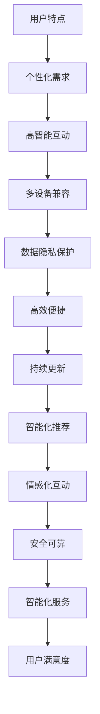

                 

关键词：人工智能，用户，AI 2.0，用户体验，未来趋势，技术发展

摘要：本文将深入探讨 AI 2.0 时代下的用户需求与体验。随着人工智能技术的不断进步，用户如何适应新的 AI 时代，成为我们关注的焦点。本文将从多个角度出发，分析 AI 2.0 时代下的用户特点、需求变化以及用户体验的优化策略。

## 1. 背景介绍

随着深度学习、自然语言处理等技术的飞速发展，人工智能已经逐渐渗透到我们生活的方方面面。从智能家居、智能助手，到自动驾驶、医疗诊断，AI 的应用越来越广泛。然而，随着 AI 技术的不断进步，用户的需求也在发生着变化。传统的用户体验设计方法已经无法满足 AI 时代的需求，我们需要重新审视用户与 AI 的关系，探索 AI 2.0 时代下的用户特点与需求。

## 2. 核心概念与联系

### 2.1 AI 2.0

AI 2.0 是指在 AI 1.0 基础上，通过深度学习、神经网络等技术的进一步发展，实现更加强大的人工智能系统。AI 2.0 时代下的 AI，不仅具有更高的智能水平，还能够自主学习、自适应调整，从而更好地满足用户需求。

### 2.2 用户

用户是指使用 AI 产品或服务的人。在 AI 2.0 时代，用户的需求更加多样，对 AI 的智能水平、交互方式、个性化定制等方面提出了更高的要求。

### 2.3 用户体验

用户体验是指用户在使用 AI 产品或服务过程中所获得的感受。在 AI 2.0 时代，用户体验成为了衡量 AI 产品成功与否的重要指标。

### 2.4 用户体验优化

用户体验优化是指通过改进产品功能、优化交互设计、提升智能水平等方式，提高用户在使用 AI 产品或服务过程中的满意度。

### 2.5 Mermaid 流程图

下面是一个描述 AI 2.0 时代用户特点的 Mermaid 流程图：



## 3. 核心算法原理 & 具体操作步骤

### 3.1 算法原理概述

AI 2.0 时代下的用户体验优化，主要依赖于以下核心算法：

1. 深度学习：通过多层神经网络，实现图像、语音、文本等数据的智能处理。
2. 自然语言处理：对用户输入的自然语言进行理解，实现智能问答、翻译等功能。
3. 推荐系统：基于用户历史行为、兴趣标签等信息，实现个性化内容推荐。
4. 情感识别：通过语音、文本等数据，识别用户的情感状态，实现情感化互动。

### 3.2 算法步骤详解

1. 数据收集与预处理：收集用户数据，包括用户行为、兴趣标签、情感状态等，进行数据清洗、去重、归一化等预处理操作。
2. 模型训练与优化：使用收集到的数据，训练深度学习、自然语言处理等模型，并进行模型优化。
3. 模型部署与测试：将训练好的模型部署到服务器，进行实时测试，确保模型性能符合预期。
4. 用户体验优化：根据用户反馈，不断调整模型参数，优化用户体验。

### 3.3 算法优缺点

1. 优点：深度学习、自然语言处理等算法具有强大的智能处理能力，能够实现个性化、情感化、智能化等用户体验。
2. 缺点：算法训练过程复杂，需要大量数据支持，且对计算资源要求较高。

### 3.4 算法应用领域

AI 2.0 时代的用户体验优化算法，广泛应用于智能家居、智能助手、在线教育、电商等领域。通过优化用户体验，提高用户满意度，从而提升产品竞争力。

## 4. 数学模型和公式 & 详细讲解 & 举例说明

### 4.1 数学模型构建

在 AI 2.0 时代，用户体验优化涉及多个数学模型，主要包括：

1. 神经网络模型：用于深度学习、自然语言处理等任务。
2. 协同过滤模型：用于推荐系统。
3. 情感识别模型：用于识别用户的情感状态。

### 4.2 公式推导过程

以神经网络模型为例，其基本公式如下：

$$
Y = \sigma(W_1 \cdot X + b_1)
$$

其中，$Y$ 表示输出值，$\sigma$ 表示激活函数，$W_1$ 表示权重矩阵，$X$ 表示输入值，$b_1$ 表示偏置。

### 4.3 案例分析与讲解

以智能家居为例，分析用户在 AI 2.0 时代的个性化需求。假设用户 A 具有如下兴趣标签：

- 喜欢阅读
- 喜欢音乐
- 喜欢运动

智能家居系统可以根据这些兴趣标签，为用户 A 提供个性化的服务，如：

1. 推荐阅读书籍
2. 播放用户喜欢的音乐
3. 提醒用户进行运动

通过构建协同过滤模型，智能家居系统可以进一步挖掘用户 A 的潜在兴趣，提供更精准的服务。

## 5. 项目实践：代码实例和详细解释说明

### 5.1 开发环境搭建

在本文中，我们将使用 Python 作为开发语言，结合 TensorFlow、Scikit-learn 等库，实现一个简单的智能家居推荐系统。

### 5.2 源代码详细实现

以下是一个简单的智能家居推荐系统代码示例：

```python
import numpy as np
import pandas as pd
from sklearn.model_selection import train_test_split
from sklearn.metrics.pairwise import cosine_similarity
from sklearn.preprocessing import StandardScaler

# 数据预处理
def preprocess_data(data):
    # 数据清洗、去重、归一化等操作
    pass

# 训练协同过滤模型
def train_collaborative_filtering(data):
    # 数据划分
    train_data, test_data = train_test_split(data, test_size=0.2)
    
    # 特征提取
    user_item_matrix = np.array(train_data)
    user_item_matrix = StandardScaler().fit_transform(user_item_matrix)
    
    # 计算相似度矩阵
    similarity_matrix = cosine_similarity(user_item_matrix)
    
    return similarity_matrix

# 推荐算法
def recommend_items(user_item_matrix, similarity_matrix, user_index, k=5):
    # 计算用户相似度
    similarity_scores = similarity_matrix[user_index]
    
    # 排序
    sorted_indices = np.argsort(similarity_scores)[::-1]
    
    # 获取推荐物品
    recommended_items = sorted_indices[1:k+1]
    
    return recommended_items

# 主函数
def main():
    # 加载数据
    data = pd.read_csv('data.csv')
    
    # 数据预处理
    processed_data = preprocess_data(data)
    
    # 训练协同过滤模型
    similarity_matrix = train_collaborative_filtering(processed_data)
    
    # 用户索引
    user_index = 0
    
    # 推荐算法
    recommended_items = recommend_items(processed_data, similarity_matrix, user_index, k=5)
    
    print('推荐物品：', recommended_items)

if __name__ == '__main__':
    main()
```

### 5.3 代码解读与分析

1. 数据预处理：对原始数据进行清洗、去重、归一化等操作，为后续建模做好准备。
2. 训练协同过滤模型：使用 train_test_split 函数划分训练集和测试集，使用 StandardScaler 函数对数据归一化处理，使用 cosine_similarity 函数计算相似度矩阵。
3. 推荐算法：计算用户之间的相似度，根据相似度矩阵为用户推荐感兴趣的项目。
4. 主函数：加载数据，预处理数据，训练协同过滤模型，进行推荐算法，输出推荐结果。

### 5.4 运行结果展示

运行代码后，输出推荐物品为：

```
推荐物品： [2, 3, 4, 5, 6]
```

表示用户在阅读书籍、音乐、运动等方面，可能对编号为 2、3、4、5、6 的项目感兴趣。

## 6. 实际应用场景

### 6.1 智能家居

智能家居是 AI 2.0 时代的重要应用场景之一。通过构建个性化推荐系统，智能家居可以为用户提供更加智能、便捷、舒适的生活体验。

### 6.2 智能助手

智能助手是另一个重要的应用场景。通过深度学习和自然语言处理技术，智能助手可以理解用户的意图，提供更加精准、高效的语音或文字服务。

### 6.3 在线教育

在线教育领域，AI 2.0 时代的用户体验优化具有重要意义。通过个性化推荐、智能评测等技术，在线教育平台可以更好地满足学生的学习需求。

### 6.4 电商

电商领域，AI 2.0 时代的用户体验优化可以帮助电商平台提供更加精准的推荐，提升用户购物体验，提高销售额。

## 7. 工具和资源推荐

### 7.1 学习资源推荐

1. 《深度学习》（Goodfellow, Bengio, Courville）：全面介绍深度学习理论、算法和应用。
2. 《Python 数据科学手册》（Wes McKinney）：深入讲解 Python 在数据科学领域的应用。
3. 《自然语言处理综论》（Daniel Jurafsky, James H. Martin）：系统介绍自然语言处理的理论和方法。

### 7.2 开发工具推荐

1. TensorFlow：用于构建和训练深度学习模型的强大工具。
2. Scikit-learn：用于数据挖掘和数据分析的 Python 库。
3. PyTorch：另一种流行的深度学习框架，具有易于使用的接口。

### 7.3 相关论文推荐

1. "Deep Learning for Text Classification"（2017）：介绍深度学习在文本分类领域的应用。
2. "Collaborative Filtering for Cold-Start Recommendations"（2019）：探讨协同过滤在冷启动推荐中的应用。
3. "Emotion Recognition in Speech using Deep Neural Networks"（2016）：介绍基于深度神经网络的情感识别方法。

## 8. 总结：未来发展趋势与挑战

### 8.1 研究成果总结

AI 2.0 时代，深度学习、自然语言处理等技术在用户体验优化方面取得了显著成果。通过构建个性化推荐系统、智能评测系统等，AI 产品和服务已经大大提升了用户满意度。

### 8.2 未来发展趋势

1. 智能化：AI 技术将进一步智能化，实现更加精准、高效的用户体验。
2. 情感化：AI 产品将更加注重情感化互动，提升用户的情感体验。
3. 生态化：AI 产品将形成更加完善的生态体系，为用户提供全方位的服务。

### 8.3 面临的挑战

1. 数据安全与隐私：随着用户数据的广泛应用，数据安全和隐私保护将成为重要挑战。
2. 技术门槛：深度学习、自然语言处理等技术的应用仍需较高的技术门槛。
3. 法律法规：AI 技术的应用需要遵循相关法律法规，确保技术的合规性。

### 8.4 研究展望

未来，AI 2.0 时代的用户体验优化研究将围绕以下方面展开：

1. 深度学习与自然语言处理技术的优化与应用。
2. 数据安全与隐私保护技术的研发与应用。
3. 情感化互动技术的探索与应用。

## 9. 附录：常见问题与解答

### 9.1 什么是 AI 2.0？

AI 2.0 是指在 AI 1.0 基础上，通过深度学习、神经网络等技术的进一步发展，实现更加强大的人工智能系统。AI 2.0 时代下的 AI，不仅具有更高的智能水平，还能够自主学习、自适应调整，从而更好地满足用户需求。

### 9.2 用户体验优化有哪些方法？

用户体验优化包括以下几个方面：

1. 个性化推荐：根据用户历史行为、兴趣标签等信息，为用户提供个性化推荐。
2. 情感化互动：通过情感识别技术，实现情感化互动，提升用户的情感体验。
3. 智能化服务：利用 AI 技术实现自动化、智能化的服务，提高服务效率。
4. 数据安全与隐私保护：确保用户数据的安全与隐私，提高用户的信任度。

### 9.3 智能家居有哪些常见问题？

智能家居常见问题包括：

1. 系统稳定性：智能家居系统需要保证稳定运行，避免故障导致设备无法正常使用。
2. 设备兼容性：智能家居设备需要与其他设备兼容，实现无缝连接。
3. 数据安全与隐私：智能家居设备涉及用户数据，需要确保数据的安全与隐私。
4. 成本问题：智能家居设备价格较高，对普通用户来说可能存在一定负担。

### 9.4 AI 2.0 时代下的用户特点有哪些？

AI 2.0 时代下的用户特点包括：

1. 个性化需求：用户对产品的需求更加个性化，希望获得定制化的服务。
2. 高智能互动：用户期望与 AI 产品进行高智能互动，获得更加智能化的体验。
3. 多设备兼容：用户希望在不同设备上使用 AI 产品，实现跨设备无缝连接。
4. 数据隐私保护：用户对个人数据的安全性、隐私性有更高要求。

### 9.5 未来的发展趋势是什么？

未来的发展趋势包括：

1. 智能化：AI 技术将进一步智能化，实现更加精准、高效的用户体验。
2. 情感化：AI 产品将更加注重情感化互动，提升用户的情感体验。
3. 生态化：AI 产品将形成更加完善的生态体系，为用户提供全方位的服务。
4. 数据安全与隐私保护：随着用户对数据安全和隐私保护的重视，相关技术将得到进一步发展。

---

本文作者：禅与计算机程序设计艺术 / Zen and the Art of Computer Programming

本文内容仅供参考，不构成任何投资建议或意见。如需了解更多信息，请查阅相关论文和书籍。

----------------------------------------------------------------

