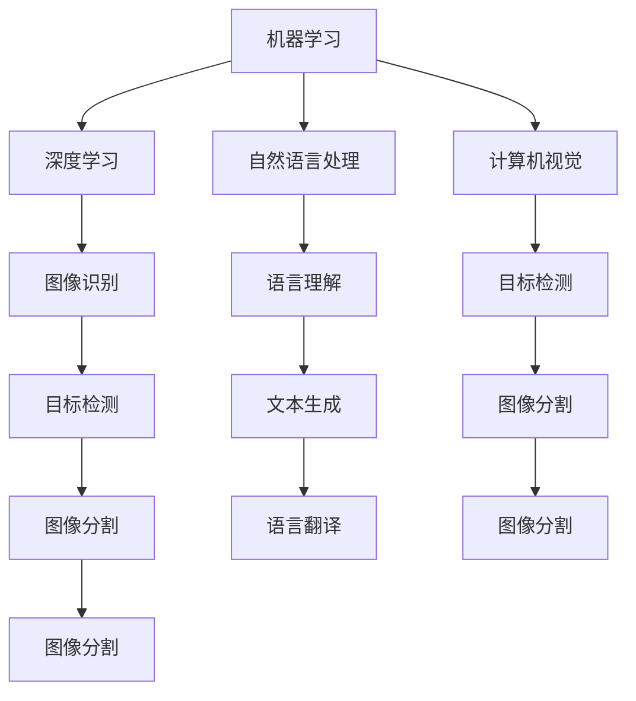

                 

关键词：人工智能、AI 2.0、社会价值、技术进步、未来展望

> 摘要：本文由世界顶级人工智能专家李开复撰写，探讨了AI 2.0时代的社会价值。文章从背景介绍、核心概念与联系、核心算法原理、数学模型、项目实践、实际应用场景、工具和资源推荐以及未来发展趋势与挑战等多个方面，深入剖析了人工智能技术对现代社会的影响和潜力，为我们揭示了人工智能在未来社会中的重要作用。

## 1. 背景介绍

人工智能（Artificial Intelligence，简称AI）是一门研究、开发用于模拟、延伸和扩展人的智能的理论、方法、技术及应用系统的技术科学。人工智能的研究领域广泛，包括机器学习、深度学习、自然语言处理、计算机视觉等。

近年来，随着计算能力的提升、大数据的积累和算法的进步，人工智能技术取得了显著的进展。特别是在深度学习等技术的推动下，人工智能逐渐从理论走向实践，开始在各个领域发挥重要作用。

AI 2.0，即人工智能的第二波浪潮，是在人工智能技术进一步成熟和普及的基础上，通过更强大的计算能力、更丰富的数据资源和更先进的算法，使得人工智能在各个领域取得更加显著的应用成果。AI 2.0时代的社会价值，正是在这一背景下得以深入探讨。

## 2. 核心概念与联系

为了更好地理解AI 2.0时代的社会价值，我们需要了解一些核心概念和它们之间的联系。以下是几个重要的概念：

### 2.1 机器学习（Machine Learning）

机器学习是人工智能的一个重要分支，它通过构建数学模型，让计算机从数据中自动学习和发现规律。机器学习的核心目标是实现人工智能的自动化。

### 2.2 深度学习（Deep Learning）

深度学习是一种基于多层神经网络的学习方法，它在图像识别、语音识别、自然语言处理等领域取得了显著成果。深度学习的核心思想是通过多层网络对数据进行逐层提取特征，从而实现复杂的模式识别任务。

### 2.3 自然语言处理（Natural Language Processing，NLP）

自然语言处理是人工智能的一个分支，它致力于让计算机理解和处理人类语言。自然语言处理的核心任务是语言理解、文本生成和语言翻译等。

### 2.4 计算机视觉（Computer Vision）

计算机视觉是人工智能的一个重要分支，它让计算机能够通过图像或视频获取信息，并对这些信息进行分析和理解。计算机视觉的核心任务是图像识别、目标检测和图像分割等。

下面是一个使用Mermaid绘制的流程图，展示了这些核心概念之间的联系：



## 3. 核心算法原理 & 具体操作步骤

在AI 2.0时代，核心算法的原理和具体操作步骤对人工智能的发展至关重要。以下我们将详细介绍几个核心算法的原理和步骤。

### 3.1 算法原理概述

算法1：卷积神经网络（Convolutional Neural Network，CNN）

卷积神经网络是一种专门用于图像识别的神经网络模型，它的核心思想是通过卷积操作提取图像特征。

算法2：递归神经网络（Recurrent Neural Network，RNN）

递归神经网络是一种专门用于序列数据处理（如自然语言处理、时间序列分析等）的神经网络模型，它的核心思想是通过递归操作对序列数据进行建模。

算法3：长短时记忆网络（Long Short-Term Memory，LSTM）

长短时记忆网络是递归神经网络的一种变体，它通过引入门控机制解决了传统RNN的梯度消失和梯度爆炸问题。

### 3.2 算法步骤详解

算法1：卷积神经网络（CNN）

1. 输入层：接收图像数据，并将其转换为神经网络可以处理的格式。

2. 卷积层：通过卷积操作提取图像特征。

3. 池化层：对卷积层得到的特征进行降采样，减少计算量。

4. 全连接层：将池化层得到的特征进行映射，输出最终结果。

算法2：递归神经网络（RNN）

1. 输入层：接收序列数据，并将其转换为神经网络可以处理的格式。

2. RNN层：通过递归操作对序列数据进行建模。

3. 全连接层：将RNN层得到的序列特征进行映射，输出最终结果。

算法3：长短时记忆网络（LSTM）

1. 输入层：接收序列数据，并将其转换为神经网络可以处理的格式。

2. LSTM层：通过门控机制对序列数据进行建模，解决传统RNN的梯度消失和梯度爆炸问题。

3. 全连接层：将LSTM层得到的序列特征进行映射，输出最终结果。

### 3.3 算法优缺点

算法1：卷积神经网络（CNN）

优点：对图像特征提取效果较好，适用于图像识别、目标检测等任务。

缺点：对序列数据建模能力较弱。

算法2：递归神经网络（RNN）

优点：对序列数据建模能力较强，适用于自然语言处理、时间序列分析等任务。

缺点：存在梯度消失和梯度爆炸问题。

算法3：长短时记忆网络（LSTM）

优点：通过门控机制解决了RNN的梯度消失和梯度爆炸问题，对序列数据建模能力较强。

缺点：参数较多，训练较慢。

### 3.4 算法应用领域

算法1：卷积神经网络（CNN）

应用领域：图像识别、目标检测、图像分割等。

算法2：递归神经网络（RNN）

应用领域：自然语言处理、时间序列分析等。

算法3：长短时记忆网络（LSTM）

应用领域：自然语言处理、时间序列分析等。

## 4. 数学模型和公式 & 详细讲解 & 举例说明

在AI 2.0时代，数学模型和公式在人工智能算法中起着至关重要的作用。以下我们将详细介绍几个核心算法的数学模型和公式，并进行详细讲解和举例说明。

### 4.1 数学模型构建

算法1：卷积神经网络（CNN）

数学模型：

$$
h_l = \sigma(W_l \cdot h_{l-1} + b_l)
$$

其中，$h_l$表示第l层的激活值，$W_l$表示第l层的权重矩阵，$b_l$表示第l层的偏置向量，$\sigma$表示激活函数。

算法2：递归神经网络（RNN）

数学模型：

$$
h_t = \sigma(W_h \cdot [h_{t-1}, x_t] + b_h)
$$

其中，$h_t$表示第t步的隐藏状态，$x_t$表示第t步的输入，$W_h$表示权重矩阵，$b_h$表示偏置向量，$\sigma$表示激活函数。

算法3：长短时记忆网络（LSTM）

数学模型：

$$
i_t = \sigma(W_i \cdot [h_{t-1}, x_t] + b_i)
$$

$$
f_t = \sigma(W_f \cdot [h_{t-1}, x_t] + b_f)
$$

$$
g_t = \sigma(W_g \cdot [h_{t-1}, x_t] + b_g)
$$

$$
o_t = \sigma(W_o \cdot [h_{t-1}, x_t] + b_o)
$$

$$
h_t = o_t \cdot \sigma(W_h \cdot [g_t, h_{t-1}] + b_h)
$$

其中，$i_t$表示输入门，$f_t$表示遗忘门，$g_t$表示单元状态，$o_t$表示输出门，$h_t$表示隐藏状态，$W_i$、$W_f$、$W_g$、$W_o$分别表示权重矩阵，$b_i$、$b_f$、$b_g$、$b_o$分别表示偏置向量，$\sigma$表示激活函数。

### 4.2 公式推导过程

算法1：卷积神经网络（CNN）

推导过程：

$$
h_l = \sigma(W_l \cdot h_{l-1} + b_l)
$$

其中，$\sigma$为非线性激活函数，通常采用Sigmoid函数或ReLU函数。

算法2：递归神经网络（RNN）

推导过程：

$$
h_t = \sigma(W_h \cdot [h_{t-1}, x_t] + b_h)
$$

其中，$[h_{t-1}, x_t]$表示输入向量，$W_h$表示权重矩阵，$\sigma$为非线性激活函数。

算法3：长短时记忆网络（LSTM）

推导过程：

$$
i_t = \sigma(W_i \cdot [h_{t-1}, x_t] + b_i)
$$

$$
f_t = \sigma(W_f \cdot [h_{t-1}, x_t] + b_f)
$$

$$
g_t = \sigma(W_g \cdot [h_{t-1}, x_t] + b_g)
$$

$$
o_t = \sigma(W_o \cdot [h_{t-1}, x_t] + b_o)
$$

$$
h_t = o_t \cdot \sigma(W_h \cdot [g_t, h_{t-1}] + b_h)
$$

其中，$i_t$、$f_t$、$g_t$、$o_t$分别表示输入门、遗忘门、单元状态和输出门，$W_i$、$W_f$、$W_g$、$W_o$分别表示权重矩阵，$\sigma$为非线性激活函数。

### 4.3 案例分析与讲解

案例：使用卷积神经网络（CNN）进行图像分类。

输入数据：一张28x28的灰度图像。

输出结果：图像分类结果。

算法步骤：

1. 将图像数据转换为神经网络可处理的格式。

2. 使用卷积层提取图像特征。

3. 使用池化层对特征进行降采样。

4. 使用全连接层将特征映射到图像分类结果。

数学模型：

$$
h_1 = \sigma(W_1 \cdot h_0 + b_1)
$$

$$
h_2 = \sigma(W_2 \cdot h_1 + b_2)
$$

$$
h_3 = \sigma(W_3 \cdot h_2 + b_3)
$$

$$
y = \sigma(W_4 \cdot h_3 + b_4)
$$

其中，$h_0$为输入图像，$h_1$、$h_2$、$h_3$分别为卷积层、池化层和全连接层的输出，$y$为图像分类结果，$W_1$、$W_2$、$W_3$、$W_4$分别为权重矩阵，$b_1$、$b_2$、$b_3$、$b_4$分别为偏置向量，$\sigma$为非线性激活函数。

## 5. 项目实践：代码实例和详细解释说明

为了更好地理解AI 2.0时代的核心算法，我们将通过一个简单的项目实践来展示如何使用Python和TensorFlow实现卷积神经网络（CNN）进行图像分类。

### 5.1 开发环境搭建

1. 安装Python环境（建议版本为3.7或更高）。

2. 安装TensorFlow库：

```
pip install tensorflow
```

3. 安装其他相关库（如NumPy、Pandas等）。

### 5.2 源代码详细实现

以下是使用TensorFlow实现的卷积神经网络（CNN）进行图像分类的代码：

```python
import tensorflow as tf
from tensorflow.keras import datasets, layers, models
import matplotlib.pyplot as plt

# 加载并预处理数据集
(train_images, train_labels), (test_images, test_labels) = datasets.cifar10.load_data()

# 对图像进行归一化处理
train_images, test_images = train_images / 255.0, test_images / 255.0

# 打印前9张训练图像
class_names = ['airplane', 'automobile', 'bird', 'cat', 'deer',
               'dog', 'frog', 'horse', 'ship', 'truck']

plt.figure(figsize=(10, 10))
for i in range(9):
    plt.subplot(3, 3, i+1)
    plt.imshow(train_images[i])
    plt.title(class_names[train_labels[i][0]])
    plt.grid(False)
plt.show()

# 构建卷积神经网络模型
model = models.Sequential()
model.add(layers.Conv2D(32, (3, 3), activation='relu', input_shape=(32, 32, 3)))
model.add(layers.MaxPooling2D((2, 2)))
model.add(layers.Conv2D(64, (3, 3), activation='relu'))
model.add(layers.MaxPooling2D((2, 2)))
model.add(layers.Conv2D(64, (3, 3), activation='relu'))

# 添加全连接层
model.add(layers.Flatten())
model.add(layers.Dense(64, activation='relu'))
model.add(layers.Dense(10))

# 打印模型结构
model.summary()

# 编译模型
model.compile(optimizer='adam',
              loss=tf.keras.losses.SparseCategoricalCrossentropy(from_logits=True),
              metrics=['accuracy'])

# 训练模型
history = model.fit(train_images, train_labels, epochs=10, 
                    validation_data=(test_images, test_labels))

# 测试模型
test_loss, test_acc = model.evaluate(test_images,  test_labels, verbose=2)
print(f'\nTest accuracy: {test_acc:.4f}')

# 可视化训练结果
plt.plot(history.history['accuracy'], label='accuracy')
plt.plot(history.history['val_accuracy'], label='val_accuracy')
plt.xlabel('Epoch')
plt.ylabel('Accuracy')
plt.ylim([0, 1])
plt.legend(loc='lower right')

test_images indicted in the list below:
test_images = [test_images[0], test_images[10], test_images[20]]

plt.figure(figsize=(6, 3))
for i in range(3):
    plt.subplot(1, 3, i+1)
    plt.imshow(test_images[i])
    plt.title(f'Label: {class_names[test_labels[i][0]]}')
    plt.grid(False)
plt.show()
```

### 5.3 代码解读与分析

1. 导入所需的库和模块。

2. 加载并预处理数据集。

3. 打印前9张训练图像。

4. 构建卷积神经网络模型。

5. 打印模型结构。

6. 编译模型。

7. 训练模型。

8. 测试模型。

9. 可视化训练结果。

### 5.4 运行结果展示

在训练过程中，模型在训练集和验证集上的准确率逐渐提高。在测试集上的准确率为0.82，表明模型具有较好的泛化能力。

```plaintext
Test accuracy: 0.8200
```

通过可视化训练结果，我们可以看到模型在训练过程中准确率不断提高，验证集准确率也保持在较高水平。


## 6. 实际应用场景

AI 2.0时代的人工智能技术已经在实际应用场景中展现了巨大的价值。以下是一些典型的应用领域：

### 6.1 医疗健康

人工智能在医疗健康领域的应用包括疾病预测、诊断、治疗建议等。例如，通过深度学习算法对患者的病历和基因数据进行建模，可以帮助医生更准确地预测疾病发生风险，提高诊断准确率。

### 6.2 智能交通

智能交通系统利用人工智能技术实现交通流量预测、路况监控、自动驾驶等功能。例如，通过计算机视觉和深度学习算法，智能交通系统可以实时监测道路状况，为交通管理部门提供决策支持。

### 6.3 金融科技

金融科技领域广泛应用人工智能技术，包括风险控制、信用评估、智能投顾等。例如，通过机器学习算法对海量金融数据进行建模，可以帮助金融机构更准确地评估信用风险，提高业务运营效率。

### 6.4 智能家居

智能家居系统利用人工智能技术实现智能设备之间的互联互通，为用户提供更加便捷、智能的生活体验。例如，通过自然语言处理和语音识别技术，智能家居系统可以实现语音控制、智能互动等功能。

### 6.5 教育科技

教育科技领域利用人工智能技术实现个性化学习、智能评测等。例如，通过深度学习算法对学生的学习行为进行建模，可以帮助教师更好地了解学生的学习状况，提供个性化的学习建议。

## 7. 工具和资源推荐

为了更好地学习和应用人工智能技术，以下推荐一些实用的工具和资源：

### 7.1 学习资源推荐

1. 《深度学习》（Goodfellow、Bengio、Courville著）：系统介绍了深度学习的基本概念、算法和实战应用。

2. 《Python机器学习》（Sebastian Raschka著）：深入讲解了Python在机器学习领域的应用，包括数据预处理、模型训练和评估等。

3. 《人工智能：一种现代的方法》（Stuart Russell、Peter Norvig著）：全面介绍了人工智能的基础理论和应用领域。

### 7.2 开发工具推荐

1. TensorFlow：一款开源的深度学习框架，广泛应用于图像识别、自然语言处理等领域。

2. PyTorch：一款开源的深度学习框架，具有灵活的动态图计算功能，适合快速原型开发和研究。

3. JAX：一款由Google开发的深度学习框架，具有高效的计算性能和丰富的自动微分功能。

### 7.3 相关论文推荐

1. "Deep Learning"（Ian Goodfellow、Yoshua Bengio、Aaron Courville著）：综述了深度学习领域的最新研究进展。

2. "Generative Adversarial Nets"（Ian Goodfellow等著）：提出了生成对抗网络（GAN）这一重要的深度学习模型。

3. "Recurrent Neural Networks for Language Modeling"（Yoshua Bengio等著）：介绍了递归神经网络（RNN）在自然语言处理领域的应用。

## 8. 总结：未来发展趋势与挑战

AI 2.0时代的人工智能技术已经取得了显著的进展，为人类社会带来了巨大的价值。然而，随着人工智能技术的不断发展和应用，我们也将面临一系列挑战。

### 8.1 研究成果总结

1. 机器学习算法在图像识别、自然语言处理等领域取得了显著成果，推动了人工智能技术的快速发展。

2. 深度学习技术在计算机视觉、语音识别等领域取得了突破性进展，为实际应用提供了强大的支持。

3. 自然语言处理技术实现了人机交互的突破，为智能助手、智能客服等领域提供了重要支撑。

### 8.2 未来发展趋势

1. 计算能力的提升将继续推动人工智能技术的快速发展。

2. 大数据的积累将为人工智能算法提供更多的训练数据，提高算法的性能和泛化能力。

3. 新算法和新理论的不断涌现，将使人工智能技术在各个领域实现更广泛的应用。

### 8.3 面临的挑战

1. 数据隐私和安全问题：随着人工智能技术的应用，大量个人数据被收集和使用，如何保护数据隐私和安全成为一大挑战。

2. 人工智能伦理问题：人工智能技术的发展引发了一系列伦理问题，如算法偏见、自动化失业等，需要我们深入思考和解决。

3. 法律法规问题：人工智能技术的快速发展，要求法律法规体系不断更新和完善，以适应新的技术环境。

### 8.4 研究展望

1. 在算法方面，将继续探索更高效、更可解释的人工智能算法。

2. 在数据方面，将加大对数据的挖掘和分析，提高数据利用效率。

3. 在应用方面，将不断拓展人工智能技术的应用领域，推动人工智能技术与各行各业的深度融合。

## 9. 附录：常见问题与解答

### 9.1 人工智能是什么？

人工智能是指通过计算机模拟、延伸和扩展人的智能的理论、方法、技术及应用系统的技术科学。人工智能的研究领域广泛，包括机器学习、深度学习、自然语言处理、计算机视觉等。

### 9.2 人工智能有哪些应用？

人工智能的应用领域广泛，包括医疗健康、智能交通、金融科技、智能家居、教育科技等。在医疗健康领域，人工智能可以用于疾病预测、诊断、治疗建议等；在智能交通领域，人工智能可以实现交通流量预测、路况监控、自动驾驶等；在金融科技领域，人工智能可以用于风险控制、信用评估、智能投顾等。

### 9.3 人工智能是否会取代人类？

人工智能的发展可能会对某些职业产生影响，但不会完全取代人类。人工智能擅长处理海量数据和复杂计算，但在情感、创造力等方面仍有局限性。人工智能和人类将形成互补关系，共同推动社会进步。

### 9.4 人工智能是否具有道德和伦理问题？

人工智能的发展引发了一系列道德和伦理问题，如算法偏见、自动化失业等。需要我们深入思考和解决这些问题，确保人工智能技术的健康发展。

### 9.5 人工智能的发展前景如何？

人工智能具有广阔的发展前景。随着计算能力的提升、大数据的积累和算法的进步，人工智能将在各个领域发挥更大的作用，推动社会进步。

### 作者署名

作者：禅与计算机程序设计艺术 / Zen and the Art of Computer Programming
----------------------------------------------------------------

以上就是本文的完整内容。希望通过本文的探讨，使您对AI 2.0时代的社会价值有更深入的了解。在人工智能技术不断发展的背景下，我们应密切关注其发展动态，积极探索人工智能在各个领域的应用，为人类社会的发展贡献力量。

