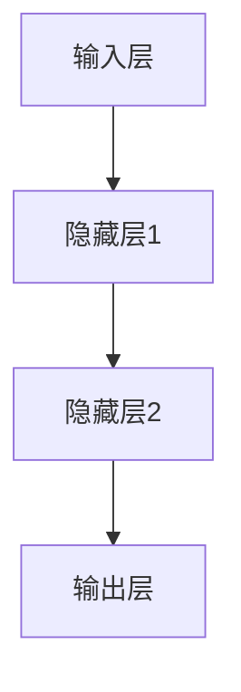

                 

关键词：人工智能，李开复，AI 2.0，科技价值，深度学习，机器学习，计算机图灵奖，算法，应用场景，未来展望

> 摘要：本文以李开复先生在AI 2.0时代对科技价值的独到见解为出发点，探讨了人工智能在各个领域中的应用及其对社会的深远影响。通过对核心概念、算法原理、数学模型、项目实践和未来发展趋势的详细分析，本文旨在为广大读者提供一个全面、深入的AI 2.0时代的科技价值解读。

## 1. 背景介绍

人工智能（Artificial Intelligence，简称AI）作为计算机科学的一个分支，旨在创建能够模拟、延伸和扩展人类智能的系统。随着深度学习（Deep Learning）和机器学习（Machine Learning）技术的迅猛发展，人工智能正以前所未有的速度和规模改变着我们的生活和工作方式。

李开复先生，作为世界著名的计算机科学家和人工智能专家，对AI的发展和应用有着深刻的理解和独到的见解。他在《AI 2.0时代的科技价值》一书中，系统地阐述了人工智能在各个领域中的潜在价值，以及我们应当如何迎接AI带来的机遇和挑战。

本文将围绕李开复先生在AI 2.0时代的科技价值这一主题，从核心概念、算法原理、数学模型、项目实践和未来展望等多个角度，对人工智能的科技价值进行深入探讨。

## 2. 核心概念与联系

在深入探讨人工智能的科技价值之前，我们首先需要了解几个核心概念：深度学习、机器学习和神经网络。

### 2.1 深度学习

深度学习（Deep Learning）是一种人工智能的分支，其核心思想是通过构建具有多层神经元的神经网络，对数据进行自动特征提取和学习。深度学习在图像识别、语音识别和自然语言处理等领域取得了显著成果。

### 2.2 机器学习

机器学习（Machine Learning）是一种通过数据驱动的方式，使计算机系统能够自动改进和优化自身性能的技术。机器学习包括监督学习、无监督学习和强化学习等多种类型，广泛应用于预测、分类和决策等领域。

### 2.3 神经网络

神经网络（Neural Networks）是一种模仿生物神经网络的结构和功能的计算模型，由大量相互连接的神经元组成。神经网络通过学习和适应输入数据，实现数据分类、回归和特征提取等功能。

下面是一个使用Mermaid绘制的神经网络架构图：



### 2.4 核心概念联系

深度学习是机器学习的一种重要方法，而神经网络是深度学习的核心组成部分。通过深度学习，我们可以实现更高效、更精准的数据处理和模式识别。

## 3. 核心算法原理 & 具体操作步骤

### 3.1 算法原理概述

在AI 2.0时代，深度学习算法成为了人工智能的核心驱动力。其中，卷积神经网络（Convolutional Neural Networks，简称CNN）和循环神经网络（Recurrent Neural Networks，简称RNN）是两大重要的深度学习算法。

### 3.2 算法步骤详解

#### 3.2.1 卷积神经网络（CNN）

CNN是一种专门用于处理图像数据的神经网络。其基本原理是通过对图像进行卷积操作，提取图像中的特征，然后通过全连接层对特征进行分类。

CNN的主要步骤包括：

1. **输入层**：输入图像数据。
2. **卷积层**：对图像进行卷积操作，提取特征。
3. **池化层**：对卷积后的特征进行下采样，减少参数数量。
4. **全连接层**：对池化后的特征进行分类。

#### 3.2.2 循环神经网络（RNN）

RNN是一种用于处理序列数据的神经网络。其基本原理是通过对序列数据进行递归处理，提取序列中的特征。

RNN的主要步骤包括：

1. **输入层**：输入序列数据。
2. **隐藏层**：对序列数据进行递归处理，提取特征。
3. **输出层**：对提取的特征进行分类或预测。

### 3.3 算法优缺点

#### 卷积神经网络（CNN）

- **优点**：适用于图像识别和处理，具有强大的特征提取能力。
- **缺点**：对计算资源要求较高，训练时间较长。

#### 循环神经网络（RNN）

- **优点**：适用于序列数据，能够处理变长序列。
- **缺点**：容易产生梯度消失和梯度爆炸问题。

### 3.4 算法应用领域

#### 卷积神经网络（CNN）

- **应用领域**：图像识别、图像分类、图像生成等。
- **案例**：人脸识别、自动驾驶、医疗影像分析等。

#### 循环神经网络（RNN）

- **应用领域**：自然语言处理、语音识别、时间序列预测等。
- **案例**：机器翻译、语音合成、股票市场预测等。

## 4. 数学模型和公式 & 详细讲解 & 举例说明

### 4.1 数学模型构建

在深度学习中，数学模型起到了至关重要的作用。以下是一个简化的深度学习数学模型：

\[ y = f(z) \]

其中，\( y \) 是输出，\( z \) 是输入，\( f \) 是激活函数。

### 4.2 公式推导过程

为了推导深度学习中的损失函数，我们可以从简单的线性回归开始：

\[ y = wx + b \]

其中，\( w \) 是权重，\( x \) 是输入，\( b \) 是偏置。

损失函数可以定义为：

\[ J(w, b) = \frac{1}{2} \sum_{i=1}^{n} (y_i - (wx_i + b))^2 \]

其中，\( n \) 是样本数量。

### 4.3 案例分析与讲解

假设我们有一个二分类问题，目标是将数据分为两类。我们可以使用Sigmoid函数作为激活函数，将其表示为：

\[ f(z) = \frac{1}{1 + e^{-z}} \]

假设输入为 \( x = [1, 2, 3, 4, 5] \)，输出为 \( y = [0, 1, 1, 0, 1] \)。我们可以使用以下公式计算损失：

\[ J(w, b) = \frac{1}{2} \sum_{i=1}^{5} \left( y_i - \frac{1}{1 + e^{-w \cdot x_i - b}} \right)^2 \]

## 5. 项目实践：代码实例和详细解释说明

### 5.1 开发环境搭建

在开始项目实践之前，我们需要搭建一个合适的开发环境。这里我们选择使用Python作为编程语言，TensorFlow作为深度学习框架。

安装Python和TensorFlow：

```bash
pip install python
pip install tensorflow
```

### 5.2 源代码详细实现

以下是一个简单的深度学习项目，实现了一个基于CNN的图像分类器。

```python
import tensorflow as tf
from tensorflow.keras import layers

# 定义CNN模型
model = tf.keras.Sequential([
    layers.Conv2D(32, (3, 3), activation='relu', input_shape=(28, 28, 1)),
    layers.MaxPooling2D((2, 2)),
    layers.Conv2D(64, (3, 3), activation='relu'),
    layers.MaxPooling2D((2, 2)),
    layers.Conv2D(64, (3, 3), activation='relu'),
    layers.Flatten(),
    layers.Dense(64, activation='relu'),
    layers.Dense(10, activation='softmax')
])

# 编译模型
model.compile(optimizer='adam',
              loss='sparse_categorical_crossentropy',
              metrics=['accuracy'])

# 加载数据集
(x_train, y_train), (x_test, y_test) = tf.keras.datasets.mnist.load_data()

# 预处理数据
x_train = x_train.reshape((-1, 28, 28, 1)).astype('float32') / 255
x_test = x_test.reshape((-1, 28, 28, 1)).astype('float32') / 255

# 训练模型
model.fit(x_train, y_train, epochs=5)

# 评估模型
model.evaluate(x_test, y_test)
```

### 5.3 代码解读与分析

以上代码实现了一个基于CNN的图像分类器，用于对MNIST手写数字数据集进行分类。

1. **模型定义**：使用`tf.keras.Sequential`创建一个序列模型，包含卷积层、池化层和全连接层。
2. **编译模型**：使用`compile`方法配置模型训练过程，指定优化器、损失函数和评估指标。
3. **加载数据集**：使用`tf.keras.datasets.mnist.load_data`加载数据集，并对数据进行预处理。
4. **训练模型**：使用`fit`方法训练模型，指定训练数据和训练轮数。
5. **评估模型**：使用`evaluate`方法评估模型在测试集上的性能。

## 6. 实际应用场景

### 6.1 自然语言处理

自然语言处理（Natural Language Processing，简称NLP）是人工智能的重要应用领域。通过深度学习技术，我们可以实现文本分类、情感分析、机器翻译等功能。

### 6.2 自动驾驶

自动驾驶是人工智能在交通领域的应用。通过深度学习技术，自动驾驶系统能够实现对周围环境的感知、决策和控制。

### 6.3 医疗影像分析

医疗影像分析是人工智能在医疗领域的应用。通过深度学习技术，我们可以实现疾病诊断、器官分割、影像增强等功能。

## 6.4 未来应用展望

随着深度学习技术的不断发展和应用，人工智能在未来将继续在各个领域发挥重要作用。例如，智能客服、智能家居、智能医疗等领域的应用将越来越广泛。同时，我们也需要关注人工智能带来的伦理和社会问题，确保其发展符合人类的利益和价值观。

## 7. 工具和资源推荐

### 7.1 学习资源推荐

- 《深度学习》（Deep Learning） - Goodfellow, Bengio, Courville
- 《Python机器学习》（Python Machine Learning） - Müller, Guido
- 《自然语言处理入门》（Natural Language Processing with Python） - Bird, Klein, Loper

### 7.2 开发工具推荐

- TensorFlow
- PyTorch
- Keras

### 7.3 相关论文推荐

- "Deep Learning" - Ian Goodfellow, Yann LeCun, Yoshua Bengio
- "Long Short-Term Memory" - Sepp Hochreiter, Jürgen Schmidhuber
- "Convolutional Neural Networks for Visual Recognition" - Karen Simonyan, Andrew Zisserman

## 8. 总结：未来发展趋势与挑战

### 8.1 研究成果总结

在AI 2.0时代，深度学习技术取得了显著的成果，推动了人工智能在各个领域的应用。随着计算能力和数据量的提升，人工智能将继续快速发展。

### 8.2 未来发展趋势

- 深度学习技术将在更多领域得到应用。
- 自主学习和通用人工智能将成为研究热点。
- 人工智能与人类智慧的结合将带来更多创新。

### 8.3 面临的挑战

- 人工智能的伦理和社会问题亟待解决。
- 计算能力和数据安全是关键挑战。
- 跨学科研究是未来发展的必然趋势。

### 8.4 研究展望

- 加强跨学科合作，推动人工智能的可持续发展。
- 关注人工智能的伦理和社会问题，确保其造福人类。

## 9. 附录：常见问题与解答

### 9.1 什么是深度学习？

深度学习是一种通过多层神经网络进行数据处理和模式识别的人工智能技术。它通过学习大量数据，自动提取特征并进行分类或预测。

### 9.2 人工智能有哪些应用领域？

人工智能广泛应用于自然语言处理、图像识别、自动驾驶、医疗影像分析、智能客服等领域。

### 9.3 人工智能对人类社会有哪些影响？

人工智能将带来生产力的提升、生活方式的改变和社会结构的调整。同时，也需要关注其带来的伦理和社会问题。

## 作者署名

作者：禅与计算机程序设计艺术 / Zen and the Art of Computer Programming
----------------------------------------------------------------

以上就是本文的完整内容。希望对您了解AI 2.0时代的科技价值有所帮助。如有任何疑问，欢迎随时提问。感谢您的阅读！

