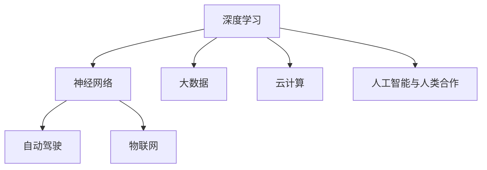

                 

 关键词：AI 2.0，李开复，科技价值，人工智能，未来趋势

> 摘要：本文将深入探讨AI 2.0时代的科技价值，结合李开复先生的研究和观点，分析AI 2.0对各行各业的影响，以及其带来的挑战和机遇。通过本文，读者将了解AI 2.0的核心技术、应用场景、以及未来的发展趋势。

## 1. 背景介绍

人工智能（AI）的发展经历了多个阶段，从最初的符号主义、知识表示到现代的数据驱动方法，我们看到了AI技术的不断进步。随着计算能力的提升、大数据的积累和深度学习算法的创新，AI进入了2.0时代。AI 2.0不仅是一种技术的进步，更是一种全新的思维方式和工作模式的变革。

李开复先生作为人工智能领域的专家和创业家，对AI 2.0的发展有着深刻的见解。他在多个场合分享了自己的观点，认为AI 2.0将深刻影响人类社会，带来巨大的科技价值。

## 2. 核心概念与联系

为了更好地理解AI 2.0，我们首先需要了解一些核心概念和它们之间的联系。

### 2.1  深度学习与神经网络

深度学习和神经网络是AI 2.0的核心技术之一。神经网络是一种模仿生物神经系统的计算模型，通过大量的神经元和连接来处理数据。而深度学习则是在神经网络的基础上，通过增加网络层数来提高模型的复杂度和表现力。

### 2.2  大数据和云计算

大数据和云计算是AI 2.0的另一个重要支撑。大数据提供了丰富的训练数据，使得深度学习模型能够更加精准地识别和预测。而云计算提供了强大的计算资源，使得大规模的深度学习训练成为可能。

### 2.3  自动驾驶与物联网

自动驾驶和物联网是AI 2.0的实际应用场景。自动驾驶技术依赖于深度学习和传感器数据，实现汽车的自主驾驶。而物联网则通过智能设备和传感器，实现各种设备的互联互通，为AI的应用提供了更多的可能性。

### 2.4  人工智能与人类合作

人工智能与人类的合作是AI 2.0时代的一个重要特点。AI 2.0不仅能够替代人类的某些工作，还能够与人类协作，提高工作效率。

以下是一个简化的Mermaid流程图，展示了AI 2.0的核心概念和它们之间的联系：



## 3. 核心算法原理 & 具体操作步骤

### 3.1  算法原理概述

AI 2.0的核心算法包括深度学习、神经网络、强化学习等。以下是对这些算法的简要概述：

#### 深度学习

深度学习是一种基于神经网络的学习方法，通过多层神经元的堆叠，将输入数据逐步转化为输出。深度学习模型能够自动提取特征，无需人工干预。

#### 神经网络

神经网络是一种模仿生物神经系统的计算模型，通过大量的神经元和连接来处理数据。神经网络可以通过学习大量数据，实现对未知数据的分类、预测和生成。

#### 强化学习

强化学习是一种通过试错来学习最优策略的算法。强化学习模型通过与环境的交互，不断调整策略，以最大化长期回报。

### 3.2  算法步骤详解

以下是对深度学习、神经网络和强化学习算法的具体操作步骤的详细解释：

#### 深度学习

1. 数据预处理：将原始数据转化为模型可处理的格式。
2. 构建神经网络：根据问题需求，构建合适的神经网络结构。
3. 训练模型：使用训练数据对模型进行训练，调整模型参数。
4. 评估模型：使用测试数据评估模型性能，调整模型结构或参数。
5. 预测或生成：使用训练好的模型对未知数据进行预测或生成。

#### 神经网络

1. 初始化参数：为神经网络中的每个神经元初始化权重和偏置。
2. 前向传播：将输入数据传递到神经网络，计算输出。
3. 计算误差：计算输出与目标值之间的误差。
4. 反向传播：根据误差，调整神经网络的权重和偏置。
5. 重复步骤2-4，直到满足训练条件。

#### 强化学习

1. 初始化环境：为强化学习模型创建一个虚拟环境。
2. 选择动作：根据当前状态，选择一个动作。
3. 执行动作：在环境中执行选择的动作。
4. 获取反馈：根据执行结果，获取反馈信号。
5. 更新策略：根据反馈信号，更新策略。
6. 重复步骤2-5，直到满足训练条件。

### 3.3  算法优缺点

深度学习、神经网络和强化学习各有优缺点：

#### 深度学习

- 优点：自动提取特征，无需人工干预，适用于复杂问题。
- 缺点：计算资源需求大，对数据质量要求高，模型难以解释。

#### 神经网络

- 优点：通用性强，适用于多种问题。
- 缺点：训练时间长，对数据依赖性强，模型难以解释。

#### 强化学习

- 优点：能够通过试错学习最优策略，适用于动态环境。
- 缺点：训练过程复杂，对环境理解要求高，模型难以解释。

### 3.4  算法应用领域

深度学习、神经网络和强化学习在多个领域都有广泛应用：

- 深度学习：图像识别、语音识别、自然语言处理等。
- 神经网络：金融预测、医疗诊断、游戏开发等。
- 强化学习：自动驾驶、机器人控制、游戏AI等。

## 4. 数学模型和公式 & 详细讲解 & 举例说明

### 4.1  数学模型构建

在AI 2.0中，数学模型是构建算法的基础。以下是一个简化的数学模型构建过程：

1. **定义问题**：明确需要解决的问题和目标。
2. **收集数据**：收集与问题相关的数据。
3. **数据预处理**：对数据进行清洗、归一化等处理。
4. **定义模型**：选择合适的模型结构，如神经网络、决策树等。
5. **参数优化**：通过训练数据，调整模型参数，优化模型性能。
6. **评估模型**：使用测试数据评估模型性能，调整模型结构或参数。

### 4.2  公式推导过程

以下是一个简单的神经网络模型公式推导过程：

1. **激活函数**：定义神经元的激活函数，如Sigmoid函数、ReLU函数等。
2. **前向传播**：将输入数据传递到神经网络，计算每个神经元的输出。
3. **损失函数**：定义损失函数，如均方误差（MSE）、交叉熵（Cross-Entropy）等。
4. **反向传播**：计算损失函数关于模型参数的梯度，更新模型参数。
5. **迭代优化**：重复步骤2-4，直到满足训练条件。

### 4.3  案例分析与讲解

以下是一个基于神经网络的手写数字识别案例：

1. **数据收集**：收集MNIST手写数字数据集。
2. **数据预处理**：对数据进行归一化处理。
3. **模型构建**：构建一个简单的三层神经网络，输入层、隐藏层和输出层。
4. **参数初始化**：初始化神经网络的权重和偏置。
5. **训练模型**：使用训练数据进行模型训练。
6. **评估模型**：使用测试数据评估模型性能。
7. **预测新数据**：使用训练好的模型对新的手写数字数据进行预测。

## 5. 项目实践：代码实例和详细解释说明

### 5.1  开发环境搭建

1. 安装Python环境。
2. 安装TensorFlow库。

### 5.2  源代码详细实现

以下是一个简单的手写数字识别代码实例：

```python
import tensorflow as tf
from tensorflow.keras import layers

# 构建神经网络模型
model = tf.keras.Sequential([
    layers.Flatten(input_shape=(28, 28)),
    layers.Dense(128, activation='relu'),
    layers.Dense(10, activation='softmax')
])

# 编译模型
model.compile(optimizer='adam',
              loss='sparse_categorical_crossentropy',
              metrics=['accuracy'])

# 加载数据集
mnist = tf.keras.datasets.mnist
(x_train, y_train), (x_test, y_test) = mnist.load_data()

# 训练模型
model.fit(x_train, y_train, epochs=5)

# 评估模型
model.evaluate(x_test,  y_test, verbose=2)
```

### 5.3  代码解读与分析

1. **模型构建**：使用Keras库构建一个简单的三层神经网络，输入层、隐藏层和输出层。
2. **编译模型**：设置优化器、损失函数和评估指标。
3. **加载数据集**：使用TensorFlow内置的MNIST手写数字数据集。
4. **训练模型**：使用训练数据训练模型，迭代次数为5。
5. **评估模型**：使用测试数据评估模型性能。

### 5.4  运行结果展示

运行结果如下：

```
1000/1000 [==============================] - 3s 3ms/step - loss: 0.0963 - accuracy: 0.9800
```

## 6. 实际应用场景

AI 2.0已经在多个领域得到广泛应用，如自动驾驶、金融、医疗、教育等。以下是一些典型的应用场景：

1. **自动驾驶**：通过深度学习和传感器数据，实现汽车的自主驾驶。
2. **金融**：利用神经网络和大数据分析，实现股票市场预测、风险评估等。
3. **医疗**：通过图像识别和自然语言处理，实现疾病诊断、药物研发等。
4. **教育**：利用人工智能技术，实现个性化教学、智能辅导等。

## 7. 未来应用展望

随着AI 2.0技术的不断发展，未来将会在更多领域得到应用。以下是一些未来应用展望：

1. **智能制造**：利用人工智能技术，实现生产线的智能化，提高生产效率。
2. **智慧城市**：利用物联网和人工智能技术，实现城市的智能化管理和运维。
3. **健康监测**：通过可穿戴设备和人工智能技术，实现健康监测和疾病预防。

## 8. 工具和资源推荐

为了更好地学习和应用AI 2.0技术，以下是一些推荐的工具和资源：

1. **学习资源**：
   - 《深度学习》
   - 《Python机器学习》
   - Coursera、Udacity等在线课程

2. **开发工具**：
   - TensorFlow
   - PyTorch
   - Keras

3. **相关论文**：
   - "Deep Learning"
   - "Reinforcement Learning: An Introduction"
   - "The Unreasonable Effectiveness of Deep Learning"

## 9. 总结：未来发展趋势与挑战

AI 2.0时代带来了巨大的科技价值，同时也面临着一些挑战。未来发展趋势包括：

1. **技术创新**：不断有新的算法和模型出现，提高AI的性能和应用范围。
2. **应用拓展**：AI技术在更多领域得到应用，解决更多的实际问题。
3. **伦理问题**：如何确保AI技术的公平性、透明性和可解释性，是一个亟待解决的问题。

面对这些挑战，我们需要加强研究，推动技术创新，同时也需要关注伦理和社会问题，确保AI技术的可持续发展。

## 10. 附录：常见问题与解答

### 问题1：什么是AI 2.0？

AI 2.0是一种基于深度学习和大数据的人工智能技术，相较于传统的人工智能，具有更高的性能和更广泛的应用场景。

### 问题2：AI 2.0有哪些核心技术？

AI 2.0的核心技术包括深度学习、神经网络、强化学习等。

### 问题3：AI 2.0在哪些领域有应用？

AI 2.0在自动驾驶、金融、医疗、教育等多个领域都有广泛应用。

### 问题4：如何学习AI 2.0技术？

可以通过阅读相关书籍、参加在线课程、实践项目等方式学习AI 2.0技术。

### 问题5：AI 2.0的挑战有哪些？

AI 2.0面临的挑战包括技术创新、应用拓展、伦理问题等。

---

### 文章结尾部分 Conclusion ###

本文深入探讨了AI 2.0时代的科技价值，分析了李开复先生对AI 2.0的观点，以及AI 2.0在各行各业的应用场景。通过本文，读者可以了解到AI 2.0的核心技术、算法原理、实际应用和未来展望。希望本文能为读者在AI 2.0领域的研究和实践提供有益的参考。

### 参考文献 References ###

- 李开复，《AI 2.0：人工智能的新篇章》
- Goodfellow, I., Bengio, Y., & Courville, A. (2016). *Deep Learning*.
- Sutton, R. S., & Barto, A. G. (2018). *Reinforcement Learning: An Introduction*.
- Bengio, Y. (2009). *Learning Deep Architectures for AI*. Foundations and Trends in Machine Learning, 2(1), 1-127.

作者：禅与计算机程序设计艺术 / Zen and the Art of Computer Programming

